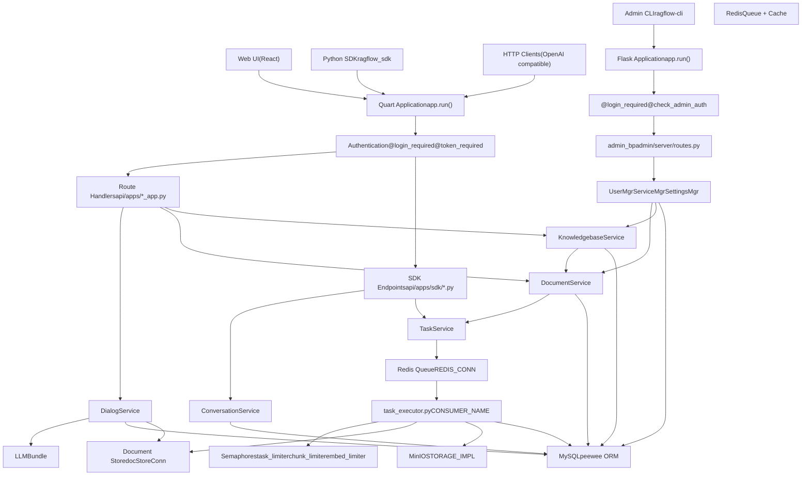
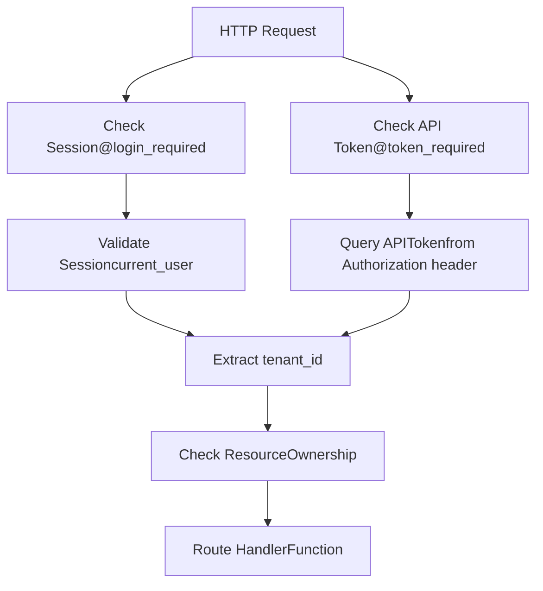
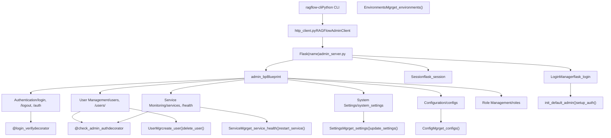
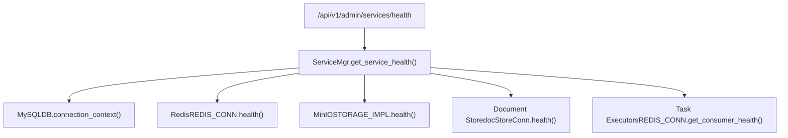
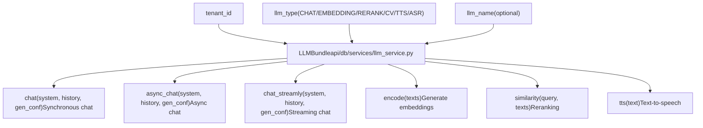
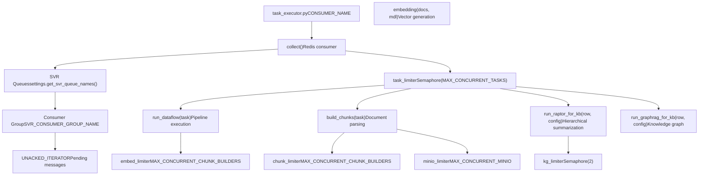
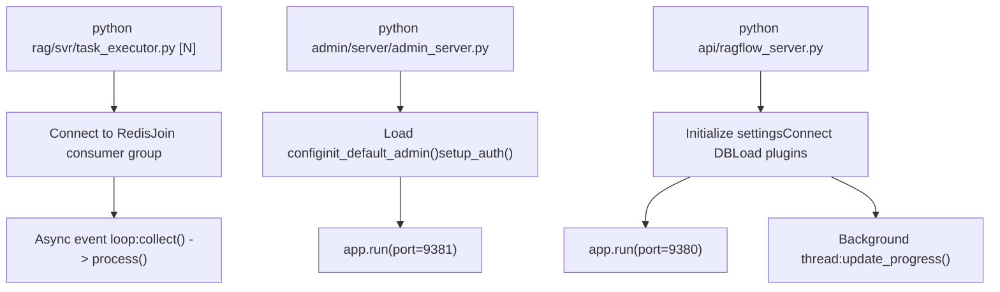

# Core Application Services

Relevant source files

-   [admin/client/README.md](https://github.com/infiniflow/ragflow/blob/80a16e71/admin/client/README.md)
-   [admin/client/http\_client.py](https://github.com/infiniflow/ragflow/blob/80a16e71/admin/client/http_client.py)
-   [admin/client/parser.py](https://github.com/infiniflow/ragflow/blob/80a16e71/admin/client/parser.py)
-   [admin/client/pyproject.toml](https://github.com/infiniflow/ragflow/blob/80a16e71/admin/client/pyproject.toml)
-   [admin/client/ragflow\_cli.py](https://github.com/infiniflow/ragflow/blob/80a16e71/admin/client/ragflow_cli.py)
-   [admin/client/ragflow\_client.py](https://github.com/infiniflow/ragflow/blob/80a16e71/admin/client/ragflow_client.py)
-   [admin/client/user.py](https://github.com/infiniflow/ragflow/blob/80a16e71/admin/client/user.py)
-   [admin/server/admin\_server.py](https://github.com/infiniflow/ragflow/blob/80a16e71/admin/server/admin_server.py)
-   [admin/server/auth.py](https://github.com/infiniflow/ragflow/blob/80a16e71/admin/server/auth.py)
-   [admin/server/config.py](https://github.com/infiniflow/ragflow/blob/80a16e71/admin/server/config.py)
-   [admin/server/routes.py](https://github.com/infiniflow/ragflow/blob/80a16e71/admin/server/routes.py)
-   [admin/server/services.py](https://github.com/infiniflow/ragflow/blob/80a16e71/admin/server/services.py)
-   [api/apps/chunk\_app.py](https://github.com/infiniflow/ragflow/blob/80a16e71/api/apps/chunk_app.py)
-   [api/apps/conversation\_app.py](https://github.com/infiniflow/ragflow/blob/80a16e71/api/apps/conversation_app.py)
-   [api/apps/document\_app.py](https://github.com/infiniflow/ragflow/blob/80a16e71/api/apps/document_app.py)
-   [api/apps/file2document\_app.py](https://github.com/infiniflow/ragflow/blob/80a16e71/api/apps/file2document_app.py)
-   [api/apps/file\_app.py](https://github.com/infiniflow/ragflow/blob/80a16e71/api/apps/file_app.py)
-   [api/apps/kb\_app.py](https://github.com/infiniflow/ragflow/blob/80a16e71/api/apps/kb_app.py)
-   [api/constants.py](https://github.com/infiniflow/ragflow/blob/80a16e71/api/constants.py)
-   [api/db/db\_models.py](https://github.com/infiniflow/ragflow/blob/80a16e71/api/db/db_models.py)
-   [api/db/services/dialog\_service.py](https://github.com/infiniflow/ragflow/blob/80a16e71/api/db/services/dialog_service.py)
-   [api/db/services/document\_service.py](https://github.com/infiniflow/ragflow/blob/80a16e71/api/db/services/document_service.py)
-   [api/db/services/file\_service.py](https://github.com/infiniflow/ragflow/blob/80a16e71/api/db/services/file_service.py)
-   [api/db/services/knowledgebase\_service.py](https://github.com/infiniflow/ragflow/blob/80a16e71/api/db/services/knowledgebase_service.py)
-   [api/db/services/system\_settings\_service.py](https://github.com/infiniflow/ragflow/blob/80a16e71/api/db/services/system_settings_service.py)
-   [api/db/services/task\_service.py](https://github.com/infiniflow/ragflow/blob/80a16e71/api/db/services/task_service.py)
-   [api/ragflow\_server.py](https://github.com/infiniflow/ragflow/blob/80a16e71/api/ragflow_server.py)
-   [api/utils/configs.py](https://github.com/infiniflow/ragflow/blob/80a16e71/api/utils/configs.py)
-   [api/utils/health\_utils.py](https://github.com/infiniflow/ragflow/blob/80a16e71/api/utils/health_utils.py)
-   [common/connection\_utils.py](https://github.com/infiniflow/ragflow/blob/80a16e71/common/connection_utils.py)
-   [conf/system\_settings.json](https://github.com/infiniflow/ragflow/blob/80a16e71/conf/system_settings.json)
-   [rag/nlp/search.py](https://github.com/infiniflow/ragflow/blob/80a16e71/rag/nlp/search.py)
-   [rag/svr/task\_executor.py](https://github.com/infiniflow/ragflow/blob/80a16e71/rag/svr/task_executor.py)

This document details RAGFlow's core application services layer, comprising two HTTP servers ([api/ragflow\_server.py](https://github.com/infiniflow/ragflow/blob/80a16e71/api/ragflow_server.py) and [admin/server/admin\_server.py](https://github.com/infiniflow/ragflow/blob/80a16e71/admin/server/admin_server.py)), asynchronous task execution workers, and business logic service layer. These components form the backbone of RAGFlow's request handling, document processing, RAG operations, and system administration.

For information about data storage architecture, see [Data Storage Architecture](/infiniflow/ragflow/3.2-data-storage-architecture). For task queue implementation details, see [Task Execution and Queue System](/infiniflow/ragflow/3.3-task-execution-and-queue-system).

## System Architecture Overview

RAGFlow's core application services consist of two independent HTTP servers and a pool of background workers:


**Diagram: Core Application Services Architecture - Two Servers and Background Workers**

Sources: [api/ragflow\_server.py](https://github.com/infiniflow/ragflow/blob/80a16e71/api/ragflow_server.py) [admin/server/admin\_server.py](https://github.com/infiniflow/ragflow/blob/80a16e71/admin/server/admin_server.py) [rag/svr/task\_executor.py1-128](https://github.com/infiniflow/ragflow/blob/80a16e71/rag/svr/task_executor.py#L1-L128) [api/apps/\_\_init\_\_.py](https://github.com/infiniflow/ragflow/blob/80a16e71/api/apps/__init__.py) [api/db/services/dialog\_service.py1-50](https://github.com/infiniflow/ragflow/blob/80a16e71/api/db/services/dialog_service.py#L1-L50) [api/db/services/document\_service.py1-47](https://github.com/infiniflow/ragflow/blob/80a16e71/api/db/services/document_service.py#L1-L47) [admin/server/routes.py1-50](https://github.com/infiniflow/ragflow/blob/80a16e71/admin/server/routes.py#L1-L50)

### Key Responsibilities

| Layer | Components | Primary Responsibilities |
| --- | --- | --- |
| **RAGFlow Server** | Quart app (port 9380), route handlers | RAG operations, chat, dataset management, API endpoints |
| **Admin Server** | Flask app (port 9381), admin routes | User management, system monitoring, health checks, settings |
| **Service Layer** | Business logic services | Database operations, business rules, data validation |
| **Task Execution** | Background workers | Asynchronous processing, document parsing, embedding generation |
| **Data Layer** | MySQL, MinIO, Redis, Document Store | Persistent storage, caching, message queuing |

Sources: [api/ragflow\_server.py148-151](https://github.com/infiniflow/ragflow/blob/80a16e71/api/ragflow_server.py#L148-L151) [admin/server/admin\_server.py82-89](https://github.com/infiniflow/ragflow/blob/80a16e71/admin/server/admin_server.py#L82-L89)

## RAGFlow Server (api/ragflow\_server.py)

The main API server is built on Quart (async Flask) and handles all RAG-related HTTP requests. It provides RESTful endpoints for the web UI, Python SDK, and OpenAI-compatible API clients. The server runs on port 9380 by default.

### Application Initialization

The main application is initialized in [api/ragflow\_server.py](https://github.com/infiniflow/ragflow/blob/80a16e71/api/ragflow_server.py) and registers multiple Blueprint modules:

```mermaid
flowchart TD
    Server["ragflow_server.pycreate_app()"]
    UserApp["user_app/user"]
    KBApp["kb_app/kb"]
    DocApp["document_app/document"]
    DialogApp["dialog_app/dialog"]
    ConvApp["conversation_app/conversation"]
    ChunkApp["chunk_app/chunk"]
    FileApp["file_app/file"]
    SDKDataset["sdk.dataset/api/v1/datasets"]
    SDKDoc["sdk.doc/api/v1/datasets/{id}/documents"]
    SDKChat["sdk.chat/api/v1/chats"]
    SDKSession["sdk.session/api/v1/chats/{id}/sessions"]
    SDKRetrieval["sdk.dify_retrieval/api/retrieval"]

    Server --> UserApp
    Server --> KBApp
    Server --> DocApp
    Server --> DialogApp
    Server --> ConvApp
    Server --> ChunkApp
    Server --> FileApp
    Server --> SDKDataset
    Server --> SDKDoc
    Server --> SDKChat
    Server --> SDKSession
    Server --> SDKRetrieval
```


**Diagram: Blueprint Registration and Route Organization**

Sources: [api/ragflow\_server.py76-156](https://github.com/infiniflow/ragflow/blob/80a16e71/api/ragflow_server.py#L76-L156) [api/apps/\_\_init\_\_.py1-50](https://github.com/infiniflow/ragflow/blob/80a16e71/api/apps/__init__.py#L1-L50) [api/apps/sdk/dataset.py55-57](https://github.com/infiniflow/ragflow/blob/80a16e71/api/apps/sdk/dataset.py#L55-L57) [api/apps/sdk/session.py49-51](https://github.com/infiniflow/ragflow/blob/80a16e71/api/apps/sdk/session.py#L49-L51)

### Server Initialization Sequence

The RAGFlow server initialization follows this sequence [api/ragflow\_server.py76-156](https://github.com/infiniflow/ragflow/blob/80a16e71/api/ragflow_server.py#L76-L156):

> **[Mermaid sequence]**
> *(图表结构无法解析)*

**Diagram: RAGFlow Server Startup Sequence**

Key initialization steps:

1.  **Logger initialization** - Configure root logger for `ragflow_server`
2.  **Settings initialization** - Load from `service_conf.yaml` and environment variables
3.  **Database initialization** - Create tables via `init_web_db()`, populate initial data via `init_web_data()`
4.  **Runtime configuration** - Set `JOB_SERVER_HOST` and `HTTP_PORT` in `RuntimeConfig`
5.  **Plugin loading** - Load plugins via `GlobalPluginManager`
6.  **Background thread** - Start `update_progress()` thread for document progress polling
7.  **Start server** - Run Quart app on configured host/port

Sources: [api/ragflow\_server.py76-156](https://github.com/infiniflow/ragflow/blob/80a16e71/api/ragflow_server.py#L76-L156) [api/db/db\_models.py1-100](https://github.com/infiniflow/ragflow/blob/80a16e71/api/db/db_models.py#L1-L100) [common/settings.py](https://github.com/infiniflow/ragflow/blob/80a16e71/common/settings.py)

### Authentication Mechanisms

RAGFlow supports two authentication methods:

1.  **Session-based authentication** (`@login_required`) - For web UI users
2.  **Token-based authentication** (`@token_required`) - For API/SDK users


**Diagram: Authentication and Authorization Flow**

The `@token_required` decorator extracts the tenant ID from API tokens and passes it to route handlers:

Sources: [api/utils/api\_utils.py280-320](https://github.com/infiniflow/ragflow/blob/80a16e71/api/utils/api_utils.py#L280-L320) [api/apps/\_\_init\_\_.py30-80](https://github.com/infiniflow/ragflow/blob/80a16e71/api/apps/__init__.py#L30-L80)

### Request Processing Pipeline

A typical API request flows through several layers:

> **[Mermaid sequence]**
> *(图表结构无法解析)*

**Diagram: API Request Processing Sequence**

Example from chat completion endpoint [api/apps/sdk/session.py124-173](https://github.com/infiniflow/ragflow/blob/80a16e71/api/apps/sdk/session.py#L124-L173):

```
@manager.route("/chats/<chat_id>/completions", methods=["POST"])
@token_required
async def chat_completion(tenant_id, chat_id):
    req = await get_request_json()
    # Validate dialog ownership
    dia = DialogService.query(tenant_id=tenant_id, id=chat_id, status=StatusEnum.VALID.value)
    if not dia:
        return get_error_data_result(f"You don't own the chat {chat_id}")

    # Stream or non-stream response
    if req.get("stream", True):
        resp = Response(rag_completion(tenant_id, chat_id, **req), mimetype="text/event-stream")
        return resp
    else:
        answer = None
        async for ans in rag_completion(tenant_id, chat_id, **req):
            answer = ans
            break
        return get_result(data=answer)
```
Sources: [api/apps/sdk/session.py124-173](https://github.com/infiniflow/ragflow/blob/80a16e71/api/apps/sdk/session.py#L124-L173) [api/utils/api\_utils.py113-150](https://github.com/infiniflow/ragflow/blob/80a16e71/api/utils/api_utils.py#L113-L150)

### OpenAI-Compatible Endpoints

RAGFlow provides OpenAI-compatible chat completion endpoints:

| Endpoint | Purpose | Compatibility |
| --- | --- | --- |
| `/api/v1/chats_openai/{chat_id}/chat/completions` | Chat with knowledge base | OpenAI Chat Completions API |
| `/api/v1/agents_openai/{agent_id}/chat/completions` | Agent execution | OpenAI Chat Completions API |

These endpoints accept OpenAI-style request formats and return compatible responses, enabling drop-in replacement with OpenAI SDK:

Sources: [api/apps/sdk/session.py175-431](https://github.com/infiniflow/ragflow/blob/80a16e71/api/apps/sdk/session.py#L175-L431) [docs/references/http\_api\_reference.md30-418](https://github.com/infiniflow/ragflow/blob/80a16e71/docs/references/http_api_reference.md#L30-L418)

## Admin Server (admin/server/admin\_server.py)

The admin server is a separate Flask application dedicated to system administration tasks. It runs on port 9381 by default and provides user management, health monitoring, and system configuration endpoints.

### Admin Server Architecture


**Diagram: Admin Server Component Architecture**

Sources: [admin/server/admin\_server.py42-89](https://github.com/infiniflow/ragflow/blob/80a16e71/admin/server/admin_server.py#L42-L89) [admin/server/routes.py1-80](https://github.com/infiniflow/ragflow/blob/80a16e71/admin/server/routes.py#L1-L80) [admin/server/services.py1-100](https://github.com/infiniflow/ragflow/blob/80a16e71/admin/server/services.py#L1-L100) [admin/server/auth.py1-100](https://github.com/infiniflow/ragflow/blob/80a16e71/admin/server/auth.py#L1-L100)

### Admin Server Capabilities

The admin server provides the following management capabilities:

| Category | Endpoints | Functionality |
| --- | --- | --- |
| **Authentication** | `/api/v1/admin/login`, `/logout`, `/auth` | Admin user login with email/password, session management |
| **User Management** | `/api/v1/admin/users`, `/users/<username>` | Create, list, delete users; activate/deactivate accounts |
| **Service Monitoring** | `/api/v1/admin/services`, `/health` | Check health of MySQL, Redis, MinIO, Document Store, task executors |
| **System Settings** | `/api/v1/admin/system_settings` | Get/update system-wide settings from `conf/system_settings.json` |
| **Configuration** | `/api/v1/admin/configs` | View current configuration values |
| **Environment Variables** | `/api/v1/admin/environments` | List environment variables |
| **Role Management** | `/api/v1/admin/roles` | Manage user roles and permissions |

Sources: [admin/server/routes.py34-250](https://github.com/infiniflow/ragflow/blob/80a16e71/admin/server/routes.py#L34-L250) [admin/server/services.py39-150](https://github.com/infiniflow/ragflow/blob/80a16e71/admin/server/services.py#L39-L150)

### Admin Authentication Flow

The admin server uses Flask-Login for session management with a custom authentication flow:

> **[Mermaid sequence]**
> *(图表结构无法解析)*

**Diagram: Admin Authentication and Authorization**

The admin server enforces strict authentication requirements:

1.  **Login** - Only users with `is_superuser=True` can login to admin interface
2.  **Session management** - Uses Flask-Login with session cookies
3.  **Access tokens** - Generates unique access tokens stored in database
4.  **Authorization checks** - `@check_admin_auth` decorator verifies superuser status
5.  **Audit logging** - Tracks last login time and access patterns

Sources: [admin/server/auth.py70-130](https://github.com/infiniflow/ragflow/blob/80a16e71/admin/server/auth.py#L70-L130) [admin/server/routes.py42-72](https://github.com/infiniflow/ragflow/blob/80a16e71/admin/server/routes.py#L42-L72) [admin/server/services.py39-55](https://github.com/infiniflow/ragflow/blob/80a16e71/admin/server/services.py#L39-L55)

### Service Health Monitoring

The admin server provides comprehensive health checks via `ServiceMgr` [admin/server/services.py150-250](https://github.com/infiniflow/ragflow/blob/80a16e71/admin/server/services.py#L150-L250):


**Diagram: Service Health Check Architecture**

Health check response format:

```
{
  "mysql": {"status": "healthy", "latency_ms": 15},
  "redis": {"status": "healthy", "latency_ms": 2},
  "minio": {"status": "healthy", "latency_ms": 8},
  "doc_store": {"status": "healthy", "type": "elasticsearch", "latency_ms": 45},
  "task_executors": {
    "total_workers": 3,
    "active_workers": 2,
    "pending_tasks": 5,
    "consumers": [
      {"name": "task_executor_0", "boot_at": "2024-01-15T10:30:00", "pending": 2},
      {"name": "task_executor_1", "boot_at": "2024-01-15T10:30:05", "pending": 3}
    ]
  }
}
```
Sources: [admin/server/services.py150-280](https://github.com/infiniflow/ragflow/blob/80a16e71/admin/server/services.py#L150-L280) [api/utils/health\_utils.py1-150](https://github.com/infiniflow/ragflow/blob/80a16e71/api/utils/health_utils.py#L1-L150)

### Admin CLI Client

The admin CLI (`ragflow-cli`) provides a command-line interface to the admin server [admin/client/ragflow\_cli.py1-400](https://github.com/infiniflow/ragflow/blob/80a16e71/admin/client/ragflow_cli.py#L1-L400):

```
# User management
ragflow-cli user create john@example.com password123
ragflow-cli user list
ragflow-cli user delete john@example.com

# Service monitoring
ragflow-cli service list
ragflow-cli service health
ragflow-cli service restart task_executor

# System settings
ragflow-cli setting list
ragflow-cli setting set enable_whitelist true
```
The CLI uses `RAGFlowAdminClient` class [admin/client/ragflow\_client.py1-200](https://github.com/infiniflow/ragflow/blob/80a16e71/admin/client/ragflow_client.py#L1-L200) which provides:

-   Session management with automatic token refresh
-   Request/response parsing
-   Error handling and retries
-   Command argument validation

Sources: [admin/client/ragflow\_cli.py1-400](https://github.com/infiniflow/ragflow/blob/80a16e71/admin/client/ragflow_cli.py#L1-L400) [admin/client/ragflow\_client.py1-200](https://github.com/infiniflow/ragflow/blob/80a16e71/admin/client/ragflow_client.py#L1-L200) [admin/client/http\_client.py1-150](https://github.com/infiniflow/ragflow/blob/80a16e71/admin/client/http_client.py#L1-L150)

## Service Layer

The service layer encapsulates business logic and database operations. Each service class inherits from `CommonService` and manages a specific domain model.

### Service Class Architecture

```mermaid
flowchart TD
    CommonService["CommonServiceapi/db/services/common_service.py"]
    DialogService["DialogServicemodel = Dialog"]
    DocumentService["DocumentServicemodel = Document"]
    KnowledgebaseService["KnowledgebaseServicemodel = Knowledgebase"]
    ConversationService["ConversationServicemodel = Conversation"]
    TaskService["TaskServicemodel = Task"]
    FileService["FileServicemodel = File"]
    GetByID["get_by_id(id)"]
    Query["query(**filters)"]
    Save["save(**data)"]
    UpdateByID["update_by_id(id, data)"]
    DeleteByID["delete_by_id(id)"]

    CommonService --> DialogService
    CommonService --> DocumentService
    CommonService --> KnowledgebaseService
    CommonService --> ConversationService
    CommonService --> TaskService
    CommonService --> FileService
    CommonService --> GetByID
    CommonService --> Query
    CommonService --> Save
    CommonService --> UpdateByID
    CommonService --> DeleteByID
```


**Diagram: Service Layer Class Hierarchy**

Sources: [api/db/services/common\_service.py](https://github.com/infiniflow/ragflow/blob/80a16e71/api/db/services/common_service.py) [api/db/services/dialog\_service.py51-52](https://github.com/infiniflow/ragflow/blob/80a16e71/api/db/services/dialog_service.py#L51-L52) [api/db/services/document\_service.py46-47](https://github.com/infiniflow/ragflow/blob/80a16e71/api/db/services/document_service.py#L46-L47)

### Key Service Classes

#### DialogService

Manages chat assistants and RAG conversations [api/db/services/dialog\_service.py51-237](https://github.com/infiniflow/ragflow/blob/80a16e71/api/db/services/dialog_service.py#L51-L237):

**Primary responsibilities:**

-   Chat configuration management
-   Conversation execution (`async_chat`, `async_chat_solo`)
-   Knowledge base retrieval integration
-   LLM response generation
-   Citation insertion and reference tracking

**Key methods:**

-   `async_chat(dialog, messages, stream, **kwargs)` - Main chat execution with RAG
-   `async_chat_solo(dialog, messages, stream)` - Chat without knowledge bases
-   `get_models(dialog)` - Initialize embedding, chat, rerank, and TTS models

#### DocumentService

Handles document lifecycle and metadata [api/db/services/document\_service.py46-320](https://github.com/infiniflow/ragflow/blob/80a16e71/api/db/services/document_service.py#L46-L320):

**Primary responsibilities:**

-   Document CRUD operations
-   Document parsing status tracking
-   Chunk count and token statistics
-   Metadata field management
-   Batch document operations

**Key methods:**

-   `get_by_kb_id(kb_id, page, size, orderby, desc, keywords, ...)` - Paginated document listing
-   `increment_chunk_num(doc_id, kb_id, token_count, chunk_count, duration)` - Update statistics
-   `get_meta_by_kbs(kb_ids)` - Retrieve metadata for filtering
-   `begin_parse(doc_id)` - Mark document as parsing

#### KnowledgebaseService

Manages knowledge base (dataset) configuration [api/db/services/knowledgebase\_service.py](https://github.com/infiniflow/ragflow/blob/80a16e71/api/db/services/knowledgebase_service.py):

**Primary responsibilities:**

-   Dataset creation and configuration
-   Parser and embedding model selection
-   Chunk method configuration
-   Tenant permissions
-   Dataset statistics aggregation

**Key methods:**

-   `create_with_name(name, tenant_id, parser_id, **kwargs)` - Create dataset with defaults
-   `get_by_ids(ids)` - Batch retrieve datasets
-   `accessible(kb_id, user_id)` - Check access permissions

#### TaskService

Manages asynchronous task lifecycle [api/db/services/task\_service.py](https://github.com/infiniflow/ragflow/blob/80a16e71/api/db/services/task_service.py):

**Primary responsibilities:**

-   Task queue management
-   Progress tracking and updates
-   Task cancellation
-   Status monitoring

**Key methods:**

-   `get_task(task_id)` - Retrieve task with document info
-   `update_progress(task_id, progress_dict)` - Update task progress
-   `has_canceled(task_id)` - Check if task was cancelled

Sources: [api/db/services/dialog\_service.py51-237](https://github.com/infiniflow/ragflow/blob/80a16e71/api/db/services/dialog_service.py#L51-L237) [api/db/services/document\_service.py46-320](https://github.com/infiniflow/ragflow/blob/80a16e71/api/db/services/document_service.py#L46-L320) [api/db/services/knowledgebase\_service.py1-50](https://github.com/infiniflow/ragflow/blob/80a16e71/api/db/services/knowledgebase_service.py#L1-L50) [api/db/services/task\_service.py1-100](https://github.com/infiniflow/ragflow/blob/80a16e71/api/db/services/task_service.py#L1-L100)

### LLMBundle - Unified LLM Interface

`LLMBundle` provides a unified interface to all LLM operations across different providers:


**Diagram: LLMBundle Unified Interface**

Example usage from [api/db/services/dialog\_service.py214-236](https://github.com/infiniflow/ragflow/blob/80a16e71/api/db/services/dialog_service.py#L214-L236):

```
def get_models(dialog):
    embd_mdl = LLMBundle(dialog.tenant_id, LLMType.EMBEDDING, embedding_list[0])
    chat_mdl = LLMBundle(dialog.tenant_id, LLMType.CHAT, dialog.llm_id)
    rerank_mdl = LLMBundle(dialog.tenant_id, LLMType.RERANK, dialog.rerank_id)
    tts_mdl = LLMBundle(dialog.tenant_id, LLMType.TTS)
    return kbs, embd_mdl, rerank_mdl, chat_mdl, tts_mdl
```
Sources: [api/db/services/llm\_service.py](https://github.com/infiniflow/ragflow/blob/80a16e71/api/db/services/llm_service.py) [api/db/services/dialog\_service.py214-236](https://github.com/infiniflow/ragflow/blob/80a16e71/api/db/services/dialog_service.py#L214-L236)

## Task Executor System

The task executor is a background worker process that handles asynchronous operations like document parsing, chunking, embedding, and advanced RAG features (GraphRAG, RAPTOR).

### Task Executor Architecture


**Diagram: Task Executor Process Architecture**

Sources: [rag/svr/task\_executor.py106-128](https://github.com/infiniflow/ragflow/blob/80a16e71/rag/svr/task_executor.py#L106-L128) [rag/svr/task\_executor.py169-231](https://github.com/infiniflow/ragflow/blob/80a16e71/rag/svr/task_executor.py#L169-L231)

### Task Types and Processing

The executor handles multiple task types identified by the `task_type` field:

| Task Type | Handler Function | Purpose |
| --- | --- | --- |
| `dataflow` | `run_dataflow()` | Execute custom ingestion pipeline |
| Standard parsing | `build_chunks()` + `embedding()` | Parse document with built-in parsers |
| `raptor` | `run_raptor_for_kb()` | Generate hierarchical summaries |
| `graphrag` | `run_graphrag_for_kb()` | Build knowledge graph |
| `mindmap` | Mind map generation | Extract document structure |
| `memory` | `handle_save_to_memory_task()` | Extract conversation memory |

Sources: [rag/svr/task\_executor.py98-104](https://github.com/infiniflow/ragflow/blob/80a16e71/rag/svr/task_executor.py#L98-L104) [rag/svr/task\_executor.py618-757](https://github.com/infiniflow/ragflow/blob/80a16e71/rag/svr/task_executor.py#L618-L757)

### Standard Document Processing Flow

> **[Mermaid sequence]**
> *(图表结构无法解析)*

**Diagram: Document Processing Sequence**

The `build_chunks()` function [rag/svr/task\_executor.py237-510](https://github.com/infiniflow/ragflow/blob/80a16e71/rag/svr/task_executor.py#L237-L510) orchestrates the entire parsing pipeline:

1.  **Fetch binary** - Retrieve file from MinIO storage
2.  **Parse document** - Use appropriate parser from `FACTORY` dict
3.  **Upload images** - Store chunk images to MinIO in parallel
4.  **Enhance chunks** (optional):
    -   Generate keywords using LLM
    -   Generate questions using LLM
    -   Extract metadata using LLM
    -   Tag chunks using existing tags
5.  **Generate embeddings** - Create vectors using embedding model
6.  **Index chunks** - Insert into document store
7.  **Update statistics** - Record chunk count and token usage

Sources: [rag/svr/task\_executor.py237-510](https://github.com/infiniflow/ragflow/blob/80a16e71/rag/svr/task_executor.py#L237-L510) [rag/svr/task\_executor.py564-616](https://github.com/infiniflow/ragflow/blob/80a16e71/rag/svr/task_executor.py#L564-L616)

### Concurrency Control

The task executor uses asyncio semaphores to limit concurrent operations:

```
MAX_CONCURRENT_TASKS = int(os.environ.get('MAX_CONCURRENT_TASKS', "5"))
MAX_CONCURRENT_CHUNK_BUILDERS = int(os.environ.get('MAX_CONCURRENT_CHUNK_BUILDERS', "1"))
MAX_CONCURRENT_MINIO = int(os.environ.get('MAX_CONCURRENT_MINIO', '10'))

task_limiter = asyncio.Semaphore(MAX_CONCURRENT_TASKS)
chunk_limiter = asyncio.Semaphore(MAX_CONCURRENT_CHUNK_BUILDERS)
embed_limiter = asyncio.Semaphore(MAX_CONCURRENT_CHUNK_BUILDERS)
minio_limiter = asyncio.Semaphore(MAX_CONCURRENT_MINIO)
kg_limiter = asyncio.Semaphore(2)
```
These semaphores prevent resource exhaustion and ensure stable operation under load.

Sources: [rag/svr/task\_executor.py118-125](https://github.com/infiniflow/ragflow/blob/80a16e71/rag/svr/task_executor.py#L118-L125)

### Progress Tracking

The `set_progress()` function [rag/svr/task\_executor.py137-167](https://github.com/infiniflow/ragflow/blob/80a16e71/rag/svr/task_executor.py#L137-L167) updates task status in the database:

```
def set_progress(task_id, from_page=0, to_page=-1, prog=None, msg="Processing..."):
    # Check if task was cancelled
    cancel = has_canceled(task_id)
    if cancel:
        msg += " [Canceled]"
        prog = -1

    # Format message with timestamp and page info
    if msg:
        msg = datetime.now().strftime("%H:%M:%S") + " " + msg

    # Update database
    d = {"progress_msg": msg}
    if prog is not None:
        d["progress"] = prog
    TaskService.update_progress(task_id, d)

    # Raise exception if cancelled
    if cancel:
        raise TaskCanceledException(msg)
```
Progress values:

-   `0.0` - Task started
-   `0.0 - 0.7` - Parsing and chunking
-   `0.7 - 0.9` - Embedding generation
-   `0.9 - 1.0` - Indexing to document store
-   `1.0` - Complete
-   `-1` - Error occurred

Sources: [rag/svr/task\_executor.py137-167](https://github.com/infiniflow/ragflow/blob/80a16e71/rag/svr/task_executor.py#L137-L167)

## Request Flow Examples

### Example 1: Document Upload and Parse

> **[Mermaid sequence]**
> *(图表结构无法解析)*

**Diagram: Document Upload and Parse Flow**

Sources: [api/apps/document\_app.py52-97](https://github.com/infiniflow/ragflow/blob/80a16e71/api/apps/document_app.py#L52-L97) [api/db/services/document\_service.py417-500](https://github.com/infiniflow/ragflow/blob/80a16e71/api/db/services/document_service.py#L417-L500) [api/db/services/task\_service.py141-200](https://github.com/infiniflow/ragflow/blob/80a16e71/api/db/services/task_service.py#L141-L200) [rag/svr/task\_executor.py169-231](https://github.com/infiniflow/ragflow/blob/80a16e71/rag/svr/task_executor.py#L169-L231)

### Example 2: RAG Chat Completion

> **[Mermaid sequence]**
> *(图表结构无法解析)*

**Diagram: RAG Chat Completion Sequence**

The chat flow involves several key steps:

1.  **Authentication** - Verify tenant owns the dialog
2.  **Model initialization** - Load embedding, chat, rerank, TTS models
3.  **Question processing** - Refine query, apply metadata filters, extract keywords
4.  **Retrieval** - Search document store with hybrid (vector + keyword) search
5.  **Reranking** - Re-score results using reranking model
6.  **Context preparation** - Format chunks and fit within token limits
7.  **LLM generation** - Stream response from chat model
8.  **Citation insertion** - Add references to relevant chunks
9.  **Response delivery** - Stream to client via Server-Sent Events

Sources: [api/apps/sdk/session.py124-173](https://github.com/infiniflow/ragflow/blob/80a16e71/api/apps/sdk/session.py#L124-L173) [api/db/services/dialog\_service.py276-574](https://github.com/infiniflow/ragflow/blob/80a16e71/api/db/services/dialog_service.py#L276-L574) [rag/nlp/search.py363-450](https://github.com/infiniflow/ragflow/blob/80a16e71/rag/nlp/search.py#L363-L450)

### Example 3: Agent Canvas Execution

> **[Mermaid sequence]**
> *(图表结构无法解析)*

**Diagram: Agent Canvas Execution Flow**

Agent execution involves:

1.  **Load canvas** - Retrieve DSL definition from database
2.  **Initialize canvas** - Parse workflow graph and validate
3.  **Execute components** - Run each component in dependency order
4.  **Variable resolution** - Resolve `{component_id@output}` references
5.  **Stream events** - Send real-time updates to client
6.  **Error handling** - Apply `goto` or `comment` exception strategies
7.  **Return results** - Send final output and execution trace

Sources: [api/apps/sdk/session.py494-550](https://github.com/infiniflow/ragflow/blob/80a16e71/api/apps/sdk/session.py#L494-L550) [agent/canvas.py](https://github.com/infiniflow/ragflow/blob/80a16e71/agent/canvas.py) [api/db/services/canvas\_service.py1-50](https://github.com/infiniflow/ragflow/blob/80a16e71/api/db/services/canvas_service.py#L1-L50)

## Configuration and Initialization

### Environment Variables

Key environment variables controlling service behavior:

| Variable | Default | Purpose | Used By |
| --- | --- | --- | --- |
| `MAX_CONCURRENT_TASKS` | 5 | Max parallel task executions | task\_executor.py |
| `MAX_CONCURRENT_CHUNK_BUILDERS` | 1 | Max parallel parsing operations | task\_executor.py |
| `MAX_CONCURRENT_MINIO` | 10 | Max parallel MinIO operations | task\_executor.py |
| `WORKER_HEARTBEAT_TIMEOUT` | 120 | Worker health check timeout (seconds) | task\_executor.py |
| `EMBEDDING_BATCH_SIZE` | (config) | Batch size for embedding generation | settings |
| `DOC_BULK_SIZE` | (config) | Batch size for document store inserts | settings |
| `RAGFLOW_DEBUGPY_LISTEN` | 0 | Port for debugpy debugging (0=disabled) | ragflow\_server.py |
| `ADMIN_PORT` | 9381 | Admin server port | admin\_server.py |
| `API_PORT` | 9380 | RAGFlow server port | ragflow\_server.py |

Sources: [rag/svr/task\_executor.py118-126](https://github.com/infiniflow/ragflow/blob/80a16e71/rag/svr/task_executor.py#L118-L126) [api/ragflow\_server.py49](https://github.com/infiniflow/ragflow/blob/80a16e71/api/ragflow_server.py#L49-L49) [admin/server/config.py1-100](https://github.com/infiniflow/ragflow/blob/80a16e71/admin/server/config.py#L1-L100)

### Service Startup Processes

RAGFlow consists of three independent processes that must be started:


**Diagram: RAGFlow Service Startup Processes**

#### RAGFlow Server Startup [api/ragflow\_server.py76-156](https://github.com/infiniflow/ragflow/blob/80a16e71/api/ragflow_server.py#L76-L156)

1.  **Logger initialization** - `init_root_logger("ragflow_server")`
2.  **Settings loading** - `settings.init_settings()` from `service_conf.yaml`
3.  **Database initialization** - `init_web_db()`, `init_web_data()`
4.  **Runtime configuration** - Set `JOB_SERVER_HOST`, `HTTP_PORT` in `RuntimeConfig`
5.  **Plugin loading** - `GlobalPluginManager.load_plugins()`
6.  **Background thread** - Start `update_progress()` thread (polls document progress every 6s)
7.  **Start server** - `app.run(host=settings.HOST_IP, port=settings.HOST_PORT)`

#### Admin Server Startup [admin/server/admin\_server.py42-89](https://github.com/infiniflow/ragflow/blob/80a16e71/admin/server/admin_server.py#L42-L89)

1.  **Logger initialization** - `init_root_logger("admin_service")`
2.  **Configuration loading** - `load_configurations()` from `admin/server/config.py`
3.  **Settings initialization** - `settings.init_settings()`
4.  **Database check** - Verify MySQL connection
5.  **Default admin creation** - `init_default_admin()` creates superuser if none exists
6.  **Auth setup** - `setup_auth(app)` configures Flask-Login and session
7.  **Blueprint registration** - Register `admin_bp` routes
8.  **Start server** - `app.run(host="0.0.0.0", port=ADMIN_PORT)`

#### Task Executor Startup [rag/svr/task\_executor.py1-128](https://github.com/infiniflow/ragflow/blob/80a16e71/rag/svr/task_executor.py#L1-L128)

1.  **Logger initialization** - `init_root_logger()` with process-specific name
2.  **Signal handlers** - Register `SIGINT`, `SIGTERM` handlers for graceful shutdown
3.  **Settings initialization** - `settings.init_settings()`
4.  **Consumer identification** - Set `CONSUMER_NAME = "task_executor_" + sys.argv[1]`
5.  **Redis connection** - Connect to `REDIS_CONN`
6.  **Consumer group** - Create or join `SVR_CONSUMER_GROUP_NAME`
7.  **Event loop** - Start async event loop with `collect()` consuming messages
8.  **Semaphore limits** - Initialize concurrency control semaphores

Sources: [api/ragflow\_server.py76-156](https://github.com/infiniflow/ragflow/blob/80a16e71/api/ragflow_server.py#L76-L156) [admin/server/admin\_server.py42-89](https://github.com/infiniflow/ragflow/blob/80a16e71/admin/server/admin_server.py#L42-L89) [rag/svr/task\_executor.py1-128](https://github.com/infiniflow/ragflow/blob/80a16e71/rag/svr/task_executor.py#L1-L128)

## Error Handling and Resilience

### API Error Responses

The API layer uses standardized error response format:

```
{
    "code": RetCode.ARGUMENT_ERROR,  # Error code
    "message": "Description of error"  # Human-readable message
}
```
Common error codes:

-   `RetCode.ARGUMENT_ERROR` (400) - Invalid parameters
-   `RetCode.AUTHENTICATION_ERROR` (401) - Auth failure
-   `RetCode.OPERATING_ERROR` (403) - Permission denied
-   `RetCode.DATA_ERROR` (404) - Resource not found
-   `RetCode.SERVER_ERROR` (500) - Internal error

Sources: [api/utils/api\_utils.py113-150](https://github.com/infiniflow/ragflow/blob/80a16e71/api/utils/api_utils.py#L113-L150) [common/constants.py](https://github.com/infiniflow/ragflow/blob/80a16e71/common/constants.py)

### Task Execution Resilience

The task executor implements several resilience mechanisms:

1.  **Task cancellation** - Check `has_canceled()` before expensive operations
2.  **Progress updates** - Regular status updates with timestamps
3.  **Exception handling** - Catch and log errors, mark task as failed
4.  **Automatic retries** - Redis consumer groups ensure message redelivery
5.  **Graceful shutdown** - Signal handlers for clean termination

Example cancellation check from [rag/svr/task\_executor.py343-346](https://github.com/infiniflow/ragflow/blob/80a16e71/rag/svr/task_executor.py#L343-L346):

```
if has_canceled(task["id"]):
    progress_callback(-1, msg="Task has been canceled.")
    return
```
Sources: [rag/svr/task\_executor.py137-167](https://github.com/infiniflow/ragflow/blob/80a16e71/rag/svr/task_executor.py#L137-L167) [api/db/services/task\_service.py85-110](https://github.com/infiniflow/ragflow/blob/80a16e71/api/db/services/task_service.py#L85-L110)

### Database Connection Management

Peewee ORM connection context managers ensure proper connection lifecycle:

```
@classmethod
@DB.connection_context()
def get_by_id(cls, id):
    # Database operations
    # Connection automatically closed after method returns
```
Sources: [api/db/db\_models.py45-180](https://github.com/infiniflow/ragflow/blob/80a16e71/api/db/db_models.py#L45-L180) [api/db/services/common\_service.py](https://github.com/infiniflow/ragflow/blob/80a16e71/api/db/services/common_service.py)
