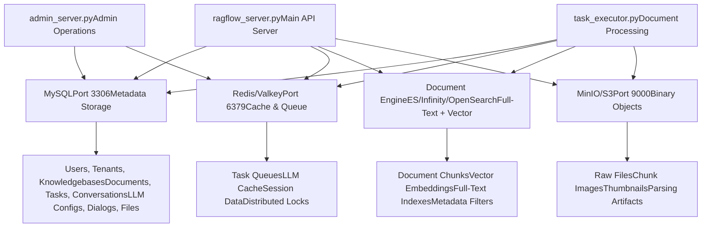
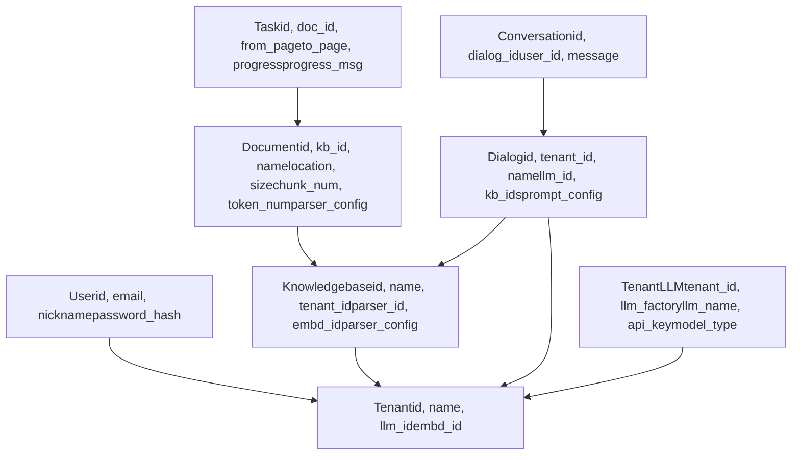
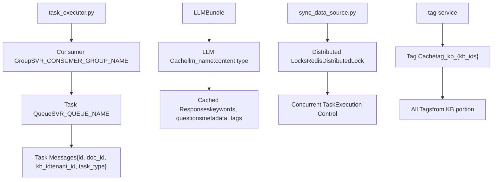
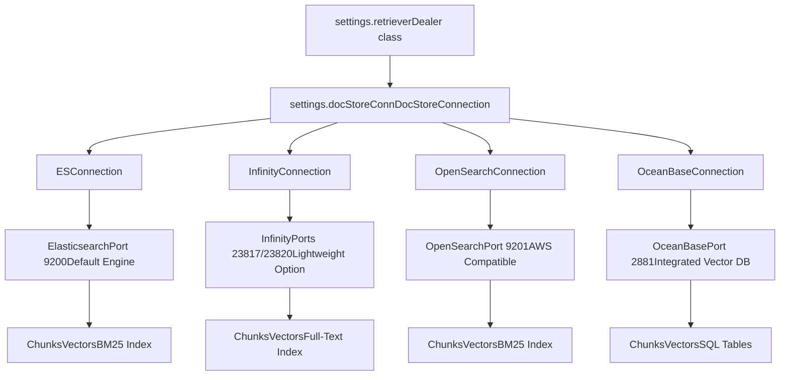
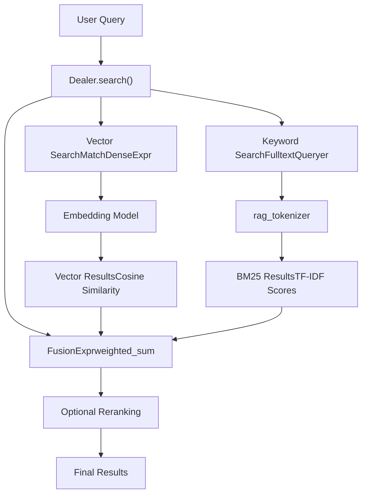
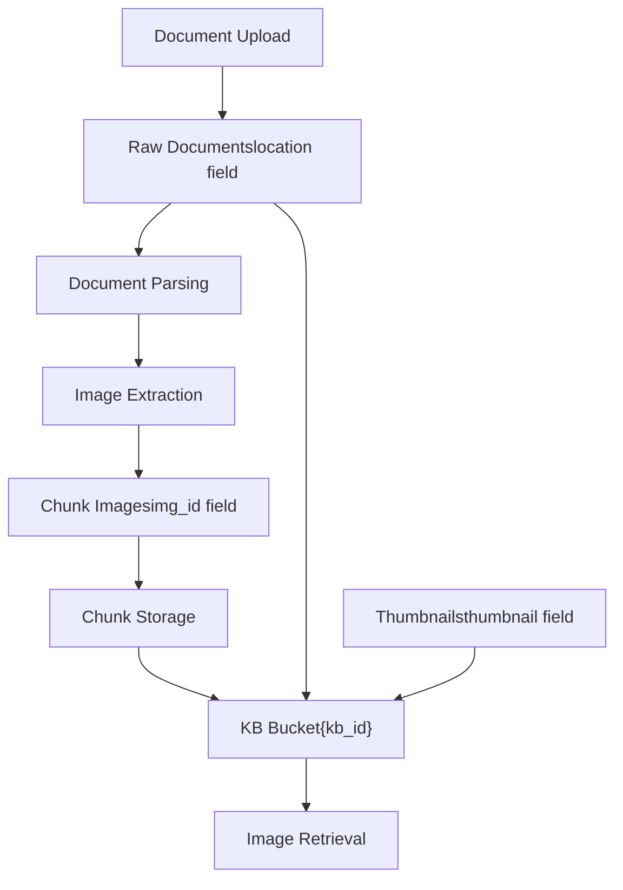

# Data Storage Architecture

Relevant source files

-   [README.md](https://github.com/infiniflow/ragflow/blob/80a16e71/README.md)
-   [README\_id.md](https://github.com/infiniflow/ragflow/blob/80a16e71/README_id.md)
-   [README\_ja.md](https://github.com/infiniflow/ragflow/blob/80a16e71/README_ja.md)
-   [README\_ko.md](https://github.com/infiniflow/ragflow/blob/80a16e71/README_ko.md)
-   [README\_pt\_br.md](https://github.com/infiniflow/ragflow/blob/80a16e71/README_pt_br.md)
-   [README\_tzh.md](https://github.com/infiniflow/ragflow/blob/80a16e71/README_tzh.md)
-   [README\_zh.md](https://github.com/infiniflow/ragflow/blob/80a16e71/README_zh.md)
-   [api/apps/chunk\_app.py](https://github.com/infiniflow/ragflow/blob/80a16e71/api/apps/chunk_app.py)
-   [api/apps/connector\_app.py](https://github.com/infiniflow/ragflow/blob/80a16e71/api/apps/connector_app.py)
-   [api/apps/conversation\_app.py](https://github.com/infiniflow/ragflow/blob/80a16e71/api/apps/conversation_app.py)
-   [api/apps/document\_app.py](https://github.com/infiniflow/ragflow/blob/80a16e71/api/apps/document_app.py)
-   [api/apps/file2document\_app.py](https://github.com/infiniflow/ragflow/blob/80a16e71/api/apps/file2document_app.py)
-   [api/apps/file\_app.py](https://github.com/infiniflow/ragflow/blob/80a16e71/api/apps/file_app.py)
-   [api/apps/kb\_app.py](https://github.com/infiniflow/ragflow/blob/80a16e71/api/apps/kb_app.py)
-   [api/db/db\_models.py](https://github.com/infiniflow/ragflow/blob/80a16e71/api/db/db_models.py)
-   [api/db/services/connector\_service.py](https://github.com/infiniflow/ragflow/blob/80a16e71/api/db/services/connector_service.py)
-   [api/db/services/dialog\_service.py](https://github.com/infiniflow/ragflow/blob/80a16e71/api/db/services/dialog_service.py)
-   [api/db/services/document\_service.py](https://github.com/infiniflow/ragflow/blob/80a16e71/api/db/services/document_service.py)
-   [api/db/services/file\_service.py](https://github.com/infiniflow/ragflow/blob/80a16e71/api/db/services/file_service.py)
-   [api/db/services/knowledgebase\_service.py](https://github.com/infiniflow/ragflow/blob/80a16e71/api/db/services/knowledgebase_service.py)
-   [api/db/services/task\_service.py](https://github.com/infiniflow/ragflow/blob/80a16e71/api/db/services/task_service.py)
-   [api/utils/common.py](https://github.com/infiniflow/ragflow/blob/80a16e71/api/utils/common.py)
-   [common/constants.py](https://github.com/infiniflow/ragflow/blob/80a16e71/common/constants.py)
-   [common/data\_source/\_\_init\_\_.py](https://github.com/infiniflow/ragflow/blob/80a16e71/common/data_source/__init__.py)
-   [common/data\_source/config.py](https://github.com/infiniflow/ragflow/blob/80a16e71/common/data_source/config.py)
-   [docker/.env](https://github.com/infiniflow/ragflow/blob/80a16e71/docker/.env)
-   [docker/README.md](https://github.com/infiniflow/ragflow/blob/80a16e71/docker/README.md)
-   [docker/docker-compose-base.yml](https://github.com/infiniflow/ragflow/blob/80a16e71/docker/docker-compose-base.yml)
-   [docker/infinity\_conf.toml](https://github.com/infiniflow/ragflow/blob/80a16e71/docker/infinity_conf.toml)
-   [docs/configurations.md](https://github.com/infiniflow/ragflow/blob/80a16e71/docs/configurations.md)
-   [docs/guides/manage\_files.md](https://github.com/infiniflow/ragflow/blob/80a16e71/docs/guides/manage_files.md)
-   [docs/guides/upgrade\_ragflow.mdx](https://github.com/infiniflow/ragflow/blob/80a16e71/docs/guides/upgrade_ragflow.mdx)
-   [docs/quickstart.mdx](https://github.com/infiniflow/ragflow/blob/80a16e71/docs/quickstart.mdx)
-   [helm/values.yaml](https://github.com/infiniflow/ragflow/blob/80a16e71/helm/values.yaml)
-   [pyproject.toml](https://github.com/infiniflow/ragflow/blob/80a16e71/pyproject.toml)
-   [rag/nlp/search.py](https://github.com/infiniflow/ragflow/blob/80a16e71/rag/nlp/search.py)
-   [rag/svr/sync\_data\_source.py](https://github.com/infiniflow/ragflow/blob/80a16e71/rag/svr/sync_data_source.py)
-   [rag/svr/task\_executor.py](https://github.com/infiniflow/ragflow/blob/80a16e71/rag/svr/task_executor.py)
-   [sdk/python/pyproject.toml](https://github.com/infiniflow/ragflow/blob/80a16e71/sdk/python/pyproject.toml)
-   [sdk/python/uv.lock](https://github.com/infiniflow/ragflow/blob/80a16e71/sdk/python/uv.lock)
-   [uv.lock](https://github.com/infiniflow/ragflow/blob/80a16e71/uv.lock)
-   [web/src/pages/user-setting/data-source/constant/index.tsx](https://github.com/infiniflow/ragflow/blob/80a16e71/web/src/pages/user-setting/data-source/constant/index.tsx)

## Purpose and Scope

This document describes RAGFlow's multi-tier storage architecture, explaining how the system separates concerns across four distinct storage backends: MySQL for metadata, Redis for caching and task queuing, pluggable document engines for full-text and vector search, and MinIO/S3 for binary object storage.

For information about the task execution system that orchestrates data processing across these storage layers, see [Task Execution and Queue System](/infiniflow/ragflow/3.3-task-execution-and-queue-system). For details on the application services that consume these storage systems, see [Core Application Services](/infiniflow/ragflow/3.1-core-application-services).

## Storage Layer Overview

RAGFlow employs a clear separation of concerns in its storage architecture, with each component handling specific types of data and access patterns:


**Storage Responsibility Diagram**

Sources: [rag/svr/task\_executor.py1-200](https://github.com/infiniflow/ragflow/blob/80a16e71/rag/svr/task_executor.py#L1-L200) [api/db/db\_models.py1-100](https://github.com/infiniflow/ragflow/blob/80a16e71/api/db/db_models.py#L1-L100) [docker/.env1-150](https://github.com/infiniflow/ragflow/blob/80a16e71/docker/.env#L1-L150) [README.md137-141](https://github.com/infiniflow/ragflow/blob/80a16e71/README.md#L137-L141)

| Storage System | Data Types | Access Pattern | Persistence |
| --- | --- | --- | --- |
| **MySQL** | User accounts, KB configs, document metadata, task states, conversations, LLM settings | Transactional CRUD operations | Permanent |
| **Redis** | Task queues, LLM response cache, distributed locks, session state | High-frequency read/write, pub/sub | Temporary/volatile |
| **Document Engine** | Chunk text, vector embeddings, BM25 indexes, metadata filters | Hybrid search (vector + keyword), aggregations | Permanent |
| **Object Storage** | PDF/DOCX files, extracted images, thumbnails, parsing results | Large binary writes, infrequent reads | Permanent |

## MySQL: Metadata Store

MySQL serves as the authoritative source of truth for all relational metadata in RAGFlow. The system uses the Peewee ORM with connection pooling for database access.


**MySQL Schema Relationships**

Sources: [api/db/db\_models.py134-850](https://github.com/infiniflow/ragflow/blob/80a16e71/api/db/db_models.py#L134-L850) [docker/.env109-123](https://github.com/infiniflow/ragflow/blob/80a16e71/docker/.env#L109-L123)

### Database Configuration

The MySQL connection is configured through environment variables and supports both MySQL and PostgreSQL backends:

-   **Host**: `MYSQL_HOST` (default: `mysql`)
-   **Port**: `MYSQL_PORT` (default: `3306`)
-   **Database**: `MYSQL_DBNAME` (default: `rag_flow`)
-   **Credentials**: `MYSQL_USER`, `MYSQL_PASSWORD`
-   **Connection Pool**: `PooledMySQLDatabase` or `PooledPostgresqlDatabase`

[api/db/db\_models.py700-750](https://github.com/infiniflow/ragflow/blob/80a16e71/api/db/db_models.py#L700-L750) implements the database connection singleton with automatic reconnection handling.

### Key Database Models

RAGFlow defines models for all major entities using Peewee ORM. Each model extends `BaseModel` which provides automatic timestamp management:

-   **`User`**: User authentication and profile [api/db/db\_models.py800-850](https://github.com/infiniflow/ragflow/blob/80a16e71/api/db/db_models.py#L800-L850)
-   **`Tenant`**: Multi-tenancy isolation, LLM defaults [api/db/db\_models.py850-900](https://github.com/infiniflow/ragflow/blob/80a16e71/api/db/db_models.py#L850-L900)
-   **`Knowledgebase`**: KB configuration, parser settings, embedding model [api/db/services/knowledgebase\_service.py1-100](https://github.com/infiniflow/ragflow/blob/80a16e71/api/db/services/knowledgebase_service.py#L1-L100)
-   **`Document`**: File metadata, parsing progress, chunk counts [api/db/services/document\_service.py46-78](https://github.com/infiniflow/ragflow/blob/80a16e71/api/db/services/document_service.py#L46-L78)
-   **`Task`**: Async parsing task state [api/db/services/task\_service.py1-100](https://github.com/infiniflow/ragflow/blob/80a16e71/api/db/services/task_service.py#L1-L100)
-   **`Dialog`**: Chat assistant configuration [api/db/services/dialog\_service.py50-68](https://github.com/infiniflow/ragflow/blob/80a16e71/api/db/services/dialog_service.py#L50-L68)
-   **`TenantLLM`**: Per-tenant LLM API keys [api/db/db\_models.py400-450](https://github.com/infiniflow/ragflow/blob/80a16e71/api/db/db_models.py#L400-L450)

Sources: [api/db/db\_models.py134-850](https://github.com/infiniflow/ragflow/blob/80a16e71/api/db/db_models.py#L134-L850) [api/db/services/document\_service.py1-100](https://github.com/infiniflow/ragflow/blob/80a16e71/api/db/services/document_service.py#L1-L100)

## Redis: Cache and Queue

Redis (or its drop-in replacement Valkey) provides three critical functions in RAGFlow: task queue management, LLM response caching, and distributed locking.


**Redis Data Structures and Usage**

Sources: [rag/svr/task\_executor.py74-234](https://github.com/infiniflow/ragflow/blob/80a16e71/rag/svr/task_executor.py#L74-L234) [rag/utils/redis\_conn.py1-200](https://github.com/infiniflow/ragflow/blob/80a16e71/rag/utils/redis_conn.py#L1-L200) [graphrag/utils.py1-100](https://github.com/infiniflow/ragflow/blob/80a16e71/graphrag/utils.py#L1-L100)

### Task Queue System

RAGFlow uses Redis Streams for reliable task queuing with consumer groups. The queue architecture ensures exactly-once processing with automatic retry of unacknowledged messages.

**Queue Configuration:**

-   **Queue Names**: Defined by `settings.get_svr_queue_names()` [common/settings.py](https://github.com/infiniflow/ragflow/blob/80a16e71/common/settings.py)
-   **Consumer Group**: `SVR_CONSUMER_GROUP_NAME` constant [common/constants.py79](https://github.com/infiniflow/ragflow/blob/80a16e71/common/constants.py#L79-L79)
-   **Consumer Name**: `task_executor_{CONSUMER_NO}` [rag/svr/task\_executor.py113](https://github.com/infiniflow/ragflow/blob/80a16e71/rag/svr/task_executor.py#L113-L113)

**Queue Operations:**

-   `REDIS_CONN.queue_product()`: Enqueue new tasks [api/db/services/task\_service.py200-250](https://github.com/infiniflow/ragflow/blob/80a16e71/api/db/services/task_service.py#L200-L250)
-   `REDIS_CONN.queue_consumer()`: Dequeue and process [rag/svr/task\_executor.py173-234](https://github.com/infiniflow/ragflow/blob/80a16e71/rag/svr/task_executor.py#L173-L234)
-   `REDIS_CONN.get_unacked_iterator()`: Retry unacknowledged messages [rag/svr/task\_executor.py180-183](https://github.com/infiniflow/ragflow/blob/80a16e71/rag/svr/task_executor.py#L180-L183)

Sources: [rag/svr/task\_executor.py173-234](https://github.com/infiniflow/ragflow/blob/80a16e71/rag/svr/task_executor.py#L173-L234) [rag/utils/redis\_conn.py1-300](https://github.com/infiniflow/ragflow/blob/80a16e71/rag/utils/redis_conn.py#L1-L300)

### LLM Response Caching

To reduce API costs and latency, RAGFlow caches LLM responses for deterministic operations like keyword extraction, question generation, and metadata extraction.

**Cache Key Structure:**

```
{llm_name}:{content_hash}:{operation_type}:{params_json}
```
**Cached Operations:**

-   `keyword_extraction`: Auto-generated keywords [rag/svr/task\_executor.py344-356](https://github.com/infiniflow/ragflow/blob/80a16e71/rag/svr/task_executor.py#L344-L356)
-   `question_proposal`: Auto-generated questions [rag/svr/task\_executor.py377-389](https://github.com/infiniflow/ragflow/blob/80a16e71/rag/svr/task_executor.py#L377-L389)
-   `gen_metadata`: Extracted metadata fields [rag/svr/task\_executor.py409-424](https://github.com/infiniflow/ragflow/blob/80a16e71/rag/svr/task_executor.py#L409-L424)
-   `content_tagging`: Document tags [rag/svr/task\_executor.py478-500](https://github.com/infiniflow/ragflow/blob/80a16e71/rag/svr/task_executor.py#L478-L500)

**Cache Functions:**

-   `get_llm_cache(llm_name, content, cache_type, params)` [graphrag/utils.py30-50](https://github.com/infiniflow/ragflow/blob/80a16e71/graphrag/utils.py#L30-L50)
-   `set_llm_cache(llm_name, content, result, cache_type, params)` [graphrag/utils.py51-70](https://github.com/infiniflow/ragflow/blob/80a16e71/graphrag/utils.py#L51-L70)

Sources: [rag/svr/task\_executor.py344-512](https://github.com/infiniflow/ragflow/blob/80a16e71/rag/svr/task_executor.py#L344-L512) [graphrag/utils.py1-100](https://github.com/infiniflow/ragflow/blob/80a16e71/graphrag/utils.py#L1-L100)

### Distributed Locking

Redis provides distributed locks for coordinating concurrent operations across multiple workers.

**Lock Implementation:**

-   `RedisDistributedLock` class [rag/utils/redis\_conn.py200-300](https://github.com/infiniflow/ragflow/blob/80a16e71/rag/utils/redis_conn.py#L200-L300)
-   Used in data source synchronization [rag/svr/sync\_data\_source.py1-200](https://github.com/infiniflow/ragflow/blob/80a16e71/rag/svr/sync_data_source.py#L1-L200)
-   Prevents duplicate processing of the same file

**Redis Configuration:**

-   **Host**: `REDIS_HOST` (default: `redis`) [docker/.env140](https://github.com/infiniflow/ragflow/blob/80a16e71/docker/.env#L140-L140)
-   **Port**: `REDIS_PORT` (default: `6379`) [docker/.env144](https://github.com/infiniflow/ragflow/blob/80a16e71/docker/.env#L144-L144)
-   **Password**: `REDIS_PASSWORD` [docker/.env146](https://github.com/infiniflow/ragflow/blob/80a16e71/docker/.env#L146-L146)

Sources: [rag/utils/redis\_conn.py1-300](https://github.com/infiniflow/ragflow/blob/80a16e71/rag/utils/redis_conn.py#L1-L300) [docker/.env140-146](https://github.com/infiniflow/ragflow/blob/80a16e71/docker/.env#L140-L146)

## Document Engine: Full-Text and Vector Search

RAGFlow abstracts document storage through a pluggable interface supporting four backends: Elasticsearch, Infinity, OpenSearch, and OceanBase. This allows deployment flexibility based on performance, licensing, and operational requirements.


**Document Engine Architecture**

Sources: [common/doc\_store/doc\_store\_base.py1-100](https://github.com/infiniflow/ragflow/blob/80a16e71/common/doc_store/doc_store_base.py#L1-L100) [docker/.env13-20](https://github.com/infiniflow/ragflow/blob/80a16e71/docker/.env#L13-L20) [rag/nlp/search.py34-41](https://github.com/infiniflow/ragflow/blob/80a16e71/rag/nlp/search.py#L34-L41)

### Engine Selection and Configuration

The document engine is selected at startup via the `DOC_ENGINE` environment variable:

```
# Available options in docker/.env
DOC_ENGINE=elasticsearch  # Default
DOC_ENGINE=infinity       # Lightweight alternative
DOC_ENGINE=opensearch     # AWS-compatible
DOC_ENGINE=oceanbase      # Integrated vector DB
```
**Configuration Files:**

-   Environment: [docker/.env13-20](https://github.com/infiniflow/ragflow/blob/80a16e71/docker/.env#L13-L20)
-   Service Detection: [common/settings.py1-100](https://github.com/infiniflow/ragflow/blob/80a16e71/common/settings.py#L1-L100)
-   Connection Factory: [common/doc\_store/\_\_init\_\_.py1-50](https://github.com/infiniflow/ragflow/blob/80a16e71/common/doc_store/__init__.py#L1-L50)

The selected engine determines which Docker Compose profile is activated and which connection class is instantiated.

Sources: [docker/.env13-20](https://github.com/infiniflow/ragflow/blob/80a16e71/docker/.env#L13-L20) [docker/docker-compose-base.yml1-200](https://github.com/infiniflow/ragflow/blob/80a16e71/docker/docker-compose-base.yml#L1-L200)

### Index Structure and Chunk Storage

Documents are stored as chunks with both full-text and vector representations. Each chunk contains:

**Core Fields:**

-   `id`: xxhash of content + doc\_id [rag/svr/task\_executor.py303-305](https://github.com/infiniflow/ragflow/blob/80a16e71/rag/svr/task_executor.py#L303-L305)
-   `doc_id`, `kb_id`: Foreign keys to MySQL
-   `content_with_weight`: Original text content
-   `content_ltks`: Tokenized text for BM25 search
-   `content_sm_ltks`: Fine-grained tokens
-   `q_{dimension}_vec`: Vector embedding (e.g., `q_1024_vec`)

**Enhancement Fields:**

-   `important_kwd`: Auto-generated keywords [rag/svr/task\_executor.py354-356](https://github.com/infiniflow/ragflow/blob/80a16e71/rag/svr/task_executor.py#L354-L356)
-   `question_kwd`: Auto-generated questions [rag/svr/task\_executor.py387-389](https://github.com/infiniflow/ragflow/blob/80a16e71/rag/svr/task_executor.py#L387-L389)
-   `metadata_obj`: Extracted metadata [rag/svr/task\_executor.py423](https://github.com/infiniflow/ragflow/blob/80a16e71/rag/svr/task_executor.py#L423-L423)
-   `pagerank_flt`: PageRank score (Elasticsearch only) [common/constants.py79](https://github.com/infiniflow/ragflow/blob/80a16e71/common/constants.py#L79-L79)
-   `tag_fld`: Content tags [common/constants.py79](https://github.com/infiniflow/ragflow/blob/80a16e71/common/constants.py#L79-L79)

**Positional Fields:**

-   `page_num_int`: Source page number
-   `top_int`, `position_int`: Layout coordinates
-   `create_timestamp_flt`: Chunk creation time

Sources: [rag/svr/task\_executor.py289-620](https://github.com/infiniflow/ragflow/blob/80a16e71/rag/svr/task_executor.py#L289-L620) [common/constants.py79](https://github.com/infiniflow/ragflow/blob/80a16e71/common/constants.py#L79-L79)

### Search and Retrieval Operations

The `Dealer` class provides a unified interface for hybrid search combining vector similarity and BM25 keyword matching:


**Hybrid Search Architecture**

**Key Search Methods:**

-   `Dealer.search()`: Main search interface [rag/nlp/search.py75-172](https://github.com/infiniflow/ragflow/blob/80a16e71/rag/nlp/search.py#L75-L172)
-   `Dealer.get_vector()`: Generate vector embedding [rag/nlp/search.py53-61](https://github.com/infiniflow/ragflow/blob/80a16e71/rag/nlp/search.py#L53-L61)
-   `FulltextQueryer.question()`: BM25 query construction [rag/nlp/query.py1-100](https://github.com/infiniflow/ragflow/blob/80a16e71/rag/nlp/query.py#L1-L100)

**Search Expression Types:**

-   `MatchDenseExpr`: Vector search with cosine similarity [common/doc\_store/doc\_store\_base.py1-100](https://github.com/infiniflow/ragflow/blob/80a16e71/common/doc_store/doc_store_base.py#L1-L100)
-   `MatchTextExpr`: BM25 keyword search
-   `FusionExpr`: Weighted combination (default: 5% keyword, 95% vector) [rag/nlp/search.py128](https://github.com/infiniflow/ragflow/blob/80a16e71/rag/nlp/search.py#L128-L128)

**Retrieval Configuration:**

-   `similarity_threshold`: Minimum vector similarity (default: 0.1) [rag/nlp/search.py61](https://github.com/infiniflow/ragflow/blob/80a16e71/rag/nlp/search.py#L61-L61)
-   `topk`: Maximum results to retrieve [rag/nlp/search.py88](https://github.com/infiniflow/ragflow/blob/80a16e71/rag/nlp/search.py#L88-L88)
-   `vector_similarity_weight`: Vector vs. BM25 weight [api/db/services/dialog\_service.py425](https://github.com/infiniflow/ragflow/blob/80a16e71/api/db/services/dialog_service.py#L425-L425)

Sources: [rag/nlp/search.py37-172](https://github.com/infiniflow/ragflow/blob/80a16e71/rag/nlp/search.py#L37-L172) [common/doc\_store/doc\_store\_base.py1-200](https://github.com/infiniflow/ragflow/blob/80a16e71/common/doc_store/doc_store_base.py#L1-L200)

### Index Management

Index creation and management is handled automatically based on the knowledge base configuration:

**Index Naming:**

-   `index_name(tenant_id)` returns `ragflow_{tenant_id}` [rag/nlp/search.py34](https://github.com/infiniflow/ragflow/blob/80a16e71/rag/nlp/search.py#L34-L34)

**Index Creation:**

```
# From task_executor.py:563-566
idxnm = search.index_name(row["tenant_id"])
parser_id = row.get("parser_id", None)
settings.docStoreConn.create_idx(idxnm, row.get("kb_id", ""), vector_size, parser_id)
```
**Chunk Insertion:**

-   `insert_chunks()`: Bulk insert with deduplication [rag/svr/task\_executor.py870-920](https://github.com/infiniflow/ragflow/blob/80a16e71/rag/svr/task_executor.py#L870-L920)
-   Uses `settings.docStoreConn.insert()` for batch operations
-   Handles vector field naming based on dimension

Sources: [rag/svr/task\_executor.py563-920](https://github.com/infiniflow/ragflow/blob/80a16e71/rag/svr/task_executor.py#L563-L920) [rag/nlp/search.py34](https://github.com/infiniflow/ragflow/blob/80a16e71/rag/nlp/search.py#L34-L34)

## Object Storage: Binary Data

MinIO (or S3-compatible services) stores all binary data including raw documents, extracted images, and parsing artifacts. This separates large binary storage from the database and document engine.


**Object Storage Data Flow**

Sources: [rag/svr/task\_executor.py238-338](https://github.com/infiniflow/ragflow/blob/80a16e71/rag/svr/task_executor.py#L238-L338) [common/settings.py1-200](https://github.com/infiniflow/ragflow/blob/80a16e71/common/settings.py#L1-L200)

### Storage Interface

RAGFlow abstracts object storage through the `STORAGE_IMPL` interface, supporting MinIO and S3:

**Storage Operations:**

-   `STORAGE_IMPL.put(bucket, name, binary)`: Upload object [rag/svr/task\_executor.py317](https://github.com/infiniflow/ragflow/blob/80a16e71/rag/svr/task_executor.py#L317-L317)
-   `STORAGE_IMPL.get(bucket, name)`: Download object [rag/svr/task\_executor.py238](https://github.com/infiniflow/ragflow/blob/80a16e71/rag/svr/task_executor.py#L238-L238)
-   `STORAGE_IMPL.delete(bucket, chunk_id)`: Remove object [rag/svr/task\_executor.py864](https://github.com/infiniflow/ragflow/blob/80a16e71/rag/svr/task_executor.py#L864-L864)
-   `STORAGE_IMPL.obj_exist(bucket, name)`: Check existence [rag/svr/task\_executor.py135](https://github.com/infiniflow/ragflow/blob/80a16e71/rag/svr/task_executor.py#L135-L135)

**Bucket Structure:**

-   Each knowledge base has its own bucket: `{kb_id}`
-   Objects are stored with deterministic names based on content or IDs

Sources: [rag/svr/task\_executor.py238-338](https://github.com/infiniflow/ragflow/blob/80a16e71/rag/svr/task_executor.py#L238-L338) [common/settings.py1-200](https://github.com/infiniflow/ragflow/blob/80a16e71/common/settings.py#L1-L200)

### Document Storage

When documents are uploaded, they are stored in MinIO and their metadata is recorded in MySQL:

**Upload Flow:**

1.  Document uploaded via API [api/apps/document\_app.py52-98](https://github.com/infiniflow/ragflow/blob/80a16e71/api/apps/document_app.py#L52-L98)
2.  Binary stored in MinIO at `{kb_id}/{location}` [rag/svr/task\_executor.py135-137](https://github.com/infiniflow/ragflow/blob/80a16e71/rag/svr/task_executor.py#L135-L137)
3.  Metadata saved to `Document` table with `location` field [api/db/services/document\_service.py1-100](https://github.com/infiniflow/ragflow/blob/80a16e71/api/db/services/document_service.py#L1-L100)

**Retrieval for Processing:**

```
# From task_executor.py:251-252
bucket, name = File2DocumentService.get_storage_address(doc_id=task["doc_id"])
binary = await get_storage_binary(bucket, name)
```
Sources: [rag/svr/task\_executor.py238-265](https://github.com/infiniflow/ragflow/blob/80a16e71/rag/svr/task_executor.py#L238-L265) [api/apps/document\_app.py52-98](https://github.com/infiniflow/ragflow/blob/80a16e71/api/apps/document_app.py#L52-L98)

### Image Extraction and Storage

During document parsing, images are extracted and stored separately for efficient retrieval:

**Image Storage Process:**

1.  Parser extracts images with base64 encoding [deepdoc/parser1-100](https://github.com/infiniflow/ragflow/blob/80a16e71/deepdoc/parser#L1-L100)
2.  Each chunk with an image calls `image2id()` [rag/svr/task\_executor.py317](https://github.com/infiniflow/ragflow/blob/80a16e71/rag/svr/task_executor.py#L317-L317)
3.  Image stored at `{kb_id}/{chunk_id}` in MinIO
4.  Chunk record gets `img_id` field set [rag/svr/task\_executor.py308-318](https://github.com/infiniflow/ragflow/blob/80a16e71/rag/svr/task_executor.py#L308-L318)

**Image Retrieval:**

-   Images are served via `/v1/document/image/{kb_id}-{img_id}` endpoint
-   Thumbnails are generated and stored for document preview [api/utils/file\_utils.py1-100](https://github.com/infiniflow/ragflow/blob/80a16e71/api/utils/file_utils.py#L1-L100)

Sources: [rag/svr/task\_executor.py298-338](https://github.com/infiniflow/ragflow/blob/80a16e71/rag/svr/task_executor.py#L298-L338) [rag/utils/base64\_image.py1-100](https://github.com/infiniflow/ragflow/blob/80a16e71/rag/utils/base64_image.py#L1-L100)

### MinIO Configuration

MinIO is configured through environment variables and service configuration:

-   **Host**: `MINIO_HOST` (default: `minio`) [docker/.env126](https://github.com/infiniflow/ragflow/blob/80a16e71/docker/.env#L126-L126)
-   **API Port**: `MINIO_PORT` (default: `9000`) [docker/.env132](https://github.com/infiniflow/ragflow/blob/80a16e71/docker/.env#L132-L132)
-   **Console Port**: `MINIO_CONSOLE_PORT` (default: `9001`) [docker/.env129](https://github.com/infiniflow/ragflow/blob/80a16e71/docker/.env#L129-L129)
-   **Credentials**: `MINIO_USER`, `MINIO_PASSWORD` [docker/.env135-138](https://github.com/infiniflow/ragflow/blob/80a16e71/docker/.env#L135-L138)

**Connection Pooling:**

-   Concurrent MinIO operations controlled by `minio_limiter` semaphore
-   Default: `MAX_CONCURRENT_MINIO=10` [rag/svr/task\_executor.py124-128](https://github.com/infiniflow/ragflow/blob/80a16e71/rag/svr/task_executor.py#L124-L128)

Sources: [docker/.env125-138](https://github.com/infiniflow/ragflow/blob/80a16e71/docker/.env#L125-L138) [rag/svr/task\_executor.py124-128](https://github.com/infiniflow/ragflow/blob/80a16e71/rag/svr/task_executor.py#L124-L128)

## Data Flow Across Storage Layers

Understanding how data flows through the storage layers during document processing provides insight into the system's architecture:

> **[Mermaid sequence]**
> *(图表结构无法解析)*

**Document Processing Data Flow**

Sources: [rag/svr/task\_executor.py173-762](https://github.com/infiniflow/ragflow/blob/80a16e71/rag/svr/task_executor.py#L173-L762) [api/db/services/document\_service.py400-600](https://github.com/infiniflow/ragflow/blob/80a16e71/api/db/services/document_service.py#L400-L600)

### Document Upload Flow

1.  **API Request** [api/apps/document\_app.py52-98](https://github.com/infiniflow/ragflow/blob/80a16e71/api/apps/document_app.py#L52-L98)

    -   User uploads file via `/document/upload`
    -   File validated for type and size
2.  **MySQL Record** [api/db/services/document\_service.py1-100](https://github.com/infiniflow/ragflow/blob/80a16e71/api/db/services/document_service.py#L1-L100)

    -   `Document` record created with metadata
    -   Status set to `RUNNING`
3.  **MinIO Storage** [rag/svr/task\_executor.py135-137](https://github.com/infiniflow/ragflow/blob/80a16e71/rag/svr/task_executor.py#L135-L137)

    -   Binary file stored at `{kb_id}/{location}`
    -   Location recorded in `Document.location`
4.  **Task Queue** [api/db/services/task\_service.py200-250](https://github.com/infiniflow/ragflow/blob/80a16e71/api/db/services/task_service.py#L200-L250)

    -   Task message enqueued to Redis Stream
    -   Contains `{doc_id, kb_id, tenant_id, task_type}`

Sources: [api/apps/document\_app.py52-98](https://github.com/infiniflow/ragflow/blob/80a16e71/api/apps/document_app.py#L52-L98) [api/db/services/document\_service.py1-100](https://github.com/infiniflow/ragflow/blob/80a16e71/api/db/services/document_service.py#L1-L100)

### Chunk Processing and Indexing Flow

1.  **Task Dequeue** [rag/svr/task\_executor.py173-234](https://github.com/infiniflow/ragflow/blob/80a16e71/rag/svr/task_executor.py#L173-L234)

    -   Worker fetches task from Redis Stream
    -   Task status loaded from MySQL
2.  **File Retrieval** [rag/svr/task\_executor.py238-265](https://github.com/infiniflow/ragflow/blob/80a16e71/rag/svr/task_executor.py#L238-L265)

    -   Binary fetched from MinIO using `get_storage_binary()`
    -   Timeout protection with 80-minute limit
3.  **Chunking** [rag/svr/task\_executor.py242-288](https://github.com/infiniflow/ragflow/blob/80a16e71/rag/svr/task_executor.py#L242-L288)

    -   Parser selected based on `parser_id`
    -   Document split into chunks using template strategies
    -   Progress callbacks update MySQL via `set_progress()`
4.  **Enhancement** [rag/svr/task\_executor.py339-513](https://github.com/infiniflow/ragflow/blob/80a16e71/rag/svr/task_executor.py#L339-L513)

    -   Auto-keywords generated if enabled [rag/svr/task\_executor.py344-370](https://github.com/infiniflow/ragflow/blob/80a16e71/rag/svr/task_executor.py#L344-L370)
    -   Auto-questions generated if enabled [rag/svr/task\_executor.py372-402](https://github.com/infiniflow/ragflow/blob/80a16e71/rag/svr/task_executor.py#L372-L402)
    -   Metadata extracted if configured [rag/svr/task\_executor.py404-447](https://github.com/infiniflow/ragflow/blob/80a16e71/rag/svr/task_executor.py#L404-L447)
    -   All LLM responses cached in Redis
5.  **Image Storage** [rag/svr/task\_executor.py298-338](https://github.com/infiniflow/ragflow/blob/80a16e71/rag/svr/task_executor.py#L298-L338)

    -   Extracted images uploaded to MinIO
    -   Image IDs assigned to chunks
    -   Concurrent uploads via `asyncio.gather()`
6.  **Embedding Generation** [rag/svr/task\_executor.py569-620](https://github.com/infiniflow/ragflow/blob/80a16e71/rag/svr/task_executor.py#L569-L620)

    -   Text converted to vectors using embedding model
    -   Vector field named `q_{dimension}_vec`
    -   Title embeddings weighted with content embeddings
7.  **Chunk Insertion** [rag/svr/task\_executor.py870-920](https://github.com/infiniflow/ragflow/blob/80a16e71/rag/svr/task_executor.py#L870-L920)

    -   Chunks bulk-inserted to document engine
    -   Deduplication by chunk ID
    -   Index created if not exists
8.  **Metadata Update** [rag/svr/task\_executor.py755-760](https://github.com/infiniflow/ragflow/blob/80a16e71/rag/svr/task_executor.py#L755-L760)

    -   MySQL `Document` record updated with `chunk_num`, `token_num`
    -   Task marked as complete

Sources: [rag/svr/task\_executor.py173-920](https://github.com/infiniflow/ragflow/blob/80a16e71/rag/svr/task_executor.py#L173-L920) [api/db/services/document\_service.py400-600](https://github.com/infiniflow/ragflow/blob/80a16e71/api/db/services/document_service.py#L400-L600)

### Retrieval and Chat Flow

1.  **Query Reception** [api/db/services/dialog\_service.py275-450](https://github.com/infiniflow/ragflow/blob/80a16e71/api/db/services/dialog_service.py#L275-L450)

    -   User query received via chat API
    -   Dialog configuration loaded from MySQL
2.  **Query Enhancement** [api/db/services/dialog\_service.py349-368](https://github.com/infiniflow/ragflow/blob/80a16e71/api/db/services/dialog_service.py#L349-L368)

    -   Multi-turn context from MySQL `Conversation` table
    -   Query refined using LLM (cached in Redis)
    -   Cross-language translation if configured
3.  **Hybrid Search** [rag/nlp/search.py75-172](https://github.com/infiniflow/ragflow/blob/80a16e71/rag/nlp/search.py#L75-L172)

    -   Query embedded using embedding model
    -   Vector + BM25 search executed on document engine
    -   Results fused with weighted combination
4.  **LLM Generation** [api/db/services/dialog\_service.py458-549](https://github.com/infiniflow/ragflow/blob/80a16e71/api/db/services/dialog_service.py#L458-L549)

    -   Retrieved chunks formatted as context
    -   LLM generates response with citations
    -   Response streamed to client via SSE
5.  **Conversation Storage** [api/db/services/conversation\_service.py1-200](https://github.com/infiniflow/ragflow/blob/80a16e71/api/db/services/conversation_service.py#L1-L200)

    -   Message history appended to MySQL `Conversation` record
    -   References stored for citation display

Sources: [api/db/services/dialog\_service.py275-549](https://github.com/infiniflow/ragflow/blob/80a16e71/api/db/services/dialog_service.py#L275-L549) [rag/nlp/search.py75-172](https://github.com/infiniflow/ragflow/blob/80a16e71/rag/nlp/search.py#L75-L172)

## Switching Document Engines

RAGFlow's pluggable document engine architecture allows switching between backends without code changes. This section describes the migration process.

### Migration Prerequisites

**Important:** Switching document engines requires clearing existing data. Back up your MySQL database if you want to preserve user accounts and configurations.

1.  Stop all containers
2.  Remove document engine volumes
3.  Update configuration
4.  Restart with new engine

Sources: [README.md273-294](https://github.com/infiniflow/ragflow/blob/80a16e71/README.md#L273-L294) [docker/.env13-20](https://github.com/infiniflow/ragflow/blob/80a16e71/docker/.env#L13-L20)

### Switch to Infinity

Infinity is a lightweight alternative to Elasticsearch with similar functionality:

```
# Stop all services
docker compose -f docker/docker-compose.yml down -v

# Update environment variable
# Edit docker/.env:
DOC_ENGINE=infinity

# Start services with new engine
docker compose -f docker-compose.yml up -d
```
**Infinity Configuration:**

-   **Thrift Port**: `INFINITY_THRIFT_PORT=23817` [docker/.env71](https://github.com/infiniflow/ragflow/blob/80a16e71/docker/.env#L71-L71)
-   **HTTP Port**: `INFINITY_HTTP_PORT=23820` [docker/.env72](https://github.com/infiniflow/ragflow/blob/80a16e71/docker/.env#L72-L72)
-   **Connection**: `InfinityConnection` class [common/doc\_store/infinity\_conn.py1-100](https://github.com/infiniflow/ragflow/blob/80a16e71/common/doc_store/infinity_conn.py#L1-L100)

**Limitations:**

-   Not officially supported on Linux/ARM64 platforms [README.md293-294](https://github.com/infiniflow/ragflow/blob/80a16e71/README.md#L293-L294)
-   Tag parser not yet supported [api/apps/kb\_app.py92-98](https://github.com/infiniflow/ragflow/blob/80a16e71/api/apps/kb_app.py#L92-L98)

Sources: [README.md273-294](https://github.com/infiniflow/ragflow/blob/80a16e71/README.md#L273-L294) [docker/.env67-73](https://github.com/infiniflow/ragflow/blob/80a16e71/docker/.env#L67-L73) [api/apps/kb\_app.py91-98](https://github.com/infiniflow/ragflow/blob/80a16e71/api/apps/kb_app.py#L91-L98)

### Switch to OpenSearch

OpenSearch provides AWS-compatible search with open-source licensing:

```
# Stop services
docker compose -f docker/docker-compose.yml down -v

# Update configuration
# Edit docker/.env:
DOC_ENGINE=opensearch

# Start services
docker compose -f docker-compose.yml up -d
```
**OpenSearch Configuration:**

-   **Host**: `OS_HOST=opensearch01` [docker/.env48](https://github.com/infiniflow/ragflow/blob/80a16e71/docker/.env#L48-L48)
-   **Port**: `OS_PORT=1201` [docker/.env45](https://github.com/infiniflow/ragflow/blob/80a16e71/docker/.env#L45-L45)
-   **Password**: `OPENSEARCH_PASSWORD` (requires uppercase, lowercase, digit, special char) [docker/.env52](https://github.com/infiniflow/ragflow/blob/80a16e71/docker/.env#L52-L52)
-   **Connection**: `OpenSearchConnection` class [common/doc\_store/opensearch\_conn.py1-100](https://github.com/infiniflow/ragflow/blob/80a16e71/common/doc_store/opensearch_conn.py#L1-L100)

Sources: [docker/.env44-52](https://github.com/infiniflow/ragflow/blob/80a16e71/docker/.env#L44-L52) [docker/docker-compose-base.yml36-75](https://github.com/infiniflow/ragflow/blob/80a16e71/docker/docker-compose-base.yml#L36-L75)

### Switch to OceanBase

OceanBase is an integrated SQL database with native vector support:

```
# Stop services
docker compose -f docker/docker-compose.yml down -v

# Update configuration
# Edit docker/.env:
DOC_ENGINE=oceanbase

# Start services
docker compose -f docker-compose.yml up -d
```
**OceanBase Configuration:**

-   **Host**: `OCEANBASE_HOST=oceanbase` [docker/.env76](https://github.com/infiniflow/ragflow/blob/80a16e71/docker/.env#L76-L76)
-   **Port**: `OCEANBASE_PORT=2881` [docker/.env78](https://github.com/infiniflow/ragflow/blob/80a16e71/docker/.env#L78-L78)
-   **User**: `OCEANBASE_USER=root@ragflow` [docker/.env80](https://github.com/infiniflow/ragflow/blob/80a16e71/docker/.env#L80-L80)
-   **Database**: `OCEANBASE_DOC_DBNAME=ragflow_doc` [docker/.env84](https://github.com/infiniflow/ragflow/blob/80a16e71/docker/.env#L84-L84)
-   **Connection**: `OceanBaseConnection` class [common/doc\_store/oceanbase\_conn.py1-100](https://github.com/infiniflow/ragflow/blob/80a16e71/common/doc_store/oceanbase_conn.py#L1-L100)

Sources: [docker/.env75-94](https://github.com/infiniflow/ragflow/blob/80a16e71/docker/.env#L75-L94) [docker/docker-compose-base.yml102-140](https://github.com/infiniflow/ragflow/blob/80a16e71/docker/docker-compose-base.yml#L102-L140)

### Engine Comparison

| Feature | Elasticsearch | Infinity | OpenSearch | OceanBase |
| --- | --- | --- | --- | --- |
| **Maturity** | Production-ready | Stable | Production-ready | Emerging |
| **License** | Elastic License 2.0 | Apache 2.0 | Apache 2.0 | MulanPSL-2.0 |
| **Vector Support** | Dense vector field | Native vector | Dense vector field | Native vector |
| **BM25 Search** | Native | Native | Native | Full-text index |
| **Hybrid Search** | Function score | Fusion | Function score | SQL + vector |
| **PageRank** | Supported | Not supported | Supported | Not supported |
| **Tag Parser** | Supported | Not supported | Supported | Supported |
| **Docker Image** | 500MB+ | ~100MB | 500MB+ | 800MB+ |
| **RAM Usage** | 2-4GB | 512MB-1GB | 2-4GB | 2-8GB |

**Selection Guidelines:**

-   **Elasticsearch**: Default choice, most tested, full feature support
-   **Infinity**: Lightweight deployments, resource-constrained environments
-   **OpenSearch**: AWS compatibility, open-source licensing requirements
-   **OceanBase**: SQL-first workflows, integrated database needs

Sources: [docker/.env13-20](https://github.com/infiniflow/ragflow/blob/80a16e71/docker/.env#L13-L20) [README.md273-294](https://github.com/infiniflow/ragflow/blob/80a16e71/README.md#L273-L294) [api/apps/kb\_app.py91-104](https://github.com/infiniflow/ragflow/blob/80a16e71/api/apps/kb_app.py#L91-L104)

## Storage Performance Considerations

### Connection Pooling

RAGFlow implements connection pooling for all storage systems to optimize performance:

**MySQL:**

-   `PooledMySQLDatabase` with configurable pool size [api/db/db\_models.py700-750](https://github.com/infiniflow/ragflow/blob/80a16e71/api/db/db_models.py#L700-L750)
-   Automatic reconnection on connection loss

**Redis:**

-   Single connection per process with connection validation
-   Automatic retry on network errors

**Document Engine:**

-   Connection pooling managed by backend client libraries
-   Configurable timeout and retry policies

**MinIO:**

-   Concurrent operation limit via semaphore: `MAX_CONCURRENT_MINIO=10` [rag/svr/task\_executor.py124](https://github.com/infiniflow/ragflow/blob/80a16e71/rag/svr/task_executor.py#L124-L124)
-   Parallel uploads using `asyncio.gather()` [rag/svr/task\_executor.py326-334](https://github.com/infiniflow/ragflow/blob/80a16e71/rag/svr/task_executor.py#L326-L334)

Sources: [api/db/db\_models.py700-750](https://github.com/infiniflow/ragflow/blob/80a16e71/api/db/db_models.py#L700-L750) [rag/svr/task\_executor.py124-334](https://github.com/infiniflow/ragflow/blob/80a16e71/rag/svr/task_executor.py#L124-L334)

### Concurrency Control

Task executor manages concurrent operations with semaphores:

```
# From task_executor.py:125-129
task_limiter = asyncio.Semaphore(MAX_CONCURRENT_TASKS)  # Default: 5
chunk_limiter = asyncio.Semaphore(MAX_CONCURRENT_CHUNK_BUILDERS)  # Default: 1
embed_limiter = asyncio.Semaphore(MAX_CONCURRENT_CHUNK_BUILDERS)  # Default: 1
minio_limiter = asyncio.Semaphore(MAX_CONCURRENT_MINIO)  # Default: 10
kg_limiter = asyncio.Semaphore(2)
```
**Environment Variables:**

-   `MAX_CONCURRENT_TASKS`: Overall task concurrency [rag/svr/task\_executor.py122](https://github.com/infiniflow/ragflow/blob/80a16e71/rag/svr/task_executor.py#L122-L122)
-   `MAX_CONCURRENT_CHUNK_BUILDERS`: Parser concurrency [rag/svr/task\_executor.py123](https://github.com/infiniflow/ragflow/blob/80a16e71/rag/svr/task_executor.py#L123-L123)
-   `MAX_CONCURRENT_MINIO`: MinIO operation concurrency [rag/svr/task\_executor.py124](https://github.com/infiniflow/ragflow/blob/80a16e71/rag/svr/task_executor.py#L124-L124)

Sources: [rag/svr/task\_executor.py122-129](https://github.com/infiniflow/ragflow/blob/80a16e71/rag/svr/task_executor.py#L122-L129)

### Batch Operations

Efficient batch processing is used throughout:

**Embedding Generation:**

-   Batch size: `EMBEDDING_BATCH_SIZE` from settings [rag/svr/task\_executor.py595-604](https://github.com/infiniflow/ragflow/blob/80a16e71/rag/svr/task_executor.py#L595-L604)
-   Reduces API calls and latency

**Chunk Insertion:**

-   Bulk insert to document engine [rag/svr/task\_executor.py870-920](https://github.com/infiniflow/ragflow/blob/80a16e71/rag/svr/task_executor.py#L870-L920)
-   Deduplication before insertion

**LLM Cache Lookups:**

-   Concurrent cache checks for multiple chunks [rag/svr/task\_executor.py358-368](https://github.com/infiniflow/ragflow/blob/80a16e71/rag/svr/task_executor.py#L358-L368)
-   Parallel LLM calls with `asyncio.gather()`

Sources: [rag/svr/task\_executor.py358-920](https://github.com/infiniflow/ragflow/blob/80a16e71/rag/svr/task_executor.py#L358-L920)

## Storage Monitoring and Health

### MySQL Health Checks

MySQL connection health is monitored through:

-   Connection pool status
-   Query timeout detection
-   Automatic reconnection on failure [api/db/db\_models.py700-750](https://github.com/infiniflow/ragflow/blob/80a16e71/api/db/db_models.py#L700-L750)

### Redis Health Checks

Redis availability is critical for task processing:

-   Connection validation before operations
-   Exponential backoff on connection failures
-   Consumer group recovery for unacknowledged messages [rag/svr/task\_executor.py180-183](https://github.com/infiniflow/ragflow/blob/80a16e71/rag/svr/task_executor.py#L180-L183)

### Document Engine Health

Each document engine exposes health check endpoints:

-   **Elasticsearch**: `curl http://localhost:9200` [docker/docker-compose-base.yml28-31](https://github.com/infiniflow/ragflow/blob/80a16e71/docker/docker-compose-base.yml#L28-L31)
-   **Infinity**: HTTP port health check
-   **OpenSearch**: `curl http://localhost:9201` [docker/docker-compose-base.yml65-68](https://github.com/infiniflow/ragflow/blob/80a16e71/docker/docker-compose-base.yml#L65-L68)
-   **OceanBase**: TCP port check

### MinIO Health

MinIO health is monitored through:

-   HTTP API availability
-   Bucket existence checks
-   Storage capacity monitoring

Sources: [docker/docker-compose-base.yml1-200](https://github.com/infiniflow/ragflow/blob/80a16e71/docker/docker-compose-base.yml#L1-L200)
