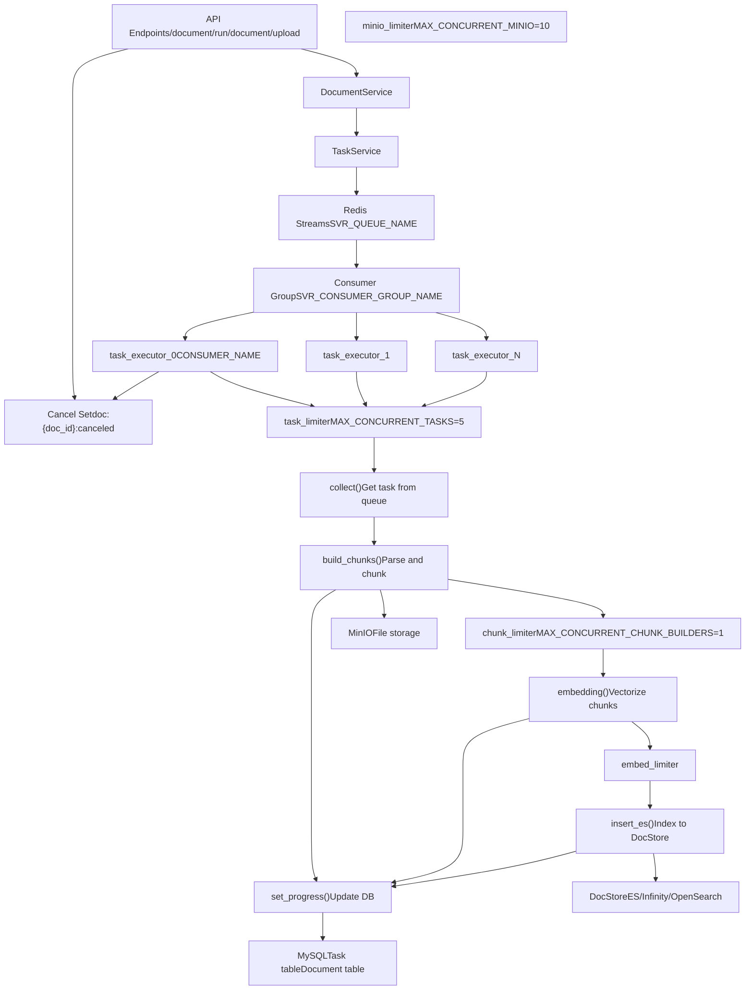
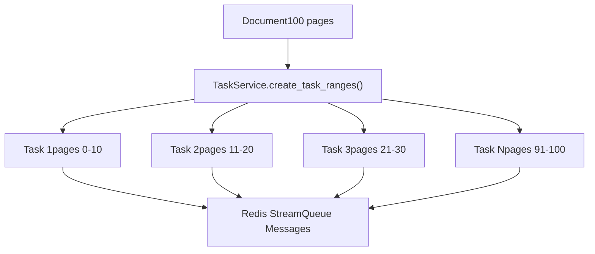
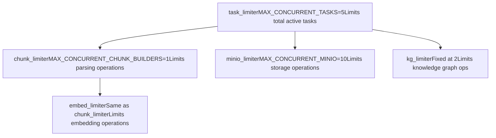
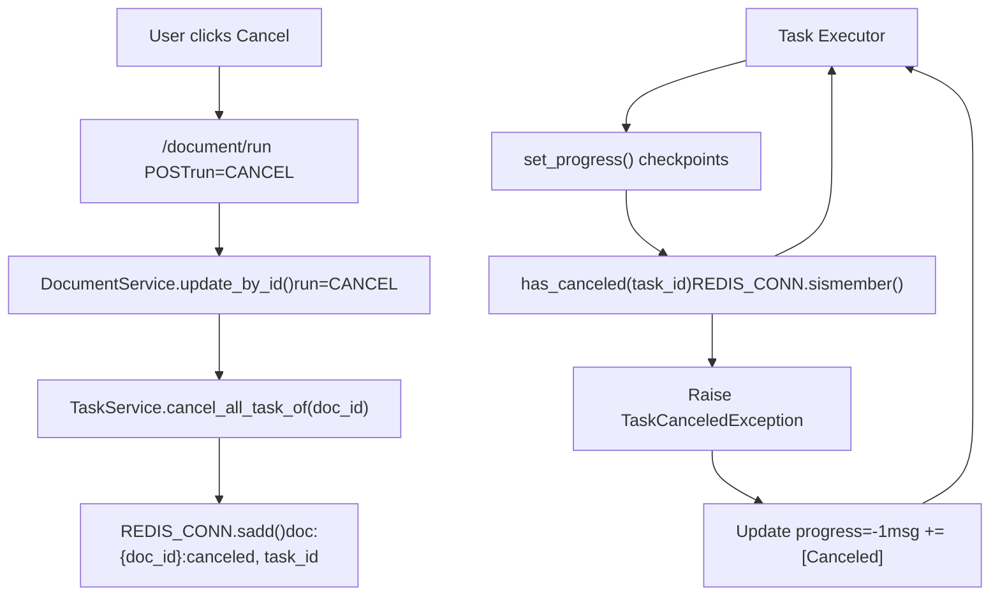
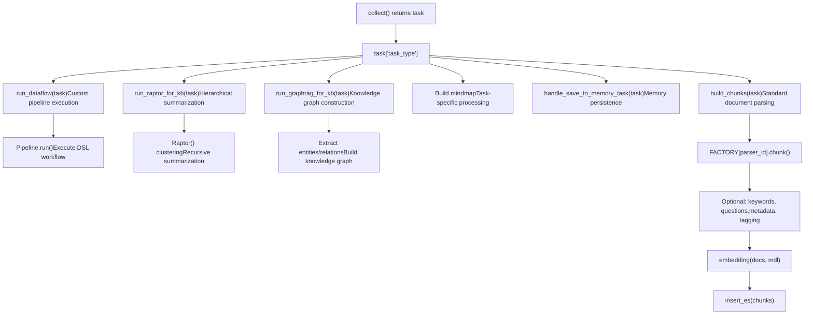

# Task Execution and Queue System

Relevant source files

-   [api/apps/chunk\_app.py](https://github.com/infiniflow/ragflow/blob/80a16e71/api/apps/chunk_app.py)
-   [api/apps/connector\_app.py](https://github.com/infiniflow/ragflow/blob/80a16e71/api/apps/connector_app.py)
-   [api/apps/conversation\_app.py](https://github.com/infiniflow/ragflow/blob/80a16e71/api/apps/conversation_app.py)
-   [api/apps/document\_app.py](https://github.com/infiniflow/ragflow/blob/80a16e71/api/apps/document_app.py)
-   [api/apps/file2document\_app.py](https://github.com/infiniflow/ragflow/blob/80a16e71/api/apps/file2document_app.py)
-   [api/apps/file\_app.py](https://github.com/infiniflow/ragflow/blob/80a16e71/api/apps/file_app.py)
-   [api/apps/kb\_app.py](https://github.com/infiniflow/ragflow/blob/80a16e71/api/apps/kb_app.py)
-   [api/db/db\_models.py](https://github.com/infiniflow/ragflow/blob/80a16e71/api/db/db_models.py)
-   [api/db/services/connector\_service.py](https://github.com/infiniflow/ragflow/blob/80a16e71/api/db/services/connector_service.py)
-   [api/db/services/dialog\_service.py](https://github.com/infiniflow/ragflow/blob/80a16e71/api/db/services/dialog_service.py)
-   [api/db/services/document\_service.py](https://github.com/infiniflow/ragflow/blob/80a16e71/api/db/services/document_service.py)
-   [api/db/services/file\_service.py](https://github.com/infiniflow/ragflow/blob/80a16e71/api/db/services/file_service.py)
-   [api/db/services/knowledgebase\_service.py](https://github.com/infiniflow/ragflow/blob/80a16e71/api/db/services/knowledgebase_service.py)
-   [api/db/services/task\_service.py](https://github.com/infiniflow/ragflow/blob/80a16e71/api/db/services/task_service.py)
-   [api/utils/common.py](https://github.com/infiniflow/ragflow/blob/80a16e71/api/utils/common.py)
-   [common/constants.py](https://github.com/infiniflow/ragflow/blob/80a16e71/common/constants.py)
-   [common/data\_source/\_\_init\_\_.py](https://github.com/infiniflow/ragflow/blob/80a16e71/common/data_source/__init__.py)
-   [common/data\_source/config.py](https://github.com/infiniflow/ragflow/blob/80a16e71/common/data_source/config.py)
-   [docker/docker-compose-base.yml](https://github.com/infiniflow/ragflow/blob/80a16e71/docker/docker-compose-base.yml)
-   [docker/infinity\_conf.toml](https://github.com/infiniflow/ragflow/blob/80a16e71/docker/infinity_conf.toml)
-   [helm/values.yaml](https://github.com/infiniflow/ragflow/blob/80a16e71/helm/values.yaml)
-   [pyproject.toml](https://github.com/infiniflow/ragflow/blob/80a16e71/pyproject.toml)
-   [rag/nlp/search.py](https://github.com/infiniflow/ragflow/blob/80a16e71/rag/nlp/search.py)
-   [rag/svr/sync\_data\_source.py](https://github.com/infiniflow/ragflow/blob/80a16e71/rag/svr/sync_data_source.py)
-   [rag/svr/task\_executor.py](https://github.com/infiniflow/ragflow/blob/80a16e71/rag/svr/task_executor.py)
-   [sdk/python/pyproject.toml](https://github.com/infiniflow/ragflow/blob/80a16e71/sdk/python/pyproject.toml)
-   [sdk/python/uv.lock](https://github.com/infiniflow/ragflow/blob/80a16e71/sdk/python/uv.lock)
-   [uv.lock](https://github.com/infiniflow/ragflow/blob/80a16e71/uv.lock)
-   [web/src/pages/user-setting/data-source/constant/index.tsx](https://github.com/infiniflow/ragflow/blob/80a16e71/web/src/pages/user-setting/data-source/constant/index.tsx)

## Purpose and Scope

This document describes RAGFlow's asynchronous task execution system for document processing, which handles parsing, chunking, embedding, and advanced operations like RAPTOR and GraphRAG. The system uses Redis Streams as a task queue, with multiple worker processes consuming tasks concurrently. For information about the document processing pipeline itself (parsing strategies, chunking methods), see [Document Processing Pipeline](/infiniflow/ragflow/6-document-processing-pipeline). For API endpoints that trigger task execution, see [Document and File Management APIs](/infiniflow/ragflow/8.4-document-and-file-management-apis).

---

## System Architecture Overview


**Sources**: [rag/svr/task\_executor.py1-124](https://github.com/infiniflow/ragflow/blob/80a16e71/rag/svr/task_executor.py#L1-L124) [api/db/services/task\_service.py1-70](https://github.com/infiniflow/ragflow/blob/80a16e71/api/db/services/task_service.py#L1-L70) [api/db/services/document\_service.py623-748](https://github.com/infiniflow/ragflow/blob/80a16e71/api/db/services/document_service.py#L623-L748)

---

## Redis Queue Infrastructure

The task queue system uses **Redis Streams** for reliable message delivery with consumer groups. Each task executor worker registers as a consumer in a shared consumer group, allowing automatic load balancing and fault tolerance.

### Queue Configuration

| Constant | Value | Description |
| --- | --- | --- |
| `SVR_CONSUMER_GROUP_NAME` | From settings | Consumer group name for all workers |
| `CONSUMER_NAME` | `task_executor_{N}` | Unique name per worker process |
| `BOOT_AT` | ISO timestamp | Worker start time |
| `WORKER_HEARTBEAT_TIMEOUT` | 120 seconds | Worker health check timeout |

**Sources**: [common/constants.py1-100](https://github.com/infiniflow/ragflow/blob/80a16e71/common/constants.py#L1-L100) [rag/svr/task\_executor.py105-111](https://github.com/infiniflow/ragflow/blob/80a16e71/rag/svr/task_executor.py#L105-L111)

### Message Structure

Tasks are enqueued as JSON messages with the following structure:

```
{
    "id": "task_uuid",
    "doc_id": "document_uuid",
    "task_type": "dataflow" | "raptor" | "graphrag" | "mindmap" | "memory",
    "tenant_id": "tenant_uuid",
    "kb_id": "knowledgebase_uuid",
    "dataflow_id": "pipeline_uuid",  # For dataflow tasks
    "doc_ids": [],  # For raptor/graphrag tasks
}
```
**Sources**: [rag/svr/task\_executor.py166-228](https://github.com/infiniflow/ragflow/blob/80a16e71/rag/svr/task_executor.py#L166-L228) [api/db/services/document\_service.py623-748](https://github.com/infiniflow/ragflow/blob/80a16e71/api/db/services/document_service.py#L623-L748)

### Task Collection Algorithm

> **[Mermaid sequence]**
> *(图表结构无法解析)*

**Sources**: [rag/svr/task\_executor.py166-228](https://github.com/infiniflow/ragflow/blob/80a16e71/rag/svr/task_executor.py#L166-L228)

The `collect()` function implements a two-phase retrieval strategy:

1.  **Unacked Iterator**: First checks for messages previously consumed but not acknowledged (crashed worker recovery)
2.  **Consumer Group Read**: If no unacked messages, performs blocking read from consumer group

**Sources**: [rag/svr/task\_executor.py166-184](https://github.com/infiniflow/ragflow/blob/80a16e71/rag/svr/task_executor.py#L166-L184)

---

## Task Creation and Dispatch

### Document Parsing Task Creation

When documents are uploaded or rerun, the system creates page-range tasks for parallel processing:


**Sources**: [api/db/services/task\_service.py283-401](https://github.com/infiniflow/ragflow/blob/80a16e71/api/db/services/task_service.py#L283-L401)

### Task Range Calculation

For PDF documents, the system splits by page ranges:

```
# From TaskService.create_task_ranges()
ranges = []
page_size = 10  # Default pages per task

for i in range(0, total_pages, page_size):
    ranges.append({
        "from_page": i,
        "to_page": min(i + page_size, total_pages)
    })
```
For other file types (Excel, non-paginated formats), a single task is created with `from_page=0` and `to_page=-1`.

**Sources**: [api/db/services/task\_service.py283-401](https://github.com/infiniflow/ragflow/blob/80a16e71/api/db/services/task_service.py#L283-L401)

### Special Task Types

Beyond document parsing, the system supports special task types with different dispatching:

| Task Type | Purpose | doc\_id | Dispatch Logic |
| --- | --- | --- | --- |
| `dataflow` | Custom pipeline execution | Normal or `CANVAS_DEBUG_DOC_ID` | Single task per document |
| `raptor` | Hierarchical summarization | `GRAPH_RAPTOR_FAKE_DOC_ID` | Single task per KB |
| `graphrag` | Knowledge graph construction | `GRAPH_RAPTOR_FAKE_DOC_ID` | Single task per KB |
| `mindmap` | Mind map generation | `GRAPH_RAPTOR_FAKE_DOC_ID` | Single task per KB |
| `memory` | Memory persistence | Varies | Single task per memory operation |

**Sources**: [rag/svr/task\_executor.py95-101](https://github.com/infiniflow/ragflow/blob/80a16e71/rag/svr/task_executor.py#L95-L101) [api/db/services/task\_service.py38-39](https://github.com/infiniflow/ragflow/blob/80a16e71/api/db/services/task_service.py#L38-L39)

---

## Task Executor Worker Pattern

### Worker Lifecycle

> **[Mermaid stateDiagram]**
> *(图表结构无法解析)*

**Sources**: [rag/svr/task\_executor.py127-164](https://github.com/infiniflow/ragflow/blob/80a16e71/rag/svr/task_executor.py#L127-L164)

### Main Event Loop

The worker runs an async event loop that continuously collects and processes tasks:

```
# Simplified from task_executor.py main loop
async def main():
    while not stop_event.is_set():
        redis_msg, task = await collect()

        if not task:
            continue

        try:
            await process_task(task)
            redis_msg.ack()
        except Exception as e:
            logging.exception(f"Task {task['id']} failed: {e}")
            # Retry handled by next collection cycle
```
**Sources**: [rag/svr/task\_executor.py1000-1100](https://github.com/infiniflow/ragflow/blob/80a16e71/rag/svr/task_executor.py#L1000-L1100)

### Signal Handling

Workers register signal handlers for graceful shutdown:

```
def signal_handler(sig, frame):
    logging.info("Received interrupt signal, shutting down...")
    stop_event.set()
    time.sleep(1)
    sys.exit(0)

signal.signal(signal.SIGINT, signal_handler)
signal.signal(signal.SIGTERM, signal_handler)
```
**Sources**: [rag/svr/task\_executor.py127-131](https://github.com/infiniflow/ragflow/blob/80a16e71/rag/svr/task_executor.py#L127-L131)

---

## Concurrency Controls

The system uses **asyncio Semaphores** to limit concurrent operations and prevent resource exhaustion:

### Semaphore Configuration


**Sources**: [rag/svr/task\_executor.py115-122](https://github.com/infiniflow/ragflow/blob/80a16e71/rag/svr/task_executor.py#L115-L122)

### Semaphore Usage Pattern

```
# From build_chunks()
async def build_chunks(task, progress_callback):
    # File retrieval limited by minio_limiter (implicit)
    binary = await get_storage_binary(bucket, name)

    # Chunking limited by chunk_limiter
    async with chunk_limiter:
        chunks = await asyncio.to_thread(
            chunker.chunk,
            task["name"],
            binary=binary,
            ...
        )

    # Embedding limited by embed_limiter
    async with embed_limiter:
        vectors, token_count = await asyncio.to_thread(
            mdl.encode,
            texts
        )
```
**Sources**: [rag/svr/task\_executor.py234-608](https://github.com/infiniflow/ragflow/blob/80a16e71/rag/svr/task_executor.py#L234-L608)

### Environment Variable Configuration

| Variable | Default | Purpose |
| --- | --- | --- |
| `MAX_CONCURRENT_TASKS` | 5 | Total tasks processed simultaneously |
| `MAX_CONCURRENT_CHUNK_BUILDERS` | 1 | Parsing operations (CPU-intensive) |
| `MAX_CONCURRENT_MINIO` | 10 | MinIO I/O operations |
| `WORKER_HEARTBEAT_TIMEOUT` | 120 | Worker health check timeout (seconds) |

**Sources**: [rag/svr/task\_executor.py115-123](https://github.com/infiniflow/ragflow/blob/80a16e71/rag/svr/task_executor.py#L115-L123) [pyproject.toml1-278](https://github.com/infiniflow/ragflow/blob/80a16e71/pyproject.toml#L1-L278)

---

## Progress Tracking and Updates

### Progress Update Mechanism

> **[Mermaid sequence]**
> *(图表结构无法解析)*

**Sources**: [rag/svr/task\_executor.py134-164](https://github.com/infiniflow/ragflow/blob/80a16e71/rag/svr/task_executor.py#L134-L164)

### Progress Stages

Document parsing tasks progress through these stages:

| Progress | Stage | Description |
| --- | --- | --- |
| 0.0 - 0.1 | Received | Task retrieved from queue |
| 0.1 - 0.7 | Parsing | Chunking document content |
| 0.7 - 0.9 | Embedding | Generating vector embeddings |
| 0.9 - 1.0 | Indexing | Inserting into DocStore |
| 1.0 | Complete | Task finished successfully |
| \-1.0 | Failed | Error or cancellation |

**Sources**: [rag/svr/task\_executor.py234-280](https://github.com/infiniflow/ragflow/blob/80a16e71/rag/svr/task_executor.py#L234-L280) [rag/svr/task\_executor.py556-608](https://github.com/infiniflow/ragflow/blob/80a16e71/rag/svr/task_executor.py#L556-L608)

### Progress Message Format

```
# Example progress messages with timestamps
"08:15:23 Task has been received."
"08:15:25 Page(0~10): Start to parse."
"08:15:30 Page(0~10): Parsing completed."
"08:15:32 Start to generate keywords for every chunk ..."
"08:15:40 Keywords generation 156 chunks completed in 8.12s"
"08:15:45 Indexing done (5.23s). Task done (22.45s)"
```
**Sources**: [rag/svr/task\_executor.py134-164](https://github.com/infiniflow/ragflow/blob/80a16e71/rag/svr/task_executor.py#L134-L164)

### Retry Logic

Tasks can be retried up to 3 times on failure:

```
# From TaskService.get_task()
if docs[0]["retry_count"] >= 3:
    msg = "\nERROR: Task is abandoned after 3 times attempts."
    prog = -1
    # Update and return None to skip processing

# Increment retry count
cls.model.update(
    retry_count=docs[0]["retry_count"] + 1,
    progress_msg=cls.model.progress_msg + msg,
    progress=prog
).where(cls.model.id == docs[0]["id"]).execute()
```
**Sources**: [api/db/services/task\_service.py74-149](https://github.com/infiniflow/ragflow/blob/80a16e71/api/db/services/task_service.py#L74-L149)

---

## Task Cancellation

### Cancellation Flow


**Sources**: [api/db/services/task\_service.py427-447](https://github.com/infiniflow/ragflow/blob/80a16e71/api/db/services/task_service.py#L427-L447) [rag/svr/task\_executor.py134-164](https://github.com/infiniflow/ragflow/blob/80a16e71/rag/svr/task_executor.py#L134-L164)

### Cancellation Storage

The system uses Redis Sets to track canceled tasks:

```
# From TaskService.cancel_all_task_of()
def cancel_all_task_of(doc_id: str):
    tasks = Task.select().where(Task.doc_id == doc_id)

    for task in tasks:
        # Add to Redis cancel set
        REDIS_CONN.sadd(
            f"doc:{doc_id}:canceled",
            task.id
        )
        # Set expiration
        REDIS_CONN.expire(f"doc:{doc_id}:canceled", 3600)

# Check cancellation in worker
def has_canceled(task_id: str) -> bool:
    return REDIS_CONN.sismember(
        f"doc:{task.doc_id}:canceled",
        task_id
    )
```
**Sources**: [api/db/services/task\_service.py427-447](https://github.com/infiniflow/ragflow/blob/80a16e71/api/db/services/task_service.py#L427-L447)

### Cancellation Checkpoints

Workers check for cancellation at multiple points:

1.  **Task collection**: Before starting processing [rag/svr/task\_executor.py209](https://github.com/infiniflow/ragflow/blob/80a16e71/rag/svr/task_executor.py#L209-L209)
2.  **Progress updates**: Every `set_progress()` call [rag/svr/task\_executor.py138-158](https://github.com/infiniflow/ragflow/blob/80a16e71/rag/svr/task_executor.py#L138-L158)
3.  **Chunk processing**: After parsing each page range [rag/svr/task\_executor.py335-337](https://github.com/infiniflow/ragflow/blob/80a16e71/rag/svr/task_executor.py#L335-L337)
4.  **Keyword generation**: Before each LLM call [rag/svr/task\_executor.py368-370](https://github.com/infiniflow/ragflow/blob/80a16e71/rag/svr/task_executor.py#L368-L370)
5.  **Embedding batches**: During vectorization [rag/svr/task\_executor.py854-857](https://github.com/infiniflow/ragflow/blob/80a16e71/rag/svr/task_executor.py#L854-L857)

**Sources**: [rag/svr/task\_executor.py134-900](https://github.com/infiniflow/ragflow/blob/80a16e71/rag/svr/task_executor.py#L134-L900)

---

## Task Types and Processing

### Task Type Dispatch


**Sources**: [rag/svr/task\_executor.py95-101](https://github.com/infiniflow/ragflow/blob/80a16e71/rag/svr/task_executor.py#L95-L101) [rag/svr/task\_executor.py610-1000](https://github.com/infiniflow/ragflow/blob/80a16e71/rag/svr/task_executor.py#L610-L1000)

### Standard Document Parsing Pipeline

The standard parsing pipeline (`build_chunks()`) follows these steps:

1.  **File Retrieval**: Fetch binary from MinIO [rag/svr/task\_executor.py234-259](https://github.com/infiniflow/ragflow/blob/80a16e71/rag/svr/task_executor.py#L234-L259)
2.  **Chunking**: Parse using appropriate parser [rag/svr/task\_executor.py260-280](https://github.com/infiniflow/ragflow/blob/80a16e71/rag/svr/task_executor.py#L260-L280)
3.  **Image Upload**: Upload chunk images to MinIO [rag/svr/task\_executor.py291-326](https://github.com/infiniflow/ragflow/blob/80a16e71/rag/svr/task_executor.py#L291-L326)
4.  **Keyword Extraction** (optional): LLM-based keywords [rag/svr/task\_executor.py327-358](https://github.com/infiniflow/ragflow/blob/80a16e71/rag/svr/task_executor.py#L327-L358)
5.  **Question Generation** (optional): Synthetic Q&A pairs [rag/svr/task\_executor.py360-390](https://github.com/infiniflow/ragflow/blob/80a16e71/rag/svr/task_executor.py#L360-L390)
6.  **Metadata Extraction** (optional): Structured metadata [rag/svr/task\_executor.py392-435](https://github.com/infiniflow/ragflow/blob/80a16e71/rag/svr/task_executor.py#L392-L435)
7.  **Content Tagging** (optional): Assign tags from KB [rag/svr/task\_executor.py437-500](https://github.com/infiniflow/ragflow/blob/80a16e71/rag/svr/task_executor.py#L437-L500)
8.  **Table of Contents** (optional): Generate TOC structure [rag/svr/task\_executor.py505-548](https://github.com/infiniflow/ragflow/blob/80a16e71/rag/svr/task_executor.py#L505-L548)

**Sources**: [rag/svr/task\_executor.py234-502](https://github.com/infiniflow/ragflow/blob/80a16e71/rag/svr/task_executor.py#L234-L502)

### Dataflow Task Execution

Dataflow tasks execute custom pipelines defined in Canvas DSL:

```
# From run_dataflow()
async def run_dataflow(task: dict):
    # Load pipeline DSL
    e, cvs = UserCanvasService.get_by_id(dataflow_id)
    dsl = cvs.dsl

    # Create pipeline instance
    pipeline = Pipeline(dsl, tenant_id, doc_id, task_id, flow_id)

    # Execute pipeline
    chunks = await pipeline.run(file=task["file"])

    # If no vectors in chunks, generate embeddings
    if not any(re.match(r"q_[0-9]+_vec", k) for o in chunks for k in o.keys()):
        # Batch embed chunks
        for i in range(0, len(texts), EMBEDDING_BATCH_SIZE):
            vects, token_count = await asyncio.to_thread(
                embedding_model.encode,
                texts[i:i+EMBEDDING_BATCH_SIZE]
            )
        # Assign vectors to chunks

    # Index to DocStore
    await insert_es(task_id, tenant_id, kb_id, chunks, progress_callback)
```
**Sources**: [rag/svr/task\_executor.py610-749](https://github.com/infiniflow/ragflow/blob/80a16e71/rag/svr/task_executor.py#L610-L749)

### RAPTOR Task Execution

RAPTOR tasks perform hierarchical clustering and summarization across document chunks:

```
# From run_raptor_for_kb()
async def run_raptor_for_kb(row, kb_parser_config, chat_mdl, embd_mdl, vector_size):
    raptor_config = kb_parser_config.get("raptor", {})

    # Retrieve all chunks for documents
    chunks = []
    for doc_id in doc_ids:
        for chunk in retriever.chunk_list(doc_id, tenant_id, [kb_id]):
            chunks.append((chunk["content"], np.array(chunk["q_vec"])))

    # Create RAPTOR instance
    raptor = Raptor(
        max_cluster=raptor_config.get("max_cluster", 64),
        chat_mdl,
        embd_mdl,
        prompt=raptor_config["prompt"],
        max_token=raptor_config["max_token"],
        threshold=raptor_config["threshold"]
    )

    # Generate hierarchical summaries
    new_chunks = await raptor(chunks, random_seed, callback, task_id)

    # Index summary chunks with special marker
    for content, vector in new_chunks[original_length:]:
        chunk = {
            "id": xxhash.xxh64(content + GRAPH_RAPTOR_FAKE_DOC_ID).hexdigest(),
            "raptor_kwd": "raptor",  # Special marker
            "content_with_weight": content,
            "q_vec": vector.tolist()
        }
        results.append(chunk)
```
**Sources**: [rag/svr/task\_executor.py751-816](https://github.com/infiniflow/ragflow/blob/80a16e71/rag/svr/task_executor.py#L751-L816)

### Task Performance Metrics

The system tracks various metrics during task execution:

| Metric | Storage Location | Purpose |
| --- | --- | --- |
| `progress` | Task table | Current completion percentage |
| `progress_msg` | Task table | Timestamped log messages |
| `retry_count` | Task table | Number of retry attempts |
| `chunk_num` | Document table | Total chunks created |
| `token_num` | Document table | Total embedding tokens |
| `process_duration` | Document table | Total processing time (seconds) |
| `digest` | Task table | Hash of chunk IDs for verification |

**Sources**: [api/db/db\_models.py555-750](https://github.com/infiniflow/ragflow/blob/80a16e71/api/db/db_models.py#L555-L750) [api/db/services/document\_service.py432-464](https://github.com/infiniflow/ragflow/blob/80a16e71/api/db/services/document_service.py#L432-L464)

---

## Worker Monitoring and Statistics

### Worker Statistics

Each worker maintains runtime statistics exposed through global variables:

```
# From task_executor.py
CONSUMER_NAME = "task_executor_" + CONSUMER_NO
BOOT_AT = datetime.now().isoformat()
PENDING_TASKS = 0      # Tasks in queue
LAG_TASKS = 0          # Backlog size
DONE_TASKS = 0         # Successfully completed
FAILED_TASKS = 0       # Failed or canceled
CURRENT_TASKS = {}     # Currently processing tasks
```
**Sources**: [rag/svr/task\_executor.py105-113](https://github.com/infiniflow/ragflow/blob/80a16e71/rag/svr/task_executor.py#L105-L113)

### Health Monitoring

Workers can be monitored through:

1.  **Redis consumer group info**: Shows active consumers and their pending messages
2.  **Task table queries**: Shows task progress and failure rates
3.  **Worker heartbeat**: `WORKER_HEARTBEAT_TIMEOUT` detects crashed workers
4.  **Process monitoring**: Standard process management tools

**Sources**: [rag/svr/task\_executor.py115-124](https://github.com/infiniflow/ragflow/blob/80a16e71/rag/svr/task_executor.py#L115-L124) [common/constants.py1-150](https://github.com/infiniflow/ragflow/blob/80a16e71/common/constants.py#L1-L150)

---

**Sources**: [rag/svr/task\_executor.py1-1200](https://github.com/infiniflow/ragflow/blob/80a16e71/rag/svr/task_executor.py#L1-L1200) [api/db/services/task\_service.py1-500](https://github.com/infiniflow/ragflow/blob/80a16e71/api/db/services/task_service.py#L1-L500) [api/db/services/document\_service.py1-1000](https://github.com/infiniflow/ragflow/blob/80a16e71/api/db/services/document_service.py#L1-L1000) [api/apps/document\_app.py573-630](https://github.com/infiniflow/ragflow/blob/80a16e71/api/apps/document_app.py#L573-L630) [common/constants.py1-200](https://github.com/infiniflow/ragflow/blob/80a16e71/common/constants.py#L1-L200) [pyproject.toml1-278](https://github.com/infiniflow/ragflow/blob/80a16e71/pyproject.toml#L1-L278)
