# Frontend Application

Relevant source files

-   [web/src/locales/de.ts](https://github.com/infiniflow/ragflow/blob/80a16e71/web/src/locales/de.ts)
-   [web/src/locales/en.ts](https://github.com/infiniflow/ragflow/blob/80a16e71/web/src/locales/en.ts)
-   [web/src/locales/es.ts](https://github.com/infiniflow/ragflow/blob/80a16e71/web/src/locales/es.ts)
-   [web/src/locales/fr.ts](https://github.com/infiniflow/ragflow/blob/80a16e71/web/src/locales/fr.ts)
-   [web/src/locales/id.ts](https://github.com/infiniflow/ragflow/blob/80a16e71/web/src/locales/id.ts)
-   [web/src/locales/it.ts](https://github.com/infiniflow/ragflow/blob/80a16e71/web/src/locales/it.ts)
-   [web/src/locales/ja.ts](https://github.com/infiniflow/ragflow/blob/80a16e71/web/src/locales/ja.ts)
-   [web/src/locales/pt-br.ts](https://github.com/infiniflow/ragflow/blob/80a16e71/web/src/locales/pt-br.ts)
-   [web/src/locales/ru.ts](https://github.com/infiniflow/ragflow/blob/80a16e71/web/src/locales/ru.ts)
-   [web/src/locales/vi.ts](https://github.com/infiniflow/ragflow/blob/80a16e71/web/src/locales/vi.ts)
-   [web/src/locales/zh-traditional.ts](https://github.com/infiniflow/ragflow/blob/80a16e71/web/src/locales/zh-traditional.ts)
-   [web/src/locales/zh.ts](https://github.com/infiniflow/ragflow/blob/80a16e71/web/src/locales/zh.ts)

## Purpose and Scope

The Frontend Application is a React-based web interface that provides user access to all RAGFlow features. It implements a multi-page application supporting 12 languages, offering interfaces for dataset management, conversational chat, agent workflow creation, file organization, and system configuration. This document covers the application structure, routing, internationalization system, and major UI components. For backend API endpoints consumed by the frontend, see [Backend API System](/infiniflow/ragflow/8-backend-api-system). For the Agent/Flow visual builder implementation details, see [Agent and Workflow System](/infiniflow/ragflow/9-agent-and-workflow-system).

---

## Technology Stack and Build Configuration

The frontend is built with modern web technologies:

**Core Framework**: React (likely with TypeScript based on `.ts` file extensions) **Internationalization**: `i18next` library with namespace-based translation organization **Supported Languages**: 12 languages including English, Chinese (Simplified/Traditional), Vietnamese, Japanese, German, Indonesian, Portuguese (Brazil), Russian, Spanish, French, Italian

The application follows a standard React project structure with source files located in `web/src/` and localization resources in `web/src/locales/`.

**Sources**: [web/src/locales/en.ts1-100](https://github.com/infiniflow/ragflow/blob/80a16e71/web/src/locales/en.ts#L1-L100) [web/src/locales/zh.ts1-100](https://github.com/infiniflow/ragflow/blob/80a16e71/web/src/locales/zh.ts#L1-L100) High-level Diagram 3

---

## Application Architecture Overview

```mermaid
flowchart TD
    Router["React Router"]
    I18n["i18nextTranslation Engine"]
    StateManagement["State Management(Context/Redux)"]
    LoginPage["Login/Register Pagelogin.*"]
    DatasetList["Dataset ListknowledgeList.*"]
    DatasetDetail["Dataset DetailknowledgeDetails.*"]
    ChunkView["Chunk Managementchunk.*"]
    ChatInterface["Chat Interfacechat.*"]
    AgentFlow["Agent/Flow Builderflow.*"]
    FileManager["File ManagerfileManager.*"]
    Settings["Settings Pagessetting.*"]
    MemorySystem["Memory Systemmemories.,memory."]
    Header["Header Componentheader.*"]
    Common["Common Componentscommon.*"]
    DatasetAPI["/api/v1/datasets"]
    ChatAPI["/api/v1/chats"]
    AgentAPI["/api/v1/agents"]
    FileAPI["/api/v1/files"]

    Router --> LoginPage
    Router --> DatasetList
    Router --> DatasetDetail
    Router --> ChunkView
    Router --> ChatInterface
    Router --> AgentFlow
    Router --> FileManager
    Router --> Settings
    Router --> MemorySystem
    I18n --> LoginPage
    I18n --> DatasetList
    I18n --> DatasetDetail
    I18n --> ChunkView
    I18n --> ChatInterface
    I18n --> AgentFlow
    I18n --> FileManager
    I18n --> Settings
    I18n --> MemorySystem
    I18n --> Header
    I18n --> Common
    StateManagement --> LoginPage
    StateManagement --> DatasetList
    StateManagement --> DatasetDetail
    StateManagement --> ChunkView
    StateManagement --> ChatInterface
    StateManagement --> AgentFlow
    LoginPage --> DatasetAPI
    DatasetList --> DatasetAPI
    DatasetDetail --> DatasetAPI
    ChunkView --> DatasetAPI
    ChatInterface --> ChatAPI
    AgentFlow --> AgentAPI
    FileManager --> FileAPI
```


**Diagram: Frontend Application Architecture**

The application uses a modular component structure where each major feature corresponds to a translation namespace and likely a dedicated React component tree. The i18next engine loads translations dynamically based on user language preference, and all components consume backend APIs via HTTP requests.

**Sources**: [web/src/locales/en.ts1-100](https://github.com/infiniflow/ragflow/blob/80a16e71/web/src/locales/en.ts#L1-L100) [web/src/locales/zh.ts1-100](https://github.com/infiniflow/ragflow/blob/80a16e71/web/src/locales/zh.ts#L1-L100) High-level Diagram 3

---

## Internationalization System

### Supported Languages and Translation Files

The application supports 12 languages with dedicated translation files:

| Language | File | Key Statistics |
| --- | --- | --- |
| English | `web/src/locales/en.ts` | Primary translation file, ~788 lines |
| Chinese (Simplified) | `web/src/locales/zh.ts` | ~897 lines |
| Chinese (Traditional) | `web/src/locales/zh-traditional.ts` | ~611 lines |
| Vietnamese | `web/src/locales/vi.ts` | ~224 lines |
| Japanese | `web/src/locales/ja.ts` | ~260 lines |
| German | `web/src/locales/de.ts` | ~412 lines |
| Indonesian | `web/src/locales/id.ts` | ~168 lines |
| Portuguese (Brazil) | `web/src/locales/pt-br.ts` | ~178 lines |
| Russian | `web/src/locales/ru.ts` | ~330 lines |
| Spanish | `web/src/locales/es.ts` | ~199 lines |
| French | `web/src/locales/fr.ts` | ~177 lines |
| Italian | (implied but not in provided files) | \- |

**Sources**: File list provided, [web/src/locales/en.ts1](https://github.com/infiniflow/ragflow/blob/80a16e71/web/src/locales/en.ts#L1-L1) [web/src/locales/zh.ts1](https://github.com/infiniflow/ragflow/blob/80a16e71/web/src/locales/zh.ts#L1-L1)

### Translation Namespace Structure

```mermaid
flowchart TD
    TranslationRoot["translation"]
    Common["commonShared UI elements"]
    Login["loginAuthentication flows"]
    Header["headerNavigation bar"]
    Memories["memoriesMemory list view"]
    Memory["memoryMemory detail/config"]
    KnowledgeList["knowledgeListDataset list view"]
    KnowledgeDetails["knowledgeDetailsDataset files/parsing"]
    KnowledgeConfig["knowledgeConfigurationDataset settings"]
    Chunk["chunkChunk management"]
    Chat["chatChat interface"]
    Setting["settingUser/system settings"]
    Flow["flowAgent workflow builder"]
    FileManager["fileManagerFile organization"]

    TranslationRoot --> Common
    TranslationRoot --> Login
    TranslationRoot --> Header
    TranslationRoot --> Memories
    TranslationRoot --> Memory
    TranslationRoot --> KnowledgeList
    TranslationRoot --> KnowledgeDetails
    TranslationRoot --> KnowledgeConfig
    TranslationRoot --> Chunk
    TranslationRoot --> Chat
    TranslationRoot --> Setting
    TranslationRoot --> Flow
    TranslationRoot --> FileManager
```


**Diagram: Translation Namespace Hierarchy**

Each namespace corresponds to a major UI section. For example, `translation.knowledgeDetails.*` contains all strings for the dataset detail page including file upload, parsing configuration, and chunk viewing.

**Sources**: [web/src/locales/en.ts1-100](https://github.com/infiniflow/ragflow/blob/80a16e71/web/src/locales/en.ts#L1-L100) [web/src/locales/zh.ts1-100](https://github.com/infiniflow/ragflow/blob/80a16e71/web/src/locales/zh.ts#L1-L100)

### Key Translation Patterns

The translation files follow consistent naming conventions:

**Common Elements** (`translation.common.*`):

-   Action verbs: `delete`, `save`, `create`, `edit`, `upload`, `download`, `search`
-   Modal titles: `deleteModalTitle`, `confirm`, `cancel`
-   Form placeholders: `namePlaceholder`, `selectPlaceholder`, `pleaseInput`, `pleaseSelect`
-   Language names: `english`, `chinese`, `spanish`, etc.

**Page-Specific Elements**:

-   Page titles and descriptions: `*.welcome`, `*.description`, `*.title`
-   Form fields: `*Label`, `*Placeholder`, `*Message`, `*Tip`
-   Status indicators: `runningStatus0`, `runningStatus1`, `enabled`, `disabled`
-   Error messages: `*Error`, `*Warning`, `*Required`

**Example from Dataset Details** ([web/src/locales/en.ts174-412](https://github.com/infiniflow/ragflow/blob/80a16e71/web/src/locales/en.ts#L174-L412)):

```
knowledgeDetails: {
  dataset: 'Dataset',
  testing: 'Retrieval testing',
  files: 'files',
  configuration: 'Configuration',
  knowledgeGraph: 'Knowledge graph',
  addFile: 'Add file',
  searchFiles: 'Search your files',
  chunkMethod: 'Chunking method',
  parsingStatus: 'Parsing status',
  parsingStatusTip: 'Document parsing time varies...',
  // ... hundreds more keys
}
```
**Sources**: [web/src/locales/en.ts2-65](https://github.com/infiniflow/ragflow/blob/80a16e71/web/src/locales/en.ts#L2-L65) [web/src/locales/en.ts174-412](https://github.com/infiniflow/ragflow/blob/80a16e71/web/src/locales/en.ts#L174-L412) [web/src/locales/zh.ts2-65](https://github.com/infiniflow/ragflow/blob/80a16e71/web/src/locales/zh.ts#L2-L65)

---

## Main Application Sections

### 1\. Login and Authentication

```mermaid
flowchart TD
    LoginPage["Login/Register Page"]
    EmailInput["Email Inputtranslation.login.emailLabel"]
    PasswordInput["Password Inputtranslation.login.passwordLabel"]
    RememberMe["Remember Me Checkboxtranslation.login.rememberMe"]
    LoginButton["Sign In Buttontranslation.login.login"]
    SignUpLink["Sign Up Linktranslation.login.signUpTip"]
    OAuth["OAuth OptionsGitHub/Google/OIDC"]
    SignUpPage["Registration Page"]
    NicknameInput["Nickname Inputtranslation.login.nicknameLabel"]
    EmailInputReg["Email Input"]
    PasswordInputReg["Password Input"]
    RegisterButton["Create Account Buttontranslation.login.register"]

    LoginPage --> EmailInput
    LoginPage --> PasswordInput
    LoginPage --> RememberMe
    LoginPage --> LoginButton
    LoginPage --> SignUpLink
    LoginPage --> OAuth
    SignUpPage --> NicknameInput
    SignUpPage --> EmailInputReg
    SignUpPage --> PasswordInputReg
    SignUpPage --> RegisterButton
```


**Diagram: Login and Authentication UI Components**

The login interface provides both traditional email/password authentication and OAuth integration. Translation keys indicate support for:

-   Email/password login with "Remember me" option
-   New user registration with nickname field
-   OAuth providers (GitHub, Google, OIDC mentioned in high-level diagrams)
-   Language selection at login

**Localizable Elements**:

-   Page titles: `loginTitle`, `signUpTitle`
-   Form labels: `emailLabel`, `passwordLabel`, `nicknameLabel`
-   Action buttons: `login`, `signUp`, `register`, `continue`
-   Help text: `signInTip`, `signUpTip`, `loginDescription`, `registerDescription`

**Sources**: [web/src/locales/en.ts65-88](https://github.com/infiniflow/ragflow/blob/80a16e71/web/src/locales/en.ts#L65-L88) [web/src/locales/zh.ts60-83](https://github.com/infiniflow/ragflow/blob/80a16e71/web/src/locales/zh.ts#L60-L83) High-level Diagram 3

### 2\. Header and Navigation

The header component provides global navigation across all authenticated pages:

**Navigation Items** ([web/src/locales/en.ts89-103](https://github.com/infiniflow/ragflow/blob/80a16e71/web/src/locales/en.ts#L89-L103)):

-   `header.dataset` / `header.knowledgeBase` - Navigate to dataset list
-   `header.chat` - Navigate to chat interface
-   `header.flow` - Navigate to agent/workflow builder
-   `header.fileManager` - Navigate to file management
-   `header.memories` - Navigate to memory system
-   `header.search` - Global search functionality
-   `header.setting` - User settings
-   `header.logout` - Sign out

**Sources**: [web/src/locales/en.ts89-103](https://github.com/infiniflow/ragflow/blob/80a16e71/web/src/locales/en.ts#L89-L103) [web/src/locales/zh.ts84-98](https://github.com/infiniflow/ragflow/blob/80a16e71/web/src/locales/zh.ts#L84-L98)

### 3\. Dataset Management Interface

The dataset management section is one of the most complex parts of the frontend, spanning multiple sub-pages:

#### 3.1 Dataset List Page

**Key Features** ([web/src/locales/en.ts174-184](https://github.com/infiniflow/ragflow/blob/80a16e71/web/src/locales/en.ts#L174-L184)):

-   Welcome message: `knowledgeList.welcome`, `knowledgeList.description`
-   Create button: `knowledgeList.createKnowledgeBase`
-   Search input: `knowledgeList.searchKnowledgePlaceholder`
-   List columns: `name`, `doc` (document count)
-   Empty state: `knowledgeList.noMoreData`

#### 3.2 Dataset Detail Page

**Sub-navigation Tabs**:

1.  **Files Tab** (`knowledgeDetails.files`)

    -   File operations: `addFile`, `searchFiles`, `upload`, `run` (parse)
    -   Upload methods: `localFiles`, `emptyFiles`, `webCrawl`
    -   File metadata: `fileName`, `fileSize`, `fileType`, `uploadDate`, `uploadedBy`
    -   Parsing status: `parsingStatus`, `runningStatus0-4` (PENDING/PARSING/CANCELED/SUCCESS/FAIL)
2.  **Parsing Configuration**

    -   Method selection: `chunkMethod`, `chunkMethodPlaceholder`
    -   PDF options: `layoutRecognize`, `pageRanges`, `taskPageSize`
    -   Text processing: `delimiter`, `html4excel`, `autoKeywords`, `autoQuestions`
    -   Rerank settings: `rerankModel`, `topK`
3.  **Testing Tab** (`knowledgeDetails.testing`)

    -   Test input: `testText`, `testTextPlaceholder`
    -   Retrieval parameters: `similarityThreshold`, `vectorSimilarityWeight`, `keywordSimilarityWeight`, `topN`
    -   Results display: `similarity`, `termSimilarity`, `vectorSimilarity`, `hits`
4.  **Configuration Tab** (`knowledgeConfiguration.*`)

    -   Basic info: `name`, `description`, `language`, `permissions` (me/team)
    -   Model selection: `embeddingModel`, `chunkTokenNumber`
    -   Advanced: `autoMetadata`, `imageTableContextWindow`, `pageRank`, `tagSet`
5.  **Knowledge Graph Tab**

    -   Generation: `generateKnowledgeGraph`, `useGraphRag`
    -   Method: `graphRagMethod` (Light/General)
    -   Options: `resolution`, `community`, `entityTypes`

**Sources**: [web/src/locales/en.ts174-411](https://github.com/infiniflow/ragflow/blob/80a16e71/web/src/locales/en.ts#L174-L411) [web/src/locales/en.ts412-671](https://github.com/infiniflow/ragflow/blob/80a16e71/web/src/locales/en.ts#L412-L671) [web/src/locales/zh.ts165-381](https://github.com/infiniflow/ragflow/blob/80a16e71/web/src/locales/zh.ts#L165-L381) [web/src/locales/zh.ts382-643](https://github.com/infiniflow/ragflow/blob/80a16e71/web/src/locales/zh.ts#L382-L643)

#### 3.3 Chunk Management View

**Features** ([web/src/locales/en.ts672-705](https://github.com/infiniflow/ragflow/blob/80a16e71/web/src/locales/en.ts#L672-L705)):

-   Bulk operations: `chunk.selectAll`, `chunk.enabledSelected`, `chunk.disabledSelected`, `chunk.deleteSelected`
-   Filters: `chunk.all`, `chunk.enabled`, `chunk.disabled`
-   Search: `chunk.search`
-   Metadata fields: `chunk.keyword`, `chunk.question`, `chunk.function`
-   Display modes: `chunk.full`, `chunk.ellipse`
-   Visualizations: `chunk.graph` (knowledge graph), `chunk.mind` (mind map)
-   Image chunks: `chunk.image`, `chunk.imageUploaderTitle`

**Sources**: [web/src/locales/en.ts672-705](https://github.com/infiniflow/ragflow/blob/80a16e71/web/src/locales/en.ts#L672-L705) [web/src/locales/zh.ts644-669](https://github.com/infiniflow/ragflow/blob/80a16e71/web/src/locales/zh.ts#L644-L669)

### 4\. Chat Interface


**Diagram: Chat Interface Components**

The chat interface is highly configurable with multiple panels for assistant creation, model tuning, and analytics. Key features:

**Assistant Configuration**:

-   Name, avatar, description, opener message
-   Knowledge base selection (multiple KBs supported)
-   System prompt with variable substitution (e.g., `{knowledge}`)
-   Empty response fallback
-   Language selection

**Model Parameters** ([web/src/locales/en.ts721-756](https://github.com/infiniflow/ragflow/blob/80a16e71/web/src/locales/en.ts#L721-L756)):

-   Model selection: `model`, `modelMessage`
-   Freedom presets: `precise`, `balance`, `improvise`, `custom`
-   Fine-tuning: `temperature`, `topP`, `presencePenalty`, `frequencyPenalty`, `maxTokens`
-   Tool enablement: `modelEnabledTools`

**Retrieval Configuration**:

-   `topN` - Number of chunks to retrieve
-   `similarityThreshold` - Minimum chunk similarity
-   `vectorSimilarityWeight`, `keywordSimilarityWeight` - Hybrid search weights
-   `rerankModel` - Optional reranking model

**Advanced Features**:

-   `quote` - Show citations in responses
-   `useKnowledgeGraph` - Include graph entities/relationships
-   `keyword` - LLM-based keyword extraction from queries
-   `reasoning` - Enable reasoning workflows (like o1/R1)
-   `multiTurn` - Context-aware query optimization
-   `crossLanguage` - Multi-language search
-   `metadata` - Metadata filtering with conditions
-   `tocEnhance` - Table of contents enhancement

**API Integration**:

-   Embed chat: `embedIntoSite`, `embedModalTitle`
-   API access: `apiKey`, `serviceApiEndpoint`, `apiReference`
-   Embedding modes: `fullScreenTitle`, `partialTitle`, `extensionTitle`

**Sources**: [web/src/locales/en.ts670-836](https://github.com/infiniflow/ragflow/blob/80a16e71/web/src/locales/en.ts#L670-L836) [web/src/locales/zh.ts670-836](https://github.com/infiniflow/ragflow/blob/80a16e71/web/src/locales/zh.ts#L670-L836)

### 5\. Agent/Flow Builder

The agent/flow interface provides visual workflow creation:

**Core Components** ([web/src/locales/en.ts837-1100](https://github.com/infiniflow/ragflow/blob/80a16e71/web/src/locales/en.ts#L837-L1100)):

-   Canvas editor: `flow.canvas`, `flow.canvasScale`
-   Component library: `flow.begin`, `flow.generate`, `flow.retrieval`, `flow.categorize`, `flow.rewrite`, `flow.switch`, `flow.iterate`, `flow.message`, `flow.agent`
-   Configuration: Component-specific settings like `flow.prompt`, `flow.model`, `flow.temperature`
-   Testing: `flow.debug`, `flow.run`
-   Variables: `flow.variables` for inter-component data flow

**Sources**: High-level Diagram 6, Translation file structure (flow.\*)

### 6\. Memory System

The memory system manages persistent agent memory:

**Memory List** ([web/src/locales/en.ts104-129](https://github.com/infiniflow/ragflow/blob/80a16e71/web/src/locales/en.ts#L104-L129)):

-   `memories.memory` - List view
-   `memories.createMemory` - Create new memory
-   `memories.memoryType` - Type selection (raw/semantic/episodic/procedural)
-   `memories.embeddingModel` - Model for vectorization
-   `memories.llm` - LLM for memory extraction

**Memory Configuration** ([web/src/locales/en.ts130-173](https://github.com/infiniflow/ragflow/blob/80a16e71/web/src/locales/en.ts#L130-L173)):

-   `memory.config.avatar`, `memory.config.description`
-   `memory.config.memorySize` - Storage limit
-   `memory.config.permission` - Access control (onlyMe/team)
-   `memory.config.forgetPolicy` - Retention policy
-   `memory.config.systemPrompt`, `memory.config.userPrompt` - Memory extraction prompts

**Message Management** ([web/src/locales/en.ts131-149](https://github.com/infiniflow/ragflow/blob/80a16e71/web/src/locales/en.ts#L131-L149)):

-   `memory.messages.content` - Message content
-   `memory.messages.forget` - Delete/forget messages
-   `memory.messages.sessionId`, `memory.messages.agent` - Message metadata
-   `memory.messages.validDate`, `memory.messages.forgetAt` - Temporal info

**Sources**: [web/src/locales/en.ts104-173](https://github.com/infiniflow/ragflow/blob/80a16e71/web/src/locales/en.ts#L104-L173) [web/src/locales/zh.ts99-164](https://github.com/infiniflow/ragflow/blob/80a16e71/web/src/locales/zh.ts#L99-L164)

### 7\. File Manager

The file manager provides hierarchical file organization:

**Features** (implied from translation structure):

-   File/folder creation, rename, delete, move
-   Preview support
-   Search functionality
-   Metadata display (size, type, upload date)

**Sources**: High-level Diagram 3, [web/src/locales/en.ts97](https://github.com/infiniflow/ragflow/blob/80a16e71/web/src/locales/en.ts#L97-L97) (header reference)

### 8\. Settings and Configuration

The settings area includes multiple configuration pages:

#### 8.1 User Profile ([web/src/locales/en.ts1330](https://github.com/infiniflow/ragflow/blob/80a16e71/web/src/locales/en.ts#L1330-L1330)):

-   `setting.profile`, `setting.avatar`, `setting.username`, `setting.email`
-   `setting.password`, `setting.currentPassword`, `setting.newPassword`
-   `setting.timezone`, `setting.colorSchema` (bright/dark theme)

#### 8.2 Model Providers ([web/src/locales/en.ts1420](https://github.com/infiniflow/ragflow/blob/80a16e71/web/src/locales/en.ts#L1420-L1420)):

-   `setting.model`, `setting.modelDescription`
-   Per-provider configuration (API keys, endpoints)
-   Model type management (Chat/Embedding/Rerank/Vision/TTS/STT)

#### 8.3 Team Management:

-   `setting.team`
-   Team member management
-   Role-based permissions

#### 8.4 Data Source Connectors:

-   Configuration for 15+ connectors
-   Sync settings and scheduling
-   Authentication (OAuth, API keys, credentials)

**Sources**: Translation file structure (setting.\*), High-level Diagram 3

---

## Metadata Management UI

The frontend provides sophisticated metadata editing capabilities:

### Metadata Types

**Built-in Metadata** ([web/src/locales/en.ts186-232](https://github.com/infiniflow/ragflow/blob/80a16e71/web/src/locales/en.ts#L186-L232)):

-   System attributes: `systemAttribute`, `fileSize`, `fileType`, `uploadedBy`
-   Automatically extracted fields: `builtIn` type

**Generated Metadata**:

-   LLM-extracted fields: `generation` type
-   Configuration via: `metadataGenerationSettings`, `toMetadataSetting`
-   Field definition: `fieldName`, `description`, `restrictDefinedValues`

### Metadata Operations

**Field Management**:

-   Create: `manageMetadata`, `fieldSetting`
-   Edit: `editMetadata`, `editMetadataForDataset`
-   Delete: `deleteWarn`, `deleteManageFieldAllWarn`, `deleteSettingFieldWarn`
-   Validation: `fieldNameInvalid`, `fieldExists`

**Value Management**:

-   Add/edit values: `values`, `value`
-   Enum mode: `restrictDefinedValuesTip`
-   Merge duplicates: `valueExists`, `valueSingleExists`

### Metadata UI Warnings

The system provides detailed warnings for different scenarios:

-   All files impact: `deleteManageFieldAllWarn`, `deleteManageValueAllWarn`
-   Single file impact: `deleteManageFieldSingleWarn`, `deleteManageValueSingleWarn`
-   Settings-only changes: `deleteSettingFieldWarn`, `deleteSettingValueWarn`
-   Parse-time notice: `changesAffectNewParses`

**Sources**: [web/src/locales/en.ts186-232](https://github.com/infiniflow/ragflow/blob/80a16e71/web/src/locales/en.ts#L186-L232) [web/src/locales/zh.ts177-216](https://github.com/infiniflow/ragflow/blob/80a16e71/web/src/locales/zh.ts#L177-L216)

---

## Error Handling and User Feedback

The frontend implements comprehensive error messaging and user feedback:

### Status Messages

**Upload and Processing**:

-   `searching`, `parsing`, `uploading`, `uploadFailed` ([web/src/locales/en.ts785-788](https://github.com/infiniflow/ragflow/blob/80a16e71/web/src/locales/en.ts#L785-L788))
-   Parsing statuses: `runningStatus0` (PENDING), `runningStatus1` (PARSING), `runningStatus2` (CANCELED), `runningStatus3` (SUCCESS), `runningStatus4` (FAIL)

**Empty States**:

-   `noResults`, `noDataFound`, `noData` ([web/src/locales/en.ts6-54](https://github.com/infiniflow/ragflow/blob/80a16e71/web/src/locales/en.ts#L6-L54))
-   `noTestResultsForRuned`, `noTestResultsForNotRuned` ([web/src/locales/en.ts308-311](https://github.com/infiniflow/ragflow/blob/80a16e71/web/src/locales/en.ts#L308-L311))
-   `emptyMetadata` ([web/src/locales/en.ts237](https://github.com/infiniflow/ragflow/blob/80a16e71/web/src/locales/en.ts#L237-L237))

### Validation Messages

**Required Fields**:

-   Pattern: `*Message` suffix, e.g., `nameMessage`, `emailMessage`, `passwordMessage`
-   Examples: `assistantNameMessage`, `modelMessage`, `temperatureMessage`

**Form Validation**:

-   Input hints: `*Placeholder` keys
-   Error conditions: `*Error`, `*Warning`, `*Required` suffixes
-   Examples: `fieldNameInvalid`, `parserRequired`, `tokenError`, `betaError`

### Confirmation Dialogs

**Delete Confirmations**:

-   General: `deleteModalTitle`, `deleteThem`
-   Context-specific: `deleteDocumentConfirmContent`, `delMemoryWarn`, `delMessageWarn`
-   With consequences: `redo` (clear chunks), `parseFileTip` (reparse)

**Sources**: [web/src/locales/en.ts1-65](https://github.com/infiniflow/ragflow/blob/80a16e71/web/src/locales/en.ts#L1-L65) [web/src/locales/en.ts174-411](https://github.com/infiniflow/ragflow/blob/80a16e71/web/src/locales/en.ts#L174-L411)

---

## Responsive Design and Accessibility

While not explicitly visible in translation files, the UI structure implies responsive design:

**Layout Patterns**:

-   Modal dialogs: `*ModalTitle`, `*ModalContent` keys
-   Tooltips: `*Tip` suffix for contextual help
-   Placeholders: `*Placeholder` for input guidance
-   Action buttons: Consistent verbs (`create`, `edit`, `delete`, `save`, `cancel`)

**Help Text**:

-   Inline tips: Extensive use of `*Tip` keys (e.g., `layoutRecognizeTip`, `embeddingModelTip`)
-   Descriptions: `*Description` keys for page/section explanations
-   Examples: `methodExamples`, `dialogueExamplesTitle`

**Sources**: Translation file naming patterns across all locale files

---

## Data Source Connector UI

The frontend supports configuration for 15+ data source connectors:

### Connector Categories

**Cloud Storage** ([web/src/locales/en.ts866-878](https://github.com/infiniflow/ragflow/blob/80a16e71/web/src/locales/en.ts#L866-L878)):

-   S3: `s3Description`, `s3PrefixTip`
-   Google Cloud Storage: `google_cloud_storageDescription`
-   OCI Storage: `oci_storageDescription`
-   Dropbox: `dropboxDescription`
-   Box: `boxDescription`

**Collaboration Platforms**:

-   Confluence: `confluenceDescription`, `confluenceWikiBaseUrlTip`, `confluenceSpaceKeyTip`, `confluenceIsCloudTip`
-   Notion: `notionDescription`
-   Slack: (implied from high-level docs)
-   Discord: `discordDescription`

**Productivity Tools**:

-   Google Drive: `google_driveDescription`, `google_driveTokenTip`, `google_drivePrimaryAdminTip`
-   Gmail: `gmailDescription`, `gmailTokenTip`, `gmailPrimaryAdminTip`
-   Jira: (implied from high-level docs)

**Development Platforms**:

-   GitHub: `githubDescription` (implied)
-   GitLab: `gitlabDescription`
-   Bitbucket: `bitbucketDescription`, `bitbucketTopWorkspaceTip`

### Common Connector Configuration

**Authentication Fields**:

-   API URL: `*ApiUrl`, `*ApiUrlTip`, `*ApiUrlPlaceholder`
-   Access Token: `*AccessToken`, `*AccessTokenTip`, `*AccessTokenPlaceholder`
-   OAuth Token: `*Token`, `*TokenTip` (with upload instructions)
-   Credentials: Username/password, API keys

**Sync Settings**:

-   Connector name: `connectorNameTip`
-   Filter patterns: `fileFilter`, `fileFilterTip`
-   Scope selection: Folders, repositories, spaces
-   Auto-sync: `dataPipeline` settings

**Sources**: [web/src/locales/en.ts848-900](https://github.com/infiniflow/ragflow/blob/80a16e71/web/src/locales/en.ts#L848-L900) High-level Diagram 7

---

## Detailed Chunk Method Documentation UI

The frontend provides extensive documentation for each chunking method within the UI itself:

### Method Descriptions

Each chunking method has comprehensive help text built into the translations:

**General/Naive** ([web/src/locales/en.ts535-539](https://github.com/infiniflow/ragflow/blob/80a16e71/web/src/locales/en.ts#L535-L539)):

```
Supported formats: MD, MDX, DOCX, XLSX, XLS, PPTX, PDF, TXT,
  JPEG, JPG, PNG, TIF, GIF, CSV, JSON, EML, HTML
Uses vision detection model to split text into segments
Combines adjacent segments until token count threshold is exceeded
```
**Book** ([web/src/locales/en.ts525-526](https://github.com/infiniflow/ragflow/blob/80a16e71/web/src/locales/en.ts#L525-L526)):

```
Supported formats: DOCX, PDF, TXT
Set page ranges to remove unwanted information and reduce analysis time
```
**Laws** ([web/src/locales/en.ts527-531](https://github.com/infiniflow/ragflow/blob/80a16e71/web/src/locales/en.ts#L527-L531)):

```
Supported formats: DOCX, PDF, TXT
Uses text features to identify split points
Chunk granularity consistent with 'ARTICLE'
All upper level text included in chunk
```
**Paper** ([web/src/locales/en.ts540-543](https://github.com/infiniflow/ragflow/blob/80a16e71/web/src/locales/en.ts#L540-L543)):

```
Supported formats: PDF only
Splits by section (abstract, 1.1, 1.2, etc.)
Better for LLM summarization
Increases context and computational cost - consider reducing topN
```
**Q&A** ([web/src/locales/en.ts547-564](https://github.com/infiniflow/ragflow/blob/80a16e71/web/src/locales/en.ts#L547-L564)):

```
Supported formats: XLSX, CSV/TXT
XLSX: Two columns without headers (questions, answers)
CSV/TXT: UTF-8 encoded with TAB delimiter
Each Q&A pair is a distinct chunk
```
**Table** ([web/src/locales/en.ts570-583](https://github.com/infiniflow/ragflow/blob/80a16e71/web/src/locales/en.ts#L570-L583)):

```
Supported formats: XLSX, CSV/TXT
First row must be column headers
Headers should be meaningful terms for LLM understanding
Use '/' for synonyms, brackets for enumerated values
Each row becomes a chunk
```
**Knowledge Graph** ([web/src/locales/en.ts597-601](https://github.com/infiniflow/ragflow/blob/80a16e71/web/src/locales/en.ts#L597-L601)):

```
Supported formats: DOCX, EXCEL, PPT, IMAGE, PDF, TXT, MD, JSON, EML
Chunks using 'naive' method
Chunks fed to LLM to extract entities and relationships
Must set Entity types
```
**Tag** ([web/src/locales/en.ts602-610](https://github.com/infiniflow/ragflow/blob/80a16e71/web/src/locales/en.ts#L602-L610)):

```
Functions as a tag set for other knowledge bases
Not directly involved in RAG process
Each chunk is a description-tag pair
XLSX: Two columns (description, tag name)
CSV/TXT: TAB-delimited UTF-8
Comma-separated tags within Tag column
```
### Visual Examples

The UI includes visual documentation:

-   `methodExamples`, `methodExamplesDescription` - Screenshot examples
-   `dialogueExamplesTitle` - Conversation examples
-   `view` - Links to view examples
-   `learnMore` - Links to detailed documentation

**Sources**: [web/src/locales/en.ts518-610](https://github.com/infiniflow/ragflow/blob/80a16e71/web/src/locales/en.ts#L518-L610) [web/src/locales/zh.ts481-610](https://github.com/infiniflow/ragflow/blob/80a16e71/web/src/locales/zh.ts#L481-L610)

---

## Summary: Translation Key Statistics

The English translation file structure reveals the application's complexity:

| Namespace | Approximate Keys | Primary Purpose |
| --- | --- | --- |
| `common` | ~70 | Shared UI elements, actions, labels |
| `login` | ~25 | Authentication flows |
| `header` | ~15 | Navigation menu |
| `memories` | ~15 | Memory list management |
| `memory` | ~25 | Memory configuration and messages |
| `knowledgeList` | ~10 | Dataset list view |
| `knowledgeDetails` | ~230 | File management, parsing, testing, metadata |
| `knowledgeConfiguration` | ~150 | Dataset settings, chunk methods, RAPTOR, graph |
| `chunk` | ~30 | Chunk viewing and editing |
| `chat` | ~120 | Chat interface, assistant config, model settings |
| `setting` | ~200+ | User profile, models, team, connectors |
| `flow` | ~100+ | Agent workflow builder |
| `fileManager` | ~50+ | File organization |

**Total**: Approximately 1000+ translation keys in the English file alone, with similar coverage in other languages.

**Sources**: [web/src/locales/en.ts1-788](https://github.com/infiniflow/ragflow/blob/80a16e71/web/src/locales/en.ts#L1-L788) Translation file analysis

---

## Conclusion

The Frontend Application is a comprehensive React-based interface providing localized access to all RAGFlow capabilities across 12 languages. Its modular structure with namespace-based translations enables maintainable internationalization while supporting complex workflows for dataset management, conversational AI, agent creation, and system configuration. The extensive inline documentation (via tooltips and help text) and responsive error handling create a user-friendly experience despite the system's technical sophistication.

For details on the backend APIs consumed by this frontend, see [Backend API System](/infiniflow/ragflow/8-backend-api-system). For the agent workflow execution engine that powers the flow builder, see [Agent and Workflow System](/infiniflow/ragflow/9-agent-and-workflow-system).
