# Internationalization System

Relevant source files

-   [web/src/locales/de.ts](https://github.com/infiniflow/ragflow/blob/80a16e71/web/src/locales/de.ts)
-   [web/src/locales/en.ts](https://github.com/infiniflow/ragflow/blob/80a16e71/web/src/locales/en.ts)
-   [web/src/locales/es.ts](https://github.com/infiniflow/ragflow/blob/80a16e71/web/src/locales/es.ts)
-   [web/src/locales/fr.ts](https://github.com/infiniflow/ragflow/blob/80a16e71/web/src/locales/fr.ts)
-   [web/src/locales/id.ts](https://github.com/infiniflow/ragflow/blob/80a16e71/web/src/locales/id.ts)
-   [web/src/locales/it.ts](https://github.com/infiniflow/ragflow/blob/80a16e71/web/src/locales/it.ts)
-   [web/src/locales/ja.ts](https://github.com/infiniflow/ragflow/blob/80a16e71/web/src/locales/ja.ts)
-   [web/src/locales/pt-br.ts](https://github.com/infiniflow/ragflow/blob/80a16e71/web/src/locales/pt-br.ts)
-   [web/src/locales/ru.ts](https://github.com/infiniflow/ragflow/blob/80a16e71/web/src/locales/ru.ts)
-   [web/src/locales/vi.ts](https://github.com/infiniflow/ragflow/blob/80a16e71/web/src/locales/vi.ts)
-   [web/src/locales/zh-traditional.ts](https://github.com/infiniflow/ragflow/blob/80a16e71/web/src/locales/zh-traditional.ts)
-   [web/src/locales/zh.ts](https://github.com/infiniflow/ragflow/blob/80a16e71/web/src/locales/zh.ts)

## Purpose and Scope

This document describes RAGFlow's frontend internationalization (i18n) system, which provides multi-language support for the web application. The system manages translations for 12 languages across all user-facing features including knowledge base management, chat interfaces, agent workflows, and administrative settings.

For backend API internationalization and error message localization, see the Backend API System documentation [8.1](/infiniflow/ragflow/8.1-api-architecture-and-sdk). For frontend application routing and component architecture, see [4.2](/infiniflow/ragflow/4.2-application-structure-and-ui-features).

---

## Architecture Overview

RAGFlow implements internationalization using react-i18next with TypeScript translation files in `web/src/locales/`. Each locale exports a nested object structure under a `translation` namespace, organized by feature domain.

### System Architecture

```mermaid
flowchart TD
    ChatUI["Chat Components"]
    KnowledgeUI["Knowledge Base Components"]
    SettingsUI["Settings Components"]
    useTranslate["useTranslate()"]
    tFunction["t(key, options)"]
    LanguageDetection["Language Detection"]
    Interpolation["Variable Interpolation"]
    en_ts["en.ts"]
    zh_ts["zh.ts"]
    zh_traditional_ts["zh-traditional.ts"]
    ru_ts["ru.ts"]
    de_ts["de.ts"]
    other_locales["vi.ts, ja.ts, id.tspt-br.ts, es.ts, fr.ts"]
    common_ns["translation.common"]
    login_ns["translation.login"]
    chat_ns["translation.chat"]
    knowledge_ns["translation.knowledgeDetailstranslation.knowledgeConfiguration"]
    setting_ns["translation.setting"]
    flow_ns["translation.flow"]
    fileManager_ns["translation.fileManager"]
    memories_ns["translation.memoriestranslation.memory"]

    ChatUI --> useTranslate
    KnowledgeUI --> useTranslate
    SettingsUI --> useTranslate
    useTranslate --> tFunction
    tFunction --> I18nProvider
    I18nProvider --> LanguageDetection
    I18nProvider --> Interpolation
    I18nProvider --> en_ts
    I18nProvider --> zh_ts
    I18nProvider --> zh_traditional_ts
    I18nProvider --> ru_ts
    I18nProvider --> de_ts
    I18nProvider --> other_locales
    en --> ts_common_ns
    en --> ts_login_ns
    en --> ts_chat_ns
    en --> ts_knowledge_ns
    en --> ts_setting_ns
    en --> ts_flow_ns
    en --> ts_fileManager_ns
    en --> ts_memories_ns
```


**Sources**: [web/src/locales/en.ts1-10](https://github.com/infiniflow/ragflow/blob/80a16e71/web/src/locales/en.ts#L1-L10) [web/src/locales/zh.ts1-10](https://github.com/infiniflow/ragflow/blob/80a16e71/web/src/locales/zh.ts#L1-L10)

---

## Translation Key Hierarchy

The translation system organizes keys into a three-level hierarchy: **namespace** → **feature** → **key**. All translations nest under a `translation` namespace, then organize by functional domain.

### Primary Namespaces

| Namespace | Purpose | Key Count | Example Keys |
| --- | --- | --- | --- |
| `translation.common` | Shared UI elements | ~70 | `delete`, `save`, `cancel`, `confirm`, `copy`, `selectPlaceholder` |
| `translation.login` | Authentication and registration | ~20 | `loginTitle`, `emailLabel`, `passwordPlaceholder`, `signUp` |
| `translation.header` | Top navigation bar | ~10 | `knowledgeBase`, `chat`, `setting`, `logout`, `dataset` |
| `translation.memories` | Memory system configuration | ~15 | `llmTooltip`, `embeddingModel`, `memoryType`, `createMemory` |
| `translation.memory` | Memory detail pages (nested) | ~30 | `messages.forget`, `config.avatar`, `sideBar.configuration` |
| `translation.knowledgeList` | Knowledge base listing | ~10 | `welcome`, `createKnowledgeBase`, `searchKnowledgePlaceholder` |
| `translation.knowledgeDetails` | Dataset file management (nested) | ~100 | `addFile`, `chunkNumber`, `parsingStatus`, `metadata.fieldName` |
| `translation.knowledgeConfiguration` | KB settings | ~80 | `embeddingModel`, `chunkMethod`, `methodTitle`, `useRaptor` |
| `translation.chunk` | Chunk management UI | ~25 | `enabled`, `disabled`, `keyword`, `question`, `chunkResult` |
| `translation.chat` | Chat interface | ~120 | `newConversation`, `system`, `model`, `temperature`, `metadata` |
| `translation.setting` | User settings | ~200 | `profile`, `password`, `model`, `team`, `api`, data source configs |
| `translation.fileManager` | File operations | ~30 | `folder`, `uploadFile`, `linkToKnowledge`, `createFolder` |
| `translation.flow` | Agent workflow canvas | ~150 | `canvas`, `nodes`, `agent`, `tools`, component-specific keys |

**Sources**: [web/src/locales/en.ts2-90](https://github.com/infiniflow/ragflow/blob/80a16e71/web/src/locales/en.ts#L2-L90) [web/src/locales/en.ts104-173](https://github.com/infiniflow/ragflow/blob/80a16e71/web/src/locales/en.ts#L104-L173) [web/src/locales/en.ts174-666](https://github.com/infiniflow/ragflow/blob/80a16e71/web/src/locales/en.ts#L174-L666) [web/src/locales/en.ts663-826](https://github.com/infiniflow/ragflow/blob/80a16e71/web/src/locales/en.ts#L663-L826) [web/src/locales/en.ts828-1005](https://github.com/infiniflow/ragflow/blob/80a16e71/web/src/locales/en.ts#L828-L1005) [web/src/locales/en.ts1006-1050](https://github.com/infiniflow/ragflow/blob/80a16e71/web/src/locales/en.ts#L1006-L1050) [web/src/locales/en.ts1051-1300](https://github.com/infiniflow/ragflow/blob/80a16e71/web/src/locales/en.ts#L1051-L1300)

---

## Translation File Structure

Each locale file follows a consistent structure with nested objects for feature grouping:

```
export default {
  translation: {
    common: {
      confirm: 'Confirm',
      cancel: 'Cancel',
      delete: 'Delete',
      // ... more common keys
    },
    login: {
      loginTitle: 'Sign in to your account',
      emailLabel: 'Email',
      // ... more login keys
    },
    knowledgeDetails: {
      metadata: {
        toMetadataSetting: 'Generation settings',
        fieldName: 'Field name',
        // ... nested metadata keys
      },
      addFile: 'Add file',
      parsingStatus: 'Parsing status',
      // ... more knowledge keys
    }
    // ... more namespaces
  }
}
```
### Nested Key Navigation

Components access nested keys using dot notation:

-   `t('common.delete')` → "Delete"
-   `t('knowledgeDetails.metadata.fieldName')` → "Field name"
-   `t('chat.model')` → "Model"

**Sources**: [web/src/locales/en.ts1-20](https://github.com/infiniflow/ragflow/blob/80a16e71/web/src/locales/en.ts#L1-L20) [web/src/locales/en.ts186-228](https://github.com/infiniflow/ragflow/blob/80a16e71/web/src/locales/en.ts#L186-L228)

---

## Supported Languages

RAGFlow provides translations for 12 languages. English (`en.ts`) serves as the primary reference with the most comprehensive key coverage.

### Language File Mapping

| Language | Code | File Path | File Size (Lines) |
| --- | --- | --- | --- |
| English | `en` | `web/src/locales/en.ts` | ~1900 (primary reference) |
| Simplified Chinese | `zh` | `web/src/locales/zh.ts` | ~1850 |
| Traditional Chinese | `zh-traditional` | `web/src/locales/zh-traditional.ts` | ~950 |
| Russian | `ru` | `web/src/locales/ru.ts` | ~1300 |
| German | `de` | `web/src/locales/de.ts` | ~1400 |
| Vietnamese | `vi` | `web/src/locales/vi.ts` | ~900 |
| Japanese | `ja` | `web/src/locales/ja.ts` | ~850 |
| Indonesian | `id` | `web/src/locales/id.ts` | ~800 |
| Portuguese (Brazil) | `pt-br` | `web/src/locales/pt-br.ts` | ~750 |
| Spanish | `es` | `web/src/locales/es.ts` | ~650 |
| French | `fr` | `web/src/locales/fr.ts` | ~600 |

### Language Name Keys

Each locale file includes self-referential language name keys in `translation.common`:

```
// en.ts
common: {
  english: 'English',
  chinese: 'Simplified Chinese',
  traditionalChinese: 'Traditional Chinese',
  russian: 'Russian',
  german: 'German',
  vietnamese: 'Vietnamese',
  japanese: 'Japanese',
  spanish: 'Spanish',
  portugueseBr: 'Portuguese (Brazil)',
  french: 'French',
  // ...
}
```
**Sources**: [web/src/locales/en.ts25-30](https://github.com/infiniflow/ragflow/blob/80a16e71/web/src/locales/en.ts#L25-L30) [web/src/locales/zh.ts25-32](https://github.com/infiniflow/ragflow/blob/80a16e71/web/src/locales/zh.ts#L25-L32) [web/src/locales/de.ts26-32](https://github.com/infiniflow/ragflow/blob/80a16e71/web/src/locales/de.ts#L26-L32) [web/src/locales/vi.ts37-39](https://github.com/infiniflow/ragflow/blob/80a16e71/web/src/locales/vi.ts#L37-L39) [web/src/locales/ja.ts38](https://github.com/infiniflow/ragflow/blob/80a16e71/web/src/locales/ja.ts#L38-L38) [web/src/locales/es.ts17-18](https://github.com/infiniflow/ragflow/blob/80a16e71/web/src/locales/es.ts#L17-L18)

---

## Key Translation Patterns

### Naming Conventions

The system uses consistent suffixes and patterns for related functionality:

```mermaid
flowchart TD
    chunk_methods["Chunking Method Keys:naive, book, paperqa, laws, manual, presentationtable, picture, one, knowledgeGraph"]
    model_keys["Model Configuration:embeddingModelrerankModelllm, temperature, topP"]
    parser_keys["Parser Configuration:layoutRecognizetaskPageSizepageRanges"]
    running_status["Processing Status:runningStatus0='PENDING'runningStatus1='PARSING'runningStatus2='CANCELED'runningStatus3='SUCCESS'runningStatus4='FAIL'"]
    toggle_states["Toggle States:enabled, disabledenable, disable"]
    crud_actions["CRUD Actions:create, edit, deletesave, cancel, confirm"]
    nav_actions["Navigation:next, backpreviousPage, nextPage"]
    select_actions["Selection:selectAll, selectedpleaseSelect, pleaseInput"]
    modal_keys["Modal Dialog Keys:deleteModalTitledeleteModalContentxxxModalConfirmText"]
    tooltip_keys["Tooltip Keys:embeddingModelTipchunkMethodTipxxxTooltip"]
    placeholder_keys["Input Placeholder Keys:namePlaceholderemailPlaceholderxxxPlaceholder"]
    validation_keys["Validation Keys:nameMessagepasswordMessagexxxError"]
    description_keys["Description Keys:testingDescriptionchatConfigurationDescription"]
```


### Interpolation Variables

Translation strings use `{{variable}}` syntax for dynamic content substitution. The `t()` function from react-i18next handles variable replacement at runtime.

#### Common Variable Patterns

| Variable Pattern | Example Key | Translation String |
| --- | --- | --- |
| `{{chunkNum}}` | `knowledgeDetails.redo` | `Do you want to clear the existing {{chunkNum}} chunks?` |
| `{{field}}` | `knowledgeDetails.metadata.deleteWarn` | `This {{field}} will be removed from all associated files` |
| `{{type}}` | `knowledgeConfiguration.deleteGenerateModalContent` | `Deleting the generated <strong>{{type}}</strong> results...` |
| `{{name}}` | `setting.addDataSourceModalTitle` | `Create your {{name}} link` |

#### Usage in Components

```
// Component usage example
t('knowledgeDetails.redo', { chunkNum: 150 })
// Renders: "Do you want to clear the existing 150 chunks?"

t('knowledgeDetails.metadata.deleteWarn', { field: 'author' })
// Renders: "This author will be removed from all associated files"
```
**Sources**: [web/src/locales/en.ts380-381](https://github.com/infiniflow/ragflow/blob/80a16e71/web/src/locales/en.ts#L380-L381) [web/src/locales/en.ts217](https://github.com/infiniflow/ragflow/blob/80a16e71/web/src/locales/en.ts#L217-L217) [web/src/locales/en.ts455-461](https://github.com/infiniflow/ragflow/blob/80a16e71/web/src/locales/en.ts#L455-L461)

---

## Specialized Translation Domains

### Knowledge Base Configuration Methods

The `translation.knowledgeConfiguration` namespace contains HTML-formatted documentation for 13 chunking methods. Each method key maps to a `<p>` and `<li>` formatted string describing supported file formats and parsing behavior.

#### Chunking Method Translation Keys

```mermaid
flowchart TD
    knowledgeConfiguration["translation.knowledgeConfiguration"]
    naive["naiveLine 530-534"]
    book["bookLine 520-522"]
    paper["paperLine 535-538"]
    qa["qaLine 542-559"]
    laws["lawsLine 522-526"]
    manual["manualLine 527-529"]
    presentation["presentationLine 539-541"]
    table["tableLine 565-578"]
    picture["pictureLine 579-584"]
    one["oneLine 585-591"]
    knowledgeGraph["knowledgeGraphLine 592-596"]
    tag["tagLine 597-605"]
    resume["resumeLine 560-564"]
    naive_desc["Supports: MD, MDX, DOCX, XLSXXLS, PPTX, PDF, TXT, JPEGJPG, PNG, TIF, GIF, CSVJSON, EML, HTML"]
    book_desc["Supports: DOCX, PDF, TXTPage ranges required"]
    paper_desc["Supports: PDF onlySection-based splitting"]
    qa_desc["Supports: XLSX, CSV/TXTQ&A pair format"]

    knowledgeConfiguration --> naive
    knowledgeConfiguration --> book
    knowledgeConfiguration --> paper
    knowledgeConfiguration --> qa
    knowledgeConfiguration --> laws
    knowledgeConfiguration --> manual
    knowledgeConfiguration --> presentation
    knowledgeConfiguration --> table
    knowledgeConfiguration --> picture
    knowledgeConfiguration --> one
    knowledgeConfiguration --> knowledgeGraph
    knowledgeConfiguration --> tag
    knowledgeConfiguration --> resume
    naive --> naive_desc
    book --> book_desc
    paper --> paper_desc
    qa --> qa_desc
```


Each method key contains HTML markup with `<p>`, `<b>`, `<i>`, `<li>`, `<ul>`, and `<code>` tags for rich formatting in the UI.

**Sources**: [web/src/locales/en.ts520-605](https://github.com/infiniflow/ragflow/blob/80a16e71/web/src/locales/en.ts#L520-L605)

---

## Chat Configuration Translations

The `translation.chat` namespace provides ~120 keys for chat assistant configuration, including LLM parameters, knowledge base integration, and advanced RAG features.

### Chat Translation Key Structure


### System Prompt Default Value

The `translation.chat.systemInitialValue` key provides a multi-line default prompt template:

```
systemInitialValue: `You are an intelligent assistant, please summarize the content from the knowledge base to answer the question, please list the data in the knowledge base and answer in detail. When all knowledge base content is irrelevant to the question, your answer must include the sentence "The answer you are looking for is not found in the knowledge base!". Answers need to consider chat history.
Here is the knowledge base:
{knowledge}
The above is the knowledge base.`
```
**Sources**: [web/src/locales/en.ts701-704](https://github.com/infiniflow/ragflow/blob/80a16e71/web/src/locales/en.ts#L701-L704) [web/src/locales/en.ts718-829](https://github.com/infiniflow/ragflow/blob/80a16e71/web/src/locales/en.ts#L718-L829)

---

## Settings and Model Provider Translations

The `translation.setting` namespace contains ~200 keys for user settings, model provider configuration, and data source connectors. It is the largest namespace due to the 40+ data source integrations.

### Setting Translation Key Structure


### Data Source Connector Pattern

Each data source follows a consistent naming pattern:

```
{connectorName}Description      // Brief description of the connector
{connectorName}{Field}Tip        // Tooltip for specific configuration field
{connectorName}{Field}Placeholder // Placeholder text for input field
```
Example for Confluence:

-   `confluenceDescription`: "Connect your Confluence workspace..."
-   `confluenceIsCloudTip`: "Check this if it is a Confluence Cloud instance..."
-   `confluenceWikiBaseUrlTip`: "Confluence Wiki's base URL..."

**Sources**: [web/src/locales/en.ts831-839](https://github.com/infiniflow/ragflow/blob/80a16e71/web/src/locales/en.ts#L831-L839) [web/src/locales/en.ts842-900](https://github.com/infiniflow/ragflow/blob/80a16e71/web/src/locales/en.ts#L842-L900)

---

## Memory System Translations

The `memories` and `memory` namespaces support the memory management feature:

| Key Category | Example Keys | Purpose |
| --- | --- | --- |
| Memory Types | `raw`, `semantic`, `episodic`, `procedural` | Classification of memory content |
| Configuration | `llmTooltip`, `embeddingModelTooltip`, `memoryType` | Setup guidance |
| Messages | `forget`, `forgetMessageTip`, `delMessageWarn` | Message operations |
| Config Details | `avatar`, `description`, `memorySize`, `forgetPolicy` | Memory settings |
| Sidebar | `messages`, `configuration` | Navigation |

**Sources**: [web/src/locales/en.ts104-173](https://github.com/infiniflow/ragflow/blob/80a16e71/web/src/locales/en.ts#L104-L173)

---

## File Manager Translations

The `fileManager` namespace handles file operations and folder management:

```mermaid
flowchart TD
    FileSize["fileSize"]
    FileType["fileType"]
    UploadDate["uploadDate"]
    UploadedBy["uploadedBy"]
    GDrive["gdriveConnect"]
    Downloading["downloadingdownloadFaileddownloaded"]
    Upload["uploadFilelocalFiles"]
    Link["linkToKnowledgeunlinkFile"]
    Download["downloaddownloading"]
    Preview["previewopen"]
    Create["createFolderfolderNamePlaceholder"]
    Rename["renamerenameFolder"]
    Delete["deletedeleteFolder"]
    Move["movemoveFile"]
```


**Sources**: [web/src/locales/en.ts1006-1050](https://github.com/infiniflow/ragflow/blob/80a16e71/web/src/locales/en.ts#L1006-L1050)

---

## Agent Workflow (Flow) Translations

The `flow` namespace contains translations for the Canvas-based agent workflow system:

```mermaid
flowchart TD
    ToolSection["toolstoolsTip"]
    Wikipedia["wikipedia"]
    DuckDuckGo["duckDuckGo"]
    Weather["weather"]
    Arxiv["arxiv"]
    Baidu["baidu"]
    KeyWord["keyWord"]
    Prologue["prologueprologueTip"]
    Parameters["parametersparametersTip"]
    Output["outputoutputTip"]
    Downstream["downstream"]
    Begin["beginbeginTip"]
    Agent["agentagentTip"]
    Retrieval["retrievalretrievalTip"]
    LLM["llmllmTip"]
    Categorize["categorizecategorizeTip"]
    Message["messagemessageTip"]
    Canvas["canvascanvasNamecanvasDescription"]
    Save["savesaveCanvaspublish"]
    Run["runtestdebug"]
```


**Sources**: [web/src/locales/en.ts1051-1200](https://github.com/infiniflow/ragflow/blob/80a16e71/web/src/locales/en.ts#L1051-L1200)

---

## Adding New Languages

To add a new language to RAGFlow:

### 1\. Create Translation File

Create `web/src/locales/{languageCode}.ts` following the TypeScript export structure:

```
// web/src/locales/new-language.ts
export default {
  translation: {
    common: {
      delete: 'Translated Delete',
      save: 'Translated Save',
      // ... translate all common keys
    },
    login: {
      loginTitle: 'Translated Login Title',
      // ... translate all login keys
    },
    // ... translate remaining namespaces
  }
}
```
### 2\. Register Language Name

Add the language identifier to `translation.common` in all existing locale files:

```
// In en.ts, zh.ts, etc.
common: {
  english: 'English',
  chinese: 'Simplified Chinese',
  newLanguageName: 'New Language Display Name', // Add this
}
```
### 3\. Translation Priority

Translate namespaces in order of UI impact:

| Priority | Namespaces | Key Count | Impact |
| --- | --- | --- | --- |
| Critical | `common`, `login`, `header` | ~100 | Core UI navigation |
| High | `chat`, `knowledgeDetails`, `knowledgeConfiguration` | ~300 | Primary workflows |
| Medium | `setting`, `fileManager`, `flow`, `memories` | ~400 | Advanced features |
| Low | Tooltip details, HTML descriptions, examples | ~200 | Help text |

### 4\. Variable and HTML Preservation

Preserve all interpolation variables and HTML tags:

```
// Correct - variables and HTML preserved
redo: 'Do you want to clear the existing {{chunkNum}} chunks?'
deleteWarn: 'This <strong>{{field}}</strong> will be removed'

// Incorrect - variables translated
redo: 'Do you want to clear the existing nombre chunks?'  // Wrong!
```
**Sources**: [web/src/locales/en.ts1-30](https://github.com/infiniflow/ragflow/blob/80a16e71/web/src/locales/en.ts#L1-L30) [web/src/locales/zh.ts1-30](https://github.com/infiniflow/ragflow/blob/80a16e71/web/src/locales/zh.ts#L1-L30)

---

## Translation Key Coverage by Feature

### Knowledge Base Management

| Feature Area | Key Count | Primary Keys |
| --- | --- | --- |
| Dataset List | ~15 | `welcome`, `createKnowledgeBase`, `searchKnowledgePlaceholder` |
| File Operations | ~50 | `addFile`, `parsingStatus`, `chunkNumber`, `uploadDate` |
| Metadata Management | ~30 | `metadata.fieldName`, `metadata.value`, `metadata.action` |
| Configuration | ~40 | `embeddingModel`, `chunkMethod`, `permissions` |
| Method Descriptions | ~200 | `naive`, `book`, `paper`, `qa`, `laws`, etc. |
| Testing | ~20 | `similarityThreshold`, `testText`, `testingLabel` |

### Chat Interface

| Feature Area | Key Count | Primary Keys |
| --- | --- | --- |
| Conversation UI | ~30 | `newConversation`, `send`, `messagePlaceholder` |
| Assistant Config | ~40 | `assistantName`, `system`, `knowledgeBases` |
| Model Settings | ~50 | `model`, `temperature`, `topP`, `maxTokens` |
| Advanced Features | ~30 | `quote`, `multiTurn`, `useKnowledgeGraph` |
| Analytics | ~15 | `pv`, `uv`, `speed`, `tokens`, `thumbUp` |

**Sources**: [web/src/locales/en.ts174-666](https://github.com/infiniflow/ragflow/blob/80a16e71/web/src/locales/en.ts#L174-L666) [web/src/locales/en.ts663-826](https://github.com/infiniflow/ragflow/blob/80a16e71/web/src/locales/en.ts#L663-L826)

---

## HTML Formatting in Translation Strings

Translation strings frequently contain HTML markup for rich formatting in the UI. These strings are rendered using `dangerouslySetInnerHTML` or similar React mechanisms.

### HTML Tag Usage Patterns

| HTML Element | Purpose | Example Keys |
| --- | --- | --- |
| `<p>` | Paragraph blocks | `knowledgeConfiguration.naive`, `book`, `paper` |
| `<b>`, `<strong>` | Bold emphasis | File format lists: `<b>PDF</b>`, `<b>DOCX</b>` |
| `<i>`, `<em>` | Italic emphasis | Usage notes: `<i>page ranges</i>` |
| `<ul>`, `<li>` | Bulleted lists | Requirements in `knowledgeConfiguration.table` |
| `<ol>`, `<li>` | Numbered lists | Step-by-step instructions |
| `<code>` | Inline code | JSON examples in `knowledgeDetails.documentMetaTips` |
| `<br>`, `<br/>` | Line breaks | Multi-line descriptions |

### Example: Document Metadata Tips

```
// web/src/locales/en.ts:383-401
documentMetaTips: `<p>The metadata is in Json format(it's not searchable). It will be added into prompt for LLM if any chunks of this document are included in the prompt.</p>
<p>Examples:</p>
<b>The metadata is:</b><br>
<code>
  {
      "Author": "Alex Dowson",
      "Date": "2024-11-12"
  }
</code><br>
<b>The prompt will be:</b><br>
<p>Document: the_name_of_document</p>
<p>Author: Alex Dowson</p>
<p>Date: 2024-11-12</p>
<p>Relevant fragments as following:</p>
<ul>
<li>  Here is the chunk content....</li>
<li>  Here is the chunk content....</li>
</ul>`
```
### Example: Modal Content with Variables

```
// web/src/locales/en.ts:455-461
deleteGenerateModalContent: `
<p>Deleting the generated <strong class='text-text-primary'>{{type}}</strong> results
will remove all derived entities and relationships from this dataset.
Your original files will remain intact.<p>
<br/>
Do you want to continue?
`
```
**Sources**: [web/src/locales/en.ts383-401](https://github.com/infiniflow/ragflow/blob/80a16e71/web/src/locales/en.ts#L383-L401) [web/src/locales/en.ts455-461](https://github.com/infiniflow/ragflow/blob/80a16e71/web/src/locales/en.ts#L455-L461) [web/src/locales/en.ts520-605](https://github.com/infiniflow/ragflow/blob/80a16e71/web/src/locales/en.ts#L520-L605)

---

## MCP (Model Context Protocol) Translations

A specialized subdomain under `common.mcp` handles Model Context Protocol server configuration:

| Key | Purpose | Example |
| --- | --- | --- |
| `namePlaceholder` | Server name input hint | "My MCP server" |
| `nameRequired` | Validation rule description | "It must be 1–64 characters long..." |
| `urlPlaceholder` | API endpoint hint | "[https://api.example.com/v1/mcp](https://api.example.com/v1/mcp)" |
| `tokenPlaceholder` | Authentication token hint | "e.g. eyJhbGciOiJIUzI1Ni..." |

**Sources**: [web/src/locales/en.ts56-62](https://github.com/infiniflow/ragflow/blob/80a16e71/web/src/locales/en.ts#L56-L62)

---

## Translation Consistency Guidelines

### Terminology Standardization

| English Term | Translation Approach | Notes |
| --- | --- | --- |
| "Knowledge Base" | Use domain-appropriate term | "知识库" (Chinese), "Base de connaissances" (French) |
| "Chunk" | Technical term, may need explanation | "分块" (Chinese), "Fragmento" (Spanish) |
| "Embedding Model" | Technical term, keep consistent | "嵌入模型" (Chinese), "Modèle d'embedding" (French) |
| "Parse/Parsing" | Use appropriate verb form | "解析" (Chinese), "Analyse" (French) |
| "Agent" | Context-dependent (AI agent) | "智能体" (Chinese), "Agent" (French) |

### Tooltip and Tip Suffixes

Keys ending in `Tip` or `Tooltip` provide contextual help:

-   Short, actionable guidance (1-2 sentences)
-   May include technical details or links to documentation
-   Should maintain consistent formatting with English version
-   Example: `embeddingModelTip` provides explanation of embedding model switching logic

**Sources**: [web/src/locales/en.ts495-497](https://github.com/infiniflow/ragflow/blob/80a16e71/web/src/locales/en.ts#L495-L497) [web/src/locales/zh.ts457-459](https://github.com/infiniflow/ragflow/blob/80a16e71/web/src/locales/zh.ts#L457-L459)
