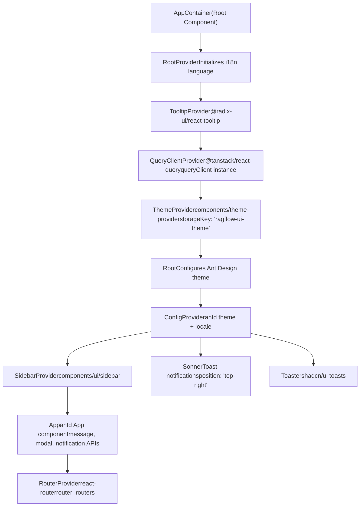
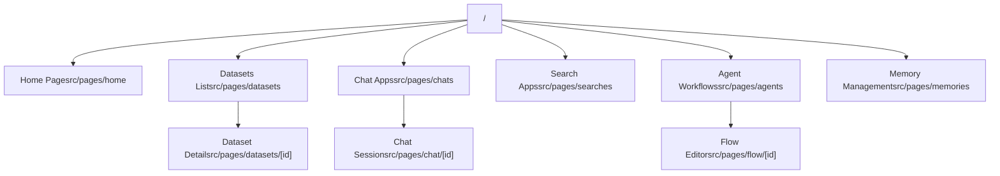
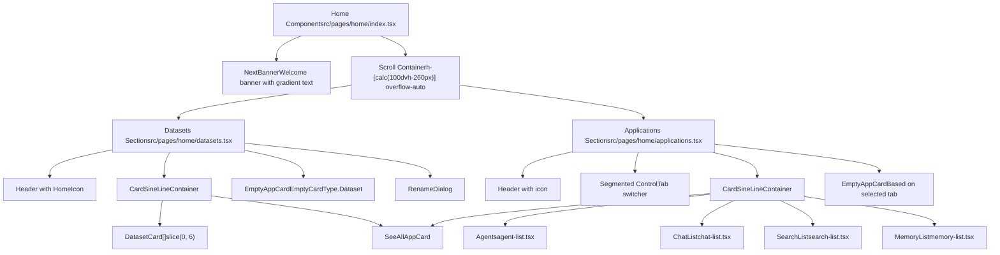

# Application Structure and Routing

Relevant source files

-   [web/src/locales/de.ts](https://github.com/infiniflow/ragflow/blob/80a16e71/web/src/locales/de.ts)
-   [web/src/locales/en.ts](https://github.com/infiniflow/ragflow/blob/80a16e71/web/src/locales/en.ts)
-   [web/src/locales/es.ts](https://github.com/infiniflow/ragflow/blob/80a16e71/web/src/locales/es.ts)
-   [web/src/locales/fr.ts](https://github.com/infiniflow/ragflow/blob/80a16e71/web/src/locales/fr.ts)
-   [web/src/locales/id.ts](https://github.com/infiniflow/ragflow/blob/80a16e71/web/src/locales/id.ts)
-   [web/src/locales/it.ts](https://github.com/infiniflow/ragflow/blob/80a16e71/web/src/locales/it.ts)
-   [web/src/locales/ja.ts](https://github.com/infiniflow/ragflow/blob/80a16e71/web/src/locales/ja.ts)
-   [web/src/locales/pt-br.ts](https://github.com/infiniflow/ragflow/blob/80a16e71/web/src/locales/pt-br.ts)
-   [web/src/locales/ru.ts](https://github.com/infiniflow/ragflow/blob/80a16e71/web/src/locales/ru.ts)
-   [web/src/locales/vi.ts](https://github.com/infiniflow/ragflow/blob/80a16e71/web/src/locales/vi.ts)
-   [web/src/locales/zh-traditional.ts](https://github.com/infiniflow/ragflow/blob/80a16e71/web/src/locales/zh-traditional.ts)
-   [web/src/locales/zh.ts](https://github.com/infiniflow/ragflow/blob/80a16e71/web/src/locales/zh.ts)

This document describes the frontend application structure, routing configuration, and component hierarchy for the RAGFlow web interface. It covers the React application setup, provider architecture, route definitions, and page organization patterns.

For information about state management and API integration patterns, see [State Management and API Integration](#4.3). For details on the internationalization system, see [Internationalization System](/infiniflow/ragflow/4.1-internationalization-system). For theme configuration, see [Theme System and Styling](#4.5).

## Application Overview

The RAGFlow frontend is a React 18 single-page application built with TypeScript, using Vite as the build tool and React Router v7 for navigation. The application follows a provider-based architecture with multiple context providers wrapping the core application to supply global functionality.

**Sources:** [web/package.json1-195](https://github.com/infiniflow/ragflow/blob/80a16e71/web/package.json#L1-L195) [web/src/app.tsx1-162](https://github.com/infiniflow/ragflow/blob/80a16e71/web/src/app.tsx#L1-L162)

---

## Provider Hierarchy

The application uses a nested provider architecture to supply global state and functionality throughout the component tree. Each provider serves a specific purpose and is composed in a specific order to ensure proper initialization.

### Provider Stack Diagram


**Sources:** [web/src/app.tsx84-162](https://github.com/infiniflow/ragflow/blob/80a16e71/web/src/app.tsx#L84-L162)

### Provider Responsibilities

| Provider | Purpose | Configuration |
| --- | --- | --- |
| `RootProvider` | Initializes i18n language from localStorage | Reads language via `storage.getLanguage()` |
| `TooltipProvider` | Enables Radix UI tooltips throughout app | Default configuration |
| `QueryClientProvider` | React Query for server state management | `queryClient` instance |
| `ThemeProvider` | Dark/light theme management | Storage key: `'ragflow-ui-theme'`, default: `ThemeEnum.Dark` |
| `ConfigProvider` | Ant Design theming and localization | Dynamic locale based on i18n language |
| `SidebarProvider` | Sidebar state management | `className="h-full"` |
| `App` | Ant Design component APIs (message, modal) | `className="w-full h-dvh relative"` |
| `RouterProvider` | React Router v7 navigation | `router={routers}` |

**Sources:** [web/src/app.tsx121-161](https://github.com/infiniflow/ragflow/blob/80a16e71/web/src/app.tsx#L121-L161)

### Ant Design Locale Configuration

The application supports multiple languages with Ant Design locale packages:

```
const AntLanguageMap = {
  en: enUS,
  zh: zhCN,
  'zh-TRADITIONAL': zh_HK,
  ru: ru_RU,
  vi: vi_VN,
  'pt-BR': pt_BR,
  de: deDE,
};
```
The locale is dynamically updated when the i18n language changes through an event listener:

```
i18n.on('languageChanged', function (lng: string) {
  storage.setLanguage(lng);
  setLocal(getLocale(lng));
});
```
**Sources:** [web/src/app.tsx50-94](https://github.com/infiniflow/ragflow/blob/80a16e71/web/src/app.tsx#L50-L94)

---

## Routing Architecture

The application uses React Router v7 with a centralized router configuration. The router is instantiated in the `routers` object and provided to the application via `RouterProvider`.

### Route Structure


**Sources:** [web/src/app.tsx28](https://github.com/infiniflow/ragflow/blob/80a16e71/web/src/app.tsx#L28-L28) [web/src/pages/home/applications.tsx6-21](https://github.com/infiniflow/ragflow/blob/80a16e71/web/src/pages/home/applications.tsx#L6-L21)

### Route Constants

Based on the application code, the routing system uses route constants defined in the `Routes` enum:

```
// Route constants used throughout the application
Routes.Chats      // "/chats" - Chat applications list
Routes.Searches   // "/searches" - Search applications list
Routes.Agents     // "/agents" - Agent workflows list
Routes.Memories   // "/memories" - Memory management
```
These constants are used for navigation and route matching across the application.

**Sources:** [web/src/pages/home/applications.tsx16-21](https://github.com/infiniflow/ragflow/blob/80a16e71/web/src/pages/home/applications.tsx#L16-L21)

---

## Page Organization

Pages are organized under `src/pages/` with a hierarchical structure that mirrors the routing hierarchy. Each major section has its own directory with related components.

### Page Directory Structure

```
src/pages/
├── home/
│   ├── index.tsx              # Main home page component
│   ├── banner.tsx             # Welcome banner component
│   ├── datasets.tsx           # Dataset section on home
│   ├── applications.tsx       # Applications section with tabs
│   ├── agent-list.tsx         # Agent cards display
│   ├── chat-list.tsx          # Chat app cards display
│   ├── search-list.tsx        # Search app cards display
│   ├── memory-list.tsx        # Memory cards display
│   └── application-card.tsx   # Reusable card components
├── datasets/
│   ├── dataset-card.tsx       # Dataset card component
│   ├── dataset-dropdown.tsx   # Dataset action menu
│   └── use-rename-dataset.tsx # Rename dataset hook
└── [other page directories...]
```
**Sources:** [web/src/pages/home/index.tsx1-18](https://github.com/infiniflow/ragflow/blob/80a16e71/web/src/pages/home/index.tsx#L1-L18) [web/src/pages/home/datasets.tsx1-80](https://github.com/infiniflow/ragflow/blob/80a16e71/web/src/pages/home/datasets.tsx#L1-L80) [web/src/pages/home/applications.tsx1-125](https://github.com/infiniflow/ragflow/blob/80a16e71/web/src/pages/home/applications.tsx#L1-L125)

### Home Page Component Hierarchy


**Sources:** [web/src/pages/home/index.tsx5-17](https://github.com/infiniflow/ragflow/blob/80a16e71/web/src/pages/home/index.tsx#L5-L17) [web/src/pages/home/datasets.tsx14-79](https://github.com/infiniflow/ragflow/blob/80a16e71/web/src/pages/home/datasets.tsx#L14-L79) [web/src/pages/home/applications.tsx30-124](https://github.com/infiniflow/ragflow/blob/80a16e71/web/src/pages/home/applications.tsx#L30-L124)

---

## Home Page Deep Dive

The home page serves as the main entry point and dashboard, displaying quick access to datasets and applications with a tabbed interface.

### Home Page Layout

The home page consists of three main sections:

1.  **Banner Section** (`NextBanner`): Welcome message with gradient RAGFlow branding
2.  **Datasets Section**: Displays up to 6 recent datasets with a "See All" card
3.  **Applications Section**: Tabbed interface for Chats, Searches, Agents, and Memories

**Sources:** [web/src/pages/home/index.tsx5-17](https://github.com/infiniflow/ragflow/blob/80a16e71/web/src/pages/home/index.tsx#L5-L17)

### Banner Component

The `NextBanner` component displays a welcome message with branded styling:

```
// Gradient text from cyan (#40EBE3) to blue (#4A51FF)
<span className="text-transparent bg-clip-text bg-gradient-to-l from-[#40EBE3] to-[#4A51FF]">
  RAGFlow
</span>
```
Layout: `text-5xl pt-10 pb-14 font-bold px-10`

**Sources:** [web/src/pages/home/banner.tsx42-52](https://github.com/infiniflow/ragflow/blob/80a16e71/web/src/pages/home/banner.tsx#L42-L52)

### Datasets Section

The datasets section displays dataset cards with the following features:

-   **Data fetching**: Uses `useFetchNextKnowledgeListByPage()` hook
-   **Loading state**: Shows `CardSkeleton` during data fetch
-   **Card display**: Shows up to 6 datasets via `kbs?.slice(0, 6)`
-   **Empty state**: Displays `EmptyAppCard` when no datasets exist
-   **Actions**: Rename functionality via `useRenameDataset()` hook

Key navigation methods from `useNavigatePage()`:

-   `navigateToDatasetList({ isCreate: boolean })` - Navigate to full dataset list
-   `navigateToDataset(datasetId)` - Navigate to specific dataset detail

**Sources:** [web/src/pages/home/datasets.tsx14-79](https://github.com/infiniflow/ragflow/blob/80a16e71/web/src/pages/home/datasets.tsx#L14-L79)

### Applications Section with Tabs

The applications section uses a `Segmented` control to switch between four tabs:

| Tab | Route | Component | Empty Type |
| --- | --- | --- | --- |
| Chat Apps | `Routes.Chats` | `ChatList` | `EmptyCardType.Chat` |
| Search Apps | `Routes.Searches` | `SearchList` | `EmptyCardType.Search` |
| Agent Workflows | `Routes.Agents` | `Agents` | `EmptyCardType.Agent` |
| Memory | `Routes.Memories` | `MemoryList` | `EmptyCardType.Memory` |

**Tab Switching Logic:**

```
const handleChange = (path: SegmentedValue) => {
  setVal(path as Routes);
  setListLength(0);
  setLoading(true);
};
```
**Navigation:**

```
const handleNavigate = ({ isCreate }: { isCreate?: boolean }) => {
  if (isCreate) {
    navigate(val + '?isCreate=true');
  } else {
    navigate(val);
  }
};
```
Each list component receives callbacks to update the parent's state:

-   `setListLength(length: number)` - Updates count for showing "See All" card
-   `setLoading(loading: boolean)` - Updates loading state

**Sources:** [web/src/pages/home/applications.tsx16-124](https://github.com/infiniflow/ragflow/blob/80a16e71/web/src/pages/home/applications.tsx#L16-L124)

---

## Component Reusability Patterns

The application employs several reusable component patterns to maintain consistency across pages.

### Card Components

#### DatasetCard

Displays dataset information with actions:

```
interface DatasetCardProps {
  dataset: IKnowledge;
  showDatasetRenameModal: (dataset: IKnowledge) => void;
}
```
Features:

-   Uses `HomeCard` base component
-   Description: `${dataset.doc_num} ${t('knowledgeDetails.files')}`
-   Dropdown: `DatasetDropdown` with `MoreButton`
-   Badge: `SharedBadge` showing `dataset.nickname`
-   Click: `navigateToDataset(dataset.id)`

**Sources:** [web/src/pages/datasets/dataset-card.tsx12-40](https://github.com/infiniflow/ragflow/blob/80a16e71/web/src/pages/datasets/dataset-card.tsx#L12-L40)

#### CardSineLineContainer

A flex container for displaying cards in a responsive grid:

```
// Used to wrap multiple cards
<CardSineLineContainer>
  {items.map(item => <Card key={item.id} {...item} />)}
  <SeeAllCard />
</CardSineLineContainer>
```
**Sources:** [web/src/pages/home/datasets.tsx42-57](https://github.com/infiniflow/ragflow/blob/80a16e71/web/src/pages/home/datasets.tsx#L42-L57)

#### SeeAllAppCard

A standardized "See All" card with chevron icon:

```
<SeeAllAppCard click={() => navigateToFunction()} />
```
Displays: "See All" text with `ChevronRight` icon

**Sources:** [web/src/pages/home/applications.tsx109-113](https://github.com/infiniflow/ragflow/blob/80a16e71/web/src/pages/home/applications.tsx#L109-L113)

#### EmptyAppCard

Displays when a section has no items:

```
<EmptyAppCard
  type={EmptyCardType.Dataset | Chat | Search | Agent | Memory}
  onClick={() => navigateToCreate()}
/>
```
**Sources:** [web/src/pages/home/datasets.tsx60-64](https://github.com/infiniflow/ragflow/blob/80a16e71/web/src/pages/home/datasets.tsx#L60-L64) [web/src/pages/home/applications.tsx115-120](https://github.com/infiniflow/ragflow/blob/80a16e71/web/src/pages/home/applications.tsx#L115-L120)

### Icon System

The application uses a custom `HomeIcon` component for consistent iconography:

```
<HomeIcon name="datasets" width="32" />
<HomeIcon name="chats" width="32" />
<HomeIcon name="searches" width="32" />
<HomeIcon name="agents" width="32" />
<HomeIcon name="memory" width="32" />
```
Icon names map to route types for visual consistency.

**Sources:** [web/src/pages/home/datasets.tsx31](https://github.com/infiniflow/ragflow/blob/80a16e71/web/src/pages/home/datasets.tsx#L31-L31) [web/src/pages/home/applications.tsx68-71](https://github.com/infiniflow/ragflow/blob/80a16e71/web/src/pages/home/applications.tsx#L68-L71)

---

## UI Component Library

The application uses a combination of UI libraries for consistent styling:

### Core UI Libraries

| Library | Purpose | Usage |
| --- | --- | --- |
| Ant Design v5 | Enterprise UI components | ConfigProvider, message, modal APIs |
| Radix UI | Unstyled primitives | Dialog, Dropdown, Select, Tooltip, etc. |
| Tailwind CSS | Utility-first styling | All custom components |
| class-variance-authority | Variant-based component styling | Button variants, Badge variants |
| Lucide React | Icon library | Icons throughout the application |

**Sources:** [web/package.json25-132](https://github.com/infiniflow/ragflow/blob/80a16e71/web/package.json#L25-L132)

### Shadcn/ui Components

The application implements shadcn/ui component patterns with custom styling:

-   **Button**: Multiple variants (default, outline, ghost, destructive, etc.)
-   **Badge**: Variant-based badges (default, secondary, success, destructive)
-   **Card**: Container components with CardContent
-   **Segmented**: Custom segmented control for tab navigation
-   **Skeleton**: Loading state placeholders

**Sources:** [web/src/components/ui/button.tsx8-142](https://github.com/infiniflow/ragflow/blob/80a16e71/web/src/components/ui/button.tsx#L8-L142) [web/src/components/ui/badge.tsx6-38](https://github.com/infiniflow/ragflow/blob/80a16e71/web/src/components/ui/badge.tsx#L6-L38) [web/src/components/ui/segmented.tsx1-122](https://github.com/infiniflow/ragflow/blob/80a16e71/web/src/components/ui/segmented.tsx#L1-L122)

---

## Navigation Patterns

### Navigation Hook

The application uses a custom `useNavigatePage()` hook for type-safe navigation:

```
const {
  navigateToDatasetList,
  navigateToDataset,
  // ... other navigation methods
} = useNavigatePage();
```
Navigation methods support optional parameters:

-   `navigateToDatasetList({ isCreate: boolean })` - Navigate with create flag
-   `navigateToDataset(datasetId)` - Navigate to specific resource

**Sources:** [web/src/pages/home/datasets.tsx25](https://github.com/infiniflow/ragflow/blob/80a16e71/web/src/pages/home/datasets.tsx#L25-L25) [web/src/pages/datasets/dataset-card.tsx20](https://github.com/infiniflow/ragflow/blob/80a16e71/web/src/pages/datasets/dataset-card.tsx#L20-L20)

### Query Parameter Handling

Routes support query parameters for state initialization:

-   `?isCreate=true` - Opens creation dialog on page load
-   Used in dataset list, chat list, search list, and agent list

Example navigation with create flag:

```
if (isCreate) {
  navigate(val + '?isCreate=true');
} else {
  navigate(val);
}
```
**Sources:** [web/src/pages/home/applications.tsx38-45](https://github.com/infiniflow/ragflow/blob/80a16e71/web/src/pages/home/applications.tsx#L38-L45)

---

## Responsive Design Configuration

The application uses `ahooks` for responsive design with custom breakpoints:

```
configResponsive({
  sm: 640,
  md: 768,
  lg: 1024,
  xl: 1280,
  '2xl': 1536,
  '3xl': 1780,
  '4xl': 1980,
});
```
These breakpoints match the Tailwind CSS configuration defined in `tailwind.config.js`.

**Sources:** [web/src/app.tsx33-41](https://github.com/infiniflow/ragflow/blob/80a16e71/web/src/app.tsx#L33-L41) [web/tailwind.config.js20-28](https://github.com/infiniflow/ragflow/blob/80a16e71/web/tailwind.config.js#L20-L28)

---

## Development Tools

### Why Did You Render (Development Only)

The application conditionally loads performance debugging tools in development:

```
if (process.env.NODE_ENV === 'development') {
  import('@welldone-software/why-did-you-render').then(
    (whyDidYouRenderModule) => {
      const whyDidYouRender = whyDidYouRenderModule.default;
      whyDidYouRender(React, {
        trackAllPureComponents: true,
        trackExtraHooks: [],
        logOnDifferentValues: true,
      });
    },
  );
}
```
**Sources:** [web/src/app.tsx68-79](https://github.com/infiniflow/ragflow/blob/80a16e71/web/src/app.tsx#L68-L79)

### React Query DevTools

React Query DevTools are available but commented out in production:

```
// <ReactQueryDevtools buttonPosition={'top-left'} initialIsOpen={false} />
```
**Sources:** [web/src/app.tsx116](https://github.com/infiniflow/ragflow/blob/80a16e71/web/src/app.tsx#L116-L116)

---

## Styling System Integration

The application uses multiple styling approaches:

1.  **Tailwind CSS**: Primary styling system with custom design tokens
2.  **CSS Variables**: Theme-aware colors defined in `tailwind.css`
3.  **Ant Design Theme**: Algorithmic theming that respects dark/light mode
4.  **Class Variance Authority**: Type-safe variant-based components

Example of theme integration:

```
<ConfigProvider
  theme={{
    token: { fontFamily: 'Inter' },
    algorithm: themeragflow === 'dark'
      ? theme.darkAlgorithm
      : theme.defaultAlgorithm,
  }}
  locale={locale}
>
```
**Sources:** [web/src/app.tsx98-109](https://github.com/infiniflow/ragflow/blob/80a16e71/web/src/app.tsx#L98-L109) [web/tailwind.css1-323](https://github.com/infiniflow/ragflow/blob/80a16e71/web/tailwind.css#L1-L323) [web/tailwind.config.js1-229](https://github.com/infiniflow/ragflow/blob/80a16e71/web/tailwind.config.js#L1-L229)
