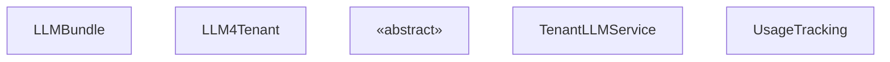
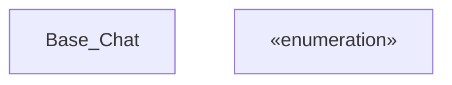
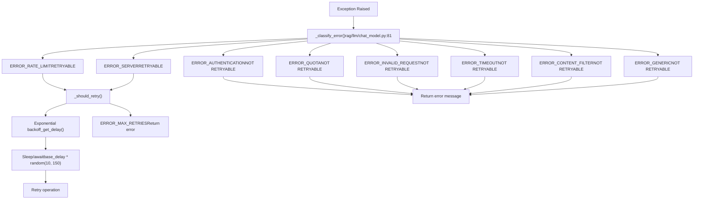
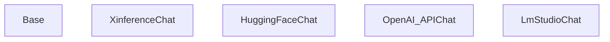
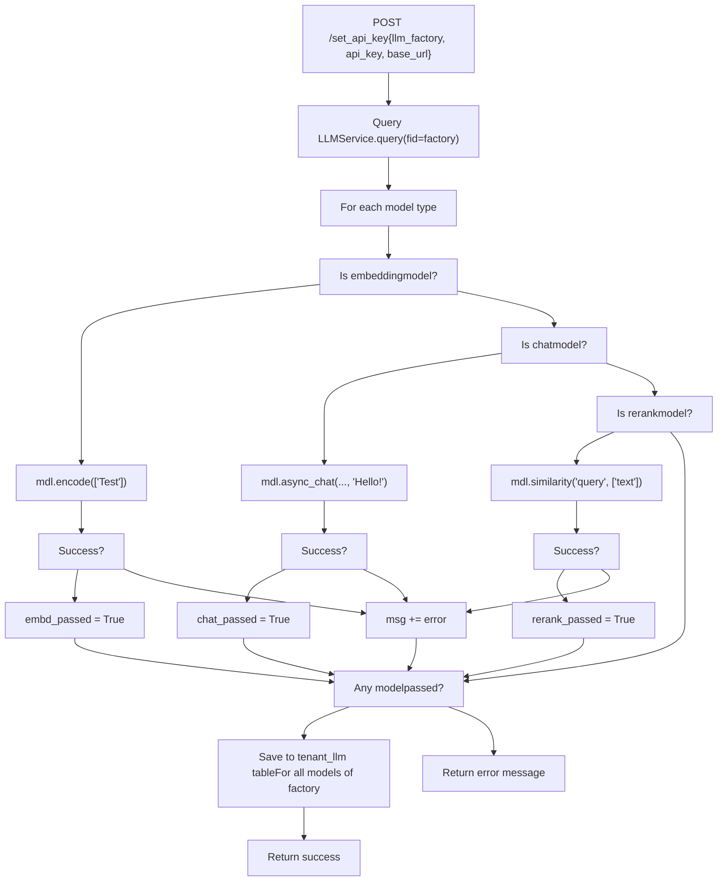

# LLM Integration System

Relevant source files

-   [README.md](https://github.com/infiniflow/ragflow/blob/80a16e71/README.md)
-   [README\_id.md](https://github.com/infiniflow/ragflow/blob/80a16e71/README_id.md)
-   [README\_ja.md](https://github.com/infiniflow/ragflow/blob/80a16e71/README_ja.md)
-   [README\_ko.md](https://github.com/infiniflow/ragflow/blob/80a16e71/README_ko.md)
-   [README\_pt\_br.md](https://github.com/infiniflow/ragflow/blob/80a16e71/README_pt_br.md)
-   [README\_tzh.md](https://github.com/infiniflow/ragflow/blob/80a16e71/README_tzh.md)
-   [README\_zh.md](https://github.com/infiniflow/ragflow/blob/80a16e71/README_zh.md)
-   [api/apps/llm\_app.py](https://github.com/infiniflow/ragflow/blob/80a16e71/api/apps/llm_app.py)
-   [api/db/init\_data.py](https://github.com/infiniflow/ragflow/blob/80a16e71/api/db/init_data.py)
-   [api/db/services/llm\_service.py](https://github.com/infiniflow/ragflow/blob/80a16e71/api/db/services/llm_service.py)
-   [conf/llm\_factories.json](https://github.com/infiniflow/ragflow/blob/80a16e71/conf/llm_factories.json)
-   [docker/.env](https://github.com/infiniflow/ragflow/blob/80a16e71/docker/.env)
-   [docker/README.md](https://github.com/infiniflow/ragflow/blob/80a16e71/docker/README.md)
-   [docs/configurations.md](https://github.com/infiniflow/ragflow/blob/80a16e71/docs/configurations.md)
-   [docs/guides/manage\_files.md](https://github.com/infiniflow/ragflow/blob/80a16e71/docs/guides/manage_files.md)
-   [docs/guides/upgrade\_ragflow.mdx](https://github.com/infiniflow/ragflow/blob/80a16e71/docs/guides/upgrade_ragflow.mdx)
-   [docs/quickstart.mdx](https://github.com/infiniflow/ragflow/blob/80a16e71/docs/quickstart.mdx)
-   [docs/references/supported\_models.mdx](https://github.com/infiniflow/ragflow/blob/80a16e71/docs/references/supported_models.mdx)
-   [rag/llm/\_\_init\_\_.py](https://github.com/infiniflow/ragflow/blob/80a16e71/rag/llm/__init__.py)
-   [rag/llm/chat\_model.py](https://github.com/infiniflow/ragflow/blob/80a16e71/rag/llm/chat_model.py)
-   [rag/llm/cv\_model.py](https://github.com/infiniflow/ragflow/blob/80a16e71/rag/llm/cv_model.py)
-   [rag/llm/embedding\_model.py](https://github.com/infiniflow/ragflow/blob/80a16e71/rag/llm/embedding_model.py)
-   [rag/llm/rerank\_model.py](https://github.com/infiniflow/ragflow/blob/80a16e71/rag/llm/rerank_model.py)
-   [rag/llm/sequence2txt\_model.py](https://github.com/infiniflow/ragflow/blob/80a16e71/rag/llm/sequence2txt_model.py)
-   [rag/llm/tts\_model.py](https://github.com/infiniflow/ragflow/blob/80a16e71/rag/llm/tts_model.py)
-   [web/src/assets/svg/llm/n1n.svg](https://github.com/infiniflow/ragflow/blob/80a16e71/web/src/assets/svg/llm/n1n.svg)
-   [web/src/constants/llm.ts](https://github.com/infiniflow/ragflow/blob/80a16e71/web/src/constants/llm.ts)
-   [web/src/pages/user-setting/setting-model/constant.ts](https://github.com/infiniflow/ragflow/blob/80a16e71/web/src/pages/user-setting/setting-model/constant.ts)
-   [web/src/utils/common-util.ts](https://github.com/infiniflow/ragflow/blob/80a16e71/web/src/utils/common-util.ts)

## Purpose and Scope

The LLM Integration System provides a unified abstraction layer for integrating multiple AI model providers into RAGFlow. This system enables the platform to support 10+ LLM providers across 6 model types (chat, embedding, rerank, text-to-speech, speech-to-text, and vision) through a consistent interface. The system handles provider-specific authentication, error handling, retry logic, token usage tracking, and observability integration.

This document covers the core abstraction layer, model registry system, and provider integration patterns. For information about:

-   Using LLMs in conversational AI workflows, see [Retrieval and RAG System](/infiniflow/ragflow/10-retrieval-and-rag-system)
-   Using LLMs in agent workflows, see [Agent and Workflow System](/infiniflow/ragflow/9-agent-and-workflow-system)
-   API endpoints for managing LLM configurations, see [Backend API System](/infiniflow/ragflow/8-backend-api-system)

---

## System Architecture Overview

The LLM Integration System follows a layered architecture with dynamic model registration at its core:

### Architecture Diagram

```mermaid
flowchart TD
    DialogService["DialogService(Conversational AI)"]
    CanvasService["Canvas(Agent Workflows)"]
    TaskExecutor["TaskExecutor(Document Processing)"]
    LLMBundle["LLMBundleapi/db/services/llm_service.py:85"]
    TenantConfig["TenantLLMServiceTenant-specific configs"]
    UsageTracking["Usage Trackingincrease_usage()"]
    LangfuseInt["Langfuse IntegrationObservability"]
    ChatModelDict["ChatModel dictrag/llm/init.py:123"]
    EmbedModelDict["EmbeddingModel dictrag/llm/init.py:125"]
    RerankModelDict["RerankModel dictrag/llm/init.py:126"]
    CvModelDict["CvModel dictrag/llm/init.py:124"]
    Seq2txtModelDict["Seq2txtModel dictrag/llm/init.py:127"]
    TTSModelDict["TTSModel dictrag/llm/init.py:128"]
    OpenAIChat["OpenAIBase class"]
    QWenChat["QWenTongyi-Qianwen"]
    AnthropicChat["AnthropicClaude"]
    OllamaChat["OllamaLocal models"]
    LiteLLMBase["LiteLLMBaseGeneric wrapper"]
    ChatBase["chat_model.Baserag/llm/chat_model.py:64"]
    EmbedBase["embedding_model.Baserag/llm/embedding_model.py:37"]
    RerankBase["rerank_model.Baserag/llm/rerank_model.py:28"]

    DialogService --> LLMBundle
    CanvasService --> LLMBundle
    TaskExecutor --> LLMBundle
    LLMBundle --> TenantConfig
    LLMBundle --> UsageTracking
    LLMBundle --> LangfuseInt
    LLMBundle --> ChatModelDict
    LLMBundle --> EmbedModelDict
    LLMBundle --> RerankModelDict
    LLMBundle --> CvModelDict
    LLMBundle --> Seq2txtModelDict
    LLMBundle --> TTSModelDict
    ChatModelDict --> OpenAIChat
    ChatModelDict --> QWenChat
    ChatModelDict --> AnthropicChat
    ChatModelDict --> OllamaChat
    ChatModelDict --> LiteLLMBase
    OpenAIChat --> ChatBase
    QWenChat --> ChatBase
    AnthropicChat --> ChatBase
    EmbedModelDict --> EmbedBase
    RerankModelDict --> RerankBase
```


**Sources**: [rag/llm/\_\_init\_\_.py1-183](https://github.com/infiniflow/ragflow/blob/80a16e71/rag/llm/__init__.py#L1-L183) [api/db/services/llm\_service.py85-397](https://github.com/infiniflow/ragflow/blob/80a16e71/api/db/services/llm_service.py#L85-L397) [rag/llm/chat\_model.py64-487](https://github.com/infiniflow/ragflow/blob/80a16e71/rag/llm/chat_model.py#L64-L487)

### Key Components

| Component | Purpose | Location |
| --- | --- | --- |
| `LLMBundle` | Main entry point for all LLM operations, handles tenant configuration and usage tracking | [api/db/services/llm\_service.py85-397](https://github.com/infiniflow/ragflow/blob/80a16e71/api/db/services/llm_service.py#L85-L397) |
| Model Registries | Dictionaries mapping provider names to implementation classes | [rag/llm/\_\_init\_\_.py123-128](https://github.com/infiniflow/ragflow/blob/80a16e71/rag/llm/__init__.py#L123-L128) |
| Base Classes | Abstract base classes defining model type interfaces | [rag/llm/chat\_model.py64](https://github.com/infiniflow/ragflow/blob/80a16e71/rag/llm/chat_model.py#L64-L64) [rag/llm/embedding\_model.py37](https://github.com/infiniflow/ragflow/blob/80a16e71/rag/llm/embedding_model.py#L37-L37) etc. |
| `TenantLLMService` | Manages per-tenant API keys and model preferences | [api/db/services/tenant\_llm\_service.py](https://github.com/infiniflow/ragflow/blob/80a16e71/api/db/services/tenant_llm_service.py) |
| `LLMFactoriesService` | Maintains registry of available providers and their capabilities | [api/db/services/tenant\_llm\_service.py](https://github.com/infiniflow/ragflow/blob/80a16e71/api/db/services/tenant_llm_service.py) |

---

## Dynamic Model Registration System

The system uses a reflection-based approach to automatically discover and register model implementations at module import time.

### Registration Process

> **[Mermaid sequence]**
> *(图表结构无法解析)*

**Sources**: [rag/llm/\_\_init\_\_.py132-172](https://github.com/infiniflow/ragflow/blob/80a16e71/rag/llm/__init__.py#L132-L172)

### Factory Name Attribute

Each model implementation class declares a `_FACTORY_NAME` attribute that identifies its provider. This attribute can be a single string or a list of strings for providers with multiple identifiers.

**Example from chat\_model.py**:

```
class XinferenceChat(Base):
    _FACTORY_NAME = "Xinference"

class OpenAI_APIChat(Base):
    _FACTORY_NAME = ["VLLM", "OpenAI-API-Compatible"]
```
**Sources**: [rag/llm/chat\_model.py490-743](https://github.com/infiniflow/ragflow/blob/80a16e71/rag/llm/chat_model.py#L490-L743)

### Module Mapping

The registration system processes six model types through the `MODULE_MAPPING` dictionary:

| Module File | Registry Dictionary | Purpose |
| --- | --- | --- |
| `chat_model.py` | `ChatModel` | Conversational text generation |
| `embedding_model.py` | `EmbeddingModel` | Text vectorization |
| `rerank_model.py` | `RerankModel` | Result reordering by relevance |
| `cv_model.py` | `CvModel` | Image-to-text (vision) models |
| `sequence2txt_model.py` | `Seq2txtModel` | Speech-to-text (ASR) |
| `tts_model.py` | `TTSModel` | Text-to-speech synthesis |

**Sources**: [rag/llm/\_\_init\_\_.py132-141](https://github.com/infiniflow/ragflow/blob/80a16e71/rag/llm/__init__.py#L132-L141)

---

## LLMBundle Abstraction Layer

`LLMBundle` provides the primary interface for all LLM operations, abstracting away provider-specific details while adding cross-cutting concerns like usage tracking and observability.

### LLMBundle Class Hierarchy


**Sources**: [api/db/services/llm\_service.py85-397](https://github.com/infiniflow/ragflow/blob/80a16e71/api/db/services/llm_service.py#L85-L397) [api/db/services/tenant\_llm\_service.py1-382](https://github.com/infiniflow/ragflow/blob/80a16e71/api/db/services/tenant_llm_service.py#L1-L382)

### Core Operations

#### Text Embedding

[api/db/services/llm\_service.py95-118](https://github.com/infiniflow/ragflow/blob/80a16e71/api/db/services/llm_service.py#L95-L118) - The `encode()` method handles batch text embedding with automatic truncation to model max length and usage tracking.

```
Flow: texts → truncate if needed → mdl.encode() → update usage → return embeddings
```
#### Chat Generation

[api/db/services/llm\_service.py281-397](https://github.com/infiniflow/ragflow/blob/80a16e71/api/db/services/llm_service.py#L281-L397) - Supports both synchronous (`async_chat`) and streaming (`async_chat_streamly`) generation with tool calling capabilities.

```
Flow: history → bind tools → mdl.async_chat() → remove reasoning → update usage → return response
```
#### Reranking

[api/db/services/llm\_service.py135-147](https://github.com/infiniflow/ragflow/blob/80a16e71/api/db/services/llm_service.py#L135-L147) - The `similarity()` method scores documents against a query for relevance ordering.

#### Vision/Speech/TTS

Additional methods handle multimodal operations:

-   `describe()` / `describe_with_prompt()` - [api/db/services/llm\_service.py149-175](https://github.com/infiniflow/ragflow/blob/80a16e71/api/db/services/llm_service.py#L149-L175)
-   `transcription()` / `stream_transcription()` - [api/db/services/llm\_service.py177-251](https://github.com/infiniflow/ragflow/blob/80a16e71/api/db/services/llm_service.py#L177-L251)
-   `tts()` - [api/db/services/llm\_service.py253-265](https://github.com/infiniflow/ragflow/blob/80a16e71/api/db/services/llm_service.py#L253-L265)

**Sources**: [api/db/services/llm\_service.py85-397](https://github.com/infiniflow/ragflow/blob/80a16e71/api/db/services/llm_service.py#L85-L397)

---

## Model Type Interfaces

Each model type defines a consistent interface through its base class. All provider implementations must conform to this interface.

### Chat Model Interface


**Sources**: [rag/llm/chat\_model.py64-487](https://github.com/infiniflow/ragflow/blob/80a16e71/rag/llm/chat_model.py#L64-L487)

### Key Methods

| Method | Purpose | Return Type |
| --- | --- | --- |
| `async_chat()` | Non-streaming chat completion | `tuple[str, int]` (response, tokens) |
| `async_chat_streamly()` | Streaming chat completion | \`AsyncGenerator\[str |
| `async_chat_with_tools()` | Chat with tool calling support | `tuple[str, int]` |
| `bind_tools()` | Register tools for function calling | `None` |

### Embedding Model Interface

[rag/llm/embedding\_model.py37-51](https://github.com/infiniflow/ragflow/blob/80a16e71/rag/llm/embedding_model.py#L37-L51) - Embedding models implement:

-   `encode(texts: list)` → `tuple[np.ndarray, int]` - Batch embedding generation
-   `encode_queries(text: str)` → `tuple[np.ndarray, int]` - Single query embedding with query-optimized parameters

### Rerank Model Interface

[rag/llm/rerank\_model.py28-37](https://github.com/infiniflow/ragflow/blob/80a16e71/rag/llm/rerank_model.py#L28-L37) - Rerank models implement:

-   `similarity(query: str, texts: list)` → `tuple[np.ndarray, int]` - Returns relevance scores array and token count

### Vision Model Interface

[rag/llm/cv\_model.py39-184](https://github.com/infiniflow/ragflow/blob/80a16e71/rag/llm/cv_model.py#L39-L184) - Vision models implement:

-   `describe(image)` → `tuple[str, int]` - Generate image description
-   `describe_with_prompt(image, prompt)` → `tuple[str, int]` - Guided image description
-   `async_chat()` / `async_chat_streamly()` - Support text+image multimodal inputs

### Speech-to-Text Interface

[rag/llm/sequence2txt\_model.py31-50](https://github.com/infiniflow/ragflow/blob/80a16e71/rag/llm/sequence2txt_model.py#L31-L50) - ASR models implement:

-   `transcription(audio_path)` → `tuple[str, int]` - Audio to text conversion
-   `stream_transcription(audio_path)` (optional) - Streaming transcription

### Text-to-Speech Interface

[rag/llm/tts\_model.py65-78](https://github.com/infiniflow/ragflow/blob/80a16e71/rag/llm/tts_model.py#L65-L78) - TTS models implement:

-   `tts(text: str)` → `Generator[bytes|int, None, None]` - Yields audio chunks, final token count

---

## Error Handling and Retry Logic

The system implements sophisticated error classification and selective retry mechanisms to handle provider-specific failures gracefully.

### Error Classification System


**Sources**: [rag/llm/chat\_model.py39-51](https://github.com/infiniflow/ragflow/blob/80a16e71/rag/llm/chat_model.py#L39-L51) [rag/llm/chat\_model.py81-100](https://github.com/infiniflow/ragflow/blob/80a16e71/rag/llm/chat_model.py#L81-L100) [rag/llm/chat\_model.py203-243](https://github.com/infiniflow/ragflow/blob/80a16e71/rag/llm/chat_model.py#L203-L243)

### Error Classification Implementation

The `_classify_error()` method uses keyword matching against error message strings to categorize failures:

[rag/llm/chat\_model.py81-100](https://github.com/infiniflow/ragflow/blob/80a16e71/rag/llm/chat_model.py#L81-L100) - Error messages are lowercased and matched against predefined keyword sets:

| Error Code | Keywords | Retryable |
| --- | --- | --- |
| `ERROR_RATE_LIMIT` | rate limit, 429, tpm limit, too many requests | ✓ |
| `ERROR_SERVER` | server, 503, 502, 504, 500, unavailable | ✓ |
| `ERROR_AUTHENTICATION` | auth, key, apikey, 401, forbidden | ✗ |
| `ERROR_QUOTA` | quota, capacity, credit, billing, balance | ✗ |
| `ERROR_INVALID_REQUEST` | invalid, bad request, 400, format, malformed | ✗ |
| `ERROR_TIMEOUT` | timeout, timed out | ✗ |
| `ERROR_CONNECTION` | connect, network, unreachable, dns | ✗ |
| `ERROR_CONTENT_FILTER` | filter, content, policy, blocked, safety | ✗ |
| `ERROR_MODEL` | model, not found, does not exist | ✗ |

**Sources**: [rag/llm/chat\_model.py84-99](https://github.com/infiniflow/ragflow/blob/80a16e71/rag/llm/chat_model.py#L84-L99)

### Retry Strategy

[rag/llm/chat\_model.py78-79](https://github.com/infiniflow/ragflow/blob/80a16e71/rag/llm/chat_model.py#L78-L79) - Retry parameters are configurable via environment variables:

-   `LLM_MAX_RETRIES` (default: 5) - Maximum retry attempts
-   `LLM_BASE_DELAY` (default: 2.0) - Base delay in seconds

[rag/llm/chat\_model.py78-79](https://github.com/infiniflow/ragflow/blob/80a16e71/rag/llm/chat_model.py#L78-L79) - Delay calculation uses randomized exponential backoff:

```
delay = base_delay * random.uniform(10, 150)
```
This produces delays between 20-300 seconds with default settings, preventing thundering herd problems.

### Synchronous vs Asynchronous Error Handling

The system provides parallel implementations for sync and async contexts:

-   `_exceptions()` [rag/llm/chat\_model.py212-227](https://github.com/infiniflow/ragflow/blob/80a16e71/rag/llm/chat_model.py#L212-L227) - Uses `time.sleep()` for synchronous operations
-   `_exceptions_async()` [rag/llm/chat\_model.py229-243](https://github.com/infiniflow/ragflow/blob/80a16e71/rag/llm/chat_model.py#L229-L243) - Uses `asyncio.sleep()` for async operations

Both return `None` to signal retry or an error message string to halt.

**Sources**: [rag/llm/chat\_model.py64-487](https://github.com/infiniflow/ragflow/blob/80a16e71/rag/llm/chat_model.py#L64-L487)

---

## Provider Implementation Patterns

The system supports providers through three implementation patterns, allowing flexibility for different API styles.

### Pattern 1: OpenAI-Compatible Base Class

Many providers follow the OpenAI API specification. These implementations inherit from a common `Base` class that uses the `openai` Python client.


**Examples**:

-   `XinferenceChat` [rag/llm/chat\_model.py489-497](https://github.com/infiniflow/ragflow/blob/80a16e71/rag/llm/chat_model.py#L489-L497) - Appends `/v1` to base URL
-   `HuggingFaceChat` [rag/llm/chat\_model.py499-507](https://github.com/infiniflow/ragflow/blob/80a16e71/rag/llm/chat_model.py#L499-L507) - Strips model name suffix `___`
-   `OpenAI_APIChat` [rag/llm/chat\_model.py735-743](https://github.com/infiniflow/ragflow/blob/80a16e71/rag/llm/chat_model.py#L735-L743) - Handles multiple factory names
-   `LmStudioChat` [rag/llm/chat\_model.py723-733](https://github.com/infiniflow/ragflow/blob/80a16e71/rag/llm/chat_model.py#L723-L733) - Uses fixed API key "lm-studio"

**Sources**: [rag/llm/chat\_model.py64-136](https://github.com/infiniflow/ragflow/blob/80a16e71/rag/llm/chat_model.py#L64-L136) [rag/llm/chat\_model.py489-743](https://github.com/infiniflow/ragflow/blob/80a16e71/rag/llm/chat_model.py#L489-L743)

### Pattern 2: Provider-Specific Client Libraries

Some providers require their own client libraries with unique authentication or API patterns.

**Examples**:

-   **Mistral**: Uses `mistralai.client.MistralClient` [rag/llm/chat\_model.py669-721](https://github.com/infiniflow/ragflow/blob/80a16e71/rag/llm/chat_model.py#L669-L721)
-   **Replicate**: Uses `replicate.client.Client` [rag/llm/chat\_model.py754-793](https://github.com/infiniflow/ragflow/blob/80a16e71/rag/llm/chat_model.py#L754-L793)
-   **Tencent Hunyuan**: Uses `tencentcloud.hunyuan` SDK [rag/llm/chat\_model.py795-871](https://github.com/infiniflow/ragflow/blob/80a16e71/rag/llm/chat_model.py#L795-L871)
-   **BaiduYiyan**: Uses `qianfan.ChatCompletion` [rag/llm/chat\_model.py895-1003](https://github.com/infiniflow/ragflow/blob/80a16e71/rag/llm/chat_model.py#L895-L1003)
-   **XunFei Spark**: Uses WebSocket-based protocol [rag/llm/chat\_model.py873-893](https://github.com/infiniflow/ragflow/blob/80a16e71/rag/llm/chat_model.py#L873-L893)

These implementations override methods like `_clean_conf()` to adapt parameter naming conventions.

**Sources**: [rag/llm/chat\_model.py669-1003](https://github.com/infiniflow/ragflow/blob/80a16e71/rag/llm/chat_model.py#L669-L1003)

### Pattern 3: Special Authentication Handling

Certain providers require multi-parameter authentication assembled into JSON structures:

**VolcEngine** [rag/llm/chat\_model.py654-667](https://github.com/infiniflow/ragflow/blob/80a16e71/rag/llm/chat_model.py#L654-L667):

```
ark_api_key = json.loads(key).get("ark_api_key", "")
model_name = json.loads(key).get("ep_id", "") + json.loads(key).get("endpoint_id", "")
```
**Bedrock** [rag/llm/embedding\_model.py461-503](https://github.com/infiniflow/ragflow/blob/80a16e71/rag/llm/embedding_model.py#L461-L503):

-   Supports three auth modes: `access_key_secret`, `iam_role`, `assume_role`
-   Parses region, credentials from JSON key
-   Uses `boto3.client("bedrock-runtime")`

**Azure OpenAI** [rag/llm/embedding\_model.py153-162](https://github.com/infiniflow/ragflow/blob/80a16e71/rag/llm/embedding_model.py#L153-L162):

```
api_key = json.loads(key).get("api_key", "")
api_version = json.loads(key).get("api_version", "2024-02-01")
self.client = AzureOpenAI(api_key=api_key, azure_endpoint=base_url, api_version=api_version)
```
**Sources**: [rag/llm/chat\_model.py654-667](https://github.com/infiniflow/ragflow/blob/80a16e71/rag/llm/chat_model.py#L654-L667) [rag/llm/embedding\_model.py153-162](https://github.com/infiniflow/ragflow/blob/80a16e71/rag/llm/embedding_model.py#L153-L162) [rag/llm/embedding\_model.py461-503](https://github.com/infiniflow/ragflow/blob/80a16e71/rag/llm/embedding_model.py#L461-L503)

### Configuration Cleaning

Providers have different parameter support. The `_clean_conf()` method filters generation configurations:

[rag/llm/chat\_model.py102-136](https://github.com/infiniflow/ragflow/blob/80a16e71/rag/llm/chat_model.py#L102-L136) - Base implementation allows standard OpenAI parameters:

```
allowed_conf = {
    "temperature", "max_completion_tokens", "top_p", "stream",
    "stop", "presence_penalty", "frequency_penalty",
    "functions", "tools", "tool_choice", "response_format"
}
```
Special cases:

-   GPT-5 models: Clears all custom parameters [rag/llm/chat\_model.py133-134](https://github.com/infiniflow/ragflow/blob/80a16e71/rag/llm/chat_model.py#L133-L134)
-   BaiChuan: Only allows `temperature` and `top_p` [rag/llm/chat\_model.py534-538](https://github.com/infiniflow/ragflow/blob/80a16e71/rag/llm/chat_model.py#L534-L538)
-   Mistral: Allows `temperature`, `top_p`, `max_tokens` [rag/llm/chat\_model.py680-684](https://github.com/infiniflow/ragflow/blob/80a16e71/rag/llm/chat_model.py#L680-L684)

**Sources**: [rag/llm/chat\_model.py102-136](https://github.com/infiniflow/ragflow/blob/80a16e71/rag/llm/chat_model.py#L102-L136)

---

## Tenant Configuration and API Key Management

The system manages per-tenant LLM configurations, allowing different users to use different providers and models with their own API keys.

### Configuration Data Flow

> **[Mermaid sequence]**
> *(图表结构无法解析)*

**Sources**: [api/db/services/llm\_service.py85-94](https://github.com/infiniflow/ragflow/blob/80a16e71/api/db/services/llm_service.py#L85-L94) [api/db/services/tenant\_llm\_service.py138-243](https://github.com/infiniflow/ragflow/blob/80a16e71/api/db/services/tenant_llm_service.py#L138-L243)

### Database Schema

The system uses two primary tables:

**llm\_factories** [api/db/db\_models.py](https://github.com/infiniflow/ragflow/blob/80a16e71/api/db/db_models.py) - Stores provider metadata:

-   `name` - Provider identifier (e.g., "OpenAI", "Anthropic")
-   `logo` - Provider logo URL
-   `tags` - Comma-separated capabilities (e.g., "LLM,TEXT EMBEDDING,TTS")
-   `status` - Validity status
-   `rank` - Display ordering

**tenant\_llm** [api/db/db\_models.py](https://github.com/infiniflow/ragflow/blob/80a16e71/api/db/db_models.py) - Stores tenant-specific configurations:

-   `tenant_id` - User/tenant identifier
-   `llm_factory` - Provider name (FK to llm\_factories)
-   `llm_name` - Specific model name
-   `model_type` - Model type (chat, embedding, rerank, etc.)
-   `api_key` - Encrypted API credentials
-   `api_base` - Custom base URL (optional)
-   `max_tokens` - Model context window size
-   `used_tokens` - Running token usage counter

**Sources**: [api/db/db\_models.py](https://github.com/infiniflow/ragflow/blob/80a16e71/api/db/db_models.py)

### API Key Validation

[api/apps/llm\_app.py58-125](https://github.com/infiniflow/ragflow/blob/80a16e71/api/apps/llm_app.py#L58-L125) - The `/set_api_key` endpoint validates credentials before saving:


**Sources**: [api/apps/llm\_app.py58-125](https://github.com/infiniflow/ragflow/blob/80a16e71/api/apps/llm_app.py#L58-L125)

### Default Configuration Initialization

[api/db/init\_data.py36-93](https://github.com/infiniflow/ragflow/blob/80a16e71/api/db/init_data.py#L36-L93) - When creating a new tenant, the system initializes default LLM configurations from environment settings:

```
model_configs = {
    LLMType.CHAT: settings.CHAT_CFG,
    LLMType.EMBEDDING: settings.EMBEDDING_CFG,
    LLMType.SPEECH2TEXT: settings.ASR_CFG,
    LLMType.IMAGE2TEXT: settings.IMAGE2TEXT_CFG,
    LLMType.RERANK: settings.RERANK_CFG,
}
```
These settings come from `conf/service_conf.yaml` and provide system-wide defaults that users can override.

**Sources**: [api/db/init\_data.py36-93](https://github.com/infiniflow/ragflow/blob/80a16e71/api/db/init_data.py#L36-L93) [api/db/services/llm\_service.py36-82](https://github.com/infiniflow/ragflow/blob/80a16e71/api/db/services/llm_service.py#L36-L82)

---

## Usage Tracking and Observability

The system tracks token usage per tenant and optionally integrates with Langfuse for LLM observability.

### Usage Tracking Flow

> **[Mermaid sequence]**
> *(图表结构无法解析)*

**Sources**: [api/db/services/llm\_service.py95-118](https://github.com/infiniflow/ragflow/blob/80a16e71/api/db/services/llm_service.py#L95-L118) [api/db/services/tenant\_llm\_service.py](https://github.com/infiniflow/ragflow/blob/80a16e71/api/db/services/tenant_llm_service.py)

### Usage Tracking Implementation

Every `LLMBundle` operation calls `TenantLLMService.increase_usage()` after completing:

| Method | Tracking Call | Location |
| --- | --- | --- |
| `encode()` | `increase_usage(tenant_id, EMBEDDING, tokens, llm_name)` | [api/db/services/llm\_service.py111-112](https://github.com/infiniflow/ragflow/blob/80a16e71/api/db/services/llm_service.py#L111-L112) |
| `encode_queries()` | `increase_usage(tenant_id, EMBEDDING, tokens, llm_name)` | [api/db/services/llm\_service.py126-127](https://github.com/infiniflow/ragflow/blob/80a16e71/api/db/services/llm_service.py#L126-L127) |
| `similarity()` | `increase_usage(tenant_id, RERANK, tokens)` | [api/db/services/llm\_service.py140-141](https://github.com/infiniflow/ragflow/blob/80a16e71/api/db/services/llm_service.py#L140-L141) |
| `describe()` | `increase_usage(tenant_id, IMAGE2TEXT, tokens)` | [api/db/services/llm\_service.py154-155](https://github.com/infiniflow/ragflow/blob/80a16e71/api/db/services/llm_service.py#L154-L155) |
| `transcription()` | `increase_usage(tenant_id, SEQUENCE2TXT, tokens)` | [api/db/services/llm\_service.py182-183](https://github.com/infiniflow/ragflow/blob/80a16e71/api/db/services/llm_service.py#L182-L183) |
| `tts()` | `increase_usage(tenant_id, TTS, tokens, llm_name)` | [api/db/services/llm\_service.py259-260](https://github.com/infiniflow/ragflow/blob/80a16e71/api/db/services/llm_service.py#L259-L260) |
| `async_chat()` | `increase_usage(tenant_id, CHAT, tokens)` | [api/db/services/llm\_service.py340-341](https://github.com/infiniflow/ragflow/blob/80a16e71/api/db/services/llm_service.py#L340-L341) |
| `async_chat_streamly()` | `increase_usage(tenant_id, CHAT, tokens)` | [api/db/services/llm\_service.py376-377](https://github.com/infiniflow/ragflow/blob/80a16e71/api/db/services/llm_service.py#L376-L377) |

**Sources**: [api/db/services/llm\_service.py85-397](https://github.com/infiniflow/ragflow/blob/80a16e71/api/db/services/llm_service.py#L85-L397)

### Langfuse Integration

[api/db/services/tenant\_llm\_service.py196-243](https://github.com/infiniflow/ragflow/blob/80a16e71/api/db/services/tenant_llm_service.py#L196-L243) - The `LLM4Tenant` base class conditionally enables Langfuse tracing:

```
if settings.LANGFUSE_PUBLIC_KEY:
    from langfuse import Langfuse
    self.langfuse = Langfuse(
        public_key=settings.LANGFUSE_PUBLIC_KEY,
        secret_key=settings.LANGFUSE_SECRET_KEY,
        host=settings.LANGFUSE_HOST
    )
```
When enabled, `LLMBundle` wraps operations with generation tracking:

```
if self.langfuse:
    generation = self.langfuse.start_generation(
        trace_context=self.trace_context,
        name="encode",
        model=self.llm_name,
        input={"texts": texts}
    )
    # ... perform operation ...
    generation.update(usage_details={"total_tokens": used_tokens})
    generation.end()
```
This captures:

-   Model name and operation type
-   Input parameters
-   Output results
-   Token usage
-   Latency and timing

**Sources**: [api/db/services/tenant\_llm\_service.py196-243](https://github.com/infiniflow/ragflow/blob/80a16e71/api/db/services/tenant_llm_service.py#L196-L243) [api/db/services/llm\_service.py96-117](https://github.com/infiniflow/ragflow/blob/80a16e71/api/db/services/llm_service.py#L96-L117)

---

## Tool Calling and Function Execution

Chat models support tool calling (function calling) to enable agentic workflows where the LLM can invoke external functions.

### Tool Calling Architecture

> **[Mermaid sequence]**
> *(图表结构无法解析)*

**Sources**: [rag/llm/chat\_model.py272-331](https://github.com/infiniflow/ragflow/blob/80a16e71/rag/llm/chat_model.py#L272-L331) [rag/llm/chat\_model.py333-442](https://github.com/infiniflow/ragflow/blob/80a16e71/rag/llm/chat_model.py#L333-L442)

### Tool Binding

[rag/llm/chat\_model.py272-277](https://github.com/infiniflow/ragflow/blob/80a16e71/rag/llm/chat_model.py#L272-L277) - Tools are bound before chat operations:

```
def bind_tools(self, toolcall_session, tools):
    if not (toolcall_session and tools):
        return
    self.is_tools = True
    self.toolcall_session = toolcall_session
    self.tools = tools
```
The `tools` parameter follows OpenAI's function calling schema:

```
[
  {
    "type": "function",
    "function": {
      "name": "search_web",
      "description": "Search the web for information",
      "parameters": {
        "type": "object",
        "properties": {
          "query": {"type": "string"}
        }
      }
    }
  }
]
```
### Execution Loop

[rag/llm/chat\_model.py279-331](https://github.com/infiniflow/ragflow/blob/80a16e71/rag/llm/chat_model.py#L279-L331) - The `async_chat_with_tools()` method implements multi-round tool calling:

1.  **Send request with tools**: Include `tools` parameter and set `tool_choice="auto"`
2.  **Check response**: If `response.choices[0].message.tool_calls` exists, continue to step 3; otherwise return final answer
3.  **Execute tools**: For each tool call:
    -   Parse function name and arguments (using `json_repair.loads` for robustness)
    -   Call `self.toolcall_session.tool_call(name, args)`
    -   Append assistant message with tool calls and tool message with results to history
4.  **Repeat**: Continue loop up to `max_rounds` times
5.  **Force completion**: If max rounds exceeded, append error message and force final response

### Streaming Tool Calls

[rag/llm/chat\_model.py333-442](https://github.com/infiniflow/ragflow/blob/80a16e71/rag/llm/chat_model.py#L333-L442) - The `async_chat_streamly_with_tools()` variant supports real-time streaming:

-   Accumulates tool call deltas from stream: `final_tool_calls[index].function.arguments += delta.arguments`
-   Yields verbose tool use messages: `<tool_call>{"name": ..., "args": ..., "result": ...}</tool_call>`
-   Supports reasoning content from models like QwQ with `<think>` tags

### History Management

[rag/llm/chat\_model.py248-270](https://github.com/infiniflow/ragflow/blob/80a16e71/rag/llm/chat_model.py#L248-L270) - The `_append_history()` method maintains conversation context:

```
hist.append({
    "role": "assistant",
    "tool_calls": [{
        "index": tool_call.index,
        "id": tool_call.id,
        "function": {
            "name": tool_call.function.name,
            "arguments": tool_call.function.arguments
        },
        "type": "function"
    }]
})
hist.append({
    "role": "tool",
    "tool_call_id": tool_call.id,
    "content": str(tool_res)
})
```
**Sources**: [rag/llm/chat\_model.py245-442](https://github.com/infiniflow/ragflow/blob/80a16e71/rag/llm/chat_model.py#L245-L442)

---

## Provider Configuration Reference

The system loads provider and model definitions from `conf/llm_factories.json`, which is initialized into the database during system startup.

### Factory Configuration Structure

[conf/llm\_factories.json1-199](https://github.com/infiniflow/ragflow/blob/80a16e71/conf/llm_factories.json#L1-L199) - Each factory entry defines:

```
{
  "name": "OpenAI",
  "logo": "",
  "tags": "LLM,TEXT EMBEDDING,TTS,TEXT RE-RANK,SPEECH2TEXT,MODERATION",
  "status": "1",
  "rank": "999",
  "llm": [
    {
      "llm_name": "gpt-4o",
      "tags": "LLM,CHAT,128K,IMAGE2TEXT",
      "max_tokens": 128000,
      "model_type": "chat",
      "is_tools": true
    }
  ]
}
```
| Field | Purpose |
| --- | --- |
| `name` | Factory identifier matching `_FACTORY_NAME` in code |
| `tags` | Comma-separated capabilities (LLM, TEXT EMBEDDING, etc.) |
| `status` | "1" for active, "0" for disabled |
| `rank` | Display order priority (higher = shown first) |
| `llm[].llm_name` | Specific model identifier |
| `llm[].max_tokens` | Context window size |
| `llm[].model_type` | One of: chat, embedding, rerank, image2text, speech2text, tts, ocr |
| `llm[].is_tools` | Whether model supports function calling |

**Sources**: [conf/llm\_factories.json1-20000](https://github.com/infiniflow/ragflow/blob/80a16e71/conf/llm_factories.json#L1-L20000)

### Supported Providers Summary

The following table summarizes major providers and their supported model types:

| Provider | Chat | Embedding | Rerank | Vision | ASR | TTS | Factory Class Location |
| --- | --- | --- | --- | --- | --- | --- | --- |
| OpenAI | ✓ | ✓ | ✗ | ✓ | ✓ | ✓ | [rag/llm/chat\_model.py64-136](https://github.com/infiniflow/ragflow/blob/80a16e71/rag/llm/chat_model.py#L64-L136) |
| Anthropic | ✓ | ✗ | ✗ | ✗ | ✗ | ✗ | Via LiteLLM |
| Tongyi-Qianwen | ✓ | ✓ | ✓ | ✓ | ✓ | ✓ | [rag/llm/chat\_model.py1005-1139](https://github.com/infiniflow/ragflow/blob/80a16e71/rag/llm/chat_model.py#L1005-L1139) |
| ZHIPU-AI | ✓ | ✓ | ✗ | ✓ | ✗ | ✗ | [rag/llm/chat\_model.py1141-1272](https://github.com/infiniflow/ragflow/blob/80a16e71/rag/llm/chat_model.py#L1141-L1272) |
| Ollama | ✓ | ✓ | ✗ | ✓ | ✗ | ✗ | [rag/llm/chat\_model.py1448-1496](https://github.com/infiniflow/ragflow/blob/80a16e71/rag/llm/chat_model.py#L1448-L1496) |
| Xinference | ✓ | ✓ | ✓ | ✓ | ✓ | ✓ | [rag/llm/chat\_model.py489-497](https://github.com/infiniflow/ragflow/blob/80a16e71/rag/llm/chat_model.py#L489-L497) |
| Azure-OpenAI | ✓ | ✓ | ✗ | ✓ | ✓ | ✗ | [rag/llm/chat\_model.py1274-1313](https://github.com/infiniflow/ragflow/blob/80a16e71/rag/llm/chat_model.py#L1274-L1313) |
| Bedrock | ✓ | ✓ | ✗ | ✗ | ✗ | ✗ | [rag/llm/embedding\_model.py461-540](https://github.com/infiniflow/ragflow/blob/80a16e71/rag/llm/embedding_model.py#L461-L540) |
| Gemini | ✓ | ✓ | ✗ | ✓ | ✗ | ✗ | Via LiteLLM |
| Cohere | ✓ | ✓ | ✓ | ✓ | ✗ | ✗ | [rag/llm/embedding\_model.py645-671](https://github.com/infiniflow/ragflow/blob/80a16e71/rag/llm/embedding_model.py#L645-L671) |
| Jina | ✗ | ✓ | ✓ | ✗ | ✗ | ✗ | [rag/llm/embedding\_model.py354-409](https://github.com/infiniflow/ragflow/blob/80a16e71/rag/llm/embedding_model.py#L354-L409) |
| VLLM | ✓ | ✓ | ✓ | ✓ | ✗ | ✗ | [rag/llm/chat\_model.py735-743](https://github.com/infiniflow/ragflow/blob/80a16e71/rag/llm/chat_model.py#L735-L743) |

For a complete list of supported models per provider, see [docs/references/supported\_models.mdx1-82](https://github.com/infiniflow/ragflow/blob/80a16e71/docs/references/supported_models.mdx#L1-L82)

**Sources**: [conf/llm\_factories.json1-20000](https://github.com/infiniflow/ragflow/blob/80a16e71/conf/llm_factories.json#L1-L20000) [docs/references/supported\_models.mdx1-82](https://github.com/infiniflow/ragflow/blob/80a16e71/docs/references/supported_models.mdx#L1-L82)

### Database Initialization

[api/db/init\_data.py95-144](https://github.com/infiniflow/ragflow/blob/80a16e71/api/db/init_data.py#L95-L144) - The `init_llm_factory()` function loads configuration on startup:

1.  Deletes existing `llm_factories` entries
2.  Iterates through `settings.FACTORY_LLM_INFOS` (loaded from JSON)
3.  Inserts factory metadata into `llm_factories` table
4.  Inserts individual models into `llm` table with `fid` foreign key
5.  Removes deprecated factories (Local, novita.ai, QAnything)
6.  Updates existing tenants with new parser configurations

**Sources**: [api/db/init\_data.py95-144](https://github.com/infiniflow/ragflow/blob/80a16e71/api/db/init_data.py#L95-L144)

---

## API Endpoints for LLM Management

The system provides REST APIs for managing LLM configurations through the `api/apps/llm_app.py` module.

### Endpoint Summary

| Endpoint | Method | Purpose | Key Parameters |
| --- | --- | --- | --- |
| `/factories` | GET | List available LLM providers | None |
| `/set_api_key` | POST | Add/update API key for a provider | `llm_factory`, `api_key`, `base_url` |
| `/add_llm` | POST | Add a specific model configuration | `llm_factory`, `llm_name`, `model_type`, `api_key`, `api_base` |
| `/delete_llm` | POST | Remove a model configuration | `llm_factory`, `llm_name` |
| `/enable_llm` | POST | Enable/disable a model | `llm_factory`, `llm_name`, `status` |
| `/delete_factory` | POST | Remove all models for a provider | `llm_factory` |
| `/my_llms` | GET | List current tenant's LLM configurations | `include_details` (optional) |
| `/list` | GET | List all available models with status | `model_type` (optional filter) |

**Sources**: [api/apps/llm\_app.py1-407](https://github.com/infiniflow/ragflow/blob/80a16e71/api/apps/llm_app.py#L1-L407)

### Factories Endpoint

[api/apps/llm\_app.py31-55](https://github.com/infiniflow/ragflow/blob/80a16e71/api/apps/llm_app.py#L31-L55) - Returns list of available providers with their supported model types:

```
[
  {
    "name": "OpenAI",
    "logo": "",
    "tags": "LLM,TEXT EMBEDDING,TTS",
    "status": "1",
    "rank": "999",
    "model_types": ["chat", "embedding", "tts", "speech2text"]
  }
]
```
Filters out internal providers (Youdao, FastEmbed, BAAI, Builtin) and enriches with actual available model types from the `llm` table.

### Add LLM Endpoint

[api/apps/llm\_app.py128-295](https://github.com/infiniflow/ragflow/blob/80a16e71/api/apps/llm_app.py#L128-L295) - Handles provider-specific authentication formats:

**Special Cases**:

-   **VolcEngine**: Assembles `ark_api_key` and `endpoint_id` into JSON [api/apps/llm\_app.py144-147](https://github.com/infiniflow/ragflow/blob/80a16e71/api/apps/llm_app.py#L144-L147)
-   **Tencent Hunyuan**: Assembles `hunyuan_sid` and `hunyuan_sk` [api/apps/llm\_app.py149-151](https://github.com/infiniflow/ragflow/blob/80a16e71/api/apps/llm_app.py#L149-L151)
-   **Bedrock**: Assembles `auth_mode`, `bedrock_ak`, `bedrock_sk`, `bedrock_region`, `aws_role_arn` [api/apps/llm\_app.py157-160](https://github.com/infiniflow/ragflow/blob/80a16e71/api/apps/llm_app.py#L157-L160)
-   **XunFei Spark**: Different auth for chat vs TTS models [api/apps/llm\_app.py174-178](https://github.com/infiniflow/ragflow/blob/80a16e71/api/apps/llm_app.py#L174-L178)
-   **Azure OpenAI**: Assembles `api_key` and `api_version` [api/apps/llm\_app.py189-190](https://github.com/infiniflow/ragflow/blob/80a16e71/api/apps/llm_app.py#L189-L190)

Validation tests the model before saving:

-   **Embedding**: `mdl.encode(["Test if the api key is available"])` [api/apps/llm\_app.py217-223](https://github.com/infiniflow/ragflow/blob/80a16e71/api/apps/llm_app.py#L217-L223)
-   **Chat**: `mdl.async_chat(None, [{"role": "user", "content": "Hello! How are you doing!"}], {"temperature": 0.9})` [api/apps/llm\_app.py224-238](https://github.com/infiniflow/ragflow/blob/80a16e71/api/apps/llm_app.py#L224-L238)
-   **Rerank**: `mdl.similarity("Hello~ RAGFlower!", ["Hi, there!", "Ohh, my friend!"])` [api/apps/llm\_app.py240-250](https://github.com/infiniflow/ragflow/blob/80a16e71/api/apps/llm_app.py#L240-L250)

### My LLMs Endpoint

[api/apps/llm\_app.py327-369](https://github.com/infiniflow/ragflow/blob/80a16e71/api/apps/llm_app.py#L327-L369) - Returns tenant's configured models with optional details:

**Compact format** (`include_details=false`):

```
{
  "OpenAI": {
    "tags": "LLM,TEXT EMBEDDING",
    "llm": [
      {"type": "chat", "name": "gpt-4o", "used_token": 15234, "status": "1"}
    ]
  }
}
```
**Detailed format** (`include_details=true`):

```
{
  "OpenAI": {
    "tags": "LLM,TEXT EMBEDDING",
    "llm": [
      {
        "type": "chat",
        "name": "gpt-4o",
        "used_token": 15234,
        "api_base": "https://api.openai.com/v1",
        "max_tokens": 128000,
        "status": "1"
      }
    ]
  }
}
```
**Sources**: [api/apps/llm\_app.py1-407](https://github.com/infiniflow/ragflow/blob/80a16e71/api/apps/llm_app.py#L1-L407)

---

## Frontend Integration

The frontend provides UI for managing LLM configurations through the settings pages.

### LLM Factory Constants

[web/src/constants/llm.ts1-180](https://github.com/infiniflow/ragflow/blob/80a16e71/web/src/constants/llm.ts#L1-L180) - Defines provider identifiers and metadata:

```
export enum LLMFactory {
  OpenAI = 'OpenAI',
  Anthropic = 'Anthropic',
  TongYiQianWen = 'Tongyi-Qianwen',
  // ... 60+ providers
}

export const IconMap = {
  [LLMFactory.OpenAI]: 'openai',
  [LLMFactory.Anthropic]: 'anthropic',
  // Maps factory names to icon file names
}

export const APIMapUrl = {
  [LLMFactory.OpenAI]: 'https://platform.openai.com/api-keys',
  [LLMFactory.Anthropic]: 'https://console.anthropic.com/settings/keys',
  // Links to provider documentation
}
```
### Model Configuration UI

The settings interface at `/user-setting/setting-model` allows users to:

1.  View available providers from `/api/v1/llm/factories`
2.  Add API keys via `/api/v1/llm/set_api_key` or `/api/v1/llm/add_llm`
3.  View configured models from `/api/v1/llm/my_llms`
4.  Enable/disable models via `/api/v1/llm/enable_llm`
5.  Delete configurations via `/api/v1/llm/delete_llm` or `/api/v1/llm/delete_factory`

**Sources**: [web/src/constants/llm.ts1-180](https://github.com/infiniflow/ragflow/blob/80a16e71/web/src/constants/llm.ts#L1-L180) [web/src/pages/user-setting/setting-model](https://github.com/infiniflow/ragflow/blob/80a16e71/web/src/pages/user-setting/setting-model)

---

## Summary

The LLM Integration System provides a comprehensive abstraction layer supporting 10+ providers across 6 model types. Key characteristics:

**Architecture**:

-   Dynamic model registration via reflection [rag/llm/\_\_init\_\_.py132-172](https://github.com/infiniflow/ragflow/blob/80a16e71/rag/llm/__init__.py#L132-L172)
-   `LLMBundle` provides unified interface [api/db/services/llm\_service.py85-397](https://github.com/infiniflow/ragflow/blob/80a16e71/api/db/services/llm_service.py#L85-L397)
-   Provider-specific implementations inherit from base classes [rag/llm/chat\_model.py64-136](https://github.com/infiniflow/ragflow/blob/80a16e71/rag/llm/chat_model.py#L64-L136)

**Capabilities**:

-   Chat generation with streaming and tool calling [rag/llm/chat\_model.py174-442](https://github.com/infiniflow/ragflow/blob/80a16e71/rag/llm/chat_model.py#L174-L442)
-   Text embedding and reranking [rag/llm/embedding\_model.py37-671](https://github.com/infiniflow/ragflow/blob/80a16e71/rag/llm/embedding_model.py#L37-L671) [rag/llm/rerank\_model.py28-442](https://github.com/infiniflow/ragflow/blob/80a16e71/rag/llm/rerank_model.py#L28-L442)
-   Multimodal: vision, speech-to-text, text-to-speech [rag/llm/cv\_model.py](https://github.com/infiniflow/ragflow/blob/80a16e71/rag/llm/cv_model.py) [rag/llm/sequence2txt\_model.py](https://github.com/infiniflow/ragflow/blob/80a16e71/rag/llm/sequence2txt_model.py) [rag/llm/tts\_model.py](https://github.com/infiniflow/ragflow/blob/80a16e71/rag/llm/tts_model.py)

**Reliability**:

-   Error classification with selective retry [rag/llm/chat\_model.py81-243](https://github.com/infiniflow/ragflow/blob/80a16e71/rag/llm/chat_model.py#L81-L243)
-   Exponential backoff with jitter [rag/llm/chat\_model.py78-79](https://github.com/infiniflow/ragflow/blob/80a16e71/rag/llm/chat_model.py#L78-L79)
-   Configurable retry limits and delays [rag/llm/chat\_model.py71-73](https://github.com/infiniflow/ragflow/blob/80a16e71/rag/llm/chat_model.py#L71-L73)

**Multi-tenancy**:

-   Tenant-specific API keys and configurations [api/db/services/tenant\_llm\_service.py](https://github.com/infiniflow/ragflow/blob/80a16e71/api/db/services/tenant_llm_service.py)
-   Usage tracking per tenant and model [api/db/services/llm\_service.py95-397](https://github.com/infiniflow/ragflow/blob/80a16e71/api/db/services/llm_service.py#L95-L397)
-   Langfuse observability integration [api/db/services/tenant\_llm\_service.py196-243](https://github.com/infiniflow/ragflow/blob/80a16e71/api/db/services/tenant_llm_service.py#L196-L243)

**Extensibility**:

-   Add new providers by implementing base class with `_FACTORY_NAME` [rag/llm/\_\_init\_\_.py164-171](https://github.com/infiniflow/ragflow/blob/80a16e71/rag/llm/__init__.py#L164-L171)
-   Configure provider metadata in [conf/llm\_factories.json](https://github.com/infiniflow/ragflow/blob/80a16e71/conf/llm_factories.json)
-   API endpoints for runtime configuration [api/apps/llm\_app.py1-407](https://github.com/infiniflow/ragflow/blob/80a16e71/api/apps/llm_app.py#L1-L407)
