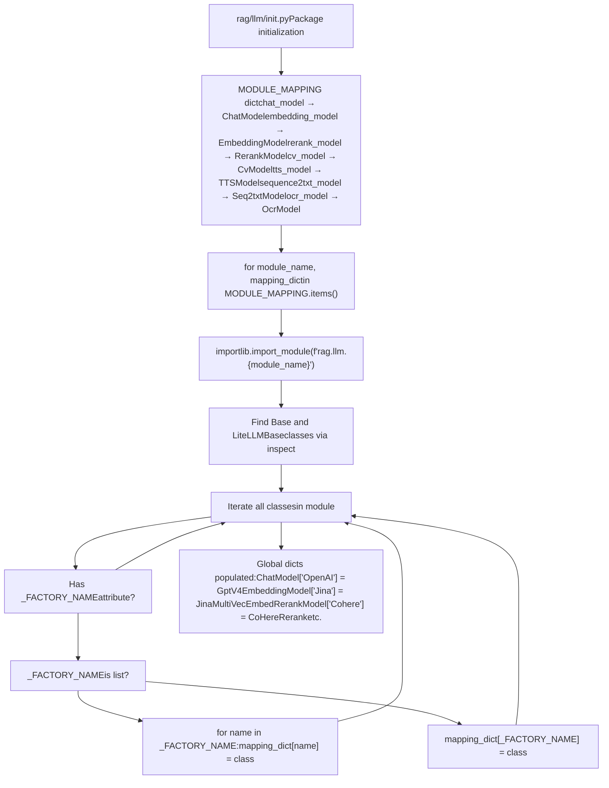
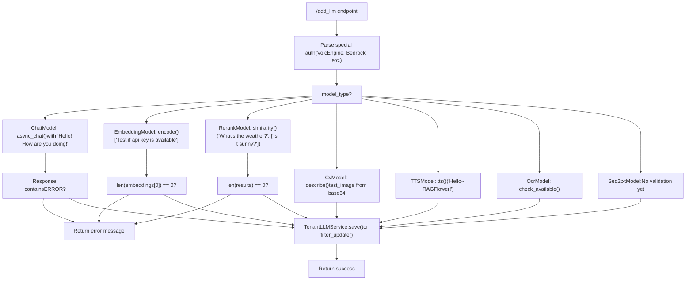

# Provider Implementations

Relevant source files

-   [api/apps/llm\_app.py](https://github.com/infiniflow/ragflow/blob/80a16e71/api/apps/llm_app.py)
-   [api/db/init\_data.py](https://github.com/infiniflow/ragflow/blob/80a16e71/api/db/init_data.py)
-   [api/db/services/llm\_service.py](https://github.com/infiniflow/ragflow/blob/80a16e71/api/db/services/llm_service.py)
-   [conf/llm\_factories.json](https://github.com/infiniflow/ragflow/blob/80a16e71/conf/llm_factories.json)
-   [docs/references/supported\_models.mdx](https://github.com/infiniflow/ragflow/blob/80a16e71/docs/references/supported_models.mdx)
-   [rag/llm/\_\_init\_\_.py](https://github.com/infiniflow/ragflow/blob/80a16e71/rag/llm/__init__.py)
-   [rag/llm/chat\_model.py](https://github.com/infiniflow/ragflow/blob/80a16e71/rag/llm/chat_model.py)
-   [rag/llm/cv\_model.py](https://github.com/infiniflow/ragflow/blob/80a16e71/rag/llm/cv_model.py)
-   [rag/llm/embedding\_model.py](https://github.com/infiniflow/ragflow/blob/80a16e71/rag/llm/embedding_model.py)
-   [rag/llm/rerank\_model.py](https://github.com/infiniflow/ragflow/blob/80a16e71/rag/llm/rerank_model.py)
-   [rag/llm/sequence2txt\_model.py](https://github.com/infiniflow/ragflow/blob/80a16e71/rag/llm/sequence2txt_model.py)
-   [rag/llm/tts\_model.py](https://github.com/infiniflow/ragflow/blob/80a16e71/rag/llm/tts_model.py)
-   [web/src/assets/svg/llm/n1n.svg](https://github.com/infiniflow/ragflow/blob/80a16e71/web/src/assets/svg/llm/n1n.svg)
-   [web/src/constants/llm.ts](https://github.com/infiniflow/ragflow/blob/80a16e71/web/src/constants/llm.ts)
-   [web/src/pages/user-setting/setting-model/constant.ts](https://github.com/infiniflow/ragflow/blob/80a16e71/web/src/pages/user-setting/setting-model/constant.ts)
-   [web/src/utils/common-util.ts](https://github.com/infiniflow/ragflow/blob/80a16e71/web/src/utils/common-util.ts)

This document describes the implementation architecture for LLM providers in RAGFlow, covering 40+ providers across 6 model types (chat, embedding, rerank, image2text, TTS, speech2text). Each provider implements a standard interface through Python classes that inherit from model-type-specific base classes. For information about the factory registration pattern and dynamic loading mechanism, see [Model Factory Pattern and Registration](/infiniflow/ragflow/5.1-model-factory-pattern-and-registration). For configuration and usage tracking, see [Tenant Configuration and Usage Tracking](/infiniflow/ragflow/5.4-tenant-configuration-and-usage-tracking).

**Scope**: This page focuses on the concrete provider implementations, their base class contracts, authentication patterns, and special handling requirements. It does not cover error handling (see [Error Handling and Retry Logic](/infiniflow/ragflow/5.3-error-handling-and-retry-logic)) or tool calling capabilities (see [Tool Calling and Function Use](/infiniflow/ragflow/5.5-tool-calling-and-function-use)).

---

## Model Type Base Classes

Each of the 6 model types defines an abstract base class that all providers must implement. These base classes establish the interface contract and provide common functionality.

### Chat Model Base Class

The `Base` class in [rag/llm/chat\_model.py65-488](https://github.com/infiniflow/ragflow/blob/80a16e71/rag/llm/chat_model.py#L65-L488) defines the interface for chat models with OpenAI-compatible APIs:

**Core Methods:**

-   `async_chat(system, history, gen_conf)` - Single completion
-   `async_chat_streamly(system, history, gen_conf)` - Streaming completion
-   `async_chat_with_tools(system, history, gen_conf)` - Tool calling support
-   `bind_tools(toolcall_session, tools)` - Attach tools for function calling

**Standard Configuration Handling:**

-   `_clean_conf(gen_conf)` - Filters allowed parameters (temperature, max\_tokens, top\_p, etc.)
-   `_classify_error(error)` - Maps exceptions to `LLMErrorCode` enum values
-   `_should_retry(error_code)` - Determines if error is transient

**Constructor Parameters:**

```
def __init__(self, key, model_name, base_url, **kwargs):
    self.client = OpenAI(api_key=key, base_url=base_url, timeout=600)
    self.async_client = AsyncOpenAI(api_key=key, base_url=base_url, timeout=600)
    self.model_name = model_name
    self.max_retries = kwargs.get("max_retries", 5)
    self.base_delay = kwargs.get("retry_interval", 2.0)
    self.max_rounds = kwargs.get("max_rounds", 5)  # For tool calling loops
```
Sources: [rag/llm/chat\_model.py65-137](https://github.com/infiniflow/ragflow/blob/80a16e71/rag/llm/chat_model.py#L65-L137)

### Embedding Model Base Class

The `Base` class in [rag/llm/embedding\_model.py37-51](https://github.com/infiniflow/ragflow/blob/80a16e71/rag/llm/embedding_model.py#L37-L51) defines a simpler interface for embedding models:

**Core Methods:**

-   `encode(texts: list)` - Batch encode documents, returns `(embeddings, token_count)`
-   `encode_queries(text: str)` - Encode single query with specialized handling

Most embedding providers inherit this base and override both methods. The typical pattern batches requests in chunks of 16 and uses `truncate()` from `common.token_utils` to limit input length.

Sources: [rag/llm/embedding\_model.py37-51](https://github.com/infiniflow/ragflow/blob/80a16e71/rag/llm/embedding_model.py#L37-L51)

### Rerank Model Base Class

The `Base` class in [rag/llm/rerank\_model.py28-54](https://github.com/infiniflow/ragflow/blob/80a16e71/rag/llm/rerank_model.py#L28-L54) provides reranking functionality:

**Core Method:**

-   `similarity(query: str, texts: list)` - Returns `(rank_scores, token_count)` where `rank_scores` is a numpy array with relevance scores for each text

**Helper Method:**

-   `_normalize_rank(rank)` - Static method that normalizes rank values to 0-1 range, avoiding division by zero

Sources: [rag/llm/rerank\_model.py28-54](https://github.com/infiniflow/ragflow/blob/80a16e71/rag/llm/rerank_model.py#L28-L54)

### Vision Model Base Class

The `Base` class in [rag/llm/cv\_model.py42-187](https://github.com/infiniflow/ragflow/blob/80a16e71/rag/llm/cv_model.py#L42-L187) handles image-to-text conversion:

**Core Methods:**

-   `describe(image)` - Generate description of image with default prompt
-   `describe_with_prompt(image, prompt)` - Generate description with custom prompt
-   `async_chat(system, history, gen_conf, images)` - Chat with image context
-   `async_chat_streamly(system, history, gen_conf, images)` - Streaming chat with images

**Image Handling:**

-   `image2base64(image)` - Converts PIL Image, bytes, or BytesIO to base64 data URL with proper MIME type detection
-   `_image_prompt(text, images)` - Formats images into OpenAI vision API message structure

Sources: [rag/llm/cv\_model.py42-187](https://github.com/infiniflow/ragflow/blob/80a16e71/rag/llm/cv_model.py#L42-L187)

### TTS Model Base Class

The `Base` class in [rag/llm/tts\_model.py65-78](https://github.com/infiniflow/ragflow/blob/80a16e71/rag/llm/tts_model.py#L65-L78) provides text-to-speech:

**Core Method:**

-   `tts(text: str) -> Generator[bytes, None, None]` - Yields audio chunks followed by token count as final value

**Helper Method:**

-   `normalize_text(text)` - Removes markdown formatting (`**`, `##`, `#`) from text before synthesis

Sources: [rag/llm/tts\_model.py65-78](https://github.com/infiniflow/ragflow/blob/80a16e71/rag/llm/tts_model.py#L65-L78)

### Speech-to-Text Model Base Class

The `Base` class in [rag/llm/sequence2txt\_model.py31-50](https://github.com/infiniflow/ragflow/blob/80a16e71/rag/llm/sequence2txt_model.py#L31-L50) handles audio transcription:

**Core Method:**

-   `transcription(audio_path, **kwargs)` - Returns `(transcribed_text, token_count)`

**Optional Method:**

-   `stream_transcription(audio_path)` - Yields events with structure `{"event": "delta"|"final"|"error", "text": ...}`

Sources: [rag/llm/sequence2txt\_model.py31-50](https://github.com/infiniflow/ragflow/blob/80a16e71/rag/llm/sequence2txt_model.py#L31-L50)

---

## Factory Registration Pattern

### Title: Provider Class Registration Flow


Each provider class declares its factory name via the `_FACTORY_NAME` class attribute. The registration logic in [rag/llm/\_\_init\_\_.py147-174](https://github.com/infiniflow/ragflow/blob/80a16e71/rag/llm/__init__.py#L147-L174) uses Python's `inspect` module to discover all classes that inherit from `Base` and have a `_FACTORY_NAME` attribute. This attribute can be either a string or a list of strings to register the same class under multiple factory names.

**Example Registration:**

```
class OpenAI_APIChat(Base):
    _FACTORY_NAME = ["VLLM", "OpenAI-API-Compatible"]
    # This class handles both VLLM and OpenAI-compatible providers
```
Sources: [rag/llm/\_\_init\_\_.py135-174](https://github.com/infiniflow/ragflow/blob/80a16e71/rag/llm/__init__.py#L135-L174)

---

## Provider Implementation Categories

### OpenAI-Compatible Providers

The largest category of providers use OpenAI's client library with custom `base_url` values. These inherit from the base `Base` class (or `GptV4` for vision models) and typically require minimal customization.

**Standard OpenAI-Compatible Pattern:**

| Provider Class | Factory Name | Base URL | Notes |
| --- | --- | --- | --- |
| `Base` (default) | N/A | Configurable | Base implementation with OpenAI/AsyncOpenAI clients |
| `XinferenceChat` | `Xinference` | `{base_url}/v1` | Appends `/v1` to user-provided URL |
| `HuggingFaceChat` | `HuggingFace` | `{base_url}/v1` | Strips `___` suffix from model name |
| `LmStudioChat` | `LM-Studio` | `{base_url}/v1` | Uses `"lm-studio"` as API key |
| `OpenAI_APIChat` | `["VLLM", "OpenAI-API-Compatible"]` | User-provided | Generic compatibility wrapper |
| `LeptonAIChat` | `LeptonAI` | `https://{model_name}.lepton.run/api/v1` | Auto-constructs URL from model name |

Sources: [rag/llm/chat\_model.py490-753](https://github.com/infiniflow/ragflow/blob/80a16e71/rag/llm/chat_model.py#L490-L753)

### Native SDK Providers

Some providers use their native SDK instead of the OpenAI client:

#### MistralChat

```
class MistralChat(Base):
    _FACTORY_NAME = "Mistral"

    def __init__(self, key, model_name, base_url=None, **kwargs):
        from mistralai.client import MistralClient
        self.client = MistralClient(api_key=key)

    def _clean_conf(self, gen_conf):
        # Only temperature, top_p, max_tokens allowed
        return {k: v for k, v in gen_conf.items()
                if k in ["temperature", "top_p", "max_tokens"]}
```
Sources: [rag/llm/chat\_model.py670-722](https://github.com/infiniflow/ragflow/blob/80a16e71/rag/llm/chat_model.py#L670-L722)

#### ReplicateChat

Uses the `replicate` SDK and constructs prompts from the last 5 history messages:

```
def _chat(self, history, gen_conf={}, **kwargs):
    system = history[0]["content"] if history[0]["role"] == "system" else ""
    prompt = "\n".join([item["role"] + ":" + item["content"]
                       for item in history[-5:] if item["role"] != "system"])
    response = self.client.run(
        self.model_name,
        input={"system_prompt": system, "prompt": prompt, **gen_conf}
    )
    ans = "".join(response)
    return ans, num_tokens_from_string(ans)
```
Sources: [rag/llm/chat\_model.py755-794](https://github.com/infiniflow/ragflow/blob/80a16e71/rag/llm/chat_model.py#L755-L794)

#### Tencent Hunyuan (HunyuanChat)

Uses Tencent Cloud SDK with special message format (capitalized keys):

```
from tencentcloud.hunyuan.v20230901 import models, hunyuan_client

def _chat(self, history, gen_conf={}, **kwargs):
    hist = [{k.capitalize(): v for k, v in item.items()} for item in history]
    req = models.ChatCompletionsRequest()
    params = {"Model": self.model_name, "Messages": hist, **gen_conf}
    req.from_json_string(json.dumps(params))
    response = self.client.ChatCompletions(req)
    return response.Choices[0].Message.Content, response.Usage.TotalTokens
```
Sources: [rag/llm/chat\_model.py796-872](https://github.com/infiniflow/ragflow/blob/80a16e71/rag/llm/chat_model.py#L796-L872)

---

## Special Authentication Patterns

### Title: Complex Authentication Provider Patterns

```mermaid
flowchart TD
    TH_Key["JSON API key:{hunyuan_sid, hunyuan_sk}"]
    TH_Parse["Parse JSON"]
    TH_Cred["credential.Credential(sid, sk)"]
    TH_Client["hunyuan_client.HunyuanClient"]
    AZ_Key["JSON API key:{api_key, api_version}"]
    AZ_Parse["Parse JSON"]
    AZ_Client["AzureOpenAI clientwith azure_endpoint+ api_version"]
    BE_Key["JSON API key:{auth_mode, bedrock_ak,bedrock_sk, bedrock_region,aws_role_arn}"]
    BE_Mode["auth_mode?"]
    BE_AK["access_key_secret:boto3.client withbedrock_ak + bedrock_sk"]
    BE_Role["iam_role:STS.assume_rolewith aws_role_arn"]
    BE_Default["assume_role:Default AWScredential chain"]
    VE_Key["JSON API key:{ark_api_key, ep_id}"]
    VE_Parse["Parse JSONin init"]
    VE_Client["OpenAI client withark_api_key"]
    VE_Model["model_name = ep_id"]

    TH --> Key_TH_Parse
    TH --> Parse_TH_Cred
    TH --> Cred_TH_Client
    AZ --> Key_AZ_Parse
    AZ --> Parse_AZ_Client
    BE --> Key_BE_Mode
    BE --> Mode_BE_AK
    BE --> Mode_BE_Role
    BE --> Mode_BE_Default
    VE --> Key_VE_Parse
    VE --> Parse_VE_Client
    VE --> Parse_VE_Model
```


### VolcEngine Authentication

VolcEngine (Bytedance's Volcano Engine) uses a special authentication pattern where the API key is stored as JSON containing both the ARK API key and endpoint ID:

```
class VolcEngineChat(Base):
    _FACTORY_NAME = "VolcEngine"

    def __init__(self, key, model_name, base_url="https://ark.cn-beijing.volces.com/api/v3", **kwargs):
        # Key is JSON: {"ark_api_key": "...", "ep_id": "..."}
        ark_api_key = json.loads(key).get("ark_api_key", "")
        model_name = json.loads(key).get("ep_id", "") + json.loads(key).get("endpoint_id", "")
        super().__init__(ark_api_key, model_name, base_url, **kwargs)
```
The frontend form in [api/apps/llm\_app.py144-147](https://github.com/infiniflow/ragflow/blob/80a16e71/api/apps/llm_app.py#L144-L147) assembles this JSON from separate fields:

```
if factory == "VolcEngine":
    api_key = apikey_json(["ark_api_key", "endpoint_id"])
```
Sources: [rag/llm/chat\_model.py655-668](https://github.com/infiniflow/ragflow/blob/80a16e71/rag/llm/chat_model.py#L655-L668) [api/apps/llm\_app.py144-147](https://github.com/infiniflow/ragflow/blob/80a16e71/api/apps/llm_app.py#L144-L147)

### Bedrock Multi-Mode Authentication

AWS Bedrock supports three authentication modes defined in [rag/llm/embedding\_model.py461-503](https://github.com/infiniflow/ragflow/blob/80a16e71/rag/llm/embedding_model.py#L461-L503):

1.  **Access Key/Secret**: Direct credentials
2.  **IAM Role**: Assumes a role via STS
3.  **Default Chain**: Uses standard AWS credential resolution

```
class BedrockEmbed(Base):
    _FACTORY_NAME = "Bedrock"

    def __init__(self, key, model_name, **kwargs):
        key = json.loads(key)
        mode = key.get("auth_mode")
        self.bedrock_region = key.get("bedrock_region")

        if mode == "access_key_secret":
            self.client = boto3.client(
                service_name="bedrock-runtime",
                region_name=self.bedrock_region,
                aws_access_key_id=key.get("bedrock_ak"),
                aws_secret_access_key=key.get("bedrock_sk")
            )
        elif mode == "iam_role":
            sts_client = boto3.client("sts", region_name=self.bedrock_region)
            resp = sts_client.assume_role(
                RoleArn=key.get("aws_role_arn"),
                RoleSessionName="BedrockSession"
            )
            creds = resp["Credentials"]
            self.client = boto3.client(
                service_name="bedrock-runtime",
                aws_access_key_id=creds["AccessKeyId"],
                aws_secret_access_key=creds["SecretAccessKey"],
                aws_session_token=creds["SessionToken"]
            )
        else:  # assume_role (default)
            self.client = boto3.client("bedrock-runtime", region_name=self.bedrock_region)
```
Sources: [rag/llm/embedding\_model.py461-503](https://github.com/infiniflow/ragflow/blob/80a16e71/rag/llm/embedding_model.py#L461-L503)

### Azure OpenAI Authentication

Azure uses a separate API version parameter alongside the endpoint URL:

```
class AzureEmbed(OpenAIEmbed):
    _FACTORY_NAME = "Azure-OpenAI"

    def __init__(self, key, model_name, **kwargs):
        from openai.lib.azure import AzureOpenAI

        api_key = json.loads(key).get("api_key", "")
        api_version = json.loads(key).get("api_version", "2024-02-01")
        self.client = AzureOpenAI(
            api_key=api_key,
            azure_endpoint=kwargs["base_url"],
            api_version=api_version
        )
```
Sources: [rag/llm/embedding\_model.py153-162](https://github.com/infiniflow/ragflow/blob/80a16e71/rag/llm/embedding_model.py#L153-L162)

---

## Provider Testing and Validation

When a provider is added via the `/add_llm` endpoint in [api/apps/llm\_app.py128-297](https://github.com/infiniflow/ragflow/blob/80a16e71/api/apps/llm_app.py#L128-L297) the system validates that the API credentials work by executing a test request:

### Title: Provider Validation Flow


**Chat Model Test:**

```
mdl = ChatModel<FileRef file-url="https://github.com/infiniflow/ragflow/blob/80a16e71/factory" undefined  file-path="factory">Hii</FileRef>
m, tc = await mdl.async_chat(None, [{"role": "user", "content": "Hello! How are you doing!"}],
                             {"temperature": 0.9})
if not tc and m.find("**ERROR**:") >= 0:
    raise Exception(m)
```
**Embedding Model Test:**

```
mdl = EmbeddingModel<FileRef file-url="https://github.com/infiniflow/ragflow/blob/80a16e71/factory" undefined  file-path="factory">Hii</FileRef>
arr, tc = mdl.encode(["Test if the api key is available"])
if len(arr[0]) == 0:
    raise Exception("Fail")
```
**Rerank Model Test:**

```
mdl = RerankModel<FileRef file-url="https://github.com/infiniflow/ragflow/blob/80a16e71/factory" undefined  file-path="factory">Hii</FileRef>
arr, tc = mdl.similarity("Hello~ RAGFlower!", ["Hi, there!", "Ohh, my friend!"])
if len(arr) == 0:
    raise Exception("Not known.")
```
Sources: [api/apps/llm\_app.py217-290](https://github.com/infiniflow/ragflow/blob/80a16e71/api/apps/llm_app.py#L217-L290)

---

## Model Capability Matrix

The following table shows which model types each major provider supports, extracted from [conf/llm\_factories.json](https://github.com/infiniflow/ragflow/blob/80a16e71/conf/llm_factories.json):

| Provider | Chat | Embedding | Rerank | Image2Text | TTS | Speech2Text |
| --- | --- | --- | --- | --- | --- | --- |
| OpenAI | ✓ | ✓ |  | ✓ | ✓ | ✓ |
| Anthropic | ✓ |  |  |  |  |  |
| Tongyi-Qianwen | ✓ | ✓ | ✓ | ✓ | ✓ | ✓ |
| ZHIPU-AI | ✓ | ✓ |  | ✓ |  |  |
| Azure-OpenAI | ✓ | ✓ |  | ✓ |  | ✓ |
| Gemini | ✓ | ✓ |  | ✓ |  |  |
| Bedrock | ✓ | ✓ |  |  |  |  |
| DeepSeek | ✓ |  |  |  |  |  |
| Ollama | ✓ | ✓ |  | ✓ |  |  |
| Xinference | ✓ | ✓ | ✓ | ✓ | ✓ | ✓ |
| Jina |  | ✓ | ✓ |  |  |  |
| Cohere | ✓ | ✓ | ✓ | ✓ |  |  |
| Mistral | ✓ | ✓ |  |  |  |  |
| Groq | ✓ |  |  |  |  |  |
| xAI | ✓ |  |  | ✓ |  |  |
| NVIDIA | ✓ | ✓ | ✓ | ✓ |  |  |
| SILICONFLOW | ✓ | ✓ | ✓ | ✓ |  |  |
| VolcEngine | ✓ |  |  |  |  |  |
| BaiduYiyan | ✓ | ✓ | ✓ | ✓ |  |  |
| XunFei Spark | ✓ |  |  |  | ✓ |  |
| Fish Audio |  |  |  |  | ✓ |  |
| Tencent Cloud |  |  |  |  |  | ✓ |
| Tencent Hunyuan | ✓ |  |  |  |  |  |
| GPUStack | ✓ | ✓ | ✓ |  | ✓ | ✓ |
| LM-Studio | ✓ | ✓ |  | ✓ |  |  |
| LocalAI | ✓ | ✓ |  | ✓ |  |  |
| VLLM | ✓ | ✓ | ✓ | ✓ |  |  |
| OpenAI-API-Compatible | ✓ | ✓ | ✓ | ✓ |  |  |

Sources: [conf/llm\_factories.json1-200](https://github.com/infiniflow/ragflow/blob/80a16e71/conf/llm_factories.json#L1-L200)

---

## LiteLLM Integration

For providers that support the litellm library, RAGFlow includes a `LiteLLMBase` class pattern (mentioned in [rag/llm/\_\_init\_\_.py152-165](https://github.com/infiniflow/ragflow/blob/80a16e71/rag/llm/__init__.py#L152-L165)). This class also registers via `_FACTORY_NAME` but provides a different implementation path through the litellm proxy.

**Supported LiteLLM Providers** (from [rag/llm/\_\_init\_\_.py25-60](https://github.com/infiniflow/ragflow/blob/80a16e71/rag/llm/__init__.py#L25-L60)):

```
class SupportedLiteLLMProvider(StrEnum):
    Tongyi_Qianwen = "Tongyi-Qianwen"
    Bedrock = "Bedrock"
    Moonshot = "Moonshot"
    xAI = "xAI"
    DeepInfra = "DeepInfra"
    Groq = "Groq"
    Cohere = "Cohere"
    Gemini = "Gemini"
    DeepSeek = "DeepSeek"
    Nvidia = "NVIDIA"
    TogetherAI = "TogetherAI"
    Anthropic = "Anthropic"
    Ollama = "Ollama"
    # ... and 20+ more
```
Each provider has a corresponding entry in `LITELLM_PROVIDER_PREFIX` that maps to the model prefix used by litellm (e.g., `"dashscope/"` for Tongyi-Qianwen, `"bedrock/"` for Bedrock).

Sources: [rag/llm/\_\_init\_\_.py25-124](https://github.com/infiniflow/ragflow/blob/80a16e71/rag/llm/__init__.py#L25-L124)

---

## Model Name Handling Conventions

Several providers use suffix patterns to distinguish between deployment types:

**Suffix Pattern Usage:**

| Pattern | Providers | Purpose | Stripped In |
| --- | --- | --- | --- |
| `___LocalAI` | LocalAI | Marks model as LocalAI-deployed | [rag/llm/embedding\_model.py133](https://github.com/infiniflow/ragflow/blob/80a16e71/rag/llm/embedding_model.py#L133-L133) |
| `___HuggingFace` | HuggingFace | Marks model as HuggingFace-deployed | [rag/llm/chat\_model.py507](https://github.com/infiniflow/ragflow/blob/80a16e71/rag/llm/chat_model.py#L507-L507) |
| `___OpenAI-API` | OpenAI-API-Compatible | Generic API compatibility | [rag/llm/chat\_model.py742](https://github.com/infiniflow/ragflow/blob/80a16e71/rag/llm/chat_model.py#L742-L742) |
| `___VLLM` | VLLM | VLLM deployment | [api/apps/llm\_app.py172](https://github.com/infiniflow/ragflow/blob/80a16e71/api/apps/llm_app.py#L172-L172) |

The suffix is appended in [api/apps/llm\_app.py162-172](https://github.com/infiniflow/ragflow/blob/80a16e71/api/apps/llm_app.py#L162-L172) during model addition:

```
elif factory == "LocalAI":
    llm_name += "___LocalAI"
elif factory == "HuggingFace":
    llm_name += "___HuggingFace"
elif factory == "OpenAI-API-Compatible":
    llm_name += "___OpenAI-API"
elif factory == "VLLM":
    llm_name += "___VLLM"
```
The provider implementations then strip this suffix using `model_name.split("___")[0]` to get the actual model name for API calls.

Sources: [api/apps/llm\_app.py162-172](https://github.com/infiniflow/ragflow/blob/80a16e71/api/apps/llm_app.py#L162-L172) [rag/llm/embedding\_model.py133](https://github.com/infiniflow/ragflow/blob/80a16e71/rag/llm/embedding_model.py#L133-L133)

---

## Provider Configuration Database Schema

Provider configurations are stored in the `TenantLLM` table with the following key fields:

```
class TenantLLM:
    tenant_id: str          # User/tenant identifier
    llm_factory: str        # Provider name (e.g., "OpenAI", "Anthropic")
    llm_name: str           # Model name (e.g., "gpt-4", "claude-3-opus")
    model_type: str         # LLMType enum: CHAT, EMBEDDING, RERANK, etc.
    api_key: str            # API credentials (may be JSON for complex auth)
    api_base: str           # Custom base URL override
    max_tokens: int         # Model context window size
    used_tokens: int        # Cumulative token usage tracking
    status: str             # "1" = active, "0" = disabled
```
The initialization flow in [api/db/init\_data.py36-94](https://github.com/infiniflow/ragflow/blob/80a16e71/api/db/init_data.py#L36-L94) creates default provider entries for new users based on environment variables in `settings.CHAT_CFG`, `settings.EMBEDDING_CFG`, etc.

Sources: [api/db/init\_data.py36-94](https://github.com/infiniflow/ragflow/blob/80a16e71/api/db/init_data.py#L36-L94) [api/db/services/llm\_service.py36-83](https://github.com/infiniflow/ragflow/blob/80a16e71/api/db/services/llm_service.py#L36-L83)

---

## Special Provider Features

### Reasoning Models (QwQ)

The base chat implementation includes special handling for reasoning models that output \`"): continue # Strip reasoning content final\_ans += delta return final\_ans.strip(), tol\_token

```
Sources: <FileRef file-url="https://github.com/infiniflow/ragflow/blob/80a16e71/rag/llm/chat_model.py#L447-L461" min=447 max=461 file-path="rag/llm/chat_model.py">Hii</FileRef>

### Video Summarization (QWen)

QWenCV includes video processing capability using DashScope's MultiModalConversation API:

```python
def _process_video(self, video_bytes, filename):
    from dashscope import MultiModalConversation

    with tempfile.NamedTemporaryFile(delete=False, suffix=video_suffix) as tmp:
        tmp.write(video_bytes)
        messages = [{
            "role": "user",
            "content": [
                {"video": f"file://{tmp.name}", "fps": 2},
                {"text": "Please summarize this video in proper sentences."}
            ]
        }]
        response = MultiModalConversation.call(
            api_key=self.api_key,
            model=self.model_name,
            messages=messages
        )
        return response["output"]["choices"][0]["message"].content[0]["text"]
```
Sources: [rag/llm/cv\_model.py261-306](https://github.com/infiniflow/ragflow/blob/80a16e71/rag/llm/cv_model.py#L261-L306)

### Multi-Vector Embeddings (Jina v4)

Jina's v4 embedding models support multi-vector representations where each token gets an embedding, and the final chunk embedding is computed as the mean:

```
class JinaMultiVecEmbed(Base):
    def encode(self, texts: list[str|bytes], task="retrieval.passage"):
        data = {"model": self.model_name, "input": input}
        if "v4" in self.model_name:
            data["return_multivector"] = True

        for d in res['data']:
            if data.get("return_multivector", False):  # v4
                token_embs = np.asarray(d['embeddings'], dtype=np.float32)
                chunk_emb = token_embs.mean(axis=0)
            else:  # v2/v3
                chunk_emb = np.asarray(d['embedding'], dtype=np.float32)
```
Sources: [rag/llm/embedding\_model.py354-410](https://github.com/infiniflow/ragflow/blob/80a16e71/rag/llm/embedding_model.py#L354-L410)
