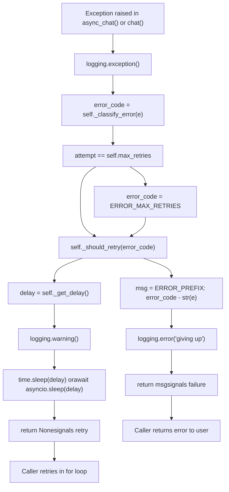
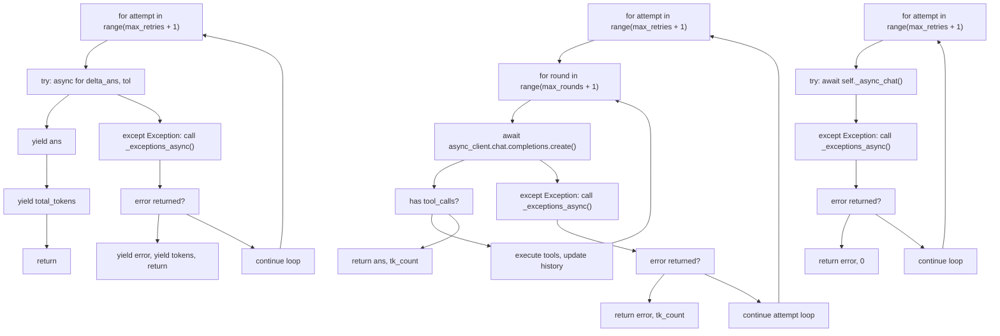
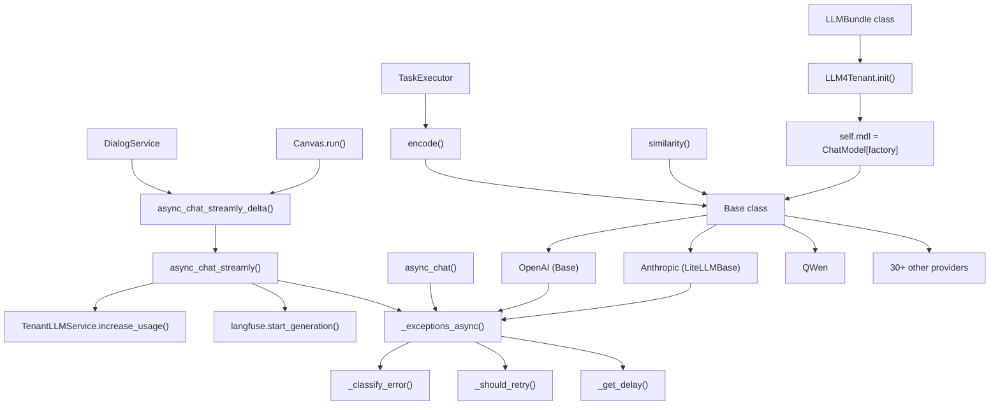
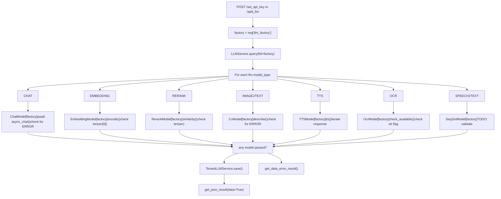
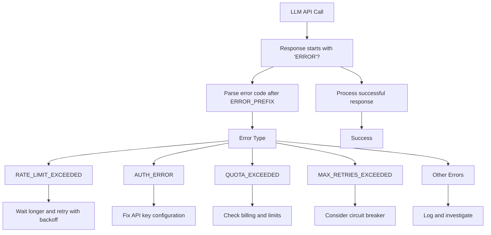

```mermaid
flowchart TD
    Error["Exception e"]
    ToString["str(e).lower()"]
    Regex["re.search() with keyword patterns"]
    Pattern1["quota|capacity|credit|billing|欠费"]
    Pattern2["rate limit|429|tpm limit|too many requests"]
    Pattern3["auth|key|apikey|401|forbidden|permission"]
    Pattern4["invalid|bad request|400|format|malformed"]
    Pattern5["server|503|502|504|500|unavailable"]
    Pattern6["timeout|timed out"]
    Pattern7["connect|network|unreachable|dns"]
    Pattern8["filter|content|policy|blocked|safety"]
    Pattern9["model|not found|does not exist"]
    Pattern10["max rounds"]
    NoMatch["No pattern matched"]
    Code1["LLMErrorCode.ERROR_QUOTA"]
    Code2["LLMErrorCode.ERROR_RATE_LIMIT⚠️ RETRYABLE"]
    Code3["LLMErrorCode.ERROR_AUTHENTICATION"]
    Code4["LLMErrorCode.ERROR_INVALID_REQUEST"]
    Code5["LLMErrorCode.ERROR_SERVER⚠️ RETRYABLE"]
    Code6["LLMErrorCode.ERROR_TIMEOUT"]
    Code7["LLMErrorCode.ERROR_CONNECTION"]
    Code8["LLMErrorCode.ERROR_CONTENT_FILTER"]
    Code9["LLMErrorCode.ERROR_MODEL"]
    Code10["LLMErrorCode.ERROR_MODEL"]
    Code11["LLMErrorCode.ERROR_GENERIC"]

    Error --> ToString
    ToString --> Regex
    Regex --> Pattern1
    Regex --> Pattern2
    Regex --> Pattern3
    Regex --> Pattern4
    Regex --> Pattern5
    Regex --> Pattern6
    Regex --> Pattern7
    Regex --> Pattern8
    Regex --> Pattern9
    Regex --> Pattern10
    Regex --> NoMatch
    Pattern1 --> Code1
    Pattern2 --> Code2
    Pattern3 --> Code3
    Pattern4 --> Code4
    Pattern5 --> Code5
    Pattern6 --> Code6
    Pattern7 --> Code7
    Pattern8 --> Code8
    Pattern9 --> Code9
    Pattern10 --> Code10
    NoMatch --> Code11
```

# Error Handling and Retry Logic

Relevant source files

-   [api/apps/llm\_app.py](https://github.com/infiniflow/ragflow/blob/80a16e71/api/apps/llm_app.py)
-   [api/db/init\_data.py](https://github.com/infiniflow/ragflow/blob/80a16e71/api/db/init_data.py)
-   [api/db/services/llm\_service.py](https://github.com/infiniflow/ragflow/blob/80a16e71/api/db/services/llm_service.py)
-   [conf/llm\_factories.json](https://github.com/infiniflow/ragflow/blob/80a16e71/conf/llm_factories.json)
-   [docs/references/supported\_models.mdx](https://github.com/infiniflow/ragflow/blob/80a16e71/docs/references/supported_models.mdx)
-   [rag/llm/\_\_init\_\_.py](https://github.com/infiniflow/ragflow/blob/80a16e71/rag/llm/__init__.py)
-   [rag/llm/chat\_model.py](https://github.com/infiniflow/ragflow/blob/80a16e71/rag/llm/chat_model.py)
-   [rag/llm/cv\_model.py](https://github.com/infiniflow/ragflow/blob/80a16e71/rag/llm/cv_model.py)
-   [rag/llm/embedding\_model.py](https://github.com/infiniflow/ragflow/blob/80a16e71/rag/llm/embedding_model.py)
-   [rag/llm/rerank\_model.py](https://github.com/infiniflow/ragflow/blob/80a16e71/rag/llm/rerank_model.py)
-   [rag/llm/sequence2txt\_model.py](https://github.com/infiniflow/ragflow/blob/80a16e71/rag/llm/sequence2txt_model.py)
-   [rag/llm/tts\_model.py](https://github.com/infiniflow/ragflow/blob/80a16e71/rag/llm/tts_model.py)
-   [web/src/assets/svg/llm/n1n.svg](https://github.com/infiniflow/ragflow/blob/80a16e71/web/src/assets/svg/llm/n1n.svg)
-   [web/src/constants/llm.ts](https://github.com/infiniflow/ragflow/blob/80a16e71/web/src/constants/llm.ts)
-   [web/src/pages/user-setting/setting-model/constant.ts](https://github.com/infiniflow/ragflow/blob/80a16e71/web/src/pages/user-setting/setting-model/constant.ts)
-   [web/src/utils/common-util.ts](https://github.com/infiniflow/ragflow/blob/80a16e71/web/src/utils/common-util.ts)

This document describes the error handling and retry mechanisms implemented in RAGFlow's LLM integration layer. These mechanisms ensure resilient communication with external LLM providers by automatically classifying errors and retrying transient failures with exponential backoff.

**Scope**: This page covers error classification, retry strategies, and backoff algorithms used when communicating with LLM APIs. For information about LLM provider configurations, see [Provider Implementations](/infiniflow/ragflow/5.2-provider-implementations). For tenant-specific API key management, see [Tenant Configuration and Usage Tracking](/infiniflow/ragflow/5.4-tenant-configuration-and-usage-tracking).

---

## Error Classification System

RAGFlow implements a comprehensive error classification system to distinguish between retryable and non-retryable failures when calling LLM APIs.

### Error Code Types

The `LLMErrorCode` enum defines standardized error types that abstract provider-specific error messages:

| Error Code | Description | Retryable |
| --- | --- | --- |
| `ERROR_RATE_LIMIT` | API rate limit exceeded (HTTP 429) | Yes |
| `ERROR_SERVER` | Server errors (HTTP 500-504) | Yes |
| `ERROR_AUTHENTICATION` | Invalid API key or authentication failure | No |
| `ERROR_INVALID_REQUEST` | Malformed request or invalid parameters | No |
| `ERROR_TIMEOUT` | Request timeout | No |
| `ERROR_CONNECTION` | Network connectivity issues | No |
| `ERROR_MODEL` | Model not found or unavailable | No |
| `ERROR_CONTENT_FILTER` | Content filtered by safety policies | No |
| `ERROR_QUOTA` | API quota or billing issues | No |
| `ERROR_MAX_RETRIES` | Maximum retry attempts exceeded | No |
| `ERROR_GENERIC` | Unclassified error | No |

### Classification Algorithm

The `_classify_error(self, error)` method in `Base` class uses regex-based keyword matching to categorize exceptions:

**Method Signature**: `_classify_error(self, error) -> LLMErrorCode`

**Diagram: Base.\_classify\_error() Pattern Matching Logic**


**Diagram: Base.\_classify\_error() Pattern Matching Logic**


```mermaid
flowchart TD
    Error["Exception e"]
    ToString["str(e).lower()"]
    Regex["re.search() for keyword patterns"]
    Pattern1["Pattern: quota|capacity|credit|billing"]
    Pattern2["Pattern: rate limit|429|tpm limit"]
    Pattern3["Pattern: auth|key|apikey|401|forbidden"]
    Pattern4["Pattern: invalid|bad request|400"]
    Pattern5["Pattern: server|503|502|504|500"]
    Pattern6["Pattern: timeout|timed out"]
    Pattern7["Pattern: connect|network|unreachable"]
    Pattern8["Pattern: filter|content|policy|blocked"]
    Pattern9["Pattern: model|not found|does not exist"]
    Pattern10["Pattern: max rounds"]
    NoMatch["No pattern matched"]
    Code1["LLMErrorCode.ERROR_QUOTA"]
    Code2["LLMErrorCode.ERROR_RATE_LIMITRETRYABLE"]
    Code3["LLMErrorCode.ERROR_AUTHENTICATION"]
    Code4["LLMErrorCode.ERROR_INVALID_REQUEST"]
    Code5["LLMErrorCode.ERROR_SERVERRETRYABLE"]
    Code6["LLMErrorCode.ERROR_TIMEOUT"]
    Code7["LLMErrorCode.ERROR_CONNECTION"]
    Code8["LLMErrorCode.ERROR_CONTENT_FILTER"]
    Code9["LLMErrorCode.ERROR_MODEL"]
    Code10["LLMErrorCode.ERROR_MODEL"]
    Code11["LLMErrorCode.ERROR_GENERIC"]

    Error --> ToString
    ToString --> Regex
    Regex --> Pattern1
    Regex --> Pattern2
    Regex --> Pattern3
    Regex --> Pattern4
    Regex --> Pattern5
    Regex --> Pattern6
    Regex --> Pattern7
    Regex --> Pattern8
    Regex --> Pattern9
    Regex --> Pattern10
    Regex --> NoMatch
    Pattern1 --> Code1
    Pattern2 --> Code2
    Pattern3 --> Code3
    Pattern4 --> Code4
    Pattern5 --> Code5
    Pattern6 --> Code6
    Pattern7 --> Code7
    Pattern8 --> Code8
    Pattern9 --> Code9
    Pattern10 --> Code10
    NoMatch --> Code11
```

**Implementation Details**:

-   Patterns are checked sequentially using `re.search()` with case-insensitive matching
-   First matching pattern determines the error code
-   The `keywords_mapping` list at lines 84-95 defines all patterns
-   Only `ERROR_RATE_LIMIT` and `ERROR_SERVER` are retryable

**Sources**: [rag/llm/chat\_model.py81-100](https://github.com/infiniflow/ragflow/blob/80a16e71/rag/llm/chat_model.py#L81-L100)

---

## Retry Strategy

RAGFlow implements selective retry logic that only retries transient failures that are likely to succeed on subsequent attempts.

### Retryable Error Set

The `_retryable_errors` property defines which errors should trigger retry attempts:

```
@property
def _retryable_errors(self) -> set[str]:
    return {
        LLMErrorCode.ERROR_RATE_LIMIT,
        LLMErrorCode.ERROR_SERVER,
    }
```
Only rate limit errors and server errors are considered retryable, as these represent temporary service disruptions.

### Retry Decision Flow

**Diagram: Base.\_exceptions() and Base.\_exceptions\_async() Flow**


**Key Method Signatures**:

-   `_exceptions(self, e, attempt) -> str | None` - Synchronous version
-   `async _exceptions_async(self, e, attempt)` - Async version
-   `_should_retry(self, error_code: str) -> bool` - Retry check
-   `_get_delay(self) -> float` - Delay calculation

**Sources**: [rag/llm/chat\_model.py203-227](https://github.com/infiniflow/ragflow/blob/80a16e71/rag/llm/chat_model.py#L203-L227) [rag/llm/chat\_model.py229-243](https://github.com/infiniflow/ragflow/blob/80a16e71/rag/llm/chat_model.py#L229-L243) [rag/llm/chat\_model.py209-210](https://github.com/infiniflow/ragflow/blob/80a16e71/rag/llm/chat_model.py#L209-L210)

---

## Exponential Backoff with Jitter

RAGFlow implements randomized exponential backoff to prevent thundering herd problems when multiple requests fail simultaneously.

### Delay Calculation

The `_get_delay(self)` method calculates retry delays with randomized jitter:

**Method Implementation**:

```
def _get_delay(self):
    return self.base_delay * random.uniform(10, 150)
```
**Formula**: `delay = base_delay × random(10, 150)`

**Delay Range Examples**:

-   With default `base_delay=2.0`: 20 to 300 seconds
-   With `base_delay=1.0`: 10 to 150 seconds
-   With `base_delay=5.0`: 50 to 750 seconds

**Design Rationale**:

-   **Large randomization factor (10-150x)** prevents thundering herd problem when multiple clients retry simultaneously
-   **Non-exponential backoff**: Each retry gets a fresh random delay rather than exponentially increasing delays
-   **Suitable for rate-limited APIs** that require significant backoff periods between retries
-   **Jitter prevents synchronization**: Random delays ensure retries don't cluster at predictable intervals

**Trade-offs**:

-   Conservative approach prioritizes API stability over retry speed
-   Maximum delays (up to 300s with defaults) may impact user experience
-   Consider reducing `base_delay` for latency-sensitive applications with reliable APIs

### Configuration Parameters

Retry behavior is configured in `Base.__init__()` constructor:

| Parameter | Environment Variable | Default | Code Reference | Description |
| --- | --- | --- | --- | --- |
| `max_retries` | `LLM_MAX_RETRIES` | 5 | Line 72 | Maximum retry attempts before giving up |
| `base_delay` | `LLM_BASE_DELAY` | 2.0 | Line 73 | Base delay in seconds for jitter calculation (actual delay = base × random(10-150)) |
| `timeout` | `LLM_TIMEOUT_SECONDS` | 600 | Line 67 | HTTP timeout in seconds for OpenAI client requests |
| `max_rounds` | N/A | 5 | Line 74 | Maximum tool calling rounds in agent workflows |

**Configuration Precedence**:

1.  Explicit `kwargs` parameters (highest priority)
2.  Environment variables
3.  Hard-coded defaults (lowest priority)

**Example**: With `LLM_MAX_RETRIES=3` and `LLM_BASE_DELAY=1.0`, the system will:

-   Attempt up to 3 retries after initial failure (4 total attempts)
-   Use delays between 10-150 seconds per retry
-   Give up after 3 failed retries and return `ERROR_MAX_RETRIES_EXCEEDED`

**Sources**: [rag/llm/chat\_model.py66-74](https://github.com/infiniflow/ragflow/blob/80a16e71/rag/llm/chat_model.py#L66-L74)

---

## Implementation in Different Model Types

Error handling is implemented consistently across all model types with variations based on synchronous vs. asynchronous patterns.

### Chat Model Error Handling

**Diagram: Base Class Error Handling in Chat Methods**


**Method Signatures**:

-   `async def async_chat(self, system, history, gen_conf={}, **kwargs)` - Line 474
-   `async def async_chat_streamly(self, system, history, gen_conf: dict = {}, **kwargs)` - Line 174
-   `async def async_chat_with_tools(self, system: str, history: list, gen_conf: dict = {})` - Line 279
-   `async def async_chat_streamly_with_tools(self, system: str, history: list, gen_conf: dict = {})` - Line 333

**Retry Pattern Code**:

Standard async chat retry loop:

```
for attempt in range(self.max_retries + 1):
    try:
        return await self._async_chat(history, gen_conf, **kwargs)
    except Exception as e:
        e = await self._exceptions_async(e, attempt)
        if e:
            return e, 0
```
Streaming retry loop:

```
for attempt in range(self.max_retries + 1):
    try:
        async for delta_ans, tol in self._async_chat_streamly(history, gen_conf, **kwargs):
            ans = delta_ans
            total_tokens += tol
            yield ans
        yield total_tokens
        return
    except Exception as e:
        e = await self._exceptions_async(e, attempt)
        if e:
            yield e
            yield total_tokens
            return
```
**Sources**: [rag/llm/chat\_model.py174-195](https://github.com/infiniflow/ragflow/blob/80a16e71/rag/llm/chat_model.py#L174-L195) [rag/llm/chat\_model.py474-486](https://github.com/infiniflow/ragflow/blob/80a16e71/rag/llm/chat_model.py#L474-L486) [rag/llm/chat\_model.py279-330](https://github.com/infiniflow/ragflow/blob/80a16e71/rag/llm/chat_model.py#L279-L330) [rag/llm/chat\_model.py333-442](https://github.com/infiniflow/ragflow/blob/80a16e71/rag/llm/chat_model.py#L333-L442)

### Embedding Model Error Handling

Embedding models use simpler retry logic focused on API availability:

**QWenEmbed Retry Pattern**:

```
retry_max = 5
resp = dashscope.TextEmbedding.call(...)
while (resp["output"] is None or resp["output"].get("embeddings") is None) and retry_max > 0:
    time.sleep(10)
    resp = dashscope.TextEmbedding.call(...)
    retry_max -= 1
if retry_max == 0:
    # Log exception and raise
```
**MistralEmbed Retry Pattern**:

```
retry_max = 5
while retry_max > 0:
    try:
        res = self.client.embeddings(...)
        ress.extend([d.embedding for d in res.data])
        token_count += total_token_count_from_response(res)
        break
    except Exception as _e:
        if retry_max == 1:
            log_exception(_e)
        delay = random.uniform(20, 60)
        time.sleep(delay)
        retry_max -= 1
```
**Key Differences**:

-   Fixed retry count (5 attempts)
-   Fixed or randomized delay intervals
-   No error classification (retry all exceptions)
-   Simpler error handling focused on availability

**Sources**: [rag/llm/embedding\_model.py190-202](https://github.com/infiniflow/ragflow/blob/80a16e71/rag/llm/embedding_model.py#L190-L202) [rag/llm/embedding\_model.py429-442](https://github.com/infiniflow/ragflow/blob/80a16e71/rag/llm/embedding_model.py#L429-L442)

### Vision Model Error Handling

Vision models (CV models) inherit retry configuration but typically handle errors at the API call level:

```
async def async_chat(self, system, history, gen_conf, images=None, **kwargs):
    try:
        response = await self.async_client.chat.completions.create(...)
        return response.choices[0].message.content.strip(), response.usage.total_tokens
    except Exception as e:
        return "**ERROR**: " + str(e), 0
```
Vision models generally return error messages rather than retrying, relying on higher-level orchestration for retry logic.

**Sources**: [rag/llm/cv\_model.py79-88](https://github.com/infiniflow/ragflow/blob/80a16e71/rag/llm/cv_model.py#L79-L88)

---

## Error Message Format

All error messages returned to callers follow a consistent format to enable programmatic detection:

### Error Prefix Constant

```
ERROR_PREFIX = "**ERROR**"
```
### Error Message Structure

Failed API calls return formatted error strings:

```
msg = f"{ERROR_PREFIX}: {error_code} - {str(e)}"
```
**Example Error Messages**:

-   `"**ERROR**: RATE_LIMIT_EXCEEDED - API rate limit exceeded, please retry later"`
-   `"**ERROR**: MAX_RETRIES_EXCEEDED - Maximum retry attempts exceeded after 5 tries"`
-   `"**ERROR**: AUTH_ERROR - Invalid API key provided"`

This format allows calling code to check for errors with:

```
if response.startswith("**ERROR**:"):
    # Handle error
```
**Sources**: [rag/llm/chat\_model.py59](https://github.com/infiniflow/ragflow/blob/80a16e71/rag/llm/chat_model.py#L59-L59) [rag/llm/chat\_model.py225-227](https://github.com/infiniflow/ragflow/blob/80a16e71/rag/llm/chat_model.py#L225-L227) [rag/llm/chat\_model.py241-243](https://github.com/infiniflow/ragflow/blob/80a16e71/rag/llm/chat_model.py#L241-L243)

---

## Length Limitation Handling

RAGFlow includes special handling for responses truncated due to context length limitations:

### Length Notification Constants

```
LENGTH_NOTIFICATION_CN = "······\n由于大模型的上下文窗口大小限制，回答已经被大模型截断。"
LENGTH_NOTIFICATION_EN = "...\nThe answer is truncated by your chosen LLM due to its limitation on context length."
```
### Finish Reason Detection

When a completion finishes with `finish_reason == "length"`, the appropriate notification is appended:

```
if resp.choices[0].finish_reason == "length":
    if is_chinese(ans):
        ans += LENGTH_NOTIFICATION_CN
    else:
        ans += LENGTH_NOTIFICATION_EN
```
This provides user-facing feedback about truncated responses without treating them as errors.

**Sources**: [rag/llm/chat\_model.py60-61](https://github.com/infiniflow/ragflow/blob/80a16e71/rag/llm/chat_model.py#L60-L61) [rag/llm/chat\_model.py167-171](https://github.com/infiniflow/ragflow/blob/80a16e71/rag/llm/chat_model.py#L167-L171) [rag/llm/chat\_model.py197-200](https://github.com/infiniflow/ragflow/blob/80a16e71/rag/llm/chat_model.py#L197-L200)

---

## Integration with LLMBundle

The `LLMBundle` class in `api/db/services/llm_service.py` wraps provider-specific model instances, adding usage tracking while delegating error handling to the underlying `Base` class methods.

**Diagram: LLMBundle Integration with Base Class Error Handling**


**Key Integration Points**:

1.  **LLMBundle Initialization**:

    -   `LLMBundle` inherits from `LLM4Tenant` class
    -   During init, calls `ChatModel<FileRef file-url="https://github.com/infiniflow/ragflow/blob/80a16e71/factory" undefined file-path="factory">Hii</FileRef>` to instantiate provider-specific model
    -   Provider model inherits from `Base` class with built-in retry logic
2.  **Method Delegation**:

    -   `LLMBundle.async_chat_streamly_delta()` directly calls `self.mdl.async_chat_streamly()`
    -   All retry logic executes within provider's `Base` class methods
    -   `LLMBundle` receives either successful response or formatted error message
3.  **Usage Tracking**:

    -   `TenantLLMService.increase_usage(tenant_id, llm_type, used_tokens)` only called after successful completions
    -   Failed requests (even after retries) do not increment usage counters
    -   Prevents billing users for failed API calls
4.  **Error Transparency**:

    -   Retry logic in `Base` class is completely transparent to `LLMBundle` layer
    -   `LLMBundle` never sees transient failures that succeed on retry
    -   Only receives final success response or error message after max retries exceeded
    -   Enables clean separation of concerns between retry logic and usage tracking
5.  **Observability**:

    -   Langfuse integration wraps entire model call with `generation.start()` and `generation.end()`
    -   Captures both successful responses and final errors (after all retries)
    -   Does not capture individual retry attempts (hidden within `Base` class)
    -   Provides end-to-end latency including all retry delays

**Error Flow Example**:

```
User Request → LLMBundle.async_chat_streamly_delta()
            → Base.async_chat_streamly() [attempt 1: rate limit error]
            → sleep(random 20-300s)
            → Base.async_chat_streamly() [attempt 2: success]
            → return response
            → TenantLLMService.increase_usage()
            → yield response to user
```
**Sources**: [api/db/services/llm\_service.py85-387](https://github.com/infiniflow/ragflow/blob/80a16e71/api/db/services/llm_service.py#L85-L387) [api/db/services/tenant\_llm\_service.py1-300](https://github.com/infiniflow/ragflow/blob/80a16e71/api/db/services/tenant_llm_service.py#L1-L300) [rag/llm/chat\_model.py65-486](https://github.com/infiniflow/ragflow/blob/80a16e71/rag/llm/chat_model.py#L65-L486)

---

## Configuration and Environment Variables

Error handling behavior can be tuned via environment variables:

### Environment Variables

| Variable | Type | Default | Description |
| --- | --- | --- | --- |
| `LLM_MAX_RETRIES` | int | 5 | Maximum retry attempts before giving up |
| `LLM_BASE_DELAY` | float | 2.0 | Base delay in seconds for exponential backoff |
| `LLM_TIMEOUT_SECONDS` | int | 600 | HTTP request timeout for LLM API calls |

### Usage in Code

Configuration is applied during model initialization:

```
def __init__(self, key, model_name, base_url, **kwargs):
    timeout = int(os.environ.get("LLM_TIMEOUT_SECONDS", 600))
    self.client = OpenAI(api_key=key, base_url=base_url, timeout=timeout)
    self.max_retries = kwargs.get("max_retries", int(os.environ.get("LLM_MAX_RETRIES", 5)))
    self.base_delay = kwargs.get("retry_interval", float(os.environ.get("LLM_BASE_DELAY", 2.0)))
    self.max_rounds = kwargs.get("max_rounds", 5)
```
**Sources**: [rag/llm/chat\_model.py65-73](https://github.com/infiniflow/ragflow/blob/80a16e71/rag/llm/chat_model.py#L65-L73)

---

## API Validation and Testing

Before storing LLM configurations, RAGFlow validates API credentials by making test calls in `api/apps/llm_app.py`.

**Diagram: LLM Configuration Validation Flow**


**Validation Code Examples**:

Chat Model:

```
mdl = ChatModel<FileRef file-url="https://github.com/infiniflow/ragflow/blob/80a16e71/factory" undefined  file-path="factory">Hii</FileRef>)
m, tc = await mdl.async_chat(None, [{"role": "user", "content": "Hello! How are you doing!"}],
                             {"temperature": 0.9})
if not tc and m.find("**ERROR**:") >= 0:
    raise Exception(m)
```
Embedding Model:

```
mdl = EmbeddingModel<FileRef file-url="https://github.com/infiniflow/ragflow/blob/80a16e71/factory" undefined  file-path="factory">Hii</FileRef>
arr, tc = mdl.encode(["Test if the api key is available"])
if len(arr[0]) == 0:
    raise Exception("Fail")
```
Rerank Model:

```
mdl = RerankModel<FileRef file-url="https://github.com/infiniflow/ragflow/blob/80a16e71/factory" undefined  file-path="factory">Hii</FileRef>
arr, tc = mdl.similarity("Hello~ RAGFlower!", ["Hi, there!", "Ohh, my friend!"])
if len(arr) == 0:
    raise Exception("Not known.")
```
**Key Points**:

-   Validation happens synchronously during configuration
-   At least one model type must pass validation
-   Failed validations accumulate error messages in `msg` variable
-   Successful validation saves configuration to `tenant_llm` table
-   Retry logic in `Base` class applies during validation tests

**Sources**: [api/apps/llm\_app.py58-125](https://github.com/infiniflow/ragflow/blob/80a16e71/api/apps/llm_app.py#L58-L125) [api/apps/llm\_app.py128-297](https://github.com/infiniflow/ragflow/blob/80a16e71/api/apps/llm_app.py#L128-L297)

---

## Best Practices

### For System Administrators

1.  **Monitor Retry Rates**: High retry rates indicate rate limiting or service instability
2.  **Adjust Base Delay**: Increase `LLM_BASE_DELAY` for rate-limited scenarios
3.  **Set Appropriate Timeouts**: Balance between responsiveness and allowing long-running requests
4.  **Configure Max Retries**: Reduce for cost-sensitive deployments, increase for reliability

### For Developers

1.  **Check for Error Prefix**: Always check if responses start with `"**ERROR**"` before processing
2.  **Implement Circuit Breakers**: Consider additional circuit breaker patterns at application level
3.  **Log Error Codes**: Track which error codes occur most frequently for each provider
4.  **Handle Streaming Errors**: Streaming responses may yield error messages mid-stream

### Error Handling Checklist


**Sources**: [rag/llm/chat\_model.py38-61](https://github.com/infiniflow/ragflow/blob/80a16e71/rag/llm/chat_model.py#L38-L61) [rag/llm/chat\_model.py203-243](https://github.com/infiniflow/ragflow/blob/80a16e71/rag/llm/chat_model.py#L203-L243)
