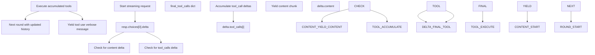
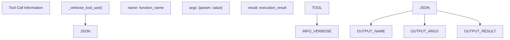
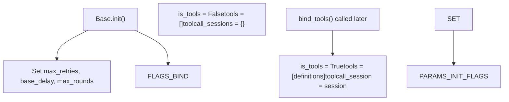

# Tool Calling and Function Use

Relevant source files

-   [agent/canvas.py](https://github.com/infiniflow/ragflow/blob/80a16e71/agent/canvas.py)
-   [agent/component/agent\_with\_tools.py](https://github.com/infiniflow/ragflow/blob/80a16e71/agent/component/agent_with_tools.py)
-   [agent/component/base.py](https://github.com/infiniflow/ragflow/blob/80a16e71/agent/component/base.py)
-   [agent/component/categorize.py](https://github.com/infiniflow/ragflow/blob/80a16e71/agent/component/categorize.py)
-   [agent/component/llm.py](https://github.com/infiniflow/ragflow/blob/80a16e71/agent/component/llm.py)
-   [agent/tools/base.py](https://github.com/infiniflow/ragflow/blob/80a16e71/agent/tools/base.py)
-   [api/apps/api\_app.py](https://github.com/infiniflow/ragflow/blob/80a16e71/api/apps/api_app.py)
-   [api/apps/canvas\_app.py](https://github.com/infiniflow/ragflow/blob/80a16e71/api/apps/canvas_app.py)
-   [api/apps/llm\_app.py](https://github.com/infiniflow/ragflow/blob/80a16e71/api/apps/llm_app.py)
-   [api/db/init\_data.py](https://github.com/infiniflow/ragflow/blob/80a16e71/api/db/init_data.py)
-   [api/db/services/llm\_service.py](https://github.com/infiniflow/ragflow/blob/80a16e71/api/db/services/llm_service.py)
-   [conf/llm\_factories.json](https://github.com/infiniflow/ragflow/blob/80a16e71/conf/llm_factories.json)
-   [docs/references/supported\_models.mdx](https://github.com/infiniflow/ragflow/blob/80a16e71/docs/references/supported_models.mdx)
-   [rag/llm/\_\_init\_\_.py](https://github.com/infiniflow/ragflow/blob/80a16e71/rag/llm/__init__.py)
-   [rag/llm/chat\_model.py](https://github.com/infiniflow/ragflow/blob/80a16e71/rag/llm/chat_model.py)
-   [rag/llm/cv\_model.py](https://github.com/infiniflow/ragflow/blob/80a16e71/rag/llm/cv_model.py)
-   [rag/llm/embedding\_model.py](https://github.com/infiniflow/ragflow/blob/80a16e71/rag/llm/embedding_model.py)
-   [rag/llm/rerank\_model.py](https://github.com/infiniflow/ragflow/blob/80a16e71/rag/llm/rerank_model.py)
-   [rag/llm/sequence2txt\_model.py](https://github.com/infiniflow/ragflow/blob/80a16e71/rag/llm/sequence2txt_model.py)
-   [rag/llm/tts\_model.py](https://github.com/infiniflow/ragflow/blob/80a16e71/rag/llm/tts_model.py)
-   [rag/prompts/generator.py](https://github.com/infiniflow/ragflow/blob/80a16e71/rag/prompts/generator.py)
-   [web/src/assets/svg/llm/n1n.svg](https://github.com/infiniflow/ragflow/blob/80a16e71/web/src/assets/svg/llm/n1n.svg)
-   [web/src/components/knowledge-base-item.tsx](https://github.com/infiniflow/ragflow/blob/80a16e71/web/src/components/knowledge-base-item.tsx)
-   [web/src/constants/llm.ts](https://github.com/infiniflow/ragflow/blob/80a16e71/web/src/constants/llm.ts)
-   [web/src/interfaces/request/flow.ts](https://github.com/infiniflow/ragflow/blob/80a16e71/web/src/interfaces/request/flow.ts)
-   [web/src/pages/user-setting/setting-model/constant.ts](https://github.com/infiniflow/ragflow/blob/80a16e71/web/src/pages/user-setting/setting-model/constant.ts)
-   [web/src/utils/common-util.ts](https://github.com/infiniflow/ragflow/blob/80a16e71/web/src/utils/common-util.ts)

This document describes RAGFlow's tool calling and function invocation system, which enables LLM models to execute external functions and integrate their results into conversation responses. Tool calling allows models to access external APIs, databases, or custom functions during generation, making them capable of performing actions beyond text generation.

For information about model provider configuration and API key management, see [5.4 Tenant Configuration and Usage Tracking](/infiniflow/ragflow/5.4-tenant-configuration-and-usage-tracking). For details on the broader LLM abstraction layer, see [5.1 LLMBundle and Model Registry](/infiniflow/ragflow/5.1-model-factory-pattern-and-registration).

## Purpose and Scope

The tool calling system provides:

-   **Tool Binding**: Mechanism to attach function definitions to LLM instances
-   **Multi-Round Execution**: Automatic handling of iterative tool calls with result feedback
-   **Streaming Support**: Real-time tool execution during streaming responses
-   **Error Resilience**: JSON repair, exception handling, and retry logic for tool failures
-   **Provider Compatibility**: Unified interface across OpenAI-compatible tool calling APIs

## Model Support for Tool Calling

Not all LLM models support tool calling. RAGFlow tracks this capability through the `is_tools` flag in model definitions.

### Supported Models Configuration

The configuration file [conf/llm\_factories.json](https://github.com/infiniflow/ragflow/blob/80a16e71/conf/llm_factories.json) defines which models support tool calling:

```mermaid
flowchart TD
    FACTORY_CONFIG["Factory Configuration"]
    GPT4["gpt-4ois_tools: true"]
    GPT4_MINI["gpt-4o-miniis_tools: true"]
    GPT35["gpt-3.5-turbois_tools: false"]
    CLAUDE["Claude 3.5/4.5is_tools: true"]
    QWEN["qwen-plusis_tools: true"]
    DEEPSEEK["deepseek-v3is_tools: false"]
    CHECK_TOOLS["self.is_tools flag"]
    WARNING["Log warning iftools bound tonon-supporting model"]

    FACTORY --> CONFIG_GPT4
    FACTORY --> CONFIG_GPT4_MINI
    FACTORY --> CONFIG_GPT35
    FACTORY --> CONFIG_CLAUDE
    FACTORY --> CONFIG_QWEN
    FACTORY --> CONFIG_DEEPSEEK
    GPT4 --> CHECK_TOOLS
    GPT4 --> MINI_CHECK_TOOLS
    QWEN --> CHECK_TOOLS
    CLAUDE --> CHECK_TOOLS
    GPT35 --> CHECK_TOOLS
    DEEPSEEK --> CHECK_TOOLS
    CHECK --> TOOLS_WARNING
```


**Tool-Enabled Models**: Examples include:

-   OpenAI: `gpt-4o`, `gpt-4o-mini`, `gpt-4-turbo`, `gpt-5` series
-   Anthropic: Claude models
-   Qianwen: `qwen-plus`, `qwen-max`, `qwen-turbo`
-   xAI: `grok-3`, `grok-4`
-   Zhipu: `glm-4`, `glm-4.5`, `glm-4.5-x`

**Sources**: [conf/llm\_factories.json1-200](https://github.com/infiniflow/ragflow/blob/80a16e71/conf/llm_factories.json#L1-L200)

## Core Architecture

### Tool Calling Components

```mermaid
flowchart TD
    CANVAS["Canvas Workflows"]
    DIALOG["DialogService"]
    USER_CODE["Custom Applications"]
    BUNDLE_BIND["bind_tools(session, tools)"]
    BUNDLE_CHAT["async_chat()async_chat_streamly()"]
    BASE_CLASS["Base class"]
    BIND_METHOD["bind_tools()"]
    CHAT_TOOLS["async_chat_with_tools()"]
    STREAM_TOOLS["async_chat_streamly_with_tools()"]
    TOOLCALL_SESSION["self.toolcall_session"]
    TOOLS_LIST["self.tools"]
    MAX_ROUNDS["self.max_roundsdefault: 5"]
    SESSION_CALL["toolcall_session.tool_call(name, args)"]
    FUNCTION_EXEC["Execute actual function"]
    RESULT["Return result"]
    OPENAI_API["OpenAI chat.completions"]
    TOOL_CALLS_RESP["response.tool_calls"]

    CANVAS --> BUNDLE_BIND
    DIALOG --> BUNDLE_BIND
    USER --> CODE_BUNDLE_BIND
    BUNDLE --> BIND_BIND_METHOD
    BUNDLE --> CHAT_CHAT_TOOLS
    BUNDLE --> CHAT_STREAM_TOOLS
    BIND --> METHOD_TOOLCALL_SESSION
    BIND --> METHOD_TOOLS_LIST
    CHAT --> TOOLS_OPENAI_API
    STREAM --> TOOLS_OPENAI_API
    OPENAI --> API_TOOL_CALLS_RESP
    TOOL --> CALLS_RESP_SESSION_CALL
    SESSION --> CALL_FUNCTION_EXEC
    FUNCTION --> EXEC_RESULT
    RESULT --> OPENAI_API
```


**Sources**: [rag/llm/chat\_model.py64-77](https://github.com/infiniflow/ragflow/blob/80a16e71/rag/llm/chat_model.py#L64-L77) [rag/llm/chat\_model.py272-277](https://github.com/infiniflow/ragflow/blob/80a16e71/rag/llm/chat_model.py#L272-L277) [api/db/services/llm\_service.py85-93](https://github.com/infiniflow/ragflow/blob/80a16e71/api/db/services/llm_service.py#L85-L93)

### Key Data Structures

The tool calling system uses specific data structures defined by the OpenAI API format:

| Structure | Purpose | Key Fields |
| --- | --- | --- |
| `tools` list | Function definitions sent to LLM | `type`, `function` with `name`, `description`, `parameters` |
| `tool_call` | LLM's request to execute a function | `index`, `id`, `function.name`, `function.arguments` |
| Tool response message | Result sent back to LLM | `role: "tool"`, `tool_call_id`, `content` |
| `toolcall_session` | Execution context | Object with `tool_call(name, args)` method |

**Sources**: [rag/llm/chat\_model.py248-270](https://github.com/infiniflow/ragflow/blob/80a16e71/rag/llm/chat_model.py#L248-L270)

## Tool Binding

### Binding Tools to a Model

Tool binding attaches function definitions and an execution session to an LLM instance:

> **[Mermaid sequence]**
> *(图表结构无法解析)*

**Implementation Details**:

1.  **LLMBundle Layer** [api/db/services/llm\_service.py89-93](https://github.com/infiniflow/ragflow/blob/80a16e71/api/db/services/llm_service.py#L89-L93):

    -   Checks `self.is_tools` flag from model configuration
    -   Logs warning if tools are bound to non-supporting models
    -   Delegates to underlying model's `bind_tools()` method
2.  **Base Model Layer** [rag/llm/chat\_model.py272-277](https://github.com/infiniflow/ragflow/blob/80a16e71/rag/llm/chat_model.py#L272-L277):

    -   Validates that both `toolcall_session` and `tools` are provided
    -   Sets `self.is_tools = True` when binding succeeds
    -   Stores session and tools for later use during generation

**Sources**: [rag/llm/chat\_model.py272-277](https://github.com/infiniflow/ragflow/blob/80a16e71/rag/llm/chat_model.py#L272-L277) [api/db/services/llm\_service.py89-93](https://github.com/infiniflow/ragflow/blob/80a16e71/api/db/services/llm_service.py#L89-L93)

## Tool Execution Flow (Non-Streaming)

### Multi-Round Tool Calling

The `async_chat_with_tools()` method implements a multi-round tool execution loop:

> **[Mermaid sequence]**
> *(图表结构无法解析)*

**Execution Steps**:

1.  **Initial Request** [rag/llm/chat\_model.py292](https://github.com/infiniflow/ragflow/blob/80a16e71/rag/llm/chat_model.py#L292-L292):

    -   Sends messages with `tools=self.tools` and `tool_choice="auto"`
    -   LLM decides whether to use tools based on context
2.  **Tool Call Detection** [rag/llm/chat\_model.py297-305](https://github.com/infiniflow/ragflow/blob/80a16e71/rag/llm/chat_model.py#L297-L305):

    -   Checks for `response.choices[0].message.tool_calls`
    -   If absent, returns generated content directly
    -   If present, enters tool execution loop
3.  **Tool Execution** [rag/llm/chat\_model.py307-318](https://github.com/infiniflow/ragflow/blob/80a16e71/rag/llm/chat_model.py#L307-L318):

    -   Extracts `tool_call.function.name` and `tool_call.function.arguments`
    -   Uses `json_repair.loads()` to handle malformed JSON
    -   Calls `self.toolcall_session.tool_call(name, args)` via `asyncio.to_thread()`
    -   Handles exceptions and appends error messages to history
4.  **History Update** [rag/llm/chat\_model.py248-270](https://github.com/infiniflow/ragflow/blob/80a16e71/rag/llm/chat_model.py#L248-L270):

    -   Appends assistant message with tool\_calls array
    -   Appends tool message with `role: "tool"` and `tool_call_id`
    -   Verbose output includes `<tool_call>` XML tags for readability
5.  **Iteration** [rag/llm/chat\_model.py290](https://github.com/infiniflow/ragflow/blob/80a16e71/rag/llm/chat_model.py#L290-L290):

    -   Repeats up to `self.max_rounds` times (default 5)
    -   Each iteration can trigger additional tool calls
    -   Stops when LLM returns content without tool\_calls
6.  **Max Rounds Handling** [rag/llm/chat\_model.py320-325](https://github.com/infiniflow/ragflow/blob/80a16e71/rag/llm/chat_model.py#L320-L325):

    -   If limit exceeded, appends explanatory message
    -   Makes final LLM call to generate conclusive answer
    -   Returns accumulated response

**Sources**: [rag/llm/chat\_model.py279-331](https://github.com/infiniflow/ragflow/blob/80a16e71/rag/llm/chat_model.py#L279-L331) [rag/llm/chat\_model.py248-270](https://github.com/infiniflow/ragflow/blob/80a16e71/rag/llm/chat_model.py#L248-L270)

## Streaming Tool Execution

### Real-Time Tool Calling with Streaming

The `async_chat_streamly_with_tools()` method provides streaming support:


**Streaming Implementation Details**:

1.  **Delta Accumulation** [rag/llm/chat\_model.py360-369](https://github.com/infiniflow/ragflow/blob/80a16e71/rag/llm/chat_model.py#L360-L369):

    -   Maintains `final_tool_calls` dict keyed by tool index
    -   Accumulates `function.arguments` across multiple deltas
    -   Handles partial JSON fragments
2.  **Content Streaming** [rag/llm/chat\_model.py371-384](https://github.com/infiniflow/ragflow/blob/80a16e71/rag/llm/chat_model.py#L371-L384):

    -   Yields content deltas immediately as they arrive
    -   Accumulates token counts from response metadata
    -   Handles reasoning content with `<think>` tags
3.  **Tool Execution After Stream** [rag/llm/chat\_model.py400-411](https://github.com/infiniflow/ragflow/blob/80a16e71/rag/llm/chat_model.py#L400-L411):

    -   Waits for complete tool\_calls before execution
    -   Yields "Begin to call..." message before execution
    -   Uses `asyncio.to_thread()` for synchronous tool functions
    -   Yields final result after execution completes
4.  **Multi-Round Streaming** [rag/llm/chat\_model.py345-432](https://github.com/infiniflow/ragflow/blob/80a16e71/rag/llm/chat_model.py#L345-L432):

    -   Each tool execution round triggers new streaming request
    -   Continues until LLM returns content without tool\_calls
    -   Max rounds limit prevents infinite loops
5.  **Error Handling** [rag/llm/chat\_model.py434-440](https://github.com/infiniflow/ragflow/blob/80a16e71/rag/llm/chat_model.py#L434-L440):

    -   Yields error messages within stream
    -   Allows stream to continue after recoverable errors
    -   Returns accumulated token count on exception

**Sources**: [rag/llm/chat\_model.py333-442](https://github.com/infiniflow/ragflow/blob/80a16e71/rag/llm/chat_model.py#L333-L442)

## Error Handling and Resilience

### JSON Repair and Exception Handling

Tool calling includes multiple layers of error handling:

| Error Type | Handling Mechanism | Location |
| --- | --- | --- |
| Malformed JSON | `json_repair.loads()` | [rag/llm/chat\_model.py311](https://github.com/infiniflow/ragflow/blob/80a16e71/rag/llm/chat_model.py#L311-L311) [403](https://github.com/infiniflow/ragflow/blob/80a16e71/403) |
| Tool execution failure | Exception caught, appended to history | [rag/llm/chat\_model.py315-318](https://github.com/infiniflow/ragflow/blob/80a16e71/rag/llm/chat_model.py#L315-L318) [408-411](https://github.com/infiniflow/ragflow/blob/80a16e71/408-411) |
| Max rounds exceeded | Warning logged, final generation made | [rag/llm/chat\_model.py320-325](https://github.com/infiniflow/ragflow/blob/80a16e71/rag/llm/chat_model.py#L320-L325) [413-432](https://github.com/infiniflow/ragflow/blob/80a16e71/413-432) |
| Missing tool\_calls structure | Graceful fallback to content | [rag/llm/chat\_model.py297-305](https://github.com/infiniflow/ragflow/blob/80a16e71/rag/llm/chat_model.py#L297-L305) |
| Provider API errors | Retry logic from base class | [rag/llm/chat\_model.py326-330](https://github.com/infiniflow/ragflow/blob/80a16e71/rag/llm/chat_model.py#L326-L330) |

### Error Recovery Flow

```mermaid
flowchart TD
    TOOL_RESP["LLM returns tool_calls"]
    PARSE_JSON["json_repair.loads(arguments)"]
    PARSE_OK["Parsesuccessful?"]
    EXEC_TOOL["Execute tool function"]
    EXEC_OK["Executionsuccessful?"]
    APPEND_SUCCESS["Append tool response to history"]
    APPEND_ERROR["Append error to history"]
    VERBOSE_SUCCESS["_verbose_tool_use(name, args, result)"]
    VERBOSE_ERROR["_verbose_tool_use(name, {}, error)"]
    CONTINUE["Continue to next round"]

    TOOL --> RESP_PARSE_JSON
    PARSE --> JSON_PARSE_OK
    PARSE --> OK_EXEC_TOOL
    PARSE --> OK_APPEND_ERROR
    EXEC --> TOOL_EXEC_OK
    EXEC --> OK_APPEND_SUCCESS
    EXEC --> OK_APPEND_ERROR
    APPEND --> SUCCESS_VERBOSE_SUCCESS
    APPEND --> ERROR_VERBOSE_ERROR
    VERBOSE --> SUCCESS_CONTINUE
    VERBOSE --> ERROR_CONTINUE
```


**Key Error Handling Features**:

1.  **JSON Repair** [rag/llm/chat\_model.py311](https://github.com/infiniflow/ragflow/blob/80a16e71/rag/llm/chat_model.py#L311-L311):

    -   Uses `json_repair` library to fix common JSON formatting issues
    -   Handles trailing commas, missing quotes, incomplete structures
    -   Improves reliability with models that generate imperfect JSON
2.  **Exception Propagation** [rag/llm/chat\_model.py316-318](https://github.com/infiniflow/ragflow/blob/80a16e71/rag/llm/chat_model.py#L316-L318):

    -   Catches exceptions during tool execution
    -   Logs full exception with `logging.exception()`
    -   Appends error message to conversation history
    -   Allows LLM to see error and potentially retry or adjust
3.  **Graceful Degradation** [rag/llm/chat\_model.py320-325](https://github.com/infiniflow/ragflow/blob/80a16e71/rag/llm/chat_model.py#L320-L325):

    -   Max rounds exceeded is not treated as failure
    -   System makes final generation attempt
    -   Returns best available response

**Sources**: [rag/llm/chat\_model.py307-331](https://github.com/infiniflow/ragflow/blob/80a16e71/rag/llm/chat_model.py#L307-L331) [rag/llm/chat\_model.py400-411](https://github.com/infiniflow/ragflow/blob/80a16e71/rag/llm/chat_model.py#L400-L411)

## Tool Response Format

### Verbose Tool Use Output

The system wraps tool calls in a structured format for readability:


**Format Implementation** [rag/llm/chat\_model.py245-246](https://github.com/infiniflow/ragflow/blob/80a16e71/rag/llm/chat_model.py#L245-L246):

```
<tool_call>
{
  "name": "function_name",
  "args": {"param1": "value1", "param2": "value2"},
  "result": "execution result or error message"
}
</tool_call>
```
This format:

-   Makes tool usage visible in conversation output
-   Helps with debugging and observability
-   Preserves call/result pairing
-   Uses JSON for structured data representation

**History Message Format** [rag/llm/chat\_model.py248-270](https://github.com/infiniflow/ragflow/blob/80a16e71/rag/llm/chat_model.py#L248-L270):

The system maintains OpenAI-compatible history structure:

1.  **Assistant Message with tool\_calls**:

```
{
    "role": "assistant",
    "tool_calls": [
        {
            "index": 0,
            "id": "call_abc123",
            "function": {
                "name": "function_name",
                "arguments": '{"param": "value"}'
            },
            "type": "function"
        }
    ]
}
```
2.  **Tool Response Message**:

```
{
    "role": "tool",
    "tool_call_id": "call_abc123",
    "content": "result_string"
}
```
**Sources**: [rag/llm/chat\_model.py245-270](https://github.com/infiniflow/ragflow/blob/80a16e71/rag/llm/chat_model.py#L245-L270)

## Configuration and Limits

### Tool Calling Parameters

The following parameters control tool calling behavior:

| Parameter | Location | Default | Purpose |
| --- | --- | --- | --- |
| `max_rounds` | [rag/llm/chat\_model.py73](https://github.com/infiniflow/ragflow/blob/80a16e71/rag/llm/chat_model.py#L73-L73) | 5 | Maximum tool calling iterations |
| `max_retries` | [rag/llm/chat\_model.py71](https://github.com/infiniflow/ragflow/blob/80a16e71/rag/llm/chat_model.py#L71-L71) | 5 (from env) | API retry attempts on errors |
| `base_delay` | [rag/llm/chat\_model.py72](https://github.com/infiniflow/ragflow/blob/80a16e71/rag/llm/chat_model.py#L72-L72) | 2.0 seconds | Initial retry delay with jitter |
| `tool_choice` | [rag/llm/chat\_model.py292](https://github.com/infiniflow/ragflow/blob/80a16e71/rag/llm/chat_model.py#L292-L292) | "auto" | LLM's tool selection strategy |

### Initialization

Tool calling support is initialized during model instantiation:


**Sources**: [rag/llm/chat\_model.py64-77](https://github.com/infiniflow/ragflow/blob/80a16e71/rag/llm/chat_model.py#L64-L77) [rag/llm/chat\_model.py272-277](https://github.com/infiniflow/ragflow/blob/80a16e71/rag/llm/chat_model.py#L272-L277)

### Environment Variables

Tool calling behavior can be configured via environment variables:

-   `LLM_MAX_RETRIES`: Number of retry attempts for API calls (default: 5)
-   `LLM_BASE_DELAY`: Initial delay in seconds for exponential backoff (default: 2.0)
-   `LLM_TIMEOUT_SECONDS`: Timeout for LLM API calls (default: 600)

These are read during model initialization [rag/llm/chat\_model.py66-73](https://github.com/infiniflow/ragflow/blob/80a16e71/rag/llm/chat_model.py#L66-L73)

**Sources**: [rag/llm/chat\_model.py66-73](https://github.com/infiniflow/ragflow/blob/80a16e71/rag/llm/chat_model.py#L66-L73)

## Integration Examples

### Usage in Canvas Workflows

The Canvas workflow system uses tool calling for agent components. Tools are bound through the component's session:

1.  Agent component prepares tool definitions
2.  Calls `llm_bundle.bind_tools(session, tools)`
3.  Invokes `async_chat()` or `async_chat_streamly()`
4.  Tools are automatically executed during generation

For details on Canvas agent architecture, see [9.1 Canvas Engine and DSL](/infiniflow/ragflow/9.1-canvas-engine-and-dsl) and [9.3 Built-in Components](/infiniflow/ragflow/9.3-built-in-components).

### Usage in Dialog Service

The DialogService can use tool calling for RAG-enhanced conversations where the LLM needs to query external data sources or perform actions:

1.  Dialog prepares conversation history
2.  Binds available tools (e.g., database queries, API calls)
3.  Calls LLM with tool support
4.  Tool results are incorporated into response

For details on DialogService architecture, see [3.1 Core Application Services](/infiniflow/ragflow/3.1-core-application-services).

**Sources**: [api/db/services/llm\_service.py89-93](https://github.com/infiniflow/ragflow/blob/80a16e71/api/db/services/llm_service.py#L89-L93)
