# Document Processing Pipeline

Relevant source files

-   [api/apps/chunk\_app.py](https://github.com/infiniflow/ragflow/blob/80a16e71/api/apps/chunk_app.py)
-   [api/apps/conversation\_app.py](https://github.com/infiniflow/ragflow/blob/80a16e71/api/apps/conversation_app.py)
-   [api/apps/document\_app.py](https://github.com/infiniflow/ragflow/blob/80a16e71/api/apps/document_app.py)
-   [api/apps/file2document\_app.py](https://github.com/infiniflow/ragflow/blob/80a16e71/api/apps/file2document_app.py)
-   [api/apps/file\_app.py](https://github.com/infiniflow/ragflow/blob/80a16e71/api/apps/file_app.py)
-   [api/apps/kb\_app.py](https://github.com/infiniflow/ragflow/blob/80a16e71/api/apps/kb_app.py)
-   [api/db/db\_models.py](https://github.com/infiniflow/ragflow/blob/80a16e71/api/db/db_models.py)
-   [api/db/services/dialog\_service.py](https://github.com/infiniflow/ragflow/blob/80a16e71/api/db/services/dialog_service.py)
-   [api/db/services/document\_service.py](https://github.com/infiniflow/ragflow/blob/80a16e71/api/db/services/document_service.py)
-   [api/db/services/file\_service.py](https://github.com/infiniflow/ragflow/blob/80a16e71/api/db/services/file_service.py)
-   [api/db/services/knowledgebase\_service.py](https://github.com/infiniflow/ragflow/blob/80a16e71/api/db/services/knowledgebase_service.py)
-   [api/db/services/task\_service.py](https://github.com/infiniflow/ragflow/blob/80a16e71/api/db/services/task_service.py)
-   [api/utils/file\_utils.py](https://github.com/infiniflow/ragflow/blob/80a16e71/api/utils/file_utils.py)
-   [common/file\_utils.py](https://github.com/infiniflow/ragflow/blob/80a16e71/common/file_utils.py)
-   [deepdoc/parser/excel\_parser.py](https://github.com/infiniflow/ragflow/blob/80a16e71/deepdoc/parser/excel_parser.py)
-   [deepdoc/parser/pdf\_parser.py](https://github.com/infiniflow/ragflow/blob/80a16e71/deepdoc/parser/pdf_parser.py)
-   [deepdoc/parser/ppt\_parser.py](https://github.com/infiniflow/ragflow/blob/80a16e71/deepdoc/parser/ppt_parser.py)
-   [deepdoc/vision/\_\_init\_\_.py](https://github.com/infiniflow/ragflow/blob/80a16e71/deepdoc/vision/__init__.py)
-   [deepdoc/vision/layout\_recognizer.py](https://github.com/infiniflow/ragflow/blob/80a16e71/deepdoc/vision/layout_recognizer.py)
-   [deepdoc/vision/ocr.py](https://github.com/infiniflow/ragflow/blob/80a16e71/deepdoc/vision/ocr.py)
-   [deepdoc/vision/operators.py](https://github.com/infiniflow/ragflow/blob/80a16e71/deepdoc/vision/operators.py)
-   [deepdoc/vision/postprocess.py](https://github.com/infiniflow/ragflow/blob/80a16e71/deepdoc/vision/postprocess.py)
-   [deepdoc/vision/recognizer.py](https://github.com/infiniflow/ragflow/blob/80a16e71/deepdoc/vision/recognizer.py)
-   [deepdoc/vision/t\_ocr.py](https://github.com/infiniflow/ragflow/blob/80a16e71/deepdoc/vision/t_ocr.py)
-   [deepdoc/vision/t\_recognizer.py](https://github.com/infiniflow/ragflow/blob/80a16e71/deepdoc/vision/t_recognizer.py)
-   [deepdoc/vision/table\_structure\_recognizer.py](https://github.com/infiniflow/ragflow/blob/80a16e71/deepdoc/vision/table_structure_recognizer.py)
-   [rag/app/book.py](https://github.com/infiniflow/ragflow/blob/80a16e71/rag/app/book.py)
-   [rag/app/laws.py](https://github.com/infiniflow/ragflow/blob/80a16e71/rag/app/laws.py)
-   [rag/app/manual.py](https://github.com/infiniflow/ragflow/blob/80a16e71/rag/app/manual.py)
-   [rag/app/naive.py](https://github.com/infiniflow/ragflow/blob/80a16e71/rag/app/naive.py)
-   [rag/app/one.py](https://github.com/infiniflow/ragflow/blob/80a16e71/rag/app/one.py)
-   [rag/app/paper.py](https://github.com/infiniflow/ragflow/blob/80a16e71/rag/app/paper.py)
-   [rag/app/presentation.py](https://github.com/infiniflow/ragflow/blob/80a16e71/rag/app/presentation.py)
-   [rag/app/qa.py](https://github.com/infiniflow/ragflow/blob/80a16e71/rag/app/qa.py)
-   [rag/app/table.py](https://github.com/infiniflow/ragflow/blob/80a16e71/rag/app/table.py)
-   [rag/nlp/\_\_init\_\_.py](https://github.com/infiniflow/ragflow/blob/80a16e71/rag/nlp/__init__.py)
-   [rag/nlp/search.py](https://github.com/infiniflow/ragflow/blob/80a16e71/rag/nlp/search.py)
-   [rag/settings.py](https://github.com/infiniflow/ragflow/blob/80a16e71/rag/settings.py)
-   [rag/svr/task\_executor.py](https://github.com/infiniflow/ragflow/blob/80a16e71/rag/svr/task_executor.py)

## Purpose and Scope

The Document Processing Pipeline is the core subsystem responsible for transforming raw documents into searchable, semantically-rich chunks that power RAGFlow's retrieval capabilities. This pipeline handles everything from initial file upload through parsing, chunking, enhancement, embedding generation, and final indexing into the document store.

This page covers the complete document processing workflow, including the 12+ specialized parsing strategies, intelligent chunking algorithms, content enhancement via LLM-generated metadata, and the async task execution system. For information about the retrieval phase that uses these processed chunks, see [Retrieval and RAG System](/infiniflow/ragflow/10-retrieval-and-rag-system). For details on data source connectors that feed documents into this pipeline, see [Data Source Integration](/infiniflow/ragflow/7-data-source-integration).

---

## Architecture Overview

The document processing pipeline operates as an asynchronous, multi-stage workflow orchestrated by the Task Executor service.

### Complete Pipeline Flow

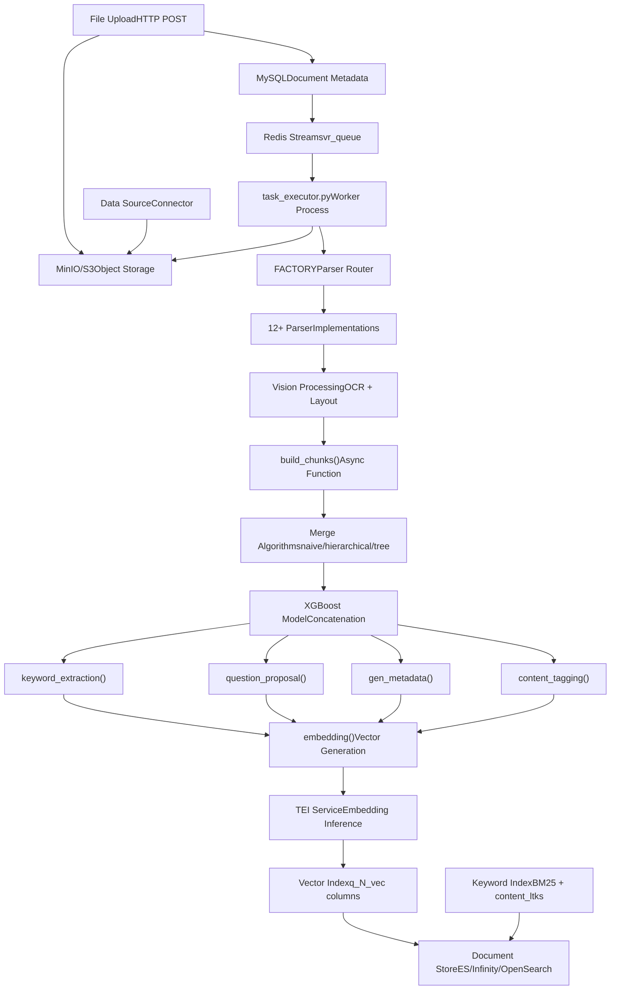
**Sources:** [rag/svr/task\_executor.py1-1500](https://github.com/infiniflow/ragflow/blob/80a16e71/rag/svr/task_executor.py#L1-L1500)

### Key Components

| Component | Location | Purpose |
| --- | --- | --- |
| `task_executor.py` | [rag/svr/task\_executor.py](https://github.com/infiniflow/ragflow/blob/80a16e71/rag/svr/task_executor.py) | Main async worker process that orchestrates document processing |
| `FACTORY` | [rag/svr/task\_executor.py83-100](https://github.com/infiniflow/ragflow/blob/80a16e71/rag/svr/task_executor.py#L83-L100) | Parser selection dictionary mapping parser\_id to implementation |
| `build_chunks()` | [rag/svr/task\_executor.py242-514](https://github.com/infiniflow/ragflow/blob/80a16e71/rag/svr/task_executor.py#L242-L514) | Core chunking function with timeout and limiter controls |
| `embedding()` | [rag/svr/task\_executor.py569-620](https://github.com/infiniflow/ragflow/blob/80a16e71/rag/svr/task_executor.py#L569-L620) | Vector embedding generation with TEI service |
| `insert_chunks()` | [rag/svr/task\_executor.py870-979](https://github.com/infiniflow/ragflow/blob/80a16e71/rag/svr/task_executor.py#L870-L979) | Bulk insertion into document store with retry logic |

**Sources:** [rag/svr/task\_executor.py1-1500](https://github.com/infiniflow/ragflow/blob/80a16e71/rag/svr/task_executor.py#L1-L1500)

---

## Document Ingestion

Documents enter the pipeline through two primary paths: direct HTTP upload and automated data source connectors.

### Upload Flow

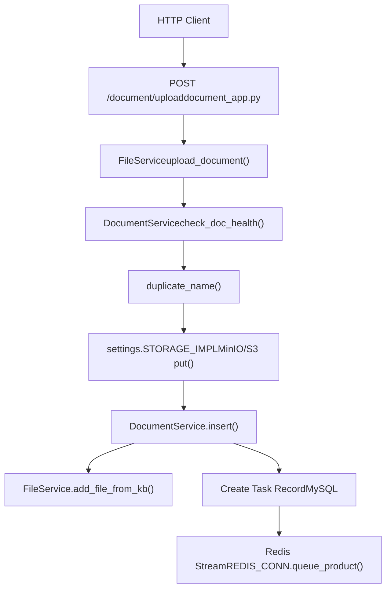
The upload endpoint validates file size, name length, and tenant quotas before storing the binary in object storage and creating metadata records.

**Key validation checks:**

-   File size: `task["size"] > settings.DOC_MAXIMUM_SIZE` check at [rag/svr/task\_executor.py243-245](https://github.com/infiniflow/ragflow/blob/80a16e71/rag/svr/task_executor.py#L243-L245)
-   File name length: `FILE_NAME_LEN_LIMIT` validation at [api/apps/document\_app.py78-80](https://github.com/infiniflow/ragflow/blob/80a16e71/api/apps/document_app.py#L78-L80)
-   Tenant document count: `MAX_FILE_NUM_PER_USER` check at [api/db/services/document\_service.py120-121](https://github.com/infiniflow/ragflow/blob/80a16e71/api/db/services/document_service.py#L120-L121)

**Sources:** [api/apps/document\_app.py52-97](https://github.com/infiniflow/ragflow/blob/80a16e71/api/apps/document_app.py#L52-L97) [api/db/services/file\_service.py270-425](https://github.com/infiniflow/ragflow/blob/80a16e71/api/db/services/file_service.py#L270-L425) [api/db/services/document\_service.py331-336](https://github.com/infiniflow/ragflow/blob/80a16e71/api/db/services/document_service.py#L331-L336)

### Task Queue Architecture

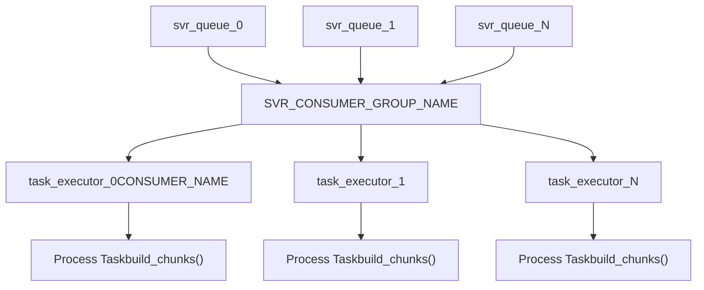
The system uses **Redis Streams** with consumer groups for reliable task distribution. Multiple queues (configured by `settings.get_svr_queue_names()`) distribute load, while consumer groups ensure exactly-once processing with ACK mechanism.

**Concurrency Controls:**

-   `MAX_CONCURRENT_TASKS`: Overall task limiter (default 5) at [rag/svr/task\_executor.py122](https://github.com/infiniflow/ragflow/blob/80a16e71/rag/svr/task_executor.py#L122-L122)
-   `MAX_CONCURRENT_CHUNK_BUILDERS`: Limits simultaneous chunking operations (default 1) at [rag/svr/task\_executor.py123](https://github.com/infiniflow/ragflow/blob/80a16e71/rag/svr/task_executor.py#L123-L123)
-   `MAX_CONCURRENT_MINIO`: Limits MinIO operations (default 10) at [rag/svr/task\_executor.py124](https://github.com/infiniflow/ragflow/blob/80a16e71/rag/svr/task_executor.py#L124-L124)

**Sources:** [rag/svr/task\_executor.py173-234](https://github.com/infiniflow/ragflow/blob/80a16e71/rag/svr/task_executor.py#L173-L234) [rag/utils/redis\_conn.py](https://github.com/infiniflow/ragflow/blob/80a16e71/rag/utils/redis_conn.py) [common/settings.py](https://github.com/infiniflow/ragflow/blob/80a16e71/common/settings.py)

---

## Parsing Strategies

RAGFlow provides 12+ specialized parsing strategies, each optimized for different document types and structures.

### Parser Factory

```mermaid
flowchart TD
    Task["Task from Queueparser_id field"]
    Factory["FACTORY Dictionarytask_executor.py:83-100"]
    Naive["ParserType.NAIVEnaive module"]
    Paper["ParserType.PAPERpaper module"]
    Book["ParserType.BOOKbook module"]
    Presentation["ParserType.PRESENTATIONpresentation module"]
    Manual["ParserType.MANUALmanual module"]
    Laws["ParserType.LAWSlaws module"]
    QA["ParserType.QAqa module"]
    Table["ParserType.TABLEtable module"]
    Resume["ParserType.RESUMEresume module"]
    Picture["ParserType.PICTUREpicture module"]
    One["ParserType.ONEone module"]
    Audio["ParserType.AUDIOaudio module"]
    Email["ParserType.EMAILemail module"]
    KG["ParserType.KGnaive module"]
    Tag["ParserType.TAGtag module"]

    Task --> Factory
    Factory --> Naive
    Factory --> Paper
    Factory --> Book
    Factory --> Presentation
    Factory --> Manual
    Factory --> Laws
    Factory --> QA
    Factory --> Table
    Factory --> Resume
    Factory --> Picture
    Factory --> One
    Factory --> Audio
    Factory --> Email
    Factory --> KG
    Factory --> Tag
```
The `FACTORY` dictionary at [rag/svr/task\_executor.py83-100](https://github.com/infiniflow/ragflow/blob/80a16e71/rag/svr/task_executor.py#L83-L100) maps parser identifiers to their implementations. Each parser is invoked via:

```
chunker = FACTORY[task["parser_id"].lower()]
cks = await thread_pool_exec(
    chunker.chunk,
    task["name"],
    binary=binary,
    from_page=task["from_page"],
    to_page=task["to_page"],
    lang=task["language"],
    callback=progress_callback,
    kb_id=task["kb_id"],
    parser_config=task["parser_config"],
    tenant_id=task["tenant_id"],
)
```
**Sources:** [rag/svr/task\_executor.py83-100](https://github.com/infiniflow/ragflow/blob/80a16e71/rag/svr/task_executor.py#L83-L100) [rag/svr/task\_executor.py248-280](https://github.com/infiniflow/ragflow/blob/80a16e71/rag/svr/task_executor.py#L248-L280)

### Parser Implementation Patterns

Each parser follows a common interface but implements domain-specific logic:

| Parser Type | Primary Use Case | Key Features | Implementation |
| --- | --- | --- | --- |
| **Naive** | General documents | Basic text extraction, hierarchical merge | [rag/app/naive.py](https://github.com/infiniflow/ragflow/blob/80a16e71/rag/app/naive.py) |
| **Paper** | Academic papers | Abstract detection, section recognition, citation handling | [rag/app/paper.py](https://github.com/infiniflow/ragflow/blob/80a16e71/rag/app/paper.py) |
| **Book** | Long-form books | Chapter detection, TOC extraction, hierarchical structure | [rag/app/book.py](https://github.com/infiniflow/ragflow/blob/80a16e71/rag/app/book.py) |
| **Presentation** | PPT/PPTX files | Slide-by-slide processing, speaker notes, image extraction | [rag/app/presentation.py](https://github.com/infiniflow/ragflow/blob/80a16e71/rag/app/presentation.py) |
| **Manual** | Technical manuals | Section numbering, hierarchical bullets, procedure detection | [rag/app/manual.py](https://github.com/infiniflow/ragflow/blob/80a16e71/rag/app/manual.py) |
| **Laws** | Legal documents | Article numbering, clause detection, hierarchical structure | [rag/app/laws.py](https://github.com/infiniflow/ragflow/blob/80a16e71/rag/app/laws.py) |
| **QA** | Q&A documents | Question detection, paired Q&A extraction | [rag/app/qa.py](https://github.com/infiniflow/ragflow/blob/80a16e71/rag/app/qa.py) |
| **Table** | Excel/CSV files | Column type inference, SQL table generation, metadata extraction | [rag/app/table.py](https://github.com/infiniflow/ragflow/blob/80a16e71/rag/app/table.py) |
| **One** | Single-chunk docs | Entire document as one chunk, minimal processing | [rag/app/one.py](https://github.com/infiniflow/ragflow/blob/80a16e71/rag/app/one.py) |
| **Picture** | Image files | Image-to-text via vision models, OCR fallback | [rag/app/picture.py](https://github.com/infiniflow/ragflow/blob/80a16e71/rag/app/picture.py) |
| **Audio** | Audio files | Speech-to-text via ASR models (Whisper, etc.) | [rag/app/audio.py](https://github.com/infiniflow/ragflow/blob/80a16e71/rag/app/audio.py) |
| **Email** | Email files (.eml) | Sender/recipient extraction, thread detection | [rag/app/email.py](https://github.com/infiniflow/ragflow/blob/80a16e71/rag/app/email.py) |

**Sources:** [rag/app/naive.py](https://github.com/infiniflow/ragflow/blob/80a16e71/rag/app/naive.py) [rag/app/paper.py](https://github.com/infiniflow/ragflow/blob/80a16e71/rag/app/paper.py) [rag/app/book.py](https://github.com/infiniflow/ragflow/blob/80a16e71/rag/app/book.py) [rag/app/manual.py](https://github.com/infiniflow/ragflow/blob/80a16e71/rag/app/manual.py) [rag/app/laws.py](https://github.com/infiniflow/ragflow/blob/80a16e71/rag/app/laws.py) [rag/app/qa.py](https://github.com/infiniflow/ragflow/blob/80a16e71/rag/app/qa.py) [rag/app/table.py](https://github.com/infiniflow/ragflow/blob/80a16e71/rag/app/table.py) [rag/app/one.py](https://github.com/infiniflow/ragflow/blob/80a16e71/rag/app/one.py) [rag/app/presentation.py](https://github.com/infiniflow/ragflow/blob/80a16e71/rag/app/presentation.py)

### PDF Parsing Backends

For PDF documents, RAGFlow supports multiple parsing backends configured via `parser_config`:

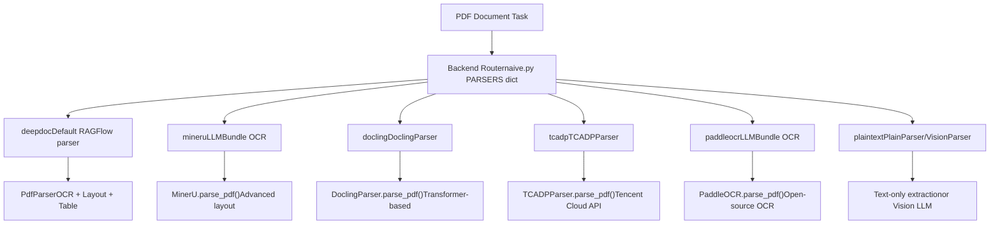
The `PARSERS` dictionary at [rag/app/naive.py221-228](https://github.com/infiniflow/ragflow/blob/80a16e71/rag/app/naive.py#L221-L228) maps backend names to functions:

-   `by_deepdoc`: Uses RAGFlowPdfParser with OCR, layout recognition, and table structure detection
-   `by_mineru`: Integrates MinerU via LLMBundle for advanced layout understanding
-   `by_docling`: Uses IBM Docling for transformer-based parsing
-   `by_tcadp`: Calls Tencent Cloud Document Analysis API
-   `by_paddleocr`: Uses PaddleOCR via LLMBundle
-   `by_plaintext`: Text extraction only, optionally with vision LLM for layout understanding

**Sources:** [rag/app/naive.py57-228](https://github.com/infiniflow/ragflow/blob/80a16e71/rag/app/naive.py#L57-L228) [deepdoc/parser/pdf\_parser.py55-579](https://github.com/infiniflow/ragflow/blob/80a16e71/deepdoc/parser/pdf_parser.py#L55-L579)

---

## Chunking Methods

After parsing, documents are split into chunks using intelligent merge algorithms guided by machine learning.

### Chunking Architecture

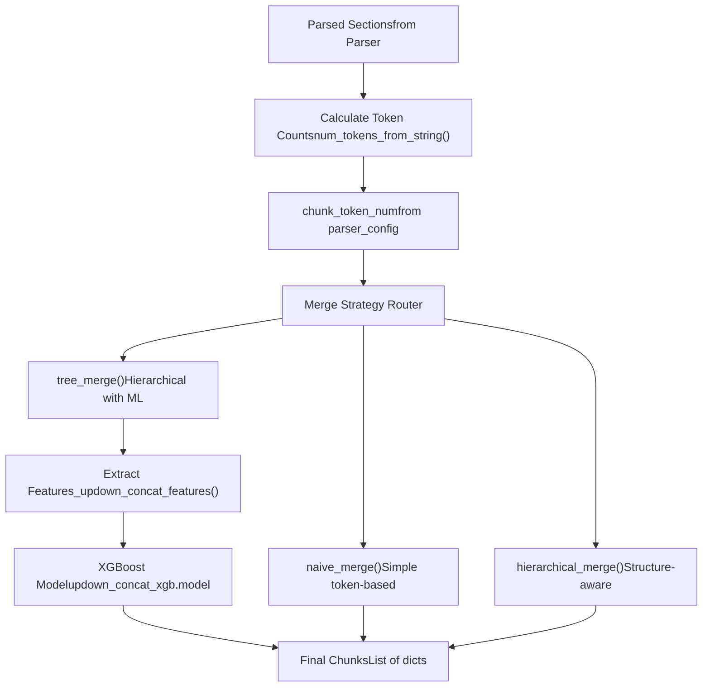
**Sources:** [rag/nlp/\_\_init\_\_.py275-530](https://github.com/infiniflow/ragflow/blob/80a16e71/rag/nlp/__init__.py#L275-L530) [deepdoc/parser/pdf\_parser.py91-105](https://github.com/infiniflow/ragflow/blob/80a16e71/deepdoc/parser/pdf_parser.py#L91-L105)

### Merge Algorithms

#### 1\. Naive Merge

Simple concatenation based on token count thresholds:

```
def naive_merge(sections, chunk_token_num, delimeter="\n"):
    chunks = []
    current_chunk = ""
    for section in sections:
        if num_tokens_from_string(current_chunk + section) <= chunk_token_num:
            current_chunk += delimeter + section
        else:
            chunks.append(current_chunk)
            current_chunk = section
    if current_chunk:
        chunks.append(current_chunk)
    return chunks
```
**Sources:** [rag/nlp/\_\_init\_\_.py275-295](https://github.com/infiniflow/ragflow/blob/80a16e71/rag/nlp/__init__.py#L275-L295)

#### 2\. Hierarchical Merge

Respects document structure (bullets, headers, sections) during merging. Uses `BULLET_PATTERN` and `bullets_category()` to detect hierarchical levels.

**Key functions:**

-   `bullets_category()`: Determines bullet type (numbered, lettered, markdown headers) at [rag/nlp/\_\_init\_\_.py216-233](https://github.com/infiniflow/ragflow/blob/80a16e71/rag/nlp/__init__.py#L216-L233)
-   `hierarchical_merge()`: Merges while preserving hierarchy at [rag/nlp/\_\_init\_\_.py296-420](https://github.com/infiniflow/ragflow/blob/80a16e71/rag/nlp/__init__.py#L296-L420)

**Sources:** [rag/nlp/\_\_init\_\_.py169-233](https://github.com/infiniflow/ragflow/blob/80a16e71/rag/nlp/__init__.py#L169-L233) [rag/nlp/\_\_init\_\_.py296-420](https://github.com/infiniflow/ragflow/blob/80a16e71/rag/nlp/__init__.py#L296-L420)

#### 3\. Tree Merge (XGBoost-guided)

Uses a pre-trained XGBoost model to predict whether adjacent sections should be concatenated. The model evaluates 32 features including:

| Feature Category | Examples |
| --- | --- |
| **Layout** | Same row (`up.get("R") == down.get("R")`), y-distance, page gap |
| **Content Type** | Both text, both tables, layout\_type matching |
| **Text Patterns** | Ends with punctuation, starts with capital, parenthesis matching |
| **Token Overlap** | Shared tokens between boundaries, token count delta |
| **Structural** | Bullet pattern matching, heading detection |

The feature extraction is implemented in `_updown_concat_features()` at [deepdoc/parser/pdf\_parser.py135-178](https://github.com/infiniflow/ragflow/blob/80a16e71/deepdoc/parser/pdf_parser.py#L135-L178)

**Model loading:**

```
self.updown_cnt_mdl = xgb.Booster()
self.updown_cnt_mdl.load_model(os.path.join(model_dir, "updown_concat_xgb.model"))
```
**Sources:** [deepdoc/parser/pdf\_parser.py91-105](https://github.com/infiniflow/ragflow/blob/80a16e71/deepdoc/parser/pdf_parser.py#L91-L105) [deepdoc/parser/pdf\_parser.py135-178](https://github.com/infiniflow/ragflow/blob/80a16e71/deepdoc/parser/pdf_parser.py#L135-L178) [rag/nlp/\_\_init\_\_.py421-530](https://github.com/infiniflow/ragflow/blob/80a16e71/rag/nlp/__init__.py#L421-L530)

### Chunk Structure

Each chunk is a dictionary with the following schema:

```
{
    "content_with_weight": str,        # Raw text content
    "content_ltks": str,               # Tokenized content for BM25
    "content_sm_ltks": str,            # Fine-grained tokens
    "image": Optional[PIL.Image],      # Associated image
    "important_kwd": List[str],        # LLM-generated keywords
    "important_tks": str,              # Tokenized keywords
    "question_kwd": List[str],         # LLM-generated questions
    "question_tks": str,               # Tokenized questions
    "metadata_obj": Optional[dict],    # Structured metadata
    "tag_fld": Optional[dict],         # Tag scores
    "positions": List[List[int]],      # [page, x0, top, x1, bottom]
    "page_num_int": List[int],         # Page numbers
    # ... additional fields
}
```
**Sources:** [rag/svr/task\_executor.py289-514](https://github.com/infiniflow/ragflow/blob/80a16e71/rag/svr/task_executor.py#L289-L514)

---

## Content Enhancement

After initial chunking, the pipeline optionally enhances chunks with LLM-generated metadata.

### Enhancement Pipeline

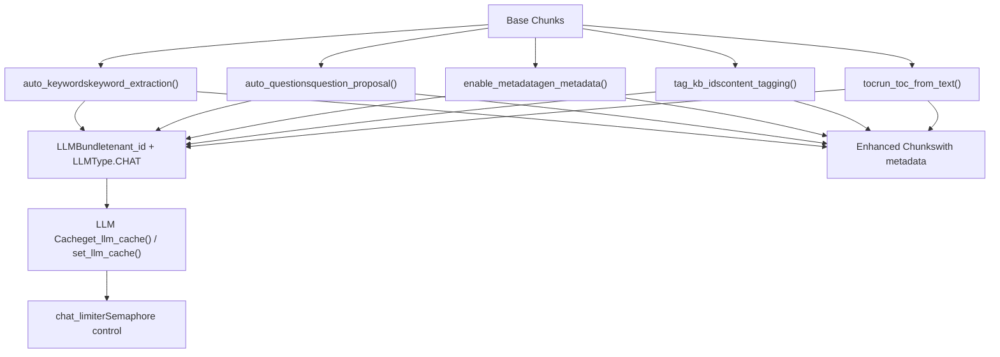
**Sources:** [rag/svr/task\_executor.py339-512](https://github.com/infiniflow/ragflow/blob/80a16e71/rag/svr/task_executor.py#L339-L512)

### Keyword Extraction

When `parser_config["auto_keywords"]` is set (e.g., 5), the system generates keywords for each chunk:

```
async def doc_keyword_extraction(chat_mdl, d, topn):
    cached = get_llm_cache(chat_mdl.llm_name, d["content_with_weight"], "keywords", {"topn": topn})
    if not cached:
        if has_canceled(task["id"]):
            return
        async with chat_limiter:
            cached = await keyword_extraction(chat_mdl, d["content_with_weight"], topn)
        set_llm_cache(chat_mdl.llm_name, d["content_with_weight"], cached, "keywords", {"topn": topn})
    if cached:
        d["important_kwd"] = cached.split(",")
        d["important_tks"] = rag_tokenizer.tokenize(" ".join(d["important_kwd"]))
```
The `keyword_extraction()` prompt is at [rag/prompts/generator.py](https://github.com/infiniflow/ragflow/blob/80a16e71/rag/prompts/generator.py) and uses the configured LLM to extract key terms.

**Sources:** [rag/svr/task\_executor.py339-370](https://github.com/infiniflow/ragflow/blob/80a16e71/rag/svr/task_executor.py#L339-L370) [rag/prompts/generator.py](https://github.com/infiniflow/ragflow/blob/80a16e71/rag/prompts/generator.py)

### Question Generation

When `parser_config["auto_questions"]` is set, the system generates potential questions answered by each chunk:

```
async def doc_question_proposal(chat_mdl, d, topn):
    cached = get_llm_cache(chat_mdl.llm_name, d["content_with_weight"], "question", {"topn": topn})
    if not cached:
        async with chat_limiter:
            cached = await question_proposal(chat_mdl, d["content_with_weight"], topn)
        set_llm_cache(chat_mdl.llm_name, d["content_with_weight"], cached, "question", {"topn": topn})
    if cached:
        d["question_kwd"] = cached.split("\n")
        d["question_tks"] = rag_tokenizer.tokenize("\n".join(d["question_kwd"]))
```
This enables **hypothetical question matching** during retrieval - if a user's query matches a generated question, the corresponding chunk is highly relevant.

**Sources:** [rag/svr/task\_executor.py372-402](https://github.com/infiniflow/ragflow/blob/80a16e71/rag/svr/task_executor.py#L372-L402)

### Metadata Extraction

When `parser_config["enable_metadata"]` is true and `parser_config["metadata"]` defines a schema, the system extracts structured metadata:

```
async def gen_metadata_task(chat_mdl, d):
    cached = get_llm_cache(chat_mdl.llm_name, d["content_with_weight"], "metadata",
                           task["parser_config"]["metadata"])
    if not cached:
        async with chat_limiter:
            cached = await gen_metadata(chat_mdl,
                                        turn2jsonschema(task["parser_config"]["metadata"]),
                                        d["content_with_weight"])
        set_llm_cache(chat_mdl.llm_name, d["content_with_weight"], cached, "metadata",
                      task["parser_config"]["metadata"])
    if cached:
        d["metadata_obj"] = cached
```
Metadata is aggregated across all chunks and stored in `Document.meta_fields` for filtering.

**Sources:** [rag/svr/task\_executor.py404-447](https://github.com/infiniflow/ragflow/blob/80a16e71/rag/svr/task_executor.py#L404-L447) [common/metadata\_utils.py](https://github.com/infiniflow/ragflow/blob/80a16e71/common/metadata_utils.py)

### Content Tagging

When `kb_parser_config["tag_kb_ids"]` is configured, the system tags chunks based on a reference knowledge base:

1.  Retrieve all tags from reference KB: `settings.retriever.all_tags_in_portion(tenant_id, kb_ids, S)`
2.  Attempt fast tagging via vector similarity: `settings.retriever.tag_content()`
3.  For untagged chunks, use LLM with few-shot examples:

```
async def doc_content_tagging(chat_mdl, d, topn_tags):
    cached = get_llm_cache(chat_mdl.llm_name, d["content_with_weight"], all_tags, {"topn": topn_tags})
    if not cached:
        picked_examples = random.choices(examples, k=2)
        async with chat_limiter:
            cached = await content_tagging(
                chat_mdl,
                d["content_with_weight"],
                all_tags,
                picked_examples,
                topn_tags,
            )
        set_llm_cache(chat_mdl.llm_name, d["content_with_weight"], cached, all_tags, {"topn": topn_tags})
    if cached:
        d[TAG_FLD] = json.loads(cached)
```
Tags are stored in the `TAG_FLD` field and used for rank feature scoring during retrieval.

**Sources:** [rag/svr/task\_executor.py449-512](https://github.com/infiniflow/ragflow/blob/80a16e71/rag/svr/task_executor.py#L449-L512) [graphrag/utils.py](https://github.com/infiniflow/ragflow/blob/80a16e71/graphrag/utils.py)

### Table of Contents Generation

For eligible documents, the system can generate a hierarchical table of contents:

```
def build_TOC(task, docs, progress_callback):
    chat_mdl = LLMBundle(task["tenant_id"], LLMType.CHAT, llm_name=task["llm_id"], lang=task["language"])
    docs = sorted(docs, key=lambda d: (d.get("page_num_int", 0), d.get("top_int", 0)))
    toc: list[dict] = asyncio.run(
        run_toc_from_text([d["content_with_weight"] for d in docs], chat_mdl, progress_callback))
```
The TOC is stored as a special chunk with `toc_kwd = "toc"` and `available_int = 0` (excluded from normal retrieval).

**Sources:** [rag/svr/task\_executor.py517-560](https://github.com/infiniflow/ragflow/blob/80a16e71/rag/svr/task_executor.py#L517-L560) [rag/prompts/generator.py](https://github.com/infiniflow/ragflow/blob/80a16e71/rag/prompts/generator.py)

---

## Vision Processing

For documents containing images, tables, or complex layouts, RAGFlow employs a multi-stage vision processing pipeline.

### Vision Processing Architecture

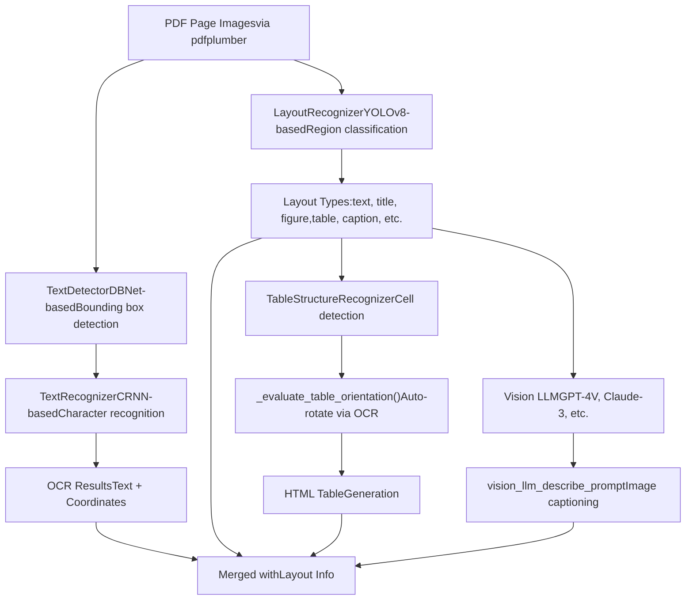
**Sources:** [deepdoc/parser/pdf\_parser.py55-579](https://github.com/infiniflow/ragflow/blob/80a16e71/deepdoc/parser/pdf_parser.py#L55-L579) [deepdoc/vision/ocr.py](https://github.com/infiniflow/ragflow/blob/80a16e71/deepdoc/vision/ocr.py) [deepdoc/vision/layout\_recognizer.py](https://github.com/infiniflow/ragflow/blob/80a16e71/deepdoc/vision/layout_recognizer.py) [deepdoc/vision/recognizer.py](https://github.com/infiniflow/ragflow/blob/80a16e71/deepdoc/vision/recognizer.py)

### OCR Components

#### TextDetector

The `TextDetector` class uses a DBNet-based model to detect text regions in images. It outputs bounding boxes for each detected text region.

**Implementation:** [deepdoc/vision/ocr.py](https://github.com/infiniflow/ragflow/blob/80a16e71/deepdoc/vision/ocr.py)

#### TextRecognizer

The `TextRecognizer` class uses a CRNN architecture to recognize characters within detected bounding boxes. It supports multiple languages configured via the `lang` parameter.

**Implementation:** [deepdoc/vision/recognizer.py](https://github.com/infiniflow/ragflow/blob/80a16e71/deepdoc/vision/recognizer.py)

#### OCR Class

The `OCR` class combines detection and recognition:

```
class OCR:
    def __init__(self):
        self.text_detector = TextDetector()
        self.text_recognizer = TextRecognizer()

    def __call__(self, img_array):
        boxes = self.text_detector(img_array)
        results = []
        for box in boxes:
            text, confidence = self.text_recognizer(img_array, box)
            results.append((box, (text, confidence)))
        return results
```
**Sources:** [deepdoc/vision/ocr.py](https://github.com/infiniflow/ragflow/blob/80a16e71/deepdoc/vision/ocr.py)

### Layout Recognition

The `LayoutRecognizer` class uses YOLOv8 to classify document regions into types:

| Layout Type | Description |
| --- | --- |
| `text` | Body text paragraphs |
| `title` | Section headers and titles |
| `figure` | Images, diagrams, charts |
| `table` | Table regions |
| `caption` | Figure and table captions |
| `footer` | Page footers |
| `header` | Page headers |
| `reference` | Bibliography entries |
| `equation` | Mathematical equations |

The recognizer is initialized in `RAGFlowPdfParser.__init__()`:

```
if layout_recognizer_type == "ascend":
    self.layouter = AscendLayoutRecognizer(recognizer_domain)
else:
    self.layouter = LayoutRecognizer(recognizer_domain)
```
**Sources:** [deepdoc/parser/pdf\_parser.py74-88](https://github.com/infiniflow/ragflow/blob/80a16e71/deepdoc/parser/pdf_parser.py#L74-L88) [deepdoc/vision/layout\_recognizer.py](https://github.com/infiniflow/ragflow/blob/80a16e71/deepdoc/vision/layout_recognizer.py)

### Table Structure Recognition

Table processing involves three stages:

#### 1\. Table Detection

Layout recognition identifies table regions.

#### 2\. Orientation Correction

The `_evaluate_table_orientation()` function tests 4 rotation angles (0°, 90°, 180°, 270°) and uses OCR confidence scores to determine the best orientation:

```
def _evaluate_table_orientation(self, table_img, sample_ratio=0.3):
    rotations = [
        (0, "original"),
        (90, "rotate_90"),
        (180, "rotate_180"),
        (270, "rotate_270"),
    ]

    results = {}
    best_score = -1
    best_angle = 0
    best_img = table_img

    for angle, name in rotations:
        rotated_img = table_img.rotate(-angle, expand=True) if angle else table_img
        ocr_results = self.ocr(np.array(rotated_img))
        scores = [conf for _, (_, conf) in ocr_results]
        avg_score = sum(scores) / len(scores) if scores else 0
        combined_score = avg_score * (1 + 0.1 * min(len(scores), 50) / 50)

        if combined_score > best_score:
            best_score = combined_score
            best_angle = angle
            best_img = rotated_img

    return best_angle, best_img, results
```
**Sources:** [deepdoc/parser/pdf\_parser.py200-276](https://github.com/infiniflow/ragflow/blob/80a16e71/deepdoc/parser/pdf_parser.py#L200-L276)

#### 3\. Cell Structure Detection

The `TableStructureRecognizer` (via `self.tbl_det`) detects individual cells and their relationships. The pipeline then matches OCR text to cells and generates HTML:

```
def _table_transformer_job(self, ZM, auto_rotate=True):
    # Collect table images
    for p, tbls in enumerate(self.page_layout):
        for tb in tbls:
            if tb["type"] == "table":
                # Extract table region
                table_img = self.page_images[p].crop((left, top, right, bott))

                # Optionally correct orientation
                if auto_rotate:
                    best_angle, table_img, _ = self._evaluate_table_orientation(table_img)

                imgs.append(table_img)

    # Batch process with TableStructureRecognizer
    tables = self.tbl_det(imgs)

    # Generate HTML for each table
    for table_data in tables:
        html = self._generate_table_html(table_data)
```
**Sources:** [deepdoc/parser/pdf\_parser.py278-469](https://github.com/infiniflow/ragflow/blob/80a16e71/deepdoc/parser/pdf_parser.py#L278-L469)

### Figure Description via Vision LLM

For figures and images, RAGFlow can use vision-capable LLMs to generate descriptions:

```
def vision_figure_parser_pdf_wrapper(tbls, sections, callback, **kwargs):
    vision_model_name = kwargs.get("parser_config", {}).get("layout_recognizer", "")
    if not vision_model_name or vision_model_name == "Plain Text":
        return tbls

    tenant_id = kwargs.get("tenant_id")
    vision_model = LLMBundle(
        tenant_id,
        LLMType.IMAGE2TEXT,
        llm_name=vision_model_name,
        lang=kwargs.get("lang", "Chinese"),
    )

    for tb in tbls:
        if tb.get("type") == "figure":
            prompt = vision_llm_describe_prompt()
            description = vision_model.describe_image(tb["image"], prompt)
            tb["text"] = description
```
**Sources:** [deepdoc/parser/figure\_parser.py](https://github.com/infiniflow/ragflow/blob/80a16e71/deepdoc/parser/figure_parser.py) [rag/prompts/generator.py](https://github.com/infiniflow/ragflow/blob/80a16e71/rag/prompts/generator.py)

---

## Embedding and Indexing

After chunking and enhancement, chunks are embedded and indexed into the document store.

### Embedding Generation

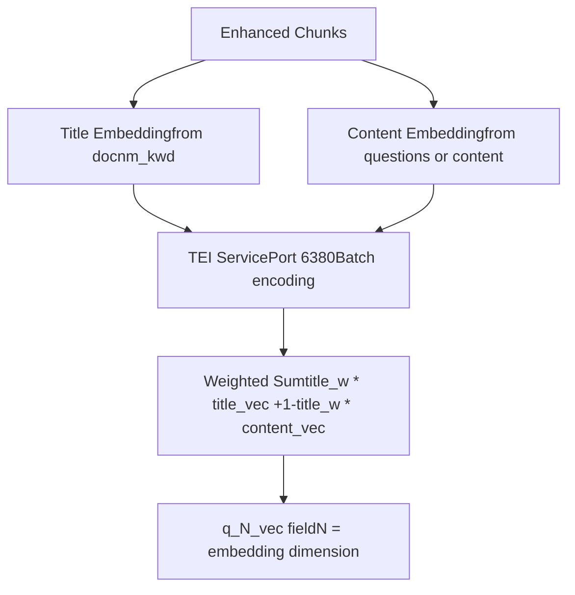
The `embedding()` function at [rag/svr/task\_executor.py569-620](https://github.com/infiniflow/ragflow/blob/80a16e71/rag/svr/task_executor.py#L569-L620) generates vectors:

```
async def embedding(docs, mdl, parser_config=None, callback=None):
    tts, cnts = [], []
    for d in docs:
        tts.append(d.get("docnm_kwd", "Title"))
        c = "\n".join(d.get("question_kwd", []))
        if not c:
            c = d["content_with_weight"]
        cnts.append(c)

    # Title embedding (reused for all chunks)
    vts, c = await thread_pool_exec(mdl.encode, tts[0:1])
    tts = np.tile(vts[0], (len(cnts), 1))

    # Content embeddings (batched)
    cnts_ = np.array([])
    for i in range(0, len(cnts), settings.EMBEDDING_BATCH_SIZE):
        async with embed_limiter:
            vts, c = await thread_pool_exec(batch_encode, cnts[i: i + settings.EMBEDDING_BATCH_SIZE])
        cnts_ = np.concatenate((cnts_, vts), axis=0) if len(cnts_) else vts

    # Weighted combination
    filename_embd_weight = parser_config.get("filename_embd_weight", 0.1)
    title_w = float(filename_embd_weight)
    vects = title_w * tts + (1 - title_w) * cnts_

    for i, d in enumerate(docs):
        v = vects[i].tolist()
        d["q_%d_vec" % len(v)] = v
```
**Key points:**

-   **Title embedding is reused** for all chunks from the same document (efficiency optimization)
-   **Content embedding** prioritizes generated questions if available, otherwise uses raw content
-   **Batching** via `settings.EMBEDDING_BATCH_SIZE` (typically 32)
-   **Semaphore control** via `embed_limiter` prevents overwhelming the TEI service
-   **Vector column naming**: `q_768_vec` for 768-dimensional embeddings, etc.

**Sources:** [rag/svr/task\_executor.py569-620](https://github.com/infiniflow/ragflow/blob/80a16e71/rag/svr/task_executor.py#L569-L620)

### Tokenization for BM25

Alongside vector embeddings, chunks are tokenized for keyword search:

```
def tokenize(d, txt, eng):
    d["content_with_weight"] = txt
    t = re.sub(r"</?(table|td|caption|tr|th)( [^<>]{0,12})?>", " ", txt)
    d["content_ltks"] = rag_tokenizer.tokenize(t)
    d["content_sm_ltks"] = rag_tokenizer.fine_grained_tokenize(d["content_ltks"])
```
-   `content_ltks`: Standard tokenization for BM25 matching
-   `content_sm_ltks`: Fine-grained tokenization for better recall on short queries

**Sources:** [rag/nlp/\_\_init\_\_.py268-273](https://github.com/infiniflow/ragflow/blob/80a16e71/rag/nlp/__init__.py#L268-L273)

### Document Store Indexing

The `insert_chunks()` function performs bulk insertion:

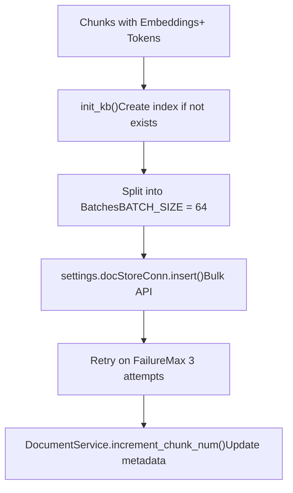
**Index schema** (varies by document engine):

For **Elasticsearch**:

-   Index name: `ragflow_{tenant_id}`
-   KB ID filtering via `kb_id` field
-   Vector field: `q_{N}_vec` (dense\_vector type)
-   Keyword fields: `content_ltks` (text), `content_sm_ltks` (text)

For **Infinity**:

-   Table name: `ragflow_{tenant_id}_{kb_id}` (one table per KB)
-   Vector column: `q_{N}_vec` (vector type)
-   Keyword column: `content_ltks` (varchar with BM25 index)

**Bulk insertion logic:**

```
async def insert_chunks(task_id, task_tenant_id, task_dataset_id, chunks, progress_callback):
    # Initialize index/table
    vector_size = len(chunks[0]["q_%d_vec" % vector_size])
    init_kb(task, vector_size)

    # Batch insert
    for i in range(0, len(chunks), BATCH_SIZE):
        batch = chunks[i:i + BATCH_SIZE]
        retry_times = 0
        while retry_times < 3:
            try:
                settings.docStoreConn.insert(
                    batch,
                    search.index_name(task_tenant_id),
                    task_dataset_id
                )
                break
            except Exception as e:
                retry_times += 1
                if retry_times >= 3:
                    raise

    # Update document metadata
    DocumentService.increment_chunk_num(
        task["doc_id"],
        task_dataset_id,
        embedding_token_consumption,
        len(chunks),
        task_time_cost
    )
```
**Sources:** [rag/svr/task\_executor.py870-979](https://github.com/infiniflow/ragflow/blob/80a16e71/rag/svr/task_executor.py#L870-L979) [common/doc\_store/elasticsearch\_conn.py](https://github.com/infiniflow/ragflow/blob/80a16e71/common/doc_store/elasticsearch_conn.py) [common/doc\_store/infinity\_conn.py](https://github.com/infiniflow/ragflow/blob/80a16e71/common/doc_store/infinity_conn.py)

---

## Advanced Processing: RAPTOR and Knowledge Graph

Beyond basic chunking, RAGFlow supports advanced processing methods.

### RAPTOR Hierarchical Summarization

RAPTOR (Recursive Abstractive Processing for Tree-Organized Retrieval) creates multi-level summaries:

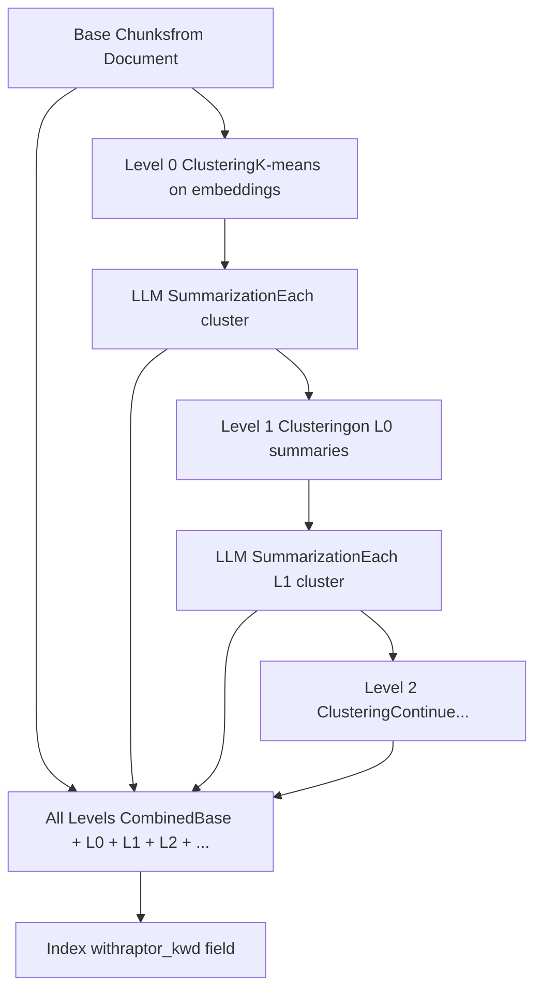
The `run_raptor_for_kb()` function at [rag/svr/task\_executor.py764-858](https://github.com/infiniflow/ragflow/blob/80a16e71/rag/svr/task_executor.py#L764-L858) orchestrates this:

```
async def run_raptor_for_kb(row, kb_parser_config, chat_mdl, embd_mdl, vector_size, callback=None, doc_ids=[]):
    raptor_config = kb_parser_config.get("raptor", {})
    vctr_nm = "q_%d_vec" % vector_size

    # Fetch base chunks
    chunks = []
    for doc_id in doc_ids:
        for d in settings.retriever.chunk_list(doc_id, row["tenant_id"], [str(row["kb_id"])],
                                               fields=["content_with_weight", vctr_nm],
                                               sort_by_position=True):
            chunks.append((d["content_with_weight"], np.array(d[vctr_nm])))

    # Apply RAPTOR
    raptor = Raptor(
        raptor_config.get("max_cluster", 64),
        chat_mdl,
        embd_mdl,
        raptor_config["prompt"],
        raptor_config["max_token"],
        raptor_config["threshold"],
        max_errors=max_errors,
    )
    chunks = await raptor(chunks, kb_parser_config["raptor"]["random_seed"], callback, row["id"])

    # Store summary chunks
    for content, vctr in chunks[original_length:]:
        d = {
            "id": xxhash.xxh64((content + str(fake_doc_id)).encode("utf-8")).hexdigest(),
            "doc_id": doc_id,
            "kb_id": [str(row["kb_id"])],
            "raptor_kwd": "raptor",
            vctr_nm: vctr.tolist(),
            "content_with_weight": content,
            # ... tokenization ...
        }
        res.append(d)
```
RAPTOR chunks are marked with `raptor_kwd = "raptor"` and can be filtered during retrieval.

**Sources:** [rag/svr/task\_executor.py764-858](https://github.com/infiniflow/ragflow/blob/80a16e71/rag/svr/task_executor.py#L764-L858) [rag/raptor.py](https://github.com/infiniflow/ragflow/blob/80a16e71/rag/raptor.py)

### Knowledge Graph Construction

The `run_graphrag_for_kb()` function extracts entities and relationships:

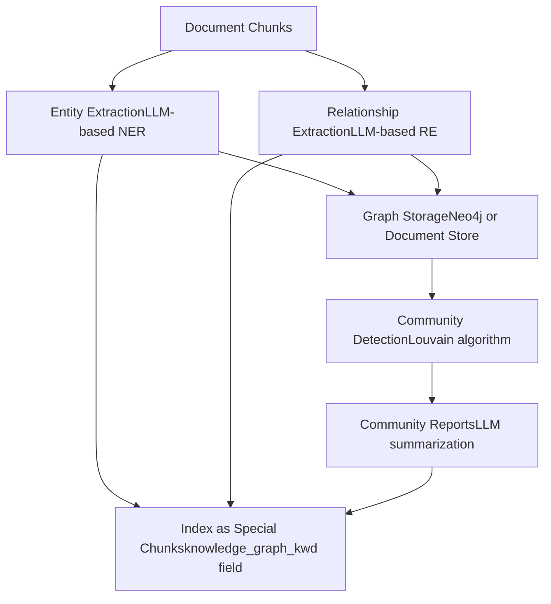
Graph elements are stored with:

-   `knowledge_graph_kwd = ["entity"]` for entity chunks
-   `knowledge_graph_kwd = ["relation"]` for relationship chunks
-   `knowledge_graph_kwd = ["graph"]` for graph metadata
-   `knowledge_graph_kwd = ["community_report"]` for community summaries

**Sources:** [graphrag/general/index.py](https://github.com/infiniflow/ragflow/blob/80a16e71/graphrag/general/index.py) [rag/svr/task\_executor.py](https://github.com/infiniflow/ragflow/blob/80a16e71/rag/svr/task_executor.py)

---

## Task Execution System

The async task execution system is the backbone of document processing.

### Worker Process Architecture

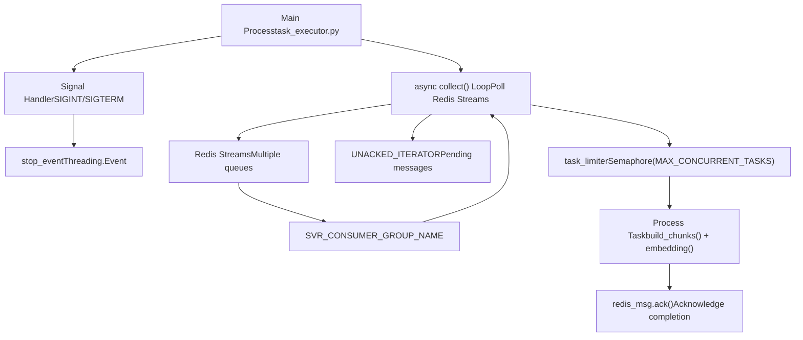
**Key functions:**

#### collect()

Fetches tasks from Redis:

```
async def collect():
    global UNACKED_ITERATOR
    svr_queue_names = settings.get_svr_queue_names()
    redis_msg = None

    # First check unacked messages
    if not UNACKED_ITERATOR:
        UNACKED_ITERATOR = REDIS_CONN.get_unacked_iterator(svr_queue_names, SVR_CONSUMER_GROUP_NAME, CONSUMER_NAME)
    try:
        redis_msg = next(UNACKED_ITERATOR)
    except StopIteration:
        # Then poll for new messages
        for svr_queue_name in svr_queue_names:
            redis_msg = REDIS_CONN.queue_consumer(svr_queue_name, SVR_CONSUMER_GROUP_NAME, CONSUMER_NAME)
            if redis_msg:
                break

    if not redis_msg:
        return None, None

    msg = redis_msg.get_message()
    task = TaskService.get_task(msg["id"])

    return redis_msg, task
```
**Sources:** [rag/svr/task\_executor.py173-234](https://github.com/infiniflow/ragflow/blob/80a16e71/rag/svr/task_executor.py#L173-L234)

#### Main execution loop

```
async def main():
    while not stop_event.is_set():
        redis_msg, task = await collect()
        if not task:
            await asyncio.sleep(1)
            continue

        async with task_limiter:
            try:
                await process_task(task)
                redis_msg.ack()
            except TaskCanceledException:
                redis_msg.ack()
            except Exception as e:
                logging.error(f"Task {task['id']} failed: {e}")
                redis_msg.ack()  # ACK even on failure to avoid infinite retries
```
**Sources:** [rag/svr/task\_executor.py1300-1500](https://github.com/infiniflow/ragflow/blob/80a16e71/rag/svr/task_executor.py#L1300-L1500)

### Progress Tracking

The `set_progress()` function updates task status in MySQL:

```
def set_progress(task_id, from_page=0, to_page=-1, prog=None, msg="Processing..."):
    cancel = has_canceled(task_id)

    if cancel:
        msg += " [Canceled]"
        prog = -1

    if to_page > 0 and msg:
        if from_page < to_page:
            msg = f"Page({from_page + 1}~{to_page + 1}): " + msg

    msg = datetime.now().strftime("%H:%M:%S") + " " + msg

    d = {"progress_msg": msg}
    if prog is not None:
        d["progress"] = prog

    TaskService.update_progress(task_id, d)

    if cancel:
        raise TaskCanceledException(msg)
```
Progress values:

-   `0.0 - 1.0`: Normal progress
-   `-1`: Error
-   `1.0`: Complete

**Sources:** [rag/svr/task\_executor.py141-170](https://github.com/infiniflow/ragflow/blob/80a16e71/rag/svr/task_executor.py#L141-L170)

### Cancellation Handling

Tasks can be canceled via the `has_canceled()` check:

```
def has_canceled(task_id):
    return REDIS_CONN.get(f"task_cancel_{task_id}") is not None
```
When detected, a `TaskCanceledException` is raised, which triggers cleanup and ACK.

**Sources:** [api/db/services/task\_service.py](https://github.com/infiniflow/ragflow/blob/80a16e71/api/db/services/task_service.py) [common/exceptions.py](https://github.com/infiniflow/ragflow/blob/80a16e71/common/exceptions.py)

### Timeout Handling

Critical functions are wrapped with `@timeout()` decorators:

```
@timeout(60 * 80, 1)  # 80 minutes timeout, group 1
async def build_chunks(task, progress_callback):
    # ... chunking logic ...

@timeout(3600)  # 1 hour timeout
async def run_raptor_for_kb(row, kb_parser_config, ...):
    # ... RAPTOR logic ...

@timeout(60)  # 1 minute timeout
async def upload_to_minio(document, chunk):
    # ... MinIO upload ...
```
Timeouts prevent infinite hangs on problematic documents or network issues.

**Sources:** [common/connection\_utils.py](https://github.com/infiniflow/ragflow/blob/80a16e71/common/connection_utils.py) [rag/svr/task\_executor.py241-514](https://github.com/infiniflow/ragflow/blob/80a16e71/rag/svr/task_executor.py#L241-L514)

---

## Configuration

The document processing pipeline is highly configurable via `parser_config` and `kb_parser_config`.

### Parser Configuration Schema

```
{
    # Chunking parameters
    "chunk_token_num": int,              # Target tokens per chunk (default: 128)
    "delimiter": str,                     # Chunk delimiter (default: "\n!?。；！？")
    "layout_recognize": bool,             # Enable layout recognition (default: True)
    "raptor": dict,                       # RAPTOR configuration

    # Enhancement flags
    "auto_keywords": int,                 # Number of keywords to generate (0 = disabled)
    "auto_questions": int,                # Number of questions to generate (0 = disabled)
    "enable_metadata": bool,              # Enable metadata extraction
    "metadata": list,                     # Metadata schema

    # Embedding parameters
    "filename_embd_weight": float,        # Title embedding weight (default: 0.1)

    # Vision processing
    "layout_recognizer": str,             # Vision model name or "Plain Text"

    # PDF-specific
    "pdf_parser": str,                    # "deepdoc", "mineru", "docling", etc.
    "mineru_llm_name": str,              # MinerU model name
    "paddleocr_llm_name": str,           # PaddleOCR model name

    # Table-specific
    "auto_rotate_tables": bool,           # Enable table orientation correction
    "separate_tables_figures": bool,      # Separate tables/figures from text
}
```
**Sources:** [api/utils/api\_utils.py](https://github.com/infiniflow/ragflow/blob/80a16e71/api/utils/api_utils.py) [common/parser\_config\_utils.py](https://github.com/infiniflow/ragflow/blob/80a16e71/common/parser_config_utils.py)

### KB-Level Configuration

```
{
    # Advanced processing
    "raptor": {
        "max_cluster": int,               # Maximum cluster size (default: 64)
        "prompt": str,                    # Summarization prompt
        "max_token": int,                 # Max tokens per summary (default: 256)
        "threshold": float,               # Clustering threshold (default: 0.1)
        "random_seed": int,               # Reproducibility seed
        "scope": str,                     # "file" or "dataset"
    },

    "graphrag": {
        # Knowledge graph settings
    },

    "tag_kb_ids": list,                   # Reference KBs for tagging
    "topn_tags": int,                     # Number of tags per chunk (default: 3)

    "toc": bool,                          # Enable TOC generation
    "toc_enhance": bool,                  # Use TOC for retrieval enhancement
}
```
**Sources:** [api/db/services/knowledgebase\_service.py](https://github.com/infiniflow/ragflow/blob/80a16e71/api/db/services/knowledgebase_service.py) [rag/svr/task\_executor.py](https://github.com/infiniflow/ragflow/blob/80a16e71/rag/svr/task_executor.py)

### Environment Variables

| Variable | Default | Purpose |
| --- | --- | --- |
| `MAX_CONCURRENT_TASKS` | 5 | Maximum parallel tasks per worker |
| `MAX_CONCURRENT_CHUNK_BUILDERS` | 1 | Maximum parallel chunking operations |
| `MAX_CONCURRENT_MINIO` | 10 | Maximum parallel MinIO operations |
| `WORKER_HEARTBEAT_TIMEOUT` | 120 | Seconds before worker considered dead |
| `EMBEDDING_BATCH_SIZE` | 32 | Batch size for embedding generation |
| `DOC_MAXIMUM_SIZE` | 128MB | Maximum file size |
| `RAPTOR_MAX_ERRORS` | 3 | Maximum LLM errors before RAPTOR fails |
| `LAYOUT_RECOGNIZER_TYPE` | "onnx" | Layout recognizer backend ("onnx" or "ascend") |
| `PARALLEL_DEVICES` | 1 | Number of parallel vision processing devices |

**Sources:** [rag/svr/task\_executor.py122-130](https://github.com/infiniflow/ragflow/blob/80a16e71/rag/svr/task_executor.py#L122-L130) [common/settings.py](https://github.com/infiniflow/ragflow/blob/80a16e71/common/settings.py) [deepdoc/parser/pdf\_parser.py74](https://github.com/infiniflow/ragflow/blob/80a16e71/deepdoc/parser/pdf_parser.py#L74-L74)

---

## Performance Considerations

### Batching and Parallelism

1.  **Embedding batching**: Groups chunks into batches of `settings.EMBEDDING_BATCH_SIZE` (typically 32) to reduce TEI service calls
2.  **MinIO parallelism**: Uploads images concurrently via `asyncio.gather()` with `minio_limiter` control
3.  **LLM enhancement parallelism**: Keywords, questions, metadata, and tags are generated concurrently for all chunks
4.  **Chunk builder semaphore**: `chunk_limiter` prevents OOM by limiting concurrent parsing operations

**Sources:** [rag/svr/task\_executor.py569-620](https://github.com/infiniflow/ragflow/blob/80a16e71/rag/svr/task_executor.py#L569-L620) [rag/svr/task\_executor.py324-334](https://github.com/infiniflow/ragflow/blob/80a16e71/rag/svr/task_executor.py#L324-L334) [rag/svr/task\_executor.py358-369](https://github.com/infiniflow/ragflow/blob/80a16e71/rag/svr/task_executor.py#L358-L369)

### Caching

LLM enhancement results are cached in Redis using a composite key:

```
cache_key = f"{llm_name}:{content_hash}:{operation}:{params}"
cached = get_llm_cache(chat_mdl.llm_name, d["content_with_weight"], "keywords", {"topn": topn})
if not cached:
    # Call LLM
    cached = await keyword_extraction(chat_mdl, d["content_with_weight"], topn)
    set_llm_cache(chat_mdl.llm_name, d["content_with_weight"], cached, "keywords", {"topn": topn})
```
This prevents redundant LLM calls when re-parsing documents.

**Sources:** [graphrag/utils.py](https://github.com/infiniflow/ragflow/blob/80a16e71/graphrag/utils.py) [rag/svr/task\_executor.py345-352](https://github.com/infiniflow/ragflow/blob/80a16e71/rag/svr/task_executor.py#L345-L352)

### Timeout and Retry

-   **Chunking timeout**: 80 minutes via `@timeout(60 * 80, 1)` at [rag/svr/task\_executor.py241](https://github.com/infiniflow/ragflow/blob/80a16e71/rag/svr/task_executor.py#L241-L241)
-   **MinIO timeout**: 60 seconds per operation via `@timeout(60)` at [rag/svr/task\_executor.py298](https://github.com/infiniflow/ragflow/blob/80a16e71/rag/svr/task_executor.py#L298-L298)
-   **Indexing retry**: Up to 3 attempts with exponential backoff at [rag/svr/task\_executor.py900-930](https://github.com/infiniflow/ragflow/blob/80a16e71/rag/svr/task_executor.py#L900-L930)

**Sources:** [rag/svr/task\_executor.py241-514](https://github.com/infiniflow/ragflow/blob/80a16e71/rag/svr/task_executor.py#L241-L514) [rag/svr/task\_executor.py870-979](https://github.com/infiniflow/ragflow/blob/80a16e71/rag/svr/task_executor.py#L870-L979)

---

## Error Handling

### Error Propagation

Errors are captured and stored in task progress:

```
try:
    chunks = await build_chunks(task, progress_callback)
except TaskCanceledException:
    # User-initiated cancellation
    redis_msg.ack()
    return
except TimeoutError:
    progress_callback(-1, "Internal server error: Operation timeout.")
    raise
except Exception as e:
    progress_callback(-1, f"Internal server error: {str(e)}")
    raise
```
Progress values of `-1` indicate errors, and the `progress_msg` contains details.

**Sources:** [rag/svr/task\_executor.py242-287](https://github.com/infiniflow/ragflow/blob/80a16e71/rag/svr/task_executor.py#L242-L287)

### Retry Logic

Task retry is handled at the database level via `Task.retry_count`. The `get_task()` function at [api/db/services/task\_service.py75-150](https://github.com/infiniflow/ragflow/blob/80a16e71/api/db/services/task_service.py#L75-L150) checks:

```
if task.retry_count >= 3:
    return None  # Max retries exceeded
```
**Sources:** [api/db/services/task\_service.py75-150](https://github.com/infiniflow/ragflow/blob/80a16e71/api/db/services/task_service.py#L75-L150)

### Graceful Degradation

When advanced features fail, the pipeline falls back gracefully:

-   **Vision model unavailable**: Falls back to raw text extraction via `by_plaintext` parser
-   **LLM enhancement fails**: Chunk is indexed without enhancement
-   **Embedding fails**: Task is marked as error, but database state remains consistent
-   **Partial document success**: Chunks already indexed are preserved even if later pages fail

**Sources:** [rag/app/naive.py57-228](https://github.com/infiniflow/ragflow/blob/80a16e71/rag/app/naive.py#L57-L228) [rag/svr/task\_executor.py242-514](https://github.com/infiniflow/ragflow/blob/80a16e71/rag/svr/task_executor.py#L242-L514)
