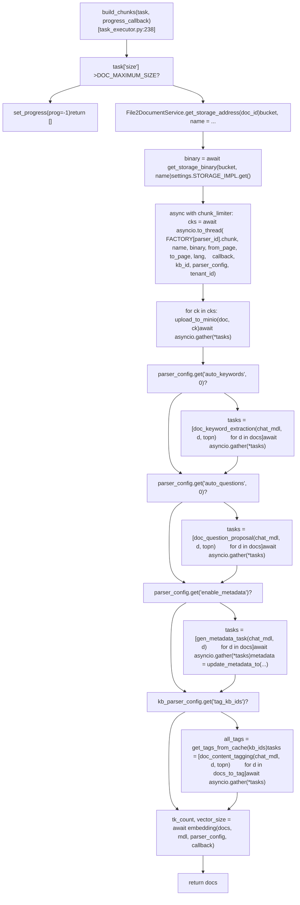
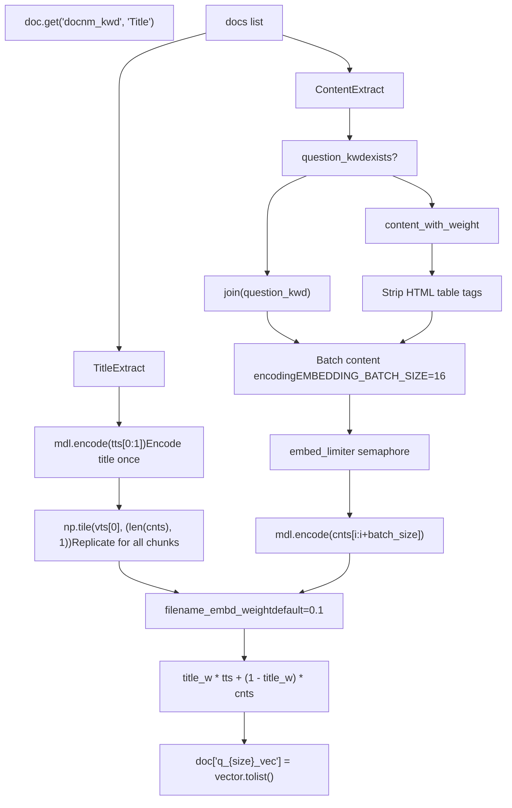

# Content Enhancement and Embedding

Relevant source files

-   [api/apps/chunk\_app.py](https://github.com/infiniflow/ragflow/blob/80a16e71/api/apps/chunk_app.py)
-   [api/apps/conversation\_app.py](https://github.com/infiniflow/ragflow/blob/80a16e71/api/apps/conversation_app.py)
-   [api/apps/document\_app.py](https://github.com/infiniflow/ragflow/blob/80a16e71/api/apps/document_app.py)
-   [api/apps/file2document\_app.py](https://github.com/infiniflow/ragflow/blob/80a16e71/api/apps/file2document_app.py)
-   [api/apps/file\_app.py](https://github.com/infiniflow/ragflow/blob/80a16e71/api/apps/file_app.py)
-   [api/apps/kb\_app.py](https://github.com/infiniflow/ragflow/blob/80a16e71/api/apps/kb_app.py)
-   [api/db/db\_models.py](https://github.com/infiniflow/ragflow/blob/80a16e71/api/db/db_models.py)
-   [api/db/services/dialog\_service.py](https://github.com/infiniflow/ragflow/blob/80a16e71/api/db/services/dialog_service.py)
-   [api/db/services/document\_service.py](https://github.com/infiniflow/ragflow/blob/80a16e71/api/db/services/document_service.py)
-   [api/db/services/file\_service.py](https://github.com/infiniflow/ragflow/blob/80a16e71/api/db/services/file_service.py)
-   [api/db/services/knowledgebase\_service.py](https://github.com/infiniflow/ragflow/blob/80a16e71/api/db/services/knowledgebase_service.py)
-   [api/db/services/task\_service.py](https://github.com/infiniflow/ragflow/blob/80a16e71/api/db/services/task_service.py)
-   [deepdoc/parser/excel\_parser.py](https://github.com/infiniflow/ragflow/blob/80a16e71/deepdoc/parser/excel_parser.py)
-   [rag/app/book.py](https://github.com/infiniflow/ragflow/blob/80a16e71/rag/app/book.py)
-   [rag/app/laws.py](https://github.com/infiniflow/ragflow/blob/80a16e71/rag/app/laws.py)
-   [rag/app/manual.py](https://github.com/infiniflow/ragflow/blob/80a16e71/rag/app/manual.py)
-   [rag/app/naive.py](https://github.com/infiniflow/ragflow/blob/80a16e71/rag/app/naive.py)
-   [rag/app/one.py](https://github.com/infiniflow/ragflow/blob/80a16e71/rag/app/one.py)
-   [rag/app/paper.py](https://github.com/infiniflow/ragflow/blob/80a16e71/rag/app/paper.py)
-   [rag/app/presentation.py](https://github.com/infiniflow/ragflow/blob/80a16e71/rag/app/presentation.py)
-   [rag/app/qa.py](https://github.com/infiniflow/ragflow/blob/80a16e71/rag/app/qa.py)
-   [rag/app/table.py](https://github.com/infiniflow/ragflow/blob/80a16e71/rag/app/table.py)
-   [rag/nlp/\_\_init\_\_.py](https://github.com/infiniflow/ragflow/blob/80a16e71/rag/nlp/__init__.py)
-   [rag/nlp/search.py](https://github.com/infiniflow/ragflow/blob/80a16e71/rag/nlp/search.py)
-   [rag/svr/task\_executor.py](https://github.com/infiniflow/ragflow/blob/80a16e71/rag/svr/task_executor.py)

## Overview

Content enhancement and embedding is the third phase of document processing, occurring after file parsing (6.1) and chunking (6.2). The `build_chunks` function in [rag/svr/task\_executor.py238-510](https://github.com/infiniflow/ragflow/blob/80a16e71/rag/svr/task_executor.py#L238-L510) coordinates this phase by:

1.  **Fetching document binary** from MinIO storage via `File2DocumentService.get_storage_address()` and `settings.STORAGE_IMPL.get()`
2.  **Invoking the parser** from `FACTORY[parser_id]` to produce initial chunks
3.  **Uploading chunk images** to MinIO in parallel using `image2id()` helper
4.  **Applying LLM enhancements** (keywords, questions, metadata, tags) based on configuration
5.  **Generating embeddings** for all chunks using the knowledge base's embedding model
6.  **Inserting results** into the document store via `insert_es()`

Enhancement operations are controlled by two configuration dictionaries:

-   `parser_config` - Document-level settings stored in `Document.parser_config`
-   `kb_parser_config` - Knowledge base-level settings stored in `Knowledgebase.parser_config`

Each enhancement feature uses an LLM accessed through `LLMBundle(tenant_id, LLMType.CHAT, llm_name)` with Redis-based caching via `get_llm_cache()` and `set_llm_cache()` from [graphrag/utils.py40-68](https://github.com/infiniflow/ragflow/blob/80a16e71/graphrag/utils.py#L40-L68) The `chat_limiter` semaphore controls concurrent LLM requests across all enhancements.

Enhanced fields enable sophisticated retrieval:

-   `important_tks` receives 5× weight in hybrid search scoring
-   `question_tks` receives 6× weight for FAQ-style matching
-   Vector embeddings in `q_{dim}_vec` enable semantic similarity search
-   Tags in `tag_fea` boost relevance for matching topics

Sources: [rag/svr/task\_executor.py238-510](https://github.com/infiniflow/ragflow/blob/80a16e71/rag/svr/task_executor.py#L238-L510) [graphrag/utils.py40-68](https://github.com/infiniflow/ragflow/blob/80a16e71/graphrag/utils.py#L40-L68) [rag/nlp/search.py295-355](https://github.com/infiniflow/ragflow/blob/80a16e71/rag/nlp/search.py#L295-L355)

---

## Enhancement Features

The `build_chunks` function implements five enhancement features:

| Feature | Configuration Key | Implementation Function | Output Fields | Line Reference |
| --- | --- | --- | --- | --- |
| Keyword Extraction | `parser_config["auto_keywords"]` | `keyword_extraction()` from [rag/prompts/generator.py38](https://github.com/infiniflow/ragflow/blob/80a16e71/rag/prompts/generator.py#L38-L38) | `important_kwd`, `important_tks` | [rag/svr/task\_executor.py327-358](https://github.com/infiniflow/ragflow/blob/80a16e71/rag/svr/task_executor.py#L327-L358) |
| Question Generation | `parser_config["auto_questions"]` | `question_proposal()` from [rag/prompts/generator.py38](https://github.com/infiniflow/ragflow/blob/80a16e71/rag/prompts/generator.py#L38-L38) | `question_kwd`, `question_tks` | [rag/svr/task\_executor.py360-390](https://github.com/infiniflow/ragflow/blob/80a16e71/rag/svr/task_executor.py#L360-L390) |
| Metadata Extraction | `parser_config["enable_metadata"]` | `gen_metadata()` from [rag/prompts/generator.py39](https://github.com/infiniflow/ragflow/blob/80a16e71/rag/prompts/generator.py#L39-L39) | `metadata_obj`, document `meta_fields` | [rag/svr/task\_executor.py392-435](https://github.com/infiniflow/ragflow/blob/80a16e71/rag/svr/task_executor.py#L392-L435) |
| Content Tagging | `kb_parser_config["tag_kb_ids"]` | `content_tagging()` from [rag/prompts/generator.py38](https://github.com/infiniflow/ragflow/blob/80a16e71/rag/prompts/generator.py#L38-L38) | `tags` (dict) | [rag/svr/task\_executor.py437-500](https://github.com/infiniflow/ragflow/blob/80a16e71/rag/svr/task_executor.py#L437-L500) |
| Embedding Generation | Always enabled | `embedding()` function | `q_{size}_vec` | [rag/svr/task\_executor.py556-607](https://github.com/infiniflow/ragflow/blob/80a16e71/rag/svr/task_executor.py#L556-L607) |

Configuration keys with numeric values (e.g., `auto_keywords=5`) specify the number of items to generate. A value of 0 or absence of the key disables that feature. Embedding generation always executes regardless of configuration.

Sources: [rag/svr/task\_executor.py234-607](https://github.com/infiniflow/ragflow/blob/80a16e71/rag/svr/task_executor.py#L234-L607) [rag/prompts/generator.py38-39](https://github.com/infiniflow/ragflow/blob/80a16e71/rag/prompts/generator.py#L38-L39)

---

## Processing Flow in `build_chunks`

**Sequential Enhancement Execution Through build\_chunks()**


Each enhancement spawns async tasks for all chunks using `asyncio.create_task()` and coordinates them with `asyncio.gather(*tasks, return_exceptions=False)`. Progress updates are sent via `set_progress(task_id, prog, msg)` which updates `Task.progress` and `Task.progress_msg` in the database. The `chunk_limiter` semaphore restricts concurrent chunking operations to prevent memory exhaustion.

Sources: [rag/svr/task\_executor.py238-510](https://github.com/infiniflow/ragflow/blob/80a16e71/rag/svr/task_executor.py#L238-L510) [rag/svr/task\_executor.py137-167](https://github.com/infiniflow/ragflow/blob/80a16e71/rag/svr/task_executor.py#L137-L167)

**LLM Cache Integration**

All LLM-based enhancements follow this pattern:

**LLM Enhancement with Cache and Rate Limiting**

> **[Mermaid sequence]**
> *(图表结构无法解析)*

The `chat_limiter` is initialized as `asyncio.Semaphore(20)` in [graphrag/utils.py8-9](https://github.com/infiniflow/ragflow/blob/80a16e71/graphrag/utils.py#L8-L9) limiting concurrent LLM API calls across all enhancement operations. Cache keys are computed from `(model_name, content_hash, feature_type, parameters)` to ensure cache hits for identical content processed with the same configuration.

Sources: [rag/svr/task\_executor.py340-348](https://github.com/infiniflow/ragflow/blob/80a16e71/rag/svr/task_executor.py#L340-L348) [graphrag/utils.py8-9](https://github.com/infiniflow/ragflow/blob/80a16e71/graphrag/utils.py#L8-L9) [graphrag/utils.py40-68](https://github.com/infiniflow/ragflow/blob/80a16e71/graphrag/utils.py#L40-L68)

---

## Keyword Extraction

### Configuration

Keyword extraction is controlled by the `auto_keywords` parser configuration parameter, which specifies the number of keywords to extract (typically 3-10). When set to 0 or omitted, keyword extraction is disabled.

```
# Example parser_config
{
    "auto_keywords": 5  # Extract 5 keywords per chunk
}
```
### Implementation

The `doc_keyword_extraction` async function in [rag/svr/task\_executor.py332-344](https://github.com/infiniflow/ragflow/blob/80a16e71/rag/svr/task_executor.py#L332-L344) implements keyword extraction:

```
async def doc_keyword_extraction(chat_mdl, d, topn):
    # Check cache first
    cached = get_llm_cache(chat_mdl.llm_name, d["content_with_weight"], "keywords", {"topn": topn})
    if not cached:
        if has_canceled(task["id"]):
            progress_callback(-1, msg="Task has been canceled.")
            return
        async with chat_limiter:
            cached = await keyword_extraction(chat_mdl, d["content_with_weight"], topn)
        set_llm_cache(chat_mdl.llm_name, d["content_with_weight"], cached, "keywords", {"topn": topn})
    if cached:
        d["important_kwd"] = cached.split(",")
        d["important_tks"] = rag_tokenizer.tokenize(" ".join(d["important_kwd"]))
```
**Execution Pattern**

Keywords are extracted for all chunks in parallel using `asyncio.gather()`:

```
tasks = []
for d in docs:
    tasks.append(
        asyncio.create_task(doc_keyword_extraction(chat_mdl, d, task["parser_config"]["auto_keywords"]))
    )
try:
    await asyncio.gather(*tasks, return_exceptions=False)
except Exception as e:
    logging.error("Error in doc_keyword_extraction: {}".format(e))
    for t in tasks:
        t.cancel()
    await asyncio.gather(*tasks, return_exceptions=True)
    raise
```
The `keyword_extraction()` function in [rag/prompts/generator.py38](https://github.com/infiniflow/ragflow/blob/80a16e71/rag/prompts/generator.py#L38-L38) sends a prompt to the LLM requesting extraction of `topn` keywords. The result is a comma-separated string of keywords.

**Field Usage in Retrieval**

The `important_tks` field is used by `FulltextQueryer.hybrid_similarity()` in [rag/nlp/search.py](https://github.com/infiniflow/ragflow/blob/80a16e71/rag/nlp/search.py) with boosted weight during retrieval scoring.

Sources: [rag/svr/task\_executor.py327-358](https://github.com/infiniflow/ragflow/blob/80a16e71/rag/svr/task_executor.py#L327-L358) [rag/nlp/search.py](https://github.com/infiniflow/ragflow/blob/80a16e71/rag/nlp/search.py)

---

## Question Generation

### Configuration

Question generation is controlled by the `auto_questions` parser configuration parameter, specifying the number of questions to generate per chunk (typically 1-5).

```
# Example parser_config
{
    "auto_questions": 3  # Generate 3 questions per chunk
}
```
### Implementation

The `doc_question_proposal` function in [rag/svr/task\_executor.py365-376](https://github.com/infiniflow/ragflow/blob/80a16e71/rag/svr/task_executor.py#L365-L376) generates questions for each chunk:

```
async def doc_question_proposal(chat_mdl, d, topn):
    cached = get_llm_cache(chat_mdl.llm_name, d["content_with_weight"], "question", {"topn": topn})
    if not cached:
        if has_canceled(task["id"]):
            progress_callback(-1, msg="Task has been canceled.")
            return
        async with chat_limiter:
            cached = await question_proposal(chat_mdl, d["content_with_weight"], topn)
        set_llm_cache(chat_mdl.llm_name, d["content_with_weight"], cached, "question", {"topn": topn})
    if cached:
        d["question_kwd"] = cached.split("\n")
        d["question_tks"] = rag_tokenizer.tokenize("\n".join(d["question_kwd"]))
```
The `question_proposal()` function in [rag/prompts/generator.py38](https://github.com/infiniflow/ragflow/blob/80a16e71/rag/prompts/generator.py#L38-L38) instructs the LLM to generate `topn` questions that the chunk content answers. Results are newline-separated questions.

**Parallel Execution**

Similar to keyword extraction, questions are generated for all chunks concurrently:

```
tasks = []
for d in docs:
    tasks.append(
        asyncio.create_task(doc_question_proposal(chat_mdl, d, task["parser_config"]["auto_questions"]))
    )
await asyncio.gather(*tasks, return_exceptions=False)
```
**Retrieval Weighting**

The `question_tks` field receives high weight in `FulltextQueryer.hybrid_similarity()` because question-to-question matching is a strong relevance signal for FAQ-style content.

Sources: [rag/svr/task\_executor.py360-390](https://github.com/infiniflow/ragflow/blob/80a16e71/rag/svr/task_executor.py#L360-L390) [rag/prompts/generator.py38](https://github.com/infiniflow/ragflow/blob/80a16e71/rag/prompts/generator.py#L38-L38)

---

## Metadata Extraction

### Configuration and Schema Definition

Metadata extraction requires `parser_config["enable_metadata"] = True` and a schema definition in `parser_config["metadata"]`:

```
parser_config = {
    "enable_metadata": True,
    "metadata": [
        {"key": "date", "type": "date"},
        {"key": "author", "type": "string"},
        {"key": "category", "type": "string"}
    ]
}
```
The `metadata_schema()` function in [common/metadata\_utils.py](https://github.com/infiniflow/ragflow/blob/80a16e71/common/metadata_utils.py) converts the schema to a prompt string like `"date (date), author (string), category (string)"` that is passed to the LLM.

### Extraction and Aggregation

The `gen_metadata_task` async function in [rag/svr/task\_executor.py397-411](https://github.com/infiniflow/ragflow/blob/80a16e71/rag/svr/task_executor.py#L397-L411) extracts metadata per chunk:

```
async def gen_metadata_task(chat_mdl, d):
    cached = get_llm_cache(chat_mdl.llm_name, d["content_with_weight"], "metadata",
                           task["parser_config"]["metadata"])
    if not cached:
        if has_canceled(task["id"]):
            progress_callback(-1, msg="Task has been canceled.")
            return
        async with chat_limiter:
            cached = await gen_metadata(chat_mdl,
                                        metadata_schema(task["parser_config"]["metadata"]),
                                        d["content_with_weight"])
        set_llm_cache(chat_mdl.llm_name, d["content_with_weight"], cached, "metadata",
                      task["parser_config"]["metadata"])
    if cached:
        d["metadata_obj"] = cached
```
**Document-Level Aggregation**

After all chunks are processed, metadata is aggregated at document level using `update_metadata_to()` from [common/metadata\_utils.py](https://github.com/infiniflow/ragflow/blob/80a16e71/common/metadata_utils.py):

```
metadata = {}
for doc in docs:
    metadata = update_metadata_to(metadata, doc["metadata_obj"])
    del doc["metadata_obj"]

if metadata:
    e, doc = DocumentService.get_by_id(task["doc_id"])
    if e:
        if isinstance(doc.meta_fields, str):
            doc.meta_fields = json.loads(doc.meta_fields)
        metadata = update_metadata_to(metadata, doc.meta_fields)
        DocumentService.update_by_id(task["doc_id"], {"meta_fields": metadata})
```
The aggregation logic:

-   **String fields**: Accumulates unique values in lists
-   **Number fields**: Takes maximum value
-   **Date fields**: Takes most recent date

Aggregated metadata is stored in `Document.meta_fields` and used for filtering via `/document/list` API with `metadata_condition` parameter.

Sources: [rag/svr/task\_executor.py392-435](https://github.com/infiniflow/ragflow/blob/80a16e71/rag/svr/task_executor.py#L392-L435) [common/metadata\_utils.py](https://github.com/infiniflow/ragflow/blob/80a16e71/common/metadata_utils.py)

---

## Content Tagging

### Configuration and Tag Sources

Content tagging assigns semantic tags from reference knowledge bases to chunks:

```
# Example kb_parser_config (knowledge base level)
{
    "tag_kb_ids": ["kb_001", "kb_002"],  # Reference KBs for tags
    "topn_tags": 3  # Number of tags to assign per chunk
}
```
### Tag Retrieval and Application

Content tagging assigns tags from reference knowledge bases specified in `kb_parser_config["tag_kb_ids"]`. The process has two phases:

**Phase 1: Vector-Based Matching**

```
kb_ids = task["kb_parser_config"]["tag_kb_ids"]
topn_tags = task["kb_parser_config"].get("topn_tags", 3)
S = 1000  # Sample size

# Retrieve tag vocabulary from cache or retriever
all_tags = get_tags_from_cache(kb_ids)
if not all_tags:
    all_tags = settings.retriever.all_tags_in_portion(tenant_id, kb_ids, S)
    set_tags_to_cache(kb_ids, all_tags)
else:
    all_tags = json.loads(all_tags)

# Try vector-based tag assignment
examples = []
docs_to_tag = []
for d in docs:
    if settings.retriever.tag_content(tenant_id, kb_ids, d, all_tags, topn_tags=topn_tags, S=S) and len(d[TAG_FLD]) > 0:
        examples.append({"content": d["content_with_weight"], TAG_FLD: d[TAG_FLD]})
    else:
        docs_to_tag.append(d)
```
The `tag_content()` method in [rag/nlp/search.py](https://github.com/infiniflow/ragflow/blob/80a16e71/rag/nlp/search.py) uses vector similarity to match chunks with tags from the reference knowledge bases.

**Phase 2: LLM-Based Tagging**

For chunks without vector matches, the `doc_content_tagging` function in [rag/svr/task\_executor.py466-487](https://github.com/infiniflow/ragflow/blob/80a16e71/rag/svr/task_executor.py#L466-L487) uses LLM with few-shot examples:

```
async def doc_content_tagging(chat_mdl, d, topn_tags):
    cached = get_llm_cache(chat_mdl.llm_name, d["content_with_weight"], all_tags, {"topn": topn_tags})
    if not cached:
        if has_canceled(task["id"]):
            progress_callback(-1, msg="Task has been canceled.")
            return
        picked_examples = random.choices(examples, k=2) if len(examples) > 2 else examples
        if not picked_examples:
            picked_examples.append({"content": "This is an example", TAG_FLD: {'example': 1}})
        async with chat_limiter:
            cached = await content_tagging(
                chat_mdl,
                d["content_with_weight"],
                all_tags,
                picked_examples,
                topn_tags,
            )
        if cached:
            cached = json.dumps(cached)
    if cached:
        set_llm_cache(chat_mdl.llm_name, d["content_with_weight"], cached, all_tags, {"topn": topn_tags})
        d[TAG_FLD] = json.loads(cached)
```
The examples provide few-shot learning context showing the LLM how tags were assigned to similar content.

**Retrieval Integration**

Tags are used by the retrieval system through `_rank_feature_scores()` in [rag/nlp/search.py](https://github.com/infiniflow/ragflow/blob/80a16e71/rag/nlp/search.py) to boost chunks matching query tags.

Sources: [rag/svr/task\_executor.py437-500](https://github.com/infiniflow/ragflow/blob/80a16e71/rag/svr/task_executor.py#L437-L500) [rag/nlp/search.py](https://github.com/infiniflow/ragflow/blob/80a16e71/rag/nlp/search.py) [graphrag/utils.py37-68](https://github.com/infiniflow/ragflow/blob/80a16e71/graphrag/utils.py#L37-L68)

---

## Embedding Generation

### Model Selection and Configuration

Embedding models are configured per knowledge base via the `embd_id` field. The `embedding()` function receives an `LLMBundle` instance:

```
# In build_chunks after enhancements complete
e, kb = KnowledgebaseService.get_by_id(task["kb_id"])
embedding_model = LLMBundle(task["tenant_id"], LLMType.EMBEDDING, llm_name=kb.embd_id)
tk_count, vector_size = await embedding(docs, embedding_model, task["parser_config"], callback)
```
The embedding model is initialized from tenant LLM configuration stored in the `TenantLLM` table. Supported providers are listed in [conf/llm\_factories.json](https://github.com/infiniflow/ragflow/blob/80a16e71/conf/llm_factories.json) and include:

-   OpenAI (`text-embedding-ada-002`, `text-embedding-3-small`, `text-embedding-3-large`)
-   Tongyi-Qianwen (`text-embedding-v2`, `text-embedding-v3`, `text-embedding-v4`)
-   ZHIPU-AI (`embedding-2`, `embedding-3`)
-   Jina (`jina-embeddings-v2-base-en`, `jina-embeddings-v3`, `jina-embeddings-v4`)
-   Ollama (local models)
-   Xinference, LocalAI, OpenAI-compatible APIs

Embedding model implementations are in [rag/llm/embedding\_model.py37-657](https://github.com/infiniflow/ragflow/blob/80a16e71/rag/llm/embedding_model.py#L37-L657)

### Vector Generation Process

**Embedding Function Signature**

The `embedding()` function in [rag/svr/task\_executor.py556-607](https://github.com/infiniflow/ragflow/blob/80a16e71/rag/svr/task_executor.py#L556-L607) has the signature:

```
async def embedding(docs, mdl, parser_config=None, callback=None):
    # Returns: (token_count, vector_size)
```
**Text Preparation Flow**


Sources: [rag/svr/task\_executor.py556-607](https://github.com/infiniflow/ragflow/blob/80a16e71/rag/svr/task_executor.py#L556-L607)

### Implementation Details

**Content Preparation and Prioritization** ([rag/svr/task\_executor.py564-576](https://github.com/infiniflow/ragflow/blob/80a16e71/rag/svr/task_executor.py#L564-L576))

The embedding function prioritizes chunk content in this order:

1.  **Generated questions** (`question_kwd`) - if auto\_questions enhancement was enabled
2.  **Original content** (`content_with_weight`) - fallback if no questions exist

```
tts, cnts = [], []
for d in docs:
    tts.append(d.get("docnm_kwd", "Title"))

    # Priority: questions > content
    c = "\n".join(d.get("question_kwd", []))
    if not c:
        c = d["content_with_weight"]

    # Strip HTML table tags to reduce noise
    c = re.sub(r"</?(table|td|caption|tr|th)( [^<>]{0,12})?>", " ", c)
    if not c:
        c = "None"  # Prevent empty content from causing errors
    cnts.append(c)
```
Using questions for embedding improves retrieval because question-to-question similarity is a stronger relevance signal than content-to-question similarity, especially for FAQ-style queries.

**Title Vector Replication for Efficiency** ([rag/svr/task\_executor.py578-583](https://github.com/infiniflow/ragflow/blob/80a16e71/rag/svr/task_executor.py#L578-L583))

Since all chunks from the same document share the same title, the title is encoded only once and replicated using NumPy:

```
# Encode title once and replicate across all chunks
tk_count = 0
if len(tts) == len(cnts):
    vts, c = await asyncio.to_thread(mdl.encode, tts[0:1])
    tts = np.tile(vts[0], (len(cnts), 1))  # Replicate vector for N chunks
    tk_count += c
```
This optimization reduces embedding API costs and latency when processing documents with many chunks. For a 100-chunk document, this saves 99 title encoding calls.

**Batch Processing with Semaphore** ([rag/svr/task\_executor.py576-590](https://github.com/infiniflow/ragflow/blob/80a16e71/rag/svr/task_executor.py#L576-L590))

The batch encoding loop uses `embed_limiter` to control concurrency:

```
@timeout(60)
def batch_encode(txts):
    return mdl.encode([truncate(c, mdl.max_length - 10) for c in txts])

cnts_ = np.array([])
for i in range(0, len(cnts), settings.EMBEDDING_BATCH_SIZE):
    async with embed_limiter:
        vts, c = await asyncio.to_thread(batch_encode, cnts[i: i + settings.EMBEDDING_BATCH_SIZE])
    if len(cnts_) == 0:
        cnts_ = vts
    else:
        cnts_ = np.concatenate((cnts_, vts), axis=0)
    tk_count += c
    callback(prog=0.7 + 0.2 * (i + 1) / len(cnts), msg="")
cnts = cnts_
```
The `settings.EMBEDDING_BATCH_SIZE` defaults to 16. The `@timeout(60)` decorator from [common/connection\_utils.py](https://github.com/infiniflow/ragflow/blob/80a16e71/common/connection_utils.py) prevents hanging on slow encoding operations.

**Vector Combination** ([rag/svr/task\_executor.py592-606](https://github.com/infiniflow/ragflow/blob/80a16e71/rag/svr/task_executor.py#L592-L606))

```
filename_embd_weight = parser_config.get("filename_embd_weight", 0.1)
if not filename_embd_weight:
    filename_embd_weight = 0.1
title_w = float(filename_embd_weight)

if tts.ndim == 2 and cnts.ndim == 2 and tts.shape == cnts.shape:
    vects = title_w * tts + (1 - title_w) * cnts
else:
    vects = cnts

assert len(vects) == len(docs)
vector_size = 0
for i, d in enumerate(docs):
    v = vects[i].tolist()
    vector_size = len(v)
    d["q_%d_vec" % len(v)] = v
return tk_count, vector_size
```
The field name `q_{size}_vec` is dynamic based on vector dimension. Common sizes are 1536 (OpenAI), 768 (BGE), 1024 (Jina).

Sources: [rag/svr/task\_executor.py556-607](https://github.com/infiniflow/ragflow/blob/80a16e71/rag/svr/task_executor.py#L556-L607) [common/connection\_utils.py](https://github.com/infiniflow/ragflow/blob/80a16e71/common/connection_utils.py)

---

## LLM Caching Strategy

### Cache Functions

The cache functions are defined in [graphrag/utils.py37-68](https://github.com/infiniflow/ragflow/blob/80a16e71/graphrag/utils.py#L37-L68):

```
def get_llm_cache(model_name, content, *args):
    """Retrieve cached LLM result from Redis"""
    # Returns cached string or None

def set_llm_cache(model_name, content, value, *args):
    """Store LLM result in Redis with 30-day TTL"""
    # Stores value as string in Redis
```
**Cache Key Structure**

Cache keys are generated from:

1.  `model_name` - The LLM model identifier (e.g., `"gpt-4"`)
2.  `content` - The chunk text being processed
3.  Additional arguments - Feature-specific parameters

For example:

-   Keywords: `get_llm_cache(llm_name, content, "keywords", {"topn": 5})`
-   Questions: `get_llm_cache(llm_name, content, "question", {"topn": 3})`
-   Metadata: `get_llm_cache(llm_name, content, "metadata", metadata_fields_list)`
-   Tagging: `get_llm_cache(llm_name, content, all_tags, {"topn": 3})`

### Usage Pattern

All enhancement functions follow this pattern:

```
cached = get_llm_cache(chat_mdl.llm_name, chunk["content_with_weight"], feature_name, params)
if not cached:
    if has_canceled(task["id"]):
        return
    async with chat_limiter:
        cached = await llm_enhancement_function(chat_mdl, ...)
    set_llm_cache(chat_mdl.llm_name, chunk["content_with_weight"], cached, feature_name, params)
```
The cache hit rate is high when:

-   Same document is re-uploaded
-   Multiple documents contain identical paragraphs
-   Task is retried after cancellation

Cache misses trigger LLM API calls, which are rate-limited by `chat_limiter` semaphore.

Sources: [graphrag/utils.py37-68](https://github.com/infiniflow/ragflow/blob/80a16e71/graphrag/utils.py#L37-L68) [rag/svr/task\_executor.py327-500](https://github.com/infiniflow/ragflow/blob/80a16e71/rag/svr/task_executor.py#L327-L500)

---

## Concurrency and Error Handling

### Semaphore Configuration

Three semaphores control concurrency in [rag/svr/task\_executor.py115-122](https://github.com/infiniflow/ragflow/blob/80a16e71/rag/svr/task_executor.py#L115-L122):

```
MAX_CONCURRENT_TASKS = int(os.environ.get('MAX_CONCURRENT_TASKS', "5"))
MAX_CONCURRENT_CHUNK_BUILDERS = int(os.environ.get('MAX_CONCURRENT_CHUNK_BUILDERS', "1"))

task_limiter = asyncio.Semaphore(MAX_CONCURRENT_TASKS)
chunk_limiter = asyncio.Semaphore(MAX_CONCURRENT_CHUNK_BUILDERS)
embed_limiter = asyncio.Semaphore(MAX_CONCURRENT_CHUNK_BUILDERS)
```
The `chat_limiter` used in enhancements is defined in [graphrag/utils.py8-9](https://github.com/infiniflow/ragflow/blob/80a16e71/graphrag/utils.py#L8-L9):

```
from asyncio import Semaphore
chat_limiter = Semaphore(20)  # Max 20 concurrent LLM requests
```
### Parallel Execution Pattern

Enhancements use `asyncio.gather()` for parallel execution:

```
tasks = []
for d in docs:
    tasks.append(asyncio.create_task(doc_keyword_extraction(chat_mdl, d, topn)))
try:
    await asyncio.gather(*tasks, return_exceptions=False)
except Exception as e:
    logging.error("Error in doc_keyword_extraction: {}".format(e))
    for t in tasks:
        t.cancel()
    await asyncio.gather(*tasks, return_exceptions=True)
    raise
```
On exception, all pending tasks are cancelled to prevent resource leaks.

### Cancellation Support

Each enhancement checks for task cancellation via `has_canceled()` from [api/db/services/task\_service.py](https://github.com/infiniflow/ragflow/blob/80a16e71/api/db/services/task_service.py):

```
if has_canceled(task["id"]):
    progress_callback(-1, msg="Task has been canceled.")
    return
```
This allows users to cancel long-running enhancements via the UI.

### Progress Callbacks

The `set_progress()` function in [rag/svr/task\_executor.py134-163](https://github.com/infiniflow/ragflow/blob/80a16e71/rag/svr/task_executor.py#L134-L163) updates task status:

```
set_progress(task_id, prog=0.9, msg="Keywords generation 50 chunks completed in 12.34s")
```
Progress messages are stored in `Task.progress_msg` and displayed in the UI.

Sources: [rag/svr/task\_executor.py115-122](https://github.com/infiniflow/ragflow/blob/80a16e71/rag/svr/task_executor.py#L115-L122) [graphrag/utils.py8-9](https://github.com/infiniflow/ragflow/blob/80a16e71/graphrag/utils.py#L8-L9) [api/db/services/task\_service.py](https://github.com/infiniflow/ragflow/blob/80a16e71/api/db/services/task_service.py)

---

## Complete Enhancement Example

### Task Structure

The task dictionary passed to `build_chunks` contains:

```
task = {
    "id": "task_uuid",              # Task identifier
    "doc_id": "doc_uuid",           # Document being processed
    "kb_id": "kb_uuid",             # Knowledge base ID
    "tenant_id": "tenant_uuid",     # Tenant/user ID
    "llm_id": "gpt-4",              # Chat model for enhancements
    "language": "English",          # Language for prompts
    "parser_id": "naive",           # Parser strategy
    "parser_config": {              # Document-level config
        "auto_keywords": 5,
        "auto_questions": 3,
        "enable_metadata": True,
        "metadata": [
            {"key": "date", "type": "date"},
            {"key": "author", "type": "string"}
        ],
        "filename_embd_weight": 0.1
    },
    "kb_parser_config": {           # KB-level config
        "tag_kb_ids": ["ref_kb_001"],
        "topn_tags": 3
    }
}
```
Task objects are queried from Redis by `collect()` in [rag/svr/task\_executor.py166-227](https://github.com/infiniflow/ragflow/blob/80a16e71/rag/svr/task_executor.py#L166-L227) and passed to `build_chunks`.

### Execution Sequence

**Code Flow Through `build_chunks`**

> **[Mermaid sequence]**
> *(图表结构无法解析)*

Sources: [rag/svr/task\_executor.py234-607](https://github.com/infiniflow/ragflow/blob/80a16e71/rag/svr/task_executor.py#L234-L607)

### Chunk Structure After Enhancement

```
enhanced_chunk = {
    # Core fields
    "id": "chunk_abc123",
    "doc_id": "doc_67890",
    "kb_id": "kb_001",
    "docnm_kwd": "Technical Manual",
    "content_with_weight": "This section describes the authentication process...",
    "page_num_int": [5],

    # Keyword enhancement
    "important_kwd": ["authentication", "security", "protocol", "encryption", "API"],
    "important_tks": "authentication security protocol encryption api",

    # Question enhancement
    "question_kwd": [
        "How does authentication work?",
        "What security protocols are supported?",
        "How to configure API authentication?"
    ],
    "question_tks": "how authentication work security protocol support configure api",

    # Metadata enhancement
    "metadata_obj": {
        "date": "2024-01-15",
        "author": "John Doe"
    },

    # Tag enhancement
    "tags": {
        "security": 0.95,
        "authentication": 0.87,
        "api": 0.72
    },

    # Embedding
    "q_1536_vec": [0.023, -0.145, 0.891, ...],  # 1536-dim vector

    # Tokenization (always present)
    "content_ltks": "section describe authentication process...",
    "content_sm_ltks": "section descri auth process...",

    # Timestamps
    "create_time": "2024-01-20 14:30:45",
    "create_timestamp_flt": 1705761045.123
}
```
This enhanced chunk structure enables:

-   **Keyword-based retrieval**: Uses `important_tks` with 20x weight
-   **Question matching**: Uses `question_tks` with 20x weight
-   **Semantic search**: Uses `q_1536_vec` for vector similarity
-   **Metadata filtering**: Filters by date, author, etc.
-   **Tag-based ranking**: Boosts results matching query tags
-   **Hybrid scoring**: Combines all signals for optimal ranking

Sources: [rag/svr/task\_executor.py282-502](https://github.com/infiniflow/ragflow/blob/80a16e71/rag/svr/task_executor.py#L282-L502) [rag/nlp/search.py78-172](https://github.com/infiniflow/ragflow/blob/80a16e71/rag/nlp/search.py#L78-L172)
