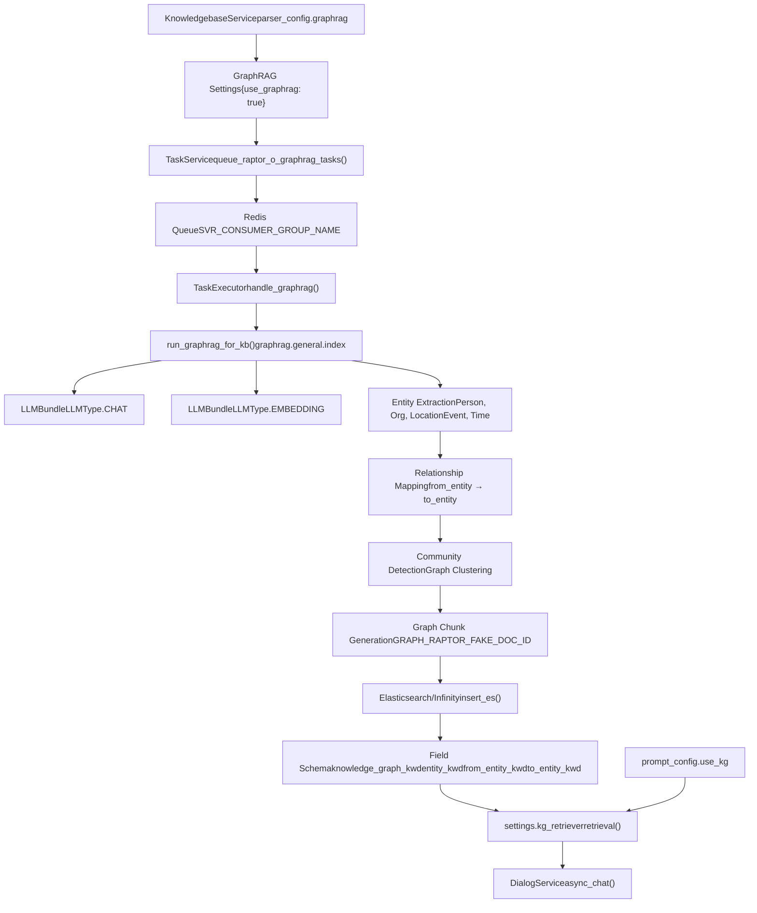
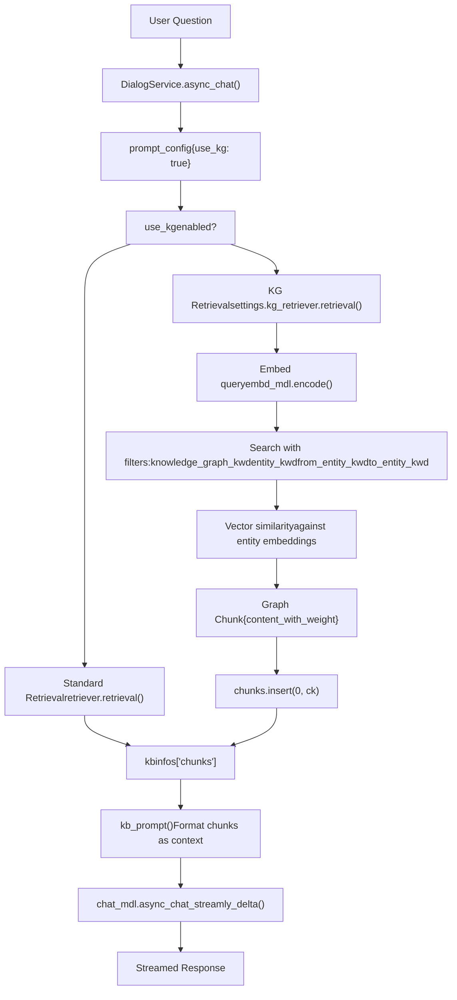

# Knowledge Graph Construction

Relevant source files

-   [agent/tools/retrieval.py](https://github.com/infiniflow/ragflow/blob/80a16e71/agent/tools/retrieval.py)
-   [api/apps/chunk\_app.py](https://github.com/infiniflow/ragflow/blob/80a16e71/api/apps/chunk_app.py)
-   [api/apps/conversation\_app.py](https://github.com/infiniflow/ragflow/blob/80a16e71/api/apps/conversation_app.py)
-   [api/apps/document\_app.py](https://github.com/infiniflow/ragflow/blob/80a16e71/api/apps/document_app.py)
-   [api/apps/file2document\_app.py](https://github.com/infiniflow/ragflow/blob/80a16e71/api/apps/file2document_app.py)
-   [api/apps/file\_app.py](https://github.com/infiniflow/ragflow/blob/80a16e71/api/apps/file_app.py)
-   [api/apps/kb\_app.py](https://github.com/infiniflow/ragflow/blob/80a16e71/api/apps/kb_app.py)
-   [api/apps/sdk/chat.py](https://github.com/infiniflow/ragflow/blob/80a16e71/api/apps/sdk/chat.py)
-   [api/apps/sdk/dataset.py](https://github.com/infiniflow/ragflow/blob/80a16e71/api/apps/sdk/dataset.py)
-   [api/apps/sdk/dify\_retrieval.py](https://github.com/infiniflow/ragflow/blob/80a16e71/api/apps/sdk/dify_retrieval.py)
-   [api/apps/sdk/doc.py](https://github.com/infiniflow/ragflow/blob/80a16e71/api/apps/sdk/doc.py)
-   [api/apps/sdk/session.py](https://github.com/infiniflow/ragflow/blob/80a16e71/api/apps/sdk/session.py)
-   [api/db/db\_models.py](https://github.com/infiniflow/ragflow/blob/80a16e71/api/db/db_models.py)
-   [api/db/services/canvas\_service.py](https://github.com/infiniflow/ragflow/blob/80a16e71/api/db/services/canvas_service.py)
-   [api/db/services/conversation\_service.py](https://github.com/infiniflow/ragflow/blob/80a16e71/api/db/services/conversation_service.py)
-   [api/db/services/dialog\_service.py](https://github.com/infiniflow/ragflow/blob/80a16e71/api/db/services/dialog_service.py)
-   [api/db/services/document\_service.py](https://github.com/infiniflow/ragflow/blob/80a16e71/api/db/services/document_service.py)
-   [api/db/services/file\_service.py](https://github.com/infiniflow/ragflow/blob/80a16e71/api/db/services/file_service.py)
-   [api/db/services/knowledgebase\_service.py](https://github.com/infiniflow/ragflow/blob/80a16e71/api/db/services/knowledgebase_service.py)
-   [api/db/services/task\_service.py](https://github.com/infiniflow/ragflow/blob/80a16e71/api/db/services/task_service.py)
-   [api/utils/api\_utils.py](https://github.com/infiniflow/ragflow/blob/80a16e71/api/utils/api_utils.py)
-   [docs/references/http\_api\_reference.md](https://github.com/infiniflow/ragflow/blob/80a16e71/docs/references/http_api_reference.md)
-   [docs/references/python\_api\_reference.md](https://github.com/infiniflow/ragflow/blob/80a16e71/docs/references/python_api_reference.md)
-   [docs/release\_notes.md](https://github.com/infiniflow/ragflow/blob/80a16e71/docs/release_notes.md)
-   [rag/advanced\_rag/\_\_init\_\_.py](https://github.com/infiniflow/ragflow/blob/80a16e71/rag/advanced_rag/__init__.py)
-   [rag/benchmark.py](https://github.com/infiniflow/ragflow/blob/80a16e71/rag/benchmark.py)
-   [rag/nlp/search.py](https://github.com/infiniflow/ragflow/blob/80a16e71/rag/nlp/search.py)
-   [rag/svr/task\_executor.py](https://github.com/infiniflow/ragflow/blob/80a16e71/rag/svr/task_executor.py)
-   [sdk/python/ragflow\_sdk/modules/chat.py](https://github.com/infiniflow/ragflow/blob/80a16e71/sdk/python/ragflow_sdk/modules/chat.py)
-   [sdk/python/ragflow\_sdk/ragflow.py](https://github.com/infiniflow/ragflow/blob/80a16e71/sdk/python/ragflow_sdk/ragflow.py)

## Purpose and Scope

This document explains RAGFlow's knowledge graph construction system (GraphRAG), which extracts entities and relationships from documents to create a structured graph representation that enhances retrieval with semantic context. For hierarchical summarization using clustering, see [RAPTOR Hierarchical Summarization](/infiniflow/ragflow/6.6-raptor-hierarchical-summarization). For general document parsing and chunking strategies, see [Document Processing Pipeline](/infiniflow/ragflow/6-document-processing-pipeline).

GraphRAG operates at the knowledge base level, building a unified graph across all documents in a dataset to capture interconnected concepts, entities, and their relationships. The system extracts structured information (persons, organizations, locations, events, time references) and stores it as specialized chunks optimized for graph-based retrieval.

---

## System Architecture

The GraphRAG implementation follows a batch processing model integrated with RAGFlow's task execution system:

**Diagram 1: GraphRAG Construction Architecture**


**Sources**: [rag/svr/task\_executor.py36-38](https://github.com/infiniflow/ragflow/blob/80a16e71/rag/svr/task_executor.py#L36-L38) [rag/svr/task\_executor.py95-101](https://github.com/infiniflow/ragflow/blob/80a16e71/rag/svr/task_executor.py#L95-L101) [rag/svr/task\_executor.py881-935](https://github.com/infiniflow/ragflow/blob/80a16e71/rag/svr/task_executor.py#L881-L935) [api/db/services/dialog\_service.py417-421](https://github.com/infiniflow/ragflow/blob/80a16e71/api/db/services/dialog_service.py#L417-L421)

---

## Configuration and Triggering

GraphRAG construction is enabled at the knowledge base level through parser configuration:

**Configuration Schema**

| Configuration Field | Type | Description |
| --- | --- | --- |
| `parser_config.graphrag` | `object` | GraphRAG-specific settings |
| `parser_config.graphrag.use_graphrag` | `boolean` | Enable/disable graph construction (default: `false`) |
| `kb.embd_id` | `string` | Embedding model ID for vectorizing entities |
| `llm_id` | `string` | Chat model ID for entity extraction |

**Triggering the Build Process**

GraphRAG is built as a batch operation via the task queue system:

```
1. User enables GraphRAG in dataset configuration
2. DocumentService.queue_raptor_o_graphrag_tasks() creates task
3. Task queued to Redis with type PipelineTaskType.GRAPH_RAG
4. TaskExecutor.handle_graphrag() consumes task asynchronously
5. Graph built across all documents in the knowledge base
```
The system uses a semaphore-based concurrency limiter (`kg_limiter = asyncio.Semaphore(2)`) to prevent overwhelming LLM services during parallel graph construction.

**Sources**: [rag/svr/task\_executor.py122](https://github.com/infiniflow/ragflow/blob/80a16e71/rag/svr/task_executor.py#L122-L122) [api/db/services/document\_service.py653-710](https://github.com/infiniflow/ragflow/blob/80a16e71/api/db/services/document_service.py#L653-L710) [docs/references/http\_api\_reference.md549-552](https://github.com/infiniflow/ragflow/blob/80a16e71/docs/references/http_api_reference.md#L549-L552) [api/db/services/knowledgebase\_service.py1-50](https://github.com/infiniflow/ragflow/blob/80a16e71/api/db/services/knowledgebase_service.py#L1-L50)

---

## Entity Extraction and Processing Pipeline

**Diagram 2: Entity Extraction Flow**

> **[Mermaid sequence]**
> *(图表结构无法解析)*

**Entity Types Extracted**

The LLM-based extraction identifies five primary entity categories:

1.  **Person**: Individual names, roles, titles
2.  **Organization**: Companies, institutions, agencies
3.  **Location**: Geographic entities (cities, countries, landmarks)
4.  **Event**: Significant occurrences, meetings, incidents
5.  **Time**: Temporal references and periods

**Relationship Mapping**

Extracted entities are connected through directed edges representing semantic relationships. Each relationship captures:

-   Source entity (`from_entity_kwd`)
-   Target entity (`to_entity_kwd`)
-   Relationship type (implicit in context)
-   Co-occurrence context from document chunks

**Sources**: [rag/svr/task\_executor.py881-935](https://github.com/infiniflow/ragflow/blob/80a16e71/rag/svr/task_executor.py#L881-L935) [rag/nlp/search.py68-71](https://github.com/infiniflow/ragflow/blob/80a16e71/rag/nlp/search.py#L68-L71)

---

## Graph Structure and Storage Schema

GraphRAG chunks are stored in the document engine using a specialized schema distinct from regular document chunks:

**Field Schema for Graph Chunks**

| Field Name | Type | Purpose |
| --- | --- | --- |
| `knowledge_graph_kwd` | `keyword` | Flag indicating graph chunk type |
| `entity_kwd` | `keyword` | Primary entity name |
| `from_entity_kwd` | `keyword` | Source entity in relationship |
| `to_entity_kwd` | `keyword` | Target entity in relationship |
| `content_with_weight` | `text` | Textual description of entity/relationship |
| `q_{N}_vec` | `vector` | Embedding vector (dimension N) |
| `kb_id` | `keyword` | Knowledge base identifier |
| `doc_id` | `keyword` | Always set to `GRAPH_RAPTOR_FAKE_DOC_ID` |
| `available_int` | `integer` | Availability flag (1 = available, 0 = hidden) |

**Special Document ID**

Graph chunks use a synthetic document ID (`GRAPH_RAPTOR_FAKE_DOC_ID = "graph_raptor_fake"`) to distinguish them from regular document chunks. This enables:

-   Filtering graph chunks independently from document chunks
-   Separate management of graph lifecycle vs document lifecycle
-   Efficient graph-specific queries in the retrieval layer

**Index Name**

Graph chunks are stored in the same index as regular chunks using `search.index_name(tenant_id)` pattern (`ragflow_{tenant_id}`), allowing hybrid retrieval across both graph and document content.

**Sources**: [rag/svr/task\_executor.py881-935](https://github.com/infiniflow/ragflow/blob/80a16e71/rag/svr/task_executor.py#L881-L935) [api/db/services/task\_service.py58](https://github.com/infiniflow/ragflow/blob/80a16e71/api/db/services/task_service.py#L58-L58) [rag/nlp/search.py33](https://github.com/infiniflow/ragflow/blob/80a16e71/rag/nlp/search.py#L33-L33) [rag/nlp/search.py62-72](https://github.com/infiniflow/ragflow/blob/80a16e71/rag/nlp/search.py#L62-L72)

---

## Retrieval Integration

Graph-based retrieval integrates with RAGFlow's chat completion pipeline when enabled:

**Diagram 3: Knowledge Graph Retrieval Flow**


**Retrieval Implementation**

The knowledge graph retriever (`settings.kg_retriever`) is invoked conditionally during chat:

```
# From dialog_service.py:417-421
if prompt_config.get("use_kg"):
    ck = await settings.kg_retriever.retrieval(
        " ".join(questions),
        tenant_ids,
        dialog.kb_ids,
        embd_mdl,
        LLMBundle(dialog.tenant_id, LLMType.CHAT)
    )
    if ck["content_with_weight"]:
        kbinfos["chunks"].insert(0, ck)
```
The graph chunk is inserted at position 0 (highest priority) in the context, ensuring entity-relationship information appears prominently in the LLM's context window.

**Query Filters for Graph Search**

When querying graph chunks, the system applies specialized filters:

```
# From search.py:68-71
for key in ["knowledge_graph_kwd", "available_int", "entity_kwd",
            "from_entity_kwd", "to_entity_kwd", "removed_kwd"]:
    if key in req and req[key] is not None:
        condition[key] = req[key]
```
This enables precise targeting of:

-   Specific entities by name (`entity_kwd`)
-   Relationship sources (`from_entity_kwd`)
-   Relationship targets (`to_entity_kwd`)
-   Graph chunk type (`knowledge_graph_kwd`)

**Sources**: [api/db/services/dialog\_service.py417-421](https://github.com/infiniflow/ragflow/blob/80a16e71/api/db/services/dialog_service.py#L417-L421) [rag/nlp/search.py62-72](https://github.com/infiniflow/ragflow/blob/80a16e71/rag/nlp/search.py#L62-L72) [rag/nlp/search.py74-171](https://github.com/infiniflow/ragflow/blob/80a16e71/rag/nlp/search.py#L74-L171)

---

## Lifecycle Management

**Batch Building vs. Incremental Updates**

GraphRAG follows a batch construction model optimized for performance:

| Operation | Behavior |
| --- | --- |
| Initial Build | Processes all documents in dataset |
| Document Addition | Does **not** trigger automatic rebuild |
| Manual Rebuild | User-initiated via task queue |
| Document Deletion | Graph chunks persist until explicit rebuild |

This design choice (introduced in v0.21.0) significantly reduces construction overhead compared to incremental updates, as graph construction is computationally expensive.

**Task Progress Tracking**

Graph construction progress is tracked via `TaskService` with callbacks:

```
# From task_executor.py:134-163
def set_progress(task_id, from_page=0, to_page=-1, prog=None, msg="Processing..."):
    # Updates task progress in database
    TaskService.update_progress(task_id, {"progress": prog, "progress_msg": msg})
```
Progress stages during graph construction:

-   `0.1`: "Start to build graph..."
-   `0.1-0.8`: Entity extraction and graph construction
-   `0.8`: "Start to index..."
-   `1.0`: "Indexing done ({time}s)"

**Sources**: [rag/svr/task\_executor.py881-935](https://github.com/infiniflow/ragflow/blob/80a16e71/rag/svr/task_executor.py#L881-L935) [rag/svr/task\_executor.py134-163](https://github.com/infiniflow/ragflow/blob/80a16e71/rag/svr/task_executor.py#L134-L163) [docs/release\_notes.md180-181](https://github.com/infiniflow/ragflow/blob/80a16e71/docs/release_notes.md#L180-L181) [api/db/services/task\_service.py1-50](https://github.com/infiniflow/ragflow/blob/80a16e71/api/db/services/task_service.py#L1-L50)

---

## Performance Characteristics

**Concurrency Control**

GraphRAG uses dedicated semaphore-based rate limiting:

```
# From task_executor.py:122
kg_limiter = asyncio.Semaphore(2)
```
This limits concurrent graph construction tasks to 2, preventing LLM API overload during entity extraction.

**Token Usage Tracking**

The system tracks and reports token consumption during graph construction:

```
# From task_executor.py:926-929
DocumentService.increment_chunk_num(
    GRAPH_RAPTOR_FAKE_DOC_ID,
    row["kb_id"],
    graphrag_res["token_count"],
    len(graphrag_res["chunks"]),
    elapsed_time
)
```
Token counts include:

-   Entity extraction prompts to LLM
-   Relationship identification prompts
-   Embedding generation for entity descriptions

**Caching Strategy**

GraphRAG leverages the LLM cache system for repeated extractions:

```
# From task_executor.py:37
from graphrag.utils import get_llm_cache, set_llm_cache
```
This reduces redundant LLM calls when processing similar content patterns across documents.

**Sources**: [rag/svr/task\_executor.py122](https://github.com/infiniflow/ragflow/blob/80a16e71/rag/svr/task_executor.py#L122-L122) [rag/svr/task\_executor.py881-935](https://github.com/infiniflow/ragflow/blob/80a16e71/rag/svr/task_executor.py#L881-L935) [rag/svr/task\_executor.py36-38](https://github.com/infiniflow/ragflow/blob/80a16e71/rag/svr/task_executor.py#L36-L38)

---

## API Integration

**Enabling GraphRAG via HTTP API**

When creating or updating a dataset:

```
{
  "name": "my_dataset",
  "parser_config": {
    "graphrag": {
      "use_graphrag": true
    }
  }
}
```
**Querying with Graph Filters**

The chunk retrieval API supports graph-specific filters:

```
{
  "knowledge_graph_kwd": "true",
  "entity_kwd": "John Smith",
  "from_entity_kwd": "Microsoft",
  "to_entity_kwd": "Seattle"
}
```
**Python SDK Example**

```
from ragflow_sdk import RAGFlow

ragflow = RAGFlow(api_key="your_api_key", base_url="http://ragflow_address")

# Create dataset with GraphRAG enabled
dataset = ragflow.create_dataset(
    name="knowledge_graph_dataset",
    parser_config={
        "graphrag": {"use_graphrag": True}
    }
)

# Upload documents
dataset.upload_file("documents.pdf")

# Trigger graph construction (manual batch build)
# Implementation specific to dataset rebuilding
```
**Sources**: [docs/references/http\_api\_reference.md549-552](https://github.com/infiniflow/ragflow/blob/80a16e71/docs/references/http_api_reference.md#L549-L552) [docs/references/python\_api\_reference.md1-100](https://github.com/infiniflow/ragflow/blob/80a16e71/docs/references/python_api_reference.md#L1-L100) [api/apps/sdk/dataset.py1-50](https://github.com/infiniflow/ragflow/blob/80a16e71/api/apps/sdk/dataset.py#L1-L50)

---

## Related Systems

-   **[RAPTOR Hierarchical Summarization](/infiniflow/ragflow/6.6-raptor-hierarchical-summarization)**: Alternative enhancement strategy using clustering instead of entity extraction
-   **[Content Enhancement and Embedding](/infiniflow/ragflow/6.3-content-enhancement-and-embedding)**: Base pipeline for chunk enhancement before graph construction
-   **[Hybrid Search Architecture](/infiniflow/ragflow/10.2-hybrid-search-architecture)**: Integration point where graph chunks join standard retrieval results
-   **[Task Execution and Queue System](/infiniflow/ragflow/3.3-task-execution-and-queue-system)**: Infrastructure enabling asynchronous graph construction

---

## Summary

RAGFlow's GraphRAG implementation provides structured semantic enhancement through entity-relationship extraction. The system operates at the knowledge base level, building unified graphs across all documents using LLM-based entity extraction. Graph chunks are stored with specialized metadata fields (`entity_kwd`, `from_entity_kwd`, `to_entity_kwd`) in the same index as regular chunks, enabling hybrid retrieval that combines graph structure with vector similarity. The batch construction model prioritizes performance, requiring manual rebuilds after document changes. Graph context is conditionally injected at the highest priority during chat completion when `use_kg` is enabled, providing LLMs with structured semantic information alongside traditional chunk-based context.
