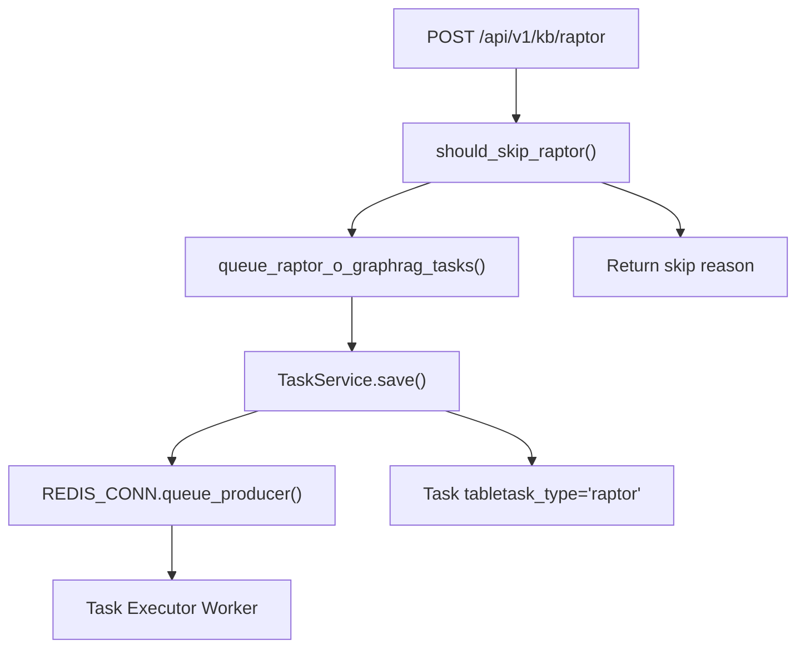
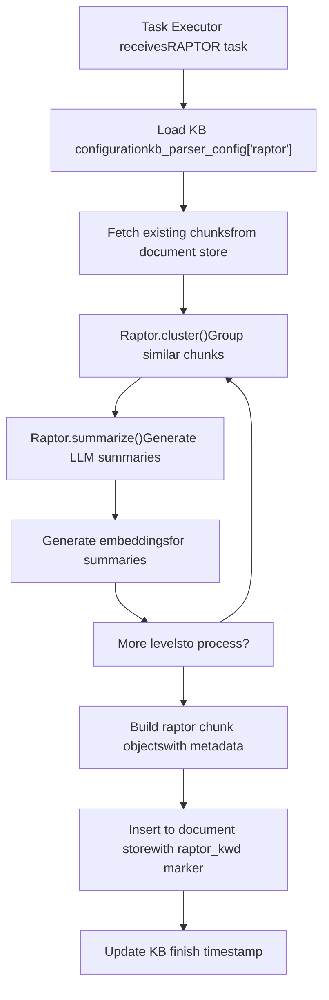
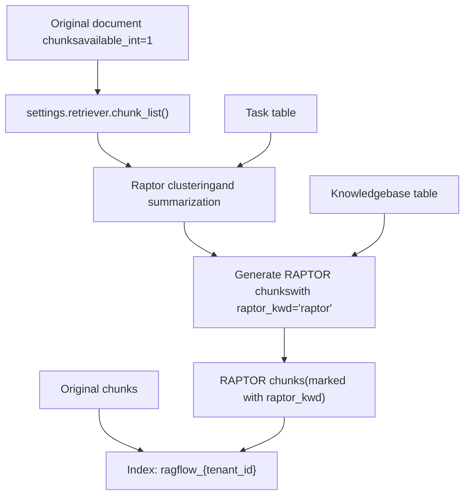
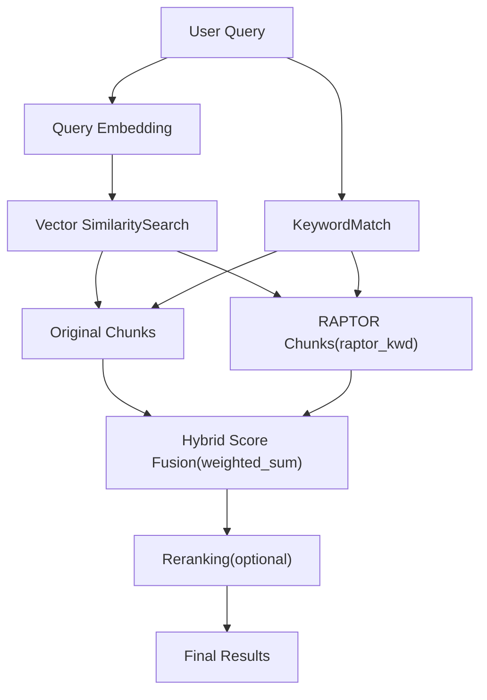

# RAPTOR Hierarchical Summarization

Relevant source files

-   [agent/tools/retrieval.py](https://github.com/infiniflow/ragflow/blob/80a16e71/agent/tools/retrieval.py)
-   [api/apps/chunk\_app.py](https://github.com/infiniflow/ragflow/blob/80a16e71/api/apps/chunk_app.py)
-   [api/apps/conversation\_app.py](https://github.com/infiniflow/ragflow/blob/80a16e71/api/apps/conversation_app.py)
-   [api/apps/document\_app.py](https://github.com/infiniflow/ragflow/blob/80a16e71/api/apps/document_app.py)
-   [api/apps/file2document\_app.py](https://github.com/infiniflow/ragflow/blob/80a16e71/api/apps/file2document_app.py)
-   [api/apps/file\_app.py](https://github.com/infiniflow/ragflow/blob/80a16e71/api/apps/file_app.py)
-   [api/apps/kb\_app.py](https://github.com/infiniflow/ragflow/blob/80a16e71/api/apps/kb_app.py)
-   [api/apps/sdk/chat.py](https://github.com/infiniflow/ragflow/blob/80a16e71/api/apps/sdk/chat.py)
-   [api/apps/sdk/dataset.py](https://github.com/infiniflow/ragflow/blob/80a16e71/api/apps/sdk/dataset.py)
-   [api/apps/sdk/dify\_retrieval.py](https://github.com/infiniflow/ragflow/blob/80a16e71/api/apps/sdk/dify_retrieval.py)
-   [api/apps/sdk/doc.py](https://github.com/infiniflow/ragflow/blob/80a16e71/api/apps/sdk/doc.py)
-   [api/apps/sdk/session.py](https://github.com/infiniflow/ragflow/blob/80a16e71/api/apps/sdk/session.py)
-   [api/db/db\_models.py](https://github.com/infiniflow/ragflow/blob/80a16e71/api/db/db_models.py)
-   [api/db/services/canvas\_service.py](https://github.com/infiniflow/ragflow/blob/80a16e71/api/db/services/canvas_service.py)
-   [api/db/services/conversation\_service.py](https://github.com/infiniflow/ragflow/blob/80a16e71/api/db/services/conversation_service.py)
-   [api/db/services/dialog\_service.py](https://github.com/infiniflow/ragflow/blob/80a16e71/api/db/services/dialog_service.py)
-   [api/db/services/document\_service.py](https://github.com/infiniflow/ragflow/blob/80a16e71/api/db/services/document_service.py)
-   [api/db/services/file\_service.py](https://github.com/infiniflow/ragflow/blob/80a16e71/api/db/services/file_service.py)
-   [api/db/services/knowledgebase\_service.py](https://github.com/infiniflow/ragflow/blob/80a16e71/api/db/services/knowledgebase_service.py)
-   [api/db/services/task\_service.py](https://github.com/infiniflow/ragflow/blob/80a16e71/api/db/services/task_service.py)
-   [api/utils/api\_utils.py](https://github.com/infiniflow/ragflow/blob/80a16e71/api/utils/api_utils.py)
-   [docs/references/http\_api\_reference.md](https://github.com/infiniflow/ragflow/blob/80a16e71/docs/references/http_api_reference.md)
-   [docs/references/python\_api\_reference.md](https://github.com/infiniflow/ragflow/blob/80a16e71/docs/references/python_api_reference.md)
-   [docs/release\_notes.md](https://github.com/infiniflow/ragflow/blob/80a16e71/docs/release_notes.md)
-   [rag/advanced\_rag/\_\_init\_\_.py](https://github.com/infiniflow/ragflow/blob/80a16e71/rag/advanced_rag/__init__.py)
-   [rag/benchmark.py](https://github.com/infiniflow/ragflow/blob/80a16e71/rag/benchmark.py)
-   [rag/nlp/search.py](https://github.com/infiniflow/ragflow/blob/80a16e71/rag/nlp/search.py)
-   [rag/svr/task\_executor.py](https://github.com/infiniflow/ragflow/blob/80a16e71/rag/svr/task_executor.py)
-   [sdk/python/ragflow\_sdk/modules/chat.py](https://github.com/infiniflow/ragflow/blob/80a16e71/sdk/python/ragflow_sdk/modules/chat.py)
-   [sdk/python/ragflow\_sdk/ragflow.py](https://github.com/infiniflow/ragflow/blob/80a16e71/sdk/python/ragflow_sdk/ragflow.py)

RAPTOR (Recursive Abstractive Processing for Tree-Organized Retrieval) is an advanced document processing technique that creates multi-level hierarchical summaries from existing document chunks. This method improves retrieval quality by generating abstract representations at different granularity levels, enabling more effective context retrieval for complex queries.

For information about other advanced retrieval features, see [GraphRAG and Knowledge Graph Construction](/infiniflow/ragflow/6.4-layout-recognition-and-ocr). For basic document chunking strategies, see [Document Parsing Strategies and Chunk Methods](/infiniflow/ragflow/6.1-document-parsing-strategies).

## Overview and Purpose

RAPTOR addresses a fundamental challenge in retrieval-augmented generation: finding the right level of abstraction for a given query. While traditional RAG systems retrieve individual chunks, RAPTOR generates hierarchical summaries that capture information at multiple scales—from detailed leaf nodes to high-level abstract summaries.

The system works by:

1.  Clustering existing document chunks based on semantic similarity
2.  Generating summaries for each cluster using an LLM
3.  Creating new "raptor" chunks that contain these summaries
4.  Recursively repeating this process to build a tree structure
5.  Indexing all levels alongside original chunks for retrieval

**Key Benefits:**

-   **Multi-scale retrieval**: Answers both detailed and high-level questions
-   **Contextual coherence**: Related chunks are grouped and summarized together
-   **Improved recall**: Broader summaries help retrieve relevant detailed chunks
-   **Configurable scope**: Can operate per-document or across entire datasets

**Sources:**

-   [rag/svr/task\_executor.py64](https://github.com/infiniflow/ragflow/blob/80a16e71/rag/svr/task_executor.py#L64-L64)
-   [rag/svr/task\_executor.py700-765](https://github.com/infiniflow/ragflow/blob/80a16e71/rag/svr/task_executor.py#L700-L765)
-   [api/db/services/document\_service.py600-700](https://github.com/infiniflow/ragflow/blob/80a16e71/api/db/services/document_service.py#L600-L700)

## Configuration Parameters

RAPTOR processing is configured through the knowledge base parser configuration, stored in `Knowledgebase.parser_config["raptor"]`.

### Core Configuration Fields

| Parameter | Type | Description | Default |
| --- | --- | --- | --- |
| `max_cluster` | integer | Maximum number of clusters per level | 64 |
| `prompt` | string | LLM prompt template for summarization | System default |
| `max_token` | integer | Maximum tokens per summary | Model-dependent |
| `threshold` | float | Similarity threshold for clustering (0-1) | 0.1 |
| `random_seed` | integer | Seed for reproducible clustering | Random |
| `scope` | string | Processing scope: "file" or "dataset" | "file" |

### Scope Options

**File Scope** (`"file"`):

-   RAPTOR processes each document independently
-   Creates hierarchical summaries within document boundaries
-   Preserves document-specific context
-   Better for large documents with internal structure

**Dataset Scope** (`"dataset"`):

-   RAPTOR processes all chunks across the entire knowledge base
-   Creates cross-document hierarchical summaries
-   Useful for finding themes across multiple documents
-   Higher computational cost

**Sources:**

-   [rag/svr/task\_executor.py700-765](https://github.com/infiniflow/ragflow/blob/80a16e71/rag/svr/task_executor.py#L700-L765)
-   [api/apps/kb\_app.py257-323](https://github.com/infiniflow/ragflow/blob/80a16e71/api/apps/kb_app.py#L257-L323)

## Triggering RAPTOR Processing

### Manual Triggering via API

RAPTOR processing is initiated through the knowledge base API endpoint:

```
POST /api/v1/kb/raptor
```
The system validates whether RAPTOR should run based on:

-   Document count (requires at least 1 document)
-   Parser type compatibility
-   Chunk availability
-   Previous execution status

**Validation Logic:**

The system uses `should_skip_raptor()` to check prerequisites:

-   Documents must have been successfully parsed
-   Chunks must exist in the document store
-   Cannot run if a RAPTOR task is already in progress

**Sources:**

-   [api/apps/kb\_app.py257-323](https://github.com/infiniflow/ragflow/blob/80a16e71/api/apps/kb_app.py#L257-L323)
-   [rag/utils/raptor\_utils.py](https://github.com/infiniflow/ragflow/blob/80a16e71/rag/utils/raptor_utils.py) (referenced at line 32)
-   [api/db/services/document\_service.py600-700](https://github.com/infiniflow/ragflow/blob/80a16e71/api/db/services/document_service.py#L600-L700)

### Task Creation and Queuing

#### Task Creation Flow


**Sources:**

-   [api/apps/kb\_app.py257-323](https://github.com/infiniflow/ragflow/blob/80a16e71/api/apps/kb_app.py#L257-L323)
-   [api/db/services/document\_service.py600-700](https://github.com/infiniflow/ragflow/blob/80a16e71/api/db/services/document_service.py#L600-L700)
-   [rag/svr/task\_executor.py95-99](https://github.com/infiniflow/ragflow/blob/80a16e71/rag/svr/task_executor.py#L95-L99)

## RAPTOR Processing Pipeline

### High-Level Processing Flow


**Sources:**

-   [rag/svr/task\_executor.py700-765](https://github.com/infiniflow/ragflow/blob/80a16e71/rag/svr/task_executor.py#L700-L765)
-   [rag/raptor.py](https://github.com/infiniflow/ragflow/blob/80a16e71/rag/raptor.py) (imported at line 64)

### Detailed Processing Steps

#### Step 1: Chunk Retrieval

The system retrieves all existing chunks for processing based on the configured scope:

```
# From rag/svr/task_executor.py:746-763
if raptor_config.get("scope", "file") == "file":
    for x, doc_id in enumerate(doc_ids):
        chunks = []
        for d in settings.retriever.chunk_list(doc_id, row["tenant_id"], [str(row["kb_id"])],
                                             fields=["content_with_weight", vctr_nm],
                                             sort_by_position=True):
            chunks.append((d["content_with_weight"], np.array(d[vctr_nm])))
        await generate(chunks, doc_id)
```
**Retrieved Fields:**

-   `content_with_weight`: The full text content of the chunk
-   `q_{vector_size}_vec`: The embedding vector for the chunk
-   Chunks are sorted by position to maintain document order

**Sources:**

-   [rag/svr/task\_executor.py746-763](https://github.com/infiniflow/ragflow/blob/80a16e71/rag/svr/task_executor.py#L746-L763)
-   [rag/nlp/search.py512-545](https://github.com/infiniflow/ragflow/blob/80a16e71/rag/nlp/search.py#L512-L545)

#### Step 2: Hierarchical Clustering and Summarization

The `Raptor` class orchestrates the clustering and summarization process:

```
# From rag/svr/task_executor.py:713-723
raptor = Raptor(
    raptor_config.get("max_cluster", 64),
    chat_mdl,
    embd_mdl,
    raptor_config["prompt"],
    raptor_config["max_token"],
    raptor_config["threshold"],
    max_errors=max_errors,
)
original_length = len(chunks)
chunks = await raptor(chunks, kb_parser_config["raptor"]["random_seed"], callback, row["id"])
```
**Raptor Algorithm:**

1.  **Clustering**: Groups chunks using embedding similarity
2.  **Summary Generation**: LLM creates concise summaries for each cluster
3.  **Embedding**: New embeddings generated for summaries
4.  **Recursion**: Process repeats on summaries until convergence

**Sources:**

-   [rag/svr/task\_executor.py711-744](https://github.com/infiniflow/ragflow/blob/80a16e71/rag/svr/task_executor.py#L711-L744)
-   [rag/raptor.py](https://github.com/infiniflow/ragflow/blob/80a16e71/rag/raptor.py) (imported class)

#### Step 3: Chunk Object Construction

RAPTOR generates new chunk documents with specific metadata markers:

```
# From rag/svr/task_executor.py:724-744
doc = {
    "doc_id": did,
    "kb_id": [str(row["kb_id"])],
    "docnm_kwd": row["name"],
    "title_tks": rag_tokenizer.tokenize(row["name"]),
    "raptor_kwd": "raptor"
}
if row["pagerank"]:
    doc[PAGERANK_FLD] = int(row["pagerank"])

for content, vctr in chunks[original_length:]:
    d = copy.deepcopy(doc)
    d["id"] = xxhash.xxh64((content + str(fake_doc_id)).encode("utf-8")).hexdigest()
    d["create_time"] = str(datetime.now()).replace("T", " ")[:19]
    d["create_timestamp_flt"] = datetime.now().timestamp()
    d[vctr_nm] = vctr.tolist()
    d["content_with_weight"] = content
    d["content_ltks"] = rag_tokenizer.tokenize(content)
    d["content_sm_ltks"] = rag_tokenizer.fine_grained_tokenize(d["content_ltks"])
    res.append(d)
```
**Key Fields:**

-   `raptor_kwd`: Special marker field set to `"raptor"` to identify RAPTOR chunks
-   `doc_id`: Either actual document ID (file scope) or `GRAPH_RAPTOR_FAKE_DOC_ID` (dataset scope)
-   `content_with_weight`: The generated summary text
-   `content_ltks`: Tokenized version for full-text search
-   `q_{N}_vec`: Embedding vector for similarity search

**Sources:**

-   [rag/svr/task\_executor.py724-744](https://github.com/infiniflow/ragflow/blob/80a16e71/rag/svr/task_executor.py#L724-L744)
-   [api/db/services/task\_service.py39](https://github.com/infiniflow/ragflow/blob/80a16e71/api/db/services/task_service.py#L39-L39)

## Data Flow and Storage

### Storage Architecture


**Sources:**

-   [rag/svr/task\_executor.py700-765](https://github.com/infiniflow/ragflow/blob/80a16e71/rag/svr/task_executor.py#L700-L765)
-   [rag/nlp/search.py512-545](https://github.com/infiniflow/ragflow/blob/80a16e71/rag/nlp/search.py#L512-L545)
-   [common/settings.py](https://github.com/infiniflow/ragflow/blob/80a16e71/common/settings.py) (retriever and docStoreConn references)

### Document Store Schema

RAPTOR chunks are stored in the same index as regular chunks but with distinguishing fields:

| Field | Type | Description | Example |
| --- | --- | --- | --- |
| `id` | string | Unique chunk identifier | Hash of content |
| `doc_id` | string | Document ID or `GRAPH_RAPTOR_FAKE_DOC_ID` | Varies by scope |
| `kb_id` | array | Knowledge base ID(s) | `["kb_123"]` |
| `raptor_kwd` | string | **Marker field** for RAPTOR chunks | `"raptor"` |
| `content_with_weight` | text | The summary text | Generated summary |
| `content_ltks` | array | Tokenized content for full-text search | Token array |
| `content_sm_ltks` | array | Fine-grained tokens | Sub-word tokens |
| `q_{N}_vec` | vector | Embedding vector | Float array |
| `docnm_kwd` | string | Source document name | Original filename |
| `available_int` | integer | Availability flag | `1` |
| `create_timestamp_flt` | float | Creation timestamp | Unix timestamp |

**Sources:**

-   [rag/svr/task\_executor.py724-744](https://github.com/infiniflow/ragflow/blob/80a16e71/rag/svr/task_executor.py#L724-L744)
-   [rag/nlp/search.py91-96](https://github.com/infiniflow/ragflow/blob/80a16e71/rag/nlp/search.py#L91-L96)

### Fake Document ID Usage

For dataset-scope RAPTOR processing, the system uses a special document ID:

```
# From api/db/services/task_service.py:39
GRAPH_RAPTOR_FAKE_DOC_ID = "graph_raptor_x"
```
This fake ID is used to:

-   Group all dataset-level RAPTOR chunks together
-   Distinguish them from file-scoped RAPTOR chunks
-   Enable filtering in retrieval queries

**Sources:**

-   [api/db/services/task\_service.py39](https://github.com/infiniflow/ragflow/blob/80a16e71/api/db/services/task_service.py#L39-L39)
-   [rag/svr/task\_executor.py702-703](https://github.com/infiniflow/ragflow/blob/80a16e71/rag/svr/task_executor.py#L702-L703)

## Integration with Retrieval System

### RAPTOR Chunk Filtering

During retrieval, RAPTOR chunks can be included or excluded based on query needs. The `raptor_kwd` field enables efficient filtering:

```
# Retrieval can filter by raptor_kwd field
req = {
    "kb_ids": kb_ids,
    "question": question,
    # To exclude RAPTOR chunks:
    # "raptor_kwd": None or False
    # To include only RAPTOR chunks:
    # "raptor_kwd": "raptor"
}
```
**Retrieval Scenarios:**

1.  **Default retrieval**: Includes both original and RAPTOR chunks
2.  **Original-only retrieval**: Filters out `raptor_kwd="raptor"`
3.  **RAPTOR-only retrieval**: Requires `raptor_kwd="raptor"`
4.  **Hybrid retrieval**: Uses both with different weighting strategies

**Sources:**

-   [rag/nlp/search.py74-171](https://github.com/infiniflow/ragflow/blob/80a16e71/rag/nlp/search.py#L74-L171)
-   [api/db/services/dialog\_service.py396-428](https://github.com/infiniflow/ragflow/blob/80a16e71/api/db/services/dialog_service.py#L396-L428)

### Search Score Adjustment

RAPTOR chunks participate in hybrid search alongside original chunks:


**Score Calculation:**

-   Vector similarity weight (`vt_weight`): Typically 0.7
-   Keyword match weight (`tk_weight`): Typically 0.3
-   RAPTOR chunks compete with original chunks on equal footing
-   Reranking models can further adjust scores

**Sources:**

-   [rag/nlp/search.py74-171](https://github.com/infiniflow/ragflow/blob/80a16e71/rag/nlp/search.py#L74-L171)
-   [rag/nlp/search.py291-352](https://github.com/infiniflow/ragflow/blob/80a16e71/rag/nlp/search.py#L291-L352)
-   [api/db/services/dialog\_service.py396-428](https://github.com/infiniflow/ragflow/blob/80a16e71/api/db/services/dialog_service.py#L396-L428)

## Task Monitoring and Status

### Progress Tracking

The task executor provides progress callbacks during RAPTOR processing:

```
# From rag/svr/task_executor.py:754
callback(prog=(x+1.)/len(doc_ids))
```
**Progress Updates:**

-   For file scope: Progress per document processed
-   For dataset scope: Overall clustering progress
-   Token consumption tracking
-   Error handling with configurable max errors

**Sources:**

-   [rag/svr/task\_executor.py700-765](https://github.com/infiniflow/ragflow/blob/80a16e71/rag/svr/task_executor.py#L700-L765)
-   [rag/svr/task\_executor.py132-162](https://github.com/infiniflow/ragflow/blob/80a16e71/rag/svr/task_executor.py#L132-L162)

### Completion Markers

After successful RAPTOR processing, the knowledge base record is updated:

```
# Update raptor_task_finish_at timestamp
KnowledgebaseService.update_by_id(kb_id, {
    "raptor_task_finish_at": datetime.now()
})
```
**Status Fields:**

-   `raptor_task_finish_at`: Timestamp of last successful RAPTOR run
-   Task status: Updated in the `Task` table
-   Chunk count: Automatically incremented in document statistics

**Sources:**

-   [api/apps/kb\_app.py257-323](https://github.com/infiniflow/ragflow/blob/80a16e71/api/apps/kb_app.py#L257-L323)
-   [api/db/services/knowledgebase\_service.py](https://github.com/infiniflow/ragflow/blob/80a16e71/api/db/services/knowledgebase_service.py)
-   [api/db/db\_models.py594-737](https://github.com/infiniflow/ragflow/blob/80a16e71/api/db/db_models.py#L594-L737)

## Error Handling and Limitations

### Error Recovery

RAPTOR processing includes robust error handling:

```
# From rag/svr/task_executor.py:709
max_errors = int(os.environ.get("RAPTOR_MAX_ERRORS", 3))

raptor = Raptor(
    # ... other params ...
    max_errors=max_errors,
)
```
**Error Scenarios:**

1.  **LLM API failures**: Retries with exponential backoff
2.  **Clustering failures**: Skips to next batch
3.  **Embedding failures**: Marks task as failed
4.  **Task cancellation**: Detected via `has_canceled()` checks

**Sources:**

-   [rag/svr/task\_executor.py700-765](https://github.com/infiniflow/ragflow/blob/80a16e71/rag/svr/task_executor.py#L700-L765)
-   [rag/svr/task\_executor.py136](https://github.com/infiniflow/ragflow/blob/80a16e71/rag/svr/task_executor.py#L136-L136)

### Limitations and Considerations

**Computational Cost:**

-   RAPTOR is LLM-intensive (generates summaries for each cluster)
-   Dataset-scope processing can be expensive for large knowledge bases
-   Token consumption scales with number of chunks

**When to Use RAPTOR:**

-   ✅ Documents with hierarchical structure
-   ✅ Queries requiring high-level overviews
-   ✅ Cross-document theme detection
-   ✅ Knowledge bases with 100+ chunks

**When to Skip RAPTOR:**

-   ❌ Small datasets (< 50 chunks)
-   ❌ Real-time processing requirements
-   ❌ Cost-sensitive applications
-   ❌ Simple lookup queries

**Sources:**

-   [rag/utils/raptor\_utils.py](https://github.com/infiniflow/ragflow/blob/80a16e71/rag/utils/raptor_utils.py) (should\_skip\_raptor validation)
-   [api/apps/kb\_app.py257-323](https://github.com/infiniflow/ragflow/blob/80a16e71/api/apps/kb_app.py#L257-L323)

## API Reference

### Trigger RAPTOR Processing

**Endpoint:** `POST /api/v1/kb/raptor`

**Request Body:**

```
{
  "kb_id": "string (required)"
}
```
**Response:**

```
{
  "code": 0,
  "message": "string",
  "data": {
    "task_id": "string",
    "status": "processing"
  }
}
```
**Error Cases:**

-   `RetCode.DATA_ERROR`: No documents in knowledge base
-   `RetCode.OPERATING_ERROR`: RAPTOR already in progress
-   Skip conditions: Returns reason for skipping

**Sources:**

-   [api/apps/kb\_app.py257-323](https://github.com/infiniflow/ragflow/blob/80a16e71/api/apps/kb_app.py#L257-L323)
-   [api/db/services/document\_service.py600-700](https://github.com/infiniflow/ragflow/blob/80a16e71/api/db/services/document_service.py#L600-L700)

### Check RAPTOR Status

**Endpoint:** `GET /api/v1/kb/detail?kb_id={kb_id}`

**Response includes:**

```
{
  "data": {
    "kb_id": "string",
    "raptor_task_finish_at": "2024-01-01 12:00:00",
    // ... other KB fields
  }
}
```
**Sources:**

-   [api/apps/kb\_app.py153-179](https://github.com/infiniflow/ragflow/blob/80a16e71/api/apps/kb_app.py#L153-L179)
-   [api/db/services/knowledgebase\_service.py132-187](https://github.com/infiniflow/ragflow/blob/80a16e71/api/db/services/knowledgebase_service.py#L132-L187)
