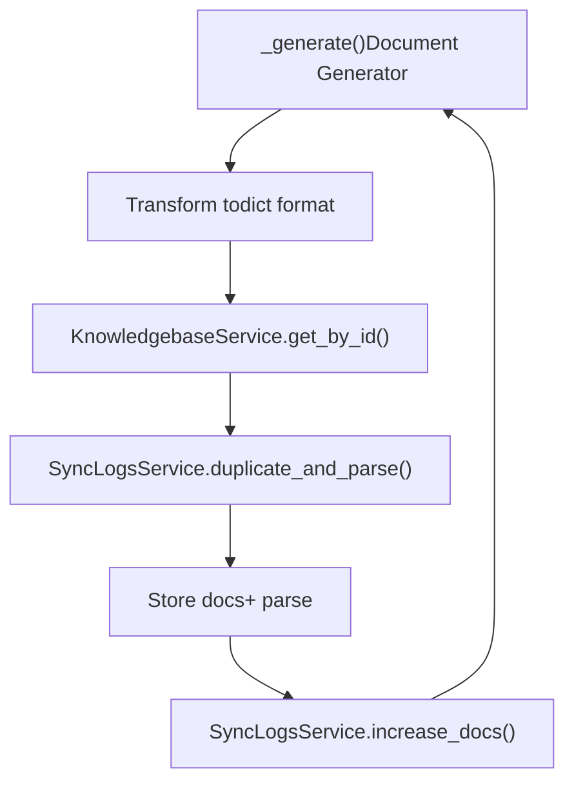
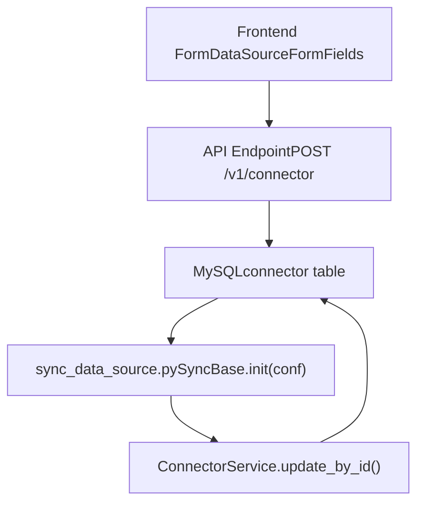
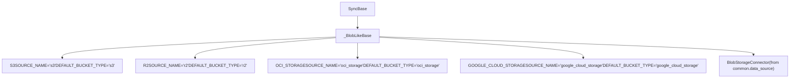
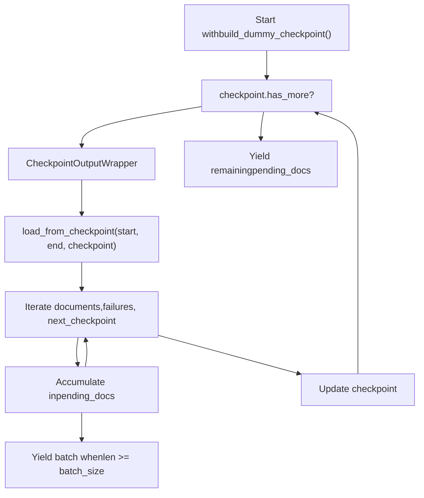
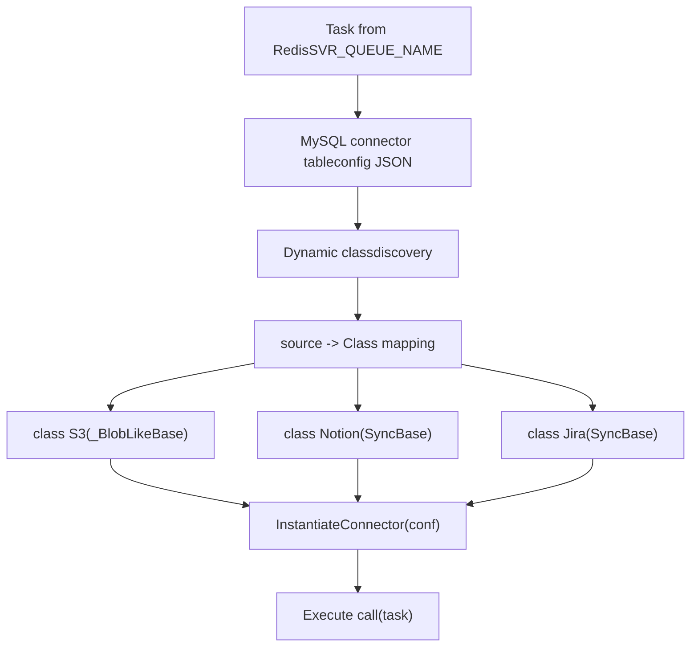
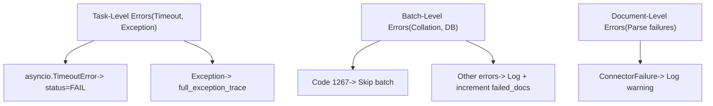

# Connector Architecture

Relevant source files

-   [api/apps/connector\_app.py](https://github.com/infiniflow/ragflow/blob/80a16e71/api/apps/connector_app.py)
-   [api/db/services/connector\_service.py](https://github.com/infiniflow/ragflow/blob/80a16e71/api/db/services/connector_service.py)
-   [api/utils/common.py](https://github.com/infiniflow/ragflow/blob/80a16e71/api/utils/common.py)
-   [common/constants.py](https://github.com/infiniflow/ragflow/blob/80a16e71/common/constants.py)
-   [common/data\_source/\_\_init\_\_.py](https://github.com/infiniflow/ragflow/blob/80a16e71/common/data_source/__init__.py)
-   [common/data\_source/config.py](https://github.com/infiniflow/ragflow/blob/80a16e71/common/data_source/config.py)
-   [docker/docker-compose-base.yml](https://github.com/infiniflow/ragflow/blob/80a16e71/docker/docker-compose-base.yml)
-   [docker/infinity\_conf.toml](https://github.com/infiniflow/ragflow/blob/80a16e71/docker/infinity_conf.toml)
-   [helm/values.yaml](https://github.com/infiniflow/ragflow/blob/80a16e71/helm/values.yaml)
-   [pyproject.toml](https://github.com/infiniflow/ragflow/blob/80a16e71/pyproject.toml)
-   [rag/svr/sync\_data\_source.py](https://github.com/infiniflow/ragflow/blob/80a16e71/rag/svr/sync_data_source.py)
-   [sdk/python/pyproject.toml](https://github.com/infiniflow/ragflow/blob/80a16e71/sdk/python/pyproject.toml)
-   [sdk/python/uv.lock](https://github.com/infiniflow/ragflow/blob/80a16e71/sdk/python/uv.lock)
-   [uv.lock](https://github.com/infiniflow/ragflow/blob/80a16e71/uv.lock)
-   [web/src/pages/user-setting/data-source/constant/index.tsx](https://github.com/infiniflow/ragflow/blob/80a16e71/web/src/pages/user-setting/data-source/constant/index.tsx)

This document describes the architecture of RAGFlow's data source connector system, which enables synchronization of documents from 40+ external platforms. It covers the `SyncBase` abstract class, connector inheritance patterns, configuration models, task execution flow, and the relationship between frontend configuration and backend processing.

For information about the synchronization scheduling and OAuth credential rotation, see [Synchronization and Scheduling](/infiniflow/ragflow/7.2-synchronization-and-scheduling). For a comprehensive list of all supported connectors with examples, see [Supported Data Sources](/infiniflow/ragflow/7.3-supported-data-sources).

---

## Overview and Core Abstraction

The connector system is built around the `SyncBase` abstract class, which defines a uniform interface for all data source integrations. Each connector implementation inherits from `SyncBase` and implements source-specific document retrieval logic.

**Diagram: Core Connector Architecture**

```mermaid
flowchart TD
    SyncBase["SyncBase(Abstract Base)"]
    BlobLikeBase["_BlobLikeBase(Blob Storage)"]
    S3["S3"]
    R2["R2"]
    OCI["OCI_STORAGE"]
    GCS["GOOGLE_CLOUD_STORAGE"]
    Confluence["Confluence"]
    Notion["Notion"]
    Discord["Discord"]
    Gmail["Gmail"]
    GoogleDrive["GoogleDrive"]
    Dropbox["Dropbox"]
    Jira["Jira"]
    Moodle["Moodle"]
    Box["Box"]
    Airtable["Airtable"]
    Asana["Asana"]
    GitHub["GitHub"]
    GitLab["GitLab"]
    IMAP["IMAP"]
    Bitbucket["Bitbucket"]
    Zendesk["Zendesk"]

    SyncBase --> BlobLikeBase
    SyncBase --> Confluence
    SyncBase --> Notion
    SyncBase --> Discord
    SyncBase --> Gmail
    SyncBase --> GoogleDrive
    SyncBase --> Dropbox
    SyncBase --> Jira
    SyncBase --> Moodle
    SyncBase --> Box
    SyncBase --> Airtable
    SyncBase --> Asana
    SyncBase --> GitHub
    SyncBase --> GitLab
    SyncBase --> IMAP
    SyncBase --> Bitbucket
    SyncBase --> Zendesk
    BlobLikeBase --> S3
    BlobLikeBase --> R2
    BlobLikeBase --> OCI
    BlobLikeBase --> GCS
```


Sources: [rag/svr/sync\_data\_source.py77-183](https://github.com/infiniflow/ragflow/blob/80a16e71/rag/svr/sync_data_source.py#L77-L183) [rag/svr/sync\_data\_source.py185-242](https://github.com/infiniflow/ragflow/blob/80a16e71/rag/svr/sync_data_source.py#L185-L242)

---

## SyncBase Abstract Class

The `SyncBase` class provides the foundational structure for all connectors. It defines the task execution lifecycle, error handling, and document processing pipeline.

### Class Structure

| Attribute/Method | Purpose |
| --- | --- |
| `SOURCE_NAME` | Class attribute identifying the connector type (e.g., `FileSource.S3`) |
| `__init__(conf: dict)` | Constructor accepting connector configuration |
| `__call__(task: dict)` | Entry point for async task execution |
| `_run_task_logic(task: dict)` | Core document processing logic |
| `_generate(task: dict)` | Abstract method returning document batch generator |
| `_get_source_prefix()` | Optional prefix for logging messages |

Sources: [rag/svr/sync\_data\_source.py77-183](https://github.com/infiniflow/ragflow/blob/80a16e71/rag/svr/sync_data_source.py#L77-L183)

### Task Execution Flow

**Diagram: SyncBase Task Execution Sequence**

> **[Mermaid sequence]**
> *(图表结构无法解析)*

Sources: [rag/svr/sync\_data\_source.py83-176](https://github.com/infiniflow/ragflow/blob/80a16e71/rag/svr/sync_data_source.py#L83-L176)

### Key Implementation Details

**Concurrency Control**: The system uses an asyncio `Semaphore` to limit concurrent connector tasks:

```
# Line 73-74
MAX_CONCURRENT_TASKS = int(os.environ.get("MAX_CONCURRENT_TASKS", "5"))
task_limiter = asyncio.Semaphore(MAX_CONCURRENT_TASKS)
```
**Timeout Management**: Each task has a configurable timeout enforced via `asyncio.wait_for`:

```
# Lines 88-92
await asyncio.wait_for(
    self._run_task_logic(task),
    timeout=task["timeout_secs"]
)
```
**Document Deduplication**: Documents are identified using `hash128` to prevent duplicates across syncs:

```
# Lines 130
"id": hash128(doc.id)
```
Sources: [rag/svr/sync\_data\_source.py73-74](https://github.com/infiniflow/ragflow/blob/80a16e71/rag/svr/sync_data_source.py#L73-L74) [rag/svr/sync\_data\_source.py86-105](https://github.com/infiniflow/ragflow/blob/80a16e71/rag/svr/sync_data_source.py#L86-L105) [rag/svr/sync\_data\_source.py128-141](https://github.com/infiniflow/ragflow/blob/80a16e71/rag/svr/sync_data_source.py#L128-L141)

---

## Document Batch Processing

The `_run_task_logic` method orchestrates document batch processing from the connector's generator through to storage.

### Processing Pipeline

**Diagram: Document Processing Pipeline**


### Document Format

Each document in the batch must have the following structure:

| Field | Type | Description |
| --- | --- | --- |
| `id` | string | Hash of original document ID (via `hash128`) |
| `connector_id` | string | Connector instance identifier |
| `source` | string | Source name from `SOURCE_NAME` |
| `semantic_identifier` | string | Human-readable identifier (e.g., file path) |
| `extension` | string | File extension |
| `size_bytes` | int | Document size in bytes |
| `doc_updated_at` | datetime | Last modification timestamp |
| `blob` | bytes | Raw document content |
| `metadata` | dict (optional) | Additional metadata |

Sources: [rag/svr/sync\_data\_source.py109-176](https://github.com/infiniflow/ragflow/blob/80a16e71/rag/svr/sync_data_source.py#L109-L176) [rag/svr/sync\_data\_source.py128-141](https://github.com/infiniflow/ragflow/blob/80a16e71/rag/svr/sync_data_source.py#L128-L141)

---

## Connector Configuration Model

Each connector instance is configured via a dictionary structure stored in the database. The configuration contains credentials, connection parameters, and sync options.

### Configuration Structure

**Diagram: Configuration Data Flow**


### Common Configuration Fields

| Field | Description | Example |
| --- | --- | --- |
| `credentials` | Authentication data | `{"access_token": "..."}` |
| `batch_size` | Documents per batch | `INDEX_BATCH_SIZE` (default: 2) |
| `timeout_secs` | Task timeout | Default from task config |
| `reindex` | Full vs incremental | `"0"` or `"1"` |
| `poll_range_start` | Incremental sync timestamp | `datetime` object |

Sources: [rag/svr/sync\_data\_source.py80-82](https://github.com/infiniflow/ragflow/blob/80a16e71/rag/svr/sync_data_source.py#L80-L82) [common/data\_source/config.py103](https://github.com/infiniflow/ragflow/blob/80a16e71/common/data_source/config.py#L103-L103)

---

## Blob Storage Connector Pattern

Blob storage connectors (S3, R2, OCI Storage, Google Cloud Storage) share common logic through the `_BlobLikeBase` intermediate class.

**Diagram: Blob Storage Connector Hierarchy**


### Implementation Details

The `_BlobLikeBase._generate()` method:

1.  Extracts `bucket_type`, `bucket_name`, and `prefix` from config
2.  Instantiates `BlobStorageConnector` with these parameters
3.  Loads credentials via `connector.load_credentials(conf["credentials"])`
4.  Returns either `load_from_state()` (full reindex) or `poll_source(start, end)` (incremental)

Sources: [rag/svr/sync\_data\_source.py185-221](https://github.com/infiniflow/ragflow/blob/80a16e71/rag/svr/sync_data_source.py#L185-L221) [rag/svr/sync\_data\_source.py224-242](https://github.com/infiniflow/ragflow/blob/80a16e71/rag/svr/sync_data_source.py#L224-L242)

---

## OAuth Credential Management

Connectors for services like Gmail, Google Drive, and Box support OAuth authentication with automatic token refresh.

### OAuth Token Refresh Flow

**Diagram: OAuth Credential Rotation**

> **[Mermaid sequence]**
> *(图表结构无法解析)*

### Example: Gmail Credential Refresh

```
# Lines 398-418 in rag/svr/sync_data_source.py
new_credentials = self.connector.load_credentials(credentials)
if new_credentials:
    try:
        updated_conf = copy.deepcopy(self.conf)
        updated_conf["credentials"] = new_credentials
        ConnectorService.update_by_id(
            task["connector_id"],
            {"config": updated_conf}
        )
        self.conf = updated_conf
        logging.info("Persisted refreshed Gmail credentials...")
    except Exception:
        logging.exception("Failed to persist refreshed credentials...")
```
This pattern is also used in:

-   **Google Drive**: [rag/svr/sync\_data\_source.py489-492](https://github.com/infiniflow/ragflow/blob/80a16e71/rag/svr/sync_data_source.py#L489-L492) [rag/svr/sync\_data\_source.py546-554](https://github.com/infiniflow/ragflow/blob/80a16e71/rag/svr/sync_data_source.py#L546-L554)
-   **Box**: Similar implementation expected

Sources: [rag/svr/sync\_data\_source.py398-418](https://github.com/infiniflow/ragflow/blob/80a16e71/rag/svr/sync_data_source.py#L398-L418) [rag/svr/sync\_data\_source.py546-554](https://github.com/infiniflow/ragflow/blob/80a16e71/rag/svr/sync_data_source.py#L546-L554)

---

## Synchronization Modes

Connectors support two synchronization modes controlled by the `reindex` flag and `poll_range_start` timestamp.

### Mode Selection Logic

| Condition | Mode | Generator Method |
| --- | --- | --- |
| `task["reindex"] == "1"` | Full reindex | `connector.load_from_state()` |
| `not task["poll_range_start"]` | Initial sync (full) | `connector.load_from_state()` |
| `poll_range_start` exists | Incremental sync | `connector.poll_source(start, end)` |

### Example: Dropbox Connector

```
# Lines 455-463 in rag/svr/sync_data_source.py
if task["reindex"] == "1" or not task["poll_range_start"]:
    document_generator = self.connector.load_from_state()
    begin_info = "totally"
else:
    poll_start = task["poll_range_start"]
    document_generator = self.connector.poll_source(
        poll_start.timestamp(),
        datetime.now(timezone.utc).timestamp()
    )
    begin_info = f"from {poll_start}"
```
Sources: [rag/svr/sync\_data\_source.py421-438](https://github.com/infiniflow/ragflow/blob/80a16e71/rag/svr/sync_data_source.py#L421-L438) [rag/svr/sync\_data\_source.py455-463](https://github.com/infiniflow/ragflow/blob/80a16e71/rag/svr/sync_data_source.py#L455-L463) [rag/svr/sync\_data\_source.py494-501](https://github.com/infiniflow/ragflow/blob/80a16e71/rag/svr/sync_data_source.py#L494-L501)

---

## Checkpoint-Based Connectors

Some connectors (Confluence, Google Drive) implement checkpoint-based pagination for large-scale incremental syncs.

### Checkpoint Pattern

**Diagram: Checkpoint-Based Document Retrieval**


### Example: Confluence Connector

```
# Lines 300-327 in rag/svr/sync_data_source.py
def document_batches():
    checkpoint = self.connector.build_dummy_checkpoint()
    pending_docs = []
    iterations = 0
    iteration_limit = 100_000

    while checkpoint.has_more:
        wrapper = CheckpointOutputWrapper()
        doc_generator = wrapper(
            self.connector.load_from_checkpoint(start_time, end_time, checkpoint)
        )
        for document, failure, next_checkpoint in doc_generator:
            if failure is not None:
                logging.warning("Confluence connector failure: %s", failure)
                continue
            if document is not None:
                pending_docs.append(document)
                if len(pending_docs) >= batch_size:
                    yield pending_docs
                    pending_docs = []
            if next_checkpoint is not None:
                checkpoint = next_checkpoint

        iterations += 1
        if iterations > iteration_limit:
            raise RuntimeError("Too many iterations...")

    if pending_docs:
        yield pending_docs
```
Sources: [rag/svr/sync\_data\_source.py300-327](https://github.com/infiniflow/ragflow/blob/80a16e71/rag/svr/sync_data_source.py#L300-L327) [rag/svr/sync\_data\_source.py510-537](https://github.com/infiniflow/ragflow/blob/80a16e71/rag/svr/sync_data_source.py#L510-L537)

---

## Frontend-Backend Configuration Mapping

The frontend data source configuration forms map directly to the backend connector configuration structure.

### Configuration Mapping Table

| Frontend Field Name | Backend Config Path | Example Connector |
| --- | --- | --- |
| `config.credentials.aws_access_key_id` | `conf["credentials"]["aws_access_key_id"]` | S3 |
| `config.bucket_name` | `conf["bucket_name"]` | S3, R2, GCS, OCI |
| `config.root_page_id` | `conf["root_page_id"]` | Notion |
| `config.wiki_base` | `conf["wiki_base"]` | Confluence |
| `config.credentials.google_tokens` | `conf["credentials"]["google_tokens"]` | Gmail, Google Drive |
| `config.base_url` | `conf["base_url"]` | Jira, WebDAV |
| `config.batch_size` | `conf["batch_size"]` | Multiple connectors |

### Data Source Enum Alignment

**Frontend DataSourceKey** (`web/src/pages/user-setting/data-source/constant/index.tsx`):

```
export enum DataSourceKey {
  CONFLUENCE = 'confluence',
  S3 = 's3',
  NOTION = 'notion',
  // ... 37+ more sources
}
```
**Backend FileSource** (`common/constants.py`):

```
class FileSource(StrEnum):
    LOCAL = ""
    S3 = "s3"
    NOTION = "notion"
    CONFLUENCE = "confluence"
    # ... matching sources
```
**Backend Connector Classes** (`rag/svr/sync_data_source.py`):

```
class S3(_BlobLikeBase):
    SOURCE_NAME: str = FileSource.S3

class Notion(SyncBase):
    SOURCE_NAME: str = FileSource.NOTION

class Confluence(SyncBase):
    SOURCE_NAME: str = FileSource.CONFLUENCE
```
Sources: [web/src/pages/user-setting/data-source/constant/index.tsx16-41](https://github.com/infiniflow/ragflow/blob/80a16e71/web/src/pages/user-setting/data-source/constant/index.tsx#L16-L41) [common/constants.py111-137](https://github.com/infiniflow/ragflow/blob/80a16e71/common/constants.py#L111-L137) [rag/svr/sync\_data\_source.py224-334](https://github.com/infiniflow/ragflow/blob/80a16e71/rag/svr/sync_data_source.py#L224-L334)

---

## Connector Registry and Discovery

The connector system uses dynamic discovery based on class names matching data source types.

**Diagram: Connector Instantiation Flow**


### Available Connectors

| Category | Connectors | Base Class |
| --- | --- | --- |
| Blob Storage | S3, R2, OCI\_STORAGE, GOOGLE\_CLOUD\_STORAGE | `_BlobLikeBase` |
| Collaboration | Confluence, Notion, Slack, Discord | `SyncBase` |
| Email | Gmail, IMAP | `SyncBase` |
| Cloud Drives | Google Drive, Dropbox, Box | `SyncBase` |
| Dev Tools | Jira, GitHub, GitLab, Bitbucket | `SyncBase` |
| Learning | Moodle | `SyncBase` |
| Productivity | Airtable, Asana, Zendesk | `SyncBase` |
| File Servers | WebDAV | `SyncBase` |

Sources: [rag/svr/sync\_data\_source.py224-800](https://github.com/infiniflow/ragflow/blob/80a16e71/rag/svr/sync_data_source.py#L224-L800) [common/data\_source/\_\_init\_\_.py26-80](https://github.com/infiniflow/ragflow/blob/80a16e71/common/data_source/__init__.py#L26-L80)

---

## Error Handling and Retry Logic

The connector system implements multi-layer error handling to ensure robust synchronization.

### Error Handling Layers

**Diagram: Error Handling Strategy**


### Error Handling Examples

**Task-level timeout**:

```
# Lines 90-92
except asyncio.TimeoutError:
    msg = f"Task timeout after {task['timeout_secs']} seconds"
    SyncLogsService.update_by_id(task["id"], {"status": TaskStatus.FAIL, "error_msg": msg})
```
**Batch-level collation error**:

```
# Lines 157-166
except Exception as batch_ex:
    msg = str(batch_ex)
    code = getattr(batch_ex, "args", [None])[0]

    if code == 1267 or "collation" in msg.lower():
        logging.warning(f"Skipping {len(docs)} document(s) due to collation conflict")
    else:
        logging.error(f"Error processing batch: {msg}")

    failed_docs += len(docs)
```
**Document-level failure**:

```
# Lines 309-312 (Confluence example)
if failure is not None:
    logging.warning("Confluence connector failure: %s",
                    getattr(failure, "failure_message", failure))
    continue
```
Sources: [rag/svr/sync\_data\_source.py86-105](https://github.com/infiniflow/ragflow/blob/80a16e71/rag/svr/sync_data_source.py#L86-L105) [rag/svr/sync\_data\_source.py157-167](https://github.com/infiniflow/ragflow/blob/80a16e71/rag/svr/sync_data_source.py#L157-L167) [rag/svr/sync\_data\_source.py309-312](https://github.com/infiniflow/ragflow/blob/80a16e71/rag/svr/sync_data_source.py#L309-L312)

---

## Environment Configuration

Connector behavior can be tuned via environment variables.

### Key Environment Variables

| Variable | Default | Purpose |
| --- | --- | --- |
| `MAX_CONCURRENT_TASKS` | `5` | Max parallel connector tasks |
| `INDEX_BATCH_SIZE` | `2` | Documents per batch |
| `REQUEST_TIMEOUT_SECONDS` | `60` | HTTP request timeout |
| `CONFLUENCE_TIMEZONE_OFFSET` | `get_current_tz_offset()` | Time zone for Confluence |
| `JIRA_TIMEZONE_OFFSET` | `get_current_tz_offset()` | Time zone for Jira |
| `GOOGLE_DRIVE_CONNECTOR_SIZE_THRESHOLD` | `10 * 1024 * 1024` | Max file size (10MB) |
| `AIRTABLE_CONNECTOR_SIZE_THRESHOLD` | `10 * 1024 * 1024` | Max file size (10MB) |

Sources: [rag/svr/sync\_data\_source.py73](https://github.com/infiniflow/ragflow/blob/80a16e71/rag/svr/sync_data_source.py#L73-L73) [common/data\_source/config.py17](https://github.com/infiniflow/ragflow/blob/80a16e71/common/data_source/config.py#L17-L17) [common/data\_source/config.py103](https://github.com/infiniflow/ragflow/blob/80a16e71/common/data_source/config.py#L103-L103) [common/data\_source/config.py188-213](https://github.com/infiniflow/ragflow/blob/80a16e71/common/data_source/config.py#L188-L213)

---

## Logging and Monitoring

The connector system provides detailed logging through `SyncLogsService` for monitoring synchronization progress and failures.

### Sync Log Operations

| Method | Purpose | Key Fields Updated |
| --- | --- | --- |
| `SyncLogsService.start()` | Begin sync task | `status=RUNNING`, start timestamp |
| `SyncLogsService.increase_docs()` | Update progress per batch | `doc_num`, `error_msg`, `failed_docs` |
| `SyncLogsService.done()` | Mark completion | `status=DONE`, end timestamp |
| `SyncLogsService.schedule()` | Schedule next run | `poll_range_start` for next sync |
| `SyncLogsService.update_by_id()` | Error updates | `status=FAIL`, `error_msg`, `full_exception_trace` |

### Log Message Format

Connectors use the `_get_source_prefix()` method to add context to log messages:

```
# Lines 169-173
prefix = self._get_source_prefix()
if failed_docs > 0:
    logging.info(f"{prefix}{doc_num} docs synchronized till {next_update} ({failed_docs} skipped)")
else:
    logging.info(f"{prefix}{doc_num} docs synchronized till {next_update}")
```
Example output:

```
Connect to Confluence: https://example.atlassian.net from 2024-01-15 12:00:00
[Jira]50 docs synchronized till 2024-01-15 13:00:00 (3 skipped)
```
Sources: [rag/svr/sync\_data\_source.py84](https://github.com/infiniflow/ragflow/blob/80a16e71/rag/svr/sync_data_source.py#L84-L84) [rag/svr/sync\_data\_source.py107](https://github.com/infiniflow/ragflow/blob/80a16e71/rag/svr/sync_data_source.py#L107-L107) [rag/svr/sync\_data\_source.py150-153](https://github.com/infiniflow/ragflow/blob/80a16e71/rag/svr/sync_data_source.py#L150-L153) [rag/svr/sync\_data\_source.py169-175](https://github.com/infiniflow/ragflow/blob/80a16e71/rag/svr/sync_data_source.py#L169-L175)

---

## Summary

The RAGFlow connector architecture provides a unified, extensible framework for integrating 40+ external data sources. Key design principles include:

1.  **Abstract Base Pattern**: `SyncBase` defines common task execution, error handling, and document processing
2.  **Polymorphic Generation**: Each connector implements `_generate()` to yield source-specific document batches
3.  **Configuration-Driven**: All connector behavior is controlled via JSON configuration stored in the database
4.  **OAuth Support**: Automatic token refresh for services requiring OAuth authentication
5.  **Dual Sync Modes**: Full reindex and incremental polling based on timestamps
6.  **Checkpoint Pagination**: Support for large-scale syncs with resumable checkpoints
7.  **Robust Error Handling**: Multi-layer error handling with detailed logging and failure tracking
8.  **Concurrency Control**: Semaphore-based limiting to prevent resource exhaustion

This architecture enables RAGFlow to ingest documents from diverse platforms while maintaining a consistent processing pipeline and user experience.

Sources: [rag/svr/sync\_data\_source.py1-800](https://github.com/infiniflow/ragflow/blob/80a16e71/rag/svr/sync_data_source.py#L1-L800) [common/data\_source/\_\_init\_\_.py1-81](https://github.com/infiniflow/ragflow/blob/80a16e71/common/data_source/__init__.py#L1-L81) [common/data\_source/config.py1-303](https://github.com/infiniflow/ragflow/blob/80a16e71/common/data_source/config.py#L1-L303) [common/constants.py111-137](https://github.com/infiniflow/ragflow/blob/80a16e71/common/constants.py#L111-L137)
