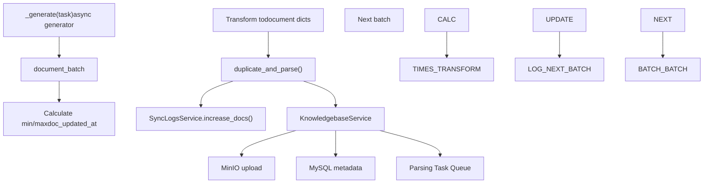
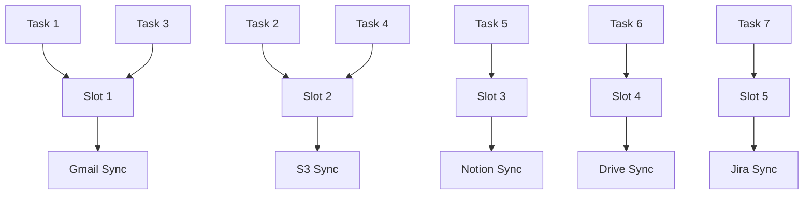

# Synchronization and Scheduling

Relevant source files

-   [api/apps/chunk\_app.py](https://github.com/infiniflow/ragflow/blob/80a16e71/api/apps/chunk_app.py)
-   [api/apps/connector\_app.py](https://github.com/infiniflow/ragflow/blob/80a16e71/api/apps/connector_app.py)
-   [api/apps/conversation\_app.py](https://github.com/infiniflow/ragflow/blob/80a16e71/api/apps/conversation_app.py)
-   [api/apps/document\_app.py](https://github.com/infiniflow/ragflow/blob/80a16e71/api/apps/document_app.py)
-   [api/apps/file2document\_app.py](https://github.com/infiniflow/ragflow/blob/80a16e71/api/apps/file2document_app.py)
-   [api/apps/file\_app.py](https://github.com/infiniflow/ragflow/blob/80a16e71/api/apps/file_app.py)
-   [api/apps/kb\_app.py](https://github.com/infiniflow/ragflow/blob/80a16e71/api/apps/kb_app.py)
-   [api/db/db\_models.py](https://github.com/infiniflow/ragflow/blob/80a16e71/api/db/db_models.py)
-   [api/db/services/connector\_service.py](https://github.com/infiniflow/ragflow/blob/80a16e71/api/db/services/connector_service.py)
-   [api/db/services/dialog\_service.py](https://github.com/infiniflow/ragflow/blob/80a16e71/api/db/services/dialog_service.py)
-   [api/db/services/document\_service.py](https://github.com/infiniflow/ragflow/blob/80a16e71/api/db/services/document_service.py)
-   [api/db/services/file\_service.py](https://github.com/infiniflow/ragflow/blob/80a16e71/api/db/services/file_service.py)
-   [api/db/services/knowledgebase\_service.py](https://github.com/infiniflow/ragflow/blob/80a16e71/api/db/services/knowledgebase_service.py)
-   [api/db/services/task\_service.py](https://github.com/infiniflow/ragflow/blob/80a16e71/api/db/services/task_service.py)
-   [api/utils/common.py](https://github.com/infiniflow/ragflow/blob/80a16e71/api/utils/common.py)
-   [common/constants.py](https://github.com/infiniflow/ragflow/blob/80a16e71/common/constants.py)
-   [common/data\_source/\_\_init\_\_.py](https://github.com/infiniflow/ragflow/blob/80a16e71/common/data_source/__init__.py)
-   [common/data\_source/config.py](https://github.com/infiniflow/ragflow/blob/80a16e71/common/data_source/config.py)
-   [docker/docker-compose-base.yml](https://github.com/infiniflow/ragflow/blob/80a16e71/docker/docker-compose-base.yml)
-   [docker/infinity\_conf.toml](https://github.com/infiniflow/ragflow/blob/80a16e71/docker/infinity_conf.toml)
-   [helm/values.yaml](https://github.com/infiniflow/ragflow/blob/80a16e71/helm/values.yaml)
-   [pyproject.toml](https://github.com/infiniflow/ragflow/blob/80a16e71/pyproject.toml)
-   [rag/nlp/search.py](https://github.com/infiniflow/ragflow/blob/80a16e71/rag/nlp/search.py)
-   [rag/svr/sync\_data\_source.py](https://github.com/infiniflow/ragflow/blob/80a16e71/rag/svr/sync_data_source.py)
-   [rag/svr/task\_executor.py](https://github.com/infiniflow/ragflow/blob/80a16e71/rag/svr/task_executor.py)
-   [sdk/python/pyproject.toml](https://github.com/infiniflow/ragflow/blob/80a16e71/sdk/python/pyproject.toml)
-   [sdk/python/uv.lock](https://github.com/infiniflow/ragflow/blob/80a16e71/sdk/python/uv.lock)
-   [uv.lock](https://github.com/infiniflow/ragflow/blob/80a16e71/uv.lock)
-   [web/src/pages/user-setting/data-source/constant/index.tsx](https://github.com/infiniflow/ragflow/blob/80a16e71/web/src/pages/user-setting/data-source/constant/index.tsx)

This document describes the data source synchronization and scheduling system in RAGFlow, which handles periodic ingestion of documents from external data sources (S3, Notion, Gmail, etc.) into datasets. For information about the document processing pipeline that occurs after synchronization, see [Document Processing Pipeline](/infiniflow/ragflow/6-document-processing-pipeline). For information about the individual data source connectors themselves, see [Supported Data Sources](/infiniflow/ragflow/7.3-supported-data-sources).

## Overview

The synchronization system enables RAGFlow to automatically pull documents from 20+ external data sources on a scheduled basis. It supports both full synchronization (reindex) and incremental synchronization (polling for changes since the last sync), with concurrent task execution, timeout management, and progress tracking.

**Key responsibilities:**

-   Execute synchronization tasks from external data sources
-   Support incremental polling based on document modification timestamps
-   Manage concurrent task execution with semaphore-based limiting
-   Track synchronization progress and errors via `SyncLogsService`
-   Schedule the next synchronization cycle after completion
-   Handle credential refresh for OAuth-based connectors

**Sources:** [rag/svr/sync\_data\_source.py1-891](https://github.com/infiniflow/ragflow/blob/80a16e71/rag/svr/sync_data_source.py#L1-L891)

## Synchronization Architecture


The synchronization architecture consists of four layers:

1.  **Task Orchestration**: Controls concurrent execution using `asyncio.Semaphore` with a configurable limit (default 5 concurrent tasks)
2.  **Connector Layer**: Implements source-specific sync logic inheriting from `SyncBase`
3.  **Data Source Adapters**: Low-level connectors that interact with external APIs
4.  **Storage Layer**: Persists sync state, logs, and downloaded files

**Sources:** [rag/svr/sync\_data\_source.py70-179](https://github.com/infiniflow/ragflow/blob/80a16e71/rag/svr/sync_data_source.py#L70-L179) [rag/svr/sync\_data\_source.py22-34](https://github.com/infiniflow/ragflow/blob/80a16e71/rag/svr/sync_data_source.py#L22-L34)

## Task Lifecycle and State Management

> **[Mermaid stateDiagram]**
> *(图表结构无法解析)*

**Task Status Enum** (from [common/constants.py80-90](https://github.com/infiniflow/ragflow/blob/80a16e71/common/constants.py#L80-L90)):

-   `UNSTART = "0"`: Task created but not yet started
-   `RUNNING = "1"`: Currently executing
-   `CANCEL = "2"`: Cancelled by user
-   `DONE = "3"`: Completed successfully
-   `FAIL = "4"`: Failed with error
-   `SCHEDULE = "5"`: Scheduled for future execution

**Task Execution Flow** ([rag/svr/sync\_data\_source.py80-104](https://github.com/infiniflow/ragflow/blob/80a16e71/rag/svr/sync_data_source.py#L80-L104)):

1.  **Start**: `SyncLogsService.start(task["id"], task["connector_id"])` marks task as running
2.  **Execute**: `_run_task_logic(task)` with timeout from `task["timeout_secs"]`
3.  **Handle Timeout**: If `asyncio.TimeoutError`, mark as FAIL with timeout message
4.  **Handle Exceptions**: Capture full traceback and error message
5.  **Complete**: `SyncLogsService.done()` marks as DONE and `SyncLogsService.schedule()` schedules next run

**Sources:** [rag/svr/sync\_data\_source.py80-104](https://github.com/infiniflow/ragflow/blob/80a16e71/rag/svr/sync_data_source.py#L80-L104) [common/constants.py80-90](https://github.com/infiniflow/ragflow/blob/80a16e71/common/constants.py#L80-L90)

## Incremental vs Full Synchronization

The system supports two synchronization modes determined by the `reindex` flag and `poll_range_start` timestamp:

| Mode | Condition | Behavior | API Method |
| --- | --- | --- | --- |
| **Full Sync** | `reindex == "1"` OR `poll_range_start == None` | Retrieves all documents from source | `connector.load_from_state()` |
| **Incremental Sync** | `reindex != "1"` AND `poll_range_start != None` | Retrieves only documents modified since `poll_range_start` | `connector.poll_source(start_time, end_time)` |

### Full Synchronization Example

> **[Mermaid sequence]**
> *(图表结构无法解析)*

### Incremental Synchronization Example

> **[Mermaid sequence]**
> *(图表结构无法解析)*

**Implementation Example** ([rag/svr/sync\_data\_source.py185-218](https://github.com/infiniflow/ragflow/blob/80a16e71/rag/svr/sync_data_source.py#L185-L218)):

```
# Determine sync mode
if task["reindex"] == "1" or not task["poll_range_start"]:
    # Full sync
    document_batch_generator = self.connector.load_from_state()
    begin_info = "totally"
else:
    # Incremental sync
    document_batch_generator = self.connector.poll_source(
        task["poll_range_start"].timestamp(),
        datetime.now(timezone.utc).timestamp(),
    )
    begin_info = f"from {task['poll_range_start']}"
```
**Sources:** [rag/svr/sync\_data\_source.py185-218](https://github.com/infiniflow/ragflow/blob/80a16e71/rag/svr/sync_data_source.py#L185-L218) [rag/svr/sync\_data\_source.py279-288](https://github.com/infiniflow/ragflow/blob/80a16e71/rag/svr/sync_data_source.py#L279-L288)

## Document Batch Processing

The synchronization system processes documents in batches to manage memory and enable incremental progress tracking:


**Batch Processing Logic** ([rag/svr/sync\_data\_source.py116-173](https://github.com/infiniflow/ragflow/blob/80a16e71/rag/svr/sync_data_source.py#L116-L173)):

1.  **Iterate Document Batches**: Loop through `async for document_batch in document_batch_generator`

2.  **Track Update Times**: Calculate `min_update` and `max_update` from `doc.doc_updated_at` timestamps

3.  **Transform Documents**: Convert connector `Document` objects to dictionary format with fields:

    -   `id`: Unique document identifier
    -   `connector_id`: Source connector ID
    -   `source`: Source type (e.g., "s3", "notion")
    -   `semantic_identifier`: Human-readable name
    -   `extension`: File extension
    -   `size_bytes`: File size
    -   `doc_updated_at`: Modification timestamp
    -   `blob`: Binary content
    -   `metadata`: Optional metadata dictionary
4.  **Deduplicate and Parse**: Call `SyncLogsService.duplicate_and_parse()` which:

    -   Checks for duplicate documents
    -   Uploads files to MinIO
    -   Creates document records in MySQL
    -   Queues parsing tasks if `auto_parse=True`
5.  **Update Progress**: `SyncLogsService.increase_docs()` records:

    -   Document count
    -   Time range processed (`min_update`, `max_update`)
    -   Error messages
    -   Failed document count
6.  **Track Checkpoint**: Update `next_update = max(next_update, max_update)` to maintain sync position


**Collation Conflict Handling** ([rag/svr/sync\_data\_source.py154-164](https://github.com/infiniflow/ragflow/blob/80a16e71/rag/svr/sync_data_source.py#L154-L164)): The system handles MySQL collation errors (error code 1267) by skipping affected documents rather than failing the entire sync.

**Sources:** [rag/svr/sync\_data\_source.py106-173](https://github.com/infiniflow/ragflow/blob/80a16e71/rag/svr/sync_data_source.py#L106-L173)

## Connector Implementation Pattern

All data source connectors follow a common implementation pattern by inheriting from `SyncBase`:


**Implementation Requirements** ([rag/svr/sync\_data\_source.py74-179](https://github.com/infiniflow/ragflow/blob/80a16e71/rag/svr/sync_data_source.py#L74-L179)):

1.  **Define `SOURCE_NAME`**: Constant identifying the data source (must match `FileSource` enum)

2.  **Implement `_generate(task)`**: Async generator method that:

    -   Instantiates the low-level connector (`self.connector`)
    -   Loads credentials from `self.conf["credentials"]`
    -   Determines sync mode (full vs incremental)
    -   Logs connection info
    -   Returns document batch generator
3.  **Optional: Override `_get_source_prefix()`**: Customize log message prefix (e.g., "\[Jira\]")


**Example Implementation** ([rag/svr/sync\_data\_source.py221-228](https://github.com/infiniflow/ragflow/blob/80a16e71/rag/svr/sync_data_source.py#L221-L228)):

```
class S3(_BlobLikeBase):
    SOURCE_NAME: str = FileSource.S3
    DEFAULT_BUCKET_TYPE: str = "s3"
```
**OAuth Credential Refresh Pattern** ([rag/svr/sync\_data\_source.py396-415](https://github.com/infiniflow/ragflow/blob/80a16e71/rag/svr/sync_data_source.py#L396-L415)):

For OAuth-based connectors (Gmail, Google Drive, Box), credentials may be refreshed during synchronization:

```
new_credentials = self.connector.load_credentials(credentials)
if new_credentials:
    # Persist rotated credentials back to database
    updated_conf = copy.deepcopy(self.conf)
    updated_conf["credentials"] = new_credentials
    ConnectorService.update_by_id(task["connector_id"], {"config": updated_conf})
    self.conf = updated_conf
```
**Sources:** [rag/svr/sync\_data\_source.py74-179](https://github.com/infiniflow/ragflow/blob/80a16e71/rag/svr/sync_data_source.py#L74-L179) [rag/svr/sync\_data\_source.py221-228](https://github.com/infiniflow/ragflow/blob/80a16e71/rag/svr/sync_data_source.py#L221-L228) [rag/svr/sync\_data\_source.py396-415](https://github.com/infiniflow/ragflow/blob/80a16e71/rag/svr/sync_data_source.py#L396-L415)

## Checkpoint-Based Synchronization

Some connectors (Confluence, Google Drive) use checkpoint-based pagination to handle large document sets:

```mermaid
flowchart TD
    START["Start Sync"]
    BUILD_CHECKPOINT["connector.build_dummy_checkpoint()has_more=True"]
    LOAD_CHECKPOINT["load_from_checkpoint(start_time, end_time, checkpoint)"]
    WRAPPER["CheckpointOutputWrapper"]
    YIELD_DOC["Yield document"]
    UPDATE_CHECKPOINT["checkpoint = next_checkpoint"]
    CHECK_MORE["checkpoint.has_more?"]
    YIELD_BATCH["Yield document batch"]
    END["End Sync"]

    START --> BUILD_CHECKPOINT
    BUILD --> CHECKPOINT_LOAD_CHECKPOINT
    LOAD --> CHECKPOINT_WRAPPER
    WRAPPER --> YIELD_DOC
    YIELD --> DOC_UPDATE_CHECKPOINT
    UPDATE --> CHECKPOINT_CHECK_MORE
    CHECK --> MORE_LOAD_CHECKPOINT
    CHECK --> MORE_YIELD_BATCH
    YIELD --> BATCH_END
```


**Checkpoint Implementation** ([rag/svr/sync\_data\_source.py507-534](https://github.com/infiniflow/ragflow/blob/80a16e71/rag/svr/sync_data_source.py#L507-L534)):

```
def document_batches():
    checkpoint = self.connector.build_dummy_checkpoint()
    pending_docs = []
    iterations = 0
    iteration_limit = 100_000

    while checkpoint.has_more:
        wrapper = CheckpointOutputWrapper()
        doc_generator = wrapper(self.connector.load_from_checkpoint(
            start_time, end_time, checkpoint
        ))
        for document, failure, next_checkpoint in doc_generator:
            if failure is not None:
                logging.warning("Connector failure: %s", failure)
                continue
            if document is not None:
                pending_docs.append(document)
                if len(pending_docs) >= batch_size:
                    yield pending_docs
                    pending_docs = []
            if next_checkpoint is not None:
                checkpoint = next_checkpoint

        iterations += 1
        if iterations > iteration_limit:
            raise RuntimeError("Too many iterations")

    if pending_docs:
        yield pending_docs
```
**Checkpoint Benefits:**

-   **Memory Efficiency**: Processes large document sets without loading all metadata into memory
-   **Resumability**: Checkpoint state could theoretically be persisted for crash recovery
-   **Progress Tracking**: Each checkpoint advance represents progress through the document set
-   **Batch Control**: Configurable `batch_size` controls documents per batch (from config `sync_batch_size` or `batch_size`, default `INDEX_BATCH_SIZE=2`)

**Sources:** [rag/svr/sync\_data\_source.py497-541](https://github.com/infiniflow/ragflow/blob/80a16e71/rag/svr/sync_data_source.py#L497-L541) [common/data\_source/config.py103](https://github.com/infiniflow/ragflow/blob/80a16e71/common/data_source/config.py#L103-L103) [common/data\_source/interfaces.py1-50](https://github.com/infiniflow/ragflow/blob/80a16e71/common/data_source/interfaces.py#L1-L50)

## Scheduling and Next Sync Calculation

After successful task completion, the system automatically schedules the next synchronization:

> **[Mermaid sequence]**
> *(图表结构无法解析)*

**Next Sync Timestamp Calculation** ([rag/svr/sync\_data\_source.py106-173](https://github.com/infiniflow/ragflow/blob/80a16e71/rag/svr/sync_data_source.py#L106-L173)):

1.  **Initialize**: `next_update = datetime(1970, 1, 1, tzinfo=timezone.utc)` or `task["poll_range_start"]`
2.  **Update Per Batch**: For each document batch:

    ```
    min_update = min(doc.doc_updated_at for doc in document_batch)
    max_update = max(doc.doc_updated_at for doc in document_batch)
    next_update = max(next_update, max_update)
    ```

3.  **Finalize**: After all batches, `task["poll_range_start"] = next_update`
4.  **Schedule**: `SyncLogsService.schedule(connector_id, kb_id, next_update)` creates next task

**Scheduling Call** ([rag/svr/sync\_data\_source.py104](https://github.com/infiniflow/ragflow/blob/80a16e71/rag/svr/sync_data_source.py#L104-L104)):

```
SyncLogsService.schedule(task["connector_id"], task["kb_id"], task["poll_range_start"])
```
This ensures the next incremental sync will only retrieve documents modified after the latest document processed in this sync.

**Sources:** [rag/svr/sync\_data\_source.py104](https://github.com/infiniflow/ragflow/blob/80a16e71/rag/svr/sync_data_source.py#L104-L104) [rag/svr/sync\_data\_source.py110-173](https://github.com/infiniflow/ragflow/blob/80a16e71/rag/svr/sync_data_source.py#L110-L173)

## Concurrency Control

The synchronization system limits concurrent task execution to prevent resource exhaustion:

**Semaphore Configuration** ([rag/svr/sync\_data\_source.py70-72](https://github.com/infiniflow/ragflow/blob/80a16e71/rag/svr/sync_data_source.py#L70-L72)):

```
MAX_CONCURRENT_TASKS = int(os.environ.get("MAX_CONCURRENT_TASKS", "5"))
task_limiter = asyncio.Semaphore(MAX_CONCURRENT_TASKS)
```
**Semaphore Usage** ([rag/svr/sync\_data\_source.py83-102](https://github.com/infiniflow/ragflow/blob/80a16e71/rag/svr/sync_data_source.py#L83-L102)):

```
async with task_limiter:
    try:
        await asyncio.wait_for(
            self._run_task_logic(task),
            timeout=task["timeout_secs"]
        )
    except asyncio.TimeoutError:
        # Handle timeout
    except Exception as ex:
        # Handle error
```
**Concurrency Architecture:**


**Configuration:** Set `MAX_CONCURRENT_TASKS` environment variable to adjust concurrency (default: 5)

**Sources:** [rag/svr/sync\_data\_source.py70-72](https://github.com/infiniflow/ragflow/blob/80a16e71/rag/svr/sync_data_source.py#L70-L72) [rag/svr/sync\_data\_source.py83-102](https://github.com/infiniflow/ragflow/blob/80a16e71/rag/svr/sync_data_source.py#L83-L102)

## Error Handling and Progress Tracking

The system provides comprehensive error handling and progress tracking through `SyncLogsService`:

**Error Categories:**

| Error Type | Handling | Status |
| --- | --- | --- |
| Timeout (`asyncio.TimeoutError`) | Log message, mark as FAIL | `TaskStatus.FAIL` |
| General Exception | Capture full traceback, mark as FAIL | `TaskStatus.FAIL` |
| Batch Processing Error | Skip batch, increment `failed_docs`, continue | Continue processing |
| Collation Error (MySQL 1267) | Skip documents, log warning | Continue processing |

**Progress Tracking Methods** ([rag/svr/sync\_data\_source.py81-173](https://github.com/infiniflow/ragflow/blob/80a16e71/rag/svr/sync_data_source.py#L81-L173)):

1.  **`SyncLogsService.start(task_id, connector_id)`**: Marks task as RUNNING
2.  **`SyncLogsService.increase_docs(task_id, min_update, max_update, doc_count, error_msg, error_count)`**: Updates progress per batch
3.  **`SyncLogsService.done(task_id, connector_id)`**: Marks task as DONE
4.  **`SyncLogsService.update_by_id(task_id, updates)`**: Updates status/error on failure
5.  **`SyncLogsService.schedule(connector_id, kb_id, poll_range_start)`**: Schedules next sync

**Exception Capture** ([rag/svr/sync\_data\_source.py92-102](https://github.com/infiniflow/ragflow/blob/80a16e71/rag/svr/sync_data_source.py#L92-L102)):

```
except Exception as ex:
    msg = "\n".join([
        "".join(traceback.format_exception_only(None, ex)).strip(),
        "".join(traceback.format_exception(None, ex, ex.__traceback__)).strip(),
    ])
    SyncLogsService.update_by_id(task["id"], {
        "status": TaskStatus.FAIL,
        "full_exception_trace": msg,
        "error_msg": str(ex)
    })
```
**Batch Error Handling** ([rag/svr/sync\_data\_source.py154-164](https://github.com/infiniflow/ragflow/blob/80a16e71/rag/svr/sync_data_source.py#L154-L164)):

```
except Exception as batch_ex:
    msg = str(batch_ex)
    code = getattr(batch_ex, "args", [None])[0]

    if code == 1267 or "collation" in msg.lower():
        logging.warning(f"Skipping {len(docs)} document(s) due to collation conflict")
    else:
        logging.error(f"Error processing batch: {msg}")

    failed_docs += len(docs)
    continue  # Continue with next batch
```
**Sources:** [rag/svr/sync\_data\_source.py81-173](https://github.com/infiniflow/ragflow/blob/80a16e71/rag/svr/sync_data_source.py#L81-L173)

## Configuration Structure

Each data source connector is configured through a dictionary stored in the `connectors` table. The configuration structure varies by source but follows common patterns:

**Common Configuration Fields:**

| Field | Type | Description |
| --- | --- | --- |
| `source` | string | Data source type (matches `DataSourceKey` enum) |
| `config.credentials` | dict | Authentication credentials |
| `config.batch_size` | int | Documents per batch (optional) |
| `config.sync_batch_size` | int | Alternative batch size field (optional) |

**Example Configurations:**

**S3** ([rag/svr/sync\_data\_source.py185-218](https://github.com/infiniflow/ragflow/blob/80a16e71/rag/svr/sync_data_source.py#L185-L218)):

```
{
  "bucket_type": "s3",
  "bucket_name": "my-bucket",
  "prefix": "path/to/docs/",
  "credentials": {
    "aws_access_key_id": "...",
    "aws_secret_access_key": "..."
  }
}
```
**Gmail** ([rag/svr/sync\_data\_source.py384-442](https://github.com/infiniflow/ragflow/blob/80a16e71/rag/svr/sync_data_source.py#L384-L442)):

```
{
  "credentials": {
    "google_primary_admin": "admin@example.com",
    "google_tokens": {...}  # OAuth token JSON
  },
  "batch_size": 100
}
```
**Confluence** ([rag/svr/sync\_data\_source.py244-331](https://github.com/infiniflow/ragflow/blob/80a16e71/rag/svr/sync_data_source.py#L244-L331)):

```
{
  "wiki_base": "https://company.atlassian.net/wiki",
  "is_cloud": true,
  "index_mode": "everything",  # or "space" or "page"
  "space": "SPACE_KEY",  # if index_mode="space"
  "page_id": "123456",  # if index_mode="page"
  "index_recursively": false,
  "credentials": {...},
  "sync_batch_size": 10
}
```
**Sources:** [rag/svr/sync\_data\_source.py185-891](https://github.com/infiniflow/ragflow/blob/80a16e71/rag/svr/sync_data_source.py#L185-L891) [web/src/pages/user-setting/data-source/constant/index.tsx14-151](https://github.com/infiniflow/ragflow/blob/80a16e71/web/src/pages/user-setting/data-source/constant/index.tsx#L14-L151)

## System Integration Points

The synchronization system integrates with multiple RAGFlow subsystems:

```mermaid
flowchart TD
    SCHEDULE_API["Schedule API"]
    MANUAL_TRIGGER["Manual Trigger"]
    SYNC_BASE["SyncBase.call()"]
    CONNECTOR["Data Source Connector"]
    SYNC_LOGS["SyncLogsService"]
    CONNECTOR_SVC["ConnectorService"]
    KB_SVC["KnowledgebaseService"]
    MYSQL["MySQLsync_logs, connectorsdocuments, knowledgebases"]
    MINIO["MinIOdocument files"]
    TASK_QUEUE["Redis Task Queue"]
    TASK_EXECUTOR["TaskExecutor"]
    PARSER["Document Parser"]

    SCHEDULE --> API_SYNC_BASE
    MANUAL --> TRIGGER_SYNC_BASE
    SYNC --> BASE_CONNECTOR
    CONNECTOR --> SYNC_LOGS
    CONNECTOR --> CONNECTOR_SVC
    CONNECTOR --> KB_SVC
    SYNC --> LOGS_MYSQL
    CONNECTOR --> SVC_MYSQL
    KB --> SVC_MYSQL
    KB --> SVC_MINIO
    KB --> SVC_TASK_QUEUE
    TASK --> QUEUE_TASK_EXECUTOR
    TASK --> EXECUTOR_PARSER
```


**Key Integration Points:**

1.  **`SyncLogsService`** ([rag/svr/sync\_data\_source.py81-172](https://github.com/infiniflow/ragflow/blob/80a16e71/rag/svr/sync_data_source.py#L81-L172)): Tracks sync execution, progress, and schedules next runs
2.  **`ConnectorService`** ([rag/svr/sync\_data\_source.py402-410](https://github.com/infiniflow/ragflow/blob/80a16e71/rag/svr/sync_data_source.py#L402-L410)): Manages connector configurations and credential updates
3.  **`KnowledgebaseService`** ([rag/svr/sync\_data\_source.py141-150](https://github.com/infiniflow/ragflow/blob/80a16e71/rag/svr/sync_data_source.py#L141-L150)): Handles document deduplication, MinIO upload, and parsing task creation via `duplicate_and_parse()`
4.  **Redis Task Queue** (implied): Receives parsing tasks when `auto_parse=True`
5.  **Document Processing Pipeline** (see [#6](https://github.com/infiniflow/ragflow/blob/80a16e71/#6)): Processes documents after synchronization

**Sources:** [rag/svr/sync\_data\_source.py37-68](https://github.com/infiniflow/ragflow/blob/80a16e71/rag/svr/sync_data_source.py#L37-L68) [rag/svr/sync\_data\_source.py141-150](https://github.com/infiniflow/ragflow/blob/80a16e71/rag/svr/sync_data_source.py#L141-L150)
