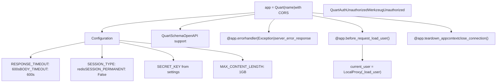
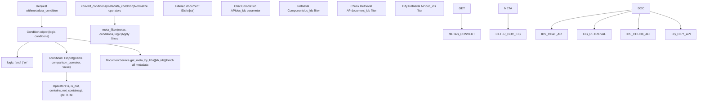

# Backend API System

Relevant source files

-   [admin/client/README.md](https://github.com/infiniflow/ragflow/blob/80a16e71/admin/client/README.md)
-   [admin/client/http\_client.py](https://github.com/infiniflow/ragflow/blob/80a16e71/admin/client/http_client.py)
-   [admin/client/parser.py](https://github.com/infiniflow/ragflow/blob/80a16e71/admin/client/parser.py)
-   [admin/client/pyproject.toml](https://github.com/infiniflow/ragflow/blob/80a16e71/admin/client/pyproject.toml)
-   [admin/client/ragflow\_cli.py](https://github.com/infiniflow/ragflow/blob/80a16e71/admin/client/ragflow_cli.py)
-   [admin/client/ragflow\_client.py](https://github.com/infiniflow/ragflow/blob/80a16e71/admin/client/ragflow_client.py)
-   [admin/client/user.py](https://github.com/infiniflow/ragflow/blob/80a16e71/admin/client/user.py)
-   [admin/server/admin\_server.py](https://github.com/infiniflow/ragflow/blob/80a16e71/admin/server/admin_server.py)
-   [admin/server/auth.py](https://github.com/infiniflow/ragflow/blob/80a16e71/admin/server/auth.py)
-   [admin/server/config.py](https://github.com/infiniflow/ragflow/blob/80a16e71/admin/server/config.py)
-   [admin/server/routes.py](https://github.com/infiniflow/ragflow/blob/80a16e71/admin/server/routes.py)
-   [admin/server/services.py](https://github.com/infiniflow/ragflow/blob/80a16e71/admin/server/services.py)
-   [agent/tools/retrieval.py](https://github.com/infiniflow/ragflow/blob/80a16e71/agent/tools/retrieval.py)
-   [api/apps/sdk/chat.py](https://github.com/infiniflow/ragflow/blob/80a16e71/api/apps/sdk/chat.py)
-   [api/apps/sdk/dataset.py](https://github.com/infiniflow/ragflow/blob/80a16e71/api/apps/sdk/dataset.py)
-   [api/apps/sdk/dify\_retrieval.py](https://github.com/infiniflow/ragflow/blob/80a16e71/api/apps/sdk/dify_retrieval.py)
-   [api/apps/sdk/doc.py](https://github.com/infiniflow/ragflow/blob/80a16e71/api/apps/sdk/doc.py)
-   [api/apps/sdk/session.py](https://github.com/infiniflow/ragflow/blob/80a16e71/api/apps/sdk/session.py)
-   [api/constants.py](https://github.com/infiniflow/ragflow/blob/80a16e71/api/constants.py)
-   [api/db/services/canvas\_service.py](https://github.com/infiniflow/ragflow/blob/80a16e71/api/db/services/canvas_service.py)
-   [api/db/services/conversation\_service.py](https://github.com/infiniflow/ragflow/blob/80a16e71/api/db/services/conversation_service.py)
-   [api/db/services/system\_settings\_service.py](https://github.com/infiniflow/ragflow/blob/80a16e71/api/db/services/system_settings_service.py)
-   [api/ragflow\_server.py](https://github.com/infiniflow/ragflow/blob/80a16e71/api/ragflow_server.py)
-   [api/utils/api\_utils.py](https://github.com/infiniflow/ragflow/blob/80a16e71/api/utils/api_utils.py)
-   [api/utils/configs.py](https://github.com/infiniflow/ragflow/blob/80a16e71/api/utils/configs.py)
-   [api/utils/health\_utils.py](https://github.com/infiniflow/ragflow/blob/80a16e71/api/utils/health_utils.py)
-   [common/connection\_utils.py](https://github.com/infiniflow/ragflow/blob/80a16e71/common/connection_utils.py)
-   [conf/system\_settings.json](https://github.com/infiniflow/ragflow/blob/80a16e71/conf/system_settings.json)
-   [docs/references/http\_api\_reference.md](https://github.com/infiniflow/ragflow/blob/80a16e71/docs/references/http_api_reference.md)
-   [docs/references/python\_api\_reference.md](https://github.com/infiniflow/ragflow/blob/80a16e71/docs/references/python_api_reference.md)
-   [docs/release\_notes.md](https://github.com/infiniflow/ragflow/blob/80a16e71/docs/release_notes.md)
-   [rag/advanced\_rag/\_\_init\_\_.py](https://github.com/infiniflow/ragflow/blob/80a16e71/rag/advanced_rag/__init__.py)
-   [rag/benchmark.py](https://github.com/infiniflow/ragflow/blob/80a16e71/rag/benchmark.py)
-   [sdk/python/ragflow\_sdk/modules/chat.py](https://github.com/infiniflow/ragflow/blob/80a16e71/sdk/python/ragflow_sdk/modules/chat.py)
-   [sdk/python/ragflow\_sdk/ragflow.py](https://github.com/infiniflow/ragflow/blob/80a16e71/sdk/python/ragflow_sdk/ragflow.py)

The Backend API System provides a comprehensive RESTful API interface for interacting with all RAGFlow functionality. This system enables programmatic access to dataset management, document processing, chat assistants, agent workflows, and retrieval operations through both standard HTTP endpoints and OpenAI-compatible interfaces.

**Scope**: This page covers the overall architecture, authentication mechanisms, API design patterns, and OpenAI compatibility layer. For detailed endpoint documentation, see:

-   Dataset and knowledge base operations: [Dataset and Knowledge Base APIs](/infiniflow/ragflow/8.3-dataset-and-knowledge-base-apis)
-   File upload and chunk management: [Document and File Management APIs](/infiniflow/ragflow/8.4-document-and-file-management-apis)
-   Chat completions and conversations: [Chat and Conversation APIs](/infiniflow/ragflow/8.5-chat-and-conversation-apis)
-   For Agent workflow APIs, see [Canvas API and Management](/infiniflow/ragflow/9.6-agent-tools-and-react-loop)

---

## System Architecture

The Backend API System is built on Quart (async Flask) and provides both synchronous and asynchronous endpoints. All API functionality is exposed under the `/api/v1` namespace with consistent authentication and response formats.

### High-Level API Architecture

```mermaid
flowchart TD
    WEB["Web UI(React)"]
    SDK["Python SDKragflow-sdk"]
    CLI["ragflow-cli"]
    EXTERNAL["External Apps(OpenAI clients)"]
    SESSION_AUTH["Session Auth@login_requiredJWT tokens"]
    TOKEN_AUTH["API Token Auth@token_requiredBearer tokens"]
    OAUTH["OAuth2/OIDCGitHub/SSO"]
    BLUEPRINT["Quart Blueprintapi/apps/sdk/"]
    MANAGER["manager routes"]
    VALIDATOR["@validate_requestRequest validation"]
    DATASET_EP["/datasetsCreate/Update/Delete/List"]
    DOC_EP["/datasets/{id}/documentsUpload/Parse/Download"]
    CHAT_EP["/chatsAssistant CRUD"]
    SESSION_EP["/chats/{id}/sessionsConversation management"]
    COMPLETION_EP["/chats/{id}/completionsStandard RAG chat"]
    OPENAI_EP["/chats_openai/{id}/chat/completionsOpenAI-compatible"]
    AGENT_EP["/agentsCanvas CRUD"]
    AGENT_OPENAI["/agents_openai/{id}/chat/completionsAgent OpenAI API"]
    KB_SVC["KnowledgebaseService"]
    DOC_SVC["DocumentService"]
    DIALOG_SVC["DialogService"]
    CONV_SVC["ConversationService"]
    CANVAS_SVC["UserCanvasService"]
    TASK_SVC["TaskService"]
    TASK_QUEUE["Redis Task QueueDocument processing"]
    DB["MySQLMetadata"]
    DOCSTORE["Document StoreES/Infinity/OpenSearch"]
    MINIO["MinIOFile storage"]
    LLM["LLMBundle30+ providers"]

    WEB --> SESSION_AUTH
    SDK --> TOKEN_AUTH
    CLI --> TOKEN_AUTH
    EXTERNAL --> TOKEN_AUTH
    SESSION --> AUTH_BLUEPRINT
    TOKEN --> AUTH_BLUEPRINT
    OAUTH --> SESSION_AUTH
    BLUEPRINT --> VALIDATOR
    VALIDATOR --> DATASET_EP
    VALIDATOR --> DOC_EP
    VALIDATOR --> CHAT_EP
    VALIDATOR --> SESSION_EP
    VALIDATOR --> COMPLETION_EP
    VALIDATOR --> OPENAI_EP
    VALIDATOR --> AGENT_EP
    VALIDATOR --> AGENT_OPENAI
    DATASET --> EP_KB_SVC
    DOC --> EP_DOC_SVC
    DOC --> EP_TASK_SVC
    CHAT --> EP_DIALOG_SVC
    SESSION --> EP_CONV_SVC
    COMPLETION --> EP_DIALOG_SVC
    OPENAI --> EP_DIALOG_SVC
    AGENT --> EP_CANVAS_SVC
    AGENT --> OPENAI_CANVAS_SVC
    KB --> SVC_DB
    DOC --> SVC_DB
    DOC --> SVC_MINIO
    DOC --> SVC_TASK_QUEUE
    DIALOG --> SVC_DB
    DIALOG --> SVC_DOCSTORE
    DIALOG --> SVC_LLM
    CONV --> SVC_DB
    CANVAS --> SVC_DB
    TASK --> SVC_TASK_QUEUE
    TASK --> QUEUE_DOCSTORE
```


**Sources**: [api/apps/\_\_init\_\_.py59-84](https://github.com/infiniflow/ragflow/blob/80a16e71/api/apps/__init__.py#L59-L84) [api/apps/sdk/session.py49-76](https://github.com/infiniflow/ragflow/blob/80a16e71/api/apps/sdk/session.py#L49-L76) [api/apps/sdk/dataset.py55-155](https://github.com/infiniflow/ragflow/blob/80a16e71/api/apps/sdk/dataset.py#L55-L155) [api/apps/sdk/doc.py72-182](https://github.com/infiniflow/ragflow/blob/80a16e71/api/apps/sdk/doc.py#L72-L182) [api/apps/sdk/chat.py27-144](https://github.com/infiniflow/ragflow/blob/80a16e71/api/apps/sdk/chat.py#L27-L144)

---

## Application Initialization and Configuration

The API application is initialized in `api/apps/__init__.py` as a Quart instance with CORS support and custom configuration:


The application uses increased timeouts (600 seconds) to accommodate slow LLM responses from local models running on CPU. Request/response bodies up to 1GB are supported for file uploads.

**Sources**: [api/apps/\_\_init\_\_.py59-84](https://github.com/infiniflow/ragflow/blob/80a16e71/api/apps/__init__.py#L59-L84) [api/apps/\_\_init\_\_.py95-139](https://github.com/infiniflow/ragflow/blob/80a16e71/api/apps/__init__.py#L95-L139)

---

## Authentication and Authorization

RAGFlow implements a dual authentication system supporting both session-based and token-based authentication.

### Authentication Flow

```mermaid
flowchart TD
    REQUEST["HTTP Request"]
    AUTH_HEADER["Authorization Header"]
    SESSION_CHECK["Session Cookie Check"]
    JWT_TOKEN["JWT Token inAuthorization header"]
    SERIALIZER["URLSafeTimedSerializerwith SECRET_KEY"]
    USER_LOOKUP["UserService.queryaccess_token, status=VALID"]
    SET_G_USER["g.user = user[0]"]
    BEARER["Bearer"]
    API_TOKEN_LOOKUP["APIToken.querytoken="]
    TENANT_LOOKUP["Get tenant_idfrom APIToken"]
    TOKEN_VALID["Pass tenant_idto endpoint"]
    LOGIN_REQ["@login_requiredFor web UI"]
    TOKEN_REQ["@token_requiredFor SDK/API"]
    VALIDATE["@validate_requestParameter validation"]

    REQUEST --> AUTH_HEADER
    REQUEST --> SESSION_CHECK
    AUTH --> HEADER_JWT_TOKEN
    JWT --> TOKEN_SERIALIZER
    SERIALIZER --> USER_LOOKUP
    USER --> LOOKUP_SET_G_USER
    AUTH --> HEADER_BEARER
    BEARER --> API_TOKEN_LOOKUP
    API --> TOKEN_LOOKUP_TENANT_LOOKUP
    TENANT --> LOOKUP_TOKEN_VALID
    SET --> G_USER_LOGIN_REQ
    TOKEN --> VALID_TOKEN_REQ
    LOGIN --> REQ_VALIDATE
    TOKEN --> REQ_VALIDATE
```


**Key Implementation Details**:

-   **`_load_user()` function** ([api/apps/\_\_init\_\_.py95-139](https://github.com/infiniflow/ragflow/blob/80a16e71/api/apps/__init__.py#L95-L139)): Tries JWT token first, falls back to API token lookup
-   **`@login_required` decorator** ([api/apps/\_\_init\_\_.py144-179](https://github.com/infiniflow/ragflow/blob/80a16e71/api/apps/__init__.py#L144-L179)): Enforces authenticated session, raises `QuartAuthUnauthorized` if not authenticated
-   **`@token_required` decorator** ([api/utils/api\_utils.py261-294](https://github.com/infiniflow/ragflow/blob/80a16e71/api/utils/api_utils.py#L261-L294)): Validates Bearer token against `APIToken` table, injects `tenant_id` parameter
-   **Dual authentication support**: Same endpoint can be accessed via session (web UI) or API token (SDK/external apps)

**Sources**: [api/apps/\_\_init\_\_.py95-179](https://github.com/infiniflow/ragflow/blob/80a16e71/api/apps/__init__.py#L95-L179) [api/utils/api\_utils.py261-294](https://github.com/infiniflow/ragflow/blob/80a16e71/api/utils/api_utils.py#L261-L294) [api/db/db\_models.py](https://github.com/infiniflow/ragflow/blob/80a16e71/api/db/db_models.py)

---

## API Endpoint Structure

The API is organized into logical endpoint groups, each handling a specific domain of functionality:

| Endpoint Group | Base Path | Authentication | Description |
| --- | --- | --- | --- |
| **Dataset Management** | `/api/v1/datasets` | `@token_required` | Create, read, update, delete knowledge bases |
| **Document Operations** | `/api/v1/datasets/{dataset_id}/documents` | `@token_required` | Upload, parse, download documents |
| **Chunk Management** | `/api/v1/datasets/{dataset_id}/chunks` | `@token_required` | Retrieve and update chunks |
| **Chat Assistants** | `/api/v1/chats` | `@token_required` | Create and configure chat assistants |
| **Chat Sessions** | `/api/v1/chats/{chat_id}/sessions` | `@token_required` | Manage conversation sessions |
| **Chat Completions** | `/api/v1/chats/{chat_id}/completions` | `@token_required` | Standard RAGFlow chat API |
| **OpenAI Chat** | `/api/v1/chats_openai/{chat_id}/chat/completions` | `@token_required` | OpenAI-compatible chat completions |
| **Agent Management** | `/api/v1/agents` | `@token_required` | Create and configure agents |
| **Agent Completions** | `/api/v1/agents/{agent_id}/completions` | `@token_required` | Standard agent execution API |
| **OpenAI Agent** | `/api/v1/agents_openai/{agent_id}/chat/completions` | `@token_required` | OpenAI-compatible agent execution |
| **Dify Retrieval** | `/api/v1/dify/retrieval` | `@apikey_required` | Dify-compatible retrieval endpoint |

**Sources**: [docs/references/http\_api\_reference.md1-100](https://github.com/infiniflow/ragflow/blob/80a16e71/docs/references/http_api_reference.md#L1-L100) [api/apps/sdk/session.py49-492](https://github.com/infiniflow/ragflow/blob/80a16e71/api/apps/sdk/session.py#L49-L492) [api/apps/sdk/dataset.py55-450](https://github.com/infiniflow/ragflow/blob/80a16e71/api/apps/sdk/dataset.py#L55-L450) [api/apps/sdk/doc.py72-1500](https://github.com/infiniflow/ragflow/blob/80a16e71/api/apps/sdk/doc.py#L72-L1500) [api/apps/sdk/chat.py27-300](https://github.com/infiniflow/ragflow/blob/80a16e71/api/apps/sdk/chat.py#L27-L300)

---

## OpenAI-Compatible API Layer

RAGFlow provides OpenAI-compatible endpoints that follow the same request/response format as OpenAI's Chat Completions API, enabling drop-in replacement for applications using the OpenAI SDK.

### OpenAI Compatibility Architecture

```mermaid
flowchart TD
    OPENAI_SDK["OpenAI Python SDKclient.chat.completions.create()"]
    CUSTOM["Custom HTTP Client"]
    CHAT_OPENAI["/chats_openai/{chat_id}/chat/completions@validate_request('model', 'messages')"]
    AGENT_OPENAI["/agents_openai/{agent_id}/chat/completions@validate_request('model', 'messages')"]
    PARSE_MSG["Parse messages listExtract last user message"]
    EXTRACT_PARAMS["Extract stream, extra_bodymetadata_condition, reference"]
    CONTEXT_TOKENS["Calculate context tokenstiktoken encoding"]
    CHAT_EXEC["async_chat()DialogService"]
    AGENT_EXEC["completion_openai()Canvas execution"]
    STREAM_RESP["Streaming Responsedata:{json} format"]
    NON_STREAM["Non-Streaming ResponseComplete JSON object"]
    OPENAI_FORMAT["OpenAI Formatchoices, usage, finish_reason"]

    OPENAI --> SDK_CHAT_OPENAI
    OPENAI --> SDK_AGENT_OPENAI
    CUSTOM --> CHAT_OPENAI
    CUSTOM --> AGENT_OPENAI
    CHAT --> OPENAI_PARSE_MSG
    AGENT --> OPENAI_PARSE_MSG
    PARSE --> MSG_EXTRACT_PARAMS
    EXTRACT --> PARAMS_CONTEXT_TOKENS
    CONTEXT --> TOKENS_CHAT_EXEC
    CONTEXT --> TOKENS_AGENT_EXEC
    CHAT --> EXEC_STREAM_RESP
    CHAT --> EXEC_NON_STREAM
    AGENT --> EXEC_STREAM_RESP
    AGENT --> EXEC_NON_STREAM
    STREAM --> RESP_OPENAI_FORMAT
    NON --> STREAM_OPENAI_FORMAT
```


### OpenAI Chat Completion Implementation

The `/chats_openai/{chat_id}/chat/completions` endpoint ([api/apps/sdk/session.py175-431](https://github.com/infiniflow/ragflow/blob/80a16e71/api/apps/sdk/session.py#L175-L431)) implements full OpenAI Chat Completions API compatibility:

**Request Format**:

```
{
  "model": "any-value",
  "messages": [
    {"role": "system", "content": "You are a helpful assistant."},
    {"role": "user", "content": "Hello!"},
    {"role": "assistant", "content": "Hi there!"},
    {"role": "user", "content": "How do I install neovim?"}
  ],
  "stream": true,
  "extra_body": {
    "reference": true,
    "metadata_condition": {
      "logic": "and",
      "conditions": [
        {"name": "author", "comparison_operator": "is", "value": "bob"}
      ]
    }
  }
}
```
**Streaming Response Format**:

```
data:{"id": "chatcmpl-xxx", "choices": [{"delta": {"content": "To install", "role": "assistant"}, "finish_reason": null, "index": 0}], "created": 1755084508, "model": "model", "object": "chat.completion.chunk", "usage": null}

data:{"id": "chatcmpl-xxx", "choices": [{"delta": {"content": " neovim...", "role": "assistant"}, "finish_reason": null, "index": 0}], ...}

data:{"id": "chatcmpl-xxx", "choices": [{"delta": {"content": null, "reference": {...}, "final_content": "..."}, "finish_reason": "stop", "index": 0}], "usage": {"prompt_tokens": 5, "completion_tokens": 188, "total_tokens": 193}}

data:[DONE]
```
**Key Features**:

-   **Message history processing**: Filters system messages and non-sense assistant messages ([api/apps/sdk/session.py288-294](https://github.com/infiniflow/ragflow/blob/80a16e71/api/apps/sdk/session.py#L288-L294))
-   **Metadata filtering**: Supports `metadata_condition` in `extra_body` for document-level filtering ([api/apps/sdk/session.py271-286](https://github.com/infiniflow/ragflow/blob/80a16e71/api/apps/sdk/session.py#L271-L286))
-   **Reference support**: Optional `reference` flag includes citation information in final chunk ([api/apps/sdk/session.py376-379](https://github.com/infiniflow/ragflow/blob/80a16e71/api/apps/sdk/session.py#L376-L379))
-   **Token usage tracking**: Returns accurate prompt and completion token counts ([api/apps/sdk/session.py375-376](https://github.com/infiniflow/ragflow/blob/80a16e71/api/apps/sdk/session.py#L375-L376) [api/apps/sdk/session.py405-414](https://github.com/infiniflow/ragflow/blob/80a16e71/api/apps/sdk/session.py#L405-L414))
-   **Reasoning tokens**: Context tokens treated as reasoning tokens in usage details ([api/apps/sdk/session.py264](https://github.com/infiniflow/ragflow/blob/80a16e71/api/apps/sdk/session.py#L264-L264) [api/apps/sdk/session.py410](https://github.com/infiniflow/ragflow/blob/80a16e71/api/apps/sdk/session.py#L410-L410))

**Sources**: [api/apps/sdk/session.py175-431](https://github.com/infiniflow/ragflow/blob/80a16e71/api/apps/sdk/session.py#L175-L431) [api/apps/sdk/session.py433-492](https://github.com/infiniflow/ragflow/blob/80a16e71/api/apps/sdk/session.py#L433-L492) [docs/references/http\_api\_reference.md30-176](https://github.com/infiniflow/ragflow/blob/80a16e71/docs/references/http_api_reference.md#L30-L176)

---

## Python SDK Architecture

The Python SDK (`ragflow-sdk`) provides an object-oriented interface to the RAGFlow API, abstracting HTTP requests into Python classes.

### SDK Class Hierarchy


**SDK Usage Example**:

```
from ragflow_sdk import RAGFlow

# Initialize client
rag = RAGFlow(api_key="<YOUR_API_KEY>", base_url="http://localhost:9380")

# Create dataset
dataset = rag.create_dataset(name="my_kb", chunk_method="naive")

# Upload documents
dataset.upload_documents([
    {"display_name": "doc1.pdf", "blob": b"<binary_content>"},
    {"display_name": "doc2.txt", "blob": b"<binary_content>"}
])

# Create chat assistant
chat = rag.create_chat(
    name="My Assistant",
    dataset_ids=[dataset.id],
    llm=Chat.LLM(model_name="gpt-4"),
    prompt=Chat.Prompt(
        system="You are a helpful assistant.",
        top_n=10
    )
)

# Create session and chat
session = chat.create_session(name="Session 1")
for chunk in session.chat("What is RAGFlow?", stream=True):
    print(chunk, end="")
```
**Sources**: [sdk/python/ragflow\_sdk/ragflow.py27-200](https://github.com/infiniflow/ragflow/blob/80a16e71/sdk/python/ragflow_sdk/ragflow.py#L27-L200) [sdk/python/ragflow\_sdk/modules/chat.py22-100](https://github.com/infiniflow/ragflow/blob/80a16e71/sdk/python/ragflow_sdk/modules/chat.py#L22-L100) [docs/references/python\_api\_reference.md1-100](https://github.com/infiniflow/ragflow/blob/80a16e71/docs/references/python_api_reference.md#L1-L100)

---

## Request Validation and Error Handling

RAGFlow implements comprehensive request validation and standardized error handling across all API endpoints.

### Request Validation Flow


### Standard Response Format

All API endpoints return responses in a consistent JSON format:

**Success Response**:

```
{
  "code": 0,
  "data": { /* response data */ }
}
```
**Paginated Response**:

```
{
  "code": 0,
  "data": [ /* list of items */ ],
  "total": 47
}
```
**Error Response**:

```
{
  "code": 102,
  "message": "You don't own the dataset."
}
```
### Error Code Mapping

| Code | Constant | Description | Usage |
| --- | --- | --- | --- |
| 0 | `RetCode.SUCCESS` | Operation successful | All successful operations |
| 101 | `RetCode.ARGUMENT_ERROR` | Invalid request parameters | Missing required fields, wrong types |
| 102 | `RetCode.DATA_ERROR` | Data missing or invalid | Resource not found, constraint violations |
| 103 | `RetCode.AUTHENTICATION_ERROR` | Invalid credentials | API key invalid, token expired |
| 104 | `RetCode.PERMISSION_ERROR` | Access denied | User doesn't own resource |
| 105 | `RetCode.OPERATING_ERROR` | Operation failed | Database errors, system failures |
| 401 | `RetCode.UNAUTHORIZED` | Not authenticated | Missing Authorization header |
| 500 | `RetCode.EXCEPTION_ERROR` | Server internal error | Unhandled exceptions |
| 1001 | Custom | Invalid Chunk ID | Chunk-specific validation error |
| 1002 | Custom | Chunk Update Failed | Chunk update operation failed |

**Helper Functions**:

-   `get_result(code, message, data, total)` ([api/utils/api\_utils.py297-318](https://github.com/infiniflow/ragflow/blob/80a16e71/api/utils/api_utils.py#L297-L318)): Standard success response
-   `get_error_data_result(message, code)` ([api/utils/api\_utils.py320-332](https://github.com/infiniflow/ragflow/blob/80a16e71/api/utils/api_utils.py#L320-L332)): Standard error response
-   `server_error_response(e)` ([api/utils/api\_utils.py125-140](https://github.com/infiniflow/ragflow/blob/80a16e71/api/utils/api_utils.py#L125-L140)): Exception handler with special unauthorized detection

**Sources**: [api/utils/api\_utils.py143-206](https://github.com/infiniflow/ragflow/blob/80a16e71/api/utils/api_utils.py#L143-L206) [api/utils/api\_utils.py297-345](https://github.com/infiniflow/ragflow/blob/80a16e71/api/utils/api_utils.py#L297-L345) [common/constants.py](https://github.com/infiniflow/ragflow/blob/80a16e71/common/constants.py) [docs/references/http\_api\_reference.md14-27](https://github.com/infiniflow/ragflow/blob/80a16e71/docs/references/http_api_reference.md#L14-L27)

---

## Streaming Response Implementation

RAGFlow implements Server-Sent Events (SSE) for real-time streaming of chat completions and agent execution results.

### SSE Response Architecture

```mermaid
flowchart TD
    CHAT_STREAM["/chats/{id}/completionsstream=true"]
    OPENAI_STREAM["/chats_openai/{id}/chat/completionsstream=true"]
    AGENT_STREAM["/agents/{id}/completionsstream=true"]
    ASYNC_GEN["async def streamed_response_generator()AsyncIterator[str]"]
    YIELD_DATA["yield f'data:{json}'SSE format"]
    FINAL_CHUNK["Final chunk with usage statsfinish_reason='stop'"]
    DONE["yield 'data:[DONE]'"]
    CONTENT_TYPE["Content-Type: text/event-stream; charset=utf-8"]
    CACHE["Cache-Control: no-cache"]
    KEEPALIVE["Connection: keep-alive"]
    BUFFERING["X-Accel-Buffering: no"]
    FULL_CONTENT["full_content += delta"]
    FULL_REASONING["full_reasoning += delta"]
    TOKEN_COUNT["token_used += len(delta)"]
    FINAL_ANSWER["final_answer from last_ans"]
    FINAL_REF["final_reference from last_ans"]

    CHAT --> STREAM_ASYNC_GEN
    OPENAI --> STREAM_ASYNC_GEN
    AGENT --> STREAM_ASYNC_GEN
    ASYNC --> GEN_YIELD_DATA
    YIELD --> DATA_FINAL_CHUNK
    FINAL --> CHUNK_DONE
    ASYNC --> GEN_FULL_CONTENT
    ASYNC --> GEN_FULL_REASONING
    ASYNC --> GEN_TOKEN_COUNT
    FULL --> CONTENT_FINAL_ANSWER
    TOKEN --> COUNT_FINAL_CHUNK
    FINAL --> ANSWER_FINAL_REF
    YIELD --> DATA_CONTENT_TYPE
    CONTENT --> TYPE_CACHE
    CACHE --> KEEPALIVE
    KEEPALIVE --> BUFFERING
```


**Key Implementation Details**:

1.  **Response object setup** ([api/apps/sdk/session.py383-388](https://github.com/infiniflow/ragflow/blob/80a16e71/api/apps/sdk/session.py#L383-L388)):

```
resp = Response(streamed_response_generator(chat_id, dia, msg), mimetype="text/event-stream")
resp.headers.add_header("Cache-control", "no-cache")
resp.headers.add_header("Connection", "keep-alive")
resp.headers.add_header("X-Accel-Buffering", "no")
resp.headers.add_header("Content-Type", "text/event-stream; charset=utf-8")
```
2.  **Streaming loop with think/content separation** ([api/apps/sdk/session.py348-366](https://github.com/infiniflow/ragflow/blob/80a16e71/api/apps/sdk/session.py#L348-L366)):

```
if ans.get("start_to_think"):
    in_think = True
    continue
if ans.get("end_to_think"):
    in_think = False
    continue
delta = ans.get("answer") or ""
if in_think:
    full_reasoning += delta
    response["choices"][0]["delta"]["reasoning_content"] = delta
else:
    full_content += delta
    response["choices"][0]["delta"]["content"] = delta
```
3.  **Final chunk with references** ([api/apps/sdk/session.py372-381](https://github.com/infiniflow/ragflow/blob/80a16e71/api/apps/sdk/session.py#L372-L381)):

-   Last chunk includes `finish_reason="stop"`, `usage` statistics
-   Optional `reference` and `final_content` in `delta` if `need_reference=True`
-   Empty `data:[DONE]` marker signals stream end

**Sources**: [api/apps/sdk/session.py305-388](https://github.com/infiniflow/ragflow/blob/80a16e71/api/apps/sdk/session.py#L305-L388) [api/apps/sdk/session.py433-492](https://github.com/infiniflow/ragflow/blob/80a16e71/api/apps/sdk/session.py#L433-L492) [api/db/services/canvas\_service.py193-280](https://github.com/infiniflow/ragflow/blob/80a16e71/api/db/services/canvas_service.py#L193-L280)

---

## Metadata Filtering System

RAGFlow supports sophisticated metadata-based document filtering across retrieval and chat APIs, enabling fine-grained control over which documents are searched.

### Metadata Filter Processing Flow


**Example Metadata Filter**:

```
{
  "metadata_condition": {
    "logic": "and",
    "conditions": [
      {
        "name": "author",
        "comparison_operator": "is",
        "value": "bob"
      },
      {
        "name": "date",
        "comparison_operator": "gte",
        "value": "2024-01-01"
      }
    ]
  }
}
```
**Key Functions**:

-   `convert_conditions()` ([common/metadata\_utils.py](https://github.com/infiniflow/ragflow/blob/80a16e71/common/metadata_utils.py)): Normalizes operator names (e.g., "is" → "eq", "contains" → "in")
-   `meta_filter()` ([common/metadata\_utils.py](https://github.com/infiniflow/ragflow/blob/80a16e71/common/metadata_utils.py)): Applies conditions with AND/OR logic, returns matching document IDs
-   `apply_meta_data_filter()` ([common/metadata\_utils.py](https://github.com/infiniflow/ragflow/blob/80a16e71/common/metadata_utils.py)): Applied during chunk retrieval to filter results

**Integration Examples**:

-   Chat API: [api/apps/sdk/session.py271-286](https://github.com/infiniflow/ragflow/blob/80a16e71/api/apps/sdk/session.py#L271-L286) - Filters documents before retrieval
-   OpenAI Chat: [api/apps/sdk/session.py140-158](https://github.com/infiniflow/ragflow/blob/80a16e71/api/apps/sdk/session.py#L140-L158) - Supports in `extra_body` parameter
-   Retrieval Tool: [agent/tools/retrieval.py126-138](https://github.com/infiniflow/ragflow/blob/80a16e71/agent/tools/retrieval.py#L126-L138) - Filters during agent retrieval
-   Dify API: [api/apps/sdk/dify\_retrieval.py123-137](https://github.com/infiniflow/ragflow/blob/80a16e71/api/apps/sdk/dify_retrieval.py#L123-L137) - Dify-compatible filtering

**Sources**: [api/apps/sdk/session.py140-158](https://github.com/infiniflow/ragflow/blob/80a16e71/api/apps/sdk/session.py#L140-L158) [api/apps/sdk/session.py271-286](https://github.com/infiniflow/ragflow/blob/80a16e71/api/apps/sdk/session.py#L271-L286) [agent/tools/retrieval.py126-138](https://github.com/infiniflow/ragflow/blob/80a16e71/agent/tools/retrieval.py#L126-L138) [api/apps/sdk/dify\_retrieval.py123-137](https://github.com/infiniflow/ragflow/blob/80a16e71/api/apps/sdk/dify_retrieval.py#L123-L137) [common/metadata\_utils.py](https://github.com/infiniflow/ragflow/blob/80a16e71/common/metadata_utils.py)

---

## Asynchronous Request Handling

RAGFlow uses Quart (async Flask) to handle asynchronous requests efficiently, especially for long-running LLM operations and streaming responses.

### Async/Await Pattern Usage

```mermaid
flowchart TD
    ASYNC_ROUTE["@manager.route('/path', methods=['POST'])async def endpoint(tenant_id):"]
    SYNC_ROUTE["@manager.route('/path', methods=['GET'])def endpoint(tenant_id):"]
    GET_JSON["req = await get_request_json()Async body parsing"]
    FORM_DATA["form = await request.formAsync form parsing"]
    FILES["files = await request.filesAsync file upload"]
    SYNC_SVC["Synchronous DB callsKnowledgebaseService.query()"]
    ASYNC_SVC["Async processingasync_chat(), async_ask()"]
    ASYNC_FOR["async for ans in async_chat():Streaming results"]
    SYNC_RETURN["return get_result(data=...)Standard response"]
    ASYNC_YIELD["async def generator():    yield data"]
    STREAM_RESP["Response(generator(), mimetype='text/event-stream')"]

    ASYNC --> ROUTE_GET_JSON
    ASYNC --> ROUTE_FORM_DATA
    ASYNC --> ROUTE_FILES
    SYNC --> ROUTE_GET_JSON
    GET --> JSON_SYNC_SVC
    GET --> JSON_ASYNC_SVC
    SYNC --> SVC_SYNC_RETURN
    ASYNC --> SVC_ASYNC_FOR
    ASYNC --> FOR_ASYNC_YIELD
    ASYNC --> YIELD_STREAM_RESP
```


**Async Patterns in Use**:

1.  **Async route handlers**: Most API endpoints use `async def` to support non-blocking I/O ([api/apps/sdk/session.py51](https://github.com/infiniflow/ragflow/blob/80a16e71/api/apps/sdk/session.py#L51-L51) [api/apps/sdk/doc.py74](https://github.com/infiniflow/ragflow/blob/80a16e71/api/apps/sdk/doc.py#L74-L74))

2.  **Async request parsing**: `await get_request_json()` prevents blocking on body parsing ([api/utils/api\_utils.py85-86](https://github.com/infiniflow/ragflow/blob/80a16e71/api/utils/api_utils.py#L85-L86))

3.  **Async streaming**: `async for` over generator functions for chat completions ([api/apps/sdk/session.py340-381](https://github.com/infiniflow/ragflow/blob/80a16e71/api/apps/sdk/session.py#L340-L381))

4.  **Async service calls**: Background tasks like embedding and LLM calls use async patterns ([api/db/services/dialog\_service.py](https://github.com/infiniflow/ragflow/blob/80a16e71/api/db/services/dialog_service.py))

5.  **Timeout configuration**: Extended timeouts (600s) for slow LLM responses ([api/apps/\_\_init\_\_.py71-72](https://github.com/infiniflow/ragflow/blob/80a16e71/api/apps/__init__.py#L71-L72))


**Example Async Flow**:

```
@manager.route("/chats/<chat_id>/completions", methods=["POST"])
@token_required
async def chat_completion(tenant_id, chat_id):
    req = await get_request_json()  # Async parsing

    if req.get("stream", True):
        # Async generator for streaming
        async def generate():
            async for ans in rag_completion(tenant_id, chat_id, **req):
                yield json.dumps(ans)

        resp = Response(generate(), mimetype="text/event-stream")
        return resp
    else:
        # Non-streaming async call
        answer = None
        async for ans in rag_completion(tenant_id, chat_id, **req):
            answer = ans
            break
        return get_result(data=answer)
```
**Sources**: [api/apps/sdk/session.py124-173](https://github.com/infiniflow/ragflow/blob/80a16e71/api/apps/sdk/session.py#L124-L173) [api/apps/sdk/doc.py72-182](https://github.com/infiniflow/ragflow/blob/80a16e71/api/apps/sdk/doc.py#L72-L182) [api/utils/api\_utils.py55-86](https://github.com/infiniflow/ragflow/blob/80a16e71/api/utils/api_utils.py#L55-L86) [api/apps/\_\_init\_\_.py71-72](https://github.com/infiniflow/ragflow/blob/80a16e71/api/apps/__init__.py#L71-L72)

---

## Summary

The Backend API System provides a comprehensive, well-structured RESTful interface to all RAGFlow functionality. Key architectural highlights:

1.  **Dual Authentication**: Session-based for web UI, token-based for SDK/API clients
2.  **OpenAI Compatibility**: Drop-in replacement for OpenAI Chat Completions API
3.  **Async Architecture**: Quart-based async handling for efficient streaming and LLM operations
4.  **Consistent Patterns**: Standardized request validation, error handling, and response formats
5.  **Python SDK**: Object-oriented SDK abstracting HTTP complexity
6.  **Metadata Filtering**: Sophisticated document filtering across all retrieval operations
7.  **Streaming Support**: SSE-based streaming for real-time chat and agent responses

For detailed endpoint documentation and examples, refer to:

-   [API Architecture and SDK](/infiniflow/ragflow/8.1-api-architecture-and-sdk)
-   [Authentication and Authorization](/infiniflow/ragflow/8.2-authentication-and-authorization)
-   [Dataset and Knowledge Base APIs](/infiniflow/ragflow/8.3-dataset-and-knowledge-base-apis)
-   [Document and File Management APIs](/infiniflow/ragflow/8.4-document-and-file-management-apis)
-   [Chat and Conversation APIs](/infiniflow/ragflow/8.5-chat-and-conversation-apis)

**Sources**: [api/apps/\_\_init\_\_.py1-300](https://github.com/infiniflow/ragflow/blob/80a16e71/api/apps/__init__.py#L1-L300) [api/apps/sdk/session.py1-800](https://github.com/infiniflow/ragflow/blob/80a16e71/api/apps/sdk/session.py#L1-L800) [api/apps/sdk/dataset.py1-450](https://github.com/infiniflow/ragflow/blob/80a16e71/api/apps/sdk/dataset.py#L1-L450) [api/apps/sdk/doc.py1-1500](https://github.com/infiniflow/ragflow/blob/80a16e71/api/apps/sdk/doc.py#L1-L1500) [api/apps/sdk/chat.py1-350](https://github.com/infiniflow/ragflow/blob/80a16e71/api/apps/sdk/chat.py#L1-L350) [api/utils/api\_utils.py1-600](https://github.com/infiniflow/ragflow/blob/80a16e71/api/utils/api_utils.py#L1-L600) [docs/references/http\_api\_reference.md1-5000](https://github.com/infiniflow/ragflow/blob/80a16e71/docs/references/http_api_reference.md#L1-L5000)
