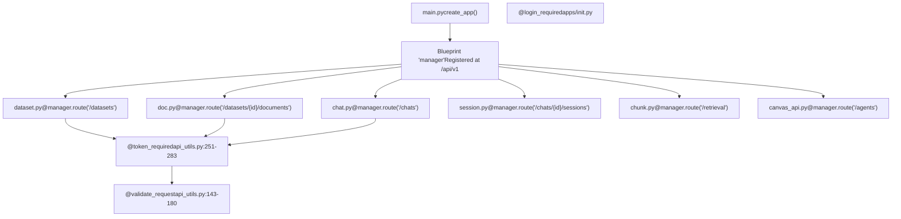
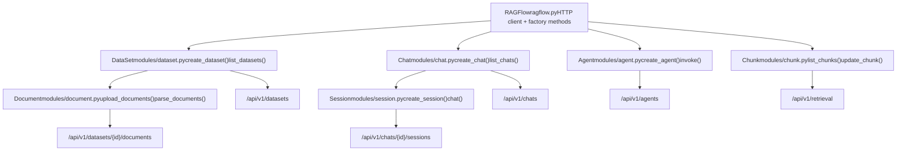
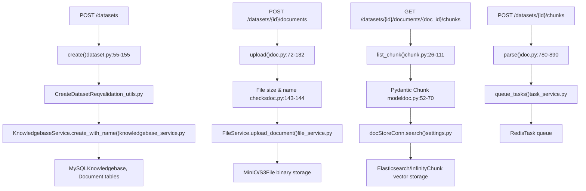
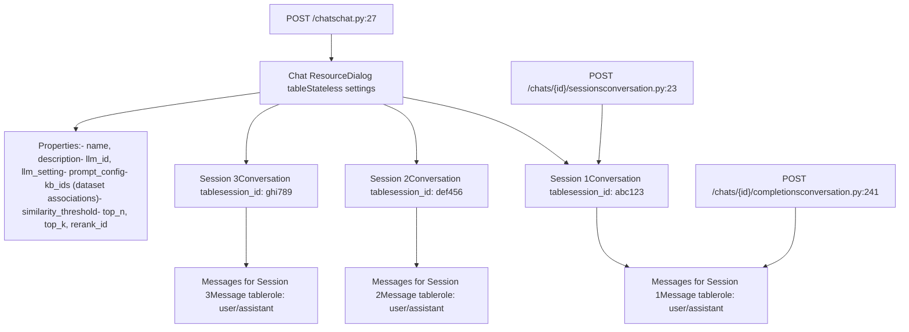
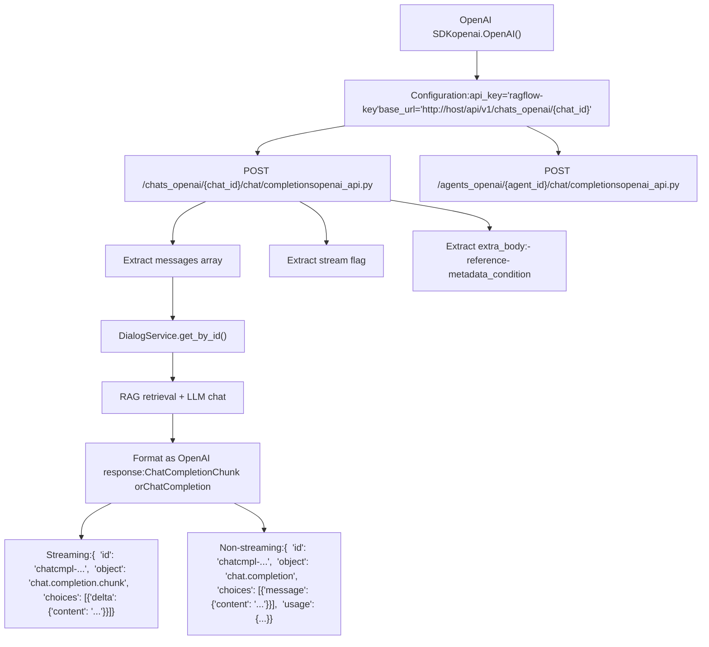

# API Architecture and SDK

Relevant source files

-   [admin/client/README.md](https://github.com/infiniflow/ragflow/blob/80a16e71/admin/client/README.md)
-   [admin/client/http\_client.py](https://github.com/infiniflow/ragflow/blob/80a16e71/admin/client/http_client.py)
-   [admin/client/parser.py](https://github.com/infiniflow/ragflow/blob/80a16e71/admin/client/parser.py)
-   [admin/client/pyproject.toml](https://github.com/infiniflow/ragflow/blob/80a16e71/admin/client/pyproject.toml)
-   [admin/client/ragflow\_cli.py](https://github.com/infiniflow/ragflow/blob/80a16e71/admin/client/ragflow_cli.py)
-   [admin/client/ragflow\_client.py](https://github.com/infiniflow/ragflow/blob/80a16e71/admin/client/ragflow_client.py)
-   [admin/client/user.py](https://github.com/infiniflow/ragflow/blob/80a16e71/admin/client/user.py)
-   [admin/server/admin\_server.py](https://github.com/infiniflow/ragflow/blob/80a16e71/admin/server/admin_server.py)
-   [admin/server/auth.py](https://github.com/infiniflow/ragflow/blob/80a16e71/admin/server/auth.py)
-   [admin/server/config.py](https://github.com/infiniflow/ragflow/blob/80a16e71/admin/server/config.py)
-   [admin/server/routes.py](https://github.com/infiniflow/ragflow/blob/80a16e71/admin/server/routes.py)
-   [admin/server/services.py](https://github.com/infiniflow/ragflow/blob/80a16e71/admin/server/services.py)
-   [agent/tools/retrieval.py](https://github.com/infiniflow/ragflow/blob/80a16e71/agent/tools/retrieval.py)
-   [api/apps/sdk/chat.py](https://github.com/infiniflow/ragflow/blob/80a16e71/api/apps/sdk/chat.py)
-   [api/apps/sdk/dataset.py](https://github.com/infiniflow/ragflow/blob/80a16e71/api/apps/sdk/dataset.py)
-   [api/apps/sdk/dify\_retrieval.py](https://github.com/infiniflow/ragflow/blob/80a16e71/api/apps/sdk/dify_retrieval.py)
-   [api/apps/sdk/doc.py](https://github.com/infiniflow/ragflow/blob/80a16e71/api/apps/sdk/doc.py)
-   [api/apps/sdk/session.py](https://github.com/infiniflow/ragflow/blob/80a16e71/api/apps/sdk/session.py)
-   [api/constants.py](https://github.com/infiniflow/ragflow/blob/80a16e71/api/constants.py)
-   [api/db/services/canvas\_service.py](https://github.com/infiniflow/ragflow/blob/80a16e71/api/db/services/canvas_service.py)
-   [api/db/services/conversation\_service.py](https://github.com/infiniflow/ragflow/blob/80a16e71/api/db/services/conversation_service.py)
-   [api/db/services/system\_settings\_service.py](https://github.com/infiniflow/ragflow/blob/80a16e71/api/db/services/system_settings_service.py)
-   [api/ragflow\_server.py](https://github.com/infiniflow/ragflow/blob/80a16e71/api/ragflow_server.py)
-   [api/utils/api\_utils.py](https://github.com/infiniflow/ragflow/blob/80a16e71/api/utils/api_utils.py)
-   [api/utils/configs.py](https://github.com/infiniflow/ragflow/blob/80a16e71/api/utils/configs.py)
-   [api/utils/health\_utils.py](https://github.com/infiniflow/ragflow/blob/80a16e71/api/utils/health_utils.py)
-   [common/connection\_utils.py](https://github.com/infiniflow/ragflow/blob/80a16e71/common/connection_utils.py)
-   [conf/system\_settings.json](https://github.com/infiniflow/ragflow/blob/80a16e71/conf/system_settings.json)
-   [docs/references/http\_api\_reference.md](https://github.com/infiniflow/ragflow/blob/80a16e71/docs/references/http_api_reference.md)
-   [docs/references/python\_api\_reference.md](https://github.com/infiniflow/ragflow/blob/80a16e71/docs/references/python_api_reference.md)
-   [docs/release\_notes.md](https://github.com/infiniflow/ragflow/blob/80a16e71/docs/release_notes.md)
-   [rag/advanced\_rag/\_\_init\_\_.py](https://github.com/infiniflow/ragflow/blob/80a16e71/rag/advanced_rag/__init__.py)
-   [rag/benchmark.py](https://github.com/infiniflow/ragflow/blob/80a16e71/rag/benchmark.py)
-   [sdk/python/ragflow\_sdk/modules/chat.py](https://github.com/infiniflow/ragflow/blob/80a16e71/sdk/python/ragflow_sdk/modules/chat.py)
-   [sdk/python/ragflow\_sdk/ragflow.py](https://github.com/infiniflow/ragflow/blob/80a16e71/sdk/python/ragflow_sdk/ragflow.py)

This page documents RAGFlow's Flask-based HTTP API architecture, including decorator patterns, response formatting standards, and the official Python SDK (`ragflow-sdk`). The API provides programmatic access to all RAGFlow functionality through RESTful endpoints organized by functional domain.

---

## Flask/Quart API Framework Structure

RAGFlow's API layer is built on **Quart**, an async-compatible fork of Flask. The API modules are organized under `api/apps/sdk/` with each module registering routes on a shared `manager` Blueprint.

### Blueprint and Route Registration Pattern


Each module follows this pattern:

```
# api/apps/sdk/dataset.py
manager = Blueprint('manager', __name__)

@manager.route("/datasets", methods=["POST"])
@token_required
async def create(tenant_id):
    # tenant_id injected by @token_required
    req = await get_request_json()
    # ... implementation
```
**Sources:**

-   [api/apps/sdk/dataset.py55](https://github.com/infiniflow/ragflow/blob/80a16e71/api/apps/sdk/dataset.py#L55-L55)
-   [api/apps/sdk/doc.py72](https://github.com/infiniflow/ragflow/blob/80a16e71/api/apps/sdk/doc.py#L72-L72)
-   [api/apps/sdk/chat.py27](https://github.com/infiniflow/ragflow/blob/80a16e71/api/apps/sdk/chat.py#L27-L27)
-   [api/utils/api\_utils.py251-283](https://github.com/infiniflow/ragflow/blob/80a16e71/api/utils/api_utils.py#L251-L283)

---

## Decorator Patterns

RAGFlow uses three primary decorators to enforce authentication, validation, and authorization across API endpoints.

### Authentication Decorators

#### @token\_required - API Key Authentication

Used for SDK/external API access. Validates Bearer token from `Authorization` header and injects `tenant_id`:

```
def token_required(func):
    def get_tenant_id(**kwargs):
        authorization_str = request.headers.get("Authorization")
        if not authorization_str:
            return False, get_json_result(
                data=False,
                message="`Authorization` can't be empty"
            )

        token = authorization_str.split()[1]
        objs = APIToken.query(token=token)
        if not objs:
            return False, get_json_result(
                data=False,
                message="Authentication error: API key is invalid!",
                code=RetCode.AUTHENTICATION_ERROR
            )

        kwargs["tenant_id"] = objs[0].tenant_id
        return True, kwargs

    @wraps(func)
    async def adecorated_function(*args, **kwargs):
        e, kwargs = get_tenant_id(**kwargs)
        if not e:
            return kwargs
        return await func(*args, **kwargs)

    return adecorated_function
```
**Sources:**

-   [api/utils/api\_utils.py251-283](https://github.com/infiniflow/ragflow/blob/80a16e71/api/utils/api_utils.py#L251-L283)

#### @login\_required - Session Authentication

Used for web UI requests. Validates user session cookies:

```
def login_required(func):
    @wraps(func)
    async def decorated_view(*args, **kwargs):
        if not current_user.is_authenticated:
            return get_json_result(
                code=RetCode.UNAUTHORIZED,
                message="Please login first"
            )
        return await func(*args, **kwargs)
    return decorated_view
```
**Sources:**

-   [api/apps/\_\_init\_\_.py](https://github.com/infiniflow/ragflow/blob/80a16e71/api/apps/__init__.py)

### Validation Decorators

#### @validate\_request - Parameter Validation

Enforces required parameters and validates their values:

```
@validate_request("conversation_id", "messages")
async def completion():
    # Ensures request has conversation_id and messages
    req = await get_request_json()
    # ... implementation
```
Implementation extracts positional and keyword arguments:

```
def validate_request(*args, **kwargs):
    def process_args(input_arguments):
        no_arguments = []
        error_arguments = []

        # Check required positional args
        for arg in args:
            if arg not in input_arguments:
                no_arguments.append(arg)

        # Check required keyword args with specific values
        for k, v in kwargs.items():
            config_value = input_arguments.get(k, None)
            if config_value is None:
                no_arguments.append(k)
            elif isinstance(v, (tuple, list)):
                if config_value not in v:
                    error_arguments.append((k, set(v)))
            elif config_value != v:
                error_arguments.append((k, v))

        if no_arguments or error_arguments:
            error_string = ""
            if no_arguments:
                error_string += "required argument are missing: {}; ".format(
                    ",".join(no_arguments)
                )
            if error_arguments:
                error_string += "required argument values: {}".format(
                    ",".join(["{}={}".format(a[0], a[1]) for a in error_arguments])
                )
            return error_string
        return None

    def wrapper(func):
        @wraps(func)
        async def decorated_function(*_args, **_kwargs):
            errs = process_args(await get_request_json())
            if errs:
                return get_json_result(
                    code=RetCode.ARGUMENT_ERROR,
                    message=errs
                )
            return await func(*_args, **_kwargs)
        return decorated_function
    return wrapper
```
**Sources:**

-   [api/utils/api\_utils.py143-180](https://github.com/infiniflow/ragflow/blob/80a16e71/api/utils/api_utils.py#L143-L180)
-   [api/apps/sdk/session.py124](https://github.com/infiniflow/ragflow/blob/80a16e71/api/apps/sdk/session.py#L124-L124)

#### @not\_allowed\_parameters - Parameter Blacklisting

Prevents clients from sending specific parameters:

```
@not_allowed_parameters("tenant_id", "user_id")
async def update_dataset(tenant_id, dataset_id):
    # Ensures clients cannot override tenant_id or user_id
    req = await get_request_json()
    # ... implementation
```
**Sources:**

-   [api/utils/api\_utils.py183-195](https://github.com/infiniflow/ragflow/blob/80a16e71/api/utils/api_utils.py#L183-L195)

### Decorator Stacking Order

Decorators are applied from bottom to top. Typical order:

1.  `@manager.route()` - Registers route
2.  `@token_required` or `@login_required` - Authentication
3.  `@validate_request()` - Parameter validation
4.  `async def handler()` - Endpoint implementation

Example:

```
@manager.route("/chats/<chat_id>/completions", methods=["POST"])
@token_required
@validate_request("question")
async def chat_completion(tenant_id, chat_id):
    # tenant_id injected by @token_required
    # question validated by @validate_request
    req = await get_request_json()
    # ... implementation
```
**Sources:**

-   [api/apps/sdk/session.py124-173](https://github.com/infiniflow/ragflow/blob/80a16e71/api/apps/sdk/session.py#L124-L173)

---

## Standardized Response Formatting

All API endpoints return JSON with a consistent structure using helper functions from `api/utils/api_utils.py`.

### Response Format Structure

#### Success Response

```
{
    "code": 0,
    "message": "success",
    "data": { ... }
}
```
Generated by:

```
def get_result(code=0, message="success", data=None):
    return jsonify({"code": code, "message": message, "data": data})
```
#### Error Response

```
{
    "code": 101,
    "message": "Dataset name 'example' already exists"
}
```
Generated by:

```
def get_error_data_result(code=RetCode.DATA_ERROR, message="Sorry! Data missing!"):
    response = {"code": code, "message": message}
    return jsonify(response)
```
**Sources:**

-   [api/utils/api\_utils.py286-306](https://github.com/infiniflow/ragflow/blob/80a16e71/api/utils/api_utils.py#L286-L306)

### Error Code System

The `RetCode` enum in `common/constants.py` defines all error codes:

| Code | Constant | Usage |
| --- | --- | --- |
| 0 | `SUCCESS` | Operation completed successfully |
| 100 | `ARGUMENT_ERROR` | Invalid request parameters |
| 101 | `DATA_ERROR` | Data validation failed (duplicates, constraints) |
| 102 | `OPERATING_ERROR` | Operation failed (permission, state issues) |
| 103 | `AUTHENTICATION_ERROR` | Invalid credentials |
| 401 | `UNAUTHORIZED` | Missing authentication |
| 403 | `FORBIDDEN` | Access denied |
| 404 | `NOT_FOUND` | Resource not found |
| 500 | `EXCEPTION_ERROR` | Unhandled server error |

**Sources:**

-   [common/constants.py](https://github.com/infiniflow/ragflow/blob/80a16e71/common/constants.py)
-   [docs/references/http\_api\_reference.md15-27](https://github.com/infiniflow/ragflow/blob/80a16e71/docs/references/http_api_reference.md#L15-L27)

### Exception Handling Pattern

Endpoints use try-except blocks with standardized error responses:

```
try:
    # Database operation
    if not KnowledgebaseService.save(**req):
        return get_error_data_result(message="Failed to create dataset")

    ok, kb = KnowledgebaseService.get_by_id(req["id"])
    if not ok:
        return get_error_data_result(message="Dataset created failed")

    return get_result(data=kb.to_dict())

except OperationalError as e:
    logging.exception(e)
    return get_error_data_result(message="Database operation failed")
```
**Sources:**

-   [api/apps/sdk/dataset.py144-154](https://github.com/infiniflow/ragflow/blob/80a16e71/api/apps/sdk/dataset.py#L144-L154)

---

## API Architecture and Client Structure

The RAGFlow API system consists of three layers: the HTTP REST API exposed by the backend, the Python SDK client library, and OpenAI-compatible endpoints for seamless integration.

### Three-Layer Architecture

```mermaid
flowchart TD
    PythonSDK["Python SDKragflow_sdk.RAGFlow"]
    DirectHTTP["Direct HTTPcurl, requests"]
    OpenAISDK["OpenAI SDKopenai.OpenAI()"]
    DatasetRoutes["Dataset Routesapi/apps/sdk/dataset.py@manager.route('/datasets')"]
    DocRoutes["Document Routesapi/apps/sdk/doc.py@manager.route('/datasets/{id}/documents')"]
    ChatRoutes["Chat Routesapi/apps/sdk/chat.py@manager.route('/chats')"]
    SessionRoutes["Session Routesapi/apps/sdk/session.py@manager.route('/chats/{id}/sessions')"]
    ChunkRoutes["Chunk Routesapi/apps/sdk/chunk.py@manager.route('/retrieval')"]
    OpenAIRoutes["OpenAI Routesapi/apps/sdk/session.py@manager.route('/chats_openai/{id}')"]
    TokenRequired["@token_requiredValidates Bearer tokenInjects tenant_id"]
    LoginRequired["@login_requiredValidates sessionUses current_user"]
    ValidateRequest["@validate_requestValidates parameters"]
    KBService["KnowledgebaseServiceapi/db/services/knowledgebase_service.py"]
    DocService["DocumentServiceapi/db/services/document_service.py"]
    DialogService["DialogServiceapi/db/services/dialog_service.py"]
    ConvService["ConversationServiceapi/db/services/conversation_service.py"]
    FileService["FileServiceapi/db/services/file_service.py"]
    MySQL["MySQLKnowledgebase, Document,Dialog, Conversation tables"]
    DocStore["DocStoreElasticsearch/InfinityVector + fulltext index"]
    MinIO["MinIO/S3Object storageSTORAGE_IMPL"]
    Redis["RedisTask queueCache"]

    PythonSDK --> DatasetRoutes
    PythonSDK --> DocRoutes
    PythonSDK --> ChatRoutes
    DirectHTTP --> DatasetRoutes
    DirectHTTP --> ChunkRoutes
    OpenAISDK --> OpenAIRoutes
    DatasetRoutes --> TokenRequired
    DocRoutes --> TokenRequired
    ChatRoutes --> TokenRequired
    SessionRoutes --> TokenRequired
    OpenAIRoutes --> TokenRequired
    TokenRequired --> ValidateRequest
    ValidateRequest --> KBService
    ValidateRequest --> DocService
    ValidateRequest --> DialogService
    ValidateRequest --> ConvService
    KBService --> MySQL
    DocService --> MySQL
    DocService --> DocStore
    FileService --> MinIO
    DialogService --> Redis
```


**Sources:**

-   [api/apps/sdk/dataset.py55](https://github.com/infiniflow/ragflow/blob/80a16e71/api/apps/sdk/dataset.py#L55-L55)
-   [api/apps/sdk/doc.py72](https://github.com/infiniflow/ragflow/blob/80a16e71/api/apps/sdk/doc.py#L72-L72)
-   [api/apps/sdk/chat.py27](https://github.com/infiniflow/ragflow/blob/80a16e71/api/apps/sdk/chat.py#L27-L27)
-   [api/apps/sdk/session.py49](https://github.com/infiniflow/ragflow/blob/80a16e71/api/apps/sdk/session.py#L49-L49)
-   [api/utils/api\_utils.py251-283](https://github.com/infiniflow/ragflow/blob/80a16e71/api/utils/api_utils.py#L251-L283)
-   [api/db/services/knowledgebase\_service.py](https://github.com/infiniflow/ragflow/blob/80a16e71/api/db/services/knowledgebase_service.py)
-   [api/db/services/dialog\_service.py](https://github.com/infiniflow/ragflow/blob/80a16e71/api/db/services/dialog_service.py)

---

## Authentication and Tenant Isolation

API requests use Bearer token authentication with automatic tenant isolation through the `@token_required` decorator.

### Token-Based Authentication Flow

> **[Mermaid sequence]**
> *(图表结构无法解析)*

**Sources:**

-   [api/utils/api\_utils.py251-283](https://github.com/infiniflow/ragflow/blob/80a16e71/api/utils/api_utils.py#L251-L283)
-   [api/db/db\_models.py](https://github.com/infiniflow/ragflow/blob/80a16e71/api/db/db_models.py) (APIToken model)

### Tenant ID Injection Pattern

The `@token_required` decorator automatically injects `tenant_id` as a keyword argument:

```
@manager.route("/datasets", methods=["POST"])
@token_required
async def create(tenant_id):
    # tenant_id injected automatically from API token
    req = await get_request_json()

    # All service calls use tenant_id for isolation
    e, req = KnowledgebaseService.create_with_name(
        name=req.pop("name"),
        tenant_id=tenant_id,  # Ensures multi-tenancy
        **req
    )
```
This pattern ensures:

-   All database queries filter by `tenant_id`
-   Users cannot access resources from other tenants
-   No manual tenant ID validation needed in handlers

**Sources:**

-   [api/apps/sdk/dataset.py55-127](https://github.com/infiniflow/ragflow/blob/80a16e71/api/apps/sdk/dataset.py#L55-L127)
-   [api/utils/api\_utils.py251-283](https://github.com/infiniflow/ragflow/blob/80a16e71/api/utils/api_utils.py#L251-L283)

---

## HTTP API Endpoint Organization

The HTTP API organizes endpoints into functional domains, each implemented in dedicated modules under `api/apps/sdk/`. All endpoints follow RESTful conventions and return JSON responses with standardized error codes.

### Endpoint Domains and Routes

```mermaid
flowchart TD
    ChatCompletion["POST /chats_openai/{id}/chat/completionsopenai_api.py"]
    AgentCompletion["POST /agents_openai/{id}/chat/completionsopenai_api.py"]
    CreateDataset["POST /datasetsdataset.py:55"]
    ListDatasets["GET /datasetsdataset.py:386"]
    UpdateDataset["PUT /datasets/{id}dataset.py:254"]
    DeleteDatasets["DELETE /datasetsdataset.py:156"]
    GetKG["GET /datasets/{id}/knowledge_graphdataset.py:444"]
    RunGraphRAG["POST /datasets/{id}/run_graphragdataset.py:512"]
    RunRAPTOR["POST /datasets/{id}/run_raptordataset.py:601"]
    UploadDocs["POST /datasets/{id}/documentsdoc.py:72"]
    ListDocs["GET /datasets/{id}/documentsdoc.py:420"]
    UpdateDoc["PUT /datasets/{id}/documents/{doc_id}doc.py:184"]
    DeleteDocs["DELETE /datasets/{id}/documentsdoc.py:670"]
    DownloadDoc["GET /datasets/{id}/documents/{doc_id}doc.py:360"]
    ParseDocs["POST /datasets/{id}/chunksdoc.py:780"]
    ListChunks["GET /datasets/{id}/documents/{doc_id}/chunkschunk.py:26"]
    CreateChunk["POST /datasets/{id}/documents/{doc_id}/chunkschunk.py:175"]
    UpdateChunk["PUT /datasets/{id}/documents/{doc_id}/chunks/{chunk_id}chunk.py:273"]
    DeleteChunk["DELETE /datasets/{id}/documents/{doc_id}/chunkschunk.py:326"]
    RetrieveChunks["POST /retrievalchunk.py:113"]
    CreateChat["POST /chatschat.py:27"]
    ListChats["GET /chatschat.py:271"]
    UpdateChat["PUT /chats/{id}chat.py:144"]
    DeleteChats["DELETE /chatschat.py:229"]
    CreateSession["POST /chats/{id}/sessionsconversation.py:23"]
    ListSessions["GET /chats/{id}/sessionsconversation.py:71"]
    UpdateSession["PUT /chats/{id}/sessions/{session_id}conversation.py:146"]
    DeleteSession["DELETE /chats/{id}/sessions/{session_id}conversation.py:199"]
    Completion["POST /chats/{id}/completionsconversation.py:241"]

    CreateDataset --> UploadDocs
    UploadDocs --> ParseDocs
    ParseDocs --> ListChunks
    ListChunks --> RetrieveChunks
    CreateChat --> CreateSession
    CreateSession --> Completion
```


**Sources:**

-   [api/apps/sdk/dataset.py55-700](https://github.com/infiniflow/ragflow/blob/80a16e71/api/apps/sdk/dataset.py#L55-L700)
-   [api/apps/sdk/doc.py72-1400](https://github.com/infiniflow/ragflow/blob/80a16e71/api/apps/sdk/doc.py#L72-L1400)
-   [api/apps/sdk/chunk.py26-400](https://github.com/infiniflow/ragflow/blob/80a16e71/api/apps/sdk/chunk.py#L26-L400)
-   [api/apps/sdk/chat.py27-326](https://github.com/infiniflow/ragflow/blob/80a16e71/api/apps/sdk/chat.py#L27-L326)
-   [api/apps/sdk/conversation.py23-500](https://github.com/infiniflow/ragflow/blob/80a16e71/api/apps/sdk/conversation.py#L23-L500)

### Response Helper Functions

The `api/utils/api_utils.py` module provides standardized response builders:

| Function | Purpose | Return Structure |
| --- | --- | --- |
| `get_result(data, code=0)` | Success response | `{"code": 0, "message": "success", "data": ...}` |
| `get_error_data_result(message, code=101)` | Error response | `{"code": 101, "message": "..."}` |
| `get_json_result(code, message, data)` | Generic response | `{"code": ..., "message": ..., "data": ...}` |
| `server_error_response(e)` | Exception handler | Logs and returns formatted error |

Usage pattern:

```
# Success case
return get_result(data=dataset.to_dict())

# Error case
return get_error_data_result(
    message="Dataset name already exists",
    code=RetCode.DATA_ERROR
)
```
**Sources:**

-   [api/utils/api\_utils.py109-141](https://github.com/infiniflow/ragflow/blob/80a16e71/api/utils/api_utils.py#L109-L141)
-   [api/utils/api\_utils.py216-219](https://github.com/infiniflow/ragflow/blob/80a16e71/api/utils/api_utils.py#L216-L219)

---

## Python SDK (`ragflow-sdk`)

The `ragflow-sdk` package provides an object-oriented Python interface over the HTTP API. The SDK handles authentication, request serialization, and response deserialization automatically.

### SDK Client Initialization

The `RAGFlow` class is the entry point that manages HTTP communication:

```
from ragflow_sdk import RAGFlow

# Initialize client with API key and base URL
rag = RAGFlow(
    api_key="<YOUR_API_KEY>",
    base_url="http://localhost:9380"
)

# All requests automatically include Authorization header
# Authorization: Bearer <YOUR_API_KEY>
```
Implementation in `sdk/python/ragflow_sdk/ragflow.py`:

```
class RAGFlow:
    def __init__(self, api_key, base_url, version="v1"):
        self.user_key = api_key
        self.api_url = f"{base_url}/api/{version}"
        self.authorization_header = {
            "Authorization": "Bearer {}".format(self.user_key)
        }

    def post(self, path, json=None, stream=False, files=None):
        return requests.post(
            url=self.api_url + path,
            json=json,
            headers=self.authorization_header,
            stream=stream,
            files=files
        )
```
**Sources:**

-   [sdk/python/ragflow\_sdk/ragflow.py27-50](https://github.com/infiniflow/ragflow/blob/80a16e71/sdk/python/ragflow_sdk/ragflow.py#L27-L50)

### Resource Module Structure


Each module class:

-   Wraps a single resource type
-   Maintains local state synchronized with server
-   Provides CRUD methods that call HTTP endpoints
-   Handles request/response serialization

**Sources:**

-   [sdk/python/ragflow\_sdk/ragflow.py52-288](https://github.com/infiniflow/ragflow/blob/80a16e71/sdk/python/ragflow_sdk/ragflow.py#L52-L288)
-   [sdk/python/ragflow\_sdk/modules/dataset.py](https://github.com/infiniflow/ragflow/blob/80a16e71/sdk/python/ragflow_sdk/modules/dataset.py)
-   [sdk/python/ragflow\_sdk/modules/chat.py](https://github.com/infiniflow/ragflow/blob/80a16e71/sdk/python/ragflow_sdk/modules/chat.py)
-   [sdk/python/ragflow\_sdk/modules/agent.py](https://github.com/infiniflow/ragflow/blob/80a16e71/sdk/python/ragflow_sdk/modules/agent.py)

### SDK Usage Patterns

#### Factory Methods Create Resources

The `RAGFlow` class provides factory methods that return resource objects:

```
# Create dataset
dataset = rag.create_dataset(
    name="my_knowledge_base",
    chunk_method="naive",
    embedding_model="BAAI/bge-large-zh-v1.5@BAAI"
)
# Returns DataSet instance with id, name, etc.

# Create chat assistant
chat = rag.create_chat(
    name="Customer Support",
    dataset_ids=[dataset.id],
    llm=Chat.LLM(model_name="gpt-4", temperature=0.1)
)
# Returns Chat instance
```
#### Instance Methods Operate on Resources

Resource objects provide methods for operations:

```
# Update dataset settings
dataset.update({
    "name": "Updated Name",
    "similarity_threshold": 0.3
})

# Upload documents to dataset
dataset.upload_documents([{
    "display_name": "manual.pdf",
    "blob": open("manual.pdf", "rb").read()
}])

# Trigger async parsing
dataset.async_parse_documents()

# List child resources
documents = dataset.list_documents(page=1, page_size=10)
```
#### State Synchronization

Resource objects cache server state locally. Update methods refresh cached properties:

```
dataset = rag.create_dataset(name="test")
print(dataset.chunk_count)  # 0 (initial state)

# Upload and parse documents...
dataset.async_parse_documents()

# Refresh state from server
dataset_list = rag.list_datasets(id=dataset.id)
dataset = dataset_list[0]
print(dataset.chunk_count)  # 42 (updated state)
```
**Sources:**

-   [sdk/python/ragflow\_sdk/ragflow.py52-162](https://github.com/infiniflow/ragflow/blob/80a16e71/sdk/python/ragflow_sdk/ragflow.py#L52-L162)
-   [sdk/python/ragflow\_sdk/modules/dataset.py](https://github.com/infiniflow/ragflow/blob/80a16e71/sdk/python/ragflow_sdk/modules/dataset.py)

---

## Domain-Specific API Implementation

Each functional domain has dedicated implementation files handling validation, service layer interaction, and response formatting. The following diagram maps HTTP endpoints to their implementation and underlying services.

### Dataset and Document Domain


**Sources:**

-   [api/apps/sdk/dataset.py55-384](https://github.com/infiniflow/ragflow/blob/80a16e71/api/apps/sdk/dataset.py#L55-L384)
-   [api/apps/sdk/doc.py72-890](https://github.com/infiniflow/ragflow/blob/80a16e71/api/apps/sdk/doc.py#L72-L890)
-   [api/apps/sdk/chunk.py26-400](https://github.com/infiniflow/ragflow/blob/80a16e71/api/apps/sdk/chunk.py#L26-L400)
-   [api/utils/validation\_utils.py](https://github.com/infiniflow/ragflow/blob/80a16e71/api/utils/validation_utils.py)
-   [api/db/services/knowledgebase\_service.py](https://github.com/infiniflow/ragflow/blob/80a16e71/api/db/services/knowledgebase_service.py)
-   [api/db/services/file\_service.py](https://github.com/infiniflow/ragflow/blob/80a16e71/api/db/services/file_service.py)
-   [api/db/services/task\_service.py](https://github.com/infiniflow/ragflow/blob/80a16e71/api/db/services/task_service.py)

### Dataset Management Operations

The dataset endpoints support full CRUD operations with additional features for knowledge graph and RAPTOR construction:

| Operation | Endpoint | Handler | Service Method |
| --- | --- | --- | --- |
| Create | `POST /datasets` | [dataset.py55-155](https://github.com/infiniflow/ragflow/blob/80a16e71/dataset.py#L55-L155) | `KnowledgebaseService.create_with_name()` |
| List | `GET /datasets` | [dataset.py386-469](https://github.com/infiniflow/ragflow/blob/80a16e71/dataset.py#L386-L469) | `KnowledgebaseService.get_list()` |
| Update | `PUT /datasets/{id}` | [dataset.py254-384](https://github.com/infiniflow/ragflow/blob/80a16e71/dataset.py#L254-L384) | `KnowledgebaseService.update_by_id()` |
| Delete | `DELETE /datasets` | [dataset.py156-252](https://github.com/infiniflow/ragflow/blob/80a16e71/dataset.py#L156-L252) | `KnowledgebaseService.delete_by_id()` |
| Get KG | `GET /datasets/{id}/knowledge_graph` | [dataset.py444-510](https://github.com/infiniflow/ragflow/blob/80a16e71/dataset.py#L444-L510) | `DocumentService.get_graph()` |
| Build KG | `POST /datasets/{id}/run_graphrag` | [dataset.py512-599](https://github.com/infiniflow/ragflow/blob/80a16e71/dataset.py#L512-L599) | `queue_raptor_o_graphrag_tasks()` |
| Build RAPTOR | `POST /datasets/{id}/run_raptor` | [dataset.py601-698](https://github.com/infiniflow/ragflow/blob/80a16e71/dataset.py#L601-L698) | `queue_raptor_o_graphrag_tasks()` |

### Document Upload and Parsing Flow

Document processing follows an asynchronous pipeline:

1.  **Upload**: Binary file stored in MinIO, metadata in MySQL
2.  **Queue**: Parse task enqueued in Redis with document ID
3.  **Parse**: TaskExecutor retrieves file, applies chunk method
4.  **Index**: Chunks vectorized and stored in document engine

The upload handler validates file properties before storage:

```
for file_obj in file_objs:
    if len(file_obj.filename.encode("utf-8")) > FILE_NAME_LEN_LIMIT:
        return get_result(
            message=f"File name must be {FILE_NAME_LEN_LIMIT} bytes or less.",
            code=RetCode.ARGUMENT_ERROR
        )
```
**Sources:**

-   [api/apps/sdk/doc.py72-182](https://github.com/infiniflow/ragflow/blob/80a16e71/api/apps/sdk/doc.py#L72-L182)
-   [api/apps/sdk/doc.py780-890](https://github.com/infiniflow/ragflow/blob/80a16e71/api/apps/sdk/doc.py#L780-L890)
-   [api/db/services/file\_service.py](https://github.com/infiniflow/ragflow/blob/80a16e71/api/db/services/file_service.py)
-   [api/db/services/task\_service.py](https://github.com/infiniflow/ragflow/blob/80a16e71/api/db/services/task_service.py)

### Chunk Retrieval and Management

Chunk operations provide low-level access to parsed document segments:

| Operation | Endpoint | Key Parameters |
| --- | --- | --- |
| List chunks | `GET /datasets/{id}/documents/{doc_id}/chunks` | `keywords`, `page`, `page_size` |
| Create chunk | `POST /datasets/{id}/documents/{doc_id}/chunks` | `content`, `important_keywords`, `questions` |
| Update chunk | `PUT /datasets/{id}/documents/{doc_id}/chunks/{chunk_id}` | `content`, `available`, `important_keywords` |
| Delete chunks | `DELETE /datasets/{id}/documents/{doc_id}/chunks` | `chunk_ids` (array) |
| Retrieve (search) | `POST /retrieval` | `question`, `dataset_ids`, `similarity_threshold` |

The Chunk model uses Pydantic validation:

```
class Chunk(BaseModel):
    id: str = ""
    content: str = ""
    document_id: str = ""
    important_keywords: list = Field(default_factory=list)
    questions: list = Field(default_factory=list)
    positions: list[list[int]] = Field(default_factory=list)

    @validator("positions")
    def validate_positions(cls, value):
        for sublist in value:
            if len(sublist) != 5:
                raise ValueError("Each sublist must have length 5")
        return value
```
**Sources:**

-   [api/apps/sdk/chunk.py26-400](https://github.com/infiniflow/ragflow/blob/80a16e71/api/apps/sdk/chunk.py#L26-L400)
-   [api/apps/sdk/doc.py52-70](https://github.com/infiniflow/ragflow/blob/80a16e71/api/apps/sdk/doc.py#L52-L70)

---

## Chat and Conversation API

The chat domain separates chat assistant configuration (stateless) from conversation sessions (stateful). This architecture allows multiple concurrent sessions per chat assistant while maintaining isolated conversation histories.

### Chat vs Session Distinction


**Sources:**

-   [api/apps/sdk/chat.py27-326](https://github.com/infiniflow/ragflow/blob/80a16e71/api/apps/sdk/chat.py#L27-L326)
-   [api/apps/sdk/conversation.py23-500](https://github.com/infiniflow/ragflow/blob/80a16e71/api/apps/sdk/conversation.py#L23-L500)
-   [api/db/services/dialog\_service.py](https://github.com/infiniflow/ragflow/blob/80a16e71/api/db/services/dialog_service.py)
-   [api/db/services/conversation\_service.py](https://github.com/infiniflow/ragflow/blob/80a16e71/api/db/services/conversation_service.py)

### Chat Assistant Creation

Chat creation requires specifying datasets, LLM configuration, and prompt settings:

```
# Python SDK example
chat = rag.create_chat(
    name="Customer Support",
    dataset_ids=["dataset_id_1", "dataset_id_2"],
    llm=Chat.LLM(
        model_name="gpt-4",
        temperature=0.1,
        top_p=0.3,
        max_tokens=512
    ),
    prompt=Chat.Prompt(
        similarity_threshold=0.2,
        keywords_similarity_weight=0.7,
        top_n=8,
        prompt="You are a helpful assistant..."
    )
)
```
The HTTP endpoint validates embedding model consistency across datasets:

```
kbs = KnowledgebaseService.get_by_ids(req.get("kb_ids", []))
embd_ids = [TenantLLMService.split_model_name_and_factory(kb.embd_id)[0]
            for kb in kbs]
embd_count = list(set(embd_ids))
if len(embd_count) > 1:
    return get_result(
        message='Datasets use different embedding models."',
        code=RetCode.AUTHENTICATION_ERROR
    )
```
**Sources:**

-   [api/apps/sdk/chat.py27-142](https://github.com/infiniflow/ragflow/blob/80a16e71/api/apps/sdk/chat.py#L27-L142)
-   [sdk/python/ragflow\_sdk/ragflow.py110-162](https://github.com/infiniflow/ragflow/blob/80a16e71/sdk/python/ragflow_sdk/ragflow.py#L110-L162)

### Session Management and Message Flow

Each session maintains isolated conversation state:

| Session Property | Type | Purpose |
| --- | --- | --- |
| `id` | string | Unique session identifier |
| `name` | string | User-defined session name |
| `messages` | array | Complete message history |
| `chat_id` | string | Parent chat assistant reference |
| `user_id` | string | Optional user identifier for multi-user scenarios |

The completion endpoint processes messages and returns streaming or non-streaming responses:

**Streaming Response:**

```
data: {"answer": "Hello", "reference": {...}}
data: {"answer": " there", "reference": {...}}
data: {"answer": "!", "reference": {...}}
data: [DONE]
```
**Non-streaming Response:**

```
{
    "code": 0,
    "data": {
        "answer": "Hello there!",
        "reference": {
            "chunks": [...],
            "doc_aggs": {...}
        }
    }
}
```
**Sources:**

-   [api/apps/sdk/conversation.py241-500](https://github.com/infiniflow/ragflow/blob/80a16e71/api/apps/sdk/conversation.py#L241-L500)
-   [docs/references/http\_api\_reference.md1700-2000](https://github.com/infiniflow/ragflow/blob/80a16e71/docs/references/http_api_reference.md#L1700-L2000)

---

## OpenAI-Compatible API Endpoints

RAGFlow provides OpenAI-compatible endpoints that accept the same request format as OpenAI's Chat Completions API, enabling seamless integration with existing OpenAI SDK clients.

### OpenAI Compatibility Layer


**Sources:**

-   [docs/references/http\_api\_reference.md28-173](https://github.com/infiniflow/ragflow/blob/80a16e71/docs/references/http_api_reference.md#L28-L173)
-   [docs/references/python\_api\_reference.md37-97](https://github.com/infiniflow/ragflow/blob/80a16e71/docs/references/python_api_reference.md#L37-L97)

### OpenAI API Request Format

RAGFlow accepts standard OpenAI request parameters plus optional extensions in `extra_body`:

```
# Using OpenAI SDK with RAGFlow
from openai import OpenAI

client = OpenAI(
    api_key="ragflow-api-key",
    base_url="http://localhost:9380/api/v1/chats_openai/<chat_id>"
)

completion = client.chat.completions.create(
    model="model",  # Parsed automatically by RAGFlow
    messages=[
        {"role": "user", "content": "What is RAGFlow?"}
    ],
    stream=True,
    extra_body={
        "reference": True,  # Include source citations
        "metadata_condition": {  # Filter by metadata
            "logic": "and",
            "conditions": [{
                "name": "author",
                "comparison_operator": "is",
                "value": "John Doe"
            }]
        }
    }
)
```
### Response Format Mapping

RAGFlow translates internal responses to OpenAI format:

| RAGFlow Field | OpenAI Field | Notes |
| --- | --- | --- |
| `answer` | `choices[0].message.content` | Generated text |
| `reference.chunks` | `choices[0].delta.reference` (streaming) | Custom extension |
| `reference.chunks` | `choices[0].message.reference` (non-streaming) | Custom extension |
| Token counts | `usage.prompt_tokens`, `usage.completion_tokens` | Standard usage stats |

The `reference` field is a RAGFlow extension containing retrieved chunks with similarity scores:

```
{
    "reference": {
        "chunks": {
            "20": {
                "id": "chunk_id",
                "content": "Source text...",
                "document_id": "doc_id",
                "document_name": "file.pdf",
                "similarity": 0.85,
                "positions": [[12, 11, 11, 11, 11]]
            }
        },
        "doc_aggs": {
            "file.pdf": {
                "doc_name": "file.pdf",
                "doc_id": "doc_id",
                "count": 3
            }
        }
    }
}
```
**Sources:**

-   [docs/references/http\_api\_reference.md80-163](https://github.com/infiniflow/ragflow/blob/80a16e71/docs/references/http_api_reference.md#L80-L163)
-   [api/utils/api\_utils.py419-461](https://github.com/infiniflow/ragflow/blob/80a16e71/api/utils/api_utils.py#L419-L461)

---

## Request Validation and Error Handling

The API implements comprehensive validation using Pydantic models and custom validators. Request validation happens before service layer execution, ensuring early error detection and consistent error responses.

### Validation Architecture

| Validation Layer | Implementation | Example |
| --- | --- | --- |
| Pydantic Models | `validation_utils.py` | `CreateDatasetReq`, `UpdateDatasetReq` |
| Custom Validators | `@validator` decorators | Field constraints, format validation |
| Business Logic Checks | Service methods | Duplicate name checks, permission verification |
| Database Constraints | ORM models | Foreign key validation, unique constraints |

### Example Validation Flow

```
# validation_utils.py
class CreateDatasetReq(BaseModel):
    name: str
    chunk_method: Optional[str] = "naive"
    embedding_model: Optional[str] = None

    @validator("name")
    def validate_name(cls, v):
        if not v or len(v.strip()) == 0:
            raise ValueError("Dataset name cannot be empty")
        if len(v.encode("utf-8")) > 128:
            raise ValueError("Dataset name too long (max 128 bytes)")
        return v.strip()

    @validator("chunk_method")
    def validate_chunk_method(cls, v):
        valid_methods = {"naive", "manual", "qa", "table", ...}
        if v not in valid_methods:
            raise ValueError(f"Invalid chunk_method: {v}")
        return v

# Endpoint usage
@manager.route("/datasets", methods=["POST"])
@token_required
async def create(tenant_id):
    req, err = await validate_and_parse_json_request(request, CreateDatasetReq)
    if err is not None:
        return get_error_argument_result(err)
    # Proceed with validated data...
```
**Sources:**

-   [api/utils/validation\_utils.py](https://github.com/infiniflow/ragflow/blob/80a16e71/api/utils/validation_utils.py)
-   [api/apps/sdk/dataset.py119-127](https://github.com/infiniflow/ragflow/blob/80a16e71/api/apps/sdk/dataset.py#L119-L127)
-   [api/utils/api\_utils.py323-324](https://github.com/infiniflow/ragflow/blob/80a16e71/api/utils/api_utils.py#L323-L324)

### Standard Error Responses

All validation and runtime errors return structured JSON:

```
{
    "code": 100,
    "message": "Dataset name cannot be empty"
}
```
Common error scenarios and their codes:

| Scenario | Code | Message Pattern |
| --- | --- | --- |
| Missing required field | 100 | "`field_name` is required" |
| Invalid field value | 100 | "Invalid `field_name`: ..." |
| Duplicate resource | 101 | "Resource with name '...' already exists" |
| Resource not found | 102 | "Resource not found" |
| Permission denied | 102 | "You don't own the resource" |
| Database error | 500 | "Database operation failed" |

**Sources:**

-   [docs/references/http\_api\_reference.md12-24](https://github.com/infiniflow/ragflow/blob/80a16e71/docs/references/http_api_reference.md#L12-L24)
-   [api/utils/api\_utils.py309-333](https://github.com/infiniflow/ragflow/blob/80a16e71/api/utils/api_utils.py#L309-L333)

---

## Python SDK Implementation Details

The Python SDK uses a consistent pattern where each resource type (Dataset, Chat, Agent) is represented by a class that maintains state and provides methods for operations. All HTTP communication flows through the parent `RAGFlow` instance.

### Resource Class Pattern

Each SDK module follows this structure:

```
# modules/dataset.py
class DataSet:
    def __init__(self, rag, res):
        self.rag = rag  # Reference to RAGFlow client
        self.id = res.get("id")
        self.name = res.get("name")
        # ... other properties

    def update(self, update_message: dict):
        res = self.rag.put(f"/datasets/{self.id}", update_message)
        res = res.json()
        if res.get("code") != 0:
            raise Exception(res["message"])
        # Update local state
        for k, v in update_message.items():
            setattr(self, k, v)

    def upload_documents(self, document_list: list[dict]):
        # Prepare multipart form data
        files = [("file", (doc["display_name"], doc["blob"]))
                 for doc in document_list]
        res = self.rag.post(f"/datasets/{self.id}/documents", files=files)
        # ... handle response
```
### Property Synchronization

Resource objects maintain local copies of server state. Update operations synchronize properties:

1.  **Read-through**: Property access returns locally cached values
2.  **Write-through**: Update methods call API and refresh local state
3.  **Lazy loading**: Related objects (e.g., documents) loaded on demand

### Nested Resource Management

Parent resources provide factory methods for children:

```
# DataSet provides document management
dataset = rag.create_dataset(name="kb")

# Upload returns updated dataset state
dataset.upload_documents([{"display_name": "doc.pdf", "blob": b"..."}])

# List returns Document objects
docs = dataset.list_documents(page=1, page_size=10)

# Document operations
doc = docs[0]
doc.update({"parser_config": {"chunk_token_num": 256}})
doc.download()  # Returns bytes
```
**Sources:**

-   [sdk/python/ragflow\_sdk/modules/dataset.py](https://github.com/infiniflow/ragflow/blob/80a16e71/sdk/python/ragflow_sdk/modules/dataset.py)
-   [sdk/python/ragflow\_sdk/modules/document.py](https://github.com/infiniflow/ragflow/blob/80a16e71/sdk/python/ragflow_sdk/modules/document.py)
-   [sdk/python/ragflow\_sdk/modules/chunk.py](https://github.com/infiniflow/ragflow/blob/80a16e71/sdk/python/ragflow_sdk/modules/chunk.py)

---

## Special-Purpose Endpoints

Beyond standard CRUD operations, the API provides specialized endpoints for advanced features like retrieval testing, metadata filtering, and Dify compatibility.

### Retrieval Testing

The retrieval endpoint allows testing RAG search without creating a chat:

```
POST /api/v1/retrieval
Content-Type: application/json
Authorization: Bearer <token>

{
    "question": "What is RAGFlow?",
    "dataset_ids": ["dataset_id_1"],
    "document_ids": ["doc_id_1", "doc_id_2"],  # Optional filter
    "similarity_threshold": 0.2,
    "vector_similarity_weight": 0.3,
    "top_k": 1024,
    "page": 1,
    "page_size": 30,
    "metadata_condition": {
        "logic": "and",
        "conditions": [{
            "name": "author",
            "comparison_operator": "is",
            "value": "John"
        }]
    }
}
```
Returns array of chunks with similarity scores and metadata.

**Sources:**

-   [api/apps/sdk/chunk.py113-173](https://github.com/infiniflow/ragflow/blob/80a16e71/api/apps/sdk/chunk.py#L113-L173)
-   [docs/references/http\_api\_reference.md2200-2350](https://github.com/infiniflow/ragflow/blob/80a16e71/docs/references/http_api_reference.md#L2200-L2350)

### Metadata Filtering

Documents support arbitrary JSON metadata for filtering:

```
# Set metadata on document
PUT /api/v1/datasets/{id}/documents/{doc_id}
{
    "meta_fields": {
        "author": "Jane Doe",
        "department": "Engineering",
        "sensitivity": "public"
    }
}

# Query with metadata filter
POST /api/v1/retrieval
{
    "dataset_ids": ["dataset_id"],
    "question": "...",
    "metadata_condition": {
        "logic": "and",
        "conditions": [
            {"name": "department", "comparison_operator": "is", "value": "Engineering"},
            {"name": "sensitivity", "comparison_operator": "is_not", "value": "confidential"}
        ]
    }
}
```
Supported comparison operators:

| Operator | Meaning |
| --- | --- |
| `is` | Exact match |
| `is_not` | Not equal |
| `contains` | Substring match |
| `not_contains` | Does not contain |
| `greater_than` | Numeric > |
| `less_than` | Numeric < |

**Sources:**

-   [api/apps/sdk/doc.py255-258](https://github.com/infiniflow/ragflow/blob/80a16e71/api/apps/sdk/doc.py#L255-L258)
-   [common/metadata\_utils.py](https://github.com/infiniflow/ragflow/blob/80a16e71/common/metadata_utils.py)

### Dify-Compatible Retrieval

RAGFlow provides a Dify-compatible endpoint for integration with Dify workflows:

```
POST /api/v1/dify/retrieval
Authorization: Bearer <api_key>

{
    "knowledge_id": "dataset_id",
    "query": "What is RAGFlow?",
    "use_kg": false,
    "retrieval_setting": {
        "score_threshold": 0.0,
        "top_k": 1024
    },
    "metadata_condition": {...}
}
```
Returns Dify-formatted records:

```
{
    "records": [{
        "content": "RAGFlow is...",
        "score": 0.85,
        "title": "document.pdf",
        "metadata": {"doc_id": "...", "author": "..."}
    }]
}
```
**Sources:**

-   [api/apps/sdk/dify\_retrieval.py29-183](https://github.com/infiniflow/ragflow/blob/80a16e71/api/apps/sdk/dify_retrieval.py#L29-L183)

---

## API Utilities and Helper Functions

The `api/utils/api_utils.py` module provides shared utilities used across all API endpoints for consistent behavior.

### Key Utility Functions

| Function | Purpose | Usage |
| --- | --- | --- |
| `token_required` | Authentication decorator | `@token_required` on all SDK routes |
| `get_result()` | Success response formatter | Returns `{"code": 0, "data": ...}` |
| `get_error_data_result()` | Error response formatter | Returns `{"code": 101, "message": "..."}` |
| `get_parser_config()` | Default parser config generator | Provides chunk method defaults |
| `deep_merge()` | Recursive dict merge | Merges user config with defaults |
| `verify_embedding_availability()` | Model validation | Checks model exists and accessible |
| `check_duplicate_ids()` | Deduplication | Removes duplicate IDs from lists |

### Configuration Merging

The `get_parser_config()` function generates complete parser configurations by merging user-provided settings with method-specific defaults:

```
def get_parser_config(chunk_method, parser_config):
    base_defaults = {
        "table_context_size": 0,
        "image_context_size": 0,
    }

    key_mapping = {
        "naive": {
            "layout_recognize": "DeepDOC",
            "chunk_token_num": 512,
            "delimiter": "\n",
            "raptor": {"use_raptor": True, ...},
            "graphrag": {"use_graphrag": True, ...}
        },
        "qa": {"raptor": {"use_raptor": False}, ...},
        # ... other methods
    }

    default_config = key_mapping[chunk_method]
    if not parser_config:
        return deep_merge(base_defaults, default_config)
    return deep_merge(deep_merge(base_defaults, default_config), parser_config)
```
This ensures all required configuration fields exist while allowing user overrides.

**Sources:**

-   [api/utils/api\_utils.py341-417](https://github.com/infiniflow/ragflow/blob/80a16e71/api/utils/api_utils.py#L341-L417)

### OpenAI Response Formatting

The `get_data_openai()` helper formats RAGFlow responses to match OpenAI's API specification:

```
def get_data_openai(id, model, content, finish_reason,
                    prompt_tokens=0, completion_tokens=0,
                    stream=False):
    if stream:
        return {
            "id": f"chatcmpl-{id}",
            "object": "chat.completion.chunk",
            "model": model,
            "choices": [{
                "delta": {"content": content},
                "finish_reason": finish_reason,
                "index": 0
            }]
        }

    return {
        "id": f"chatcmpl-{id}",
        "object": "chat.completion",
        "model": model,
        "choices": [{
            "message": {"role": "assistant", "content": content},
            "finish_reason": finish_reason,
            "index": 0
        }],
        "usage": {
            "prompt_tokens": prompt_tokens,
            "completion_tokens": completion_tokens,
            "total_tokens": prompt_tokens + completion_tokens
        }
    }
```
**Sources:**

-   [api/utils/api\_utils.py419-461](https://github.com/infiniflow/ragflow/blob/80a16e71/api/utils/api_utils.py#L419-L461)
