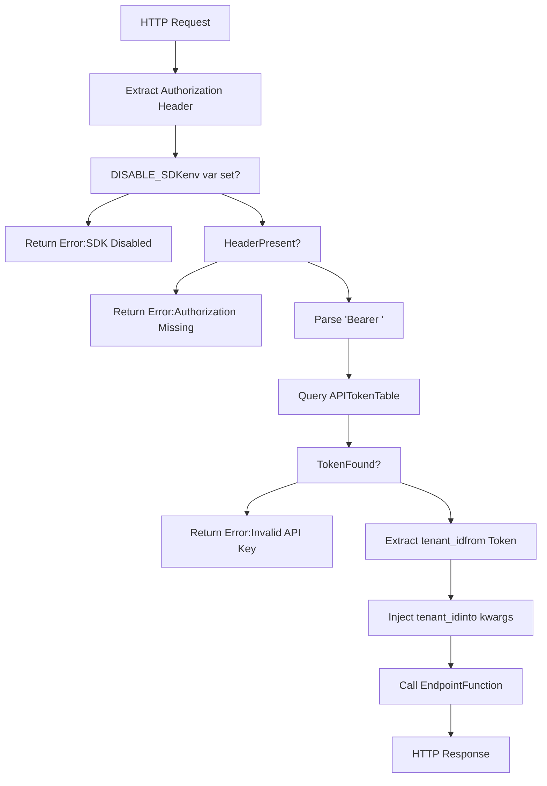
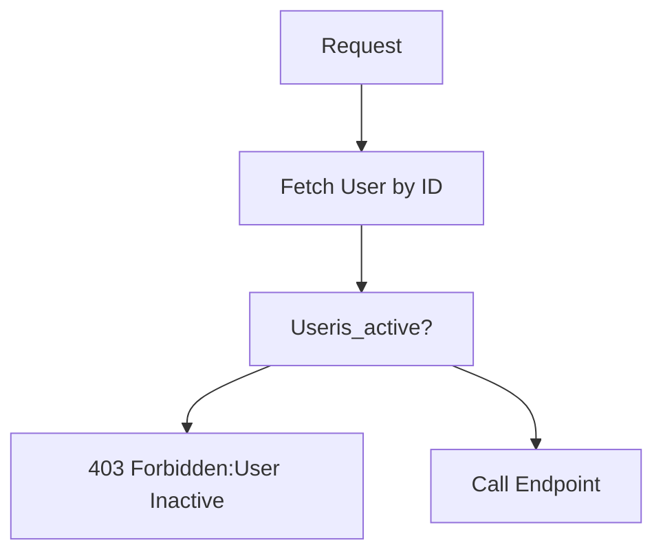
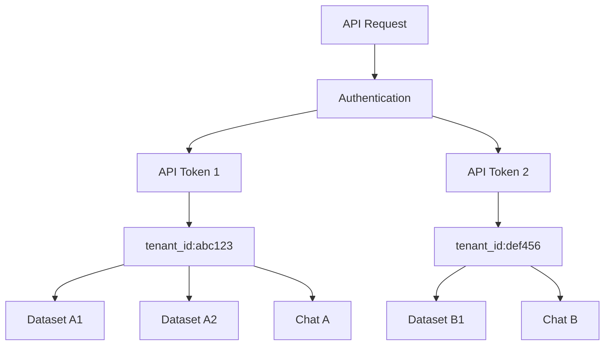
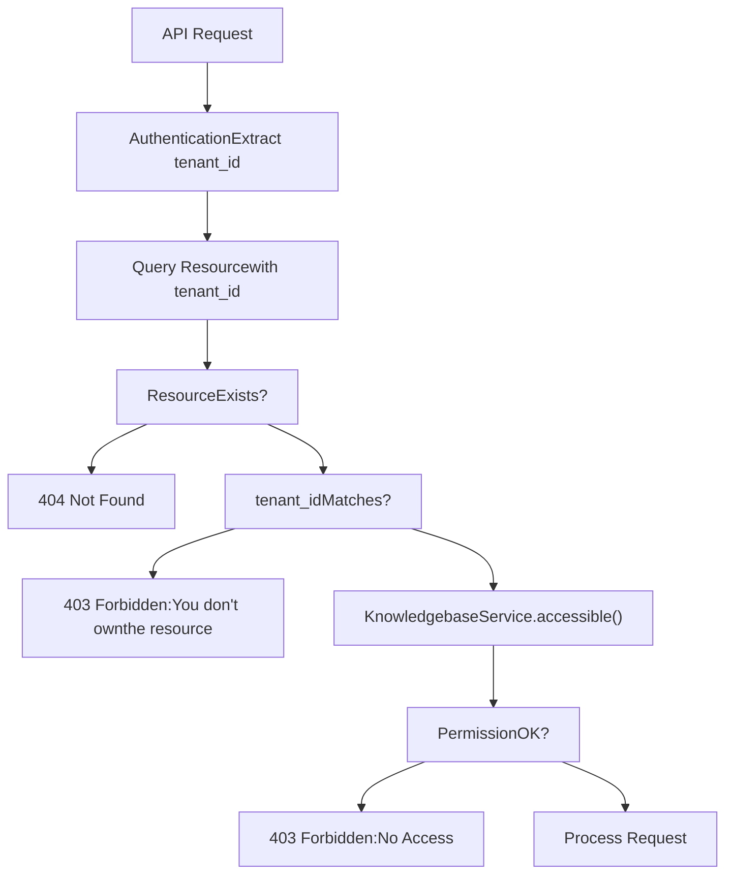
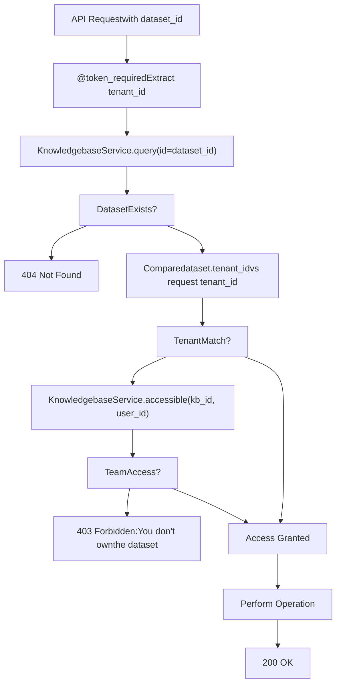

# Authentication and Multi-tenancy

Relevant source files

-   [admin/client/README.md](https://github.com/infiniflow/ragflow/blob/80a16e71/admin/client/README.md)
-   [admin/client/http\_client.py](https://github.com/infiniflow/ragflow/blob/80a16e71/admin/client/http_client.py)
-   [admin/client/parser.py](https://github.com/infiniflow/ragflow/blob/80a16e71/admin/client/parser.py)
-   [admin/client/pyproject.toml](https://github.com/infiniflow/ragflow/blob/80a16e71/admin/client/pyproject.toml)
-   [admin/client/ragflow\_cli.py](https://github.com/infiniflow/ragflow/blob/80a16e71/admin/client/ragflow_cli.py)
-   [admin/client/ragflow\_client.py](https://github.com/infiniflow/ragflow/blob/80a16e71/admin/client/ragflow_client.py)
-   [admin/client/user.py](https://github.com/infiniflow/ragflow/blob/80a16e71/admin/client/user.py)
-   [admin/server/admin\_server.py](https://github.com/infiniflow/ragflow/blob/80a16e71/admin/server/admin_server.py)
-   [admin/server/auth.py](https://github.com/infiniflow/ragflow/blob/80a16e71/admin/server/auth.py)
-   [admin/server/config.py](https://github.com/infiniflow/ragflow/blob/80a16e71/admin/server/config.py)
-   [admin/server/routes.py](https://github.com/infiniflow/ragflow/blob/80a16e71/admin/server/routes.py)
-   [admin/server/services.py](https://github.com/infiniflow/ragflow/blob/80a16e71/admin/server/services.py)
-   [agent/tools/retrieval.py](https://github.com/infiniflow/ragflow/blob/80a16e71/agent/tools/retrieval.py)
-   [api/apps/sdk/chat.py](https://github.com/infiniflow/ragflow/blob/80a16e71/api/apps/sdk/chat.py)
-   [api/apps/sdk/dataset.py](https://github.com/infiniflow/ragflow/blob/80a16e71/api/apps/sdk/dataset.py)
-   [api/apps/sdk/dify\_retrieval.py](https://github.com/infiniflow/ragflow/blob/80a16e71/api/apps/sdk/dify_retrieval.py)
-   [api/apps/sdk/doc.py](https://github.com/infiniflow/ragflow/blob/80a16e71/api/apps/sdk/doc.py)
-   [api/apps/sdk/session.py](https://github.com/infiniflow/ragflow/blob/80a16e71/api/apps/sdk/session.py)
-   [api/constants.py](https://github.com/infiniflow/ragflow/blob/80a16e71/api/constants.py)
-   [api/db/services/canvas\_service.py](https://github.com/infiniflow/ragflow/blob/80a16e71/api/db/services/canvas_service.py)
-   [api/db/services/conversation\_service.py](https://github.com/infiniflow/ragflow/blob/80a16e71/api/db/services/conversation_service.py)
-   [api/db/services/system\_settings\_service.py](https://github.com/infiniflow/ragflow/blob/80a16e71/api/db/services/system_settings_service.py)
-   [api/ragflow\_server.py](https://github.com/infiniflow/ragflow/blob/80a16e71/api/ragflow_server.py)
-   [api/utils/api\_utils.py](https://github.com/infiniflow/ragflow/blob/80a16e71/api/utils/api_utils.py)
-   [api/utils/configs.py](https://github.com/infiniflow/ragflow/blob/80a16e71/api/utils/configs.py)
-   [api/utils/health\_utils.py](https://github.com/infiniflow/ragflow/blob/80a16e71/api/utils/health_utils.py)
-   [common/connection\_utils.py](https://github.com/infiniflow/ragflow/blob/80a16e71/common/connection_utils.py)
-   [conf/system\_settings.json](https://github.com/infiniflow/ragflow/blob/80a16e71/conf/system_settings.json)
-   [docs/references/http\_api\_reference.md](https://github.com/infiniflow/ragflow/blob/80a16e71/docs/references/http_api_reference.md)
-   [docs/references/python\_api\_reference.md](https://github.com/infiniflow/ragflow/blob/80a16e71/docs/references/python_api_reference.md)
-   [docs/release\_notes.md](https://github.com/infiniflow/ragflow/blob/80a16e71/docs/release_notes.md)
-   [rag/advanced\_rag/\_\_init\_\_.py](https://github.com/infiniflow/ragflow/blob/80a16e71/rag/advanced_rag/__init__.py)
-   [rag/benchmark.py](https://github.com/infiniflow/ragflow/blob/80a16e71/rag/benchmark.py)
-   [sdk/python/ragflow\_sdk/modules/chat.py](https://github.com/infiniflow/ragflow/blob/80a16e71/sdk/python/ragflow_sdk/modules/chat.py)
-   [sdk/python/ragflow\_sdk/ragflow.py](https://github.com/infiniflow/ragflow/blob/80a16e71/sdk/python/ragflow_sdk/ragflow.py)

## Purpose and Scope

This document describes RAGFlow's authentication and multi-tenancy implementation, covering how API requests are authenticated, how tenant isolation is enforced, and how resource ownership is verified across the system. For details on HTTP API endpoint specifications, see [7.1](/infiniflow/ragflow/7.1-connector-architecture). For chat and conversation-specific authentication patterns, see [7.2](/infiniflow/ragflow/7.2-synchronization-and-scheduling).

---

## Authentication Mechanisms

RAGFlow implements a token-based authentication system using API keys. All HTTP API requests must include an `Authorization` header with a Bearer token format.

### API Token Structure

API tokens are stored in the `APIToken` database model and associated with specific tenants. The token validation flow extracts the tenant ID from the token, enabling multi-tenant resource isolation.

**Authorization Header Format:**

```
Authorization: Bearer <YOUR_API_KEY>
```
### Token Validation Process

The system validates tokens through database lookup:

| Step | Action | Code Reference |
| --- | --- | --- |
| 1 | Extract token from `Authorization` header | [api/utils/api\_utils.py254-260](https://github.com/infiniflow/ragflow/blob/80a16e71/api/utils/api_utils.py#L254-L260) |
| 2 | Query `APIToken` table with token value | [api/utils/api\_utils.py261](https://github.com/infiniflow/ragflow/blob/80a16e71/api/utils/api_utils.py#L261-L261) |
| 3 | Verify token exists and extract `tenant_id` | [api/utils/api\_utils.py262-264](https://github.com/infiniflow/ragflow/blob/80a16e71/api/utils/api_utils.py#L262-L264) |
| 4 | Pass `tenant_id` to endpoint handler | [api/utils/api\_utils.py264](https://github.com/infiniflow/ragflow/blob/80a16e71/api/utils/api_utils.py#L264-L264) |

### Error Codes

| Code | Message | Trigger Condition |
| --- | --- | --- |
| 401 | Unauthorized | Missing or invalid Authorization header |
| 403 | Forbidden | Invalid API key or insufficient permissions |

**Sources:** [api/utils/api\_utils.py250-283](https://github.com/infiniflow/ragflow/blob/80a16e71/api/utils/api_utils.py#L250-L283) [docs/references/http\_api\_reference.md16-25](https://github.com/infiniflow/ragflow/blob/80a16e71/docs/references/http_api_reference.md#L16-L25)

---

## Authentication Decorators

RAGFlow uses Python decorators to enforce authentication on API endpoints. These decorators wrap endpoint functions and inject the authenticated tenant ID.

### token\_required Decorator


**Decorator Implementation Pattern:**

The `token_required` decorator (lines 250-283) handles both synchronous and asynchronous endpoint functions by checking if the wrapped function is a coroutine using `inspect.iscoroutinefunction()`.

**Usage Example:**

```
@manager.route("/datasets", methods=["POST"])
@token_required
async def create(tenant_id):
    # tenant_id is automatically injected by decorator
    # Endpoint implementation
```
**Sources:** [api/utils/api\_utils.py250-283](https://github.com/infiniflow/ragflow/blob/80a16e71/api/utils/api_utils.py#L250-L283) [api/apps/sdk/dataset.py55-57](https://github.com/infiniflow/ragflow/blob/80a16e71/api/apps/sdk/dataset.py#L55-L57) [api/apps/sdk/doc.py72-74](https://github.com/infiniflow/ragflow/blob/80a16e71/api/apps/sdk/doc.py#L72-L74)

### apikey\_required Decorator

Similar to `token_required` but with simplified error handling. Used primarily for legacy API compatibility.

**Key Differences:**

-   No `DISABLE_SDK` environment variable check
-   Simpler error response format using `build_error_result()`
-   Returns HTTP status code in response object

**Sources:** [api/utils/api\_utils.py220-233](https://github.com/infiniflow/ragflow/blob/80a16e71/api/utils/api_utils.py#L220-L233)

### active\_required Decorator

Enforces user account activation status before allowing API access:


**Sources:** [api/utils/api\_utils.py197-212](https://github.com/infiniflow/ragflow/blob/80a16e71/api/utils/api_utils.py#L197-L212)

---

## Multi-tenancy Architecture

RAGFlow implements a strict tenant isolation model where all resources (datasets, documents, chats, agents) are scoped to a specific tenant.

### Tenant Isolation Model


### Tenant ID Propagation

Every authenticated API endpoint receives `tenant_id` as a parameter:

**Propagation Pattern:**

1.  `token_required` decorator extracts `tenant_id` from `APIToken`
2.  Decorator injects `tenant_id` into function `kwargs`
3.  Endpoint function signature includes `tenant_id` parameter
4.  Service layer methods receive `tenant_id` for queries

**Example Flow:**

```
# Decorator injects tenant_id
@token_required
async def create(tenant_id):
    # Query with tenant_id for isolation
    kb = KnowledgebaseService.query(id=dataset_id, tenant_id=tenant_id)
```
**Sources:** [api/apps/sdk/dataset.py55-117](https://github.com/infiniflow/ragflow/blob/80a16e71/api/apps/sdk/dataset.py#L55-L117) [api/apps/sdk/doc.py72-182](https://github.com/infiniflow/ragflow/blob/80a16e71/api/apps/sdk/doc.py#L72-L182)

### Resource Ownership Verification

RAGFlow verifies resource ownership at multiple layers:


**Verification Patterns in Code:**

| Pattern | Location | Purpose |
| --- | --- | --- |
| Direct tenant\_id query | [api/apps/sdk/dataset.py166-168](https://github.com/infiniflow/ragflow/blob/80a16e71/api/apps/sdk/dataset.py#L166-L168) | Verify dataset ownership |
| `KnowledgebaseService.accessible()` | [api/apps/sdk/doc.py532-533](https://github.com/infiniflow/ragflow/blob/80a16e71/api/apps/sdk/doc.py#L532-L533) | Check read permissions |
| `KnowledgebaseService.query(tenant_id=)` | [api/apps/sdk/dataset.py196-199](https://github.com/infiniflow/ragflow/blob/80a16e71/api/apps/sdk/dataset.py#L196-L199) | Ensure tenant isolation |

**Sources:** [api/apps/sdk/dataset.py160-271](https://github.com/infiniflow/ragflow/blob/80a16e71/api/apps/sdk/dataset.py#L160-L271) [api/apps/sdk/doc.py532-542](https://github.com/infiniflow/ragflow/blob/80a16e71/api/apps/sdk/doc.py#L532-L542)

---

## Permission Models

RAGFlow implements a two-tier permission system: `me` (personal) and `team` (shared with team members).

### Permission Types

### Permission Field Storage

Datasets and other resources store the `permission` field with allowed values:

-   `"me"`: Only the creating user (tenant) can access
-   `"team"`: All team members sharing the same team can access

**Database Schema Example:**

```
# Dataset creation request
{
    "name": "my_dataset",
    "permission": "team"  # or "me"
}
```
**Validation in Code:**

The `KnowledgebaseService.accessible()` method checks both direct ownership and team-based permissions when determining if a user can access a resource.

**Sources:** [api/apps/sdk/dataset.py94-97](https://github.com/infiniflow/ragflow/blob/80a16e71/api/apps/sdk/dataset.py#L94-L97) [docs/references/http\_api\_reference.md496-500](https://github.com/infiniflow/ragflow/blob/80a16e71/docs/references/http_api_reference.md#L496-L500)

### Team Membership Resolution

Team membership is resolved through the tenant system:

1.  Each user has a `tenant_id`
2.  Users can belong to the same team (share team affiliation)
3.  Team-scoped resources are accessible to all members with matching team membership
4.  The `UserTenantService` and `TenantService` manage team relationships

**Sources:** [api/apps/dialog\_app.py23](https://github.com/infiniflow/ragflow/blob/80a16e71/api/apps/dialog_app.py#L23-L23) [api/apps/sdk/chat.py21](https://github.com/infiniflow/ragflow/blob/80a16e71/api/apps/sdk/chat.py#L21-L21)

---

## Authentication Flow Diagrams

### Complete API Request Authentication Flow

> **[Mermaid sequence]**
> *(图表结构无法解析)*

**Sources:** [api/utils/api\_utils.py250-283](https://github.com/infiniflow/ragflow/blob/80a16e71/api/utils/api_utils.py#L250-L283) [api/apps/sdk/dataset.py55-200](https://github.com/infiniflow/ragflow/blob/80a16e71/api/apps/sdk/dataset.py#L55-L200)

### Resource Access Control Flow


**Code Mapping:**

-   `KnowledgebaseService.query(id=dataset_id)` - [api/apps/sdk/dataset.py166](https://github.com/infiniflow/ragflow/blob/80a16e71/api/apps/sdk/dataset.py#L166-L166)
-   `KnowledgebaseService.accessible(kb_id, user_id)` - [api/apps/sdk/doc.py532](https://github.com/infiniflow/ragflow/blob/80a16e71/api/apps/sdk/doc.py#L532-L532)
-   Tenant ownership check - [api/apps/sdk/dataset.py196-199](https://github.com/infiniflow/ragflow/blob/80a16e71/api/apps/sdk/dataset.py#L196-L199)

**Sources:** [api/apps/sdk/dataset.py160-200](https://github.com/infiniflow/ragflow/blob/80a16e71/api/apps/sdk/dataset.py#L160-L200) [api/apps/sdk/doc.py532-542](https://github.com/infiniflow/ragflow/blob/80a16e71/api/apps/sdk/doc.py#L532-L542)

---

## OpenAI-Compatible API Authentication

RAGFlow provides OpenAI-compatible endpoints that follow the same authentication pattern:

### Endpoint Pattern

**Chat Completion Endpoint:**

```
POST /api/v1/chats_openai/{chat_id}/chat/completions
```
**Agent Completion Endpoint:**

```
POST /api/v1/agents_openai/{agent_id}/chat/completions
```
Both endpoints require the same `Authorization: Bearer <YOUR_API_KEY>` header format and perform identical token validation.

**Sources:** [docs/references/http\_api\_reference.md28-173](https://github.com/infiniflow/ragflow/blob/80a16e71/docs/references/http_api_reference.md#L28-L173) [docs/references/http\_api\_reference.md176-415](https://github.com/infiniflow/ragflow/blob/80a16e71/docs/references/http_api_reference.md#L176-L415)

---

## Database Schema for Authentication

### APIToken Table Structure

The `APIToken` model stores authentication tokens and their associated tenant relationships:

| Field | Type | Purpose |
| --- | --- | --- |
| `token` | String | Unique API key value |
| `tenant_id` | String | Foreign key to tenant |
| (other fields) | Various | Token metadata |

**Token Query Pattern:**

```
objs = APIToken.query(token=token)
if not objs:
    return error("Invalid API Key")
tenant_id = objs[0].tenant_id
```
**Sources:** [api/utils/api\_utils.py38](https://github.com/infiniflow/ragflow/blob/80a16e71/api/utils/api_utils.py#L38-L38) [api/utils/api\_utils.py261-264](https://github.com/infiniflow/ragflow/blob/80a16e71/api/utils/api_utils.py#L261-L264)

---

## Environment Variable Controls

RAGFlow supports environment-based authentication controls:

| Variable | Default | Effect |
| --- | --- | --- |
| `DISABLE_SDK` | Not set | When set, disables SDK/API access entirely |
| `REGISTER_ENABLED` | 1 | Controls user registration (0=disabled, 1=enabled) |

**Implementation:**

-   `DISABLE_SDK` check in `token_required`: [api/utils/api\_utils.py252-253](https://github.com/infiniflow/ragflow/blob/80a16e71/api/utils/api_utils.py#L252-L253)
-   `REGISTER_ENABLED` in environment: [docker/.env206-208](https://github.com/infiniflow/ragflow/blob/80a16e71/docker/.env#L206-L208)

**Sources:** [api/utils/api\_utils.py252-253](https://github.com/infiniflow/ragflow/blob/80a16e71/api/utils/api_utils.py#L252-L253) [docker/.env206-208](https://github.com/infiniflow/ragflow/blob/80a16e71/docker/.env#L206-L208)

---

## Best Practices Summary

### For API Consumers

1.  **Store API Keys Securely:** Never commit API keys to version control
2.  **Use Environment Variables:** Load tokens from environment variables
3.  **Handle 401/403 Errors:** Implement proper error handling for authentication failures
4.  **Verify Resource Ownership:** Check error messages for ownership violations

### For Developers

1.  **Always Use Decorators:** Apply `@token_required` to all authenticated endpoints
2.  **Verify tenant\_id:** Always filter queries by `tenant_id` parameter
3.  **Use Service Layer Methods:** Leverage `KnowledgebaseService.accessible()` for permissions
4.  **Return Appropriate Errors:** Use standard HTTP status codes (401, 403, 404)

**Sources:** [api/utils/api\_utils.py250-333](https://github.com/infiniflow/ragflow/blob/80a16e71/api/utils/api_utils.py#L250-L333) [api/apps/sdk/dataset.py55-271](https://github.com/infiniflow/ragflow/blob/80a16e71/api/apps/sdk/dataset.py#L55-L271)
