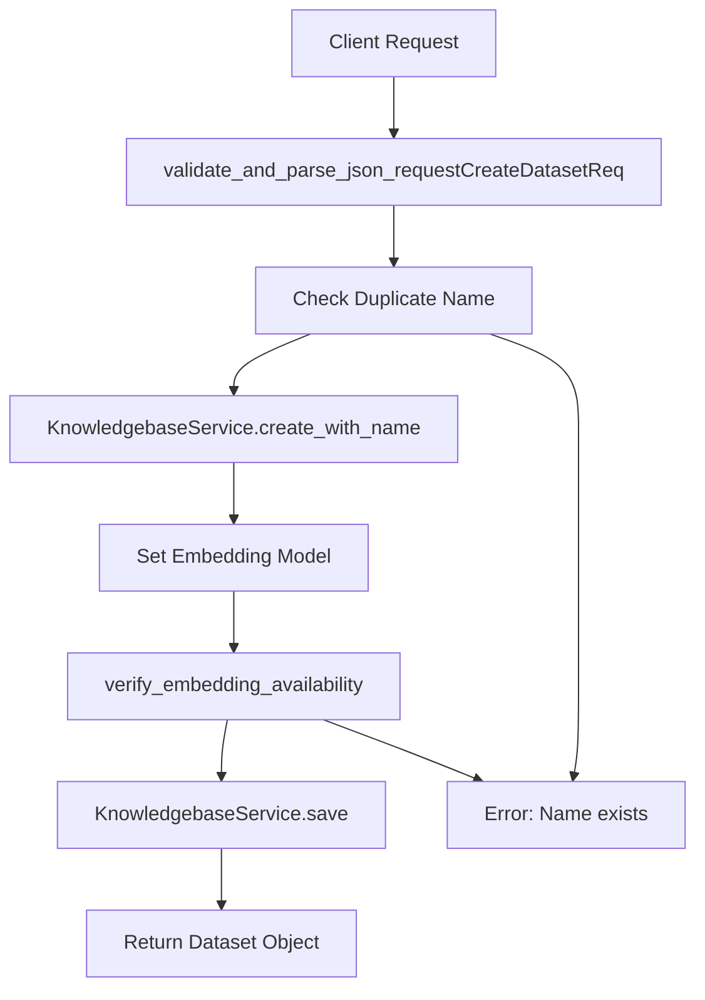
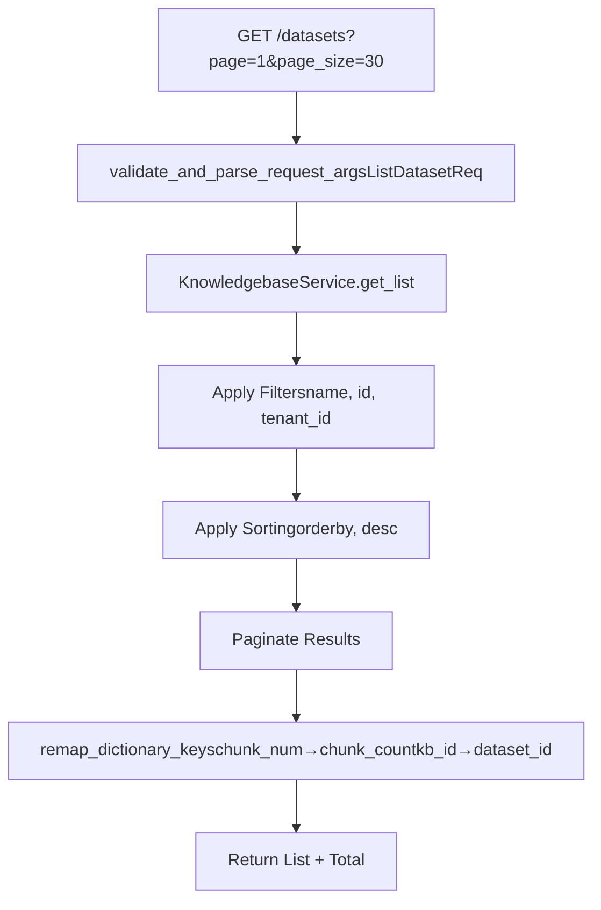
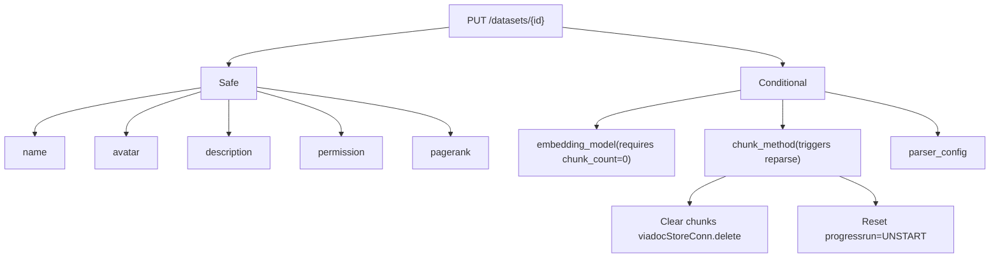
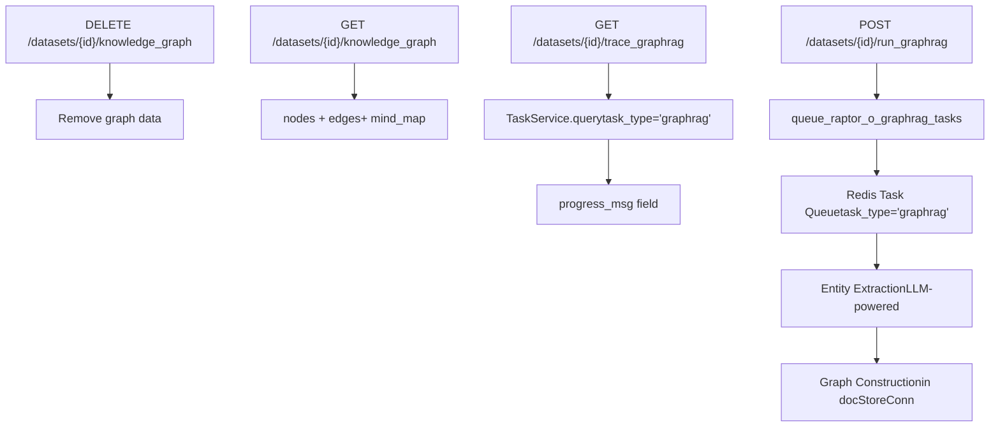
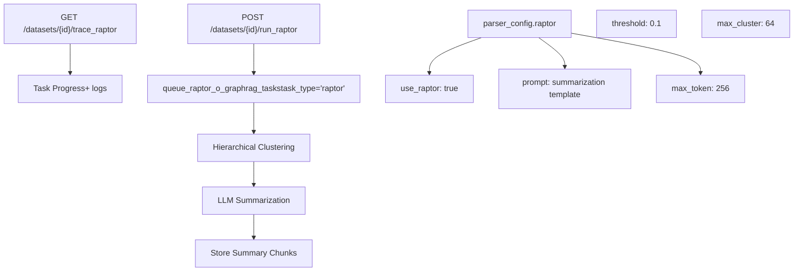
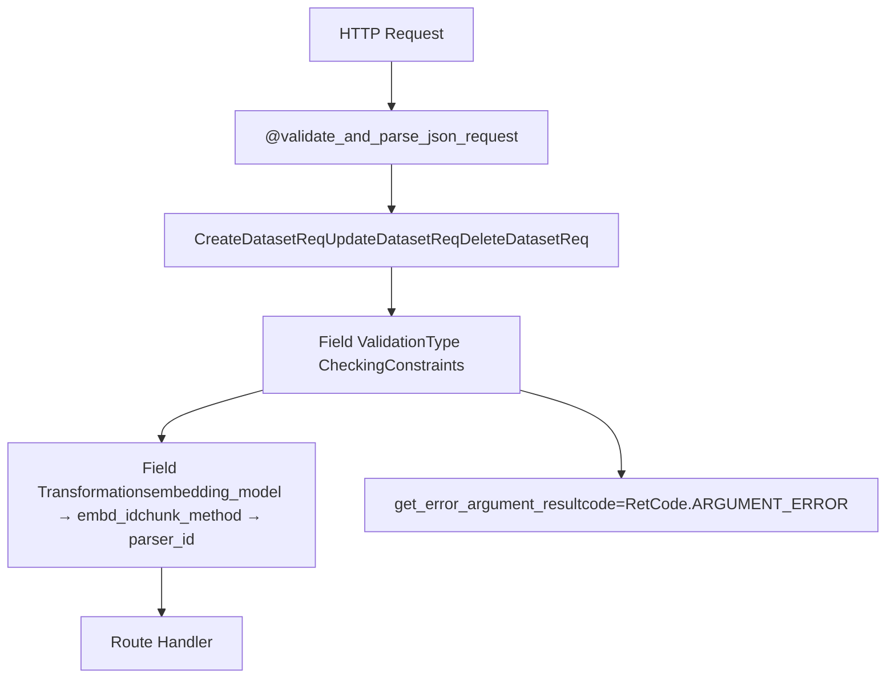
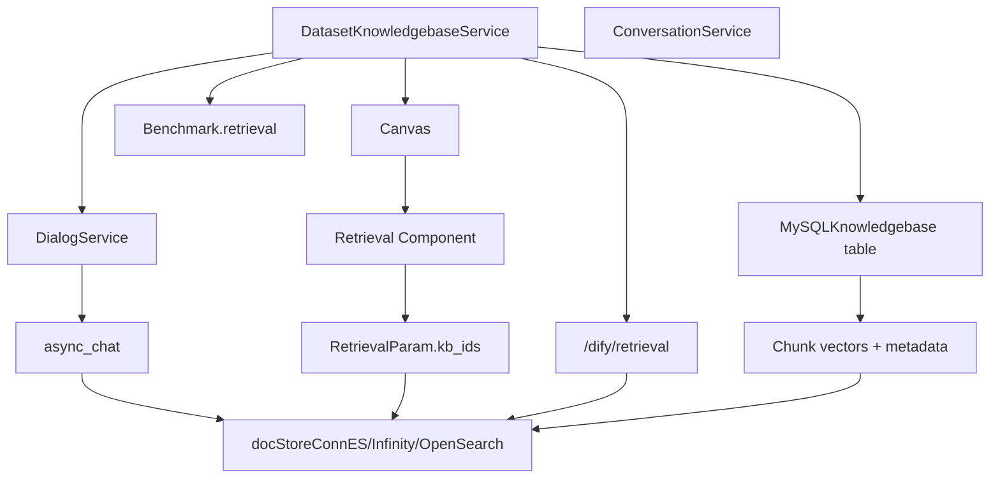
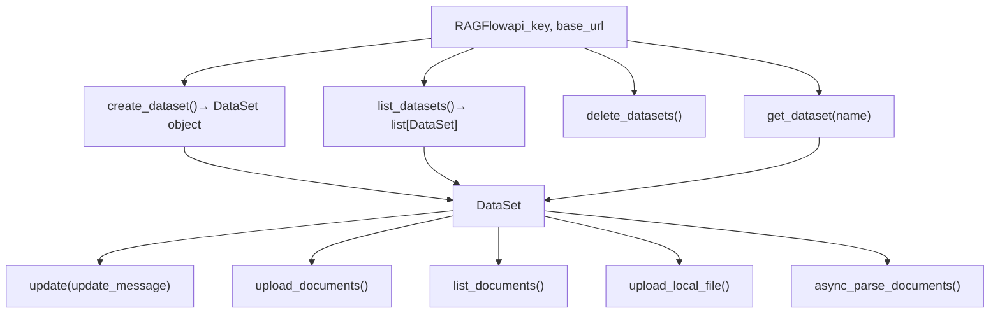

# Dataset and Knowledge Base APIs

Relevant source files

-   [agent/tools/retrieval.py](https://github.com/infiniflow/ragflow/blob/80a16e71/agent/tools/retrieval.py)
-   [api/apps/sdk/chat.py](https://github.com/infiniflow/ragflow/blob/80a16e71/api/apps/sdk/chat.py)
-   [api/apps/sdk/dataset.py](https://github.com/infiniflow/ragflow/blob/80a16e71/api/apps/sdk/dataset.py)
-   [api/apps/sdk/dify\_retrieval.py](https://github.com/infiniflow/ragflow/blob/80a16e71/api/apps/sdk/dify_retrieval.py)
-   [api/apps/sdk/doc.py](https://github.com/infiniflow/ragflow/blob/80a16e71/api/apps/sdk/doc.py)
-   [api/apps/sdk/session.py](https://github.com/infiniflow/ragflow/blob/80a16e71/api/apps/sdk/session.py)
-   [api/db/services/canvas\_service.py](https://github.com/infiniflow/ragflow/blob/80a16e71/api/db/services/canvas_service.py)
-   [api/db/services/conversation\_service.py](https://github.com/infiniflow/ragflow/blob/80a16e71/api/db/services/conversation_service.py)
-   [api/utils/api\_utils.py](https://github.com/infiniflow/ragflow/blob/80a16e71/api/utils/api_utils.py)
-   [docs/references/http\_api\_reference.md](https://github.com/infiniflow/ragflow/blob/80a16e71/docs/references/http_api_reference.md)
-   [docs/references/python\_api\_reference.md](https://github.com/infiniflow/ragflow/blob/80a16e71/docs/references/python_api_reference.md)
-   [docs/release\_notes.md](https://github.com/infiniflow/ragflow/blob/80a16e71/docs/release_notes.md)
-   [rag/advanced\_rag/\_\_init\_\_.py](https://github.com/infiniflow/ragflow/blob/80a16e71/rag/advanced_rag/__init__.py)
-   [rag/benchmark.py](https://github.com/infiniflow/ragflow/blob/80a16e71/rag/benchmark.py)
-   [sdk/python/ragflow\_sdk/modules/chat.py](https://github.com/infiniflow/ragflow/blob/80a16e71/sdk/python/ragflow_sdk/modules/chat.py)
-   [sdk/python/ragflow\_sdk/ragflow.py](https://github.com/infiniflow/ragflow/blob/80a16e71/sdk/python/ragflow_sdk/ragflow.py)

This document describes the HTTP API endpoints for creating, configuring, and managing datasets (knowledge bases) in RAGFlow. These endpoints handle dataset lifecycle operations, parser configurations, embedding model selection, and advanced RAG features like knowledge graphs and RAPTOR.

**Scope**: This page covers dataset-level operations. For document upload and chunk management within datasets, see [Document and File Management APIs](/infiniflow/ragflow/8.4-document-and-file-management-apis). For using datasets in chat conversations, see [Chat and Conversation APIs](/infiniflow/ragflow/8.5-chat-and-conversation-apis).

---

## Authentication

All dataset API endpoints require authentication via API token in the `Authorization` header:

```
Authorization: Bearer <YOUR_API_KEY>
```
The `@token_required` decorator [api/utils/api\_utils.py261-294](https://github.com/infiniflow/ragflow/blob/80a16e71/api/utils/api_utils.py#L261-L294) validates the token and extracts the `tenant_id` for all subsequent operations. For details on obtaining and managing API keys, see [Authentication and Authorization](/infiniflow/ragflow/8.2-authentication-and-authorization).

Sources: [api/utils/api\_utils.py261-294](https://github.com/infiniflow/ragflow/blob/80a16e71/api/utils/api_utils.py#L261-L294) [api/apps/sdk/dataset.py55-57](https://github.com/infiniflow/ragflow/blob/80a16e71/api/apps/sdk/dataset.py#L55-L57)

---

## Dataset Lifecycle Operations

### Create Dataset

**Endpoint**: `POST /api/v1/datasets`

Creates a new dataset with specified configuration. The system supports two mutually exclusive ingestion approaches:

1.  **Built-in chunk method** - Use predefined parsers (`naive`, `book`, `paper`, etc.)
2.  **Ingestion pipeline** - Use custom canvas-based data processing workflows

#### Request Flow


Sources: [api/apps/sdk/dataset.py55-155](https://github.com/infiniflow/ragflow/blob/80a16e71/api/apps/sdk/dataset.py#L55-L155) [api/utils/api\_utils.py352-427](https://github.com/infiniflow/ragflow/blob/80a16e71/api/utils/api_utils.py#L352-L427)

#### Request Parameters

| Parameter | Type | Required | Description |
| --- | --- | --- | --- |
| `name` | string | Yes | Unique dataset name (max 128 chars, case-insensitive) |
| `avatar` | string | No | Base64-encoded avatar (max 65535 chars) |
| `description` | string | No | Dataset description (max 65535 chars) |
| `embedding_model` | string | No | Format: `model_name@model_factory` (max 255 chars) |
| `permission` | enum | No | `"me"` (default) or `"team"` |
| `chunk_method` | enum | No | See table below (default: `"naive"`) |
| `parser_config` | object | No | Parser-specific configuration |
| `parse_type` | int | No | Number of parsers in pipeline (requires `pipeline_id`) |
| `pipeline_id` | string | No | 32-char hex pipeline ID (requires `parse_type`) |

**Chunk Methods**:

| Method | Description | Use Case |
| --- | --- | --- |
| `naive` | General-purpose | Default for mixed content |
| `book` | Book structure | Long-form books with chapters |
| `paper` | Academic papers | Papers with abstract/sections |
| `qa` | Question-Answer | FAQ documents |
| `table` | Tabular data | Structured tables |
| `laws` | Legal documents | Law/regulation texts |
| `presentation` | Slides | PowerPoint/Keynote |
| `email` | Email threads | Email conversations |
| `picture` | Image documents | Image-heavy content |
| `one` | No chunking | Treat as single chunk |
| `tag` | Tag-based | Use predefined tag sets |

Sources: [docs/references/http\_api\_reference.md423-627](https://github.com/infiniflow/ragflow/blob/80a16e71/docs/references/http_api_reference.md#L423-L627) [api/apps/sdk/dataset.py119-127](https://github.com/infiniflow/ragflow/blob/80a16e71/api/apps/sdk/dataset.py#L119-L127)

#### Parser Configuration Structure

The `parser_config` object varies by `chunk_method`. For `naive` method:

```
{
  "chunk_token_num": 512,
  "delimiter": "\n",
  "auto_keywords": 0,
  "auto_questions": 0,
  "html4excel": false,
  "layout_recognize": "DeepDOC",
  "task_page_size": 12,
  "tag_kb_ids": [],
  "table_context_size": 0,
  "image_context_size": 0,
  "raptor": {
    "use_raptor": false,
    "prompt": "Summarization prompt...",
    "max_token": 256,
    "threshold": 0.1,
    "max_cluster": 64,
    "random_seed": 0
  },
  "graphrag": {
    "use_graphrag": false,
    "entity_types": ["organization", "person", "geo", "event", "category"],
    "method": "light"
  }
}
```
The `get_parser_config()` function [api/utils/api\_utils.py352-427](https://github.com/infiniflow/ragflow/blob/80a16e71/api/utils/api_utils.py#L352-L427) provides defaults and performs deep merging of configurations.

Sources: [api/utils/api\_utils.py352-427](https://github.com/infiniflow/ragflow/blob/80a16e71/api/utils/api_utils.py#L352-L427) [docs/references/http\_api\_reference.md519-556](https://github.com/infiniflow/ragflow/blob/80a16e71/docs/references/http_api_reference.md#L519-L556)

#### Example Request

```
curl --request POST \
  --url http://{address}/api/v1/datasets \
  --header 'Content-Type: application/json' \
  --header 'Authorization: Bearer <YOUR_API_KEY>' \
  --data '{
    "name": "technical_docs",
    "embedding_model": "BAAI/bge-large-zh-v1.5@BAAI",
    "chunk_method": "naive",
    "parser_config": {
      "chunk_token_num": 128,
      "auto_keywords": 3,
      "graphrag": {"use_graphrag": true}
    }
  }'
```
#### Response Format

```
{
  "code": 0,
  "data": {
    "id": "3b4de7d4241d11f0a6a79f24fc270c7f",
    "name": "technical_docs",
    "avatar": null,
    "chunk_count": 0,
    "chunk_method": "naive",
    "create_date": "Mon, 28 Apr 2025 18:40:41 GMT",
    "create_time": 1745836841611,
    "created_by": "3af81804241d11f0a6a79f24fc270c7f",
    "description": null,
    "document_count": 0,
    "embedding_model": "BAAI/bge-large-zh-v1.5@BAAI",
    "language": "English",
    "parser_config": {
      "chunk_token_num": 128,
      "delimiter": "\\n!?;。；！？",
      "html4excel": false,
      "layout_recognize": "DeepDOC",
      "raptor": {"use_raptor": false},
      "graphrag": {"use_graphrag": true}
    },
    "permission": "me",
    "similarity_threshold": 0.2,
    "status": "1",
    "tenant_id": "3af81804241d11f0a6a79f24fc270c7f",
    "token_num": 0,
    "update_date": "Mon, 28 Apr 2025 18:40:41 GMT",
    "update_time": 1745836841611,
    "vector_similarity_weight": 0.3
  }
}
```
Sources: [docs/references/http\_api\_reference.md577-627](https://github.com/infiniflow/ragflow/blob/80a16e71/docs/references/http_api_reference.md#L577-L627) [api/apps/sdk/dataset.py144-154](https://github.com/infiniflow/ragflow/blob/80a16e71/api/apps/sdk/dataset.py#L144-L154)

---

### List Datasets

**Endpoint**: `GET /api/v1/datasets`

Retrieves datasets with pagination, filtering, and sorting.

#### Query Parameters

| Parameter | Type | Default | Description |
| --- | --- | --- | --- |
| `page` | int | 1 | Page number |
| `page_size` | int | 30 | Items per page |
| `orderby` | string | `create_time` | Sort field (`create_time` or `update_time`) |
| `desc` | boolean | true | Sort descending |
| `name` | string | \- | Filter by name |
| `id` | string | \- | Filter by ID |

#### Implementation Flow


Sources: [api/apps/sdk/dataset.py358-436](https://github.com/infiniflow/ragflow/blob/80a16e71/api/apps/sdk/dataset.py#L358-L436) [api/db/services/knowledgebase\_service.py](https://github.com/infiniflow/ragflow/blob/80a16e71/api/db/services/knowledgebase_service.py)

#### Example Response

```
{
  "code": 0,
  "data": [
    {
      "id": "6e211ee0723611efa10a0242ac120007",
      "name": "mysql",
      "chunk_count": 59,
      "chunk_method": "naive",
      "document_count": 1,
      "embedding_model": "BAAI/bge-large-zh-v1.5",
      "create_date": "Sat, 14 Sep 2024 01:12:37 GMT",
      "parser_config": {
        "chunk_token_num": 8192,
        "delimiter": "\\n"
      },
      "permission": "me",
      "similarity_threshold": 0.2,
      "token_num": 12744,
      "vector_similarity_weight": 0.3
    }
  ],
  "total": 1
}
```
Sources: [docs/references/http\_api\_reference.md819-911](https://github.com/infiniflow/ragflow/blob/80a16e71/docs/references/http_api_reference.md#L819-L911)

---

### Update Dataset

**Endpoint**: `PUT /api/v1/datasets/{dataset_id}`

Updates dataset configuration. Critical constraints apply to embedding model changes.

#### Updatable Fields


Sources: [api/apps/sdk/dataset.py254-357](https://github.com/infiniflow/ragflow/blob/80a16e71/api/apps/sdk/dataset.py#L254-L357) [docs/references/http\_api\_reference.md687-816](https://github.com/infiniflow/ragflow/blob/80a16e71/docs/references/http_api_reference.md#L687-L816)

#### Embedding Model Constraint

The system enforces `chunk_count == 0` before changing `embedding_model` to prevent vector dimension mismatches:

```
# From api/apps/sdk/dataset.py:339-345
if "embd_id" in req and req["embd_id"] != kb.embd_id:
    if kb.chunk_num > 0:
        return get_error_data_result(
            message="Cannot change embedding model while chunks exist. "
                    "Please remove all documents first."
        )
```
#### Parser Config Deep Merge

When updating `parser_config`, the system performs deep merging [api/utils/api\_utils.py31-41](https://github.com/infiniflow/ragflow/blob/80a16e71/api/utils/api_utils.py#L31-L41) to preserve unspecified fields:

```
# From api/apps/sdk/dataset.py:336-342
if req.get("parser_config"):
    req["parser_config"] = deep_merge(kb.parser_config, req["parser_config"])

if (chunk_method := req.get("parser_id")) and chunk_method != kb.parser_id:
    if not req.get("parser_config"):
        req["parser_config"] = get_parser_config(chunk_method, None)
```
Sources: [api/apps/sdk/dataset.py329-357](https://github.com/infiniflow/ragflow/blob/80a16e71/api/apps/sdk/dataset.py#L329-L357) [api/utils/api\_utils.py31-41](https://github.com/infiniflow/ragflow/blob/80a16e71/api/utils/api_utils.py#L31-L41)

---

### Delete Datasets

**Endpoint**: `DELETE /api/v1/datasets`

Deletes one or more datasets along with all associated documents and chunks.

#### Request Body

```
{
  "ids": ["dataset_id_1", "dataset_id_2"]  // null = delete all
}
```
#### Deletion Process

Sources: [api/apps/sdk/dataset.py156-252](https://github.com/infiniflow/ragflow/blob/80a16e71/api/apps/sdk/dataset.py#L156-L252)

#### Example Request

```
curl --request DELETE \
  --url http://{address}/api/v1/datasets \
  --header 'Content-Type: application/json' \
  --header 'Authorization: Bearer <YOUR_API_KEY>' \
  --data '{
    "ids": ["d94a8dc02c9711f0930f7fbc369eab6d"]
  }'
```
#### Cascade Deletion

The deletion cascades through multiple layers:

1.  **Document chunks** - Deleted from `docStoreConn` (Elasticsearch/Infinity) [api/apps/sdk/dataset.py223](https://github.com/infiniflow/ragflow/blob/80a16e71/api/apps/sdk/dataset.py#L223-L223)
2.  **File records** - Removed from MySQL `File` table [api/apps/sdk/dataset.py227-232](https://github.com/infiniflow/ragflow/blob/80a16e71/api/apps/sdk/dataset.py#L227-L232)
3.  **File2Document mappings** - Deleted from junction table [api/apps/sdk/dataset.py233](https://github.com/infiniflow/ragflow/blob/80a16e71/api/apps/sdk/dataset.py#L233-L233)
4.  **Folder structures** - Removed from storage [api/apps/sdk/dataset.py234-235](https://github.com/infiniflow/ragflow/blob/80a16e71/api/apps/sdk/dataset.py#L234-L235)
5.  **Dataset record** - Final deletion [api/apps/sdk/dataset.py236](https://github.com/infiniflow/ragflow/blob/80a16e71/api/apps/sdk/dataset.py#L236-L236)

Sources: [api/apps/sdk/dataset.py200-252](https://github.com/infiniflow/ragflow/blob/80a16e71/api/apps/sdk/dataset.py#L200-L252)

---

## Advanced RAG Features

### Knowledge Graph Management

RAGFlow supports GraphRAG for entity extraction and relationship mapping. Knowledge graphs are constructed asynchronously from parsed documents.

#### Knowledge Graph Operations


Sources: [docs/references/http\_api\_reference.md914-1154](https://github.com/infiniflow/ragflow/blob/80a16e71/docs/references/http_api_reference.md#L914-L1154) [api/db/services/document\_service.py](https://github.com/infiniflow/ragflow/blob/80a16e71/api/db/services/document_service.py#LNaN-LNaN)

#### Construct Knowledge Graph

**Endpoint**: `POST /api/v1/datasets/{dataset_id}/run_graphrag`

Initiates asynchronous graph construction:

```
// Response
{
  "code": 0,
  "data": {
    "graphrag_task_id": "e498de54bfbb11f0ba028f704583b57b"
  }
}
```
#### Get Construction Status

**Endpoint**: `GET /api/v1/datasets/{dataset_id}/trace_graphrag`

Returns detailed progress information:

```
{
  "code": 0,
  "data": {
    "id": "e498de54bfbb11f0ba028f704583b57b",
    "task_type": "graphrag",
    "progress": 1.0,
    "progress_msg": "19:36:56 created task graphrag\n19:36:57 Task has been received.\n...",
    "process_duration": 2.45419,
    "doc_id": "44661c10bde211f0bc93c164a47ffc40",
    "begin_at": "Wed, 12 Nov 2025 19:36:56 GMT",
    "update_time": 1762947418454
  }
}
```
Sources: [docs/references/http\_api\_reference.md1092-1154](https://github.com/infiniflow/ragflow/blob/80a16e71/docs/references/http_api_reference.md#L1092-L1154)

#### Retrieve Knowledge Graph

**Endpoint**: `GET /api/v1/datasets/{dataset_id}/knowledge_graph`

Returns the constructed graph structure:

```
{
  "code": 0,
  "data": {
    "graph": {
      "directed": false,
      "nodes": [
        {
          "id": "entity_123",
          "entity_name": "RAGFlow",
          "entity_type": "ORGANIZATION",
          "description": "An AI system for retrieval",
          "pagerank": 0.108,
          "rank": 3,
          "source_id": ["doc_id_1", "doc_id_2"]
        }
      ],
      "edges": [
        {
          "source": "entity_123",
          "target": "entity_456",
          "description": "relationship description",
          "weight": 17.0,
          "keywords": ["keyword1", "keyword2"],
          "source_id": ["doc_id_1"]
        }
      ]
    },
    "mind_map": {}
  }
}
```
The graph data is used by the `kg_retriever` [common/settings.py](https://github.com/infiniflow/ragflow/blob/80a16e71/common/settings.py) during retrieval operations. See [agent/tools/retrieval.py127-157](https://github.com/infiniflow/ragflow/blob/80a16e71/agent/tools/retrieval.py#L127-L157) for integration with the Retrieval component.

Sources: [docs/references/http\_api\_reference.md914-991](https://github.com/infiniflow/ragflow/blob/80a16e71/docs/references/http_api_reference.md#L914-L991) [agent/tools/retrieval.py127-157](https://github.com/infiniflow/ragflow/blob/80a16e71/agent/tools/retrieval.py#L127-L157)

---

### RAPTOR Hierarchical Summarization

RAPTOR (Recursive Abstractive Processing for Tree-Organized Retrieval) builds multi-level document summaries for improved long-context retrieval.

#### RAPTOR Operations


Sources: [docs/references/http\_api\_reference.md1157-1258](https://github.com/infiniflow/ragflow/blob/80a16e71/docs/references/http_api_reference.md#L1157-L1258)

#### RAPTOR Configuration

In `parser_config.raptor`:

```
{
  "use_raptor": true,
  "prompt": "Please summarize the following paragraphs. Be careful with the numbers, do not make things up. Paragraphs as following:\n{cluster_content}\nThe above is the content you need to summarize.",
  "max_token": 256,
  "threshold": 0.1,
  "max_cluster": 64,
  "random_seed": 0
}
```
-   **`threshold`**: Similarity threshold for clustering
-   **`max_cluster`**: Maximum clusters per level
-   **`max_token`**: Summary length limit
-   **`prompt`**: Template with `{cluster_content}` placeholder

#### Construct RAPTOR

**Endpoint**: `POST /api/v1/datasets/{dataset_id}/run_raptor`

```
// Response
{
  "code": 0,
  "data": {
    "raptor_task_id": "50d3c31cbfbd11f0ba028f704583b57b"
  }
}
```
#### Get Construction Status

**Endpoint**: `GET /api/v1/datasets/{dataset_id}/trace_raptor`

Returns progress similar to GraphRAG status endpoint with `task_type: "raptor"`.

Sources: [docs/references/http\_api\_reference.md1157-1258](https://github.com/infiniflow/ragflow/blob/80a16e71/docs/references/http_api_reference.md#L1157-L1258) [api/utils/api\_utils.py370-377](https://github.com/infiniflow/ragflow/blob/80a16e71/api/utils/api_utils.py#L370-L377)

---

## Request Validation and Error Handling

### Validation Framework

RAGFlow uses Pydantic models for request validation [api/utils/validation\_utils.py](https://github.com/infiniflow/ragflow/blob/80a16e71/api/utils/validation_utils.py):


Sources: [api/utils/validation\_utils.py](https://github.com/infiniflow/ragflow/blob/80a16e71/api/utils/validation_utils.py) [api/apps/sdk/dataset.py119-127](https://github.com/infiniflow/ragflow/blob/80a16e71/api/apps/sdk/dataset.py#L119-L127)

### Error Response Format

All errors follow a consistent structure:

```
{
  "code": 102,
  "message": "Dataset name 'example' already exists"
}
```
Common error codes:

| Code | Type | Description |
| --- | --- | --- |
| 0 | SUCCESS | Operation succeeded |
| 101 | ARGUMENT\_ERROR | Invalid request parameters |
| 102 | DATA\_ERROR | Data validation failed |
| 103 | PERMISSION\_ERROR | Insufficient permissions |
| 401 | AUTHENTICATION\_ERROR | Invalid API key |

Sources: [common/constants.py](https://github.com/infiniflow/ragflow/blob/80a16e71/common/constants.py#LNaN-LNaN) [api/utils/api\_utils.py113-123](https://github.com/infiniflow/ragflow/blob/80a16e71/api/utils/api_utils.py#L113-L123)

---

## Key Mapping and Field Transformations

The API performs automatic field name transformations between internal database fields and external API fields:

### Database ↔ API Field Mapping

| Database Field | API Field | Direction |
| --- | --- | --- |
| `kb_id` | `dataset_id` | Output |
| `chunk_num` | `chunk_count` | Output |
| `token_num` | `token_count` | Output |
| `parser_id` | `chunk_method` | Both |
| `embd_id` | `embedding_model` | Both |

Implementation in `remap_dictionary_keys()` [api/utils/api\_utils.py543-566](https://github.com/infiniflow/ragflow/blob/80a16e71/api/utils/api_utils.py#L543-L566):

```
key_mapping = {
    "chunk_num": "chunk_count",
    "kb_id": "dataset_id",
    "token_num": "token_count",
    "parser_id": "chunk_method",
}
```
This mapping is applied during:

-   Dataset creation response [api/apps/sdk/dataset.py150](https://github.com/infiniflow/ragflow/blob/80a16e71/api/apps/sdk/dataset.py#L150-L150)
-   Dataset list response [api/apps/sdk/dataset.py412-426](https://github.com/infiniflow/ragflow/blob/80a16e71/api/apps/sdk/dataset.py#L412-L426)
-   Dataset update response [api/apps/sdk/dataset.py348-357](https://github.com/infiniflow/ragflow/blob/80a16e71/api/apps/sdk/dataset.py#L348-L357)

Sources: [api/utils/api\_utils.py543-566](https://github.com/infiniflow/ragflow/blob/80a16e71/api/utils/api_utils.py#L543-L566) [api/apps/sdk/dataset.py150-154](https://github.com/infiniflow/ragflow/blob/80a16e71/api/apps/sdk/dataset.py#L150-L154)

---

## Integration with Other Systems

### Dataset Usage in Retrieval

Datasets integrate with the retrieval system through multiple paths:


Sources: [api/db/services/dialog\_service.py](https://github.com/infiniflow/ragflow/blob/80a16e71/api/db/services/dialog_service.py#LNaN-LNaN) [agent/tools/retrieval.py84-157](https://github.com/infiniflow/ragflow/blob/80a16e71/agent/tools/retrieval.py#L84-L157) [api/apps/sdk/dify\_retrieval.py29-167](https://github.com/infiniflow/ragflow/blob/80a16e71/api/apps/sdk/dify_retrieval.py#L29-L167)

### Embedding Model Consistency

The system enforces embedding model consistency across multiple datasets used in a single chat or agent:

```
# From api/apps/sdk/chat.py:42-45
kbs = KnowledgebaseService.get_by_ids(ids)
embd_ids = [TenantLLMService.split_model_name_and_factory(kb.embd_id)[0]
            for kb in kbs]
assert len(set(embd_ids)) == 1, "Datasets use different embedding models."
```
This prevents vector dimension mismatches during hybrid search operations.

Sources: [api/apps/sdk/chat.py41-45](https://github.com/infiniflow/ragflow/blob/80a16e71/api/apps/sdk/chat.py#L41-L45) [agent/tools/retrieval.py108-113](https://github.com/infiniflow/ragflow/blob/80a16e71/agent/tools/retrieval.py#L108-L113)

---

## Python SDK Interface

The Python SDK provides object-oriented wrappers around the HTTP API:


### Example Usage

```
from ragflow_sdk import RAGFlow

# Initialize client
rag = RAGFlow(api_key="<YOUR_API_KEY>", base_url="http://localhost:9380")

# Create dataset
dataset = rag.create_dataset(
    name="technical_docs",
    chunk_method="naive",
    parser_config=DataSet.ParserConfig(
        chunk_token_num=128,
        raptor={"use_raptor": True}
    )
)

# Update configuration
dataset.update({
    "parser_config": {
        "graphrag": {"use_graphrag": True}
    }
})

# List all datasets
for ds in rag.list_datasets(page_size=50, orderby="update_time"):
    print(f"{ds.name}: {ds.chunk_count} chunks")
```
Sources: [sdk/python/ragflow\_sdk/ragflow.py52-109](https://github.com/infiniflow/ragflow/blob/80a16e71/sdk/python/ragflow_sdk/ragflow.py#L52-L109) [docs/references/python\_api\_reference.md101-369](https://github.com/infiniflow/ragflow/blob/80a16e71/docs/references/python_api_reference.md#L101-L369)

---

## Performance Considerations

### Batch Operations

For bulk deletions, the API processes datasets sequentially and returns partial success:

```
# From api/apps/sdk/dataset.py:241-248
if not errors:
    return get_result()

error_message = f"Successfully deleted {success_count} datasets, " \
                f"{len(errors)} failed. Details: {'; '.join(errors)[:128]}..."
if success_count == 0:
    return get_error_data_result(message=error_message)
```
### Async Task Queue

Heavy operations (GraphRAG, RAPTOR) use Redis task queues [api/db/services/task\_service.py](https://github.com/infiniflow/ragflow/blob/80a16e71/api/db/services/task_service.py):

1.  API creates task record with `task_type` and `doc_id`
2.  Task executor picks up from queue
3.  Progress updates written to `progress_msg` field
4.  Client polls status endpoint for completion

Sources: [api/apps/sdk/dataset.py241-248](https://github.com/infiniflow/ragflow/blob/80a16e71/api/apps/sdk/dataset.py#L241-L248) [api/db/services/document\_service.py](https://github.com/infiniflow/ragflow/blob/80a16e71/api/db/services/document_service.py#LNaN-LNaN)

---

## Summary

The Dataset and Knowledge Base APIs provide comprehensive CRUD operations with:

-   **Flexible ingestion**: Built-in parsers or custom pipelines
-   **Advanced RAG**: GraphRAG knowledge graphs and RAPTOR hierarchical summaries
-   **Type safety**: Pydantic validation with automatic field transformations
-   **Async processing**: Background task queues for heavy operations
-   **Consistency enforcement**: Embedding model validation across multi-dataset operations

These endpoints form the foundation for document management (see [Document and File Management APIs](/infiniflow/ragflow/8.4-document-and-file-management-apis)) and power retrieval in chat assistants (see [Chat and Conversation APIs](/infiniflow/ragflow/8.5-chat-and-conversation-apis)).

Sources: [api/apps/sdk/dataset.py55-436](https://github.com/infiniflow/ragflow/blob/80a16e71/api/apps/sdk/dataset.py#L55-L436) [docs/references/http\_api\_reference.md419-1258](https://github.com/infiniflow/ragflow/blob/80a16e71/docs/references/http_api_reference.md#L419-L1258)
