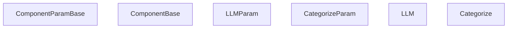
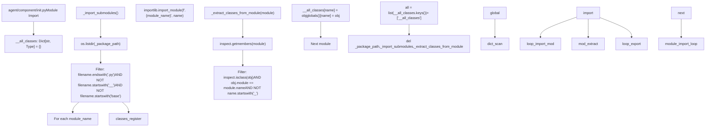
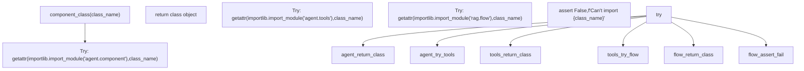
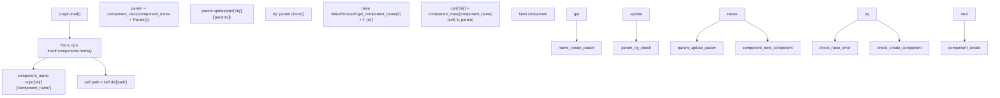
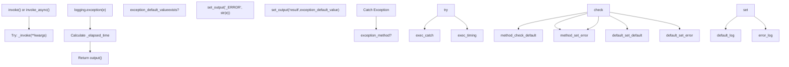

# Component System Architecture

Relevant source files

-   [agent/canvas.py](https://github.com/infiniflow/ragflow/blob/80a16e71/agent/canvas.py)
-   [agent/component/\_\_init\_\_.py](https://github.com/infiniflow/ragflow/blob/80a16e71/agent/component/__init__.py)
-   [agent/component/agent\_with\_tools.py](https://github.com/infiniflow/ragflow/blob/80a16e71/agent/component/agent_with_tools.py)
-   [agent/component/base.py](https://github.com/infiniflow/ragflow/blob/80a16e71/agent/component/base.py)
-   [agent/component/categorize.py](https://github.com/infiniflow/ragflow/blob/80a16e71/agent/component/categorize.py)
-   [agent/component/llm.py](https://github.com/infiniflow/ragflow/blob/80a16e71/agent/component/llm.py)
-   [agent/tools/base.py](https://github.com/infiniflow/ragflow/blob/80a16e71/agent/tools/base.py)
-   [api/apps/api\_app.py](https://github.com/infiniflow/ragflow/blob/80a16e71/api/apps/api_app.py)
-   [api/apps/canvas\_app.py](https://github.com/infiniflow/ragflow/blob/80a16e71/api/apps/canvas_app.py)
-   [rag/prompts/generator.py](https://github.com/infiniflow/ragflow/blob/80a16e71/rag/prompts/generator.py)
-   [web/src/components/knowledge-base-item.tsx](https://github.com/infiniflow/ragflow/blob/80a16e71/web/src/components/knowledge-base-item.tsx)
-   [web/src/interfaces/request/flow.ts](https://github.com/infiniflow/ragflow/blob/80a16e71/web/src/interfaces/request/flow.ts)

## Purpose and Scope

This document describes the component architecture that powers RAGFlow's agent workflow system. It covers the `ComponentBase` abstract class, the parameter validation system via `ComponentParamBase`, the lifecycle of component execution, input/output management, and the dynamic component registration mechanism. This page focuses on the foundational abstractions that all workflow components inherit from.

For information about the Canvas execution engine that orchestrates components, see [Canvas Engine and DSL](/infiniflow/ragflow/9.1-canvas-engine-and-dsl). For documentation of specific built-in components, see [Built-in Components](/infiniflow/ragflow/9.3-built-in-components). For the workflow execution flow and streaming, see [Workflow Execution and Streaming](/infiniflow/ragflow/9.4-workflow-execution-and-streaming).

---

## Component Base Classes Overview

The component system is built on two primary abstract classes: `ComponentBase` for component logic and `ComponentParamBase` for parameter definition and validation. All workflow components inherit from these base classes.

### Class Hierarchy


**Sources:** [agent/component/base.py36-359](https://github.com/infiniflow/ragflow/blob/80a16e71/agent/component/base.py#L36-L359) [agent/component/base.py361-580](https://github.com/infiniflow/ragflow/blob/80a16e71/agent/component/base.py#L361-L580) [agent/component/llm.py33-80](https://github.com/infiniflow/ragflow/blob/80a16e71/agent/component/llm.py#L33-L80) [agent/component/llm.py82-352](https://github.com/infiniflow/ragflow/blob/80a16e71/agent/component/llm.py#L82-L352) [agent/component/categorize.py29-95](https://github.com/infiniflow/ragflow/blob/80a16e71/agent/component/categorize.py#L29-L95) [agent/component/categorize.py97-154](https://github.com/infiniflow/ragflow/blob/80a16e71/agent/component/categorize.py#L97-L154)

---

## Component Lifecycle

Components follow a standardized lifecycle from instantiation through invocation to output collection. The Canvas engine manages this lifecycle during workflow execution.

### Lifecycle State Machine

> **[Mermaid stateDiagram]**
> *(图表结构无法解析)*

**Sources:** [agent/component/base.py402-414](https://github.com/infiniflow/ragflow/blob/80a16e71/agent/component/base.py#L402-L414) [agent/component/base.py416-442](https://github.com/infiniflow/ragflow/blob/80a16e71/agent/component/base.py#L416-L442) [agent/component/base.py461-471](https://github.com/infiniflow/ragflow/blob/80a16e71/agent/component/base.py#L461-L471)

### Key Lifecycle Methods

| Method | Purpose | When Called |
| --- | --- | --- |
| `__init__(canvas, id, param)` | Initialize component with Canvas reference, component ID, and validated parameters | Component instantiation by Canvas |
| `reset(only_output=False)` | Clear outputs and optionally inputs; prepare for re-execution | Before workflow run, between iterations |
| `get_input(key=None)` | Resolve variable references from Canvas and populate `_param.inputs` | Before `invoke()` call |
| `invoke(**kwargs)` | Synchronous execution wrapper with timing and error handling | Canvas execution loop (sync path) |
| `invoke_async(**kwargs)` | Asynchronous execution wrapper with timing and error handling | Canvas execution loop (async path) |
| `_invoke(**kwargs)` | Abstract method implementing component logic (must override) | Called by `invoke()` or `invoke_async()` |
| `output(var_nm=None)` | Retrieve output values by key or all outputs | After execution, by downstream components |

**Sources:** [agent/component/base.py380-386](https://github.com/infiniflow/ragflow/blob/80a16e71/agent/component/base.py#L380-L386) [agent/component/base.py402-414](https://github.com/infiniflow/ragflow/blob/80a16e71/agent/component/base.py#L402-L414) [agent/component/base.py416-442](https://github.com/infiniflow/ragflow/blob/80a16e71/agent/component/base.py#L416-L442) [agent/component/base.py444-446](https://github.com/infiniflow/ragflow/blob/80a16e71/agent/component/base.py#L444-L446) [agent/component/base.py448-456](https://github.com/infiniflow/ragflow/blob/80a16e71/agent/component/base.py#L448-L456) [agent/component/base.py461-471](https://github.com/infiniflow/ragflow/blob/80a16e71/agent/component/base.py#L461-L471) [agent/component/base.py473-487](https://github.com/infiniflow/ragflow/blob/80a16e71/agent/component/base.py#L473-L487)

---

## Parameter System

The `ComponentParamBase` class provides a sophisticated parameter definition, validation, and configuration update system. Parameters are defined as instance variables, validated through `check()`, and updated dynamically via `update()`.

### Parameter Definition Pattern

Components define parameters by subclassing `ComponentParamBase` and declaring instance variables:

```
# From agent/component/categorize.py
class CategorizeParam(LLMParam):
    def __init__(self):
        super().__init__()
        self.category_description = {}
        self.query = "sys.query"
        self.message_history_window_size = 1
        self.update_prompt()

    def check(self):
        self.check_positive_integer(self.message_history_window_size,
                                    "[Categorize] Message window size > 0")
        self.check_empty(self.category_description,
                        "[Categorize] Category examples")
        for k, v in self.category_description.items():
            if not k:
                raise ValueError("[Categorize] Category name can not be empty!")
            if not v.get("to"):
                raise ValueError(f"[Categorize] 'To' of category {k} can not be empty!")
```
The inheritance chain: `CategorizeParam` → `LLMParam` → `ComponentParamBase`

Key inherited attributes from `ComponentParamBase`:

-   `message_history_window_size` - Number of conversation turns to include (default: 13)
-   `inputs` - Dictionary of input parameter definitions
-   `outputs` - Dictionary of output values
-   `max_retries` - Retry attempts on error (default: 0)
-   `delay_after_error` - Seconds between retries (default: 2.0)
-   `exception_method` - Error handling strategy
-   `debug_inputs` - Inputs used during debug mode

**Sources:** [agent/component/categorize.py29-49](https://github.com/infiniflow/ragflow/blob/80a16e71/agent/component/categorize.py#L29-L49) [agent/component/base.py36-48](https://github.com/infiniflow/ragflow/blob/80a16e71/agent/component/base.py#L36-L48)

### Parameter Validation Methods

`ComponentParamBase` provides static validation helpers called during `check()`:

| Validator | Purpose | Usage |
| --- | --- | --- |
| `check_string(param, desc)` | Ensure parameter is string type | Type validation |
| `check_empty(param, desc)` | Ensure parameter is not empty/None | Required field validation |
| `check_positive_integer(param, desc)` | Ensure parameter is positive integer | Numeric range validation |
| `check_positive_number(param, desc)` | Ensure parameter is positive numeric | Numeric range validation |
| `check_nonnegative_number(param, desc)` | Ensure parameter is non-negative | Numeric range validation |
| `check_decimal_float(param, desc)` | Ensure parameter is float in \[0, 1\] | Probability validation |
| `check_boolean(param, desc)` | Ensure parameter is boolean | Type validation |
| `check_valid_value(param, desc, values)` | Ensure parameter is in allowed set | Enum validation |
| `check_defined_type(param, desc, types)` | Ensure parameter type matches allowed types | Multi-type validation |

**Sources:** [agent/component/base.py254-313](https://github.com/infiniflow/ragflow/blob/80a16e71/agent/component/base.py#L254-L313)

### Parameter Update Mechanism

The `update(conf, allow_redundant=False)` method recursively updates parameter values from a configuration dictionary, tracking user-provided and deprecated parameters:

**Sources:** [agent/component/base.py123-183](https://github.com/infiniflow/ragflow/blob/80a16e71/agent/component/base.py#L123-L183)

### Parameter Serialization

The `as_dict()` method recursively converts the parameter object to a dictionary, handling nested objects and DataFrames:

**Sources:** [agent/component/base.py95-121](https://github.com/infiniflow/ragflow/blob/80a16e71/agent/component/base.py#L95-L121)

---

## Input/Output Management

Components exchange data through a structured input/output system. Inputs are resolved from Canvas variables before execution, and outputs are stored for downstream components.

### Input Resolution Flow

> **[Mermaid sequence]**
> *(图表结构无法解析)*

**Sources:** [agent/component/base.py473-487](https://github.com/infiniflow/ragflow/blob/80a16e71/agent/component/base.py#L473-L487) [agent/component/base.py489-493](https://github.com/infiniflow/ragflow/blob/80a16e71/agent/component/base.py#L489-L493) [agent/component/base.py514-522](https://github.com/infiniflow/ragflow/blob/80a16e71/agent/component/base.py#L514-L522)

### Variable Reference Pattern

Components access Canvas variables through template expressions. The regex pattern defined in `ComponentBase.variable_ref_patt`:

```
# From agent/component/base.py:364
variable_ref_patt = r"\{* *\{([a-zA-Z:0-9]+@[A-Za-z0-9_.-]+|sys\.[A-Za-z0-9_.]+|env\.[A-Za-z0-9_.]+)\} *\}*"
```
Supported patterns:

| Pattern | Example | Description | Resolved By |
| --- | --- | --- | --- |
| `{component_id@output_key}` | `{retrieval_0@content}` | Output from another component | `Canvas.get_variable_value()` |
| `{component_id@output.nested.path}` | `{agent_0@structured.name}` | Nested output property | `Canvas.get_variable_param_value()` |
| `{sys.variable}` | `{sys.query}` | System variable | `Canvas.globals` dict |
| `{env.variable}` | `{env.api_key}` | Environment variable | `Canvas.variables` dict |

System variables in `Canvas.globals`:

-   `sys.query` - User's current query
-   `sys.user_id` - Tenant/user identifier
-   `sys.conversation_turns` - Number of turns in conversation
-   `sys.files` - Uploaded files (base64-encoded images or parsed text)

**Sources:** [agent/component/base.py364](https://github.com/infiniflow/ragflow/blob/80a16e71/agent/component/base.py#L364-L364) [agent/canvas.py282-287](https://github.com/infiniflow/ragflow/blob/80a16e71/agent/canvas.py#L282-L287)

### Input Element Extraction

The `get_input_elements_from_text(txt)` method extracts variable references from text and returns metadata:

| Field | Description |
| --- | --- |
| `name` | Human-readable name combining component name and variable |
| `value` | Current resolved value from Canvas |
| `_retrieval` | Reference to retrieval results if available |
| `_cpn_id` | Component ID for upstream reference tracking |

**Sources:** [agent/component/base.py495-506](https://github.com/infiniflow/ragflow/blob/80a16e71/agent/component/base.py#L495-L506)

### Output Storage

Components store outputs in `_param.outputs` as a dictionary with structure:

```
{
  "output_key": {
    "value": <actual_value>,
    "type": "<type_string>"
  }
}
```
The `set_output(key, value)` method automatically creates the output entry if it doesn't exist:

**Sources:** [agent/component/base.py453-456](https://github.com/infiniflow/ragflow/blob/80a16e71/agent/component/base.py#L453-L456)

### Special Output Keys

| Key | Purpose | Set By |
| --- | --- | --- |
| `_ERROR` | Stores exception message on error | `invoke()` / `invoke_async()` |
| `_created_time` | Timestamp when component execution started | `invoke()` / `invoke_async()` |
| `_elapsed_time` | Total execution time in seconds | `invoke()` / `invoke_async()` |
| `_next` | Next component IDs for routing (Categorize, Switch) | Component implementation |
| `_references` | Retrieval references for citation | Retrieval components |

**Sources:** [agent/component/base.py403](https://github.com/infiniflow/ragflow/blob/80a16e71/agent/component/base.py#L403-L403) [agent/component/base.py413](https://github.com/infiniflow/ragflow/blob/80a16e71/agent/component/base.py#L413-L413) [agent/component/base.py458-459](https://github.com/infiniflow/ragflow/blob/80a16e71/agent/component/base.py#L458-L459) [agent/component/categorize.py146](https://github.com/infiniflow/ragflow/blob/80a16e71/agent/component/categorize.py#L146-L146)

---

## Component Registration System

The component system uses dynamic module discovery to automatically register all component classes without manual imports. This enables extensibility and avoids circular dependencies.

### Registration Flow


**Sources:** [agent/component/\_\_init\_\_.py16-48](https://github.com/infiniflow/ragflow/blob/80a16e71/agent/component/__init__.py#L16-L48)

### Component Class Lookup

The `component_class(class_name)` function provides cross-module component lookup:


This enables lookup across three namespaces:

-   `agent.component` - Core workflow components (LLM, Agent, Categorize, Message, etc.)
-   `agent.tools` - Tool components (Retrieval, Wikipedia, DuckDuckGo, Weather, etc.)
-   `rag.flow` - DataFlow pipeline components

**Sources:** [agent/component/\_\_init\_\_.py51-58](https://github.com/infiniflow/ragflow/blob/80a16e71/agent/component/__init__.py#L51-L58)

### Component Instantiation in Canvas

The `Graph.load()` method instantiates components dynamically during DSL parsing:


Example DSL structure:

```
{
  "components": {
    "retrieval_0": {
      "obj": {
        "component_name": "Retrieval",
        "params": {"top_n": 10, "similarity_threshold": 0.2}
      },
      "downstream": ["generate_0"],
      "upstream": ["begin"]
    }
  }
}
```
The instantiation process:

1.  `component_class("RetrievalParam")` returns `RetrievalParam` class
2.  Instantiate: `param = RetrievalParam()`
3.  Update: `param.update({"top_n": 10, "similarity_threshold": 0.2})`
4.  Validate: `param.check()`
5.  `component_class("Retrieval")` returns `Retrieval` class
6.  Instantiate: `cpn["obj"] = Retrieval(canvas, "retrieval_0", param)`

**Sources:** [agent/canvas.py91-105](https://github.com/infiniflow/ragflow/blob/80a16e71/agent/canvas.py#L91-L105)

---

## Execution Modes

Components support both synchronous and asynchronous execution paths to accommodate different operation types (e.g., database queries vs. LLM streaming).

### Execution Mode Selection

**Sources:** [agent/canvas.py414-458](https://github.com/infiniflow/ragflow/blob/80a16e71/agent/canvas.py#L414-L458)

### Synchronous Execution (invoke)

The default `invoke()` method is a synchronous wrapper:

1.  **Set creation time:** `set_output("_created_time", time.perf_counter())`
2.  **Execute logic:** Call `_invoke(**kwargs)` (implemented by subclass)
3.  **Handle errors:** Catch exceptions, set `_ERROR` output or exception default value
4.  **Calculate elapsed time:** `set_output("_elapsed_time", elapsed)`
5.  **Return outputs:** Return `output()` dictionary

**Sources:** [agent/component/base.py402-414](https://github.com/infiniflow/ragflow/blob/80a16e71/agent/component/base.py#L402-L414)

### Asynchronous Execution (invoke\_async)

The `invoke_async()` method provides async execution:

1.  **Set creation time:** `set_output("_created_time", time.perf_counter())`
2.  **Check cancellation:** Call `check_if_canceled("Component processing")`
3.  **Determine method:**
    -   If `_invoke_async` exists and is coroutine: `await _invoke_async(**kwargs)`
    -   Else if `_invoke` is coroutine: `await _invoke(**kwargs)`
    -   Otherwise: `await asyncio.to_thread(self._invoke, **kwargs)`
4.  **Handle errors:** Same as `invoke()`
5.  **Calculate elapsed time:** Same as `invoke()`

**Sources:** [agent/component/base.py416-442](https://github.com/infiniflow/ragflow/blob/80a16e71/agent/component/base.py#L416-L442)

### Timeout Decorator

Component execution is protected by a timeout decorator:

| Component Type | Timeout | Environment Variable |
| --- | --- | --- |
| `ComponentBase._invoke()` | 10 minutes (600s) | `COMPONENT_EXEC_TIMEOUT` |
| `LLM._invoke_async()` | 10 minutes (600s) | `COMPONENT_EXEC_TIMEOUT` |
| `Categorize._invoke_async()` | 10 minutes (600s) | `COMPONENT_EXEC_TIMEOUT` |
| `Agent._invoke_async()` | 20 minutes (1200s) | `COMPONENT_EXEC_TIMEOUT` |

Example from `ComponentBase`:

```
@timeout(int(os.environ.get("COMPONENT_EXEC_TIMEOUT", 10 * 60)))
def _invoke(self, **kwargs):
    raise NotImplementedError()
```
The timeout is implemented in `common/connection_utils.py` using signal handlers (Unix) or threading (Windows).

**Sources:** [agent/component/base.py444-446](https://github.com/infiniflow/ragflow/blob/80a16e71/agent/component/base.py#L444-L446) [agent/component/llm.py263](https://github.com/infiniflow/ragflow/blob/80a16e71/agent/component/llm.py#L263-L263) [agent/component/llm.py340](https://github.com/infiniflow/ragflow/blob/80a16e71/agent/component/llm.py#L340-L340) [agent/component/categorize.py100](https://github.com/infiniflow/ragflow/blob/80a16e71/agent/component/categorize.py#L100-L100) [agent/component/categorize.py148](https://github.com/infiniflow/ragflow/blob/80a16e71/agent/component/categorize.py#L148-L148) [agent/component/agent\_with\_tools.py175](https://github.com/infiniflow/ragflow/blob/80a16e71/agent/component/agent_with_tools.py#L175-L175)

### Thread Concurrency Control

The `ComponentBase.thread_limiter` class variable limits concurrent executions:

```
# From agent/component/base.py:363
thread_limiter = asyncio.Semaphore(int(os.environ.get("MAX_CONCURRENT_CHATS", 10)))
```
This semaphore is shared across all component instances and can be used to throttle resource-intensive operations like LLM API calls. The default limit is 10 concurrent operations, configurable via the `MAX_CONCURRENT_CHATS` environment variable.

Usage pattern:

```
async with ComponentBase.thread_limiter:
    # Perform resource-intensive operation
    result = await expensive_operation()
```
**Sources:** [agent/component/base.py363](https://github.com/infiniflow/ragflow/blob/80a16e71/agent/component/base.py#L363-L363)

---

## Error Handling and Cancellation

Components support configurable error handling strategies and task cancellation for graceful workflow termination.

### Exception Handling Strategies

Components define exception behavior through parameter configuration:

| Parameter | Type | Purpose |
| --- | --- | --- |
| `exception_method` | str | Error handling strategy: `"comment"` (default value), `"goto"` (branch) |
| `exception_default_value` | Any | Value to return on error when method is `"comment"` |
| `exception_goto` | List\[str\] | Component IDs to jump to when method is `"goto"` |
| `max_retries` | int | Number of retry attempts (default: 0) |
| `delay_after_error` | float | Seconds to wait between retries (default: 2.0) |

**Sources:** [agent/component/base.py42-46](https://github.com/infiniflow/ragflow/blob/80a16e71/agent/component/base.py#L42-L46)

### Error Handling Flow


**Sources:** [agent/component/base.py404-414](https://github.com/infiniflow/ragflow/blob/80a16e71/agent/component/base.py#L404-L414) [agent/component/base.py562-576](https://github.com/infiniflow/ragflow/blob/80a16e71/agent/component/base.py#L562-L576)

### Exception Handler Processing

The Canvas engine processes exceptions after component execution:

```
# From agent/canvas.py:560-569
if cpn_obj.error():
    ex = cpn_obj.exception_handler()
    if ex and ex["goto"]:
        self.path.extend(ex["goto"])
        other_branch = True
    elif ex and ex["default_value"]:
        yield decorate("message", {"content": ex["default_value"]})
        yield decorate("message_end", {})
    else:
        self.error = cpn_obj.error()
```
**Sources:** [agent/canvas.py560-569](https://github.com/infiniflow/ragflow/blob/80a16e71/agent/canvas.py#L560-L569)

### Task Cancellation

Components check cancellation status through the Canvas:

```
def is_canceled(self) -> bool:
    return self._canvas.is_canceled()

def check_if_canceled(self, message: str = "") -> bool:
    if self.is_canceled():
        task_id = getattr(self._canvas, 'task_id', 'unknown')
        log_message = f"Task {task_id} has been canceled"
        if message:
            log_message += f" during {message}"
        logging.info(log_message)
        self.set_output("_ERROR", "Task has been canceled")
        return True
    return False
```
The Canvas checks a Redis flag: `REDIS_CONN.get(f"{self.task_id}-cancel")`

**Sources:** [agent/component/base.py388-400](https://github.com/infiniflow/ragflow/blob/80a16e71/agent/component/base.py#L388-L400) [agent/canvas.py267-268](https://github.com/infiniflow/ragflow/blob/80a16e71/agent/canvas.py#L267-L268)

### API Cancellation Endpoint

Users can cancel workflow execution via API:

```
PUT /v1/api/canvas/cancel/<task_id>
```
This sets the Redis cancellation flag: `REDIS_CONN.set(f"{task_id}-cancel", "x")`

**Sources:** [api/apps/canvas\_app.py211-218](https://github.com/infiniflow/ragflow/blob/80a16e71/api/apps/canvas_app.py#L211-L218)

---

## Variable Resolution and String Formatting

Components access Canvas variables and perform string interpolation for template-based text generation.

### Variable Reference Syntax

| Pattern | Example | Description |
| --- | --- | --- |
| `{component_id@output_key}` | `{retrieval_0@content}` | Reference output from another component |
| `{sys.variable}` | `{sys.query}` | Reference system variable (query, user\_id, files, etc.) |
| `{env.variable}` | `{env.api_key}` | Reference environment variable defined in Canvas |

**Sources:** [agent/component/base.py364](https://github.com/infiniflow/ragflow/blob/80a16e71/agent/component/base.py#L364-L364)

### Variable Value Resolution

The Canvas `get_variable_value(exp)` method resolves variable references:

```mermaid
flowchart TD
    start["get_variable_value(exp)"]
    clean["Strip { } and spaces"]
    check_at["Contains '@'?"]
    global["return self.globals[exp]"]
    split["Split into cpn_id, var_nm"]
    get_cpn["cpn = get_component(cpn_id)"]
    check_exists["Component exists?"]
    raise["Raise Exception:Can't find variable"]
    split_var["Split var_nm by '.' into root_key, rest"]
    get_root["root_val = cpn['obj'].output(root_key)"]
    check_rest["rest is empty?"]
    return_root["return root_val"]
    navigate["get_variable_param_value(root_val, rest)"]
    return_nav["return navigated value"]

    start --> clean
    clean --> check_at
    check --> at_global
    check --> at_split
    split --> get_cpn
    get --> cpn_check_exists
    check --> exists_raise
    check --> exists_split_var
    split --> var_get_root
    get --> root_check_rest
    check --> rest_return_root
    check --> rest_navigate
    navigate --> return_nav
```


**Sources:** [agent/canvas.py189-204](https://github.com/infiniflow/ragflow/blob/80a16e71/agent/canvas.py#L189-L204)

### Nested Property Navigation

The `get_variable_param_value(obj, path)` method navigates nested properties:

```
# Supports:
# - Dictionary keys: obj["key"]
# - List indices: obj[0]
# - Object attributes: obj.attr
# - JSON parsing of strings
# - Dot-notation paths: "user.profile.name"
```
**Sources:** [agent/canvas.py206-233](https://github.com/infiniflow/ragflow/blob/80a16e71/agent/canvas.py#L206-L233)

### String Formatting with Variables

The `get_value_with_variable(value)` method performs template string interpolation:

```
# Input: "User {sys.query} asked about {retrieval_0@topic}"
# Process:
# 1. Find all variable patterns with regex
# 2. Resolve each variable value
# 3. Handle partial functions (generators) by consuming
# 4. Convert non-strings to JSON
# 5. Replace in output string
```
**Sources:** [agent/canvas.py162-187](https://github.com/infiniflow/ragflow/blob/80a16e71/agent/canvas.py#L162-L187)

### Static String Formatting

Components can use `ComponentBase.string_format(content, kv)` for simple key-value replacement:

```
@staticmethod
def string_format(content: str, kv: dict[str, str]) -> str:
    for n, v in kv.items():
        def repl(_match, val=v):
            return str(val) if val is not None else ""
        content = re.sub(r"\{%s\}" % re.escape(n), repl, content)
    return content
```
**Sources:** [agent/component/base.py549-560](https://github.com/infiniflow/ragflow/blob/80a16e71/agent/component/base.py#L549-L560)

---

## Parent-Child Component Relationships

Some components (Iteration, Loop) contain child components, creating nested execution scopes. The parent-child relationship enables hierarchical workflow patterns.

### Parent Component Access

Components access their parent through the Canvas:

```
def get_parent(self) -> Union[object, None]:
    pid = self._canvas.get_component(self._id).get("parent_id")
    if not pid:
        return None
    return self._canvas.get_component(pid)["obj"]
```
**Sources:** [agent/component/base.py535-539](https://github.com/infiniflow/ragflow/blob/80a16e71/agent/component/base.py#L535-L539)

### Parent-Child Execution Pattern

> **[Mermaid sequence]**
> *(图表结构无法解析)*

**Sources:** [agent/canvas.py596-609](https://github.com/infiniflow/ragflow/blob/80a16e71/agent/canvas.py#L596-L609)

### Component Downstream Navigation

Components access upstream and downstream connections:

```
def get_upstream(self) -> List[str]:
    cpn_nms = self._canvas.get_component(self._id)['upstream']
    return cpn_nms

def get_downstream(self) -> List[str]:
    cpn_nms = self._canvas.get_component(self._id)['downstream']
    return cpn_nms
```
**Sources:** [agent/component/base.py541-547](https://github.com/infiniflow/ragflow/blob/80a16e71/agent/component/base.py#L541-L547)

---

## Component Debugging

Components support debugging through isolated invocation with mock inputs, bypassing the full Canvas execution.

### Debug Execution Flow

**Sources:** [api/apps/canvas\_app.py279-313](https://github.com/infiniflow/ragflow/blob/80a16e71/api/apps/canvas_app.py#L279-L313)

### Debug Input Storage

Components store debug inputs separately to avoid polluting actual execution state:

```
# In ComponentParamBase
self.debug_inputs = {}

# In get_input_values()
def get_input_values(self) -> Union[Any, dict[str, Any]]:
    if self._param.debug_inputs:
        return self._param.debug_inputs
    return {var: self.get_input_value(var) for var, o in self.get_input_elements().items()}
```
Debug inputs are cleared after each invocation.

**Sources:** [agent/component/base.py47](https://github.com/infiniflow/ragflow/blob/80a16e71/agent/component/base.py#L47-L47) [agent/component/base.py489-493](https://github.com/infiniflow/ragflow/blob/80a16e71/agent/component/base.py#L489-L493) [agent/component/base.py412](https://github.com/infiniflow/ragflow/blob/80a16e71/agent/component/base.py#L412-L412) [agent/component/base.py440](https://github.com/infiniflow/ragflow/blob/80a16e71/agent/component/base.py#L440-L440)

---

## Component Input Form Specification

Components define input forms to generate UI for parameter configuration and debugging.

### Input Form Structure

The `get_input_form()` method returns a dictionary describing each input parameter:

```
def get_input_form(self) -> dict[str, dict]:
    return {
        "query": {
            "type": "line",      # Widget type: line, textarea, select, etc.
            "name": "Query"      # Display label
        }
    }
```
**Sources:** [agent/component/categorize.py50-56](https://github.com/infiniflow/ragflow/blob/80a16e71/agent/component/categorize.py#L50-L56) [agent/component/base.py511-512](https://github.com/infiniflow/ragflow/blob/80a16e71/agent/component/base.py#L511-L512)

### Input Form Retrieval API

The Canvas API exposes input forms for frontend consumption:

```
GET /v1/api/canvas/input_form?id=<canvas_id>&component_id=<cpn_id>
```
Returns the input form specification for UI generation.

**Sources:** [api/apps/canvas\_app.py259-276](https://github.com/infiniflow/ragflow/blob/80a16e71/api/apps/canvas_app.py#L259-L276)

---

## Summary

The component system provides a robust foundation for building workflow components with:

-   **Standardized lifecycle:** Initialization → Validation → Execution → Output collection
-   **Flexible parameter system:** Typed parameters with validation, nested updates, and deprecation tracking
-   **Variable resolution:** Template-based variable references to Canvas globals and component outputs
-   **Dual execution modes:** Synchronous and asynchronous execution with automatic detection
-   **Error resilience:** Configurable exception handling with retry support and graceful degradation
-   **Dynamic registration:** Automatic component discovery without manual imports
-   **Cancellation support:** Graceful task termination via Redis flags
-   **Parent-child relationships:** Hierarchical component nesting for iteration and loops
-   **Debug capabilities:** Isolated component testing with mock inputs

This architecture enables the 9+ built-in components (Retrieval, Generate, Message, Categorize, etc.) documented in [Built-in Components](/infiniflow/ragflow/9.3-built-in-components) to share common infrastructure while implementing specialized logic.
