# Built-in Components

Relevant source files

-   [agent/canvas.py](https://github.com/infiniflow/ragflow/blob/80a16e71/agent/canvas.py)
-   [agent/component/agent\_with\_tools.py](https://github.com/infiniflow/ragflow/blob/80a16e71/agent/component/agent_with_tools.py)
-   [agent/component/base.py](https://github.com/infiniflow/ragflow/blob/80a16e71/agent/component/base.py)
-   [agent/component/categorize.py](https://github.com/infiniflow/ragflow/blob/80a16e71/agent/component/categorize.py)
-   [agent/component/llm.py](https://github.com/infiniflow/ragflow/blob/80a16e71/agent/component/llm.py)
-   [agent/tools/base.py](https://github.com/infiniflow/ragflow/blob/80a16e71/agent/tools/base.py)
-   [api/apps/api\_app.py](https://github.com/infiniflow/ragflow/blob/80a16e71/api/apps/api_app.py)
-   [api/apps/canvas\_app.py](https://github.com/infiniflow/ragflow/blob/80a16e71/api/apps/canvas_app.py)
-   [rag/prompts/generator.py](https://github.com/infiniflow/ragflow/blob/80a16e71/rag/prompts/generator.py)
-   [web/src/components/knowledge-base-item.tsx](https://github.com/infiniflow/ragflow/blob/80a16e71/web/src/components/knowledge-base-item.tsx)
-   [web/src/interfaces/request/flow.ts](https://github.com/infiniflow/ragflow/blob/80a16e71/web/src/interfaces/request/flow.ts)

This page documents the built-in components available in RAGFlow's Canvas agent workflow system. Built-in components are pre-implemented, reusable building blocks that handle specific tasks within agent workflows, such as retrieving information, generating text, routing based on classification, and interfacing with external services.

For information about the component base architecture and lifecycle, see [Component System Architecture](/infiniflow/ragflow/9.2-component-system-architecture). For details on how components are orchestrated within workflows, see [Canvas Engine and DSL](/infiniflow/ragflow/9.1-canvas-engine-and-dsl).

---

## Overview

RAGFlow provides a library of built-in components that can be composed into agent workflows. Each component inherits from `ComponentBase` and implements specific functionality through the `_invoke()` or `_invoke_async()` method. Components are automatically discovered and registered through the dynamic import system in [agent/component/\_\_init\_\_.py25-44](https://github.com/infiniflow/ragflow/blob/80a16e71/agent/component/__init__.py#L25-L44)

```mermaid
flowchart TD
    INIT["init.pyDynamic Import"]
    SCAN["Scan agent/component/*.py"]
    REGISTER["Register to __all_classes"]
    BASE["ComponentBaseagent/component/base.py"]
    PARAM["ComponentParamBaseParameter validation"]
    RETRIEVAL["RetrievalVector + KG search"]
    GENERATE["GenerateLLM generation"]
    CATEGORIZE["CategorizeIntent routing"]
    MESSAGE["MessageUser I/O + TTS"]
    TEMPLATE["TemplateString interpolation"]
    BEGIN["BeginWorkflow entry"]
    USERFILLUP["UserFillUpInput collection"]
    SWITCH["SwitchConditional routing"]
    BAIDU["BaiduFanyiTranslation"]
    QWEATHER["QWeatherWeather API"]
    DEEPL["DeepLTranslation"]
    GITHUB["GitHubRepository actions"]
    ITERATION["IterationList processing"]
    LOOP["LoopConditional loops"]
    EXITLOOP["ExitLoopBreak loops"]

    BASE --> RETRIEVAL
    BASE --> GENERATE
    BASE --> CATEGORIZE
    BASE --> MESSAGE
    BASE --> TEMPLATE
    BASE --> BEGIN
    BASE --> USERFILLUP
    BASE --> SWITCH
    BASE --> BAIDU
    BASE --> QWEATHER
    BASE --> DEEPL
    BASE --> GITHUB
    BASE --> ITERATION
    BASE --> LOOP
    BASE --> EXITLOOP
    PARAM --> BASE
    INIT --> SCAN
    SCAN --> REGISTER
```
**Component Registration System**: The `component_class()` function in [agent/component/\_\_init\_\_.py51-58](https://github.com/infiniflow/ragflow/blob/80a16e71/agent/component/__init__.py#L51-L58) provides runtime lookup of component classes by name. It searches across multiple module namespaces (`agent.component`, `agent.tools`, `rag.flow`) to resolve component names to their implementation classes.

Sources: [agent/component/\_\_init\_\_.py](https://github.com/infiniflow/ragflow/blob/80a16e71/agent/component/__init__.py) [agent/component/base.py361-379](https://github.com/infiniflow/ragflow/blob/80a16e71/agent/component/base.py#L361-L379)

---

## Component Categories

Built-in components are organized into functional categories based on their primary purpose:

| Category | Components | Purpose |
| --- | --- | --- |
| **AI/LLM** | Generate, Categorize, Message | LLM-powered operations (text generation, classification, conversation) |
| **Retrieval** | Retrieval | Vector and knowledge graph search across datasets |
| **Flow Control** | Begin, Switch, Categorize, UserFillUp | Workflow entry, branching, and user input collection |
| **Iteration** | Iteration, IterationItem, Loop, LoopItem, ExitLoop | List processing and conditional loops |
| **Transformation** | Template | String manipulation and variable interpolation |
| **External Services** | BaiduFanyi, DeepL, QWeather, GitHub | Third-party API integrations |

Sources: [agent/canvas.py40-814](https://github.com/infiniflow/ragflow/blob/80a16e71/agent/canvas.py#L40-L814)

---

## Core AI Components

### Generate Component

The Generate component performs LLM text generation with optional streaming support. It is the primary component for producing natural language responses.

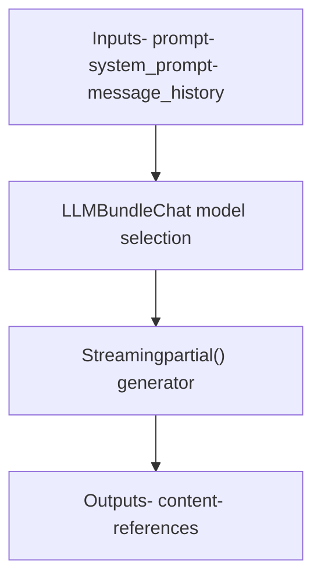
**Key Parameters**:

-   `llm_id`: LLM model identifier (references tenant LLM configuration)
-   `system_prompt`: System-level instructions
-   `prompt`: User prompt template (supports variable interpolation)
-   `message_history_window_size`: Number of conversation turns to include
-   `temperature`, `top_p`, `max_tokens`: Generation parameters
-   `cite`: Enable citation insertion for retrieved chunks

**Streaming Behavior**: The Generate component returns a `partial()` object when streaming is enabled. The Canvas execution engine detects this and iteratively yields chunks in real-time via SSE events [agent/canvas.py494-537](https://github.com/infiniflow/ragflow/blob/80a16e71/agent/canvas.py#L494-L537)

Sources: [agent/component/base.py](https://github.com/infiniflow/ragflow/blob/80a16e71/agent/component/base.py) [agent/canvas.py494-541](https://github.com/infiniflow/ragflow/blob/80a16e71/agent/canvas.py#L494-L541)

---

### Categorize Component

The Categorize component classifies user input into predefined categories using LLM-based intent recognition. It is used for routing workflows based on query type.

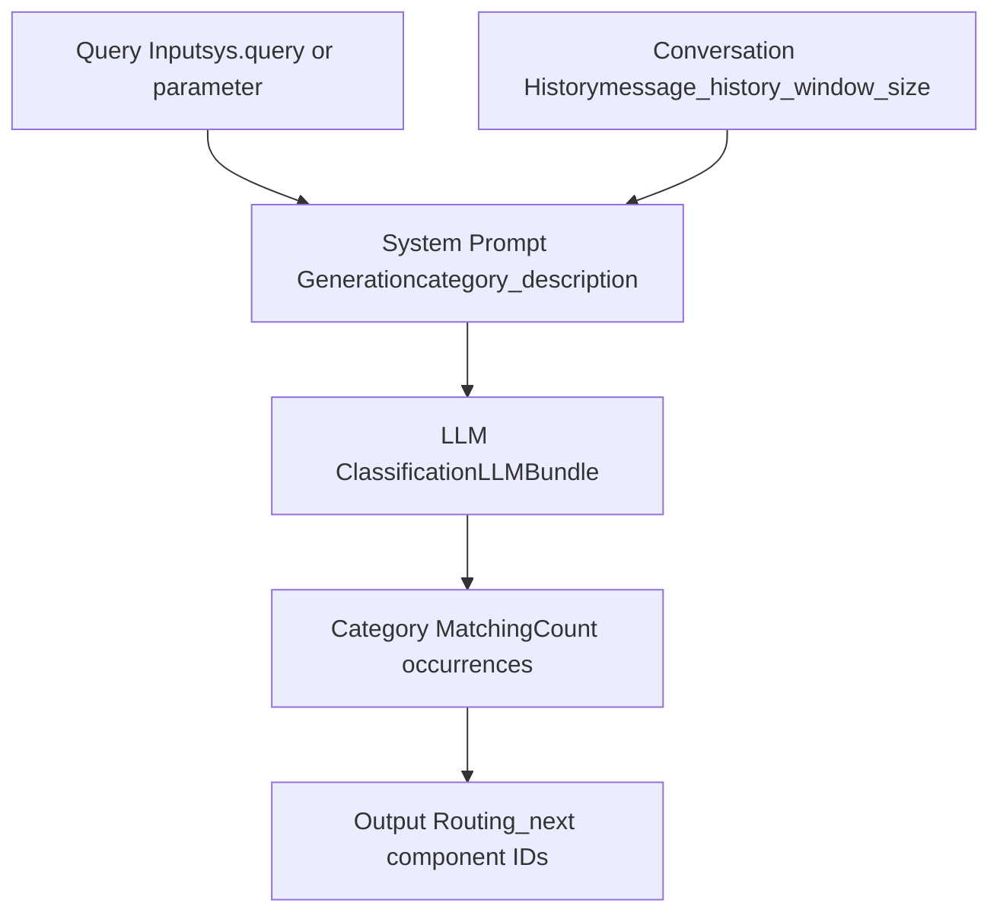
**Key Parameters** (from `CategorizeParam` [agent/component/categorize.py29-95](https://github.com/infiniflow/ragflow/blob/80a16e71/agent/component/categorize.py#L29-L95)):

-   `category_description`: Dictionary mapping category names to:
    -   `description`: Category explanation
    -   `examples`: List of example queries
    -   `to`: List of downstream component IDs to route to
-   `query`: Variable reference for input text (default: `"sys.query"`)
-   `message_history_window_size`: Conversation context window

**Classification Algorithm** [agent/component/categorize.py133-146](https://github.com/infiniflow/ragflow/blob/80a16e71/agent/component/categorize.py#L133-L146):

1.  Constructs a prompt with category descriptions and examples
2.  Sends user query to LLM for classification
3.  Counts occurrences of each category name in the LLM response
4.  Selects the category with highest count (fallback to last category if no matches)
5.  Sets `_next` output to the target component IDs for that category

**Routing Integration**: The Canvas execution engine checks for `_next` output and extends the execution path accordingly [agent/canvas.py600-601](https://github.com/infiniflow/ragflow/blob/80a16e71/agent/canvas.py#L600-L601)

Sources: [agent/component/categorize.py](https://github.com/infiniflow/ragflow/blob/80a16e71/agent/component/categorize.py) [agent/canvas.py600-601](https://github.com/infiniflow/ragflow/blob/80a16e71/agent/canvas.py#L600-L601)

---

### Message Component

The Message component handles user-facing output with optional Text-to-Speech (TTS) audio generation. It supports streaming text and audio buffering for real-time playback.

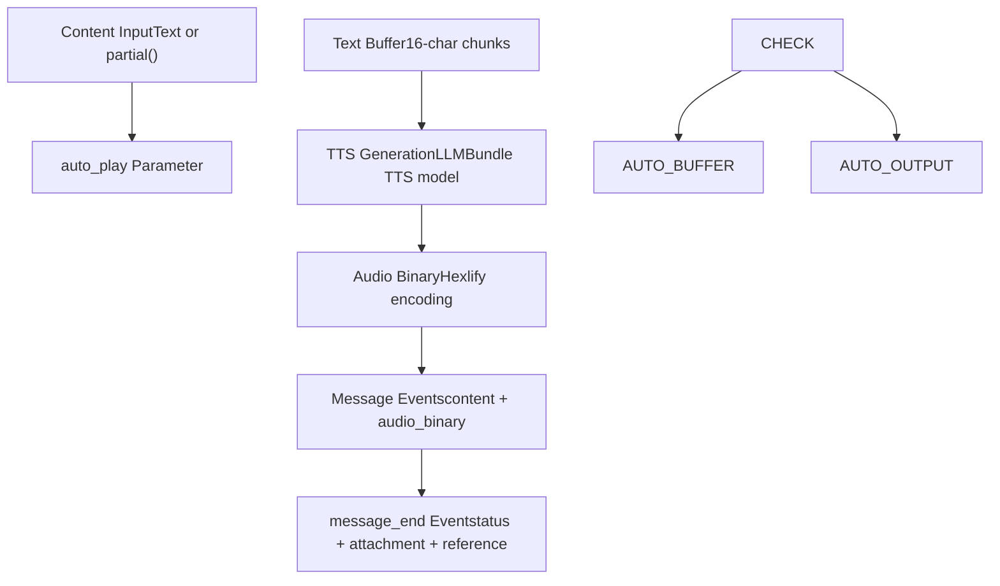
**Key Parameters**:

-   `auto_play`: Boolean flag to enable TTS
-   `status`: Custom status code (included in `message_end` event)
-   `attachment`: Dictionary of file attachments (included in `message_end` event)

**TTS Processing** [agent/canvas.py491-541](https://github.com/infiniflow/ragflow/blob/80a16e71/agent/canvas.py#L491-L541):

-   Text is buffered in 16-character chunks to minimize latency
-   The `tts()` method in [agent/canvas.py662-703](https://github.com/infiniflow/ragflow/blob/80a16e71/agent/canvas.py#L662-L703) cleans text (removes emojis, control characters) and generates audio
-   Audio is returned as hexadecimal-encoded binary for transmission via SSE

**Think Tag Support**: The component recognizes \`\` tags in streaming output and emits special events (`start_to_think`, `end_to_think`) to indicate reasoning phases [agent/canvas.py502-506](https://github.com/infiniflow/ragflow/blob/80a16e71/agent/canvas.py#L502-L506)

**Citation Handling**: If the content contains citation markers matching `[ID: 0-9]+]`, the `message_end` event includes a `reference` field with chunk and document metadata [agent/canvas.py538-549](https://github.com/infiniflow/ragflow/blob/80a16e71/agent/canvas.py#L538-L549)

Sources: [agent/canvas.py491-550](https://github.com/infiniflow/ragflow/blob/80a16e71/agent/canvas.py#L491-L550)

---

## Retrieval Components

### Retrieval Component

The Retrieval component performs hybrid vector and knowledge graph search across one or more datasets to retrieve relevant context for RAG operations.

**Key Parameters**:

-   `kb_ids`: List of knowledge base IDs to search (supports variable references)
-   `similarity_threshold`: Minimum similarity score for vector search
-   `keywords_similarity_weight`: Weight for keyword vs vector similarity (hybrid search)
-   `top_n`: Maximum number of chunks to retrieve
-   `rerank_id`: Optional reranking model ID

**Knowledge Graph Integration**: The component can query the knowledge graph in addition to vector search, combining results for enhanced retrieval accuracy.

**Output Structure**:

-   `chunks`: List of retrieved chunk objects with metadata
-   `doc_aggs`: Aggregated document information
-   `_references`: Formatted references for citation

**Reference Storage**: Retrieved chunks and documents are added to the Canvas-level retrieval state using `canvas.add_reference()` [agent/canvas.py786-800](https://github.com/infiniflow/ragflow/blob/80a16e71/agent/canvas.py#L786-L800) making them available for citation in downstream components.

Sources: [agent/canvas.py786-804](https://github.com/infiniflow/ragflow/blob/80a16e71/agent/canvas.py#L786-L804)

---

## Flow Control Components

### Begin Component

The Begin component serves as the entry point for agent workflows. It defines the initial state and mode of operation.

**Modes**:

-   `Chat`: Standard conversational mode with user query input
-   `Webhook`: Triggered by external webhook with custom payload

**Parameters**:

-   `prologue`: Initial greeting message shown to users
-   `mode`: Execution mode (`"Chat"` or `"Webhook"`)
-   `inputs`: Preset input parameters for the workflow

**Webhook Integration** [agent/canvas.py370-379](https://github.com/infiniflow/ragflow/blob/80a16e71/agent/canvas.py#L370-L379): When running in Webhook mode, the Begin component extracts the `input` field from the webhook payload and sets additional payload fields as component outputs.

Sources: [agent/canvas.py370-379](https://github.com/infiniflow/ragflow/blob/80a16e71/agent/canvas.py#L370-L379) [agent/canvas.py719-723](https://github.com/infiniflow/ragflow/blob/80a16e71/agent/canvas.py#L719-L723)

---

### Switch Component

The Switch component provides conditional routing based on evaluated expressions. It is similar to Categorize but uses explicit boolean conditions rather than LLM classification.

**Routing Behavior**: The component evaluates conditions and sets the `_next` output to determine downstream flow, following the same pattern as Categorize [agent/canvas.py600-601](https://github.com/infiniflow/ragflow/blob/80a16e71/agent/canvas.py#L600-L601)

Sources: [agent/canvas.py600-601](https://github.com/infiniflow/ragflow/blob/80a16e71/agent/canvas.py#L600-L601)

---

### UserFillUp Component

The UserFillUp component pauses workflow execution to collect additional input from the user. It is used for multi-step interactions requiring dynamic user input.

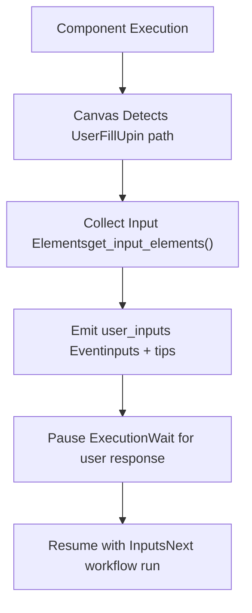
**Key Parameters**:

-   `enable_tips`: Show tips to guide user input
-   `tips`: Custom message for input guidance (output)

**Execution Flow** [agent/canvas.py616-630](https://github.com/infiniflow/ragflow/blob/80a16e71/agent/canvas.py#L616-L630):

1.  Canvas detects UserFillUp components in the execution path
2.  Invokes UserFillUp to gather required input schema via `get_input_elements()`
3.  Emits a `user_inputs` event with input schema and optional tips
4.  Workflow execution halts, returning control to the frontend
5.  User provides inputs via API
6.  Next workflow invocation resumes from the UserFillUp component with the provided inputs

Sources: [agent/canvas.py616-630](https://github.com/infiniflow/ragflow/blob/80a16e71/agent/canvas.py#L616-L630)

---

## Transformation Components

### Template Component

The Template component performs string interpolation using variables from the Canvas state.

**Key Features**:

-   Supports variable references in format `{component_id@output_key}` or `{sys.variable}`
-   Performs recursive substitution using `canvas.get_value_with_variable()` [agent/canvas.py162-187](https://github.com/infiniflow/ragflow/blob/80a16e71/agent/canvas.py#L162-L187)
-   Handles partial (streaming) variables by consuming the generator and buffering the complete output

**Variable Resolution**: The component uses the Canvas variable resolution system described in [State and Variable Management](/infiniflow/ragflow/9.5-state-and-variable-management), supporting dot-notation for nested object access [agent/canvas.py206-233](https://github.com/infiniflow/ragflow/blob/80a16e71/agent/canvas.py#L206-L233)

Sources: [agent/canvas.py162-187](https://github.com/infiniflow/ragflow/blob/80a16e71/agent/canvas.py#L162-L187) [agent/canvas.py206-233](https://github.com/infiniflow/ragflow/blob/80a16e71/agent/canvas.py#L206-L233)

---

## Iteration Components

### Iteration and IterationItem Components

The Iteration component processes lists element-by-element, executing a sub-workflow for each item.

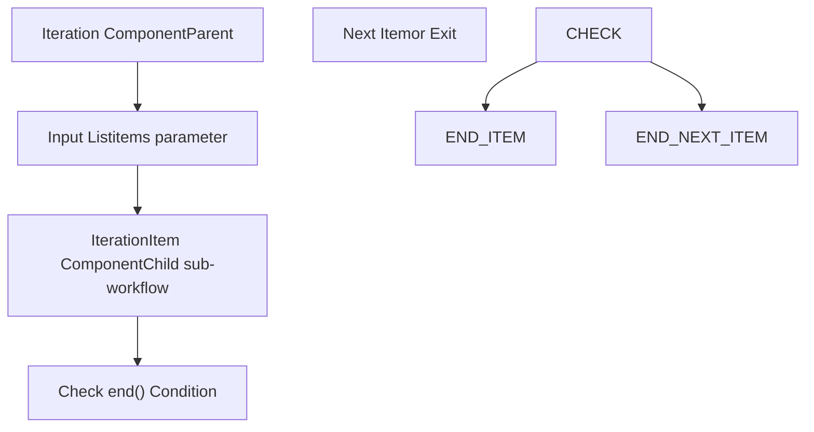
**Execution Logic** [agent/canvas.py596-599](https://github.com/infiniflow/ragflow/blob/80a16e71/agent/canvas.py#L596-L599):

-   The Iteration component initializes iteration state and appends the IterationItem component ID to the execution path
-   Canvas executes the IterationItem sub-workflow
-   When `iterationitem.end()` returns `True`, the Iteration component is marked finished and downstream components are added to the path

**Parent-Child Relationship**: IterationItem components store a `parent_id` reference to their Iteration parent, accessible via `get_parent()` [agent/component/base.py535-539](https://github.com/infiniflow/ragflow/blob/80a16e71/agent/component/base.py#L535-L539)

Sources: [agent/canvas.py596-599](https://github.com/infiniflow/ragflow/blob/80a16e71/agent/canvas.py#L596-L599) [agent/component/base.py535-539](https://github.com/infiniflow/ragflow/blob/80a16e71/agent/component/base.py#L535-L539)

---

### Loop and LoopItem Components

The Loop component provides conditional iteration with explicit loop control.

**Key Differences from Iteration**:

-   Loop continues until an exit condition is met or `ExitLoop` is invoked
-   Iteration processes a fixed list of items

**ExitLoop Component** [agent/canvas.py604-605](https://github.com/infiniflow/ragflow/blob/80a16e71/agent/canvas.py#L604-L605): When executed, ExitLoop breaks the loop by routing directly to the Loop component's downstream neighbors, bypassing the LoopItem re-entry.

Sources: [agent/canvas.py602-605](https://github.com/infiniflow/ragflow/blob/80a16e71/agent/canvas.py#L602-L605)

---

## External Service Components

### BaiduFanyi Component

Integrates with Baidu Translate API for language translation.

**Configuration**: Requires API credentials (App ID and Secret Key) configured in the component parameters.

---

### DeepL Component

Integrates with DeepL translation service.

**Configuration**: Requires DeepL API key.

---

### QWeather Component

Provides real-time weather information via QWeather API.

**Use Case**: Enables agents to answer weather-related queries with current conditions and forecasts.

---

### GitHub Component

Executes operations against GitHub repositories.

**Capabilities**:

-   Repository actions (create issues, pull requests)
-   Code execution via sandbox when combined with tool calling [agent/canvas.py762-784](https://github.com/infiniflow/ragflow/blob/80a16e71/agent/canvas.py#L762-L784)

**Tool Execution Tracing**: All tool invocations are logged to Redis with a 10-minute TTL using `tool_use_callback()` [agent/canvas.py762-784](https://github.com/infiniflow/ragflow/blob/80a16e71/agent/canvas.py#L762-L784) enabling debugging and observability.

Sources: [agent/canvas.py762-784](https://github.com/infiniflow/ragflow/blob/80a16e71/agent/canvas.py#L762-L784)

---

## Component Discovery and Registration

The component system uses a dynamic discovery mechanism to automatically register all component classes:

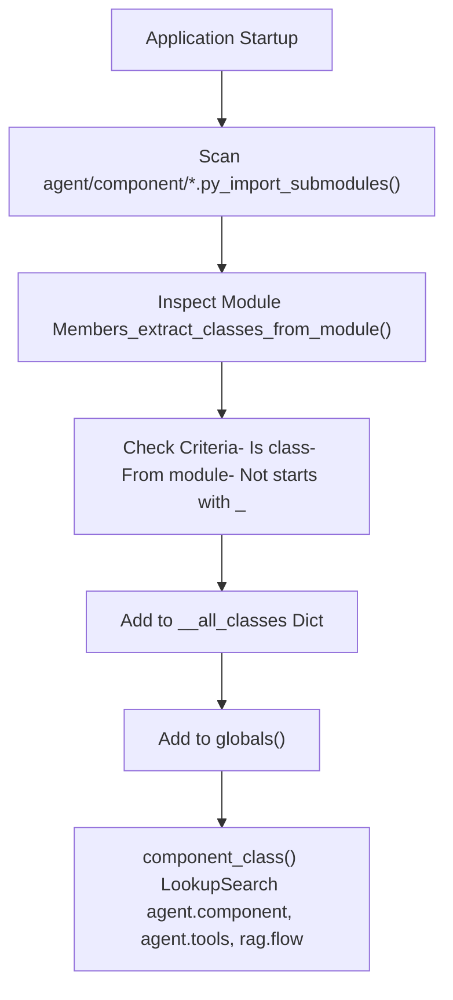
**Implementation Details** [agent/component/\_\_init\_\_.py25-44](https://github.com/infiniflow/ragflow/blob/80a16e71/agent/component/__init__.py#L25-L44):

1.  `_import_submodules()` iterates over all `.py` files in `agent/component/`
2.  For each module, `_extract_classes_from_module()` uses `inspect.getmembers()` to find class definitions
3.  Classes are validated (must be defined in the module, not imported) and added to `__all_classes` dictionary
4.  Classes are also added to the module's `globals()` for direct import
5.  The `__all__` list is populated for explicit exports

**Runtime Lookup**: The `component_class(class_name)` function [agent/component/\_\_init\_\_.py51-58](https://github.com/infiniflow/ragflow/blob/80a16e71/agent/component/__init__.py#L51-L58) searches across multiple namespaces in order:

1.  `agent.component` (built-in components)
2.  `agent.tools` (tool-based components)
3.  `rag.flow` (dataflow components)

Sources: [agent/component/\_\_init\_\_.py25-58](https://github.com/infiniflow/ragflow/blob/80a16e71/agent/component/__init__.py#L25-L58)

---

## Component Parameter Validation

Each component defines a corresponding parameter class inheriting from `ComponentParamBase` that handles configuration validation and input/output schema.

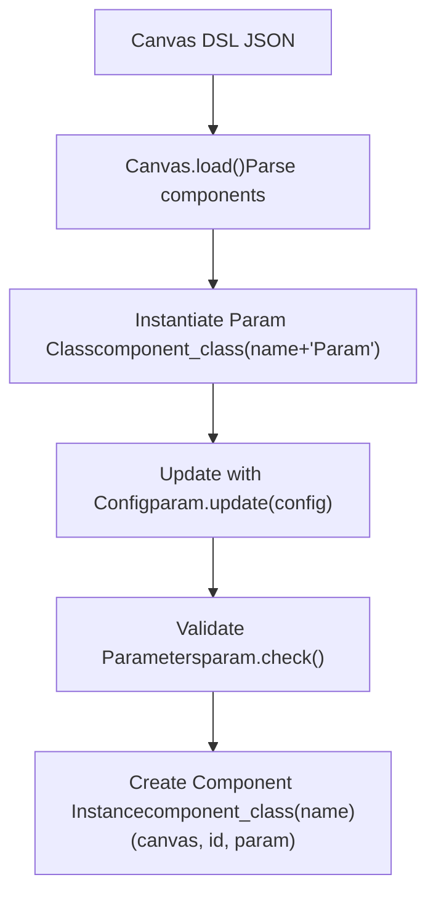
**Validation Flow** [agent/canvas.py91-103](https://github.com/infiniflow/ragflow/blob/80a16e71/agent/canvas.py#L91-L103):

1.  Canvas DSL is parsed from JSON
2.  For each component, the parameter class is instantiated via `component_class(component_name + "Param")()`
3.  Component configuration is merged via `param.update(cpn["obj"]["params"])`
4.  `param.check()` validates all required parameters and constraints
5.  The validated param object is passed to the component constructor

**Input Form Generation**: Components can define `get_input_form()` to return metadata about expected inputs for UI rendering [agent/component/base.py511-512](https://github.com/infiniflow/ragflow/blob/80a16e71/agent/component/base.py#L511-L512)

**Example: CategorizeParam Validation** [agent/component/categorize.py41-48](https://github.com/infiniflow/ragflow/blob/80a16e71/agent/component/categorize.py#L41-L48):

```
def check(self):
    self.check_positive_integer(self.message_history_window_size,
                               "[Categorize] Message window size > 0")
    self.check_empty(self.category_description, "[Categorize] Category examples")
    for k, v in self.category_description.items():
        if not k:
            raise ValueError("[Categorize] Category name can not be empty!")
        if not v.get("to"):
            raise ValueError(f"[Categorize] 'To' of category {k} can not be empty!")
```
Sources: [agent/canvas.py91-103](https://github.com/infiniflow/ragflow/blob/80a16e71/agent/canvas.py#L91-L103) [agent/component/base.py36-183](https://github.com/infiniflow/ragflow/blob/80a16e71/agent/component/base.py#L36-L183) [agent/component/categorize.py29-95](https://github.com/infiniflow/ragflow/blob/80a16e71/agent/component/categorize.py#L29-L95)

---

## Component Invocation Lifecycle

Components follow a standardized invocation lifecycle managed by the Canvas execution engine:

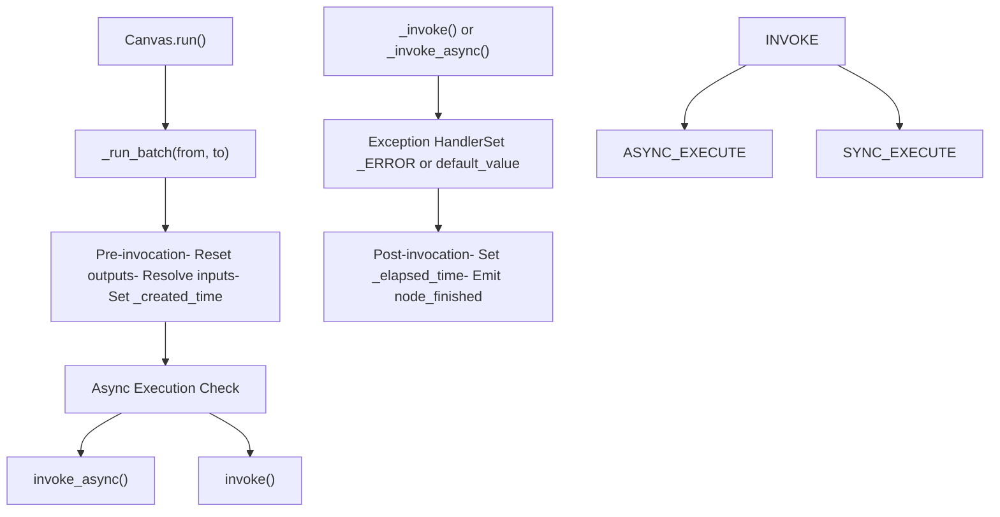
**Asynchronous Execution** [agent/canvas.py414-457](https://github.com/infiniflow/ragflow/blob/80a16e71/agent/canvas.py#L414-L457):

-   Canvas checks if a component implements `_invoke_async()` coroutine
-   If present, executes in thread pool via `run_in_executor()` to maintain concurrency
-   Otherwise, falls back to synchronous `_invoke()` in thread pool

**Input Resolution** [agent/canvas.py436-445](https://github.com/infiniflow/ragflow/blob/80a16e71/agent/canvas.py#L436-L445):

-   Components query their input schema via `get_input_elements()`
-   For each input, if the value is a variable reference (contains `@` or starts with `sys.`/`env.`), it is resolved via `canvas.get_variable_value()`
-   Resolved values are stored in the component's input state via `set_input_value()`

**Error Handling** [agent/canvas.py560-570](https://github.com/infiniflow/ragflow/blob/80a16e71/agent/canvas.py#L560-L570):

-   If a component raises an exception, the Canvas checks for an exception handler via `exception_handler()`
-   If `exception_goto` is defined, execution jumps to the specified component IDs
-   If `exception_default_value` is defined, it is emitted as a message
-   Otherwise, the error is stored in the component's `_ERROR` output and workflow execution halts

**Timing Metadata** [agent/component/base.py403-414](https://github.com/infiniflow/ragflow/blob/80a16e71/agent/component/base.py#L403-L414):

-   `_created_time`: Set at invocation start using `time.perf_counter()`
-   `_elapsed_time`: Calculated at invocation end as difference from `_created_time`

Sources: [agent/canvas.py414-457](https://github.com/infiniflow/ragflow/blob/80a16e71/agent/canvas.py#L414-L457) [agent/canvas.py560-570](https://github.com/infiniflow/ragflow/blob/80a16e71/agent/canvas.py#L560-L570) [agent/component/base.py402-442](https://github.com/infiniflow/ragflow/blob/80a16e71/agent/component/base.py#L402-L442)

---

## Component Input and Output Management

Components interact with the Canvas state through a structured input/output system:

| Method | Purpose | Example |
| --- | --- | --- |
| `get_input(key)` | Retrieve resolved input value | `query = self.get_input("query")` |
| `get_input_elements()` | Get input schema with metadata | `inputs = self.get_input_elements()` |
| `set_input_value(key, value)` | Store input value | `self.set_input_value("query", "...")` |
| `output(key)` | Retrieve output value | `content = self.output("content")` |
| `set_output(key, value)` | Store output value | `self.set_output("result", data)` |

**Variable References in Inputs**: The `get_input_elements_from_text()` method [agent/component/base.py495-506](https://github.com/infiniflow/ragflow/blob/80a16e71/agent/component/base.py#L495-L506) parses text for variable patterns matching `{component_id@output_key}` or `{sys.variable}`, extracting:

-   Component name for display
-   Current value from Canvas state
-   References from Retrieval component (if applicable)
-   Source component ID for dependency tracking

**Output Types**: Outputs can be primitive values, dictionaries, lists, or `partial()` generators for streaming. The Canvas execution engine detects streaming outputs and handles them specially [agent/canvas.py494-541](https://github.com/infiniflow/ragflow/blob/80a16e71/agent/canvas.py#L494-L541)

**Reserved Output Keys**:

-   `_ERROR`: Stores exception messages
-   `_created_time`: Component start timestamp
-   `_elapsed_time`: Execution duration
-   `_next`: Downstream component IDs for routing (Categorize, Switch)
-   `_references`: Retrieved chunks for citation (Retrieval)

Sources: [agent/component/base.py448-523](https://github.com/infiniflow/ragflow/blob/80a16e71/agent/component/base.py#L448-L523) [agent/canvas.py494-541](https://github.com/infiniflow/ragflow/blob/80a16e71/agent/canvas.py#L494-L541)

---

## Debug Mode

Components support a debug mode for isolated testing without full workflow execution:

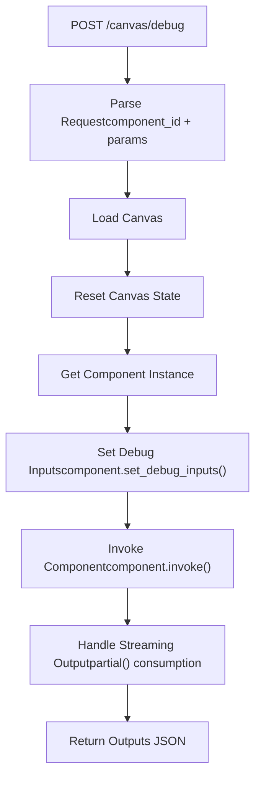
**Debug Endpoint** [api/apps/canvas\_app.py279-313](https://github.com/infiniflow/ragflow/blob/80a16e71/api/apps/canvas_app.py#L279-L313):

1.  Accepts `component_id` and `params` dictionary
2.  Loads the Canvas and resets its state
3.  Retrieves the target component instance
4.  For LLM components, calls `set_debug_inputs()` with the provided parameters
5.  Invokes the component with the debug parameters
6.  Consumes any streaming outputs (partial) to produce complete results
7.  Returns the component's outputs as JSON

**Debug Input Storage**: The `_param.debug_inputs` field stores debug-mode input values [agent/component/base.py489-491](https://github.com/infiniflow/ragflow/blob/80a16e71/agent/component/base.py#L489-L491) which are used instead of resolved Canvas variables during `get_input_values()`.

Sources: [api/apps/canvas\_app.py279-313](https://github.com/infiniflow/ragflow/blob/80a16e71/api/apps/canvas_app.py#L279-L313) [agent/component/base.py47-48](https://github.com/infiniflow/ragflow/blob/80a16e71/agent/component/base.py#L47-L48) [agent/component/base.py489-493](https://github.com/infiniflow/ragflow/blob/80a16e71/agent/component/base.py#L489-L493)

---

## Component Thoughts System

Components can implement a `thoughts()` method to provide human-readable descriptions of their current reasoning or action. These thoughts are emitted during workflow execution for observability.

**Example: Categorize Thoughts** [agent/component/categorize.py152-153](https://github.com/infiniflow/ragflow/blob/80a16e71/agent/component/categorize.py#L152-L153):

```
def thoughts(self) -> str:
    return "Which should it falls into {}? ...".format(
        ",".join([f"`{c}`" for c, _ in self._param.category_description.items()])
    )
```
**Emission**: Thoughts are included in the `node_started` event emitted by the Canvas [agent/canvas.py478-484](https://github.com/infiniflow/ragflow/blob/80a16e71/agent/canvas.py#L478-L484) providing real-time visibility into component decision-making.

Sources: [agent/component/base.py578-579](https://github.com/infiniflow/ragflow/blob/80a16e71/agent/component/base.py#L578-L579) [agent/component/categorize.py152-153](https://github.com/infiniflow/ragflow/blob/80a16e71/agent/component/categorize.py#L152-L153) [agent/canvas.py478-484](https://github.com/infiniflow/ragflow/blob/80a16e71/agent/canvas.py#L478-L484)

---

## Cancellation Support

All components support workflow cancellation through a Redis-based flag system:

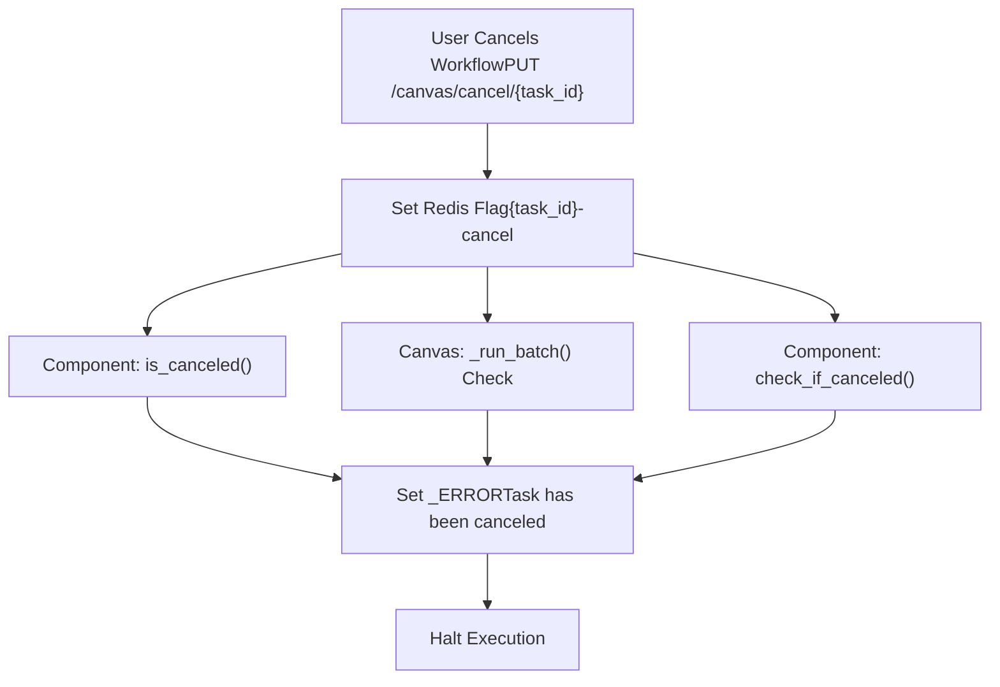
**Cancellation Checking**:

-   `is_canceled()` [agent/component/base.py388-389](https://github.com/infiniflow/ragflow/blob/80a16e71/agent/component/base.py#L388-L389): Returns boolean indicating if task is canceled
-   `check_if_canceled(message)` [agent/component/base.py391-400](https://github.com/infiniflow/ragflow/blob/80a16e71/agent/component/base.py#L391-L400): Checks flag, logs message, sets `_ERROR` output, returns boolean
-   Canvas checks cancellation at batch boundaries [agent/canvas.py406-418](https://github.com/infiniflow/ragflow/blob/80a16e71/agent/canvas.py#L406-L418)

**Cancellation Endpoint** [api/apps/canvas\_app.py211-218](https://github.com/infiniflow/ragflow/blob/80a16e71/api/apps/canvas_app.py#L211-L218): Sets the cancellation flag in Redis with key `{task_id}-cancel`.

**Graceful Degradation**: When a task is canceled, the workflow emits a `workflow_finished` event with `"Task has been canceled"` message rather than failing [agent/canvas.py641-648](https://github.com/infiniflow/ragflow/blob/80a16e71/agent/canvas.py#L641-L648)

Sources: [agent/component/base.py388-400](https://github.com/infiniflow/ragflow/blob/80a16e71/agent/component/base.py#L388-L400) [agent/canvas.py406-418](https://github.com/infiniflow/ragflow/blob/80a16e71/agent/canvas.py#L406-L418) [api/apps/canvas\_app.py211-218](https://github.com/infiniflow/ragflow/blob/80a16e71/api/apps/canvas_app.py#L211-L218)
