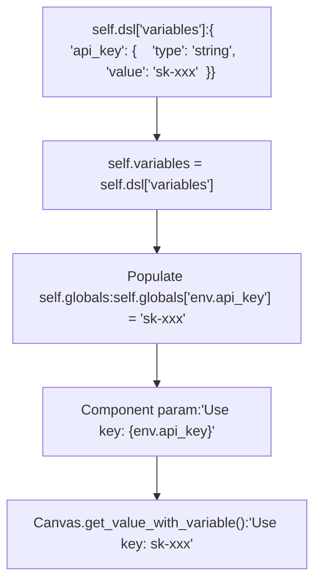
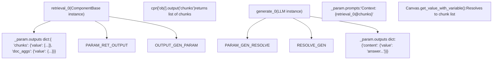
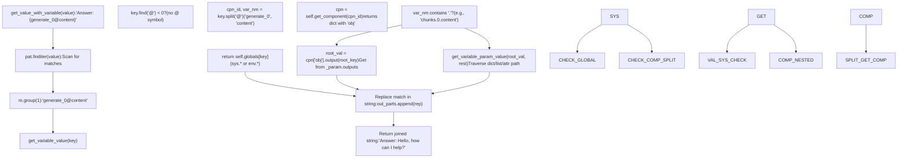
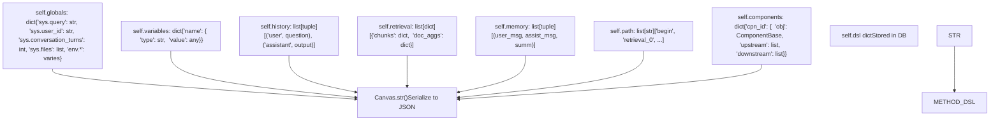

# State and Variable Management

Relevant source files

-   [agent/canvas.py](https://github.com/infiniflow/ragflow/blob/80a16e71/agent/canvas.py)
-   [agent/component/agent\_with\_tools.py](https://github.com/infiniflow/ragflow/blob/80a16e71/agent/component/agent_with_tools.py)
-   [agent/component/base.py](https://github.com/infiniflow/ragflow/blob/80a16e71/agent/component/base.py)
-   [agent/component/categorize.py](https://github.com/infiniflow/ragflow/blob/80a16e71/agent/component/categorize.py)
-   [agent/component/llm.py](https://github.com/infiniflow/ragflow/blob/80a16e71/agent/component/llm.py)
-   [agent/tools/base.py](https://github.com/infiniflow/ragflow/blob/80a16e71/agent/tools/base.py)
-   [api/apps/api\_app.py](https://github.com/infiniflow/ragflow/blob/80a16e71/api/apps/api_app.py)
-   [api/apps/canvas\_app.py](https://github.com/infiniflow/ragflow/blob/80a16e71/api/apps/canvas_app.py)
-   [rag/prompts/generator.py](https://github.com/infiniflow/ragflow/blob/80a16e71/rag/prompts/generator.py)
-   [web/src/components/knowledge-base-item.tsx](https://github.com/infiniflow/ragflow/blob/80a16e71/web/src/components/knowledge-base-item.tsx)
-   [web/src/interfaces/request/flow.ts](https://github.com/infiniflow/ragflow/blob/80a16e71/web/src/interfaces/request/flow.ts)

This document describes how the RAGFlow Agent Canvas system manages state and variables during workflow execution. It covers the variable namespace system, resolution mechanisms, component input/output management, and global state persistence.

For information about the overall Canvas execution model, see [Workflow Execution and Streaming](/infiniflow/ragflow/9.4-workflow-execution-and-streaming). For details on how components are structured, see [Component System Architecture](/infiniflow/ragflow/9.2-component-system-architecture).

---

## Overview

The Canvas workflow engine (`agent.canvas.Canvas`) maintains state through a hierarchical variable system implemented via the `get_value_with_variable` resolution method. The system includes:

-   **System variables** (`sys.*`): Stored in `self.globals` dict, tracking user input, conversation context, and execution state
-   **Environment variables** (`env.*`): Stored in `self.globals` dict from `self.variables` definitions, persisting across workflow runs
-   **Component outputs** (`{component_id@output_name}`): Stored in component's `_param.outputs` dict, accessible via the Canvas component registry

The variable resolution pipeline processes references embedded in strings using regex pattern matching, namespace lookup, and nested property traversal. This enables dataflow programming where components declare dependencies through variable expressions like `{retrieval_0@chunks.0.content}`.

**Core Resolution Methods:**

-   `get_value_with_variable(value: str)`: Main entry point that scans and substitutes all variable references in a string
-   `get_variable_value(exp: str)`: Resolves a single variable expression to its runtime value
-   `get_variable_param_value(obj, path)`: Traverses nested object paths (dict/list/attr access)

**Sources:** [agent/canvas.py162-233](https://github.com/infiniflow/ragflow/blob/80a16e71/agent/canvas.py#L162-L233) [agent/canvas.py282-310](https://github.com/infiniflow/ragflow/blob/80a16e71/agent/canvas.py#L282-L310)

---

## Variable Namespaces

The Canvas system organizes variables into three primary namespaces, each serving a distinct purpose in workflow execution.

### System Variable Namespace (`sys.*`)

System variables are managed by the Canvas runtime and provide execution context. They are initialized when the Canvas is instantiated and updated during workflow execution.

**Core System Variables:**

| Variable | Type | Description | Initialization |
| --- | --- | --- | --- |
| `sys.query` | string | Current user query/input | Set at workflow start |
| `sys.user_id` | string | Tenant/user identifier | Passed during Canvas creation |
| `sys.conversation_turns` | integer | Number of conversation rounds | Incremented each run |
| `sys.files` | list\[string\] | Uploaded files (images as base64, documents as parsed text) | Processed from input files |

System variables are reset at the beginning of each workflow run, except for `sys.conversation_turns` which persists and increments.

**Sources:** [agent/canvas.py282-287](https://github.com/infiniflow/ragflow/blob/80a16e71/agent/canvas.py#L282-L287) [agent/canvas.py295-303](https://github.com/infiniflow/ragflow/blob/80a16e71/agent/canvas.py#L295-L303) [agent/canvas.py325-338](https://github.com/infiniflow/ragflow/blob/80a16e71/agent/canvas.py#L325-L338) [agent/canvas.py381-389](https://github.com/infiniflow/ragflow/blob/80a16e71/agent/canvas.py#L381-L389)

### Environment Variable Namespace (`env.*`)

Environment variables are user-defined variables that can be configured in the workflow DSL. They maintain their values across workflow executions within a session.


**Diagram: Environment Variable Lifecycle (DSL → globals → Resolution)**

Environment variables support multiple data types:

-   `string`: Text values
-   `number`: Numeric values (integer or float)
-   `boolean`: True/false flags
-   `object`: JSON objects
-   `array`: Lists of values

**Sources:** [agent/canvas.py304-307](https://github.com/infiniflow/ragflow/blob/80a16e71/agent/canvas.py#L304-L307) [agent/canvas.py339-359](https://github.com/infiniflow/ragflow/blob/80a16e71/agent/canvas.py#L339-L359)

### Component Output Namespace

Components produce outputs that other components can reference using the syntax `{component_id@output_name}`. This creates a dataflow dependency graph.


**Diagram: Component Output Dataflow via Variable References**

Components can also access nested properties using dot notation: `{component_id@output.property.subproperty}`.

**Sources:** [agent/canvas.py162-187](https://github.com/infiniflow/ragflow/blob/80a16e71/agent/canvas.py#L162-L187) [agent/canvas.py189-233](https://github.com/infiniflow/ragflow/blob/80a16e71/agent/canvas.py#L189-L233)

---

## Variable Resolution Mechanism

The Canvas engine resolves variable references embedded in strings using a pattern-matching and substitution process.

### Resolution Pattern

The variable reference pattern is defined as a compiled regex that matches variable expressions:

```
# In Canvas.get_value_with_variable():
pat = re.compile(r"\{* *\{([a-zA-Z:0-9]+@[A-Za-z0-9_.-]+|sys\.[A-Za-z0-9_.]+|env\.[A-Za-z0-9_.]+)\} *\}*")
```
**Pattern Components:**

-   `\{* *\{`: Optional leading braces and whitespace
-   `([...])`: Capture group for the variable expression
    -   `[a-zA-Z:0-9]+@[A-Za-z0-9_.-]+`: Component output (e.g., `retrieval_0@chunks`)
    -   `sys\.[A-Za-z0-9_.]+`: System variable (e.g., `sys.query`)
    -   `env\.[A-Za-z0-9_.]+`: Environment variable (e.g., `env.api_key`)
-   `\} *\}*`: Optional trailing braces and whitespace

This pattern also appears in `ComponentBase.variable_ref_patt` for component-level input parsing.

**Sources:** [agent/canvas.py163](https://github.com/infiniflow/ragflow/blob/80a16e71/agent/canvas.py#L163-L163) [agent/component/base.py368](https://github.com/infiniflow/ragflow/blob/80a16e71/agent/component/base.py#L368-L368)

### Resolution Flow


**Diagram: Canvas.get\_value\_with\_variable() Resolution Pipeline**

The resolution occurs in `Canvas.get_value_with_variable()` at [agent/canvas.py162-187](https://github.com/infiniflow/ragflow/blob/80a16e71/agent/canvas.py#L162-L187) which calls `get_variable_value()` at [agent/canvas.py189-204](https://github.com/infiniflow/ragflow/blob/80a16e71/agent/canvas.py#L189-L204) for each matched expression. Nested property access is handled by `get_variable_param_value()` at [agent/canvas.py206-233](https://github.com/infiniflow/ragflow/blob/80a16e71/agent/canvas.py#L206-L233)

**Sources:** [agent/canvas.py162-187](https://github.com/infiniflow/ragflow/blob/80a16e71/agent/canvas.py#L162-L187) [agent/canvas.py189-233](https://github.com/infiniflow/ragflow/blob/80a16e71/agent/canvas.py#L189-L233)

### Nested Property Access

The resolution system supports accessing nested properties in dictionaries, lists, and objects using dot notation:

```
{component_id@output.property.subproperty}
{component_id@output.items.0.name}
```
The `get_variable_param_value(obj, path)` method at [agent/canvas.py206-233](https://github.com/infiniflow/ragflow/blob/80a16e71/agent/canvas.py#L206-L233) traverses the property path:

**Traversal Algorithm:**

```
def get_variable_param_value(self, obj: Any, path: str) -> Any:
    cur = obj
    if not path:
        return cur
    for key in path.split('.'):
        if cur is None:
            return None

        # Try JSON parsing if string
        if isinstance(cur, str):
            try:
                cur = json.loads(cur)
            except Exception:
                return None

        # Dict access by key
        if isinstance(cur, dict):
            cur = cur.get(key)
            continue

        # List/tuple access by integer index
        if isinstance(cur, (list, tuple)):
            try:
                idx = int(key)
                cur = cur[idx]
            except Exception:
                return None
            continue

        # Object attribute access
        cur = getattr(cur, key, None)
    return cur
```
**Example:**

-   Input: `obj = {"items": [{"name": "doc1"}, {"name": "doc2"}]}`, `path = "items.0.name"`
-   Step 1: `cur = obj["items"]` → `[{"name": "doc1"}, {"name": "doc2"}]`
-   Step 2: `cur = cur[0]` → `{"name": "doc1"}`
-   Step 3: `cur = cur["name"]` → `"doc1"`
-   Return: `"doc1"`

**Sources:** [agent/canvas.py206-233](https://github.com/infiniflow/ragflow/blob/80a16e71/agent/canvas.py#L206-L233)

---

## Component Input/Output Management

Components maintain their state through input and output dictionaries stored in their parameter objects.

### Component Parameter Structure

```
class ComponentParamBase:
    def __init__(self):
        self.inputs = {}    # Component inputs with values
        self.outputs = {}   # Component outputs with values
        # ... other parameters
```
**Input Structure:**

```
{
  "query": {
    "value": "What is RAGFlow?",
    "name": "User Query",
    "_cpn_id": "begin"
  }
}
```
**Output Structure:**

```
{
  "content": {
    "value": "RAGFlow is an open-source RAG engine...",
    "type": "<class 'str'>"
  },
  "_created_time": {
    "value": 1234567890.123,
    "type": "<class 'float'>"
  }
}
```
**Sources:** [agent/component/base.py36-47](https://github.com/infiniflow/ragflow/blob/80a16e71/agent/component/base.py#L36-L47) [agent/component/base.py448-456](https://github.com/infiniflow/ragflow/blob/80a16e71/agent/component/base.py#L448-L456)

### Input Resolution Process

When a component is invoked, its inputs are resolved from parameter values and variable references:

```mermaid
flowchart TD
    INVOKE["ComponentBase.invoke(**kwargs)"]
    GET_INPUT["self.get_input(key=None)"]
    ITER["for var, o in self.get_input_elements().items()"]
    GET_PARAM["v = self.get_param(var)returns self._param.{var}"]
    CHECK_REF["isinstance(v, str) andself._canvas.is_reff(v)?"]
    RESOLVE["self._canvas.get_variable_value(v)Resolve reference"]
    DIRECT["Use v directly"]
    SET_INPUT["self.set_input_value(var, value)Store in _param.inputs[var]"]
    BUILD_RES["res[var] = self.get_input_value(var)"]
    RETURN["return res dict"]
    EXECUTE["self._invoke(**res)Called with resolved inputs"]

    INVOKE --> GET_INPUT
    GET --> INPUT_ITER
    ITER --> GET_PARAM
    GET --> PARAM_CHECK_REF
    CHECK --> REF_RESOLVE
    CHECK --> REF_DIRECT
    RESOLVE --> SET_INPUT
    DIRECT --> SET_INPUT
    SET --> INPUT_BUILD_RES
    BUILD --> RES_RETURN
    RETURN --> EXECUTE
```


**Diagram: ComponentBase.get\_input() Resolution Flow**

The `get_input()` method at [agent/component/base.py478-492](https://github.com/infiniflow/ragflow/blob/80a16e71/agent/component/base.py#L478-L492) iterates through the component's input elements, checks if each value is a variable reference using `Canvas.is_reff()` at [agent/canvas.py650-659](https://github.com/infiniflow/ragflow/blob/80a16e71/agent/canvas.py#L650-L659) and resolves it via `Canvas.get_variable_value()` if needed.

**Sources:** [agent/component/base.py478-492](https://github.com/infiniflow/ragflow/blob/80a16e71/agent/component/base.py#L478-L492) [agent/canvas.py650-659](https://github.com/infiniflow/ragflow/blob/80a16e71/agent/canvas.py#L650-L659)

### Output Storage

Components store outputs using the `set_output` method, which creates or updates entries in the outputs dictionary:

```
def set_output(self, key: str, value: Any):
    if key not in self._param.outputs:
        self._param.outputs[key] = {"value": None, "type": str(type(value))}
    self._param.outputs[key]["value"] = value
```
Special output keys with `_` prefix are used for internal state:

-   `_created_time`: Component invocation timestamp
-   `_elapsed_time`: Execution duration
-   `_ERROR`: Error message if invocation failed
-   `_next`: Next component IDs (for control flow components)

**Sources:** [agent/component/base.py453-456](https://github.com/infiniflow/ragflow/blob/80a16e71/agent/component/base.py#L453-L456) [agent/component/base.py402-414](https://github.com/infiniflow/ragflow/blob/80a16e71/agent/component/base.py#L402-L414)

---

## Global State Management

The Canvas maintains several global state structures that persist across component invocations within a workflow run.

### State Structure Overview


**Diagram: Canvas State Attributes and Serialization**

**Sources:** [agent/canvas.py282-310](https://github.com/infiniflow/ragflow/blob/80a16e71/agent/canvas.py#L282-L310) [agent/canvas.py107-126](https://github.com/infiniflow/ragflow/blob/80a16e71/agent/canvas.py#L107-L126)

### Conversation History

The history maintains a chronological record of conversation turns:

```
self.history = []  # List of (role, content) tuples
```
History entries are added:

-   User inputs: `self.history.append(("user", question))`
-   Assistant responses: `self.history.append(("assistant", output))`

The `get_history(window_size)` method retrieves the most recent N conversation turns for context:

```
def get_history(self, window_size):
    convs = []
    if window_size <= 0:
        return convs
    for role, obj in self.history[window_size * -2:]:
        if isinstance(obj, dict):
            convs.append({"role": role, "content": obj.get("content", "")})
        else:
            convs.append({"role": role, "content": str(obj)})
    return convs
```
**Sources:** [agent/canvas.py705-717](https://github.com/infiniflow/ragflow/blob/80a16e71/agent/canvas.py#L705-L717)

### Retrieval State

The retrieval list tracks document chunks and document aggregations retrieved during workflow execution:

```
self.retrieval = [
    {
        "chunks": {chunk_id: chunk_data, ...},
        "doc_aggs": {doc_name: doc_info, ...}
    }
]
```
Components can add references via `add_reference()`, and the current retrieval context is returned by `get_reference()` for citation generation.

**Sources:** [agent/canvas.py786-804](https://github.com/infiniflow/ragflow/blob/80a16e71/agent/canvas.py#L786-L804)

### Memory State

Memory stores conversation summaries for long-term context:

```
self.memory = []  # List of (user_msg, assistant_msg, summary) tuples
```
This enables semantic memory across sessions when the conversation history becomes too long.

**Sources:** [agent/canvas.py806-810](https://github.com/infiniflow/ragflow/blob/80a16e71/agent/canvas.py#L806-L810)

---

## Variable Access Patterns

### Reading Variables

Components access variables using the Canvas methods:

**Direct Access:**

```
query = self._canvas.get_variable_value("sys.query")
result = self._canvas.get_variable_value("retrieval_0@chunks")
```
**Template Substitution:**

```
template = "User asked: {sys.query}, retrieved {retrieval_0@chunks.0.content}"
resolved = self._canvas.get_value_with_variable(template)
```
**Sources:** [agent/canvas.py162-187](https://github.com/infiniflow/ragflow/blob/80a16e71/agent/canvas.py#L162-L187) [agent/canvas.py189-204](https://github.com/infiniflow/ragflow/blob/80a16e71/agent/canvas.py#L189-L204)

### Writing Variables

Components can update variables:

**Set System/Environment Variable:**

```
self._canvas.set_variable_value("sys.query", new_query)
self._canvas.set_variable_value("env.counter", count + 1)
```
**Set Component Output:**

```
self.set_output("result", computed_value)
self.set_output("metadata", {"confidence": 0.95})
```
**Sources:** [agent/canvas.py235-265](https://github.com/infiniflow/ragflow/blob/80a16e71/agent/canvas.py#L235-L265) [agent/component/base.py453-456](https://github.com/infiniflow/ragflow/blob/80a16e71/agent/component/base.py#L453-L456)

### Input Element Detection

Components can detect which variables are referenced in text using `get_input_elements_from_text()`:

```
text = "Process {sys.query} using {retrieval_0@chunks}"
elements = component.get_input_elements_from_text(text)
# Returns:
# {
#   "sys.query": {"name": "sys.query", "value": "...", "_cpn_id": ""},
#   "retrieval_0@chunks": {"name": "Retrieval@chunks", "value": [...], "_cpn_id": "retrieval_0"}
# }
```
This enables dynamic dependency detection for workflow execution ordering.

**Sources:** [agent/component/base.py495-506](https://github.com/infiniflow/ragflow/blob/80a16e71/agent/component/base.py#L495-L506)

---

## State Persistence and Reset

### DSL Serialization

Canvas state is serialized to JSON DSL format via the `__str__` method:

```
def __str__(self):
    self.dsl["history"] = self.history
    self.dsl["retrieval"] = self.retrieval
    self.dsl["memory"] = self.memory
    self.dsl["globals"] = self.globals
    self.dsl["variables"] = self.variables
    self.dsl["path"] = self.path
    # ... serialize components
    return json.dumps(dsl, ensure_ascii=False)
```
This serialized state is stored in the database for session persistence.

**Sources:** [agent/canvas.py312-316](https://github.com/infiniflow/ragflow/blob/80a16e71/agent/canvas.py#L312-L316) [agent/canvas.py107-126](https://github.com/infiniflow/ragflow/blob/80a16e71/agent/canvas.py#L107-L126)

### State Reset

The `Canvas.reset(mem=False)` method at [agent/canvas.py318-360](https://github.com/infiniflow/ragflow/blob/80a16e71/agent/canvas.py#L318-L360) clears execution state while optionally preserving memory:

```mermaid
flowchart TD
    RESET["Canvas.reset(mem=False)"]
    SUPER["super().reset()Calls Graph.reset()"]
    CLEAR_PATH["self.path = []"]
    CLEAR_COMP["for cpn: cpn['obj'].reset()Clear component outputs"]
    CLEAR_REDIS["REDIS_CONN.delete(task_id-logs)REDIS_CONN.delete(task_id-cancel)"]
    MEM_CHECK["mem parameter?"]
    CLEAR_HIST["self.history = []"]
    CLEAR_RETR["self.retrieval = []"]
    CLEAR_MEM["self.memory = []"]
    RESET_GLOBALS["for k in self.globals.keys()"]
    SYS_CHECK["k.startswith('sys.')?"]
    TYPE_RESET["Reset to type default:str→'', int→0, list→[], dict→{}"]
    ENV_CHECK["k.startswith('env.')?"]
    VAR_LOOKUP["key = k[4:]if key in self.variables:  use variable['value']else: use type default"]

    RESET --> SUPER
    SUPER --> CLEAR_PATH
    CLEAR --> PATH_CLEAR_COMP
    CLEAR --> COMP_CLEAR_REDIS
    CLEAR --> REDIS_MEM_CHECK
    MEM --> CHECK_CLEAR_HIST
    CLEAR --> HIST_CLEAR_RETR
    CLEAR --> RETR_CLEAR_MEM
    MEM --> CHECK_RESET_GLOBALS
    CLEAR --> MEM_RESET_GLOBALS
    RESET --> GLOBALS_SYS_CHECK
    SYS --> CHECK_TYPE_RESET
    SYS --> CHECK_ENV_CHECK
    ENV --> CHECK_VAR_LOOKUP
    TYPE --> RESET_RESET_GLOBALS
    VAR --> LOOKUP_RESET_GLOBALS
```


**Diagram: Canvas.reset() Execution Flow**

System variables (`sys.*`) are reset to type-appropriate defaults. Environment variables (`env.*`) are reset to their configured values from `self.variables`, or to type defaults if not found.

**Sources:** [agent/canvas.py318-360](https://github.com/infiniflow/ragflow/blob/80a16e71/agent/canvas.py#L318-L360)

---

## Variable Validation and Type Safety

### Parameter Checking

Component parameters include validation methods to ensure variable values meet requirements:

```
class ComponentParamBase:
    def check(self):
        raise NotImplementedError("Parameter Object should be checked.")

    @staticmethod
    def check_positive_integer(param, description):
        if type(param).__name__ not in ["int", "long"] or param <= 0:
            raise ValueError(description + " not supported")

    @staticmethod
    def check_empty(param, description):
        if not param:
            raise ValueError(description + " does not support empty value")
```
These checks are invoked during component initialization to validate the parameter configuration.

**Sources:** [agent/component/base.py53-54](https://github.com/infiniflow/ragflow/blob/80a16e71/agent/component/base.py#L53-L54) [agent/component/base.py254-277](https://github.com/infiniflow/ragflow/blob/80a16e71/agent/component/base.py#L254-L277)

### Reference Validation

The `is_reff()` method validates whether a string is a valid variable reference:

```
def is_reff(self, exp: str) -> bool:
    exp = exp.strip("{").strip("}")
    if exp.find("@") < 0:
        return exp in self.globals  # Check sys.*/env.* exists
    arr = exp.split("@")
    if len(arr) != 2:
        return False
    if self.get_component(arr[0]) is None:
        return False  # Component doesn't exist
    return True
```
This ensures that variable references point to existing components or global variables.

**Sources:** [agent/canvas.py650-659](https://github.com/infiniflow/ragflow/blob/80a16e71/agent/canvas.py#L650-L659)

---

## Usage Examples

### Example 1: Categorize Component Variable Usage

The Categorize component demonstrates typical variable access patterns:

```
class CategorizeParam(LLMParam):
    def __init__(self):
        super().__init__()
        self.query = "sys.query"  # Variable reference as string

class Categorize(LLM):
    def get_input_elements(self) -> dict[str, dict]:
        query_key = self._param.query or "sys.query"
        # Parse variable references from query parameter
        elements = self.get_input_elements_from_text(f"{{{query_key}}}")
        return elements

    async def _invoke_async(self, **kwargs):
        query_key = self._param.query or "sys.query"
        # Resolve the variable value
        if query_key in kwargs:
            query_value = kwargs[query_key]
        else:
            query_value = self._canvas.get_variable_value(query_key)

        # Use the resolved value
        self.set_input_value(query_key, query_value)
        # ... process and set output
        self.set_output("category_name", result)
```
**Sources:** [agent/component/categorize.py29-157](https://github.com/infiniflow/ragflow/blob/80a16e71/agent/component/categorize.py#L29-L157)

### Example 2: Knowledge Base Variable References

The frontend demonstrates variable references in knowledge base configuration:

```
// Building variable options for selection
const options = [
  {
    label: 'Dataset',
    options: knowledgeOptions  // Direct dataset IDs
  },
  ...variableOptions.map(x => ({
    ...x,
    options: x.options
      .filter(y => toLower(y.type).includes('string'))  // Filter by type
      .map(x => ({ ...x, icon: () => <Avatar /> }))
  }))
];
```
This allows users to select either a static dataset or a variable reference (e.g., `{begin@dataset_id}`) that will be resolved at runtime.

**Sources:** [web/src/components/knowledge-base-item.tsx70-112](https://github.com/infiniflow/ragflow/blob/80a16e71/web/src/components/knowledge-base-item.tsx#L70-L112)

---

## Technical Implementation Details

### Variable Expression Syntax

The system supports multiple forms of variable references:

| Syntax | Description | Example |
| --- | --- | --- |
| `{sys.variable}` | System variable | `{sys.query}` |
| `{env.variable}` | Environment variable | `{env.api_key}` |
| `{cpn_id@output}` | Component output | `{retrieval_0@chunks}` |
| `{cpn_id@output.path}` | Nested property | `{retrieval_0@chunks.0.content}` |
| `{{variable}}` | Double-brace variant | `{{sys.query}}` |

The regex pattern handles optional whitespace and varying brace counts for flexibility.

**Sources:** [agent/canvas.py163](https://github.com/infiniflow/ragflow/blob/80a16e71/agent/canvas.py#L163-L163) [agent/component/base.py364](https://github.com/infiniflow/ragflow/blob/80a16e71/agent/component/base.py#L364-L364)

### Partial Function Outputs

Some components (like Generate) return `functools.partial` objects for streaming outputs. The resolution system handles these specially:

```
if isinstance(v, partial):
    buf = []
    for chunk in v():
        buf.append(chunk)
    rep = "".join(buf)
```
This allows streaming responses to be materialized when needed for variable substitution.

**Sources:** [agent/canvas.py173-177](https://github.com/infiniflow/ragflow/blob/80a16e71/agent/canvas.py#L173-L177) [agent/canvas.py494-537](https://github.com/infiniflow/ragflow/blob/80a16e71/agent/canvas.py#L494-L537)

### Thread-Safe Execution

Component invocation uses a thread pool executor for async operations:

```
self._thread_pool = ThreadPoolExecutor(max_workers=5)
# ...
tasks.append(loop.run_in_executor(
    self._thread_pool,
    partial(task_fn, **call_kwargs)
))
```
This ensures that variable reads/writes from component code are properly synchronized with the main event loop.

**Sources:** [agent/canvas.py88](https://github.com/infiniflow/ragflow/blob/80a16e71/agent/canvas.py#L88-L88) [agent/canvas.py414-457](https://github.com/infiniflow/ragflow/blob/80a16e71/agent/canvas.py#L414-L457)

---

This state and variable management system provides a flexible, type-aware mechanism for dataflow programming in RAGFlow's agent workflows, enabling complex multi-step AI processing pipelines with minimal explicit state management code.
