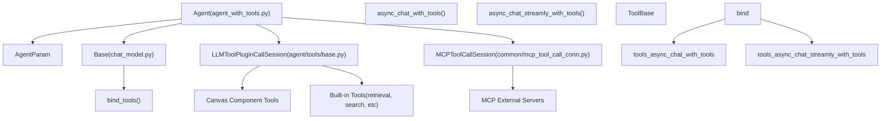
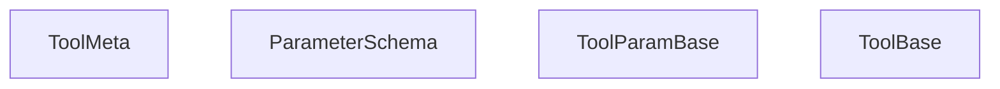
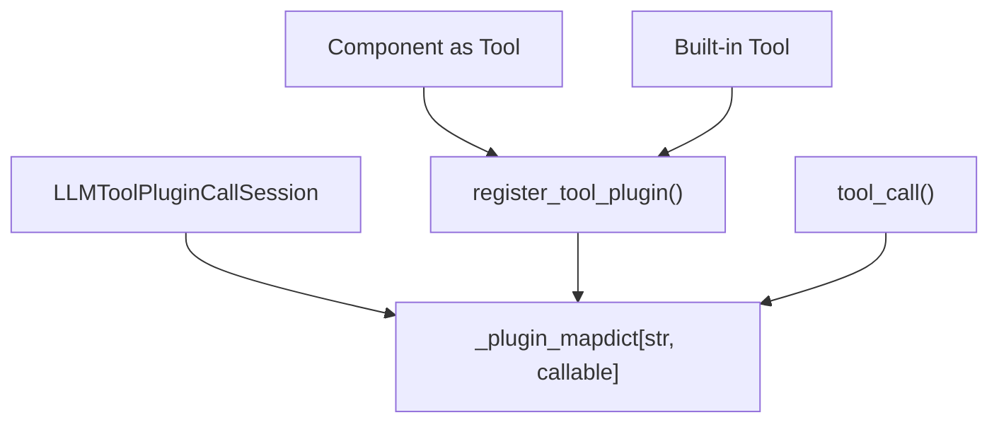
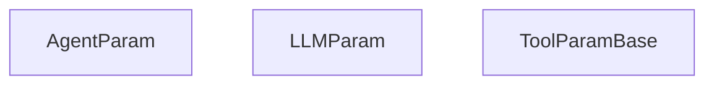
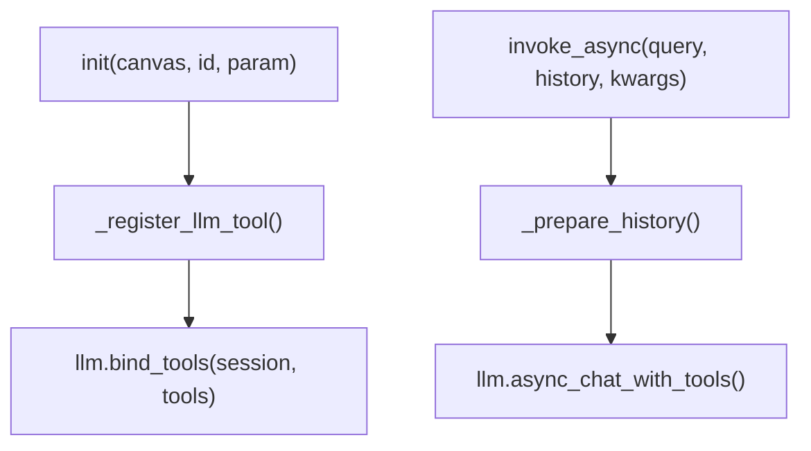
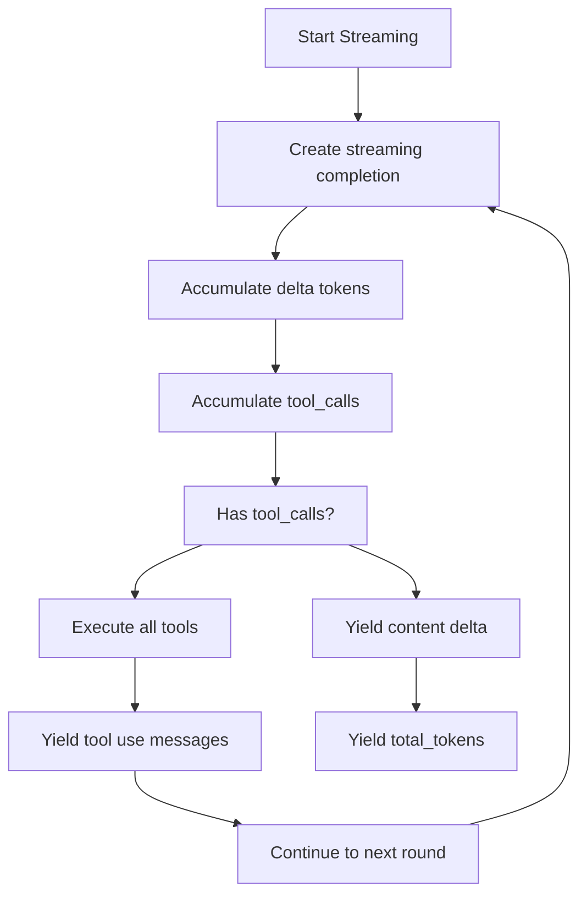
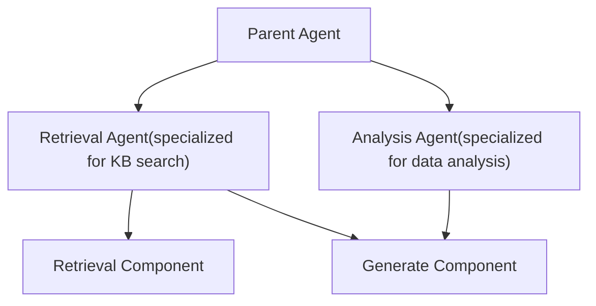
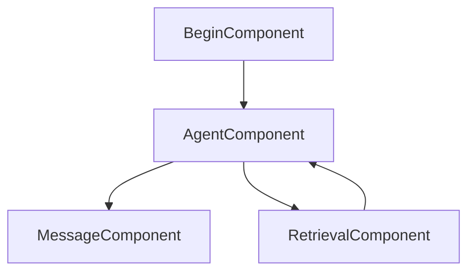

# Agent Tools and ReAct Loop

Relevant source files

-   [agent/canvas.py](https://github.com/infiniflow/ragflow/blob/80a16e71/agent/canvas.py)
-   [agent/component/agent\_with\_tools.py](https://github.com/infiniflow/ragflow/blob/80a16e71/agent/component/agent_with_tools.py)
-   [agent/component/base.py](https://github.com/infiniflow/ragflow/blob/80a16e71/agent/component/base.py)
-   [agent/component/categorize.py](https://github.com/infiniflow/ragflow/blob/80a16e71/agent/component/categorize.py)
-   [agent/component/llm.py](https://github.com/infiniflow/ragflow/blob/80a16e71/agent/component/llm.py)
-   [agent/tools/base.py](https://github.com/infiniflow/ragflow/blob/80a16e71/agent/tools/base.py)
-   [api/apps/api\_app.py](https://github.com/infiniflow/ragflow/blob/80a16e71/api/apps/api_app.py)
-   [api/apps/canvas\_app.py](https://github.com/infiniflow/ragflow/blob/80a16e71/api/apps/canvas_app.py)
-   [api/apps/llm\_app.py](https://github.com/infiniflow/ragflow/blob/80a16e71/api/apps/llm_app.py)
-   [api/db/init\_data.py](https://github.com/infiniflow/ragflow/blob/80a16e71/api/db/init_data.py)
-   [api/db/services/llm\_service.py](https://github.com/infiniflow/ragflow/blob/80a16e71/api/db/services/llm_service.py)
-   [conf/llm\_factories.json](https://github.com/infiniflow/ragflow/blob/80a16e71/conf/llm_factories.json)
-   [docs/references/supported\_models.mdx](https://github.com/infiniflow/ragflow/blob/80a16e71/docs/references/supported_models.mdx)
-   [rag/llm/\_\_init\_\_.py](https://github.com/infiniflow/ragflow/blob/80a16e71/rag/llm/__init__.py)
-   [rag/llm/chat\_model.py](https://github.com/infiniflow/ragflow/blob/80a16e71/rag/llm/chat_model.py)
-   [rag/llm/cv\_model.py](https://github.com/infiniflow/ragflow/blob/80a16e71/rag/llm/cv_model.py)
-   [rag/llm/embedding\_model.py](https://github.com/infiniflow/ragflow/blob/80a16e71/rag/llm/embedding_model.py)
-   [rag/llm/rerank\_model.py](https://github.com/infiniflow/ragflow/blob/80a16e71/rag/llm/rerank_model.py)
-   [rag/llm/sequence2txt\_model.py](https://github.com/infiniflow/ragflow/blob/80a16e71/rag/llm/sequence2txt_model.py)
-   [rag/llm/tts\_model.py](https://github.com/infiniflow/ragflow/blob/80a16e71/rag/llm/tts_model.py)
-   [rag/prompts/generator.py](https://github.com/infiniflow/ragflow/blob/80a16e71/rag/prompts/generator.py)
-   [web/src/assets/svg/llm/n1n.svg](https://github.com/infiniflow/ragflow/blob/80a16e71/web/src/assets/svg/llm/n1n.svg)
-   [web/src/components/knowledge-base-item.tsx](https://github.com/infiniflow/ragflow/blob/80a16e71/web/src/components/knowledge-base-item.tsx)
-   [web/src/constants/llm.ts](https://github.com/infiniflow/ragflow/blob/80a16e71/web/src/constants/llm.ts)
-   [web/src/interfaces/request/flow.ts](https://github.com/infiniflow/ragflow/blob/80a16e71/web/src/interfaces/request/flow.ts)
-   [web/src/pages/user-setting/setting-model/constant.ts](https://github.com/infiniflow/ragflow/blob/80a16e71/web/src/pages/user-setting/setting-model/constant.ts)
-   [web/src/utils/common-util.ts](https://github.com/infiniflow/ragflow/blob/80a16e71/web/src/utils/common-util.ts)

This document describes the Agent component's tool-calling capabilities and the ReAct (Reasoning and Acting) loop that enables iterative tool use. The Agent component extends the basic LLM Generate component ([9.3](/infiniflow/ragflow/9.3-built-in-components)) with the ability to invoke tools, observe their results, and continue reasoning until a task is complete. This enables complex multi-step workflows where the LLM can interact with external systems, retrieve information, or call other Canvas components.

For information about basic LLM text generation without tools, see [LLM Component](/infiniflow/ragflow/9.3-built-in-components). For the broader Canvas execution system, see [Canvas Engine and DSL](/infiniflow/ragflow/9.1-canvas-engine-and-dsl).

## System Architecture

The tool-calling system consists of three layers: the Agent component that orchestrates tool use, the underlying chat model that implements OpenAI-compatible tool calling, and the tool execution sessions that manage actual tool invocation.


**Sources:** [agent/component/agent\_with\_tools.py1-100](https://github.com/infiniflow/ragflow/blob/80a16e71/agent/component/agent_with_tools.py#L1-L100) [rag/llm/chat\_model.py273-332](https://github.com/infiniflow/ragflow/blob/80a16e71/rag/llm/chat_model.py#L273-L332) [agent/tools/base.py1-50](https://github.com/infiniflow/ragflow/blob/80a16e71/agent/tools/base.py#L1-L50)

## Tool Metadata and Base Classes

All tools in the system conform to a standard metadata structure based on OpenAI's function calling format. This metadata describes the tool's name, description, and parameters with type information.

### ToolMeta Structure


The `ToolMeta` TypedDict defines the standard structure:

```
ToolMeta = TypedDict('ToolMeta', {
    'name': str,
    'description': str,
    'parameters': dict  # JSON Schema format
})
```
Each parameter in `parameters` follows JSON Schema with fields: `type`, `description`, `default`, and `required`.

**Sources:** [agent/tools/base.py23-35](https://github.com/infiniflow/ragflow/blob/80a16e71/agent/tools/base.py#L23-L35) [agent/component/base.py1-50](https://github.com/infiniflow/ragflow/blob/80a16e71/agent/component/base.py#L1-L50)

## Tool Session Management

Tool execution is managed through session objects that handle the mapping from tool names to actual executable functions. There are two primary session types: one for Canvas component tools and built-ins, and one for MCP external servers.

### LLMToolPluginCallSession


The session maintains a `_plugin_map` dictionary that maps tool names to callable functions. Tools register themselves via `register_tool_plugin(name, func, meta)`.

When the LLM invokes a tool, `tool_call(name, args)` looks up the function in `_plugin_map` and executes it with the provided arguments.

**Key methods:**

-   `register_tool_plugin(name: str, func: callable, meta: ToolMeta)` - Registers a tool
-   `tool_call(name: str, kwargs: dict) -> any` - Executes a tool by name
-   `get_tools() -> list[dict]` - Returns OpenAI-format tool definitions

**Sources:** [agent/tools/base.py38-100](https://github.com/infiniflow/ragflow/blob/80a16e71/agent/tools/base.py#L38-L100)

### MCPToolCallSession

Model Context Protocol (MCP) allows external servers to provide tools. The `MCPToolCallSession` manages connections to MCP servers and translates between MCP tool metadata and OpenAI tool format.

> **[Mermaid sequence]**
> *(图表结构无法解析)*

MCP servers are configured via the `MCPServerService` database table. The session handles:

1.  Server connection and initialization
2.  Tool metadata retrieval and format conversion
3.  Asynchronous tool invocation via RPC
4.  Error handling and reconnection

**Sources:** [common/mcp\_tool\_call\_conn.py1-200](https://github.com/infiniflow/ragflow/blob/80a16e71/common/mcp_tool_call_conn.py#L1-L200) [agent/component/agent\_with\_tools.py115-140](https://github.com/infiniflow/ragflow/blob/80a16e71/agent/component/agent_with_tools.py#L115-L140)

## Agent Component and Parameters

The `Agent` component extends `LLM` and `ToolBase` to provide tool-calling capabilities within the Canvas workflow system.

### AgentParam


`AgentParam` inherits from both `LLMParam` (for LLM configuration) and `ToolParamBase` (for tool configuration). Key parameters:

-   **`tools`**: List of Canvas component IDs or built-in tool names to make available
-   **`mcp`**: List of MCP server IDs to connect to
-   **`max_rounds`**: Maximum number of tool-calling iterations (default: 5)
-   **`function_name`**: Name when this agent is used as a tool by a parent agent
-   **`meta`**: Tool metadata describing this agent's interface when called as a tool

**Sources:** [agent/component/agent\_with\_tools.py38-79](https://github.com/infiniflow/ragflow/blob/80a16e71/agent/component/agent_with_tools.py#L38-L79)

### Agent Component Lifecycle


During initialization, the Agent:

1.  Calls `LLM.__init__()` to set up the LLM bundle
2.  Initializes tool sessions (`LLMToolPluginCallSession` and `MCPToolCallSession`)
3.  Registers tools from the `tools` parameter
4.  Connects to MCP servers from the `mcp` parameter
5.  Calls `llm.bind_tools()` to attach tool session to the chat model

**Sources:** [agent/component/agent\_with\_tools.py81-186](https://github.com/infiniflow/ragflow/blob/80a16e71/agent/component/agent_with_tools.py#L81-L186)

## ReAct Loop Implementation

The ReAct loop is implemented in the `Base` class's `async_chat_with_tools` method. It iteratively calls the LLM with tool definitions, executes any requested tools, and continues until the LLM returns a final answer.

### ReAct Loop Flow

> **[Mermaid sequence]**
> *(图表结构无法解析)*

**Sources:** [rag/llm/chat\_model.py280-332](https://github.com/infiniflow/ragflow/blob/80a16e71/rag/llm/chat_model.py#L280-L332)

### Core ReAct Loop Code

The loop is in [rag/llm/chat\_model.py291-326](https://github.com/infiniflow/ragflow/blob/80a16e71/rag/llm/chat_model.py#L291-L326):

```
for _ in range(self.max_rounds + 1):
    response = await self.async_client.chat.completions.create(
        model=self.model_name,
        messages=history,
        tools=self.tools,
        tool_choice="auto",
        **gen_conf
    )

    # Check if LLM made tool calls
    if not hasattr(response.choices[0].message, "tool_calls") or \
       not response.choices[0].message.tool_calls:
        # No tool calls - return final answer
        ans += response.choices[0].message.content
        return ans, tk_count

    # Execute each tool call
    for tool_call in response.choices[0].message.tool_calls:
        name = tool_call.function.name
        args = json_repair.loads(tool_call.function.arguments)
        tool_response = await thread_pool_exec(
            self.toolcall_session.tool_call, name, args
        )
        # Append tool call and response to history
        history = self._append_history(history, tool_call, tool_response)
        ans += self._verbose_tool_use(name, args, tool_response)
```
**Key aspects:**

1.  Each iteration calls the LLM with full conversation history
2.  `tools` parameter provides tool definitions in OpenAI format
3.  `tool_choice="auto"` lets LLM decide when to use tools
4.  Tool responses are appended to history in standardized format
5.  Loop exits when LLM returns content without tool\_calls
6.  After `max_rounds`, forces a final answer without tools

**Sources:** [rag/llm/chat\_model.py280-332](https://github.com/infiniflow/ragflow/blob/80a16e71/rag/llm/chat_model.py#L280-L332)

### Streaming ReAct Loop

The streaming version (`async_chat_streamly_with_tools`) follows the same logic but yields incremental results:


The streaming version accumulates tool\_calls from delta chunks because OpenAI streams them incrementally as `delta.tool_calls[0].function.arguments` fragments.

**Sources:** [rag/llm/chat\_model.py334-443](https://github.com/infiniflow/ragflow/blob/80a16e71/rag/llm/chat_model.py#L334-L443)

## Tool Calling in Base Chat Model

The `Base` class in [rag/llm/chat\_model.py](https://github.com/infiniflow/ragflow/blob/80a16e71/rag/llm/chat_model.py) provides the foundation for tool calling that all chat model implementations inherit.

### bind\_tools Method

```
def bind_tools(self, toolcall_session, tools):
    if not (toolcall_session and tools):
        return
    self.is_tools = True
    self.toolcall_session = toolcall_session
    self.tools = tools
```
This method attaches a tool session and tool definitions to the model instance. The `tools` list is in OpenAI function calling format:

```
[
  {
    "type": "function",
    "function": {
      "name": "retrieval",
      "description": "Search the knowledge base",
      "parameters": {
        "type": "object",
        "properties": {
          "query": {
            "type": "string",
            "description": "Search query"
          }
        },
        "required": ["query"]
      }
    }
  }
]
```
**Sources:** [rag/llm/chat\_model.py273-278](https://github.com/infiniflow/ragflow/blob/80a16e71/rag/llm/chat_model.py#L273-L278)

### Tool Call History Format

Tool interactions are appended to the conversation history in the standard OpenAI format:

1.  **Assistant message with tool\_calls:**

```
{
    "role": "assistant",
    "tool_calls": [{
        "index": 0,
        "id": "call_abc123",
        "function": {
            "name": "retrieval",
            "arguments": '{"query": "quantum computing"}'
        },
        "type": "function"
    }]
}
```
2.  **Tool response message:**

```
{
    "role": "tool",
    "tool_call_id": "call_abc123",
    "content": "Search results: ..."
}
```
The `_append_history` method handles this formatting at [rag/llm/chat\_model.py249-271](https://github.com/infiniflow/ragflow/blob/80a16e71/rag/llm/chat_model.py#L249-L271)

**Sources:** [rag/llm/chat\_model.py249-271](https://github.com/infiniflow/ragflow/blob/80a16e71/rag/llm/chat_model.py#L249-L271) [rag/llm/chat\_model.py308-319](https://github.com/infiniflow/ragflow/blob/80a16e71/rag/llm/chat_model.py#L308-L319)

### Error Handling in Tool Calls

Tool execution errors are handled gracefully:

```
try:
    args = json_repair.loads(tool_call.function.arguments)
    tool_response = await thread_pool_exec(
        self.toolcall_session.tool_call, name, args
    )
    history = self._append_history(history, tool_call, tool_response)
except Exception as e:
    history.append({
        "role": "tool",
        "tool_call_id": tool_call.id,
        "content": f"Tool call error: \n{tool_call}\nException:\n" + str(e)
    })
```
This ensures the LLM receives feedback about tool failures and can adjust its strategy.

**Sources:** [rag/llm/chat\_model.py311-319](https://github.com/infiniflow/ragflow/blob/80a16e71/rag/llm/chat_model.py#L311-L319)

## Tool Types

The Agent system supports three types of tools: Canvas component tools, MCP external server tools, and built-in tools.

### Component Tools

Other Canvas components can be invoked as tools. This enables recursive agent architectures where one agent delegates to specialized sub-agents.


When a component is registered as a tool, its `execute_tool` method is called:

```
async def execute_tool(self, function_name, **kwargs):
    # Component implements this to expose itself as a tool
    # Returns the component's output
    return await self.invoke_async(**kwargs)
```
**Sources:** [agent/tools/base.py151-159](https://github.com/infiniflow/ragflow/blob/80a16e71/agent/tools/base.py#L151-L159) [agent/component/agent\_with\_tools.py112-140](https://github.com/infiniflow/ragflow/blob/80a16e71/agent/component/agent_with_tools.py#L112-L140)

### MCP (Model Context Protocol) Tools

MCP servers provide external capabilities like file access, API integrations, or database queries. The Agent connects to MCP servers configured in the database.

> **[Mermaid sequence]**
> *(图表结构无法解析)*

MCP tool metadata is converted to OpenAI format by `mcp_tool_metadata_to_openai_tool()`.

**Sources:** [common/mcp\_tool\_call\_conn.py1-200](https://github.com/infiniflow/ragflow/blob/80a16e71/common/mcp_tool_call_conn.py#L1-L200) [agent/component/agent\_with\_tools.py162-186](https://github.com/infiniflow/ragflow/blob/80a16e71/agent/component/agent_with_tools.py#L162-L186)

### Built-in Tools

Built-in tools are implemented as methods or functions and registered directly:

```
def register_builtin_tools(self, session: LLMToolPluginCallSession):
    # Retrieval tool
    session.register_tool_plugin(
        "retrieval",
        self._retrieval,
        {
            "name": "retrieval",
            "description": "Search the knowledge base",
            "parameters": {...}
        }
    )

    # Web search tool
    session.register_tool_plugin(
        "web_search",
        self._web_search,
        {...}
    )
```
Built-in tools include:

-   **Retrieval**: Search knowledge bases (when the agent is configured with KB access)
-   **Web Search**: External search engines
-   **Code Execution**: Sandbox code execution
-   **File Operations**: Read/write files in the system

**Sources:** [agent/component/agent\_with\_tools.py187-250](https://github.com/infiniflow/ragflow/blob/80a16e71/agent/component/agent_with_tools.py#L187-L250)

## Integration with Canvas Workflow

The Agent component integrates into the Canvas workflow system, receiving inputs from upstream components and passing outputs to downstream components.

### Agent as Canvas Component


The Agent receives variables from the Canvas globals and upstream component outputs. It can reference:

-   `sys.query` - Current user query
-   `sys.user_id` - User/tenant identifier
-   `cpn_id@output_key` - Outputs from other components

**Sources:** [agent/canvas.py162-234](https://github.com/infiniflow/ragflow/blob/80a16e71/agent/canvas.py#L162-L234) [agent/component/agent\_with\_tools.py251-350](https://github.com/infiniflow/ragflow/blob/80a16e71/agent/component/agent_with_tools.py#L251-L350)

### Tool Registration from Canvas Components

When initializing, the Agent registers other Canvas components as tools:

```
def _register_llm_tool(self):
    for cpn_id in self._param.tools:
        cpn = self._canvas.get_component_obj(cpn_id)
        if isinstance(cpn, ToolBase):
            # Register component as tool
            tool_name = cpn._param.function_name or cpn_id
            self._llm_tool_plugin_call_session.register_tool_plugin(
                tool_name,
                partial(cpn.execute_tool, function_name=tool_name),
                cpn._param.meta
            )
```
This allows the Agent to invoke other components in the workflow as tools during the ReAct loop.

**Sources:** [agent/component/agent\_with\_tools.py112-140](https://github.com/infiniflow/ragflow/blob/80a16e71/agent/component/agent_with_tools.py#L112-L140)

### Variable Resolution in Tool Arguments

Tool arguments can reference Canvas variables using the `{variable}` syntax:

```
# Agent parameter configuration
{
    "tools": ["retrieval_0"],
    "prompts": [{
        "role": "user",
        "content": "Search for: {sys.query}"
    }]
}
```
The Canvas `get_value_with_variable()` method resolves these at runtime before passing to the LLM.

**Sources:** [agent/canvas.py162-188](https://github.com/infiniflow/ragflow/blob/80a16e71/agent/canvas.py#L162-L188) [agent/component/agent\_with\_tools.py251-300](https://github.com/infiniflow/ragflow/blob/80a16e71/agent/component/agent_with_tools.py#L251-L300)

## Tool Call Verbosity and Output

Tool calls and their results are formatted for visibility in the conversation:

```
def _verbose_tool_use(self, name, args, res):
    return "<tool_call>" + json.dumps({
        "name": name,
        "args": args,
        "result": res
    }, ensure_ascii=False, indent=2) + "</tool_call>"
```
This XML-like format makes tool interactions visible in the conversation history and in streamed output to users.

Example output:

```
<tool_call>{
  "name": "retrieval",
  "args": {
    "query": "quantum computing basics"
  },
  "result": "Quantum computing uses quantum bits..."
}</tool_call>
```
**Sources:** [rag/llm/chat\_model.py246-247](https://github.com/infiniflow/ragflow/blob/80a16e71/rag/llm/chat_model.py#L246-L247) [rag/llm/chat\_model.py315-319](https://github.com/infiniflow/ragflow/blob/80a16e71/rag/llm/chat_model.py#L315-L319) [rag/llm/chat\_model.py405-412](https://github.com/infiniflow/ragflow/blob/80a16e71/rag/llm/chat_model.py#L405-L412)

## Max Rounds and Termination

The ReAct loop has a maximum iteration limit (`max_rounds`) to prevent infinite loops. When exceeded, the system forces a final answer:

```
if iteration > self.max_rounds:
    logging.warning(f"Exceed max rounds: {self.max_rounds}")
    history.append({
        "role": "user",
        "content": f"Exceed max rounds: {self.max_rounds}"
    })
    # Force final answer without tools
    response, token_count = await self._async_chat(history, gen_conf)
    return response, token_count
```
This ensures the Agent always produces an output, even if the task isn't fully completed.

**Sources:** [rag/llm/chat\_model.py321-326](https://github.com/infiniflow/ragflow/blob/80a16e71/rag/llm/chat_model.py#L321-L326) [rag/llm/chat\_model.py414-433](https://github.com/infiniflow/ragflow/blob/80a16e71/rag/llm/chat_model.py#L414-L433)

## Summary

The Agent Tools and ReAct Loop system enables sophisticated multi-step reasoning:

| Component | File | Purpose |
| --- | --- | --- |
| `Agent` | `agent/component/agent_with_tools.py` | Canvas component with tool-calling |
| `Base.bind_tools()` | `rag/llm/chat_model.py:273-278` | Attach tools to chat model |
| `Base.async_chat_with_tools()` | `rag/llm/chat_model.py:280-332` | ReAct loop implementation |
| `LLMToolPluginCallSession` | `agent/tools/base.py:38-100` | Tool registry and execution |
| `MCPToolCallSession` | `common/mcp_tool_call_conn.py` | MCP server tool integration |
| `ToolBase` | `agent/tools/base.py:120-170` | Interface for tool components |

The ReAct loop iteratively:

1.  Calls LLM with tool definitions and conversation history
2.  Executes any requested tools
3.  Appends tool results to history
4.  Repeats until LLM returns a final answer or max\_rounds is reached

This architecture enables complex workflows where agents can search knowledge bases, call external APIs, invoke specialized sub-agents, and combine results to answer user queries.

**Sources:** [rag/llm/chat\_model.py1-488](https://github.com/infiniflow/ragflow/blob/80a16e71/rag/llm/chat_model.py#L1-L488) [agent/component/agent\_with\_tools.py1-700](https://github.com/infiniflow/ragflow/blob/80a16e71/agent/component/agent_with_tools.py#L1-L700) [agent/tools/base.py1-200](https://github.com/infiniflow/ragflow/blob/80a16e71/agent/tools/base.py#L1-L200) [common/mcp\_tool\_call\_conn.py1-300](https://github.com/infiniflow/ragflow/blob/80a16e71/common/mcp_tool_call_conn.py#L1-L300)
