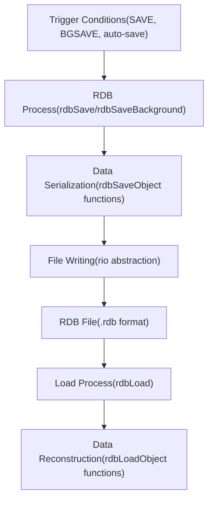
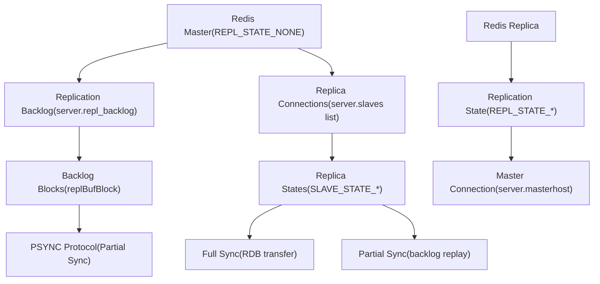
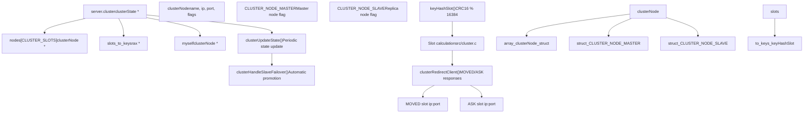
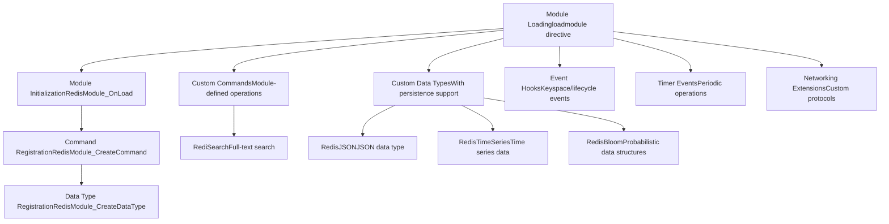
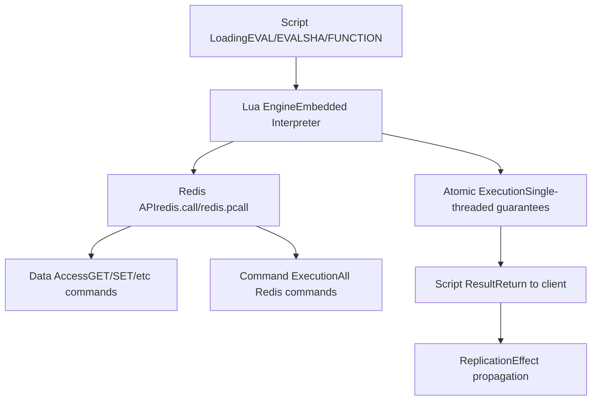

# Redis Overview

Relevant source files

-   [README.md](https://github.com/redis/redis/blob/8ad54215/README.md)

## What is Redis?

Redis is a fast, versatile, in-memory data structure server that serves as a cache, database, message broker, and search engine. For developers building real-time data-driven applications, Redis provides the fastest and most feature-rich data platform with sub-millisecond latency for both read and write operations.

### Key Use Cases

Redis excels in diverse applications across multiple domains:

| Category | Use Cases | Redis Features Used |
| --- | --- | --- |
| **Caching** | Session store, API response cache, database query cache | Multiple eviction policies, key expiration, hash-field expiration |
| **Data Structures** | Counters, queues, leaderboards, rate limiters | Strings, lists, sets, sorted sets, hashes, transactions, scripting |
| **Real-time Analytics** | Personalization, recommendations, fraud detection | Time series, probabilistic data structures, aggregations |
| **Messaging & Events** | Job queues, pub/sub, event streaming | Lists, sorted sets, streams, pub/sub |
| **Search & AI** | Document search, vector similarity, semantic caching | JSON documents, vector search, full-text search via Redis Query Engine |

### Why Choose Redis?

-   **Performance**: In-memory storage with efficient data structures achieves sub-millisecond latency
-   **Flexibility**: Rich set of native data types beyond simple key-value storage
-   **Extensibility**: Module API for custom functionality and rapid command implementation
-   **Simplicity**: Well-documented commands with text-based RESP protocol
-   **Versatility**: Battle-tested at massive scale across diverse production workloads
-   **Ubiquity**: De facto standard for caching, session management, queuing, and real-time applications

### Technical Foundation

Redis is implemented in C around a single-threaded event-driven core with optional I/O threading. The architecture centers on:

-   **Event-driven design**: Built on the `ae` event loop with `epoll`/`kqueue` for I/O multiplexing
-   **Unified object model**: All data stored as `robj` (Redis objects) with type-specific encodings
-   **Memory-first approach**: In-memory primary storage with optional persistence
-   **Extension frameworks**: Module API and embedded Lua scripting for programmability
-   **Distributed capabilities**: Built-in clustering and replication for high availability

The server core in [src/server.c](https://github.com/redis/redis/blob/8ad54215/src/server.c) coordinates all subsystems through the global `server` variable of type `struct redisServer`.

**Sources:** [README.md42-194](https://github.com/redis/redis/blob/8ad54215/README.md#L42-L194) [src/server.c5000-5300](https://github.com/redis/redis/blob/8ad54215/src/server.c#L5000-L5300) [src/server.h1800-2200](https://github.com/redis/redis/blob/8ad54215/src/server.h#L1800-L2200)

## Redis Architecture Overview

Redis architecture is designed for high performance, scalability, and extensibility through a layered system centered on the `redisServer` structure.

### High-Level System Architecture

```mermaid
flowchart TD
    redis_cli["redis-cliInteractive Client"]
    redis_benchmark["redis-benchmarkPerformance Testing"]
    client_libs["Client LibrariesPython, Java, Node.js, etc."]
    networking["Networking Layernetworking.c"]
    command_proc["Command Processingserver.c"]
    data_storage["Data Storagedb.c, kvstore.h"]
    persistence["Persistencerdb.c, aof.c"]
    core_types["Core Data Typest_string.c, t_list.c, t_hash.c"]
    memory_mgmt["Memory Managementzmalloc.c, object.c"]
    data_structures["Efficient Structuresdict.c, ziplist.c, listpack.c"]
    modules["Redis Modulesmodule.c"]
    lua_scripts["Lua Scriptingscript.c"]
    functions["Redis Functionsfunctions.c"]
    replication["Master-Replicareplication.c"]
    cluster["Redis Clustercluster.c"]
    sentinel["Redis Sentinelsentinel.c"]

    client --> libs_networking
    redis --> cli_networking
    redis --> benchmark_networking
    networking --> command_proc
    command --> proc_data_storage
    command --> proc_core_types
    data --> storage_memory_mgmt
    data --> storage_data_structures
    data --> storage_persistence
    command --> proc_modules
    command --> proc_lua_scripts
    command --> proc_functions
    data --> storage_replication
    command --> proc_cluster
    sentinel --> replication
```


### Core Components Integration

The Redis server integrates several key subsystems through the global `server` variable:

| Component | Implementation | Key Responsibility |
| --- | --- | --- |
| **Event Loop** | `ae.c`, `ae.h` | I/O multiplexing and event handling |
| **Networking** | `networking.c` | Client connections and RESP protocol |
| **Command System** | `server.c`, `commands/` | Command registration and execution |
| **Storage Engine** | `db.c`, `kvstore.c` | Key-value storage and database management |
| **Memory Management** | `zmalloc.c`, `object.c` | Memory allocation and object lifecycle |
| **Persistence** | `rdb.c`, `aof.c` | Data durability and recovery |
| **Replication** | `replication.c` | Master-replica synchronization |
| **Extensions** | `module.c`, `script.c` | Programmability and custom functionality |

### Data Flow Architecture

```mermaid
flowchart TD
    client_request["Client RequestRESP Protocol"]
    networking_read["readQueryFromClient()networking.c"]
    command_parse["processInputBuffer()Parse Commands"]
    command_lookup["lookupCommand()server.commands"]
    acl_check["ACL Validationacl.c"]
    command_exec["call()Execute Command"]
    data_ops["Data Operationsdb.c, t_*.c"]
    persistence_log["PersistenceAOF/RDB logging"]
    repl_propagate["ReplicationPropagate to replicas"]
    response_gen["addReply()Generate Response"]
    networking_write["sendReplyToClient()networking.c"]
    client_response["Client ResponseRESP Protocol"]

    client --> request_networking_read
    networking --> read_command_parse
    command --> parse_command_lookup
    command --> lookup_acl_check
    acl --> check_command_exec
    command --> exec_data_ops
    data --> ops_persistence_log
    data --> ops_repl_propagate
    command --> exec_response_gen
    response --> gen_networking_write
    networking --> write_client_response
```


**Sources:** [src/server.c5000-5300](https://github.com/redis/redis/blob/8ad54215/src/server.c#L5000-L5300) [src/networking.c120-300](https://github.com/redis/redis/blob/8ad54215/src/networking.c#L120-L300) [src/db.c195-350](https://github.com/redis/redis/blob/8ad54215/src/db.c#L195-L350) [src/ae.c](https://github.com/redis/redis/blob/8ad54215/src/ae.c) [src/ae.h](https://github.com/redis/redis/blob/8ad54215/src/ae.h) [src/commands/](https://github.com/redis/redis/blob/8ad54215/src/commands/)

## Server Core Components

The Redis server core is implemented in [src/server.c](https://github.com/redis/redis/blob/8ad54215/src/server.c) and managed through the global `server` variable of type `struct redisServer`. The main server loop is driven by the event system defined in [src/ae.h](https://github.com/redis/redis/blob/8ad54215/src/ae.h)

### Global Server State

The `redisServer` structure contains all critical server state including:

-   **Database array**: `server.db` holds multiple Redis databases
-   **Client tracking**: `server.clients` maintains active client connections
-   **Configuration**: Runtime configuration parameters managed by [src/config.c](https://github.com/redis/redis/blob/8ad54215/src/config.c)
-   **Replication state**: Master/replica status and backlog
-   **Cluster state**: Node information and slot mappings for cluster mode
-   **Module state**: Loaded modules and their registered commands

### Command Processing Pipeline Implementation

```mermaid
flowchart TD
    client_conn["client *cCONNECTION"]
    readQueryFromClient["readQueryFromClient()src/networking.c:1500"]
    processInputBuffer["processInputBuffer()RESP Protocol Parser"]
    processCommand["processCommand()src/server.c:3500"]
    lookupCommand["lookupCommand()server.commands dict"]
    ACLCheckAllPerm["ACLCheckAllPerm()src/acl.c:1800"]
    call_func["call()src/server.c:2900"]
    redisCommand_proc["cmd->proc()Command Handler"]
    selectDb["selectDb()server.db[dbid]"]
    lookupKeyWrite["lookupKeyWrite()src/db.c:285"]
    expireIfNeeded["expireIfNeeded()src/db.c:45"]
    type_handlers["Type Handlerst_string.c, t_list.c, etc."]
    moduleCommand["Module CommandRedisModuleCmdFunc"]
    evalGenericCommand["evalGenericCommand()src/script.c"]
    propagate["propagate()AOF + Replication"]
    feedAppendOnlyFile["feedAppendOnlyFile()src/aof.c"]
    replicationFeedSlaves["replicationFeedSlaves()src/replication.c"]
    addReply["addReply()src/networking.c:448"]
    sendReplyToClient["sendReplyToClient()src/networking.c"]

    client --> conn_readQueryFromClient
    readQueryFromClient --> processInputBuffer
    processInputBuffer --> processCommand
    processCommand --> lookupCommand
    lookupCommand --> ACLCheckAllPerm
    ACLCheckAllPerm --> call_func
    call --> func_redisCommand_proc
    redisCommand --> proc_selectDb
    selectDb --> lookupKeyWrite
    lookupKeyWrite --> expireIfNeeded
    redisCommand --> proc_type_handlers
    redisCommand --> proc_moduleCommand
    redisCommand --> proc_evalGenericCommand
    type --> handlers_propagate
    propagate --> feedAppendOnlyFile
    propagate --> replicationFeedSlaves
    call --> func_addReply
    addReply --> sendReplyToClient
```
Key data structures and functions in the pipeline:

-   **`client` struct**: Represents individual client connections with query buffers and reply buffers
-   **`redisCommand` struct**: Contains command metadata including `proc` function pointer and flags
-   **`server.commands`**: Hash table mapping command names to `redisCommand` structures
-   **`server.db[]`**: Array of `redisDb` structures, each containing `keys` and `expires` kvstore instances
-   **`call()` function**: Central command execution with monitoring, logging, and propagation
-   **`propagate()`**: Ensures command effects reach AOF files and replica instances

**Sources:** [src/networking.c1500-1600](https://github.com/redis/redis/blob/8ad54215/src/networking.c#L1500-L1600) [src/server.c2900-3000](https://github.com/redis/redis/blob/8ad54215/src/server.c#L2900-L3000) [src/server.c3500-3700](https://github.com/redis/redis/blob/8ad54215/src/server.c#L3500-L3700) [src/db.c45-100](https://github.com/redis/redis/blob/8ad54215/src/db.c#L45-L100) [src/db.c285-300](https://github.com/redis/redis/blob/8ad54215/src/db.c#L285-L300) [src/acl.c1800-1900](https://github.com/redis/redis/blob/8ad54215/src/acl.c#L1800-L1900)

## Data Management System

Redis organizes data through a multi-layered storage system built around the `kvstore` abstraction which supports both single-instance and cluster deployments.

### Data Storage Architecture and Key Management

```mermaid
flowchart TD
    redisServer_db["server.db[16]struct redisDb*"]
    redisDb_keys["db->keyskvstore *"]
    redisDb_expires["db->expireskvstore *"]
    kvstoreIteratorInit["kvstoreIteratorInit()src/kvstore.c"]
    kvstoreDictLookup["kvstoreDictLookup()Slot-based lookup"]
    dictFind["dictFind()src/dict.c"]
    dictEntry["dictEntry *deHash table entry"]
    dictGetKV["dictGetKV(de)Returns kvobj*"]
    kvobj_robj["kvobj (robj)Unified key-value object"]
    kvobjGetKey["kvobjGetKey()Embedded key access"]
    object_ptr["o->ptrValue pointer"]
    OBJ_STRING_encoding["OBJ_STRING+ encoding variants"]
    OBJ_LIST_encoding["OBJ_LIST+ OBJ_ENCODING_QUICKLIST"]
    OBJ_HASH_encoding["OBJ_HASH+ OBJ_ENCODING_LISTPACK"]
    OBJ_SET_encoding["OBJ_SET+ encoding variants"]
    OBJ_ZSET_encoding["OBJ_ZSET+ OBJ_ENCODING_SKIPLIST"]
    OBJ_STREAM_encoding["OBJ_STREAM+ stream structure"]
    expireIfNeeded_check["expireIfNeeded()src/db.c:45"]
    dbDelete["dbDelete()TTL-based removal"]

    redisServer --> db_redisDb_keys
    redisServer --> db_redisDb_expires
    redisDb --> keys_kvstoreIteratorInit
    redisDb --> keys_kvstoreDictLookup
    kvstoreDictLookup --> dictFind
    dictFind --> dictEntry
    dictEntry --> dictGetKV
    dictGetKV --> kvobj_robj
    kvobj --> robj_kvobjGetKey
    kvobj --> robj_object_ptr
    object --> ptr_OBJ_STRING_encoding
    object --> ptr_OBJ_LIST_encoding
    object --> ptr_OBJ_HASH_encoding
    object --> ptr_OBJ_SET_encoding
    object --> ptr_OBJ_ZSET_encoding
    object --> ptr_OBJ_STREAM_encoding
    redisDb --> expires_expireIfNeeded_check
    expireIfNeeded --> check_dbDelete
```


#### Core Data Access Functions

| Function | Purpose | Location |
| --- | --- | --- |
| `lookupKey()` | Unified key lookup with expiration | [src/db.c198-253](https://github.com/redis/redis/blob/8ad54215/src/db.c#L198-L253) |
| `lookupKeyRead()` | Read-only key access | [src/db.c271-273](https://github.com/redis/redis/blob/8ad54215/src/db.c#L271-L273) |
| `lookupKeyWrite()` | Write access with expiration enforcement | [src/db.c285-287](https://github.com/redis/redis/blob/8ad54215/src/db.c#L285-L287) |
| `dbAdd()` | Add new key-value pair | [src/db.c325-341](https://github.com/redis/redis/blob/8ad54215/src/db.c#L325-L341) |
| `dbDelete()` | Remove key and handle cleanup | [src/db.c390-420](https://github.com/redis/redis/blob/8ad54215/src/db.c#L390-L420) |
| `expireIfNeeded()` | TTL checking and expiration | [src/db.c45-100](https://github.com/redis/redis/blob/8ad54215/src/db.c#L45-L100) |

The `kvobj` type extends `robj` to embed keys directly in the object structure for memory efficiency, particularly beneficial for small keys. This unified approach reduces memory fragmentation and improves cache locality.

**Sources:** [src/db.c45-420](https://github.com/redis/redis/blob/8ad54215/src/db.c#L45-L420) [src/server.h69-92](https://github.com/redis/redis/blob/8ad54215/src/server.h#L69-L92) [src/kvstore.h](https://github.com/redis/redis/blob/8ad54215/src/kvstore.h) [src/dict.c](https://github.com/redis/redis/blob/8ad54215/src/dict.c) [src/object.c39-85](https://github.com/redis/redis/blob/8ad54215/src/object.c#L39-L85)

## Persistence Layer

Redis provides two persistence mechanisms that can operate independently or together:

### RDB (Redis Database) Snapshots


RDB implementation in `rdb.c` provides:

-   **Binary format**: Compact binary serialization of all data [src/rdb.c95-188](https://github.com/redis/redis/blob/8ad54215/src/rdb.c#L95-L188)
-   **Background saving**: Fork-based `BGSAVE` to avoid blocking the main process [src/rdb.c](https://github.com/redis/redis/blob/8ad54215/src/rdb.c)
-   **Compression**: Optional LZF compression for string values
-   **Integrity checking**: CRC64 checksums for data validation

### AOF (Append Only File) Logging

The AOF system logs commands to provide point-in-time recovery:

-   **Command logging**: All write commands are appended to AOF files [src/aof.c1-50](https://github.com/redis/redis/blob/8ad54215/src/aof.c#L1-L50)
-   **Multi-part AOF**: Base files (RDB format) plus incremental files (AOF format) [src/aof.c47-70](https://github.com/redis/redis/blob/8ad54215/src/aof.c#L47-L70)
-   **Background rewriting**: Periodic AOF compaction via `BGREWRITEAOF`
-   **Manifest tracking**: `aofManifest` structure manages multiple AOF files [src/aof.c152-171](https://github.com/redis/redis/blob/8ad54215/src/aof.c#L152-L171)

**Sources:** [src/rdb.c95-500](https://github.com/redis/redis/blob/8ad54215/src/rdb.c#L95-L500) [src/aof.c1-300](https://github.com/redis/redis/blob/8ad54215/src/aof.c#L1-L300) [src/server.h1600-1700](https://github.com/redis/redis/blob/8ad54215/src/server.h#L1600-L1700)

## High Availability Systems

Redis supports multiple deployment patterns for high availability and scalability:

### Replication System


The replication system handles:

-   **Full synchronization**: Initial RDB transfer to new replicas [src/replication.c100-200](https://github.com/redis/redis/blob/8ad54215/src/replication.c#L100-L200)
-   **Partial synchronization**: Incremental updates using replication backlog [src/replication.c200-400](https://github.com/redis/redis/blob/8ad54215/src/replication.c#L200-L400)
-   **Replica state management**: Through `REPL_STATE_*` and `SLAVE_STATE_*` constants [src/server.h495-556](https://github.com/redis/redis/blob/8ad54215/src/server.h#L495-L556)

### Redis Cluster Implementation


#### Key Cluster Data Structures and Functions

| Component | Purpose | Implementation |
| --- | --- | --- |
| `clusterState` | Global cluster state | [src/cluster.c100-200](https://github.com/redis/redis/blob/8ad54215/src/cluster.c#L100-L200) |
| `clusterNode` | Individual node information | [src/cluster.c80-95](https://github.com/redis/redis/blob/8ad54215/src/cluster.c#L80-L95) |
| `keyHashSlot()` | Maps keys to hash slots | [src/cluster.c1000-1020](https://github.com/redis/redis/blob/8ad54215/src/cluster.c#L1000-L1020) |
| `clusterRedirectClient()` | Handle slot migrations | [src/cluster.c4500-4600](https://github.com/redis/redis/blob/8ad54215/src/cluster.c#L4500-L4600) |
| `clusterCron()` | Periodic cluster maintenance | [src/cluster.c5000-5200](https://github.com/redis/redis/blob/8ad54215/src/cluster.c#L5000-L5200) |

Cluster operates with 16384 hash slots distributed across master nodes, using CRC16 hash function for deterministic key-to-slot mapping. Client redirection via `MOVED` and `ASK` responses handles slot migrations during cluster reconfiguration.

**Sources:** [src/cluster.c80-200](https://github.com/redis/redis/blob/8ad54215/src/cluster.c#L80-L200) [src/cluster.c1000-1020](https://github.com/redis/redis/blob/8ad54215/src/cluster.c#L1000-L1020) [src/cluster.c4500-4600](https://github.com/redis/redis/blob/8ad54215/src/cluster.c#L4500-L4600) [src/cluster.c5000-5200](https://github.com/redis/redis/blob/8ad54215/src/cluster.c#L5000-L5200)

### Replication System Implementation


#### Core Replication Functions

| Function | Purpose | Key Behavior |
| --- | --- | --- |
| `replicationFeedSlaves()` | Propagate commands to replicas | [src/replication.c400-500](https://github.com/redis/redis/blob/8ad54215/src/replication.c#L400-L500) |
| `syncCommand()` | Handle SYNC/PSYNC requests | [src/replication.c800-1000](https://github.com/redis/redis/blob/8ad54215/src/replication.c#L800-L1000) |
| `replicationSendAck()` | Replica acknowledgment | [src/replication.c1500-1550](https://github.com/redis/redis/blob/8ad54215/src/replication.c#L1500-L1550) |
| `startBgsaveForReplication()` | Initiate full sync | [src/replication.c600-700](https://github.com/redis/redis/blob/8ad54215/src/replication.c#L600-L700) |
| `replicationScriptCacheFlush()` | Script cache management | [src/replication.c1200-1250](https://github.com/redis/redis/blob/8ad54215/src/replication.c#L1200-L1250) |

The replication system maintains a circular buffer (`repl_backlog`) for partial synchronization, allowing replicas to catch up from a specific offset rather than requiring full RDB transfer. The `PSYNC` command enables efficient replica reconnection.

**Sources:** [src/replication.c400-1550](https://github.com/redis/redis/blob/8ad54215/src/replication.c#L400-L1550) [src/server.h495-570](https://github.com/redis/redis/blob/8ad54215/src/server.h#L495-L570) [src/rdb.c1200-1400](https://github.com/redis/redis/blob/8ad54215/src/rdb.c#L1200-L1400)

## Build System and Getting Started

### Building Redis from Source

Redis provides a comprehensive build system supporting multiple platforms and configurations. The build process is controlled through [Makefile](https://github.com/redis/redis/blob/8ad54215/Makefile) with various flags for different features.

#### Core Build Options

| Build Flag | Purpose | Dependencies |
| --- | --- | --- |
| `BUILD_WITH_MODULES=yes` | Enable all data structures and Redis Query Engine | CMake, Rust toolchain |
| `BUILD_TLS=yes` | Enable TLS/SSL support | OpenSSL development libraries |
| `USE_SYSTEMD=yes` | Enable systemd integration | systemd development libraries |
| `MALLOC=jemalloc` | Use jemalloc allocator | jemalloc (default on Linux) |

#### Basic Build Process

```
# Download Redis source
cd /usr/src
wget -O redis-8.0.0.tar.gz https://github.com/redis/redis/archive/refs/tags/8.0.0.tar.gz
tar xvf redis-8.0.0.tar.gz
cd redis-8.0.0

# Build with all features
export BUILD_TLS=yes BUILD_WITH_MODULES=yes INSTALL_RUST_TOOLCHAIN=yes DISABLE_WERRORS=yes
make -j "$(nproc)" all

# Run Redis
./src/redis-server redis-full.conf
```
#### Build System Architecture

```mermaid
flowchart TD
    makefile["MakefileTop-level build control"]
    src_makefile["src/MakefileCore build logic"]
    deps_build["deps/Third-party dependencies"]
    redis_server["redis-serverMain server binary"]
    redis_cli["redis-cliClient binary"]
    redis_benchmark["redis-benchmarkTesting tool"]
    redis_sentinel["redis-sentinelHA monitoring"]
    jemalloc["jemallocMemory allocator"]
    lua["luaScripting engine"]
    hiredis["hiredisC client library"]
    linenoise["linenoiseLine editing"]
    modules_build["Build modulesJSON, Search, TimeSeries"]
    cmake_build["CMake buildsComplex module dependencies"]
    rust_build["Rust componentsHigh-performance modules"]

    makefile --> src_makefile
    makefile --> deps_build
    src --> makefile_redis_server
    src --> makefile_redis_cli
    src --> makefile_redis_benchmark
    src --> makefile_redis_sentinel
    deps --> build_jemalloc
    deps --> build_lua
    deps --> build_hiredis
    deps --> build_linenoise
    makefile --> modules_build
    modules --> build_cmake_build
    modules --> build_rust_build
```


### Client Tools and Utilities

Redis includes several command-line tools for different operational needs:

| Tool | Purpose | Key Features |
| --- | --- | --- |
| `redis-cli` | Interactive client and administration | REPL mode, cluster management, scripting |
| `redis-benchmark` | Performance testing and load generation | Multiple test scenarios, latency analysis |
| `redis-server` | Main server binary | All deployment modes (standalone, cluster, sentinel) |
| `redis-sentinel` | High availability monitoring | Automatic failover, service discovery |
| `redis-check-rdb` | RDB file validation and repair | Data integrity verification |
| `redis-check-aof` | AOF file validation and repair | Log file consistency checking |

### Development and Testing

The codebase includes comprehensive testing infrastructure:

-   **Unit tests**: Located in [tests/unit/](https://github.com/redis/redis/blob/8ad54215/tests/unit/) using TCL test framework
-   **Integration tests**: Cluster and sentinel testing in [tests/cluster/](https://github.com/redis/redis/blob/8ad54215/tests/cluster/) [tests/sentinel/](https://github.com/redis/redis/blob/8ad54215/tests/sentinel/)
-   **Continuous integration**: GitHub Actions workflows in [.github/workflows/](https://github.com/redis/redis/blob/8ad54215/.github/workflows/)
-   **Memory testing**: Valgrind integration and leak detection
-   **Performance benchmarks**: Built-in benchmarking and profiling tools

**Sources:** [README.md200-830](https://github.com/redis/redis/blob/8ad54215/README.md#L200-L830) [Makefile](https://github.com/redis/redis/blob/8ad54215/Makefile) [src/Makefile](https://github.com/redis/redis/blob/8ad54215/src/Makefile) [deps/](https://github.com/redis/redis/blob/8ad54215/deps/) [tests/](https://github.com/redis/redis/blob/8ad54215/tests/) [.github/workflows/](https://github.com/redis/redis/blob/8ad54215/.github/workflows/)

## Extensibility Framework

Redis provides multiple mechanisms for extending functionality beyond the core data types and commands.

### Module System

The Redis Modules API, implemented in [src/module.c](https://github.com/redis/redis/blob/8ad54215/src/module.c) provides a comprehensive C extension framework:


Key module capabilities include:

-   **Command registration**: Custom commands through `RedisModule_CreateCommand()`
-   **Data type extensions**: Custom data types with persistence and replication support
-   **Event notifications**: Keyspace events, client connections, and server lifecycle hooks
-   **Memory management**: Integration with Redis memory tracking and limits
-   **Networking**: Custom protocol handlers and connection management

### Lua Scripting and Functions

Embedded Lua scripting, implemented in [src/script.c](https://github.com/redis/redis/blob/8ad54215/src/script.c) provides server-side programmability:


Scripting features include:

-   **Script execution**: `EVAL`, `EVALSHA`, and `FUNCTION` commands for Lua code execution
-   **Atomic operations**: Scripts execute atomically within the Redis event loop
-   **Redis API access**: `redis.call()` and `redis.pcall()` functions for command execution
-   **Persistent functions**: Function libraries that persist across server restarts
-   **Effect replication**: Script effects are propagated to replicas and logged to AOF

**Sources:** [src/module.c](https://github.com/redis/redis/blob/8ad54215/src/module.c) [src/script.c](https://github.com/redis/redis/blob/8ad54215/src/script.c) [src/functions.c](https://github.com/redis/redis/blob/8ad54215/src/functions.c)

## Configuration and Management

Redis configuration is managed through:

-   **Configuration files**: `redis.conf` with extensive options [redis.conf1-100](https://github.com/redis/redis/blob/8ad54215/redis.conf#L1-L100)
-   **Runtime configuration**: `CONFIG GET/SET` commands [src/config.c400-600](https://github.com/redis/redis/blob/8ad54215/src/config.c#L400-L600)
-   **Standardized config system**: Type-safe configuration handling [src/config.c170-280](https://github.com/redis/redis/blob/8ad54215/src/config.c#L170-L280)

The configuration system supports multiple data types including strings, numbers, enums, and complex structures, all managed through the `standardConfig` framework [src/config.c241-269](https://github.com/redis/redis/blob/8ad54215/src/config.c#L241-L269)

**Sources:** [src/config.c1-600](https://github.com/redis/redis/blob/8ad54215/src/config.c#L1-L600) [redis.conf1-200](https://github.com/redis/redis/blob/8ad54215/redis.conf#L1-L200) [src/server.h1810-1900](https://github.com/redis/redis/blob/8ad54215/src/server.h#L1810-L1900)
