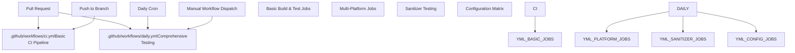
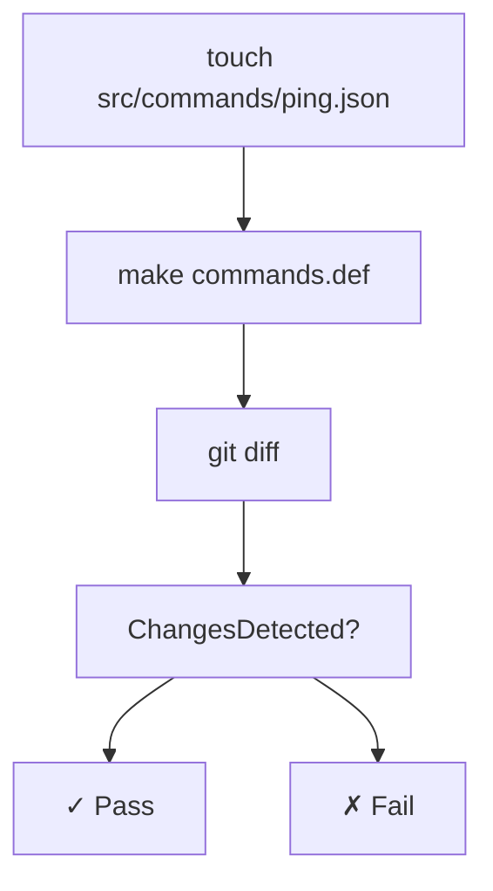
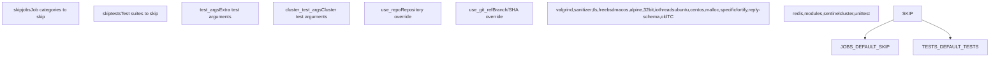
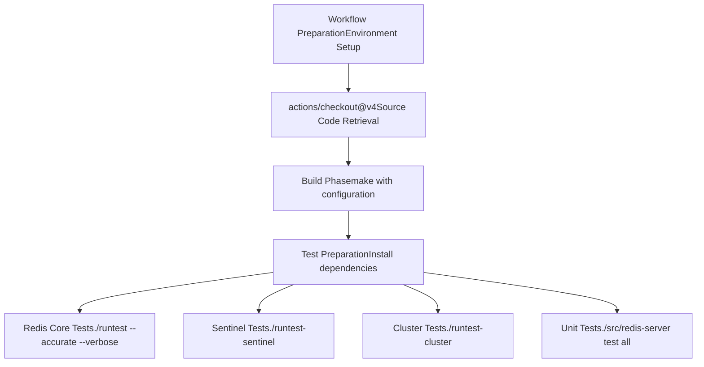
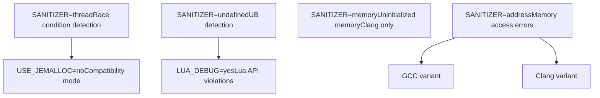
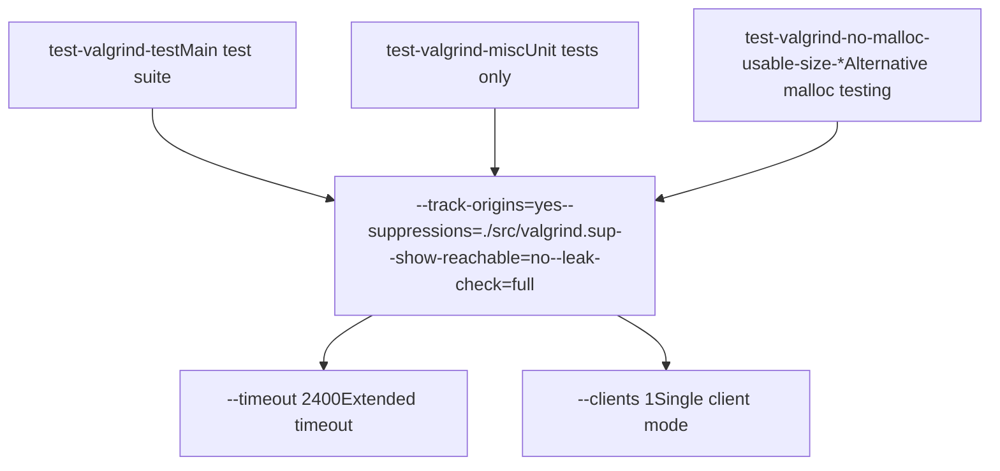
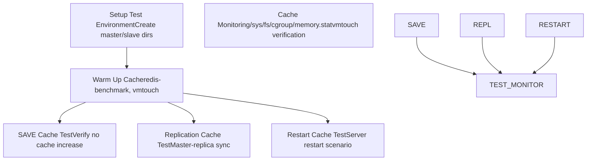

# Continuous Integration

Relevant source files

-   [.github/workflows/ci.yml](https://github.com/redis/redis/blob/8ad54215/.github/workflows/ci.yml)
-   [.github/workflows/daily.yml](https://github.com/redis/redis/blob/8ad54215/.github/workflows/daily.yml)
-   [.gitignore](https://github.com/redis/redis/blob/8ad54215/.gitignore)
-   [deps/Makefile](https://github.com/redis/redis/blob/8ad54215/deps/Makefile)
-   [deps/fast\_float/Makefile](https://github.com/redis/redis/blob/8ad54215/deps/fast_float/Makefile)
-   [deps/fast\_float/README.md](https://github.com/redis/redis/blob/8ad54215/deps/fast_float/README.md)
-   [deps/fast\_float/fast\_float.h](https://github.com/redis/redis/blob/8ad54215/deps/fast_float/fast_float.h)
-   [deps/fast\_float/fast\_float\_strtod.cpp](https://github.com/redis/redis/blob/8ad54215/deps/fast_float/fast_float_strtod.cpp)
-   [deps/fast\_float/fast\_float\_strtod.h](https://github.com/redis/redis/blob/8ad54215/deps/fast_float/fast_float_strtod.h)

This document describes Redis's automated continuous integration (CI) system implemented using GitHub Actions. The CI system ensures code quality through comprehensive testing across multiple platforms, configurations, and build targets before changes are merged.

For information about the build system and compilation process, see [Build System and Dependencies](/redis/redis/10.1-build-system-and-dependencies). For details about the testing framework itself, see [Testing Framework](/redis/redis/10.2-testing-framework).

## CI Architecture Overview

Redis uses GitHub Actions with two primary workflow files that provide different levels of testing coverage:


Sources: [.github/workflows/ci.yml1-103](https://github.com/redis/redis/blob/8ad54215/.github/workflows/ci.yml#L1-L103) [.github/workflows/daily.yml1-30](https://github.com/redis/redis/blob/8ad54215/.github/workflows/daily.yml#L1-L30)

## Main CI Workflow

The primary CI workflow runs on every push and pull request, providing fast feedback for common development scenarios:

### Basic CI Jobs

| Job Name | Purpose | Key Actions |
| --- | --- | --- |
| `test-ubuntu-latest` | Standard build and test | `make`, `runtest --tags -slow` |
| `test-sanitizer-address` | Address sanitizer testing | `SANITIZER=address`, basic test suite |
| `build-debian-old` | Legacy compatibility | Build on Debian Buster |
| `build-macos-latest` | macOS compatibility | Build with TLS support |
| `build-32bit` | 32-bit architecture | `make 32bit` |
| `build-libc-malloc` | Alternative allocator | `MALLOC=libc` |
| `build-centos-jemalloc` | Enterprise Linux | CentOS Stream 9 build |
| `build-old-chain-jemalloc` | Legacy toolchain | GCC 4.8 compatibility |

### Command Definition Validation

The CI workflow includes a critical validation step that ensures command definitions remain synchronized:


Sources: [.github/workflows/ci.yml7-25](https://github.com/redis/redis/blob/8ad54215/.github/workflows/ci.yml#L7-L25) [.github/workflows/ci.yml19-24](https://github.com/redis/redis/blob/8ad54215/.github/workflows/ci.yml#L19-L24)

## Daily Comprehensive Workflow

The daily workflow provides exhaustive testing coverage with configurable job execution:

### Workflow Configuration

The daily workflow supports fine-grained control through input parameters:


Sources: [.github/workflows/daily.yml11-29](https://github.com/redis/redis/blob/8ad54215/.github/workflows/daily.yml#L11-L29)

### Test Execution Matrix

The daily workflow runs an extensive matrix of test configurations:

| Configuration Category | Jobs | Key Variants |
| --- | --- | --- |
| **Standard Builds** | `test-ubuntu-jemalloc` | Default jemalloc build |
| **Memory Allocators** | `test-ubuntu-libc-malloc`, `test-ubuntu-no-malloc-usable-size` | libc malloc variants |
| **Architecture** | `test-ubuntu-32bit` | 32-bit build with multilib |
| **Security** | `test-ubuntu-jemalloc-fortify` | `_FORTIFY_SOURCE=3` hardening |
| **TLS Support** | `test-ubuntu-tls`, `test-ubuntu-tls-no-tls` | TLS enabled/disabled modes |
| **Threading** | `test-ubuntu-io-threads` | I/O threads configuration |
| **Memory Analysis** | `test-valgrind-*` | Valgrind memory checking |
| **Sanitizers** | `test-sanitizer-*` | Address, Memory, UBSan, TSan |
| **Platforms** | `test-centos-*`, `test-macos-latest` | Multi-platform testing |

Sources: [.github/workflows/daily.yml34-1003](https://github.com/redis/redis/blob/8ad54215/.github/workflows/daily.yml#L34-L1003)

## Test Suite Execution Pipeline

Each CI job follows a consistent execution pattern:


### Common Test Dependencies

Most jobs require these standard dependencies:

-   `tcl8.6` - Test Control Language runtime
-   `tclx` - Extended Tcl commands
-   `tcl-tls` - TLS support for Tcl (TLS builds)
-   `procps-ng` - Process utilities
-   `gcc`/`g++` - Compilation toolchain

Sources: [.github/workflows/daily.yml57-70](https://github.com/redis/redis/blob/8ad54215/.github/workflows/daily.yml#L57-L70) [.github/workflows/daily.yml242-244](https://github.com/redis/redis/blob/8ad54215/.github/workflows/daily.yml#L242-L244)

## Sanitizer Testing Strategy

Redis employs multiple sanitizers to detect different classes of bugs:


### Sanitizer-Specific Configurations

-   **AddressSanitizer**: Detects buffer overflows, use-after-free, and memory leaks
-   **MemorySanitizer**: Requires Clang and detects uninitialized memory reads
-   **UndefinedBehaviorSanitizer**: Includes Lua C API violation detection with `LUA_DEBUG=yes`
-   **ThreadSanitizer**: Disables jemalloc due to compatibility issues, uses `io-threads` configuration

Sources: [.github/workflows/daily.yml532-703](https://github.com/redis/redis/blob/8ad54215/.github/workflows/daily.yml#L532-L703)

## Memory Testing and Validation

### Valgrind Integration

Valgrind testing provides comprehensive memory analysis:


### Cache Reclaim Testing

A specialized test verifies that Redis properly reclaims file system cache:


Sources: [.github/workflows/daily.yml330-407](https://github.com/redis/redis/blob/8ad54215/.github/workflows/daily.yml#L330-L407)

## Platform and Environment Coverage

### Multi-Platform Testing

The CI system tests across different operating systems and architectures:

| Platform | Container/Runner | Key Features |
| --- | --- | --- |
| Ubuntu Latest | `ubuntu-latest` | Primary development platform |
| CentOS Stream 9 | `quay.io/centos/centos:stream9` | Enterprise Linux compatibility |
| macOS Latest | `macos-latest` | macOS compatibility |
| 32-bit Linux | Ubuntu with multilib | Architecture compatibility |
| Legacy Debian | `debian:buster` | Backward compatibility |
| Old Toolchain | Ubuntu 20.04 with GCC 4.8 | Legacy compiler support |

### TLS Configuration Testing

TLS support is tested in multiple configurations:

-   **Full TLS**: `BUILD_TLS=yes` with certificate generation via `./utils/gen-test-certs.sh`
-   **TLS Module**: `BUILD_TLS=module` for dynamic TLS loading
-   **Mixed Mode**: TLS-enabled builds tested with and without TLS protocols

Sources: [.github/workflows/daily.yml218-827](https://github.com/redis/redis/blob/8ad54215/.github/workflows/daily.yml#L218-L827) [.github/workflows/ci.yml38-103](https://github.com/redis/redis/blob/8ad54215/.github/workflows/ci.yml#L38-L103)

## Quality Assurance Integration

### Build Warnings as Errors

All builds use `-Werror` to treat warnings as compilation errors, ensuring code quality:

```
make REDIS_CFLAGS='-Werror -DREDIS_TEST'
```
### Debug Assertions

Critical builds include debug assertions for additional runtime checks:

```
make SANITIZER=address REDIS_CFLAGS='-Werror -DDEBUG_ASSERTIONS'
```
### Test Coverage Options

Tests can be configured with various flags:

-   `--accurate`: More thorough but slower testing
-   `--verbose`: Detailed test output
-   `--dump-logs`: Preserve test logs on failure
-   `--tls`: Enable TLS protocol testing
-   `--valgrind`: Memory analysis mode
-   `--timeout 2400`: Extended timeout for slow tests

Sources: [.github/workflows/ci.yml14](https://github.com/redis/redis/blob/8ad54215/.github/workflows/ci.yml#L14-L14) [.github/workflows/daily.yml55](https://github.com/redis/redis/blob/8ad54215/.github/workflows/daily.yml#L55-L55) [.github/workflows/daily.yml436](https://github.com/redis/redis/blob/8ad54215/.github/workflows/daily.yml#L436-L436)
