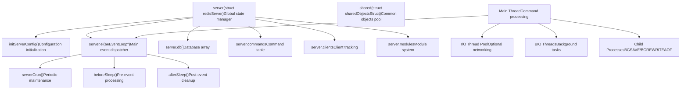
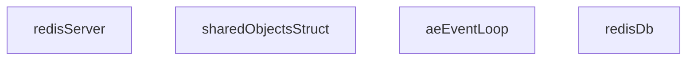
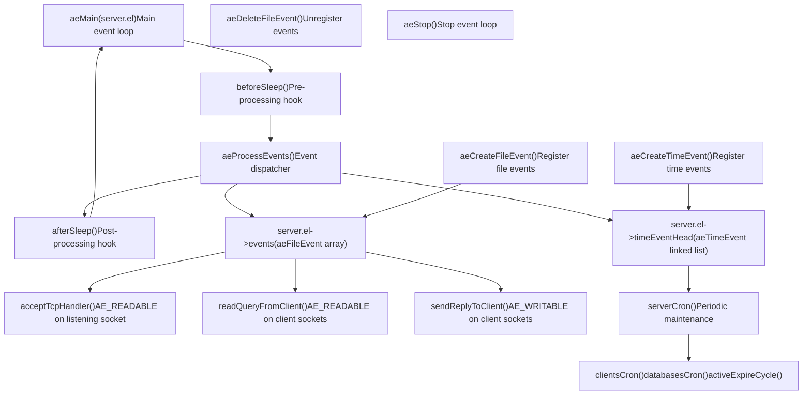
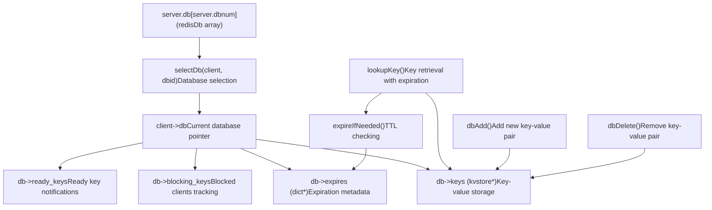
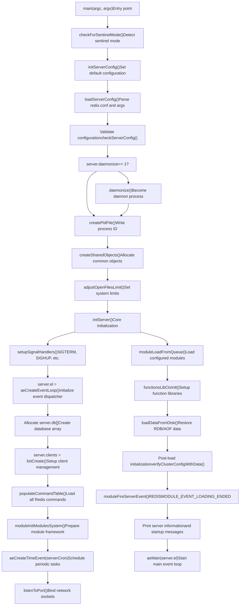
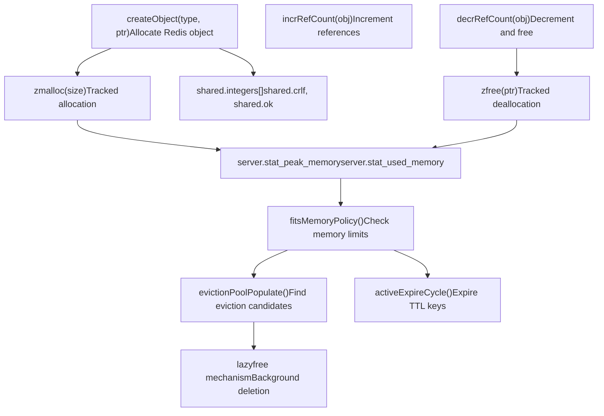
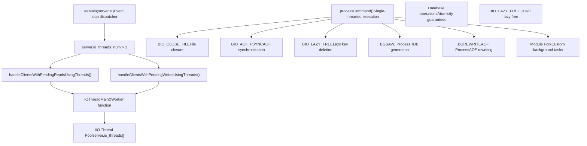
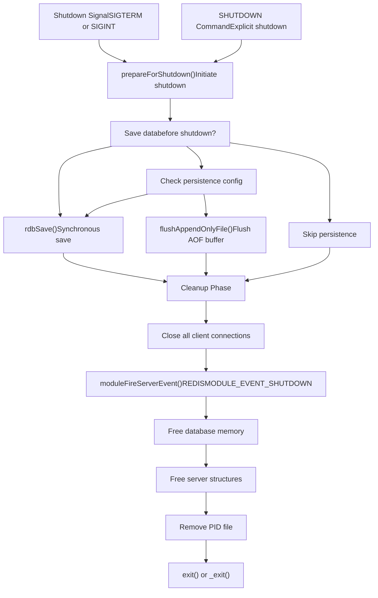
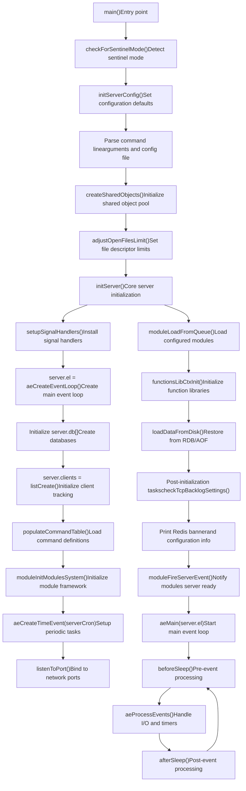

# Server Architecture and Lifecycle

Relevant source files

-   [redis.conf](https://github.com/redis/redis/blob/8ad54215/redis.conf)
-   [src/aof.c](https://github.com/redis/redis/blob/8ad54215/src/aof.c)
-   [src/config.c](https://github.com/redis/redis/blob/8ad54215/src/config.c)
-   [src/db.c](https://github.com/redis/redis/blob/8ad54215/src/db.c)
-   [src/debug.c](https://github.com/redis/redis/blob/8ad54215/src/debug.c)
-   [src/module.c](https://github.com/redis/redis/blob/8ad54215/src/module.c)
-   [src/networking.c](https://github.com/redis/redis/blob/8ad54215/src/networking.c)
-   [src/object.c](https://github.com/redis/redis/blob/8ad54215/src/object.c)
-   [src/rdb.c](https://github.com/redis/redis/blob/8ad54215/src/rdb.c)
-   [src/replication.c](https://github.com/redis/redis/blob/8ad54215/src/replication.c)
-   [src/server.c](https://github.com/redis/redis/blob/8ad54215/src/server.c)
-   [src/server.h](https://github.com/redis/redis/blob/8ad54215/src/server.h)
-   [tests/unit/introspection.tcl](https://github.com/redis/redis/blob/8ad54215/tests/unit/introspection.tcl)

This document covers Redis server architecture with emphasis on server initialization, global state management, event loop infrastructure, and the complete server lifecycle. This foundational architecture supports all Redis operations, from startup to shutdown.

## Server Architecture Overview

Redis operates as an event-driven server with a single main thread for command processing and optional I/O threading. The architecture centers around the global `server` variable that coordinates all subsystems throughout the server lifecycle.

### Core Infrastructure Components

Sources: [src/server.c79](https://github.com/redis/redis/blob/8ad54215/src/server.c#L79-L79)(Global server variable), [src/server.c69](https://github.com/redis/redis/blob/8ad54215/src/server.c#L69-L69)(Shared objects), [src/server.h1920-2100](https://github.com/redis/redis/blob/8ad54215/src/server.h#L1920-L2100)(struct redisServer), [src/server.c1200-1400](https://github.com/redis/redis/blob/8ad54215/src/server.c#L1200-L1400)(serverCron), [src/server.c1465-1555](https://github.com/redis/redis/blob/8ad54215/src/server.c#L1465-L1555)(beforeSleep)

## Global Server State Management

The `server` global variable defined at [src/server.c80](https://github.com/redis/redis/blob/8ad54215/src/server.c#L80-L80) is the central coordination point for all Redis operations. This `struct redisServer` instance maintains the complete server state and coordinates subsystem interactions throughout the server lifecycle.

### Server State Structure

### State Management Functions

| Function | Purpose | Phase | File Location |
| --- | --- | --- | --- |
| `initServerConfig()` | Initialize configuration defaults | Startup | [src/server.c2880-3178](https://github.com/redis/redis/blob/8ad54215/src/server.c#L2880-L3178) |
| `createSharedObjects()` | Allocate shared object pool | Startup | [src/server.c1080-1120](https://github.com/redis/redis/blob/8ad54215/src/server.c#L1080-L1120) |
| `initServer()` | Initialize core server structures | Startup | [src/server.c3220-3550](https://github.com/redis/redis/blob/8ad54215/src/server.c#L3220-L3550) |
| `resetServerStats()` | Reset statistics counters | Runtime | [src/server.c1725-1780](https://github.com/redis/redis/blob/8ad54215/src/server.c#L1725-L1780) |
| `updateCachedTime()` | Update time caches | Runtime | [src/server.c1200-1220](https://github.com/redis/redis/blob/8ad54215/src/server.c#L1200-L1220) |
| `prepareForShutdown()` | Graceful shutdown preparation | Shutdown | [src/server.c3800-3900](https://github.com/redis/redis/blob/8ad54215/src/server.c#L3800-L3900) |

### Server Configuration State

| Configuration Category | Key Variables | Description |
| --- | --- | --- |
| Network | `port`, `bindaddr`, `tcp_backlog` | Network binding configuration |
| Persistence | `aof_state`, `saveparams`, `rdb_filename` | Data persistence settings |
| Memory | `maxmemory`, `maxmemory_policy` | Memory management configuration |
| Replication | `masterhost`, `replid`, `master_repl_offset` | Replication state |
| Cluster | `cluster_enabled`, `cluster_node_timeout` | Cluster configuration |
| Security | `requirepass`, `acl_users` | Authentication settings |

Sources: [src/server.h1920-2800](https://github.com/redis/redis/blob/8ad54215/src/server.h#L1920-L2800)(struct redisServer), [src/server.c69](https://github.com/redis/redis/blob/8ad54215/src/server.c#L69-L69)(Shared objects struct), [src/server.c2880-3178](https://github.com/redis/redis/blob/8ad54215/src/server.c#L2880-L3178)(initServerConfig), [src/server.c1080-1120](https://github.com/redis/redis/blob/8ad54215/src/server.c#L1080-L1120)(createSharedObjects)

## Event Loop Infrastructure

The event loop infrastructure is implemented using the `ae` library, providing platform-independent I/O multiplexing. The main event loop at `server.el` handles both file events (network I/O) and time events (periodic maintenance).

### Event Loop Architecture

### Event Loop Configuration and Control

| Setting | Default | Purpose | Location |
| --- | --- | --- | --- |
| `server.hz` | 10 | `serverCron` frequency (Hz) | [src/server.h123](https://github.com/redis/redis/blob/8ad54215/src/server.h#L123-L123) |
| `server.el->maxfd` | Dynamic | Maximum file descriptor | Event loop initialization |
| `server.el->setsize` | `server.maxclients + CONFIG_FDSET_INCR` | Event set size | [src/server.c3350-3400](https://github.com/redis/redis/blob/8ad54215/src/server.c#L3350-L3400) |
| `server.cronloops` | 0 | Cron execution counter | [src/server.c1200-1300](https://github.com/redis/redis/blob/8ad54215/src/server.c#L1200-L1300) |

### Core Event Processing Functions

| Function | Purpose | Timing | File Reference |
| --- | --- | --- | --- |
| `beforeSleep()` | Handle pending writes, lazy expiration | Before each poll | [src/server.c1465-1555](https://github.com/redis/redis/blob/8ad54215/src/server.c#L1465-L1555) |
| `afterSleep()` | Post-processing cleanup | After each poll | [src/server.c1575-1585](https://github.com/redis/redis/blob/8ad54215/src/server.c#L1575-L1585) |
| `serverCron()` | Periodic maintenance tasks | Every `1000/server.hz` ms | [src/server.c1200-1450](https://github.com/redis/redis/blob/8ad54215/src/server.c#L1200-L1450) |
| `handleClientsWithPendingWrites()` | Optimize client I/O | In `beforeSleep()` | [src/networking.c4186-4264](https://github.com/redis/redis/blob/8ad54215/src/networking.c#L4186-L4264) |
| `processEventsWhileBlocked()` | Event processing during blocking ops | Special cases | [src/server.c5154-5200](https://github.com/redis/redis/blob/8ad54215/src/server.c#L5154-L5200) |

Sources: [src/server.c1465-1555](https://github.com/redis/redis/blob/8ad54215/src/server.c#L1465-L1555)(beforeSleep), [src/server.c1200-1450](https://github.com/redis/redis/blob/8ad54215/src/server.c#L1200-L1450)(serverCron), [src/server.c3350-3400](https://github.com/redis/redis/blob/8ad54215/src/server.c#L3350-L3400)(Event loop initialization), [src/networking.c4186-4264](https://github.com/redis/redis/blob/8ad54215/src/networking.c#L4186-L4264)(Pending writes handling)

## Core Infrastructure Components

Redis server infrastructure includes several key subsystems that support the main event loop and maintain server state throughout the lifecycle.

### Database and Storage Infrastructure

### Command System Infrastructure

| Component | Purpose | Location |
| --- | --- | --- |
| `server.commands` | Command lookup table | [src/server.c2100-2200](https://github.com/redis/redis/blob/8ad54215/src/server.c#L2100-L2200) |
| `server.orig_commands` | Original commands backup | [src/server.c2250-2300](https://github.com/redis/redis/blob/8ad54215/src/server.c#L2250-L2300) |
| `populateCommandTable()` | Initialize command definitions | [src/server.c2400-2500](https://github.com/redis/redis/blob/8ad54215/src/server.c#L2400-L2500) |
| `lookupCommand()` | Find command by name | [src/server.c3050-3100](https://github.com/redis/redis/blob/8ad54215/src/server.c#L3050-L3100) |
| `struct redisCommand` | Command metadata structure | [src/server.h2100-2200](https://github.com/redis/redis/blob/8ad54215/src/server.h#L2100-L2200) |

### Module System Infrastructure

| Component | Purpose | Location |
| --- | --- | --- |
| `server.modules` | Loaded modules registry | [src/module.c79](https://github.com/redis/redis/blob/8ad54215/src/module.c#L79-L79) |
| `server.loadmodule_queue` | Modules to load at startup | [src/server.c3500-3550](https://github.com/redis/redis/blob/8ad54215/src/server.c#L3500-L3550) |
| `moduleLoadFromQueue()` | Load queued modules | [src/module.c1500-1600](https://github.com/redis/redis/blob/8ad54215/src/module.c#L1500-L1600) |
| `moduleFireServerEvent()` | Notify modules of events | [src/module.c1800-1900](https://github.com/redis/redis/blob/8ad54215/src/module.c#L1800-L1900) |

Sources: [src/db.c198-253](https://github.com/redis/redis/blob/8ad54215/src/db.c#L198-L253)(lookupKey), [src/db.c1100-1200](https://github.com/redis/redis/blob/8ad54215/src/db.c#L1100-L1200)(Database operations), [src/server.c2400-2500](https://github.com/redis/redis/blob/8ad54215/src/server.c#L2400-L2500)(Command table), [src/module.c79](https://github.com/redis/redis/blob/8ad54215/src/module.c#L79-L79)(Module system)

## Server Initialization Lifecycle

Redis server initialization follows a precise sequence that establishes all core infrastructure before entering the main event loop.

### Initialization Flow

### Initialization Phase Details

| Phase | Key Functions | Purpose |
| --- | --- | --- |
| Configuration | `initServerConfig()`, `loadServerConfig()` | Establish server settings |
| Process Setup | `daemonize()`, `createPidFile()` | Process management |
| Object Pool | `createSharedObjects()` | Pre-allocate common objects |
| Core Infrastructure | `initServer()` | Initialize all subsystems |
| Module Loading | `moduleLoadFromQueue()` | Load and initialize modules |
| Data Restoration | `loadDataFromDisk()` | Restore persisted state |
| Event Loop Start | `aeMain()` | Begin serving requests |

Sources: [src/server.c7185-7388](https://github.com/redis/redis/blob/8ad54215/src/server.c#L7185-L7388)(main function), [src/server.c2880-3178](https://github.com/redis/redis/blob/8ad54215/src/server.c#L2880-L3178)(initServerConfig), [src/server.c3220-3550](https://github.com/redis/redis/blob/8ad54215/src/server.c#L3220-L3550)(initServer), [src/server.c1080-1120](https://github.com/redis/redis/blob/8ad54215/src/server.c#L1080-L1120)(createSharedObjects)

## Memory Management Infrastructure

Redis implements comprehensive memory management through allocation tracking, shared object pools, and eviction policies that operate throughout the server lifecycle.

### Memory Management Architecture

### Memory Management Configuration

| Setting | Purpose | Default | Configuration |
| --- | --- | --- | --- |
| `maxmemory` | Memory usage limit | 0 (unlimited) | `CONFIG SET maxmemory` |
| `maxmemory-policy` | Eviction strategy | `noeviction` | LRU, LFU, random, TTL |
| `lazyfree-lazy-eviction` | Background eviction | `no` | Async key deletion |
| `maxmemory-samples` | Eviction sample size | 5 | LRU/LFU precision |

### Key Memory Functions

| Function | Purpose | Phase | Location |
| --- | --- | --- | --- |
| `zmalloc_used_memory()` | Get total memory usage | Runtime | [src/zmalloc.c200-250](https://github.com/redis/redis/blob/8ad54215/src/zmalloc.c#L200-L250) |
| `getMaxmemoryState()` | Check memory policy | Command execution | [src/evict.c150-200](https://github.com/redis/redis/blob/8ad54215/src/evict.c#L150-L200) |
| `performEvictions()` | Execute eviction policy | Before commands | [src/evict.c500-600](https://github.com/redis/redis/blob/8ad54215/src/evict.c#L500-L600) |
| `activeExpireCycle()` | Expire TTL keys | `serverCron()` | [src/expire.c200-300](https://github.com/redis/redis/blob/8ad54215/src/expire.c#L200-L300) |
| `createSharedObjects()` | Initialize object pool | Startup | [src/server.c1080-1120](https://github.com/redis/redis/blob/8ad54215/src/server.c#L1080-L1120) |

Sources: [src/zmalloc.c200-250](https://github.com/redis/redis/blob/8ad54215/src/zmalloc.c#L200-L250)(Memory tracking), [src/server.c1080-1120](https://github.com/redis/redis/blob/8ad54215/src/server.c#L1080-L1120)(Shared objects), [src/evict.c150-200](https://github.com/redis/redis/blob/8ad54215/src/evict.c#L150-L200)(Memory policies), [src/expire.c200-300](https://github.com/redis/redis/blob/8ad54215/src/expire.c#L200-L300)(TTL expiration)

## Threading Model and Concurrency

Redis employs a hybrid threading model with single-threaded command execution and optional multi-threading for I/O and background operations.

### Threading Architecture

### Threading Configuration

| Configuration | Default | Purpose | Control Variable |
| --- | --- | --- | --- |
| `io-threads` | 1 | I/O threading | `server.io_threads_num` |
| `io-threads-do-reads` | no | Threaded reads | `server.io_threads_do_reads` |
| Main thread only | Always | Command execution | Single-threaded guarantee |
| Background I/O | Always | File operations | BIO job queues |

### Process Lifecycle Management

| Process Type | Creation Function | Lifecycle Management |
| --- | --- | --- |
| Main server | `main()` | Full server lifecycle |
| BGSAVE child | `rdbSaveBackground()` | `server.child_pid` tracking |
| BGREWRITEAOF child | `rewriteAppendOnlyFileBackground()` | Background AOF rewrite |
| Module fork | `RM_Fork()` | Module-controlled child process |

Sources: [src/networking.c4186-4264](https://github.com/redis/redis/blob/8ad54215/src/networking.c#L4186-L4264)(I/O threading), [src/bio.c200-300](https://github.com/redis/redis/blob/8ad54215/src/bio.c#L200-L300)(Background I/O), [src/rdb.c1400-1500](https://github.com/redis/redis/blob/8ad54215/src/rdb.c#L1400-L1500)(BGSAVE), [src/aof.c1800-1900](https://github.com/redis/redis/blob/8ad54215/src/aof.c#L1800-L1900)(BGREWRITEAOF)

## Server Shutdown and Cleanup

Redis supports graceful shutdown with proper cleanup of resources and optional persistence operations.

### Shutdown Process

### Shutdown Configuration Options

| Option | Purpose | Implementation |
| --- | --- | --- |
| `SHUTDOWN SAVE` | Force save before exit | `prepareForShutdown(SHUTDOWN_SAVE)` |
| `SHUTDOWN NOSAVE` | Exit without saving | `prepareForShutdown(SHUTDOWN_NOSAVE)` |
| `shutdown-on-sigterm` | Signal handling policy | Configuration setting |
| `shutdown-on-sigint` | SIGINT handling | Configuration setting |

### Cleanup Functions

| Function | Purpose | Location |
| --- | --- | --- |
| `prepareForShutdown()` | Main shutdown coordinator | [src/server.c3800-3900](https://github.com/redis/redis/blob/8ad54215/src/server.c#L3800-L3900) |
| `closeListeningSockets()` | Close listening sockets | [src/server.c3950-4000](https://github.com/redis/redis/blob/8ad54215/src/server.c#L3950-L4000) |
| `freeClientAsync()` | Cleanup client connections | [src/networking.c1300-1400](https://github.com/redis/redis/blob/8ad54215/src/networking.c#L1300-L1400) |
| `flushAppendOnlyFile()` | Final AOF flush | [src/aof.c900-1000](https://github.com/redis/redis/blob/8ad54215/src/aof.c#L900-L1000) |

Sources: [src/server.c3800-3900](https://github.com/redis/redis/blob/8ad54215/src/server.c#L3800-L3900)(prepareForShutdown), [src/server.c1660-1720](https://github.com/redis/redis/blob/8ad54215/src/server.c#L1660-L1720)(Signal handlers), [src/debug.c1200-1300](https://github.com/redis/redis/blob/8ad54215/src/debug.c#L1200-L1300)(Crash handling)

## Server Initialization

Redis server initialization follows this detailed sequence:

Sources: [src/server.c7185-7388](https://github.com/redis/redis/blob/8ad54215/src/server.c#L7185-L7388)(main function), [src/server.c2880-3200](https://github.com/redis/redis/blob/8ad54215/src/server.c#L2880-L3200)(initServerConfig), [src/server.c3350-3550](https://github.com/redis/redis/blob/8ad54215/src/server.c#L3350-L3550)(initServer), [src/server.c1200-1400](https://github.com/redis/redis/blob/8ad54215/src/server.c#L1200-L1400)(serverCron), [src/module.c1500-1600](https://github.com/redis/redis/blob/8ad54215/src/module.c#L1500-L1600)(Module initialization)

## Key Points and Design Decisions

1.  **Single-Threaded Core**: Simplifies data structure access, avoiding locks and complex concurrency issues
2.  **Event-Driven Architecture**: Efficiently handles thousands of clients with minimal resource usage
3.  **Optional I/O Threading**: Allows scaling for high-throughput scenarios while maintaining core simplicity
4.  **In-Memory Design**: Prioritizes speed with optional persistence
5.  **Command Structure**: Commands are implemented as C functions in a command table
6.  **Client State Machine**: Well-defined client lifecycle with clear state transitions

Sources: [src/server.c77-78](https://github.com/redis/redis/blob/8ad54215/src/server.c#L77-L78)(Global server instance), [src/server.h3500-4500](https://github.com/redis/redis/blob/8ad54215/src/server.h#L3500-L4500)(Server structure definition)
