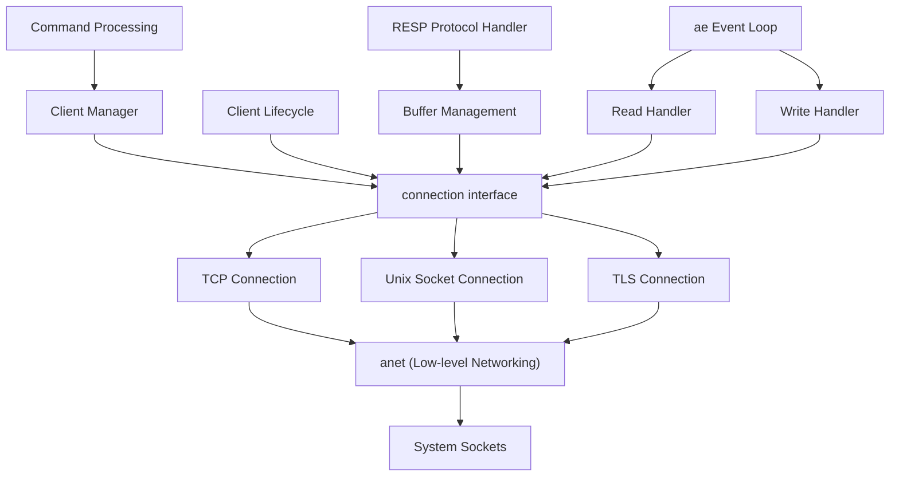
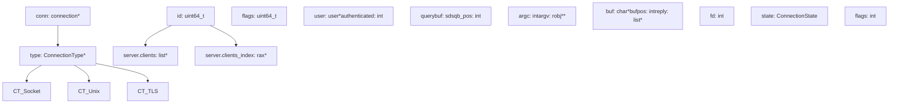
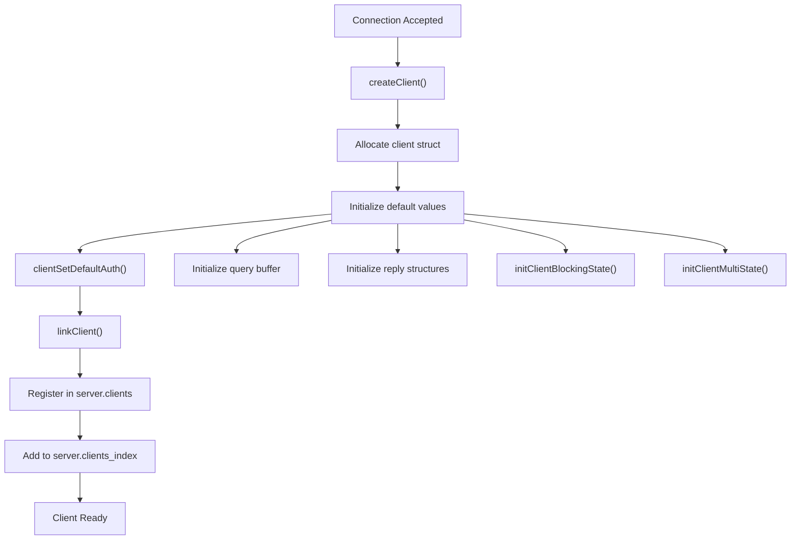
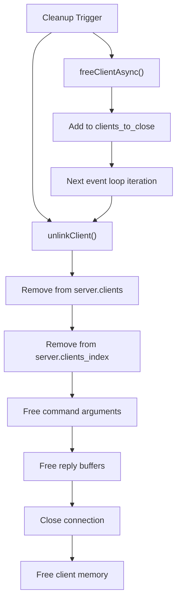
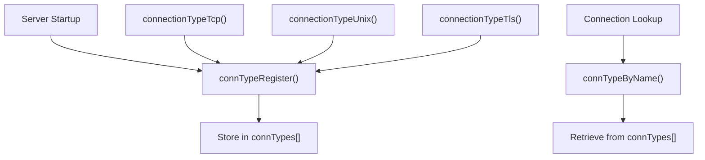
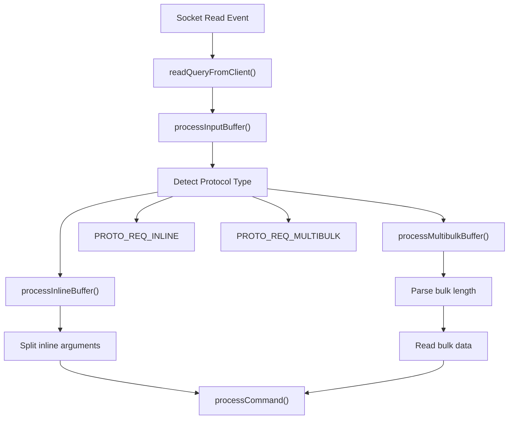
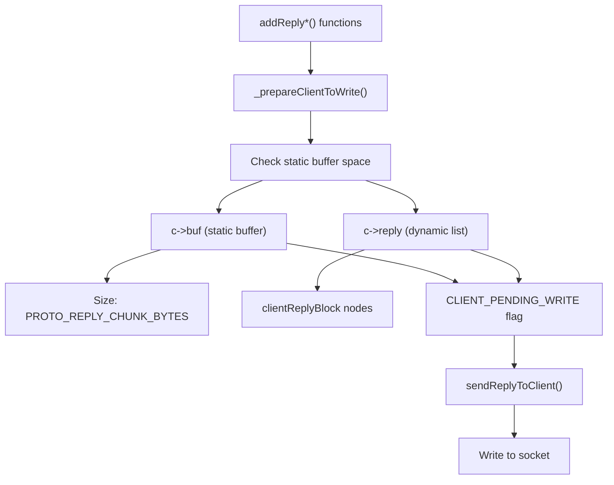
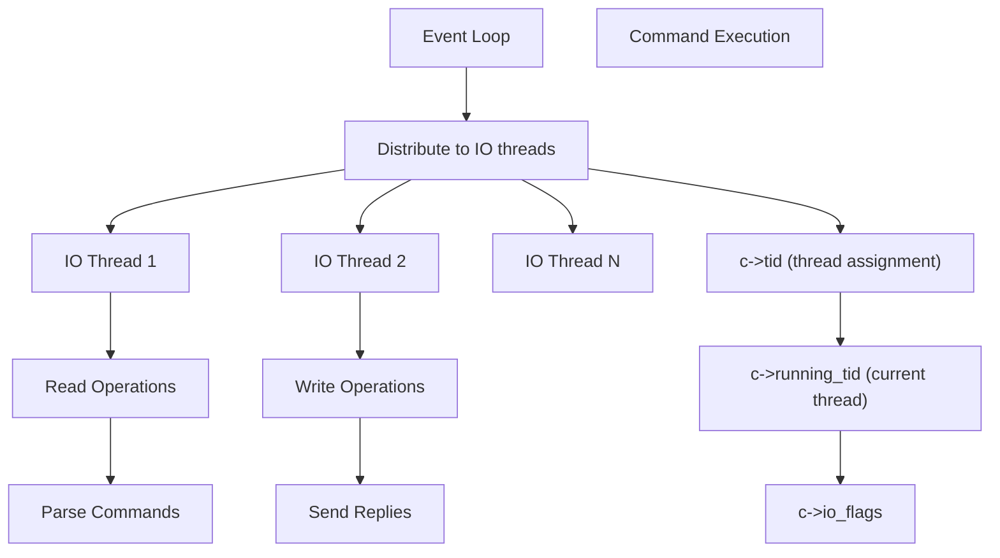
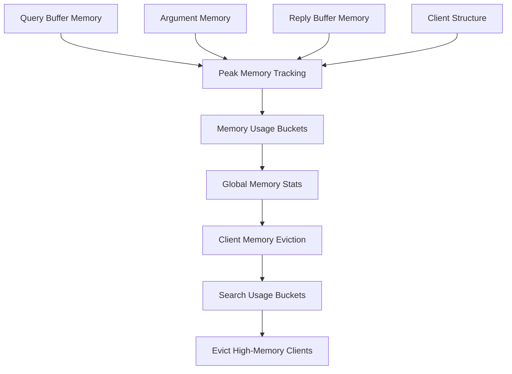

# Client Connection Management

Relevant source files

-   [redis.conf](https://github.com/redis/redis/blob/8ad54215/redis.conf)
-   [src/anet.c](https://github.com/redis/redis/blob/8ad54215/src/anet.c)
-   [src/anet.h](https://github.com/redis/redis/blob/8ad54215/src/anet.h)
-   [src/aof.c](https://github.com/redis/redis/blob/8ad54215/src/aof.c)
-   [src/config.c](https://github.com/redis/redis/blob/8ad54215/src/config.c)
-   [src/connection.c](https://github.com/redis/redis/blob/8ad54215/src/connection.c)
-   [src/connection.h](https://github.com/redis/redis/blob/8ad54215/src/connection.h)
-   [src/db.c](https://github.com/redis/redis/blob/8ad54215/src/db.c)
-   [src/debug.c](https://github.com/redis/redis/blob/8ad54215/src/debug.c)
-   [src/module.c](https://github.com/redis/redis/blob/8ad54215/src/module.c)
-   [src/networking.c](https://github.com/redis/redis/blob/8ad54215/src/networking.c)
-   [src/object.c](https://github.com/redis/redis/blob/8ad54215/src/object.c)
-   [src/rdb.c](https://github.com/redis/redis/blob/8ad54215/src/rdb.c)
-   [src/replication.c](https://github.com/redis/redis/blob/8ad54215/src/replication.c)
-   [src/server.c](https://github.com/redis/redis/blob/8ad54215/src/server.c)
-   [src/server.h](https://github.com/redis/redis/blob/8ad54215/src/server.h)
-   [src/socket.c](https://github.com/redis/redis/blob/8ad54215/src/socket.c)
-   [src/tls.c](https://github.com/redis/redis/blob/8ad54215/src/tls.c)
-   [src/unix.c](https://github.com/redis/redis/blob/8ad54215/src/unix.c)
-   [tests/unit/introspection.tcl](https://github.com/redis/redis/blob/8ad54215/tests/unit/introspection.tcl)

This document covers Redis's client connection management system, which handles the establishment, maintenance, and termination of client connections to the Redis server. This includes the connection abstraction layer, client lifecycle management, protocol handling, and output buffer management.

For information about command processing after connection establishment, see [Command Processing Pipeline](/redis/redis/2.3-command-processing-pipeline). For server initialization and the event loop that drives connection handling, see [Server Architecture and Lifecycle](/redis/redis/2.1-server-architecture-and-lifecycle).

## Architecture Overview

Redis implements a layered architecture for client connection management that abstracts different transport types (TCP, Unix sockets, TLS) behind a common interface while providing efficient handling of thousands of concurrent connections.

### Client Connection Architecture

Sources: [src/networking.c1-50](https://github.com/redis/redis/blob/8ad54215/src/networking.c#L1-L50) [src/connection.h1-100](https://github.com/redis/redis/blob/8ad54215/src/connection.h#L1-L100) [src/server.h1800-2000](https://github.com/redis/redis/blob/8ad54215/src/server.h#L1800-L2000)

### Core Data Structures

Sources: [src/server.h1800-2100](https://github.com/redis/redis/blob/8ad54215/src/server.h#L1800-L2100) [src/connection.h47-120](https://github.com/redis/redis/blob/8ad54215/src/connection.h#L47-L120) [src/server.c90-100](https://github.com/redis/redis/blob/8ad54215/src/server.c#L90-L100)

## Client Lifecycle Management

### Client Creation and Initialization

The client lifecycle begins when a new connection is accepted by the server. The `createClient` function initializes a new client structure with default values.

Sources: [src/networking.c121-235](https://github.com/redis/redis/blob/8ad54215/src/networking.c#L121-L235) [src/networking.c90-100](https://github.com/redis/redis/blob/8ad54215/src/networking.c#L90-L100)

Key initialization steps performed by `createClient`:

-   Allocates client structure with `zmalloc`
-   Sets up connection-specific properties (TCP keepalive, read handler)
-   Initializes reply buffer with `PROTO_REPLY_CHUNK_BYTES` size
-   Sets default database (0) and client ID
-   Configures authentication state
-   Links client to global client list and index

### Client State Transitions

Clients transition through various states during their lifecycle, managed through a comprehensive flag system:

| State | Flag | Description |
| --- | --- | --- |
| Normal | None | Standard request-reply client |
| Slave | `CLIENT_SLAVE` | Replication connection |
| Master | `CLIENT_MASTER` | Master connection |
| Blocked | `CLIENT_BLOCKED` | Waiting for blocking operation |
| Multi | `CLIENT_MULTI` | Inside MULTI/EXEC transaction |
| Monitor | `CLIENT_MONITOR` | Monitoring all commands |
| PubSub | `CLIENT_PUBSUB` | Subscribed to channels |

Sources: [src/server.h361-433](https://github.com/redis/redis/blob/8ad54215/src/server.h#L361-L433)

### Client Cleanup and Termination

Client cleanup involves multiple steps to ensure proper resource deallocation:

Sources: [src/networking.c1200-1400](https://github.com/redis/redis/blob/8ad54215/src/networking.c#L1200-L1400) [src/server.c2800-3000](https://github.com/redis/redis/blob/8ad54215/src/server.c#L2800-L3000)

## Connection Abstraction Layer

Redis implements a connection abstraction layer that provides a unified interface for different transport types while allowing transport-specific optimizations.

### Connection Type Interface

```mermaid
flowchart TD
    GETTYPE["get_type()"]
    INIT["init()"]
    CLEANUP["cleanup()"]
    CONFIGURE["configure()"]
    AEHANDLER["ae_handler()"]
    CONNECT["connect()"]
    WRITE["write()"]
    READ["read()"]
    CLOSE["close()"]
    ACCEPT["accept()"]
    ADDR["addr()"]
    TCPINIT["connSocketInit()"]
    TCPWRITE["connSocketWrite()"]
    TCPREAD["connSocketRead()"]
    TCPCLOSE["connSocketClose()"]
    UNIXINIT["connUnixInit()"]
    UNIXHANDLER["connUnixEventHandler()"]
    TLSINIT["connTLSInit()"]
    TLSWRITE["connTLSWrite()"]
    TLSREAD["connTLSRead()"]

    GETTYPE --> TCPINIT
    WRITE --> TCPWRITE
    READ --> TCPREAD
    CLOSE --> TCPCLOSE
    AEHANDLER --> UNIXHANDLER
    INIT --> TLSINIT
    WRITE --> TLSWRITE
    READ --> TLSREAD
```

Sources: [src/connection.h47-120](https://github.com/redis/redis/blob/8ad54215/src/connection.h#L47-L120) [src/socket.c32-50](https://github.com/redis/redis/blob/8ad54215/src/socket.c#L32-L50) [src/unix.c30-50](https://github.com/redis/redis/blob/8ad54215/src/unix.c#L30-L50) [src/tls.c40-100](https://github.com/redis/redis/blob/8ad54215/src/tls.c#L40-L100)

### Connection Registration and Discovery

Connection types are registered at server startup and can be looked up by name:

Sources: [src/connection.c32-50](https://github.com/redis/redis/blob/8ad54215/src/connection.c#L32-L50) [src/socket.c400-450](https://github.com/redis/redis/blob/8ad54215/src/socket.c#L400-L450) [src/unix.c100-120](https://github.com/redis/redis/blob/8ad54215/src/unix.c#L100-L120)

## Protocol Handling

### RESP Protocol Processing

Redis uses the RESP (Redis Serialization Protocol) for client-server communication, handled primarily in the networking layer:

Sources: [src/networking.c2400-2600](https://github.com/redis/redis/blob/8ad54215/src/networking.c#L2400-L2600) [src/networking.c2200-2400](https://github.com/redis/redis/blob/8ad54215/src/networking.c#L2200-L2400)

Protocol detection and parsing logic:

-   Inline protocol: Simple space-separated commands
-   Multi-bulk protocol: Array-based RESP format
-   Protocol type stored in `c->reqtype`
-   Parse state maintained in `c->multibulklen` and `c->bulklen`

### Query Buffer Management

Redis uses a sophisticated query buffer management system to handle incoming commands efficiently:

| Buffer Type | Usage | Size Management |
| --- | --- | --- |
| `c->querybuf` | Main query buffer | Dynamic, starts at reusable size |
| Thread reusable | `thread_reusable_qb` | Shared across clients in thread |
| Private buffer | Client-specific | Allocated when reusable insufficient |

Sources: [src/networking.c36-50](https://github.com/redis/redis/blob/8ad54215/src/networking.c#L36-L50) [src/server.c827-871](https://github.com/redis/redis/blob/8ad54215/src/server.c#L827-L871)

## Output Buffer Management

### Buffer Architecture

Redis implements a two-tier output buffer system optimized for both small and large replies:

Sources: [src/networking.c280-312](https://github.com/redis/redis/blob/8ad54215/src/networking.c#L280-L312) [src/networking.c393-440](https://github.com/redis/redis/blob/8ad54215/src/networking.c#L393-L440)

### Buffer Optimization Features

Redis implements several optimizations for output buffer management:

1.  **Dynamic Buffer Resizing**: Buffers resize based on usage patterns

    -   Expansion when peak usage equals buffer size
    -   Shrinking when usage drops below half capacity
    -   Reset interval controlled by `reply_buffer_peak_reset_time`
2.  **Memory Tracking**: Client memory usage tracked for eviction

    -   Input buffer size: query buffer + argv memory
    -   Output buffer size: static buffer + reply list
    -   Bucketed by memory usage for efficient eviction
3.  **Client Output Buffer Limits**: Configurable limits prevent OOM

    -   Hard limit: Immediate disconnection
    -   Soft limit: Disconnection after time threshold
    -   Different limits for normal, slave, and pubsub clients

Sources: [src/server.c897-940](https://github.com/redis/redis/blob/8ad54215/src/server.c#L897-L940) [src/networking.c6000-6200](https://github.com/redis/redis/blob/8ad54215/src/networking.c#L6000-L6200)

## Thread Safety and IO Threads

### IO Thread Architecture

Redis supports multi-threaded IO for handling client connections while maintaining single-threaded command execution:

Sources: [src/networking.c140-142](https://github.com/redis/redis/blob/8ad54215/src/networking.c#L140-L142) [src/server.h215-225](https://github.com/redis/redis/blob/8ad54215/src/server.h#L215-L225)

### Thread-Safe Client Operations

Client operations in IO threads use special flags and synchronization:

| Flag | Purpose |
| --- | --- |
| `CLIENT_IO_READ_ENABLED` | Client can read from socket |
| `CLIENT_IO_WRITE_ENABLED` | Client can write to socket |
| `CLIENT_IO_PENDING_COMMAND` | Command ready for processing |
| `CLIENT_IO_REUSABLE_QUERYBUFFER` | Using shared query buffer |

Sources: [src/server.h440-447](https://github.com/redis/redis/blob/8ad54215/src/server.h#L440-L447)

## Memory Management

### Client Memory Tracking

Redis implements comprehensive memory tracking for clients to support eviction policies and monitoring:

Sources: [src/server.c958-1000](https://github.com/redis/redis/blob/8ad54215/src/server.c#L958-L1000) [src/server.c1000-1100](https://github.com/redis/redis/blob/8ad54215/src/server.c#L1000-L1100)

### Memory Usage Buckets

Clients are organized into buckets based on memory usage for efficient eviction:

-   Buckets use logarithmic sizing (powers of 2)
-   Range from `CLIENT_MEM_USAGE_BUCKET_MIN_LOG` (32KB) to `CLIENT_MEM_USAGE_BUCKET_MAX_LOG` (4GB)
-   Enables O(1) lookup of high-memory clients for eviction
-   Tracked separately for input and output buffer usage

Sources: [src/server.h154-158](https://github.com/redis/redis/blob/8ad54215/src/server.h#L154-L158) [src/server.c980-1000](https://github.com/redis/redis/blob/8ad54215/src/server.c#L980-L1000)
