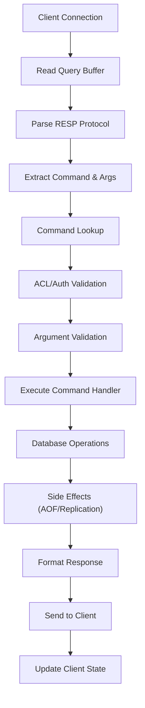
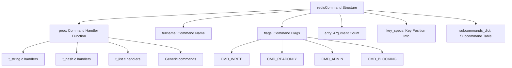
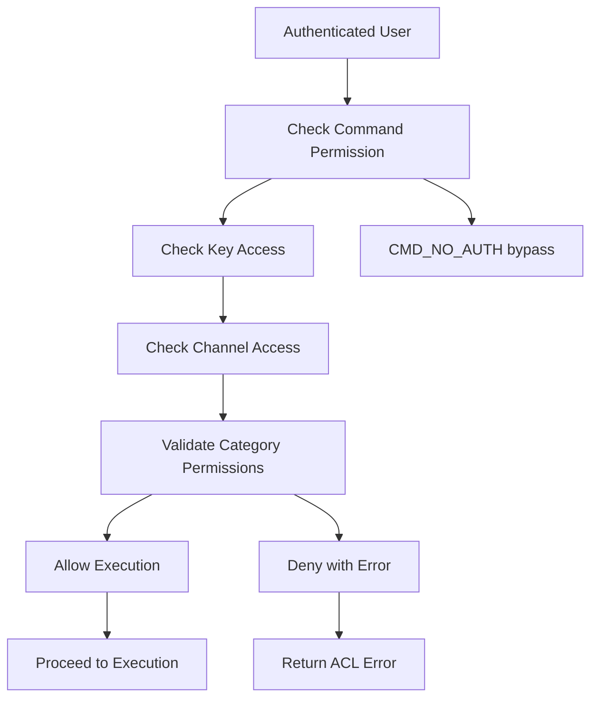
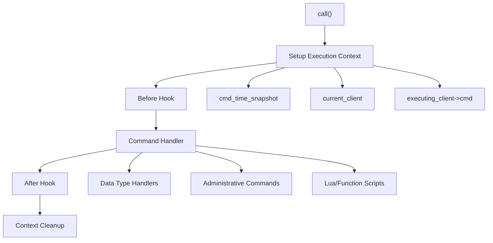
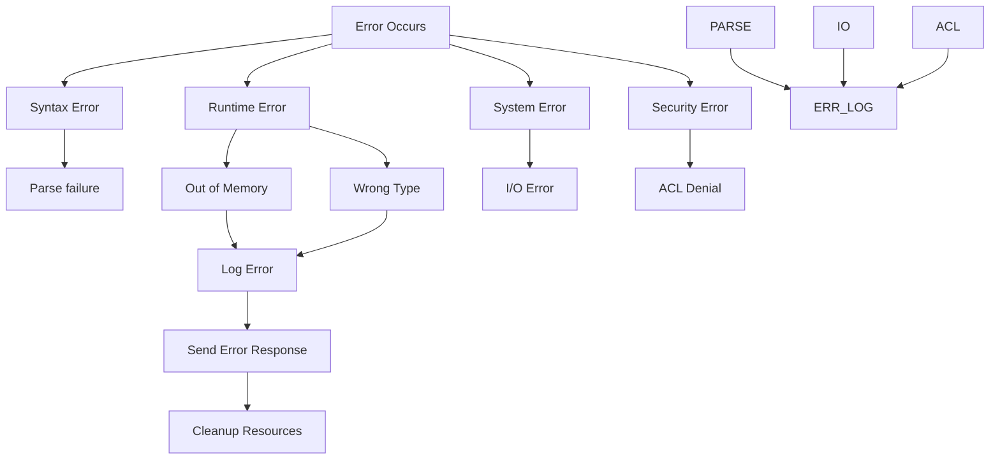
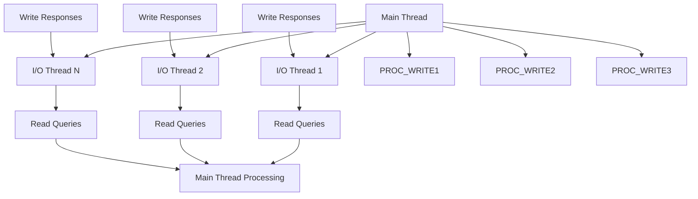

# Command Processing Pipeline

Relevant source files

-   [redis.conf](https://github.com/redis/redis/blob/8ad54215/redis.conf)
-   [src/aof.c](https://github.com/redis/redis/blob/8ad54215/src/aof.c)
-   [src/config.c](https://github.com/redis/redis/blob/8ad54215/src/config.c)
-   [src/db.c](https://github.com/redis/redis/blob/8ad54215/src/db.c)
-   [src/debug.c](https://github.com/redis/redis/blob/8ad54215/src/debug.c)
-   [src/module.c](https://github.com/redis/redis/blob/8ad54215/src/module.c)
-   [src/networking.c](https://github.com/redis/redis/blob/8ad54215/src/networking.c)
-   [src/object.c](https://github.com/redis/redis/blob/8ad54215/src/object.c)
-   [src/rdb.c](https://github.com/redis/redis/blob/8ad54215/src/rdb.c)
-   [src/replication.c](https://github.com/redis/redis/blob/8ad54215/src/replication.c)
-   [src/server.c](https://github.com/redis/redis/blob/8ad54215/src/server.c)
-   [src/server.h](https://github.com/redis/redis/blob/8ad54215/src/server.h)
-   [tests/unit/introspection.tcl](https://github.com/redis/redis/blob/8ad54215/tests/unit/introspection.tcl)

This document describes Redis's command processing pipeline, covering how client commands are received, parsed, validated, executed, and responded to. This encompasses the core request-response cycle that handles all Redis operations from simple key-value operations to complex transactions and scripts.

For information about client connection management and network I/O, see [Client Connection Management](/redis/redis/2.2-client-connection-management). For details about database operations and data storage, see [Data Storage and Management](/redis/redis/3-data-storage-and-management).

## Overview

The command processing pipeline is the central nervous system of Redis, responsible for transforming client requests into database operations and returning appropriate responses. The pipeline consists of several sequential stages that each command must pass through, with various validation and processing steps at each stage.

### High-Level Pipeline Flow

Sources: [src/networking.c1-7000](https://github.com/redis/redis/blob/8ad54215/src/networking.c#L1-L7000) [src/server.c1-6000](https://github.com/redis/redis/blob/8ad54215/src/server.c#L1-L6000) [src/server.h1-3000](https://github.com/redis/redis/blob/8ad54215/src/server.h#L1-L3000)

## Protocol Processing and Command Parsing

The command processing begins when data arrives from a client connection. Redis uses the RESP (Redis Serialization Protocol) for communication.

### Query Buffer Management

Each client maintains a query buffer (`querybuf`) that accumulates incoming data. The networking layer manages buffer allocation, reallocation, and cleanup based on usage patterns.

> **[Mermaid sequence]**
> *(图表结构无法解析)*

The system handles both inline and multibulk (array) RESP formats, with different parsing logic for each:

-   **Inline Format**: Simple string commands like `PING` or `INFO`
-   **Multibulk Format**: Array-based commands like `SET key value`

Sources: [src/networking.c1500-2000](https://github.com/redis/redis/blob/8ad54215/src/networking.c#L1500-L2000) [src/networking.c2500-3000](https://github.com/redis/redis/blob/8ad54215/src/networking.c#L2500-L3000)

### Command Structure and Lookup

Commands are represented by the `redisCommand` structure, which contains metadata about each command including its handler function, arity, flags, and key specifications.

The command lookup process involves:

1.  Extracting the command name from parsed arguments
2.  Case-insensitive lookup in the global command table
3.  Handling of command aliases and subcommands
4.  Caching frequently used commands for performance

Sources: [src/server.h2800-3000](https://github.com/redis/redis/blob/8ad54215/src/server.h#L2800-L3000) [src/server.c2000-2500](https://github.com/redis/redis/blob/8ad54215/src/server.c#L2000-L2500)

## Command Validation and Security

Before execution, commands undergo several validation steps to ensure security, correctness, and system stability.

### Authentication and Authorization

The ACL (Access Control List) system validates that the authenticated user has permission to execute the requested command:

### Argument and State Validation

Commands are validated for:

-   **Arity Check**: Correct number of arguments based on command specification
-   **Key Validation**: Key names and patterns according to command requirements
-   **State Validation**: Server state compatibility (e.g., cluster mode, replication state)
-   **Memory Limits**: OOM conditions for write commands when `maxmemory` is exceeded

Sources: [src/acl.c1-1000](https://github.com/redis/redis/blob/8ad54215/src/acl.c#L1-L1000) [src/server.c3500-4000](https://github.com/redis/redis/blob/8ad54215/src/server.c#L3500-L4000)

## Command Execution Framework

The core execution framework routes validated commands to their appropriate handlers and manages the execution context.

### Execution Context and Call Stack

The `call()` function in [src/server.c3800-4200](https://github.com/redis/redis/blob/8ad54215/src/server.c#L3800-L4200) is the central execution dispatcher. It manages:

### Command Handler Types

Redis commands are implemented in several categories:

| Handler Type | Location | Examples | Purpose |
| --- | --- | --- | --- |
| Data Type Commands | `t_*.c` files | `GET`, `SET`, `HGET` | Core data structure operations |
| Administrative | `server.c` | `INFO`, `CONFIG`, `CLIENT` | Server management |
| Scripting | `script.c`, `functions.c` | `EVAL`, `FCALL` | Script execution |
| Cluster | `cluster.c` | `CLUSTER INFO` | Cluster management |
| Module Commands | `module.c` | Module-defined | Extension commands |

Sources: [src/server.c3800-4200](https://github.com/redis/redis/blob/8ad54215/src/server.c#L3800-L4200) [src/t\_string.c1-500](https://github.com/redis/redis/blob/8ad54215/src/t_string.c#L1-L500) [src/t\_hash.c1-500](https://github.com/redis/redis/blob/8ad54215/src/t_hash.c#L1-L500)

## Response Generation and Output

After command execution, Redis formats and sends responses back to clients using the RESP protocol.

### Response Building Pipeline

> **[Mermaid sequence]**
> *(图表结构无法解析)*

The response system includes:

-   **Static Buffer**: Fast path for small responses in `c->buf`
-   **Reply List**: Linked list of response chunks for larger responses
-   **Buffer Management**: Automatic resizing and memory limit enforcement
-   **Deferred Responses**: Support for commands that complete asynchronously

### Response Types and Formatting

Redis supports multiple RESP response types:

| Type | Format | Example | Use Case |
| --- | --- | --- | --- |
| Simple String | `+OK\r\n` | Command success | Status responses |
| Error | `-ERR message\r\n` | Command failure | Error conditions |
| Integer | `:123\r\n` | Numeric values | Counters, lengths |
| Bulk String | `$6\r\nfoobar\r\n` | Binary data | Key/value content |
| Array | `*2\r\n$3\r\nfoo\r\n$3\r\nbar\r\n` | Multiple values | List responses |

Sources: [src/networking.c4000-5000](https://github.com/redis/redis/blob/8ad54215/src/networking.c#L4000-L5000) [src/networking.c500-1000](https://github.com/redis/redis/blob/8ad54215/src/networking.c#L500-L1000)

## Error Handling and Recovery

The command processing pipeline includes comprehensive error handling to maintain system stability and provide meaningful feedback to clients.

### Error Categories and Handling

### Error Propagation and Logging

Errors are handled at multiple levels:

-   **Protocol Level**: Malformed RESP data
-   **Command Level**: Invalid arguments or state
-   **Database Level**: Data type mismatches or constraints
-   **System Level**: Memory, I/O, or resource exhaustion

Sources: [src/networking.c5500-6000](https://github.com/redis/redis/blob/8ad54215/src/networking.c#L5500-L6000) [src/server.c4500-5000](https://github.com/redis/redis/blob/8ad54215/src/server.c#L4500-L5000)

## Threading and Concurrency

Redis's command processing pipeline supports both single-threaded and multi-threaded execution models depending on configuration.

### I/O Threading Model

When I/O threads are enabled:

-   I/O threads handle reading client queries and writing responses
-   The main thread performs all command processing and database operations
-   Synchronization occurs at specific points in the pipeline
-   Client state is carefully managed across thread boundaries

Sources: [src/networking.c7000-8000](https://github.com/redis/redis/blob/8ad54215/src/networking.c#L7000-L8000) [src/server.c1000-1500](https://github.com/redis/redis/blob/8ad54215/src/server.c#L1000-L1500)

The command processing pipeline forms the foundation of Redis's performance and functionality, efficiently transforming client requests into database operations while maintaining data consistency, security, and system reliability.
