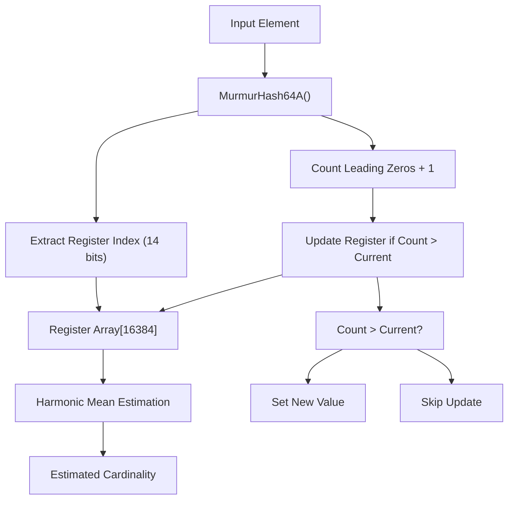
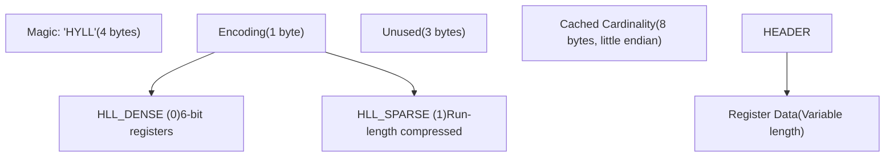
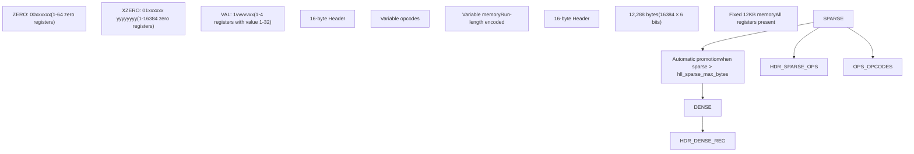
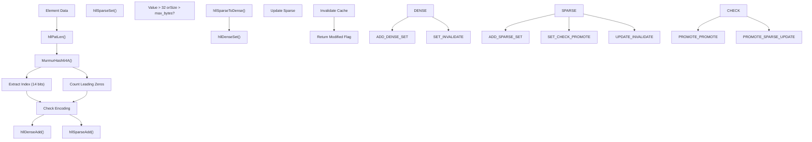
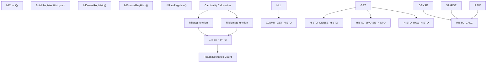
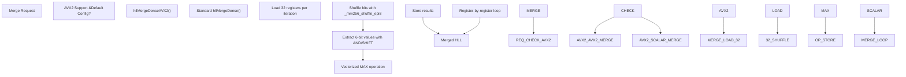
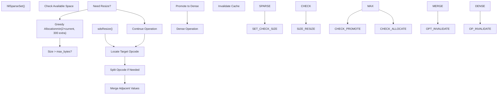

# HyperLogLog

Relevant source files

-   [src/commands/pfmerge.json](https://github.com/redis/redis/blob/8ad54215/src/commands/pfmerge.json)
-   [src/hyperloglog.c](https://github.com/redis/redis/blob/8ad54215/src/hyperloglog.c)
-   [tests/unit/hyperloglog.tcl](https://github.com/redis/redis/blob/8ad54215/tests/unit/hyperloglog.tcl)
-   [utils/generate-module-api-doc.rb](https://github.com/redis/redis/blob/8ad54215/utils/generate-module-api-doc.rb)

This document covers Redis's HyperLogLog implementation, a probabilistic data structure for cardinality estimation. HyperLogLog allows efficient estimation of the number of unique elements in large datasets using constant memory (12KB) regardless of the actual cardinality. Redis uses two representations - sparse for memory efficiency with low cardinalities and dense for higher cardinalities.

For information about other probabilistic data structures, see the main data types implementation in [Core Data Types Implementation](/redis/redis/3.1-core-data-types-implementation).

## Algorithm Overview

Redis implements the HyperLogLog algorithm using a 64-bit hash function with 16,384 6-bit registers, providing high accuracy for cardinality estimation up to billions of unique elements.

**HyperLogLog Algorithm Flow**

The algorithm uses the `MurmurHash64A` hash function to process elements, extracts a register index from the first 14 bits, and counts leading zeros in the remaining 50 bits. Each register stores the maximum leading zero count seen for elements that hash to that register.

Sources: [src/hyperloglog.c29-47](https://github.com/redis/redis/blob/8ad54215/src/hyperloglog.c#L29-L47) [src/hyperloglog.c451-472](https://github.com/redis/redis/blob/8ad54215/src/hyperloglog.c#L451-L472) [src/hyperloglog.c1042-1077](https://github.com/redis/redis/blob/8ad54215/src/hyperloglog.c#L1042-L1077)

## Data Structures and Representations

### HLL Header Structure

**HLL Data Structure Layout**

The `struct hllhdr` defines the common header format used by both representations. The cached cardinality uses the MSB as an invalidation flag.

Sources: [src/hyperloglog.c57-79](https://github.com/redis/redis/blob/8ad54215/src/hyperloglog.c#L57-L79) [src/hyperloglog.c174-180](https://github.com/redis/redis/blob/8ad54215/src/hyperloglog.c#L174-L180) [src/hyperloglog.c182-184](https://github.com/redis/redis/blob/8ad54215/src/hyperloglog.c#L182-L184)

### Dense vs Sparse Representations

**Dense and Sparse Representation Comparison**

Redis automatically promotes from sparse to dense representation when the sparse representation exceeds `server.hll_sparse_max_bytes` or when a register value exceeds 32.

Sources: [src/hyperloglog.c48-172](https://github.com/redis/redis/blob/8ad54215/src/hyperloglog.c#L48-L172) [src/hyperloglog.c577-642](https://github.com/redis/redis/blob/8ad54215/src/hyperloglog.c#L577-L642) [src/hyperloglog.c659-911](https://github.com/redis/redis/blob/8ad54215/src/hyperloglog.c#L659-L911)

## Core Operations

### Element Addition Process

**Element Addition Flow**

The `hllAdd` function routes to either dense or sparse implementations based on the current encoding, with automatic promotion when necessary.

Sources: [src/hyperloglog.c1079-1087](https://github.com/redis/redis/blob/8ad54215/src/hyperloglog.c#L1079-L1087) [src/hyperloglog.c486-509](https://github.com/redis/redis/blob/8ad54215/src/hyperloglog.c#L486-L509) [src/hyperloglog.c913-924](https://github.com/redis/redis/blob/8ad54215/src/hyperloglog.c#L913-L924)

### Cardinality Estimation

**Cardinality Estimation Process**

The estimation uses an improved algorithm based on Otmar Ertl's "New cardinality estimation algorithms for HyperLogLog sketches" with tau and sigma correction functions.

Sources: [src/hyperloglog.c1042-1077](https://github.com/redis/redis/blob/8ad54215/src/hyperloglog.c#L1042-L1077) [src/hyperloglog.c997-1029](https://github.com/redis/redis/blob/8ad54215/src/hyperloglog.c#L997-L1029) [src/hyperloglog.c512-567](https://github.com/redis/redis/blob/8ad54215/src/hyperloglog.c#L512-L567)

## Commands and API

### Redis HyperLogLog Commands

| Command | Function | Purpose |
| --- | --- | --- |
| `PFADD` | `pfaddCommand` | Add elements to HyperLogLog |
| `PFCOUNT` | `pfcountCommand` | Get cardinality estimate |
| `PFMERGE` | `pfmergeCommand` | Merge multiple HyperLogLogs |
| `PFDEBUG` | `pfdebugCommand` | Debug operations |

```mermaid
flowchart TD
    CLIENT["Redis Client"]
    CMD_PARSE["Command Parser"]
    PFADD["PFADD key elements..."]
    PFCOUNT["PFCOUNT key [key ...]"]
    PFMERGE["PFMERGE destkey sourcekey [sourcekey ...]"]
    ADD_VALIDATE["Validate HLL Object"]
    ADD_ELEMENTS["Add Each Element"]
    HLL_ADD["hllAdd()"]
    COUNT_VALIDATE["Validate HLL Objects"]
    MULTI_COUNT["Multiple Keys?"]
    MERGE_TEMP["Merge to Temporary"]
    SINGLE_COUNT["hllCount()"]
    MERGE_VALIDATE["Validate Objects"]
    HLL_MERGE["hllMerge()"]
    REPLY["Reply to Client"]

    CLIENT --> CMD_PARSE
    CMD --> PARSE_PFADD
    CMD --> PARSE_PFCOUNT
    CMD --> PARSE_PFMERGE
    PFADD --> ADD_VALIDATE
    ADD --> VALIDATE_ADD_ELEMENTS
    ADD --> ELEMENTS_HLL_ADD
    PFCOUNT --> COUNT_VALIDATE
    COUNT --> VALIDATE_MULTI_COUNT
    MULTI --> COUNT_MERGE_TEMP
    MULTI --> COUNT_SINGLE_COUNT
    MERGE --> TEMP_SINGLE_COUNT
    PFMERGE --> MERGE_VALIDATE
    MERGE --> VALIDATE_HLL_MERGE
    HLL --> ADD_REPLY
    SINGLE --> COUNT_REPLY
    HLL --> MERGE_REPLY
```

**Command Processing Flow**

Commands validate HLL objects using `isHLLObjectOrReply()` before performing operations. Multi-key `PFCOUNT` creates a temporary merged representation for estimation.

Sources: [src/hyperloglog.c1461-1525](https://github.com/redis/redis/blob/8ad54215/src/hyperloglog.c#L1461-L1525) [src/hyperloglog.c1527-1622](https://github.com/redis/redis/blob/8ad54215/src/hyperloglog.c#L1527-L1622) [src/hyperloglog.c1624-1720](https://github.com/redis/redis/blob/8ad54215/src/hyperloglog.c#L1624-L1720)

## Memory Management and Optimization

### AVX2 SIMD Optimization

**AVX2 SIMD Optimization for Dense Merging**

The implementation includes AVX2-optimized dense merging that processes 32 registers per iteration, significantly improving performance for `PFMERGE` operations on dense HyperLogLogs.

Sources: [src/hyperloglog.c1089-1193](https://github.com/redis/redis/blob/8ad54215/src/hyperloglog.c#L1089-L1193) [src/hyperloglog.c1195-1213](https://github.com/redis/redis/blob/8ad54215/src/hyperloglog.c#L1195-L1213)

### Sparse Representation Management

**Sparse Representation Memory Management**

The sparse implementation uses greedy allocation to minimize reallocations and includes opcode merging optimization to maintain compact representation.

Sources: [src/hyperloglog.c678-684](https://github.com/redis/redis/blob/8ad54215/src/hyperloglog.c#L678-L684) [src/hyperloglog.c792-852](https://github.com/redis/redis/blob/8ad54215/src/hyperloglog.c#L792-L852) [src/hyperloglog.c855-891](https://github.com/redis/redis/blob/8ad54215/src/hyperloglog.c#L855-L891)
