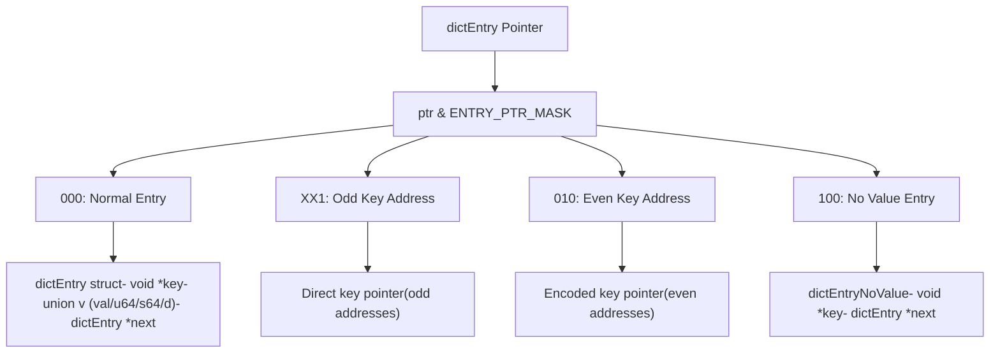
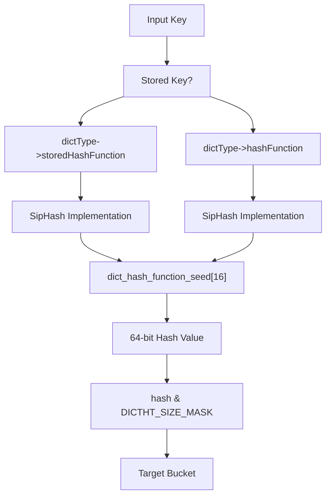
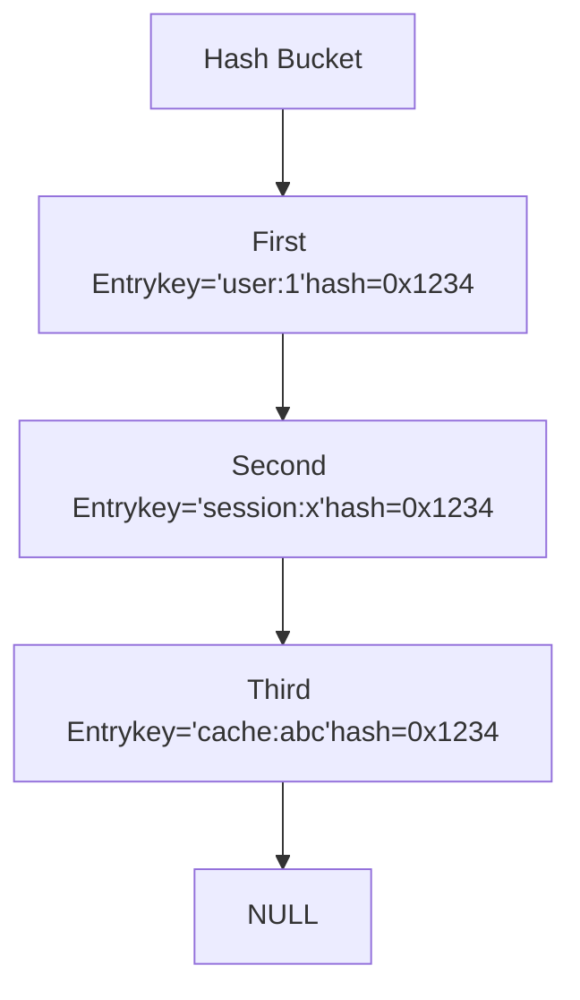
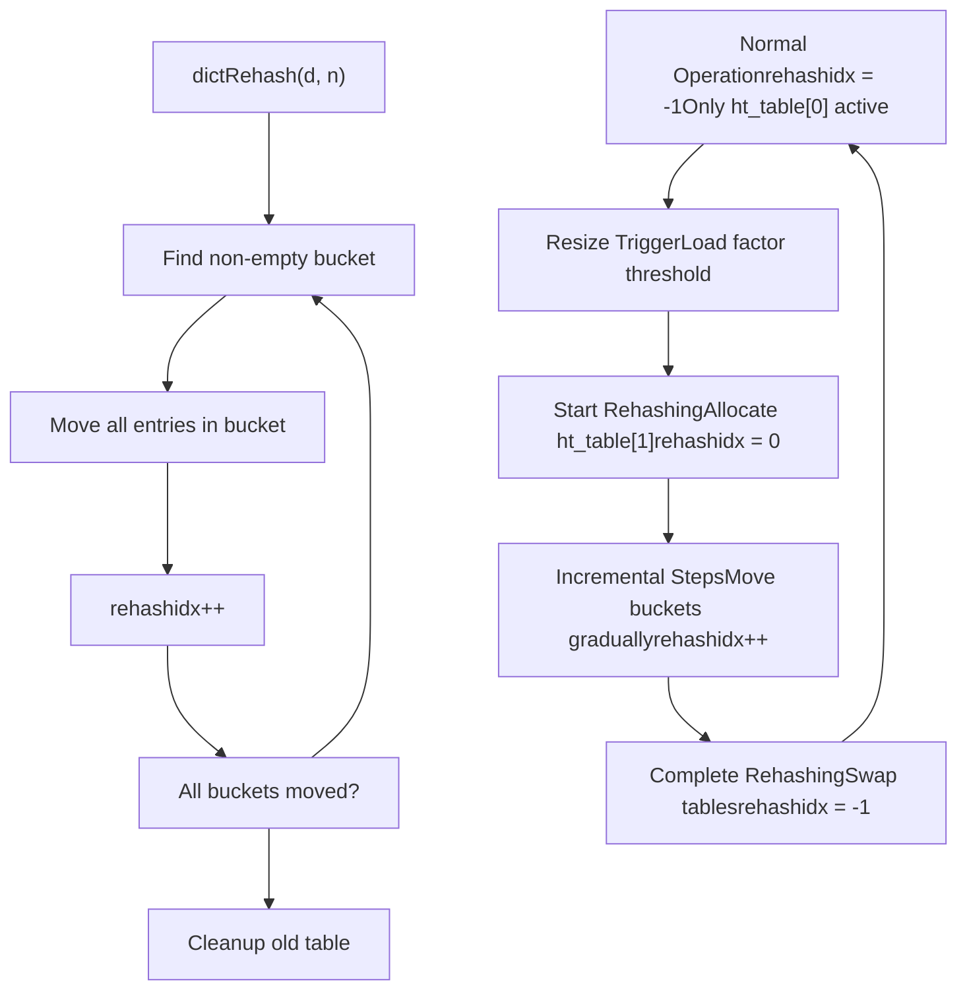
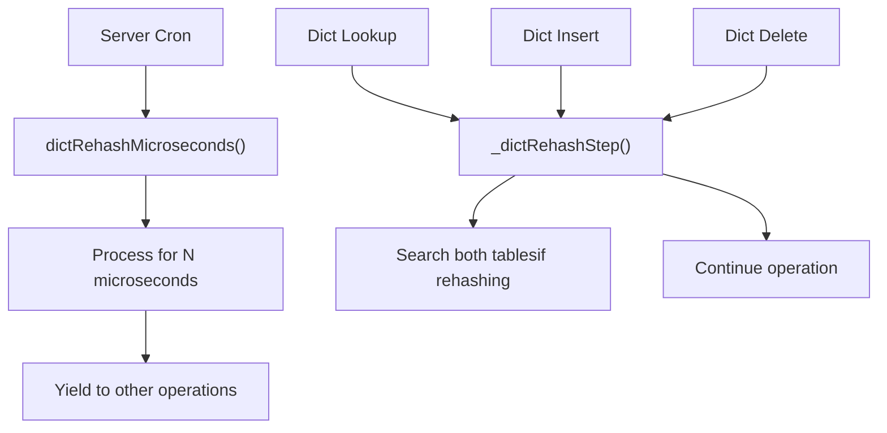
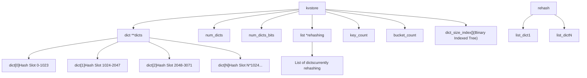
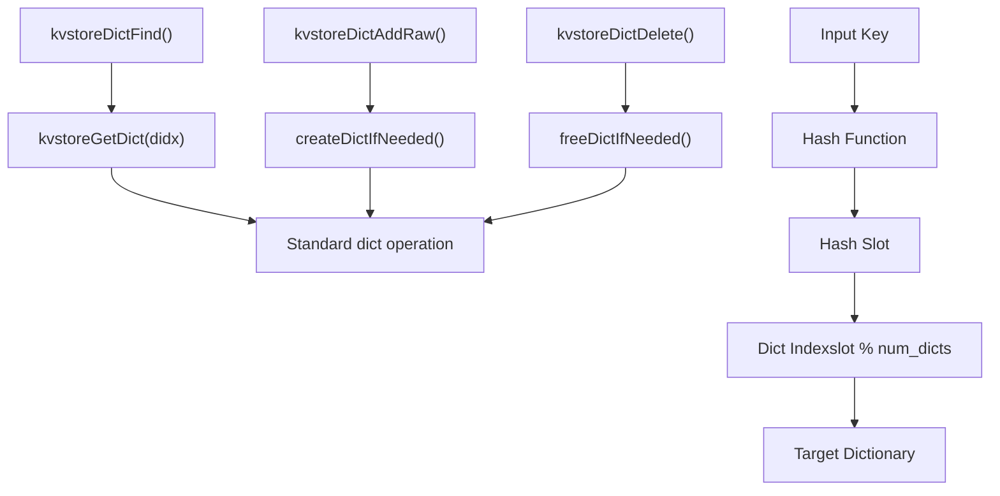
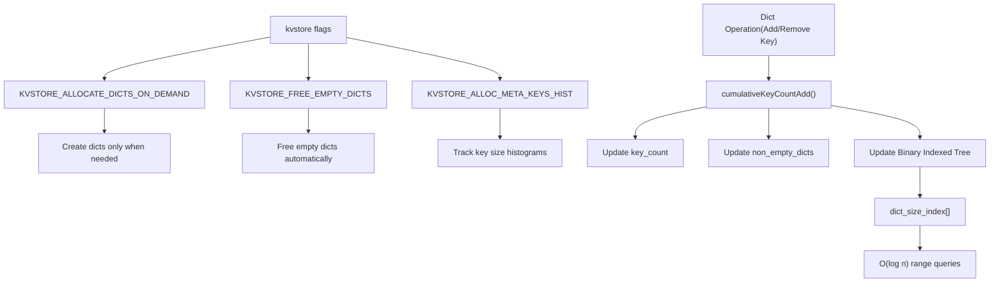
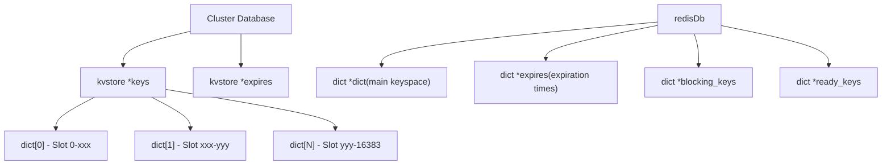

# Dictionary and Key-Value Store

Relevant source files

-   [src/defrag.c](https://github.com/redis/redis/blob/8ad54215/src/defrag.c)
-   [src/dict.c](https://github.com/redis/redis/blob/8ad54215/src/dict.c)
-   [src/dict.h](https://github.com/redis/redis/blob/8ad54215/src/dict.h)
-   [src/iothread.c](https://github.com/redis/redis/blob/8ad54215/src/iothread.c)
-   [src/kvstore.c](https://github.com/redis/redis/blob/8ad54215/src/kvstore.c)
-   [src/kvstore.h](https://github.com/redis/redis/blob/8ad54215/src/kvstore.h)
-   [tests/unit/info-keysizes.tcl](https://github.com/redis/redis/blob/8ad54215/tests/unit/info-keysizes.tcl)
-   [tests/unit/info.tcl](https://github.com/redis/redis/blob/8ad54215/tests/unit/info.tcl)
-   [tests/unit/memefficiency.tcl](https://github.com/redis/redis/blob/8ad54215/tests/unit/memefficiency.tcl)
-   [tests/unit/networking.tcl](https://github.com/redis/redis/blob/8ad54215/tests/unit/networking.tcl)
-   [tests/unit/obuf-limits.tcl](https://github.com/redis/redis/blob/8ad54215/tests/unit/obuf-limits.tcl)
-   [tests/unit/shutdown.tcl](https://github.com/redis/redis/blob/8ad54215/tests/unit/shutdown.tcl)

This document covers Redis's core dictionary (hash table) implementation and the key-value store layer that manages collections of dictionaries. The dictionary serves as the fundamental data structure for storing key-value pairs in Redis, while the kvstore provides higher-level abstractions for managing multiple dictionaries, particularly in cluster configurations.

The dictionary implementation includes incremental rehashing, active defragmentation, and memory-efficient entry storage optimizations. The kvstore layer extends this with statistics tracking, coordinated rehashing across multiple dictionaries, and support for both standalone and clustered Redis deployments.

## Dictionary Architecture

Redis implements hash tables through the `dict` structure defined in [src/dict.h122-137](https://github.com/redis/redis/blob/8ad54215/src/dict.h#L122-L137) The core design uses separate chaining for collision resolution with power-of-two sized hash tables that support incremental rehashing.

### Core Dictionary Structure

```mermaid
flowchart TD
    dict["dict"]
    type["dictType *type"]
    ht_table0["dictEntry **ht_table[0]"]
    ht_table1["dictEntry **ht_table[1]"]
    ht_used0["ht_used[0]"]
    ht_used1["ht_used[1]"]
    ht_size_exp0["ht_size_exp[0]"]
    ht_size_exp1["ht_size_exp[1]"]
    rehashidx["rehashidx"]
    bucket0["Bucket 0"]
    bucket1["Bucket 1"]
    bucketN["Bucket N"]
    entry1["dictEntry"]
    entry2["dictEntry"]
    entry3["dictEntry"]
    newbucket0["New Bucket 0"]
    newbucket1["New Bucket 1"]
    newbucketM["New Bucket M"]
    hashFunction["hashFunction"]
    keyCompare["keyCompare"]
    keyDup["keyDup"]
    valDup["valDup"]
    keyDestructor["keyDestructor"]
    valDestructor["valDestructor"]

    dict --> type
    dict --> ht_table0
    dict --> ht_table1
    dict --> ht_used0
    dict --> ht_used1
    dict --> ht_size_exp0
    dict --> ht_size_exp1
    dict --> rehashidx
    ht --> table0_bucket0
    ht --> table0_bucket1
    ht --> table0_bucketN
    bucket0 --> entry1
    entry1 --> entry2
    entry2 --> entry3
    ht --> table1_newbucket0
    ht --> table1_newbucket1
    ht --> table1_newbucketM
    type --> hashFunction
    type --> keyCompare
    type --> keyDup
    type --> valDup
    type --> keyDestructor
    type --> valDestructor
```

Sources: [src/dict.h122-137](https://github.com/redis/redis/blob/8ad54215/src/dict.h#L122-L137) [src/dict.c48-57](https://github.com/redis/redis/blob/8ad54215/src/dict.c#L48-L57)

The dictionary maintains two hash tables to enable incremental rehashing. During normal operation, only `ht_table[0]` is used. When resizing is needed, `ht_table[1]` is allocated and entries are gradually moved from the old table to the new one.

### Dictionary Entry Types

Redis optimizes memory usage through different entry types using pointer bit manipulation:

Sources: [src/dict.c128-179](https://github.com/redis/redis/blob/8ad54215/src/dict.c#L128-L179) [src/dict.c142-150](https://github.com/redis/redis/blob/8ad54215/src/dict.c#L142-L150)

This optimization allows dictionaries configured with `no_value=1` (like sets) to store keys directly in hash table buckets when there's only one key, avoiding allocation overhead.

## Hash Functions and Collision Resolution

### Primary Hash Function

Redis uses SipHash as the default hash function for security and distribution quality:

Sources: [src/dict.c99-104](https://github.com/redis/redis/blob/8ad54215/src/dict.c#L99-L104) [src/dict.c117-126](https://github.com/redis/redis/blob/8ad54215/src/dict.c#L117-L126)

### Collision Resolution

Collisions are handled through separate chaining, where each bucket contains a linked list of entries:

Sources: [src/dict.c48-57](https://github.com/redis/redis/blob/8ad54215/src/dict.c#L48-L57)

## Incremental Rehashing

Redis implements incremental rehashing to avoid blocking during hash table expansion or contraction:

### Rehashing Process

Sources: [src/dict.c400-429](https://github.com/redis/redis/blob/8ad54215/src/dict.c#L400-L429) [src/dict.c329-372](https://github.com/redis/redis/blob/8ad54215/src/dict.c#L329-L372)

### Rehashing Integration

The rehashing process is integrated into normal dictionary operations:

Sources: [src/dict.c463-465](https://github.com/redis/redis/blob/8ad54215/src/dict.c#L463-L465) [src/dict.c441-453](https://github.com/redis/redis/blob/8ad54215/src/dict.c#L441-L453)

## KVStore Layer

The `kvstore` provides a higher-level abstraction that manages multiple dictionaries, primarily used in Redis cluster mode where different hash slots require separate dictionaries.

### KVStore Architecture

Sources: [src/kvstore.c37-52](https://github.com/redis/redis/blob/8ad54215/src/kvstore.c#L37-L52) [src/kvstore.c255-301](https://github.com/redis/redis/blob/8ad54215/src/kvstore.c#L255-L301)

### Dictionary Selection and Operations

Sources: [src/kvstore.c86-88](https://github.com/redis/redis/blob/8ad54215/src/kvstore.c#L86-L88) [src/kvstore.c164-171](https://github.com/redis/redis/blob/8ad54215/src/kvstore.c#L164-L171) [src/kvstore.c180-189](https://github.com/redis/redis/blob/8ad54215/src/kvstore.c#L180-L189)

### Statistics and Memory Management

The kvstore maintains aggregate statistics across all dictionaries using a Binary Indexed Tree (Fenwick Tree) for efficient range queries:

Sources: [src/kvstore.c138-161](https://github.com/redis/redis/blob/8ad54215/src/kvstore.c#L138-L161) [src/kvstore.c180-189](https://github.com/redis/redis/blob/8ad54215/src/kvstore.c#L180-L189) [src/kvstore.c255-301](https://github.com/redis/redis/blob/8ad54215/src/kvstore.c#L255-L301)

## Integration with Redis Core

### Dictionary Types in Redis

Redis uses different `dictType` configurations for various purposes:

| Dictionary Type | Key Type | Value Type | Use Case |
| --- | --- | --- | --- |
| `dbDictType` | `robj*` | `robj*` | Main database |
| `setDictType` | `sds` | `NULL` | Set data type |
| `zsetDictType` | `sds` | `double*` | Sorted set scores |
| `hashDictType` | `hfield` | `sds` | Hash fields |
| `pubsubDictType` | `sds` | `list*` | Pub/Sub channels |

Sources: Referenced in various data type implementations

### Database Integration

Sources: Referenced in database and cluster implementations

The dictionary and kvstore systems form the backbone of Redis's data storage, providing efficient hash table operations with memory optimization, incremental rehashing, and support for both single-instance and clustered deployments.

Sources: [src/dict.c](https://github.com/redis/redis/blob/8ad54215/src/dict.c) [src/dict.h](https://github.com/redis/redis/blob/8ad54215/src/dict.h) [src/kvstore.c](https://github.com/redis/redis/blob/8ad54215/src/kvstore.c) [src/kvstore.h](https://github.com/redis/redis/blob/8ad54215/src/kvstore.h)
