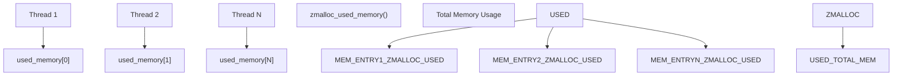
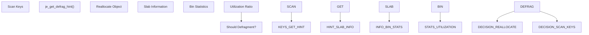

# Memory Allocators and Build System

Relevant source files

-   [deps/jemalloc/include/jemalloc/internal/jemalloc\_internal\_externs.h](https://github.com/redis/redis/blob/8ad54215/deps/jemalloc/include/jemalloc/internal/jemalloc_internal_externs.h)
-   [deps/jemalloc/include/jemalloc/internal/jemalloc\_internal\_inlines\_c.h](https://github.com/redis/redis/blob/8ad54215/deps/jemalloc/include/jemalloc/internal/jemalloc_internal_inlines_c.h)
-   [deps/jemalloc/include/jemalloc/jemalloc\_macros.h.in](https://github.com/redis/redis/blob/8ad54215/deps/jemalloc/include/jemalloc/jemalloc_macros.h.in)
-   [deps/jemalloc/src/jemalloc.c](https://github.com/redis/redis/blob/8ad54215/deps/jemalloc/src/jemalloc.c)
-   [deps/jemalloc/src/jemalloc\_cpp.cpp](https://github.com/redis/redis/blob/8ad54215/deps/jemalloc/src/jemalloc_cpp.cpp)
-   [src/Makefile](https://github.com/redis/redis/blob/8ad54215/src/Makefile)
-   [src/config.h](https://github.com/redis/redis/blob/8ad54215/src/config.h)
-   [src/zmalloc.c](https://github.com/redis/redis/blob/8ad54215/src/zmalloc.c)
-   [src/zmalloc.h](https://github.com/redis/redis/blob/8ad54215/src/zmalloc.h)

This document covers Redis's memory allocator abstraction layer and the build system's role in selecting and configuring memory allocators. It focuses on the `zmalloc` abstraction that provides a unified interface over different underlying allocators (jemalloc, tcmalloc, libc malloc) and how the build system determines which allocator to use based on platform, configuration, and runtime requirements.

For information about memory eviction policies and TTL management, see [Eviction and Expiration Policies](/redis/redis/4.1-eviction-and-expiration-policies). For broader build system topics including dependency management, see [Build System and Dependencies](/redis/redis/10.1-build-system-and-dependencies).

## Allocator Abstraction Architecture

Redis uses a memory allocator abstraction layer called `zmalloc` that provides a consistent interface regardless of the underlying memory allocator. This abstraction enables Redis to use different allocators while maintaining unified memory tracking and debugging capabilities.

### Allocator Selection Architecture

```mermaid
flowchart TD
    MAKEFILE["Makefile"]
    CONFIG_H["config.h"]
    PLATFORM_DETECT["Platform Detection"]
    ZMALLOC_H["zmalloc.h"]
    ZMALLOC_C["zmalloc.c"]
    MEMORY_TRACKING["Memory Tracking"]
    JEMALLOC["jemalloc"]
    TCMALLOC["tcmalloc"]
    LIBC_MALLOC["libc malloc"]
    REDIS_SERVER["redis-server"]
    DATA_STRUCTURES["Data Structures"]
    PERSISTENCE["Persistence"]

    MAKEFILE --> ZMALLOC_C
    CONFIG --> H_ZMALLOC_H
    PLATFORM --> DETECT_MAKEFILE
    ZMALLOC --> C_JEMALLOC
    ZMALLOC --> C_TCMALLOC
    ZMALLOC --> C_LIBC_MALLOC
    REDIS --> SERVER_ZMALLOC_H
    DATA --> STRUCTURES_ZMALLOC_H
    PERSISTENCE --> ZMALLOC_H
    MEMORY --> TRACKING_ZMALLOC_C
```

Sources: [src/Makefile79-106](https://github.com/redis/redis/blob/8ad54215/src/Makefile#L79-L106) [src/zmalloc.h18-88](https://github.com/redis/redis/blob/8ad54215/src/zmalloc.h#L18-L88) [src/zmalloc.c56-80](https://github.com/redis/redis/blob/8ad54215/src/zmalloc.c#L56-L80)

### Build-Time Allocator Selection

The build system uses a hierarchical approach to determine which memory allocator to use:

```mermaid
flowchart TD
    START["Build Start"]
    PLATFORM_CHECK["Platform Check"]
    JEMALLOC_DEFAULT["MALLOC=jemalloc"]
    LIBC_DEFAULT["MALLOC=libc"]
    ENV_OVERRIDE["Environment Override?"]
    TCMALLOC_SET["MALLOC=tcmalloc"]
    TCMALLOC_MIN["MALLOC=tcmalloc_minimal"]
    JEMALLOC_SET["MALLOC=jemalloc"]
    LIBC_SET["MALLOC=libc"]
    SANITIZER_CHECK["Sanitizer enabled?"]
    FINAL_CONFIG["Final Configuration"]
    FORCE_LIBC["MALLOC=libc (forced)"]
    COMPILE_FLAGS["Set Compiler Flags"]

    START --> PLATFORM_CHECK
    PLATFORM --> CHECK_JEMALLOC_DEFAULT
    PLATFORM --> CHECK_LIBC_DEFAULT
    JEMALLOC --> DEFAULT_ENV_OVERRIDE
    LIBC --> DEFAULT_ENV_OVERRIDE
    ENV --> OVERRIDE_TCMALLOC_SET
    ENV --> OVERRIDE_TCMALLOC_MIN
    ENV --> OVERRIDE_JEMALLOC_SET
    ENV --> OVERRIDE_LIBC_SET
    ENV --> OVERRIDE_SANITIZER_CHECK
    TCMALLOC --> SET_FINAL_CONFIG
    TCMALLOC --> MIN_FINAL_CONFIG
    JEMALLOC --> SET_FINAL_CONFIG
    LIBC --> SET_FINAL_CONFIG
    SANITIZER --> CHECK_FORCE_LIBC
    SANITIZER --> CHECK_FINAL_CONFIG
    FORCE --> LIBC_FINAL_CONFIG
    FINAL --> CONFIG_COMPILE_FLAGS
```

Sources: [src/Makefile79-138](https://github.com/redis/redis/blob/8ad54215/src/Makefile#L79-L138)

## Memory Allocator Types and Configuration

Redis supports three main categories of memory allocators, each with different characteristics and use cases:

| Allocator | Macro Definition | Library | Use Case | Memory Tracking |
| --- | --- | --- | --- | --- |
| jemalloc | `USE_JEMALLOC` | `deps/jemalloc/lib/libjemalloc.a` | Production (Linux default) | Native via `je_malloc_usable_size` |
| tcmalloc | `USE_TCMALLOC` | `-ltcmalloc` | Google environments | Native via `tc_malloc_size` |
| tcmalloc\_minimal | `USE_TCMALLOC` | `-ltcmalloc_minimal` | Minimal overhead | Native via `tc_malloc_size` |
| libc | Default | System malloc | Development, sanitizers | Manual via prefix storage |

Sources: [src/Makefile282-296](https://github.com/redis/redis/blob/8ad54215/src/Makefile#L282-L296) [src/zmalloc.h18-74](https://github.com/redis/redis/blob/8ad54215/src/zmalloc.h#L18-L74)

### jemalloc Integration

Redis uses a modified version of jemalloc with Redis-specific enhancements:

```mermaid
flowchart TD
    JE_MALLOC["je_malloc()"]
    TCACHE["Thread Cache"]
    JE_FREE["je_free()"]
    ARENAS["Arenas"]
    DEFRAG_HINT["je_get_defrag_hint()"]
    ALLOC_USIZE["je_*_with_usize()"]
    BG_THREADS["Background Threads"]
    ARENA_STATS["Per-Arena Statistics"]
    ZMALLOC_DEFRAG["Active Defragmentation"]
    ZMALLOC_STATS["Memory Statistics"]
    ZMALLOC_PURGE["Memory Purging"]

    DEFRAG --> HINT_ZMALLOC_DEFRAG
    ALLOC --> USIZE_ZMALLOC_STATS
    BG --> THREADS_ZMALLOC_PURGE
    ARENA --> STATS_ZMALLOC_STATS
    JE --> MALLOC_TCACHE
    JE --> FREE_TCACHE
    TCACHE --> ARENAS
```

Sources: [deps/jemalloc/include/jemalloc/jemalloc\_macros.h.in153-156](https://github.com/redis/redis/blob/8ad54215/deps/jemalloc/include/jemalloc/jemalloc_macros.h.in#L153-L156) [src/zmalloc.c730-944](https://github.com/redis/redis/blob/8ad54215/src/zmalloc.c#L730-L944)

## Runtime Memory Tracking

The `zmalloc` abstraction provides thread-safe memory usage tracking across all supported allocators:

### Thread-Local Memory Accounting

Sources: [src/zmalloc.c82-116](https://github.com/redis/redis/blob/8ad54215/src/zmalloc.c#L82-L116) [src/zmalloc.c503-516](https://github.com/redis/redis/blob/8ad54215/src/zmalloc.c#L503-L516)

### Memory Allocation Flow

The runtime allocation flow varies depending on the underlying allocator but follows a consistent pattern:

```mermaid
flowchart TD
    ALLOC_REQUEST["Allocation Request"]
    SIZE_CHECK["Size >= SIZE_MAX/2?"]
    RETURN_NULL["Return NULL"]
    ALLOCATOR_TYPE["Allocator Type"]
    JE_ALLOC["je_malloc()"]
    TC_ALLOC["tc_malloc()"]
    LIBC_ALLOC["malloc()"]
    JE_SIZE["je_malloc_usable_size()"]
    TC_SIZE["tc_malloc_size()"]
    PREFIX_STORE["Store size in prefix"]
    UPDATE_STATS["update_zmalloc_stat_alloc()"]
    THREAD_INDEX["Get thread index"]
    ATOMIC_INCR["Atomic increment used_memory[]"]
    RETURN_PTR["Return pointer"]

    ALLOC --> REQUEST_SIZE_CHECK
    SIZE --> CHECK_RETURN_NULL
    SIZE --> CHECK_ALLOCATOR_TYPE
    ALLOCATOR --> TYPE_JE_ALLOC
    ALLOCATOR --> TYPE_TC_ALLOC
    ALLOCATOR --> TYPE_LIBC_ALLOC
    JE --> ALLOC_JE_SIZE
    TC --> ALLOC_TC_SIZE
    LIBC --> ALLOC_PREFIX_STORE
    JE --> SIZE_UPDATE_STATS
    TC --> SIZE_UPDATE_STATS
    PREFIX --> STORE_UPDATE_STATS
    UPDATE --> STATS_THREAD_INDEX
    THREAD --> INDEX_ATOMIC_INCR
    ATOMIC --> INCR_RETURN_PTR
```

Sources: [src/zmalloc.c129-154](https://github.com/redis/redis/blob/8ad54215/src/zmalloc.c#L129-L154) [src/zmalloc.c101-109](https://github.com/redis/redis/blob/8ad54215/src/zmalloc.c#L101-L109)

## Build Configuration Options

### Sanitizer Compatibility

Redis automatically forces the use of libc malloc when sanitizers are enabled to avoid conflicts:

| Sanitizer | Configuration | Allocator Override | Additional Flags |
| --- | --- | --- | --- |
| AddressSanitizer | `SANITIZER=address` | `MALLOC=libc` | `-fsanitize=address` |
| UndefinedBehaviorSanitizer | `SANITIZER=undefined` | `MALLOC=libc` | `-fsanitize=undefined` |
| ThreadSanitizer | `SANITIZER=thread` | No override | `-fsanitize=thread` |
| MemorySanitizer | `SANITIZER=memory` | `MALLOC=libc` | `-fsanitize=memory` |

Sources: [src/Makefile107-138](https://github.com/redis/redis/blob/8ad54215/src/Makefile#L107-L138)

### Platform-Specific Optimizations

The build system applies platform-specific optimizations and workarounds:

```mermaid
flowchart TD
    PLATFORM_DETECT["Platform Detection"]
    LINUX_OPT["Linux Optimizations"]
    DARWIN_OPT["macOS Optimizations"]
    BSD_OPT["BSD Optimizations"]
    GENERIC_OPT["Generic Optimizations"]
    PROC_STAT["HAVE_PROC_STAT"]
    EPOLL["HAVE_EPOLL"]
    MSG_NOSIGNAL["HAVE_MSG_NOSIGNAL"]
    TASKINFO["HAVE_TASKINFO"]
    KQUEUE["HAVE_KQUEUE"]
    MALLOC_SIZE["HAVE_MALLOC_SIZE"]
    KQUEUE_BSD["HAVE_KQUEUE"]
    BACKTRACE["HAVE_BACKTRACE"]
    PREFETCH["HAS_BUILTIN_PREFETCH"]
    ATOMIC["HAVE_ATOMIC"]

    PLATFORM --> DETECT_LINUX_OPT
    PLATFORM --> DETECT_DARWIN_OPT
    PLATFORM --> DETECT_BSD_OPT
    PLATFORM --> DETECT_GENERIC_OPT
    LINUX --> OPT_PROC_STAT
    LINUX --> OPT_EPOLL
    LINUX --> OPT_MSG_NOSIGNAL
    DARWIN --> OPT_TASKINFO
    DARWIN --> OPT_KQUEUE
    DARWIN --> OPT_MALLOC_SIZE
    BSD --> OPT_KQUEUE_BSD
    BSD --> OPT_BACKTRACE
    GENERIC --> OPT_PREFETCH
    GENERIC --> OPT_ATOMIC
```

Sources: [src/config.h44-336](https://github.com/redis/redis/blob/8ad54215/src/config.h#L44-L336)

## Advanced Memory Management Features

### Active Defragmentation Support

When using jemalloc, Redis can perform active defragmentation using allocator-specific hints:

Sources: [deps/jemalloc/include/jemalloc/internal/jemalloc\_internal\_inlines\_c.h342-391](https://github.com/redis/redis/blob/8ad54215/deps/jemalloc/include/jemalloc/internal/jemalloc_internal_inlines_c.h#L342-L391) [src/zmalloc.h79-81](https://github.com/redis/redis/blob/8ad54215/src/zmalloc.h#L79-L81)

### Memory Statistics Integration

The allocator abstraction provides detailed memory statistics for monitoring:

| Statistic | jemalloc Source | Purpose |
| --- | --- | --- |
| `allocated` | `stats.allocated` | Total allocated bytes |
| `active` | `stats.active` | Active memory pages |
| `resident` | `stats.resident` | Resident memory (RSS) |
| `retained` | `stats.retained` | Retained virtual memory |
| `muzzy` | `stats.arenas.*.pmuzzy` | Muzzy pages |
| `frag_smallbins_bytes` | Calculated | Small bin fragmentation |

Sources: [src/zmalloc.c799-845](https://github.com/redis/redis/blob/8ad54215/src/zmalloc.c#L799-L845)

This memory allocator abstraction enables Redis to optimize memory usage across different environments while maintaining consistent behavior and comprehensive monitoring capabilities.
