# Redis Module API

Relevant source files

-   [runtest-moduleapi](https://github.com/redis/redis/blob/8ad54215/runtest-moduleapi)
-   [src/redismodule.h](https://github.com/redis/redis/blob/8ad54215/src/redismodule.h)
-   [tests/modules/Makefile](https://github.com/redis/redis/blob/8ad54215/tests/modules/Makefile)
-   [tests/modules/misc.c](https://github.com/redis/redis/blob/8ad54215/tests/modules/misc.c)
-   [tests/unit/moduleapi/misc.tcl](https://github.com/redis/redis/blob/8ad54215/tests/unit/moduleapi/misc.tcl)

The Redis Module API provides a comprehensive interface for extending Redis functionality through dynamically loaded modules. The API is defined in `redismodule.h` and exposes Redis's core capabilities through a structured function interface that enables modules to register commands, manage memory, handle data types, and interact with the Redis server safely.

The API is organized around function pointers that modules obtain through `RedisModule_GetApi()`, providing version-compatible access to Redis internals while maintaining binary compatibility across Redis versions.

## API Structure and Organization

The Redis Module API is organized into a comprehensive function interface defined in `redismodule.h`. The API uses a dynamic function pointer system where modules obtain function addresses through `RedisModule_GetApi()` at initialization time.

### API Function Pointer System

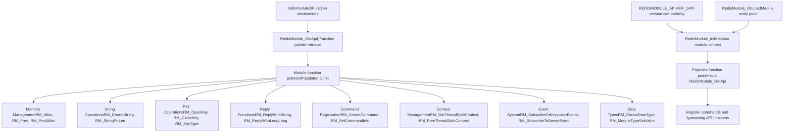
Sources: [src/redismodule.h41-43](https://github.com/redis/redis/blob/8ad54215/src/redismodule.h#L41-L43) [src/redismodule.h888-904](https://github.com/redis/redis/blob/8ad54215/src/redismodule.h#L888-L904) [tests/modules/misc.c551-627](https://github.com/redis/redis/blob/8ad54215/tests/modules/misc.c#L551-L627)

The API provides approximately 300+ functions organized into logical categories. Each module obtains these function pointers during initialization, ensuring version compatibility and allowing Redis to maintain binary compatibility across versions.

## Core API Functions

The Redis Module API is organized into functional categories, each providing specific capabilities for module development. The API uses consistent naming patterns and return value conventions.

### Key API Function Categories

| API Category | Primary Functions | Purpose |
| --- | --- | --- |
| Memory Management | `RedisModule_Alloc`, `RedisModule_Free`, `RedisModule_Calloc`, `RedisModule_TryAlloc`, `RedisModule_PoolAlloc` | Redis-aware memory allocation and pool management |
| String Operations | `RedisModule_CreateString`, `RedisModule_StringPtrLen`, `RedisModule_StringToLongLong`, `RedisModule_StringCompare` | String creation, conversion, and manipulation |
| Key Operations | `RedisModule_OpenKey`, `RedisModule_CloseKey`, `RedisModule_KeyExists`, `RedisModule_KeyType`, `RedisModule_RandomKey` | Database key access, metadata, and operations |
| Reply Functions | `RedisModule_ReplyWithString`, `RedisModule_ReplyWithLongLong`, `RedisModule_ReplyWithArray`, `RedisModule_ReplyWithCallReply` | Client response generation and formatting |
| Command System | `RedisModule_CreateCommand`, `RedisModule_GetCommand`, `RedisModule_SetCommandInfo`, `RedisModule_CreateSubcommand` | Command registration and metadata |
| Context Management | `RedisModule_GetThreadSafeContext`, `RedisModule_FreeThreadSafeContext`, `RedisModule_GetClientId` | Execution context and client information |
| Call Interface | `RedisModule_Call`, `RedisModule_CallReplyType`, `RedisModule_FreeCallReply` | Inter-command execution and reply handling |
| Event System | `RedisModule_SubscribeToKeyspaceEvents`, `RedisModule_SubscribeToServerEvent`, `RedisModule_NotifyKeyspaceEvent` | Event subscription and notification |

Sources: [src/redismodule.h33-100](https://github.com/redis/redis/blob/8ad54215/src/redismodule.h#L33-L100) [src/redismodule.h1000-1100](https://github.com/redis/redis/blob/8ad54215/src/redismodule.h#L1000-L1100) [tests/modules/misc.c60-92](https://github.com/redis/redis/blob/8ad54215/tests/modules/misc.c#L60-L92) [tests/modules/misc.c146-173](https://github.com/redis/redis/blob/8ad54215/tests/modules/misc.c#L146-L173)

### API Return Value Conventions

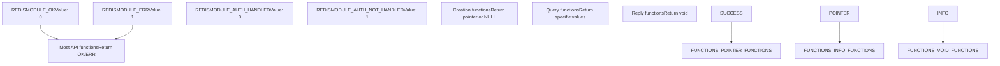
Sources: [src/redismodule.h33-39](https://github.com/redis/redis/blob/8ad54215/src/redismodule.h#L33-L39) [tests/modules/misc.c554-627](https://github.com/redis/redis/blob/8ad54215/tests/modules/misc.c#L554-L627)

Most API functions return `REDISMODULE_OK` (0) on success or `REDISMODULE_ERR` (1) on failure, providing consistent error handling across the API. Functions that create objects typically return pointers or NULL, while query functions return specific data types.

## Function Registration and Callback Patterns

Redis modules register functionality through callback functions that integrate with Redis's command processing and event systems. The API provides several callback types for different integration points.

### Command Function Registration

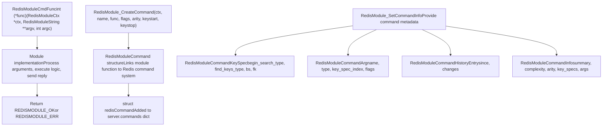
Sources: [src/redismodule.h888-904](https://github.com/redis/redis/blob/8ad54215/src/redismodule.h#L888-L904) [src/redismodule.h380-480](https://github.com/redis/redis/blob/8ad54215/src/redismodule.h#L380-L480) [tests/modules/misc.c551-627](https://github.com/redis/redis/blob/8ad54215/tests/modules/misc.c#L551-L627) [tests/modules/misc.c60-92](https://github.com/redis/redis/blob/8ad54215/tests/modules/misc.c#L60-L92)

Command functions receive a `RedisModuleCtx`, argument array (`RedisModuleString **argv`), and argument count (`int argc`). They must return `REDISMODULE_OK` on success or `REDISMODULE_ERR` on failure.

### Event Callback Registration

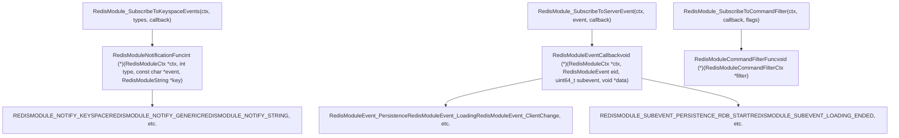
Sources: [src/redismodule.h486-520](https://github.com/redis/redis/blob/8ad54215/src/redismodule.h#L486-L520) [src/redismodule.h547-621](https://github.com/redis/redis/blob/8ad54215/src/redismodule.h#L547-L621) [src/redismodule.h222-245](https://github.com/redis/redis/blob/8ad54215/src/redismodule.h#L222-L245) [tests/modules/misc.c13-20](https://github.com/redis/redis/blob/8ad54215/tests/modules/misc.c#L13-L20)

Event callbacks provide modules with reactive capabilities, allowing them to respond to keyspace changes, server events, and command execution. Each callback type has specific signature requirements and return value expectations.

## Context Management and Execution Environment

The `RedisModuleCtx` structure serves as the primary interface between modules and Redis, providing execution context, resource management, and API access. Understanding context management is crucial for proper module development.

### RedisModuleCtx Structure and Usage

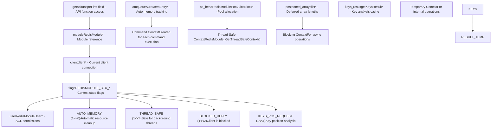
Sources: [src/redismodule.h888](https://github.com/redis/redis/blob/8ad54215/src/redismodule.h#L888-L888) [tests/modules/misc.c352-374](https://github.com/redis/redis/blob/8ad54215/tests/modules/misc.c#L352-L374) [tests/modules/misc.c287-329](https://github.com/redis/redis/blob/8ad54215/tests/modules/misc.c#L287-L329)

The context provides both execution environment and resource management. The `getapifuncptr` field must be first to enable the macro-based API function lookup system used by modules.

### Context Lifecycle and Memory Management

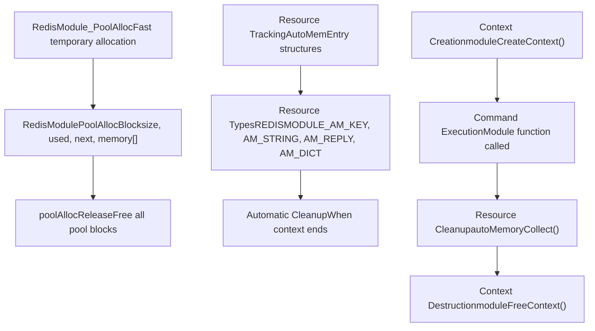
Sources: [tests/modules/misc.c506-525](https://github.com/redis/redis/blob/8ad54215/tests/modules/misc.c#L506-L525) [src/redismodule.h1000-1100](https://github.com/redis/redis/blob/8ad54215/src/redismodule.h#L1000-L1100)

Context management ensures proper resource cleanup through automatic memory tracking and pool allocation systems, preventing memory leaks in module operations.

## Memory Management API

The Redis Module API provides sophisticated memory management capabilities that integrate with Redis's memory tracking and management systems. Understanding the different allocation strategies is essential for building efficient modules.

### Memory Allocation Functions

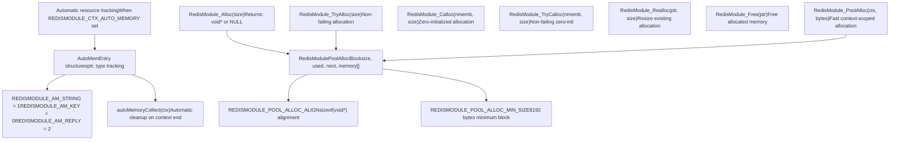
Sources: [src/redismodule.h1000-1100](https://github.com/redis/redis/blob/8ad54215/src/redismodule.h#L1000-L1100) [tests/modules/misc.c506-525](https://github.com/redis/redis/blob/8ad54215/tests/modules/misc.c#L506-L525)

The API provides both standard heap allocation and efficient pool allocation for temporary objects. Pool allocation is particularly useful for command-scoped allocations that are automatically freed when the command completes.

### Memory Management Strategies

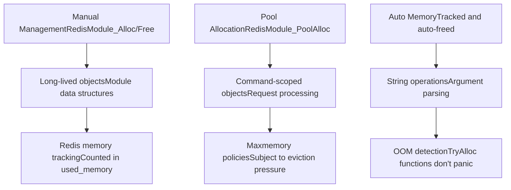
Sources: [tests/modules/misc.c506-525](https://github.com/redis/redis/blob/8ad54215/tests/modules/misc.c#L506-L525) [src/redismodule.h510-590](https://github.com/redis/redis/blob/8ad54215/src/redismodule.h#L510-L590)

Module memory allocations are integrated with Redis's memory management system, contributing to `used_memory` statistics and being subject to maxmemory policies and OOM detection.

## Error Handling and Debugging

The Redis Module API provides comprehensive error handling mechanisms and debugging capabilities to help developers build robust modules.

### Error Reporting and Return Values

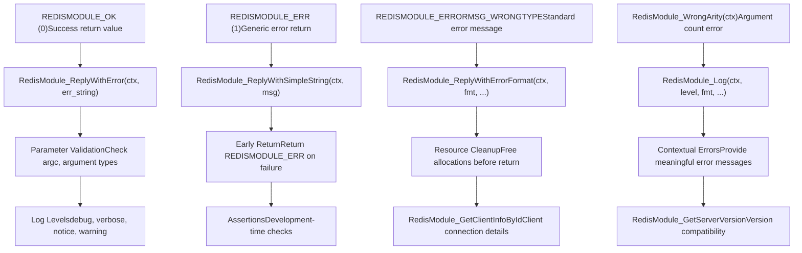
Sources: [src/redismodule.h33-39](https://github.com/redis/redis/blob/8ad54215/src/redismodule.h#L33-L39) [src/redismodule.h251-276](https://github.com/redis/redis/blob/8ad54215/src/redismodule.h#L251-L276) [tests/modules/misc.c22-35](https://github.com/redis/redis/blob/8ad54215/tests/modules/misc.c#L22-L35) [tests/modules/misc.c331-350](https://github.com/redis/redis/blob/8ad54215/tests/modules/misc.c#L331-L350)

Modules should consistently use `REDISMODULE_OK` and `REDISMODULE_ERR` return values, provide meaningful error messages through reply functions, and use logging for debugging purposes.

### Common Error Handling Patterns

```
// Example error handling pattern from misc.c
int test_keyexists(RedisModuleCtx *ctx, RedisModuleString **argv, int argc) {
    if (argc < 2) return RedisModule_WrongArity(ctx);  // Validate arguments

    RedisModuleString *key = argv[1];
    int exists = RedisModule_KeyExists(ctx, key);
    return RedisModule_ReplyWithBool(ctx, exists);      // Always send reply
}

// Error with cleanup pattern
int test_getlru(RedisModuleCtx *ctx, RedisModuleString **argv, int argc) {
    if (argc < 2) {
        RedisModule_WrongArity(ctx);
        return REDISMODULE_OK;  // WrongArity sends reply
    }

    RedisModuleKey *key = open_key_or_reply(ctx, argv[1], REDISMODULE_READ);
    if (!key) return REDISMODULE_OK;  // open_key_or_reply sent error reply

    mstime_t lru;
    RedisModule_GetLRU(key, &lru);
    RedisModule_ReplyWithLongLong(ctx, lru);
    RedisModule_CloseKey(key);  // Always clean up resources
    return REDISMODULE_OK;
}
```
Sources: [tests/modules/misc.c174-179](https://github.com/redis/redis/blob/8ad54215/tests/modules/misc.c#L174-L179) [tests/modules/misc.c190-202](https://github.com/redis/redis/blob/8ad54215/tests/modules/misc.c#L190-L202) [tests/modules/misc.c181-188](https://github.com/redis/redis/blob/8ad54215/tests/modules/misc.c#L181-L188)

## API Testing and Development

Redis provides comprehensive testing infrastructure and development tools specifically designed for module API development and validation.

### Module Testing Framework

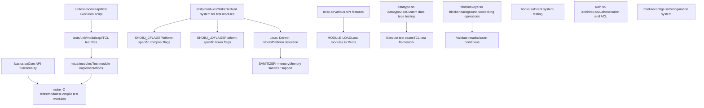
Sources: [tests/modules/Makefile1-105](https://github.com/redis/redis/blob/8ad54215/tests/modules/Makefile#L1-L105) [runtest-moduleapi1-63](https://github.com/redis/redis/blob/8ad54215/runtest-moduleapi#L1-L63) [tests/unit/moduleapi/misc.tcl1-10](https://github.com/redis/redis/blob/8ad54215/tests/unit/moduleapi/misc.tcl#L1-L10)

The testing framework provides over 40 test modules covering different aspects of the Module API, from basic functionality to advanced features like blocking operations and custom data types.

### API Development Patterns

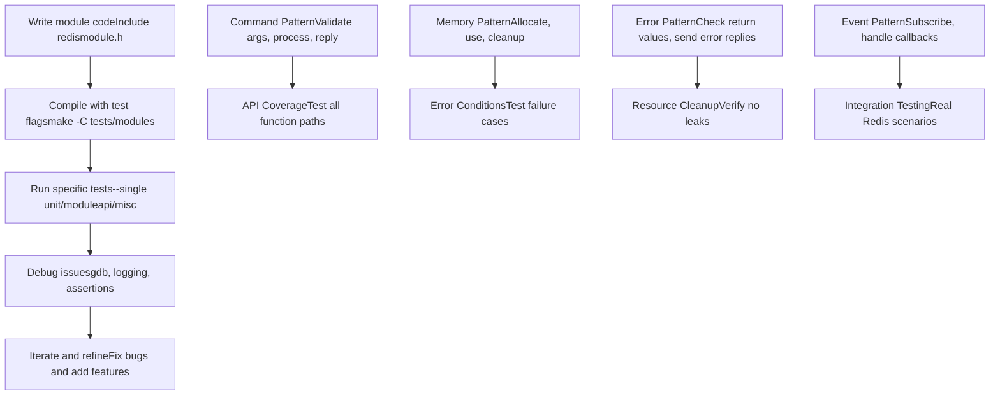
Sources: [tests/modules/misc.c551-627](https://github.com/redis/redis/blob/8ad54215/tests/modules/misc.c#L551-L627) [tests/unit/moduleapi/misc.tcl200-300](https://github.com/redis/redis/blob/8ad54215/tests/unit/moduleapi/misc.tcl#L200-L300) [runtest-moduleapi16-62](https://github.com/redis/redis/blob/8ad54215/runtest-moduleapi#L16-L62)

### Example API Usage from Test Modules

The test modules demonstrate proper API usage patterns:

```
// Command registration pattern from misc.c
int RedisModule_OnLoad(RedisModuleCtx *ctx, RedisModuleString **argv, int argc) {
    if (RedisModule_Init(ctx,"misc",1,REDISMODULE_APIVER_1) == REDISMODULE_ERR)
        return REDISMODULE_ERR;

    // Register commands with proper flags and arity
    if (RedisModule_CreateCommand(ctx,"test.call_generic", test_call_generic,"",0,0,0) == REDISMODULE_ERR)
        return REDISMODULE_ERR;

    // Subscribe to keyspace events
    if (RedisModule_SubscribeToKeyspaceEvents(ctx,
        REDISMODULE_NOTIFY_KEY_MISS | REDISMODULE_NOTIFY_EXPIRED,
        KeySpace_NotificationModuleKeyMissExpired) != REDISMODULE_OK) {
        return REDISMODULE_ERR;
    }

    return REDISMODULE_OK;
}

// API call pattern with error handling
int test_call_generic(RedisModuleCtx *ctx, RedisModuleString **argv, int argc) {
    if (argc < 2) {
        RedisModule_WrongArity(ctx);
        return REDISMODULE_OK;
    }

    const char* cmdname = RedisModule_StringPtrLen(argv[1], NULL);
    RedisModuleCallReply *reply = RedisModule_Call(ctx, cmdname, "v", argv+2, (size_t)argc-2);
    if (reply) {
        RedisModule_ReplyWithCallReply(ctx, reply);
        RedisModule_FreeCallReply(reply);
    } else {
        RedisModule_ReplyWithError(ctx, strerror(errno));
    }
    return REDISMODULE_OK;
}
```
Sources: [tests/modules/misc.c554-627](https://github.com/redis/redis/blob/8ad54215/tests/modules/misc.c#L554-L627) [tests/modules/misc.c60-76](https://github.com/redis/redis/blob/8ad54215/tests/modules/misc.c#L60-L76) [tests/modules/misc.c557-559](https://github.com/redis/redis/blob/8ad54215/tests/modules/misc.c#L557-L559)

The test framework validates API behavior through comprehensive test cases that exercise both success and failure paths, ensuring modules can be developed with confidence in the API's reliability and consistency.

## Module Building and Testing

Redis provides comprehensive build and test infrastructure for module development.

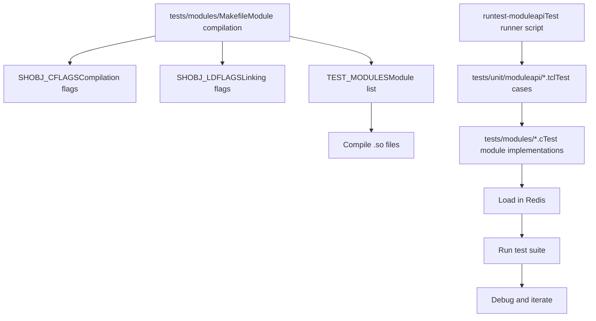
Sources: [tests/modules/Makefile1-104](https://github.com/redis/redis/blob/8ad54215/tests/modules/Makefile#L1-L104) [runtest-moduleapi1-62](https://github.com/redis/redis/blob/8ad54215/runtest-moduleapi#L1-L62) [tests/unit/moduleapi/misc.tcl1-10](https://github.com/redis/redis/blob/8ad54215/tests/unit/moduleapi/misc.tcl#L1-L10)

The build system supports multiple platforms and provides standardized compilation flags for creating Redis modules. The test framework includes comprehensive test cases covering API functionality, error conditions, and integration scenarios.
