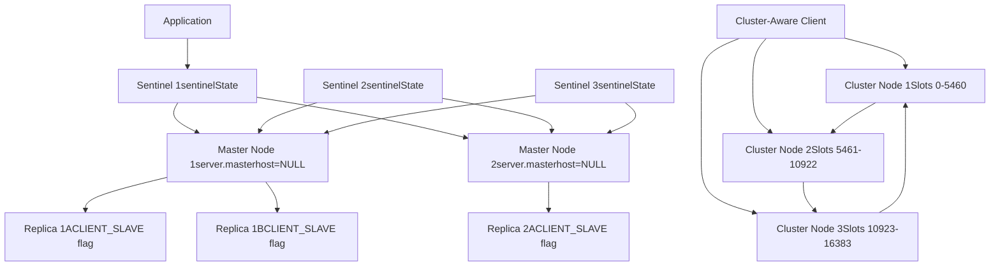
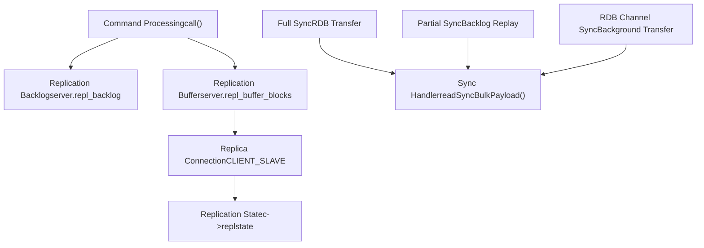
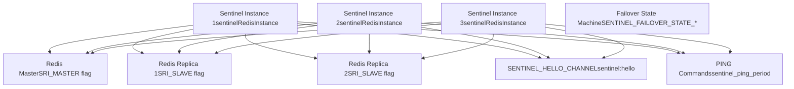
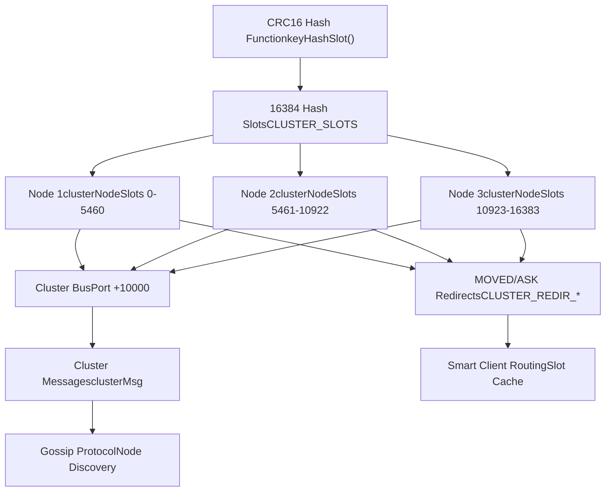
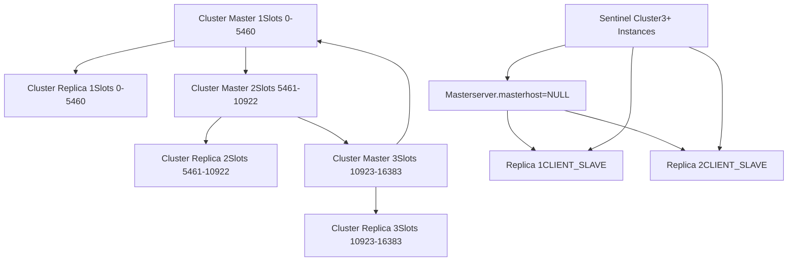

# High Availability and Scaling

Relevant source files

-   [sentinel.conf](https://github.com/redis/redis/blob/8ad54215/sentinel.conf)
-   [src/cluster.c](https://github.com/redis/redis/blob/8ad54215/src/cluster.c)
-   [src/cluster.h](https://github.com/redis/redis/blob/8ad54215/src/cluster.h)
-   [src/cluster\_legacy.c](https://github.com/redis/redis/blob/8ad54215/src/cluster_legacy.c)
-   [src/cluster\_legacy.h](https://github.com/redis/redis/blob/8ad54215/src/cluster_legacy.h)
-   [src/sentinel.c](https://github.com/redis/redis/blob/8ad54215/src/sentinel.c)
-   [tests/sentinel/tests/00-base.tcl](https://github.com/redis/redis/blob/8ad54215/tests/sentinel/tests/00-base.tcl)
-   [tests/sentinel/tests/01-conf-update.tcl](https://github.com/redis/redis/blob/8ad54215/tests/sentinel/tests/01-conf-update.tcl)
-   [tests/sentinel/tests/02-slaves-reconf.tcl](https://github.com/redis/redis/blob/8ad54215/tests/sentinel/tests/02-slaves-reconf.tcl)
-   [tests/sentinel/tests/05-manual.tcl](https://github.com/redis/redis/blob/8ad54215/tests/sentinel/tests/05-manual.tcl)
-   [tests/sentinel/tests/06-ckquorum.tcl](https://github.com/redis/redis/blob/8ad54215/tests/sentinel/tests/06-ckquorum.tcl)
-   [tests/sentinel/tests/07-down-conditions.tcl](https://github.com/redis/redis/blob/8ad54215/tests/sentinel/tests/07-down-conditions.tcl)
-   [tests/sentinel/tests/09-acl-support.tcl](https://github.com/redis/redis/blob/8ad54215/tests/sentinel/tests/09-acl-support.tcl)
-   [tests/sentinel/tests/10-replica-priority.tcl](https://github.com/redis/redis/blob/8ad54215/tests/sentinel/tests/10-replica-priority.tcl)
-   [tests/sentinel/tests/11-port-0.tcl](https://github.com/redis/redis/blob/8ad54215/tests/sentinel/tests/11-port-0.tcl)
-   [tests/sentinel/tests/12-master-reboot.tcl](https://github.com/redis/redis/blob/8ad54215/tests/sentinel/tests/12-master-reboot.tcl)
-   [tests/support/cluster\_util.tcl](https://github.com/redis/redis/blob/8ad54215/tests/support/cluster_util.tcl)
-   [tests/unit/cluster/hostnames.tcl](https://github.com/redis/redis/blob/8ad54215/tests/unit/cluster/hostnames.tcl)
-   [tests/unit/cluster/human-announced-nodename.tcl](https://github.com/redis/redis/blob/8ad54215/tests/unit/cluster/human-announced-nodename.tcl)

This document covers Redis's distributed systems features for achieving high availability and horizontal scaling. It provides an overview of the three primary mechanisms: replication, Redis Sentinel, and Redis Cluster, and how they work together to provide fault tolerance and scale-out capabilities.

For detailed information about persistence mechanisms that complement these HA features, see [Persistence](/redis/redis/5-scripting-and-extensions). For security features that protect distributed deployments, see [Security](/redis/redis/6-high-availability-and-distribution).

## Overview

Redis implements high availability and scaling through three complementary systems:

-   **Replication**: Master-replica data synchronization for read scaling and basic redundancy
-   **Redis Sentinel**: Automatic monitoring, failover, and configuration management for replicated setups
-   **Redis Cluster**: Distributed data sharding across multiple nodes for horizontal write scaling

These systems can be used independently or in combination depending on deployment requirements.

## Architecture Overview

High Availability and Scaling Architecture

**Distributed System Components and Core Data Structures**

Sources: [src/server.h497-513](https://github.com/redis/redis/blob/8ad54215/src/server.h#L497-L513) [src/server.h361-367](https://github.com/redis/redis/blob/8ad54215/src/server.h#L361-L367) [src/sentinel.c37-60](https://github.com/redis/redis/blob/8ad54215/src/sentinel.c#L37-L60)

## Replication System

The replication system provides asynchronous master-replica data synchronization. Masters accept writes and propagate changes to replicas, which can serve read requests.

### Replication Architecture

Replication Data Flow and State Machine

**Replication State Machine and Data Flow**

### Key Components

**Replication Backlog**: Circular buffer storing recent commands for partial resynchronization, implemented in `createReplicationBacklog()` [src/replication.c163-174](https://github.com/redis/redis/blob/8ad54215/src/replication.c#L163-L174) The backlog is a critical component that enables partial resynchronization when a replica reconnects after a brief disconnection.

**Replication States**: Replica connection states defined as `REPL_STATE_*` constants [src/server.h497-513](https://github.com/redis/redis/blob/8ad54215/src/server.h#L497-L513) and managed in the replication state machine. These states track the progress of synchronization from initial connection to full operation.

**RDB Channel**: Optimized full sync mechanism that transfers RDB data on a separate connection while streaming replication buffer on the main connection [src/replication.c49-54](https://github.com/redis/redis/blob/8ad54215/src/replication.c#L49-L54) This feature significantly improves replication performance for large datasets.

Sources: [src/replication.c163-207](https://github.com/redis/redis/blob/8ad54215/src/replication.c#L163-L207) [src/server.h497-513](https://github.com/redis/redis/blob/8ad54215/src/server.h#L497-L513) [src/replication.c275-311](https://github.com/redis/redis/blob/8ad54215/src/replication.c#L275-L311)

## Redis Sentinel

Sentinel provides automatic monitoring, failover, and configuration management for replicated Redis deployments. It runs as a separate process that monitors Redis instances and performs failover when failures are detected.

### Sentinel Architecture

Sentinel Monitoring and Failover System

**Sentinel Monitoring and Failover Coordination**

### Sentinel Features

**Instance Monitoring**: Each `sentinelRedisInstance` tracks Redis master and replica health using periodic `PING` commands and connection state [src/sentinel.c135-146](https://github.com/redis/redis/blob/8ad54215/src/sentinel.c#L135-L146) Monitoring occurs at configurable intervals defined by `sentinel_ping_period` [src/sentinel.c66](https://github.com/redis/redis/blob/8ad54215/src/sentinel.c#L66-L66)

**Failure Detection**: Implements subjective down (`SRI_S_DOWN`) and objective down (`SRI_O_DOWN`) states with configurable thresholds [src/sentinel.c44-60](https://github.com/redis/redis/blob/8ad54215/src/sentinel.c#L44-L60) Subjective down is detected by individual Sentinels, while objective down requires quorum agreement.

**Automatic Failover**: Coordinates failover through leader election and promotes replicas to masters when failures occur [src/sentinel.c90-96](https://github.com/redis/redis/blob/8ad54215/src/sentinel.c#L90-L96) The failover process follows a state machine defined by `SENTINEL_FAILOVER_STATE_*` constants.

**Configuration Management**: Updates client configurations and notifies applications of topology changes through pub/sub channels, particularly the `SENTINEL_HELLO_CHANNEL` [src/sentinel.c79](https://github.com/redis/redis/blob/8ad54215/src/sentinel.c#L79-L79)

Sources: [src/sentinel.c135-146](https://github.com/redis/redis/blob/8ad54215/src/sentinel.c#L135-L146) [src/sentinel.c44-60](https://github.com/redis/redis/blob/8ad54215/src/sentinel.c#L44-L60) [src/sentinel.c90-96](https://github.com/redis/redis/blob/8ad54215/src/sentinel.c#L90-L96) [src/sentinel.c66-79](https://github.com/redis/redis/blob/8ad54215/src/sentinel.c#L66-L79)

## Redis Cluster

Redis Cluster provides horizontal scaling by distributing data across multiple nodes using consistent hashing. It eliminates single points of failure and enables linear scaling of both storage and throughput.

### Cluster Architecture

Redis Cluster Data Distribution and Communication

**Cluster Data Distribution and Communication**

### Cluster Components

**Hash Slots**: Data is partitioned across 16384 slots (defined by `CLUSTER_SLOTS` [src/cluster.h23](https://github.com/redis/redis/blob/8ad54215/src/cluster.h#L23-L23)) using the `keyHashSlot()` function with CRC16 hash [src/cluster.c34-59](https://github.com/redis/redis/blob/8ad54215/src/cluster.c#L34-L59) This fixed number of slots allows for predictable and balanced data distribution.

**Cluster Nodes**: Each `clusterNode` structure manages slot assignments and maintains connections to other nodes [src/cluster\_legacy.c39-51](https://github.com/redis/redis/blob/8ad54215/src/cluster_legacy.c#L39-L51) Nodes track which hash slots they own and which are owned by other nodes in the cluster.

**Cluster Bus**: Dedicated communication channel on port+10000 for cluster coordination and gossip protocol [src/cluster\_legacy.h18](https://github.com/redis/redis/blob/8ad54215/src/cluster_legacy.h#L18-L18) This separate channel ensures that cluster management traffic doesn't interfere with client commands.

**Client Redirection**: When clients access the wrong node, the server responds with `MOVED` or `ASK` redirections (defined by `CLUSTER_REDIR_*` constants [src/cluster.h29-37](https://github.com/redis/redis/blob/8ad54215/src/cluster.h#L29-L37)) to direct the client to the correct node. This redirection mechanism is fundamental to the cluster's operation.

Sources: [src/cluster.h22-37](https://github.com/redis/redis/blob/8ad54215/src/cluster.h#L22-L37) [src/cluster.c34-59](https://github.com/redis/redis/blob/8ad54215/src/cluster.c#L34-L59) [src/cluster\_legacy.c39-51](https://github.com/redis/redis/blob/8ad54215/src/cluster_legacy.c#L39-L51)

## Integration Patterns

Redis High Availability Deployment Models

### Sentinel + Replication

Most common HA setup for single-master workloads. Sentinel monitors a replicated Redis group and performs automatic failover while maintaining data consistency. This pattern is implemented through the `sentinelHandleRedisInstance()` function [src/sentinel.c1000-1100](https://github.com/redis/redis/blob/8ad54215/src/sentinel.c#L1000-L1100) which manages the monitoring and failover logic.

### Cluster + Replication

Each cluster node can have replicas for redundancy. Cluster handles sharding while replication provides per-shard fault tolerance. The `clusterReplicate()` function [src/cluster\_legacy.c2000-2100](https://github.com/redis/redis/blob/8ad54215/src/cluster_legacy.c#L2000-L2100) establishes replication relationships within the cluster context.

### Configuration

All HA features can be configured through `redis.conf` or runtime `CONFIG SET` commands. Key configuration categories handled by `config.c` include:

| Configuration Type | File | Key Parameters |
| --- | --- | --- |
| Replication | redis.conf | replicaof, replica-serve-stale-data |
| Sentinel | sentinel.conf | sentinel monitor, sentinel down-after-milliseconds |
| Cluster | redis.conf | cluster-enabled, cluster-node-timeout |

The configuration system uses type-specific handlers like `replicationConfigInit()` and `clusterConfigInit()` to manage these settings [src/config.c374-425](https://github.com/redis/redis/blob/8ad54215/src/config.c#L374-L425)

Sources: [src/config.c374-425](https://github.com/redis/redis/blob/8ad54215/src/config.c#L374-L425) [redis.conf1-150](https://github.com/redis/redis/blob/8ad54215/redis.conf#L1-L150) [sentinel.conf1-50](https://github.com/redis/redis/blob/8ad54215/sentinel.conf#L1-L50)

## Operational Considerations

**Deployment Topologies**: Different combinations of replication, sentinel, and cluster for various scale and availability requirements.

**Network Partitions**: All systems include partition tolerance mechanisms and split-brain prevention.

**Performance Impact**: Replication and cluster coordination introduce latency overhead that scales with deployment size.

**Monitoring**: Comprehensive metrics available through `INFO` command for tracking replication lag, cluster health, and sentinel status.

For implementation details of each system, see [Replication](/redis/redis/4.1-eviction-and-expiration-policies), [Redis Sentinel](/redis/redis/4.2-memory-allocators-and-build-system), and [Redis Cluster](#4.3).
