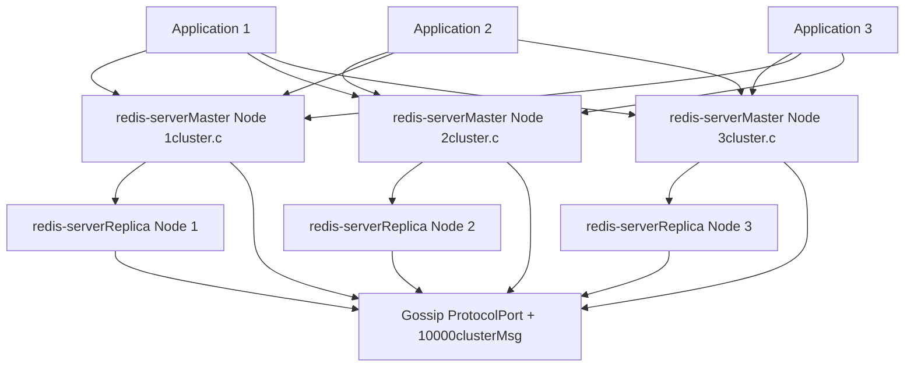
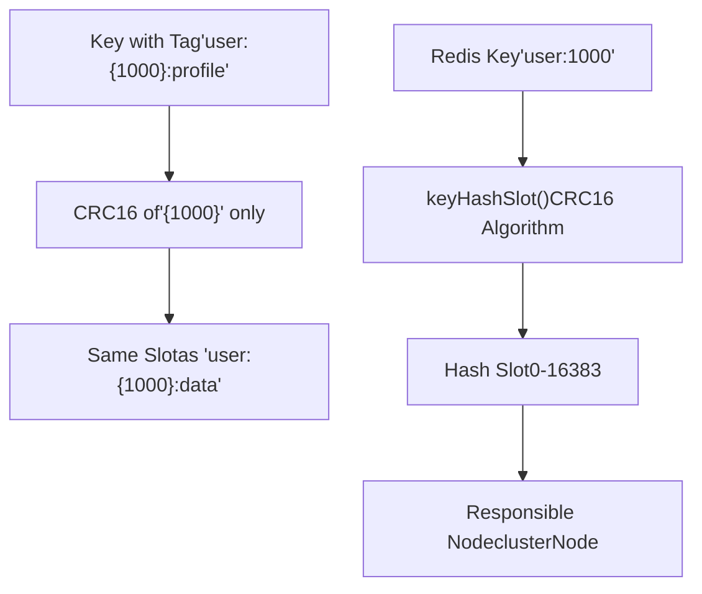
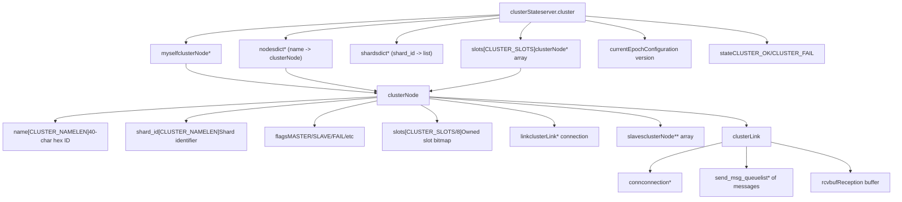
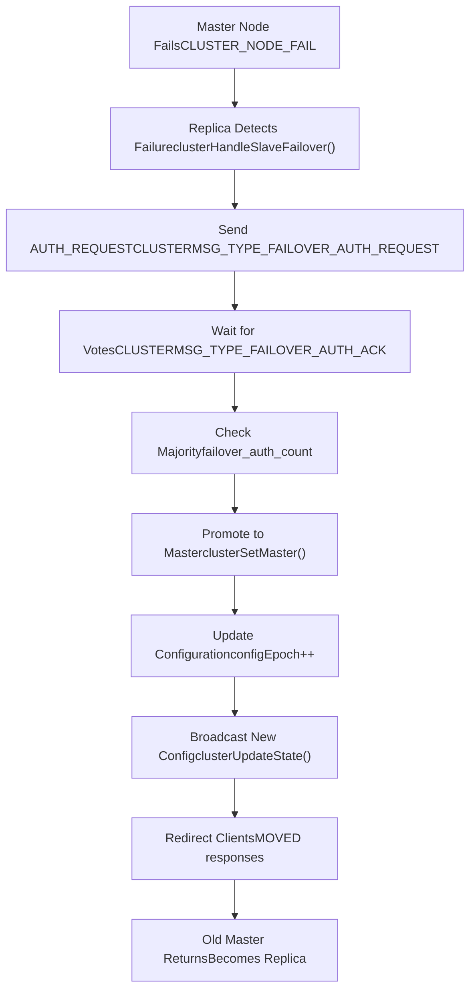
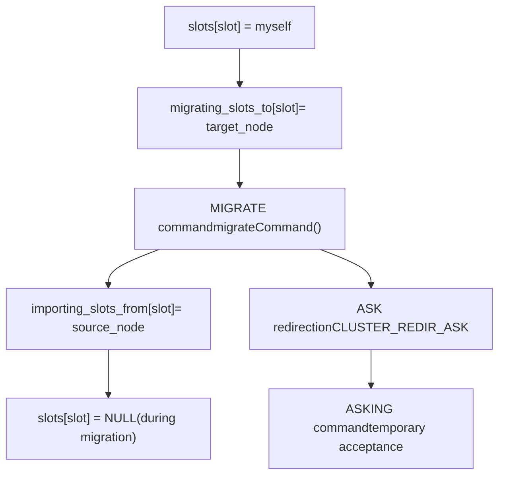
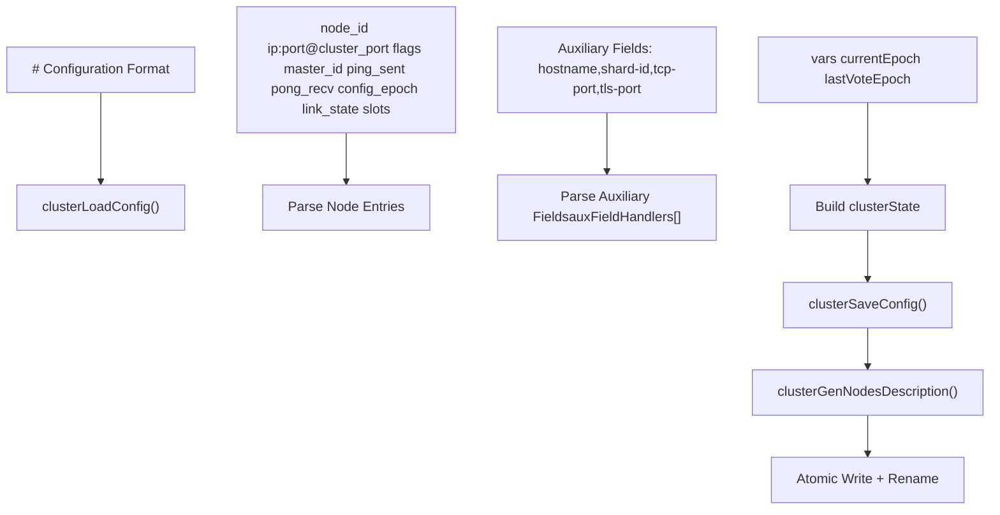
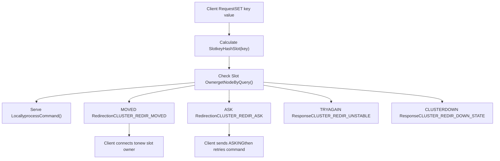
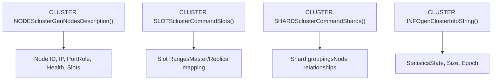

# Redis Cluster

Relevant source files

-   [src/cluster.c](https://github.com/redis/redis/blob/8ad54215/src/cluster.c)
-   [src/cluster.h](https://github.com/redis/redis/blob/8ad54215/src/cluster.h)
-   [src/cluster\_legacy.c](https://github.com/redis/redis/blob/8ad54215/src/cluster_legacy.c)
-   [src/cluster\_legacy.h](https://github.com/redis/redis/blob/8ad54215/src/cluster_legacy.h)
-   [tests/support/cluster\_util.tcl](https://github.com/redis/redis/blob/8ad54215/tests/support/cluster_util.tcl)
-   [tests/unit/cluster/hostnames.tcl](https://github.com/redis/redis/blob/8ad54215/tests/unit/cluster/hostnames.tcl)
-   [tests/unit/cluster/human-announced-nodename.tcl](https://github.com/redis/redis/blob/8ad54215/tests/unit/cluster/human-announced-nodename.tcl)

Redis Cluster is Redis's built-in solution for horizontal scaling and high availability through automatic data sharding and replication. It distributes data across multiple Redis instances using a hash slot mechanism and provides automatic failover capabilities when nodes become unavailable.

For information about Redis replication between master and replica nodes, see [Replication](/redis/redis/4.1-eviction-and-expiration-policies). For high availability monitoring and failover coordination, see [Redis Sentinel](/redis/redis/4.2-memory-allocators-and-build-system).

## Architecture Overview

Redis Cluster implements a distributed hash table where data is automatically partitioned across multiple Redis nodes. The cluster uses a hash slot approach with 16,384 slots total, where each master node is responsible for a subset of these slots.

### Cluster Architecture Diagram

Sources: [src/cluster.h22-27](https://github.com/redis/redis/blob/8ad54215/src/cluster.h#L22-L27) [src/cluster\_legacy.h341-390](https://github.com/redis/redis/blob/8ad54215/src/cluster_legacy.h#L341-L390)

## Hash Slot Distribution

The cluster partitions the key space using a hash slot mechanism. Each key is mapped to one of 16,384 hash slots using CRC16 hashing.

### Key Hashing Implementation

The `keyHashSlot` function implements the core hashing logic:

Sources: [src/cluster.h57-76](https://github.com/redis/redis/blob/8ad54215/src/cluster.h#L57-L76) [src/cluster.c34-59](https://github.com/redis/redis/blob/8ad54215/src/cluster.c#L34-L59)

### Hash Slot Assignment

Each master node is assigned a range of hash slots during cluster setup. The slot assignment is stored in the `clusterState.slots` array and propagated throughout the cluster via gossip protocol.

| Component | Purpose | Implementation |
| --- | --- | --- |
| `CLUSTER_SLOTS` | Total number of slots (16384) | [src/cluster.h23](https://github.com/redis/redis/blob/8ad54215/src/cluster.h#L23-L23) |
| `keyHashSlot()` | Maps keys to slots using CRC16 | [src/cluster.h57-76](https://github.com/redis/redis/blob/8ad54215/src/cluster.h#L57-L76) |
| `clusterState.slots[]` | Maps slots to responsible nodes | [src/cluster\_legacy.h351](https://github.com/redis/redis/blob/8ad54215/src/cluster_legacy.h#L351-L351) |
| `clusterNode.slots[]` | Bitmap of slots owned by node | [src/cluster\_legacy.h304](https://github.com/redis/redis/blob/8ad54215/src/cluster_legacy.h#L304-L304) |

Sources: [src/cluster.h22-24](https://github.com/redis/redis/blob/8ad54215/src/cluster.h#L22-L24) [src/cluster\_legacy.h351](https://github.com/redis/redis/blob/8ad54215/src/cluster_legacy.h#L351-L351) [src/cluster\_legacy.h304](https://github.com/redis/redis/blob/8ad54215/src/cluster_legacy.h#L304-L304)

## Core Data Structures

Redis Cluster's implementation centers around several key data structures that manage cluster state, node information, and inter-node communication.

### Cluster State Management

Sources: [src/cluster\_legacy.h341-390](https://github.com/redis/redis/blob/8ad54215/src/cluster_legacy.h#L341-L390) [src/cluster\_legacy.h298-332](https://github.com/redis/redis/blob/8ad54215/src/cluster_legacy.h#L298-L332) [src/cluster\_legacy.h44-55](https://github.com/redis/redis/blob/8ad54215/src/cluster_legacy.h#L44-L55)

### Message Protocol Structure

The cluster bus protocol uses the `clusterMsg` structure for all inter-node communication:

| Field | Type | Purpose |
| --- | --- | --- |
| `sig[4]` | char | Protocol signature "RCmb" |
| `totlen` | uint32\_t | Total message length |
| `type` | uint16\_t | Message type (PING/PONG/MEET/FAIL) |
| `sender[CLUSTER_NAMELEN]` | char | Sending node ID |
| `myslots[CLUSTER_SLOTS/8]` | unsigned char | Sender's slot bitmap |
| `data` | union | Type-specific message data |

Sources: [src/cluster\_legacy.h230-256](https://github.com/redis/redis/blob/8ad54215/src/cluster_legacy.h#L230-L256) [src/cluster\_legacy.h94-105](https://github.com/redis/redis/blob/8ad54215/src/cluster_legacy.h#L94-L105)

## Node Discovery and Gossip Protocol

Redis Cluster uses a gossip protocol for node discovery, failure detection, and configuration propagation. Each node maintains connections to a subset of other nodes and periodically exchanges cluster state information.

### Gossip Communication Flow

> **[Mermaid sequence]**
> *(图表结构无法解析)*

### Node States and Transitions

> **[Mermaid stateDiagram]**
> *(图表结构无法解析)*

Sources: [src/cluster\_legacy.h57-78](https://github.com/redis/redis/blob/8ad54215/src/cluster_legacy.h#L57-L78) [src/cluster\_legacy.c1543-1595](https://github.com/redis/redis/blob/8ad54215/src/cluster_legacy.c#L1543-L1595)

## Failover and High Availability

Redis Cluster supports both automatic and manual failover mechanisms to maintain availability when master nodes fail.

### Automatic Failover Process

### Failover State Machine

The failover process is managed by several key variables in `clusterState`:

| Variable | Purpose | Type |
| --- | --- | --- |
| `failover_auth_time` | Timing of election process | `mstime_t` |
| `failover_auth_count` | Number of received votes | `int` |
| `failover_auth_rank` | Replica's rank in election | `int` |
| `failover_auth_epoch` | Election epoch number | `uint64_t` |
| `cant_failover_reason` | Why failover is blocked | `int` |

Sources: [src/cluster\_legacy.h354-360](https://github.com/redis/redis/blob/8ad54215/src/cluster_legacy.h#L354-L360) [src/cluster\_legacy.c3956-4158](https://github.com/redis/redis/blob/8ad54215/src/cluster_legacy.c#L3956-L4158)

## Slot Migration and Resharding

Redis Cluster supports live resharding through slot migration, allowing redistribution of data without downtime.

### Migration State Tracking

### Migration Protocol Commands

The migration process uses several specialized commands:

| Command | Purpose | Implementation |
| --- | --- | --- |
| `MIGRATE` | Transfer keys between nodes | [src/cluster.c398-736](https://github.com/redis/redis/blob/8ad54215/src/cluster.c#L398-L736) |
| `DUMP` | Serialize key for migration | [src/cluster.c137-153](https://github.com/redis/redis/blob/8ad54215/src/cluster.c#L137-L153) |
| `RESTORE` | Deserialize key after migration | [src/cluster.c156-281](https://github.com/redis/redis/blob/8ad54215/src/cluster.c#L156-L281) |
| `ASKING` | Bypass redirection during migration | Cluster command handling |

Sources: [src/cluster.c398-736](https://github.com/redis/redis/blob/8ad54215/src/cluster.c#L398-L736) [src/cluster.c137-153](https://github.com/redis/redis/blob/8ad54215/src/cluster.c#L137-L153) [src/cluster.c156-281](https://github.com/redis/redis/blob/8ad54215/src/cluster.c#L156-L281)

## Configuration Persistence

Cluster configuration is persisted in the `nodes.conf` file, which contains node information, slot assignments, and cluster state.

### Configuration File Format

### Auxiliary Field Support

Modern cluster configurations support auxiliary fields for extended node metadata:

| Field | Handler Function | Purpose |
| --- | --- | --- |
| `shard-id` | `auxShardIdSetter()` | Group nodes into shards |
| `hostname` | Built-in | Human-readable endpoint |
| `tcp-port` | `auxTcpPortSetter()` | TCP client port |
| `tls-port` | `auxTlsPortSetter()` | TLS client port |

Sources: [src/cluster\_legacy.c311-665](https://github.com/redis/redis/blob/8ad54215/src/cluster_legacy.c#L311-L665) [src/cluster\_legacy.c679-742](https://github.com/redis/redis/blob/8ad54215/src/cluster_legacy.c#L679-L742) [src/cluster\_legacy.c197-202](https://github.com/redis/redis/blob/8ad54215/src/cluster_legacy.c#L197-L202)

## Client Interaction and Redirection

Clients interact with Redis Cluster through any node, which either serves the request directly or redirects the client to the appropriate node.

### Request Routing Logic

### Redirection Response Types

| Response | Meaning | Client Action |
| --- | --- | --- |
| `MOVED slot host:port` | Slot permanently moved | Update slot map, retry |
| `ASK slot host:port` | Temporary redirection during migration | Send ASKING, then command |
| `TRYAGAIN` | Cluster state unstable | Retry after delay |
| `CLUSTERDOWN` | Cluster unavailable | Handle as error |

Sources: [src/cluster.h29-37](https://github.com/redis/redis/blob/8ad54215/src/cluster.h#L29-L37) [src/cluster.h151-153](https://github.com/redis/redis/blob/8ad54215/src/cluster.h#L151-L153)

## Monitoring and Diagnostics

Redis Cluster provides extensive monitoring capabilities through various commands and metrics.

### Cluster Information Commands

### Health Monitoring Metrics

The cluster tracks various statistics for monitoring:

| Metric Category | Examples | Source |
| --- | --- | --- |
| Message Statistics | Ping/Pong counts, Fail reports | `stats_bus_messages_*` |
| Node Health | PFAIL/FAIL node counts | `stats_pfail_nodes` |
| Slot Statistics | CPU usage, Network I/O per slot | `slot_stats[]` |
| Configuration | Current epoch, Cluster size | `currentEpoch`, `size` |

Sources: [src/cluster\_legacy.h375-389](https://github.com/redis/redis/blob/8ad54215/src/cluster_legacy.h#L375-L389) [src/cluster.c925-955](https://github.com/redis/redis/blob/8ad54215/src/cluster.c#L925-L955)

Redis Cluster provides a robust, scalable solution for distributing Redis data across multiple nodes while maintaining high availability through automatic failover and seamless client redirection.
