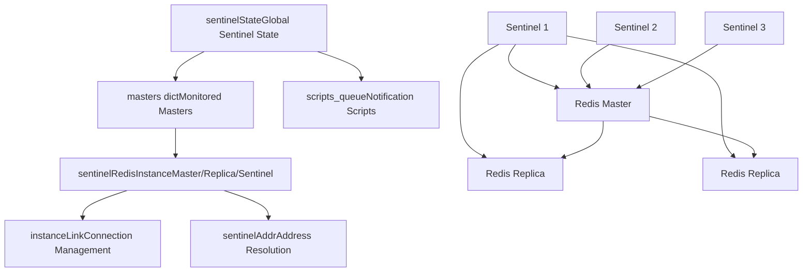
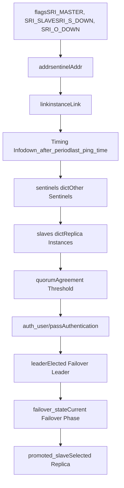

# Redis Sentinel

Relevant source files

-   [sentinel.conf](https://github.com/redis/redis/blob/8ad54215/sentinel.conf)
-   [src/sentinel.c](https://github.com/redis/redis/blob/8ad54215/src/sentinel.c)
-   [tests/sentinel/tests/00-base.tcl](https://github.com/redis/redis/blob/8ad54215/tests/sentinel/tests/00-base.tcl)
-   [tests/sentinel/tests/01-conf-update.tcl](https://github.com/redis/redis/blob/8ad54215/tests/sentinel/tests/01-conf-update.tcl)
-   [tests/sentinel/tests/02-slaves-reconf.tcl](https://github.com/redis/redis/blob/8ad54215/tests/sentinel/tests/02-slaves-reconf.tcl)
-   [tests/sentinel/tests/05-manual.tcl](https://github.com/redis/redis/blob/8ad54215/tests/sentinel/tests/05-manual.tcl)
-   [tests/sentinel/tests/06-ckquorum.tcl](https://github.com/redis/redis/blob/8ad54215/tests/sentinel/tests/06-ckquorum.tcl)
-   [tests/sentinel/tests/07-down-conditions.tcl](https://github.com/redis/redis/blob/8ad54215/tests/sentinel/tests/07-down-conditions.tcl)
-   [tests/sentinel/tests/09-acl-support.tcl](https://github.com/redis/redis/blob/8ad54215/tests/sentinel/tests/09-acl-support.tcl)
-   [tests/sentinel/tests/10-replica-priority.tcl](https://github.com/redis/redis/blob/8ad54215/tests/sentinel/tests/10-replica-priority.tcl)
-   [tests/sentinel/tests/11-port-0.tcl](https://github.com/redis/redis/blob/8ad54215/tests/sentinel/tests/11-port-0.tcl)
-   [tests/sentinel/tests/12-master-reboot.tcl](https://github.com/redis/redis/blob/8ad54215/tests/sentinel/tests/12-master-reboot.tcl)

Redis Sentinel is a distributed monitoring and high availability system for Redis deployments. It provides automatic failover capabilities, service discovery, and configuration management for Redis master-replica topologies. Sentinel continuously monitors Redis instances and orchestrates failover procedures when masters become unavailable, ensuring minimal downtime in production environments.

This document covers the Sentinel implementation, architecture, and operational mechanisms. For information about Redis Cluster's distributed data sharding capabilities, see [Redis Cluster](/redis/redis/6.1-redis-cluster).

## Architecture Overview

Redis Sentinel operates as a separate process that monitors Redis instances and coordinates with other Sentinel instances to make failover decisions. The system uses a quorum-based approach where multiple Sentinels must agree before triggering failover operations.

### Core System Components


Sources: [src/sentinel.c235-258](https://github.com/redis/redis/blob/8ad54215/src/sentinel.c#L235-L258) [src/sentinel.c162-232](https://github.com/redis/redis/blob/8ad54215/src/sentinel.c#L162-L232) [src/sentinel.c36-41](https://github.com/redis/redis/blob/8ad54215/src/sentinel.c#L36-L41)

### Instance State Management

> **[Mermaid stateDiagram]**
> *(图表结构无法解析)*

Sources: [src/sentinel.c44-60](https://github.com/redis/redis/blob/8ad54215/src/sentinel.c#L44-L60) [src/sentinel.c90-96](https://github.com/redis/redis/blob/8ad54215/src/sentinel.c#L90-L96)

## Core Data Structures

### Sentinel Global State

The `sentinelState` structure maintains the global state of a Sentinel instance, including its identity, monitored masters, and operational parameters.

| Field | Type | Purpose |
| --- | --- | --- |
| `myid` | `char[41]` | Unique Sentinel identifier |
| `current_epoch` | `uint64_t` | Configuration epoch for coordination |
| `masters` | `dict*` | Dictionary of monitored master instances |
| `tilt` | `int` | TILT mode flag for clock issues |
| `scripts_queue` | `list*` | Queue of pending notification scripts |
| `announce_ip/port` | `char*/int` | Override address for NAT environments |

Sources: [src/sentinel.c235-258](https://github.com/redis/redis/blob/8ad54215/src/sentinel.c#L235-L258)

### Redis Instance Representation

The `sentinelRedisInstance` structure represents any monitored Redis instance (master, replica, or other Sentinel) with comprehensive state tracking.


Sources: [src/sentinel.c162-232](https://github.com/redis/redis/blob/8ad54215/src/sentinel.c#L162-L232)

### Connection Management

The `instanceLink` structure manages shared connections between Sentinel instances to avoid connection proliferation when monitoring multiple masters.

Sources: [src/sentinel.c135-160](https://github.com/redis/redis/blob/8ad54215/src/sentinel.c#L135-L160)

## Monitoring and Failure Detection

### Ping and Health Checking

Sentinel continuously monitors Redis instances using multiple mechanisms:

-   **PING Commands**: Regular health checks at configurable intervals
-   **INFO Command**: Gathering instance role and replication status
-   **Pub/Sub Channel**: `__sentinel__:hello` for Sentinel discovery and gossip

The monitoring process operates with configurable timing parameters:

| Parameter | Default | Purpose |
| --- | --- | --- |
| `sentinel_ping_period` | 1000ms | Interval between PING commands |
| `sentinel_info_period` | 10000ms | INFO command frequency |
| `sentinel_default_down_after` | 30000ms | Timeout before SDOWN declaration |
| `sentinel_ask_period` | 1000ms | Sentinel query interval |

Sources: [src/sentinel.c63-77](https://github.com/redis/redis/blob/8ad54215/src/sentinel.c#L63-L77)

### Down State Detection

Sources: [src/sentinel.c44-60](https://github.com/redis/redis/blob/8ad54215/src/sentinel.c#L44-L60) [tests/sentinel/tests/07-down-conditions.tcl46-104](https://github.com/redis/redis/blob/8ad54215/tests/sentinel/tests/07-down-conditions.tcl#L46-L104)

## Failover Process

### Leader Election and Coordination

When a master is declared objectively down, Sentinels participate in a leader election process to designate which Sentinel will orchestrate the failover.

> **[Mermaid sequence]**
> *(图表结构无法解析)*

Sources: [src/sentinel.c374](https://github.com/redis/redis/blob/8ad54215/src/sentinel.c#L374-L374) [src/sentinel.c385](https://github.com/redis/redis/blob/8ad54215/src/sentinel.c#L385-L385)

### Failover State Machine

The failover process follows a defined state machine with specific phases:

| State | Value | Purpose |
| --- | --- | --- |
| `SENTINEL_FAILOVER_STATE_NONE` | 0 | No failover in progress |
| `SENTINEL_FAILOVER_STATE_WAIT_START` | 1 | Waiting for failover start time |
| `SENTINEL_FAILOVER_STATE_SELECT_SLAVE` | 2 | Choose replica for promotion |
| `SENTINEL_FAILOVER_STATE_SEND_SLAVEOF_NOONE` | 3 | Promote replica to master |
| `SENTINEL_FAILOVER_STATE_WAIT_PROMOTION` | 4 | Wait for role change |
| `SENTINEL_FAILOVER_STATE_RECONF_SLAVES` | 5 | Reconfigure remaining replicas |
| `SENTINEL_FAILOVER_STATE_UPDATE_CONFIG` | 6 | Update monitoring configuration |

Sources: [src/sentinel.c90-96](https://github.com/redis/redis/blob/8ad54215/src/sentinel.c#L90-L96)

### Replica Selection Algorithm

When selecting a replica for promotion, Sentinel considers multiple factors implemented in `sentinelSelectSlave()`:

-   **Replica Priority**: Configurable priority value (lower = higher priority)
-   **Replication Offset**: Replica with most up-to-date data
-   **Replica Announcement**: Whether replica is announced as available
-   **Connection Health**: Stable connection to the replica

Sources: [src/sentinel.c380](https://github.com/redis/redis/blob/8ad54215/src/sentinel.c#L380-L380)

## Configuration and Management

### Configuration File Structure

Sentinel uses a dynamic configuration file that gets rewritten during runtime to persist state changes:

```
# Basic Sentinel configuration
port 26379
sentinel monitor mymaster 127.0.0.1 6379 2
sentinel down-after-milliseconds mymaster 30000
sentinel parallel-syncs mymaster 1
sentinel failover-timeout mymaster 180000

# Authentication
sentinel auth-pass mymaster MySUPER--secret-0123passw0rd
sentinel auth-user mymaster sentinel-user

# Scripts
sentinel notification-script mymaster /var/redis/notify.sh
sentinel client-reconfig-script mymaster /var/redis/reconfig.sh
```
Sources: [sentinel.conf1-362](https://github.com/redis/redis/blob/8ad54215/sentinel.conf#L1-L362)

### Runtime Configuration Commands

Sentinel provides commands for runtime configuration management:

| Command | Purpose |
| --- | --- |
| `SENTINEL MONITOR` | Add new master to monitor |
| `SENTINEL REMOVE` | Stop monitoring master |
| `SENTINEL SET` | Modify master parameters |
| `SENTINEL CONFIG GET/SET` | Manage Sentinel configuration |
| `SENTINEL FAILOVER` | Trigger manual failover |

Sources: [src/sentinel.c443-445](https://github.com/redis/redis/blob/8ad54215/src/sentinel.c#L443-L445)

## Script Execution System

### Notification and Reconfiguration Scripts

Sentinel supports executing external scripts for notifications and client reconfiguration during failover events. The script execution system provides:

-   **Notification Scripts**: Execute on WARNING-level events for alerting
-   **Client Reconfiguration Scripts**: Execute during failover to update clients
-   **Retry Logic**: Automatic retry with exponential backoff
-   **Timeout Protection**: Scripts are killed if they exceed maximum runtime

Sources: [src/sentinel.c261-271](https://github.com/redis/redis/blob/8ad54215/src/sentinel.c#L261-L271) [src/sentinel.c736-780](https://github.com/redis/redis/blob/8ad54215/src/sentinel.c#L736-L780) [src/sentinel.c800-908](https://github.com/redis/redis/blob/8ad54215/src/sentinel.c#L800-L908)

### Script Security

Script execution includes security measures:

-   **deny-scripts-reconfig**: Prevents runtime modification of script paths
-   **Maximum Runtime**: 60 seconds default timeout with SIGKILL
-   **Maximum Retries**: Up to 10 retry attempts
-   **Queue Limits**: Maximum of 256 queued scripts, 16 concurrent executions

Sources: [src/sentinel.c75-76](https://github.com/redis/redis/blob/8ad54215/src/sentinel.c#L75-L76) [src/sentinel.c110-114](https://github.com/redis/redis/blob/8ad54215/src/sentinel.c#L110-L114) [sentinel.conf301-306](https://github.com/redis/redis/blob/8ad54215/sentinel.conf#L301-L306)

## Network and Security Features

### Address Resolution and NAT Support

Sentinel supports deployment in NAT environments through address announcement:

-   **resolve-hostnames**: Enable hostname resolution instead of IP-only
-   **announce-hostnames**: Announce hostnames instead of IPs when available
-   **announce-ip/port**: Override announced address for NAT traversal

Sources: [src/sentinel.c256-257](https://github.com/redis/redis/blob/8ad54215/src/sentinel.c#L256-L257) [sentinel.conf336-351](https://github.com/redis/redis/blob/8ad54215/sentinel.conf#L336-L351)

### Authentication Integration

Sentinel integrates with Redis authentication systems:

-   **ACL Support**: Full integration with Redis 6.0+ ACL system
-   **Legacy AUTH**: Support for password-based authentication
-   **Inter-Sentinel Auth**: Separate credentials for Sentinel communication
-   **Master/Replica Auth**: Unified credentials for monitored instances

Sources: [src/sentinel.c200-201](https://github.com/redis/redis/blob/8ad54215/src/sentinel.c#L200-L201) [src/sentinel.c254-255](https://github.com/redis/redis/blob/8ad54215/src/sentinel.c#L254-L255) [tests/sentinel/tests/09-acl-support.tcl1-56](https://github.com/redis/redis/blob/8ad54215/tests/sentinel/tests/09-acl-support.tcl#L1-L56)

## High Availability Features

### TILT Mode Protection

Sentinel includes TILT mode as protection against clock issues and system instability:

During TILT mode, Sentinel:

-   Continues monitoring but avoids triggering failovers
-   Protects against false positive failure detection
-   Automatically recovers when timing stabilizes

Sources: [src/sentinel.c241-245](https://github.com/redis/redis/blob/8ad54215/src/sentinel.c#L241-L245) [src/sentinel.c70-71](https://github.com/redis/redis/blob/8ad54215/src/sentinel.c#L70-L71)

### Quorum and Majority Requirements

Sentinel implements a two-level decision system:

1.  **ODOWN Quorum**: Minimum Sentinels needed to declare objective failure
2.  **Majority Agreement**: Majority of known Sentinels must agree to authorize failover

This prevents split-brain scenarios and ensures failover only occurs with sufficient consensus.

Sources: [tests/sentinel/tests/00-base.tcl121-158](https://github.com/redis/redis/blob/8ad54215/tests/sentinel/tests/00-base.tcl#L121-L158) [tests/sentinel/tests/06-ckquorum.tcl1-42](https://github.com/redis/redis/blob/8ad54215/tests/sentinel/tests/06-ckquorum.tcl#L1-L42)
