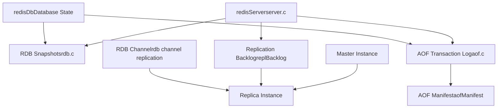
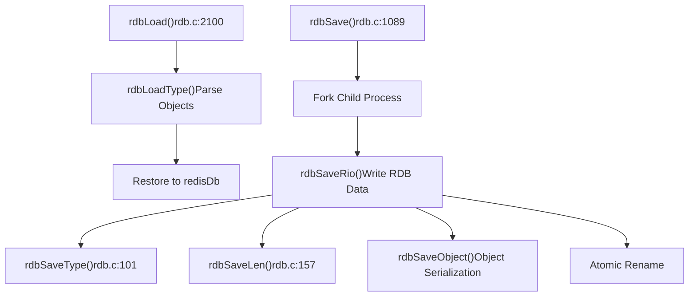
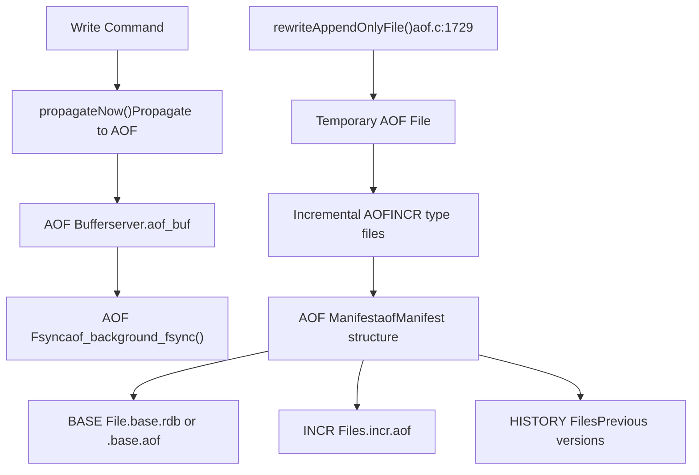
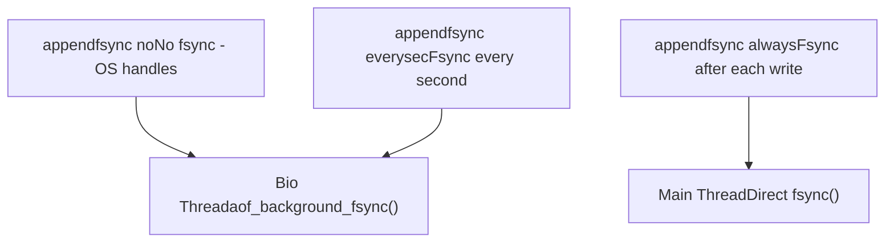
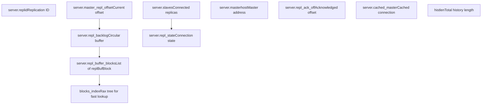
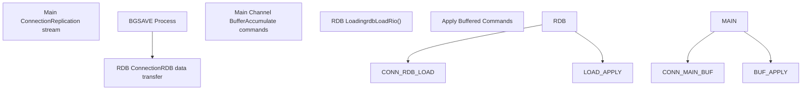
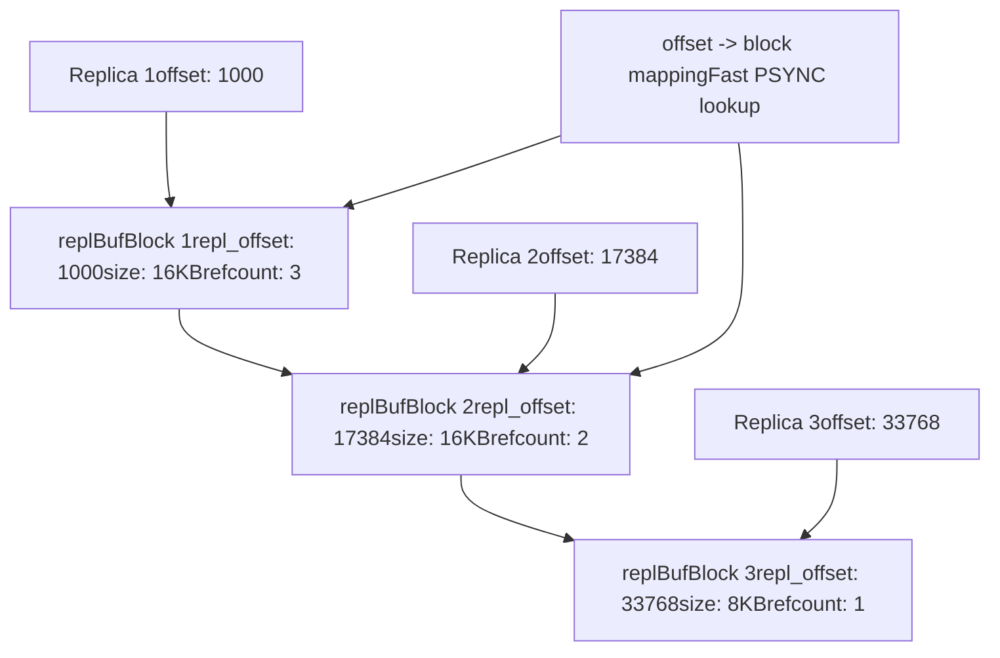

# Persistence and Replication

Relevant source files

-   [redis.conf](https://github.com/redis/redis/blob/8ad54215/redis.conf)
-   [src/aof.c](https://github.com/redis/redis/blob/8ad54215/src/aof.c)
-   [src/config.c](https://github.com/redis/redis/blob/8ad54215/src/config.c)
-   [src/db.c](https://github.com/redis/redis/blob/8ad54215/src/db.c)
-   [src/debug.c](https://github.com/redis/redis/blob/8ad54215/src/debug.c)
-   [src/module.c](https://github.com/redis/redis/blob/8ad54215/src/module.c)
-   [src/networking.c](https://github.com/redis/redis/blob/8ad54215/src/networking.c)
-   [src/object.c](https://github.com/redis/redis/blob/8ad54215/src/object.c)
-   [src/rdb.c](https://github.com/redis/redis/blob/8ad54215/src/rdb.c)
-   [src/replication.c](https://github.com/redis/redis/blob/8ad54215/src/replication.c)
-   [src/server.c](https://github.com/redis/redis/blob/8ad54215/src/server.c)
-   [src/server.h](https://github.com/redis/redis/blob/8ad54215/src/server.h)
-   [tests/unit/introspection.tcl](https://github.com/redis/redis/blob/8ad54215/tests/unit/introspection.tcl)

This document covers Redis's data persistence mechanisms and master-replica replication system. Persistence ensures data durability through RDB snapshots and AOF transaction logs, while replication enables data synchronization across multiple Redis instances for high availability and read scaling.

For information about clustering and distributed Redis deployments, see [Redis Cluster](/redis/redis/6.1-redis-cluster). For high availability monitoring and failover management, see [Redis Sentinel](/redis/redis/6.2-redis-sentinel).

## Overview

Redis provides two complementary persistence mechanisms and a comprehensive replication system:

**Persistence Systems:**

-   **RDB (Redis Database)**: Point-in-time binary snapshots stored in `.rdb` files
-   **AOF (Append Only File)**: Transaction log recording all write operations in `.aof` files

**Replication System:**

-   Master-replica architecture with asynchronous replication
-   Full synchronization (FULLRESYNC) and partial synchronization (PSYNC)
-   Replication backlog for efficient partial resynchronization
-   RDB channel replication for improved performance during full sync


Sources: [src/server.h80-81](https://github.com/redis/redis/blob/8ad54215/src/server.h#L80-L81) [src/replication.c16-28](https://github.com/redis/redis/blob/8ad54215/src/replication.c#L16-L28) [src/rdb.c1-50](https://github.com/redis/redis/blob/8ad54215/src/rdb.c#L1-L50) [src/aof.c1-50](https://github.com/redis/redis/blob/8ad54215/src/aof.c#L1-L50)

## RDB Persistence

RDB creates point-in-time binary snapshots of the entire Redis dataset. The system supports both manual snapshots via `BGSAVE` and automatic snapshots based on configurable save points.

### RDB Data Structures and Process


The RDB format uses type-length-value encoding with compression support:

| Component | Function | Description |
| --- | --- | --- |
| Type Byte | `rdbSaveType()` | Object type identifier |
| Length Encoding | `rdbSaveLen()` | Variable-length integer encoding |
| Object Data | `rdbSaveObject()` | Type-specific serialization |
| Checksum | `rdbSaveRaw()` | CRC64 checksum for integrity |

Sources: [src/rdb.c95-103](https://github.com/redis/redis/blob/8ad54215/src/rdb.c#L95-L103) [src/rdb.c157-188](https://github.com/redis/redis/blob/8ad54215/src/rdb.c#L157-L188) [src/rdb.c1089-1150](https://github.com/redis/redis/blob/8ad54215/src/rdb.c#L1089-L1150)

### RDB Configuration

Key configuration options in `redis.conf`:

```
save 900 1      # Save if at least 1 key changed in 900 seconds
save 300 10     # Save if at least 10 keys changed in 300 seconds
save 60 10000   # Save if at least 10000 keys changed in 60 seconds

dbfilename dump.rdb
rdbcompression yes
rdbchecksum yes
```
The save points are managed by the `saveparam` structure and processed in `serverCron()`.

Sources: [redis.conf394-415](https://github.com/redis/redis/blob/8ad54215/redis.conf#L394-L415) [src/server.h1527-1531](https://github.com/redis/redis/blob/8ad54215/src/server.h#L1527-L1531) [src/config.c344-349](https://github.com/redis/redis/blob/8ad54215/src/config.c#L344-L349)

## AOF Persistence

AOF (Append Only File) logs all write operations in a human-readable format, providing better durability guarantees than RDB at the cost of larger file sizes.

### AOF Architecture


### AOF Manifest System

The AOF manifest tracks multiple AOF files and their relationships:

| Field | Purpose | Values |
| --- | --- | --- |
| `file_type` | File classification | `'b'` (base), `'i'` (incremental), `'h'` (history) |
| `file_seq` | Sequence number | Monotonically increasing |
| `start_offset` | Starting replication offset | Used for PSYNC |
| `end_offset` | Ending replication offset | Used for PSYNC |

Sources: [src/aof.c72-86](https://github.com/redis/redis/blob/8ad54215/src/aof.c#L72-L86) [src/aof.c153-171](https://github.com/redis/redis/blob/8ad54215/src/aof.c#L153-L171) [src/aof.c210-228](https://github.com/redis/redis/blob/8ad54215/src/aof.c#L210-L228)

### AOF Fsync Policies


Sources: [src/aof.c615-618](https://github.com/redis/redis/blob/8ad54215/src/aof.c#L615-L618) [src/config.c80-85](https://github.com/redis/redis/blob/8ad54215/src/config.c#L80-L85) [src/bio.h50-60](https://github.com/redis/redis/blob/8ad54215/src/bio.h#L50-L60)

## Replication Architecture

Redis replication follows a master-replica model with asynchronous data synchronization. The system supports both full and partial synchronization to optimize network usage and minimize downtime.

### Core Replication Data Structures


The `replBacklog` structure manages the replication buffer:

| Field | Type | Purpose |
| --- | --- | --- |
| `ref_repl_buf_node` | `listNode*` | Reference to first buffer block |
| `histlen` | `long long` | Total bytes in backlog |
| `offset` | `long long` | Starting offset of backlog |
| `blocks_index` | `rax*` | Index for fast offset lookup |

Sources: [src/server.h1715-1724](https://github.com/redis/redis/blob/8ad54215/src/server.h#L1715-L1724) [src/replication.c163-174](https://github.com/redis/redis/blob/8ad54215/src/replication.c#L163-L174) [src/replication.c213-223](https://github.com/redis/redis/blob/8ad54215/src/replication.c#L213-L223)

## Master-Replica Synchronization

### PSYNC Protocol State Machine

> **[Mermaid stateDiagram]**
> *(图表结构无法解析)*

### Synchronization Types

**Full Synchronization (FULLRESYNC):**

-   Triggered when replica connects for the first time or when partial resync is not possible
-   Master creates RDB snapshot and sends entire dataset
-   Can use disk-based or diskless replication

**Partial Synchronization (PSYNC):**

-   Uses replication ID and offset to resume from a specific point
-   Relies on replication backlog to replay missed commands
-   Much faster than full synchronization

> **[Mermaid sequence]**
> *(图表结构无法解析)*

Sources: [src/replication.c498-514](https://github.com/redis/redis/blob/8ad54215/src/replication.c#L498-L514) [src/replication.c1089-1150](https://github.com/redis/redis/blob/8ad54215/src/replication.c#L1089-L1150) [src/server.h498-514](https://github.com/redis/redis/blob/8ad54215/src/server.h#L498-L514)

### RDB Channel Replication

For improved performance during full synchronization, Redis supports RDB channel replication where the replica opens two connections:

1.  **Main channel**: Receives replication stream (buffered during RDB loading)
2.  **RDB channel**: Receives RDB data for loading


This approach allows the replica to receive the RDB snapshot while simultaneously buffering new writes from the master, reducing synchronization time and master memory usage.

Sources: [src/replication.c26](https://github.com/redis/redis/blob/8ad54215/src/replication.c#L26-L26) [src/replication.c73-81](https://github.com/redis/redis/blob/8ad54215/src/replication.c#L73-L81) [src/replication.c556-560](https://github.com/redis/redis/blob/8ad54215/src/replication.c#L556-L560)

## Replication Buffer Management

### Buffer Block Structure

The replication system uses a linked list of `replBufBlock` structures to efficiently manage the replication stream:


The reference counting system ensures blocks are freed only when no replicas need them, while the rax tree index enables fast offset lookups for PSYNC operations.

Sources: [src/replication.c213-223](https://github.com/redis/redis/blob/8ad54215/src/replication.c#L213-L223) [src/replication.c318-371](https://github.com/redis/redis/blob/8ad54215/src/replication.c#L318-L371) [src/server.h1715-1724](https://github.com/redis/redis/blob/8ad54215/src/server.h#L1715-L1724)

## Configuration and Management

### Key Configuration Parameters

| Parameter | Default | Purpose |
| --- | --- | --- |
| `repl-backlog-size` | 1MB | Size of replication backlog |
| `repl-backlog-ttl` | 3600 | Seconds to keep backlog after last replica |
| `repl-diskless-sync` | no | Use diskless replication |
| `repl-diskless-load` | disabled | Load RDB directly from socket |
| `min-replicas-to-write` | 0 | Minimum replicas for writes |
| `min-replicas-max-lag` | 10 | Maximum replica lag in seconds |

### Monitoring and Diagnostics

Redis provides several commands for monitoring persistence and replication:

-   `INFO replication` - Replication status and metrics
-   `INFO persistence` - RDB and AOF statistics
-   `LASTSAVE` - Timestamp of last successful RDB save
-   `BGREWRITEAOF` - Trigger AOF rewrite
-   `BGSAVE` - Trigger RDB snapshot

The server tracks various metrics including replication lag, backlog statistics, and persistence operation counts accessible through the `INFO` command.

Sources: [redis.conf394-500](https://github.com/redis/redis/blob/8ad54215/redis.conf#L394-L500) [src/server.h1527-1600](https://github.com/redis/redis/blob/8ad54215/src/server.h#L1527-L1600) [src/replication.c3500-3600](https://github.com/redis/redis/blob/8ad54215/src/replication.c#L3500-L3600)
