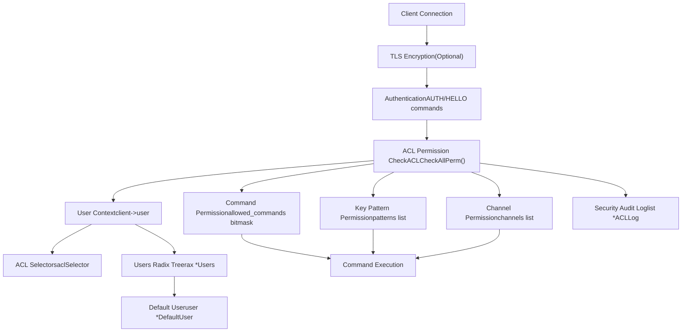
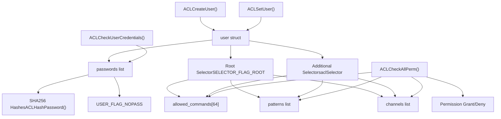
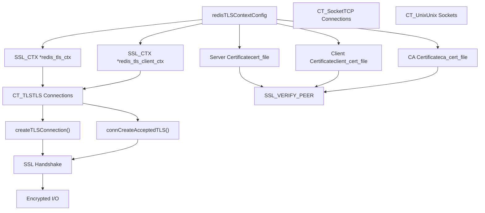

# Security

Relevant source files

-   [src/acl.c](https://github.com/redis/redis/blob/8ad54215/src/acl.c)
-   [src/anet.c](https://github.com/redis/redis/blob/8ad54215/src/anet.c)
-   [src/anet.h](https://github.com/redis/redis/blob/8ad54215/src/anet.h)
-   [src/connection.c](https://github.com/redis/redis/blob/8ad54215/src/connection.c)
-   [src/connection.h](https://github.com/redis/redis/blob/8ad54215/src/connection.h)
-   [src/socket.c](https://github.com/redis/redis/blob/8ad54215/src/socket.c)
-   [src/tls.c](https://github.com/redis/redis/blob/8ad54215/src/tls.c)
-   [src/unix.c](https://github.com/redis/redis/blob/8ad54215/src/unix.c)
-   [tests/assets/user.acl](https://github.com/redis/redis/blob/8ad54215/tests/assets/user.acl)
-   [tests/unit/acl-v2.tcl](https://github.com/redis/redis/blob/8ad54215/tests/unit/acl-v2.tcl)
-   [tests/unit/acl.tcl](https://github.com/redis/redis/blob/8ad54215/tests/unit/acl.tcl)
-   [tests/unit/introspection-2.tcl](https://github.com/redis/redis/blob/8ad54215/tests/unit/introspection-2.tcl)

## Purpose and Scope

This document covers Redis's comprehensive security framework, which provides authentication, authorization, and network protection capabilities. The security system consists of two primary components: Access Control Lists (ACLs) for user management and permissions, and network security features including TLS/SSL encryption.

For detailed information about user management and command/key permissions, see [Access Control Lists](/redis/redis/8.1-access-control-lists). For network encryption and certificate management, see [Network Security and TLS](/redis/redis/8.2-network-security-and-tls).

## Redis Security Architecture

Redis security is built around a layered approach that protects against unauthorized access at multiple levels: authentication, command authorization, key access control, and network encryption.


**Redis Security Architecture Overview**

Sources: [src/acl.c20-41](https://github.com/redis/redis/blob/8ad54215/src/acl.c#L20-L41) [src/tls.c41-42](https://github.com/redis/redis/blob/8ad54215/src/tls.c#L41-L42) [src/networking.c](https://github.com/redis/redis/blob/8ad54215/src/networking.c) [src/connection.c30-31](https://github.com/redis/redis/blob/8ad54215/src/connection.c#L30-L31)

## Access Control Lists (ACLs)

The ACL system provides granular control over user authentication and authorization. Each user can have multiple passwords, command permissions, key access patterns, and channel permissions organized through selectors.


**ACL System Components and Data Flow**

The ACL system maintains a global `Users` radix tree containing all user definitions. Each user has a list of selectors that define their permissions. The root selector provides backwards compatibility, while additional selectors enable complex permission schemes.

Sources: [src/acl.c420-442](https://github.com/redis/redis/blob/8ad54215/src/acl.c#L420-L442) [src/acl.c345-362](https://github.com/redis/redis/blob/8ad54215/src/acl.c#L345-L362) [src/acl.c504-518](https://github.com/redis/redis/blob/8ad54215/src/acl.c#L504-L518)

## Network Security and TLS

Redis supports TLS encryption for all connection types through the connection abstraction layer. TLS configuration includes certificate management, protocol version control, and client authentication options.


**TLS Connection Security Flow**

Sources: [src/tls.c180-255](https://github.com/redis/redis/blob/8ad54215/src/tls.c#L180-L255) [src/tls.c433-444](https://github.com/redis/redis/blob/8ad54215/src/tls.c#L433-L444) [src/tls.c467-496](https://github.com/redis/redis/blob/8ad54215/src/tls.c#L467-L496)

## Security Command Processing

Redis integrates security checks into every command execution path. The security validation occurs before command execution and logs security violations for auditing.

> **[Mermaid sequence]**
> *(图表结构无法解析)*

**Security-Integrated Command Processing**

Sources: [src/acl.c2447-2495](https://github.com/redis/redis/blob/8ad54215/src/acl.c#L2447-L2495) [src/acl.c2497-2565](https://github.com/redis/redis/blob/8ad54215/src/acl.c#L2497-L2565) [src/networking.c](https://github.com/redis/redis/blob/8ad54215/src/networking.c)

## Security Configuration and Management

### User Management

| Component | Purpose | Key Functions |
| --- | --- | --- |
| `Users` radix tree | Global user storage | `ACLCreateUser()`, `ACLFreeUser()` |
| `DefaultUser` | Fallback permissions | Configured at startup |
| Password management | Authentication credentials | `ACLHashPassword()`, cleartext support |

### Permission Models

| Permission Type | Scope | Configuration |
| --- | --- | --- |
| Command permissions | Individual commands or categories | `+command`, `-command`, `+@category` |
| Key patterns | Key access control | `~pattern`, `%R~pattern`, `%W~pattern` |
| Channel patterns | Pub/Sub authorization | `&pattern`, `resetchannels` |

### Security Configuration Files

Redis supports external ACL configuration through `.acl` files that define users and their permissions. The configuration is loaded at startup and can be reloaded dynamically.

Example ACL configuration structure:

```
user alice on allcommands allkeys &* >alice
user bob on -@all +@set +acl ~set* &* >bob
```
Sources: [tests/assets/user.acl1-4](https://github.com/redis/redis/blob/8ad54215/tests/assets/user.acl#L1-L4) [src/acl.c27-33](https://github.com/redis/redis/blob/8ad54215/src/acl.c#L27-L33) [src/server.c](https://github.com/redis/redis/blob/8ad54215/src/server.c)

The security system provides comprehensive protection while maintaining Redis's performance characteristics through efficient data structures and optimized permission checking algorithms.
