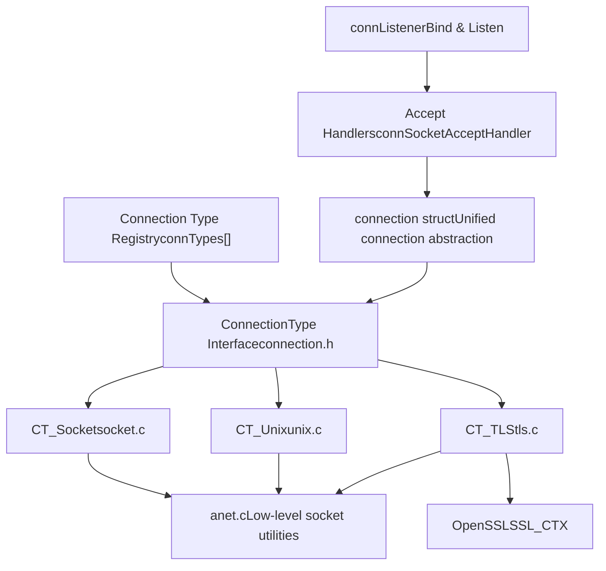
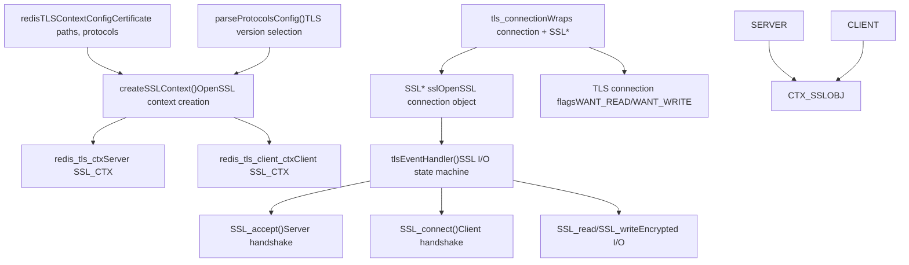
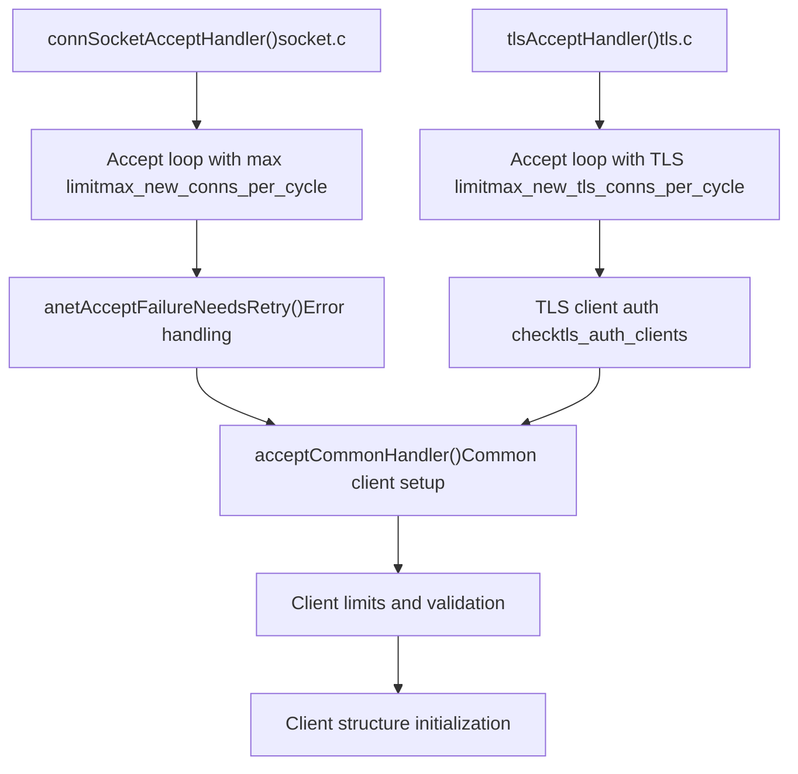

# Network Security and TLS

Relevant source files

-   [src/anet.c](https://github.com/redis/redis/blob/8ad54215/src/anet.c)
-   [src/anet.h](https://github.com/redis/redis/blob/8ad54215/src/anet.h)
-   [src/connection.c](https://github.com/redis/redis/blob/8ad54215/src/connection.c)
-   [src/connection.h](https://github.com/redis/redis/blob/8ad54215/src/connection.h)
-   [src/socket.c](https://github.com/redis/redis/blob/8ad54215/src/socket.c)
-   [src/tls.c](https://github.com/redis/redis/blob/8ad54215/src/tls.c)
-   [src/unix.c](https://github.com/redis/redis/blob/8ad54215/src/unix.c)

This document covers Redis's network security infrastructure and TLS (Transport Layer Security) implementation. It describes the connection abstraction layer, TLS encryption support using OpenSSL, certificate management, and secure connection handling.

For information about access control and user authentication, see [Access Control Lists](/redis/redis/8.1-access-control-lists). For general networking and client connection management, see [Client Connection Management](/redis/redis/2.2-client-connection-management).

## Connection Architecture Overview

Redis implements a pluggable connection architecture that supports multiple transport protocols through a unified interface. The system supports three main connection types: TCP sockets, Unix domain sockets, and TLS-encrypted connections.


Sources: [src/connection.h47-95](https://github.com/redis/redis/blob/8ad54215/src/connection.h#L47-L95) [src/connection.c30-59](https://github.com/redis/redis/blob/8ad54215/src/connection.c#L30-L59) [src/socket.c385-430](https://github.com/redis/redis/blob/8ad54215/src/socket.c#L385-L430) [src/unix.c169-214](https://github.com/redis/redis/blob/8ad54215/src/unix.c#L169-L214) [src/tls.c16-41](https://github.com/redis/redis/blob/8ad54215/src/tls.c#L16-L41)

The connection framework provides a type-safe abstraction where each connection type implements the `ConnectionType` interface. Connection types are registered at startup and can be looked up by name or cached for performance.

## TLS Implementation Architecture

Redis's TLS support is built on OpenSSL and provides full encryption capabilities for client-server and cluster communications. The implementation handles both server-side and client-side TLS contexts.


Sources: [src/tls.c180-255](https://github.com/redis/redis/blob/8ad54215/src/tls.c#L180-L255) [src/tls.c425-431](https://github.com/redis/redis/blob/8ad54215/src/tls.c#L425-L431) [src/tls.c498-531](https://github.com/redis/redis/blob/8ad54215/src/tls.c#L498-L531) [src/tls.c757-762](https://github.com/redis/redis/blob/8ad54215/src/tls.c#L757-L762)

The TLS implementation manages complex SSL state transitions and handles the asynchronous nature of SSL operations that may require multiple I/O operations to complete.

## TLS Connection Lifecycle

TLS connections follow a multi-stage lifecycle with distinct handshake phases and event-driven I/O handling:

> **[Mermaid stateDiagram]**
> *(图表结构无法解析)*

Sources: [src/tls.c640-751](https://github.com/redis/redis/blob/8ad54215/src/tls.c#L640-L751) [src/tls.c835-862](https://github.com/redis/redis/blob/8ad54215/src/tls.c#L835-L862) [src/tls.c864-883](https://github.com/redis/redis/blob/8ad54215/src/tls.c#L864-L883)

The state machine handles the complexities of SSL handshakes where operations may need to block for opposite I/O directions (e.g., a write operation may need to wait for socket readability).

## Network Security Features

### Protocol Support and Configuration

Redis TLS supports multiple protocol versions with configurable security parameters:

| Feature | Implementation | Configuration |
| --- | --- | --- |
| **TLS Versions** | TLSv1, TLSv1.1, TLSv1.2, TLSv1.3 | `tls-protocols` config |
| **Default Protocol** | TLSv1.2 + TLSv1.3 | `REDIS_TLS_PROTO_DEFAULT` |
| **Cipher Suites** | OpenSSL cipher list | `tls-ciphers` config |
| **TLSv1.3 Ciphersuites** | OpenSSL ciphersuites | `tls-ciphersuites` config |
| **Client Authentication** | None, Optional, Required | `tls-auth-clients` config |

Sources: [src/tls.c29-39](https://github.com/redis/redis/blob/8ad54215/src/tls.c#L29-L39) [src/tls.c44-77](https://github.com/redis/redis/blob/8ad54215/src/tls.c#L44-L77) [src/tls.c238-248](https://github.com/redis/redis/blob/8ad54215/src/tls.c#L238-L248)

### Certificate and Key Management

The TLS implementation supports separate server and client certificates with password-protected private keys:

```mermaid
flowchart TD
    CERT["tls-cert-fileServer certificate"]
    KEY["tls-key-fileServer private key"]
    KEYPASS["tls-key-file-passKey password"]
    CLIENTCERT["tls-client-cert-fileClient certificate"]
    CLIENTKEY["tls-client-key-fileClient private key"]
    CLIENTPASS["tls-client-key-file-passClient key password"]
    CAFILE["tls-ca-cert-fileCA certificate file"]
    CADIR["tls-ca-cert-dirCA certificate directory"]
    DHPARAMS["tls-dh-params-fileDiffie-Hellman parameters"]
    SSL_CTX_use_certificate_chain_file["SSL_CTX_use_certificate_chain_file"]
    SSL_CTX_use_PrivateKey_file["SSL_CTX_use_PrivateKey_file"]
    tlsPasswordCallback["tlsPasswordCallback"]
    SSL_CTX_load_verify_locations["SSL_CTX_load_verify_locations"]
    SSL_CTX_set0_tmp_dh_pkey["SSL_CTX_set0_tmp_dh_pkey"]

    CERT --> SSL_CTX_use_certificate_chain_file
    KEY --> SSL_CTX_use_PrivateKey_file
    KEYPASS --> tlsPasswordCallback
    CLIENTCERT --> SSL_CTX_use_certificate_chain_file
    CLIENTKEY --> SSL_CTX_use_PrivateKey_file
    CLIENTPASS --> tlsPasswordCallback
    CAFILE --> SSL_CTX_load_verify_locations
    CADIR --> SSL_CTX_load_verify_locations
    DHPARAMS --> SSL_CTX_set0_tmp_dh_pkey
```


Sources: [src/tls.c180-184](https://github.com/redis/redis/blob/8ad54215/src/tls.c#L180-L184) [src/tls.c219-236](https://github.com/redis/redis/blob/8ad54215/src/tls.c#L219-L236) [src/tls.c317-371](https://github.com/redis/redis/blob/8ad54215/src/tls.c#L317-L371) [src/tls.c162-175](https://github.com/redis/redis/blob/8ad54215/src/tls.c#L162-L175)

### Session Management

TLS sessions can be cached for performance with configurable parameters:

-   **Session Caching**: Enabled/disabled via `tls-session-caching`
-   **Cache Size**: Configured via `tls-session-cache-size`
-   **Cache Timeout**: Configured via `tls-session-cache-timeout`

Sources: [src/tls.c296-303](https://github.com/redis/redis/blob/8ad54215/src/tls.c#L296-L303)

## Network Utilities and Socket Security

The `anet.c` module provides low-level network utilities with security-relevant features:

### Socket Security Features

| Feature | Function | Purpose |
| --- | --- | --- |
| **Non-blocking I/O** | `anetNonBlock()` | Prevents blocking attacks |
| **Close-on-exec** | `anetCloexec()` | Prevents fd leaks to child processes |
| **TCP Keep-alive** | `anetKeepAlive()` | Detects dead connections |
| **TCP No-delay** | `anetEnableTcpNoDelay()` | Reduces latency |
| **Timeouts** | `anetSendTimeout()`, `anetRecvTimeout()` | Prevents DoS via slow connections |

Sources: [src/anet.c54-80](https://github.com/redis/redis/blob/8ad54215/src/anet.c#L54-L80) [src/anet.c93-111](https://github.com/redis/redis/blob/8ad54215/src/anet.c#L93-L111) [src/anet.c115-255](https://github.com/redis/redis/blob/8ad54215/src/anet.c#L115-L255) [src/anet.c257-275](https://github.com/redis/redis/blob/8ad54215/src/anet.c#L257-L275) [src/anet.c277-303](https://github.com/redis/redis/blob/8ad54215/src/anet.c#L277-L303)

### Connection Accept Handling

The accept handlers implement security measures for incoming connections:


Sources: [src/socket.c301-321](https://github.com/redis/redis/blob/8ad54215/src/socket.c#L301-L321) [src/tls.c764-784](https://github.com/redis/redis/blob/8ad54215/src/tls.c#L764-L784) [src/anet.c798-813](https://github.com/redis/redis/blob/8ad54215/src/anet.c#L798-L813)

## Connection Type Registration and Lookup

The connection framework provides a registry system for managing different connection types:

### Registration Process

Connection types are registered at server startup through the initialization sequence:

| Connection Type | Registration Function | Required |
| --- | --- | --- |
| **TCP Socket** | `RedisRegisterConnectionTypeSocket()` | Yes |
| **Unix Socket** | `RedisRegisterConnectionTypeUnix()` | Yes |
| **TLS** | `RedisRegisterConnectionTypeTLS()` | Optional |

Sources: [src/connection.c61-72](https://github.com/redis/redis/blob/8ad54215/src/connection.c#L61-L72) [src/socket.c465-468](https://github.com/redis/redis/blob/8ad54215/src/socket.c#L465-L468) [src/unix.c216-219](https://github.com/redis/redis/blob/8ad54215/src/unix.c#L216-L219)

### Lookup and Caching

Fast lookup mechanisms are provided for common connection types:

```
ConnectionType *connectionTypeTcp(void);  // Cached TCP lookup
ConnectionType *connectionTypeTls(void);  // Cached TLS lookup
ConnectionType *connectionTypeUnix(void); // Cached Unix lookup
```
Sources: [src/connection.c92-128](https://github.com/redis/redis/blob/8ad54215/src/connection.c#L92-L128)

The TLS connection type lookup handles the case where TLS may not be available (when built without OpenSSL support), providing graceful degradation.
