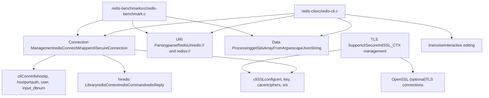

# Client Tools

Relevant source files

-   [src/cli\_common.c](https://github.com/redis/redis/blob/8ad54215/src/cli_common.c)
-   [src/cli\_common.h](https://github.com/redis/redis/blob/8ad54215/src/cli_common.h)
-   [src/redis-benchmark.c](https://github.com/redis/redis/blob/8ad54215/src/redis-benchmark.c)
-   [src/redis-cli.c](https://github.com/redis/redis/blob/8ad54215/src/redis-cli.c)
-   [tests/integration/redis-benchmark.tcl](https://github.com/redis/redis/blob/8ad54215/tests/integration/redis-benchmark.tcl)
-   [tests/integration/redis-cli.tcl](https://github.com/redis/redis/blob/8ad54215/tests/integration/redis-cli.tcl)
-   [tests/support/benchmark.tcl](https://github.com/redis/redis/blob/8ad54215/tests/support/benchmark.tcl)
-   [tests/unit/limits.tcl](https://github.com/redis/redis/blob/8ad54215/tests/unit/limits.tcl)

Client Tools provides command-line utilities for interacting with and testing Redis servers. This system consists of two primary tools: the interactive `redis-cli` command-line interface for direct Redis interaction and administration, and the `redis-benchmark` performance testing tool for measuring Redis server performance.

These tools share common infrastructure for connection management, authentication, and protocol handling, making them consistent and reliable for Redis operations.

For detailed information about the tools and their implementation, see [Redis CLI and Benchmark Tools](/redis/redis/9.1-redis-cli-and-benchmark-tools).

## Overview of Client Tools

### Redis CLI (`redis-cli`)

The primary command-line interface for Redis, implemented in [src/redis-cli.c](https://github.com/redis/redis/blob/8ad54215/src/redis-cli.c) providing:

-   **Interactive Mode**: Full-featured REPL with command history, tab completion, and inline hints
-   **Non-interactive Mode**: Single command execution for scripting
-   **Specialized Modes**: Monitoring, pub/sub, cluster management, replica synchronization
-   **Output Formats**: Standard, raw, CSV, JSON for different use cases
-   **Cluster Management**: Built-in cluster administration tools

### Redis Benchmark (`redis-benchmark`)

A performance testing tool implemented in [src/redis-benchmark.c](https://github.com/redis/redis/blob/8ad54215/src/redis-benchmark.c) offering:

-   **Load Generation**: Configurable client connections, request pipelines, and threading
-   **Test Scenarios**: Built-in benchmarks for common Redis operations
-   **Metrics Collection**: Latency histograms and throughput measurements
-   **Cluster Support**: Distributed testing across cluster nodes
-   **Custom Commands**: Ability to benchmark arbitrary Redis commands

## Shared Infrastructure

Both tools utilize common functionality through `cli_common.c` and `cli_common.h`:

| Component | Purpose | Key Functions |
| --- | --- | --- |
| Connection Management | Server connectivity | `redisConnectWrapper()`, `cliSecureConnection()` |
| URI Support | Connection strings | `parseRedisUri()` for `redis://` and `rediss://` URIs |
| Authentication | Security integration | User/password handling, TLS certificate management |
| Data Processing | Input/output handling | `getSdsArrayFromArgv()`, `escapeJsonString()` |
| Version Info | Build metadata | `cliVersion()` with git commit information |

**Sources:** [src/redis-cli.c1-50](https://github.com/redis/redis/blob/8ad54215/src/redis-cli.c#L1-L50) [src/redis-benchmark.c1-50](https://github.com/redis/redis/blob/8ad54215/src/redis-benchmark.c#L1-L50) [src/cli\_common.c1-50](https://github.com/redis/redis/blob/8ad54215/src/cli_common.c#L1-L50) [src/cli\_common.h1-59](https://github.com/redis/redis/blob/8ad54215/src/cli_common.h#L1-L59)

## Architecture Overview

Client Tools Architecture


The architecture separates tool-specific functionality from shared infrastructure, allowing both tools to benefit from common connection handling, authentication, and data processing capabilities.

**Sources:** [src/redis-cli.c30-50](https://github.com/redis/redis/blob/8ad54215/src/redis-cli.c#L30-L50) [src/redis-benchmark.c25-50](https://github.com/redis/redis/blob/8ad54215/src/redis-benchmark.c#L25-L50) [src/cli\_common.c1-50](https://github.com/redis/redis/blob/8ad54215/src/cli_common.c#L1-L50) [src/cli\_common.h1-35](https://github.com/redis/redis/blob/8ad54215/src/cli_common.h#L1-L35)

## Connection and Protocol Support

The client tools support multiple connection types and output formats for different use cases:

### Connection Types

-   **TCP/IP**: Standard Redis server connections via `redisConnect()`
-   **Unix Sockets**: Local connections via `redisConnectUnix()`
-   **TLS/SSL**: Secure connections using OpenSSL integration
-   **URI Format**: Support for `redis://` and `rediss://` connection strings

### Output Formats

Both tools support multiple output modes for different scenarios:

| Format | Purpose | Implementation |
| --- | --- | --- |
| Standard | Interactive TTY use | Formatted with colors and structure |
| Raw | Shell scripting | Plain text without formatting |
| CSV | Data processing | Comma-separated values |
| JSON | API integration | RFC 7159 compliant JSON via `escapeJsonString()` |

The tools automatically detect TTY vs non-TTY environments and adjust output accordingly.

**Sources:** [src/redis-cli.c52-56](https://github.com/redis/redis/blob/8ad54215/src/redis-cli.c#L52-L56) [src/cli\_common.c294-362](https://github.com/redis/redis/blob/8ad54215/src/cli_common.c#L294-L362) [src/cli\_common.c374-393](https://github.com/redis/redis/blob/8ad54215/src/cli_common.c#L374-L393)

## Version and Build Information

Both tools provide version information through the common infrastructure:

```
sds cliVersion(void) {
    sds version = sdscatprintf(sdsempty(), "%s", REDIS_VERSION);

    /* Add git commit and working tree status when available. */
    if (strtoll(redisGitSHA1(),NULL,16)) {
        version = sdscatprintf(version, " (git:%s", redisGitSHA1());
        if (strtoll(redisGitDirty(),NULL,10))
            version = sdscatprintf(version, "-dirty");
        version = sdscat(version, ")");
    }
    return version;
}
```
**Sources:** [src/cli\_common.c395-406](https://github.com/redis/redis/blob/8ad54215/src/cli_common.c#L395-L406)

## Testing Infrastructure

The client tools have extensive test coverage through integration tests that verify functionality across different scenarios:

-   **CLI Tests**: Interactive and non-interactive modes, output formatting, subscriptions, authentication
-   **Benchmark Tests**: Performance measurement accuracy, multi-threading, cluster support, various workloads
-   **Common Infrastructure Tests**: Connection handling, TLS support, URI parsing

**Sources:** [tests/integration/redis-cli.tcl1-50](https://github.com/redis/redis/blob/8ad54215/tests/integration/redis-cli.tcl#L1-L50) [tests/integration/redis-benchmark.tcl1-50](https://github.com/redis/redis/blob/8ad54215/tests/integration/redis-benchmark.tcl#L1-L50) [tests/support/benchmark.tcl1-34](https://github.com/redis/redis/blob/8ad54215/tests/support/benchmark.tcl#L1-L34)
