# Position and State Management

Relevant source files

-   [src/position.cpp](https://github.com/official-stockfish/Stockfish/blob/c27c1747/src/position.cpp)
-   [src/position.h](https://github.com/official-stockfish/Stockfish/blob/c27c1747/src/position.h)

This document details the `Position` class and `StateInfo` structures that manage chess game state in Stockfish. The `Position` class provides the central board representation with methods for move execution (`do_move`/`undo_move`), Zobrist hashing for position identification, and incremental state updates. For low-level bitboard operations, see page 3.2. For move generation, see page 3.3.

## Position Class Data Members

The `Position` class maintains redundant board representations for fast queries. The class stores the board state in multiple formats to optimize different access patterns:

**Position Class Data Members Diagram**

```mermaid
flowchart TD
    Position["Position class[src/position.h:76]"]
    board["std::array<Piece, SQUARE_NB> boardSquare-indexed piece array"]
    byTypeBB["std::array<Bitboard, PIECE_TYPE_NB> byTypeBBBitboards indexed by piece type"]
    byColorBB["std::array<Bitboard, COLOR_NB> byColorBBBitboards indexed by color"]
    pieceCount["int pieceCount[PIECE_NB]Count of each piece type"]
    castlingRightsMask["int castlingRightsMask[SQUARE_NB]Rights lost when square changes"]
    castlingRookSquare["Square castlingRookSquare[CASTLING_RIGHT_NB]Initial rook positions"]
    castlingPath["Bitboard castlingPath[CASTLING_RIGHT_NB]Squares that must be empty"]
    st["StateInfo* stPointer to current state"]
    gamePly["int gamePlyHalf-moves from start"]
    sideToMove["Color sideToMoveWHITE or BLACK"]
    chess960["bool chess960Chess960 mode flag"]

    Position --> board
    Position --> byTypeBB
    Position --> byColorBB
    Position --> pieceCount
    Position --> castlingRightsMask
    Position --> castlingRookSquare
    Position --> castlingPath
    Position --> st
    Position --> gamePly
    Position --> sideToMove
    Position --> chess960
```
**Sources:** [src/position.h195-206](https://github.com/official-stockfish/Stockfish/blob/c27c1747/src/position.h#L195-L206)

## StateInfo Structure and State Chain

The `StateInfo` structure stores position state that changes with each move. These structures form a linked chain via the `previous` pointer, enabling efficient undo operations without recomputation.

**StateInfo Structure Diagram**

```mermaid
flowchart TD
    StateInfo["StateInfo struct[src/position.h:40]"]
    materialKey["Key materialKeyMaterial configuration hash"]
    pawnKey["Key pawnKeyPawn structure hash"]
    minorPieceKey["Key minorPieceKeyKnights and bishops hash"]
    nonPawnKey["Key nonPawnKey[COLOR_NB]Non-pawn pieces by color"]
    nonPawnMaterial["Value nonPawnMaterial[COLOR_NB]Material value excluding pawns"]
    castlingRights["int castlingRightsCastling rights bitfield"]
    rule50["int rule50Halfmove clock"]
    pliesFromNull["int pliesFromNullPlies since null move"]
    epSquare["Square epSquareEn passant target square"]
    key["Key keyFull position hash (Zobrist)"]
    checkersBB["Bitboard checkersBBPieces giving check"]
    previous["StateInfo* previousPrevious state in chain"]
    blockersForKing["Bitboard blockersForKing[COLOR_NB]Pieces blocking checks"]
    pinners["Bitboard pinners[COLOR_NB]Pieces pinning opponent pieces"]
    checkSquares["Bitboard checkSquares[PIECE_TYPE_NB]Squares where piece type gives check"]
    capturedPiece["Piece capturedPiecePiece captured by last move"]
    repetition["int repetitionRepetition distance"]

    StateInfo --> materialKey
    StateInfo --> pawnKey
    StateInfo --> minorPieceKey
    StateInfo --> nonPawnKey
    StateInfo --> nonPawnMaterial
    StateInfo --> castlingRights
    StateInfo --> rule50
    StateInfo --> pliesFromNull
    StateInfo --> epSquare
    StateInfo --> key
    StateInfo --> checkersBB
    StateInfo --> previous
    StateInfo --> blockersForKing
    StateInfo --> pinners
    StateInfo --> checkSquares
    StateInfo --> capturedPiece
    StateInfo --> repetition
```
**Sources:** [src/position.h40-62](https://github.com/official-stockfish/Stockfish/blob/c27c1747/src/position.h#L40-L62)

### StateInfo Chain Mechanism

The `StateInfo` chain enables O(1) undo operations by preserving previous states:

**StateInfo Chain Diagram**

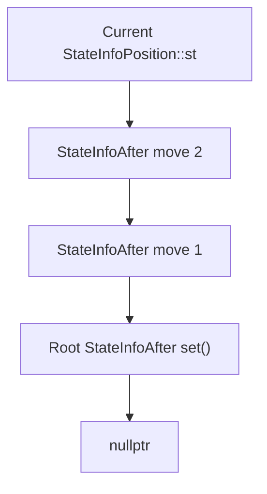
When `do_move()` is called, it copies the fields up to `offsetof(StateInfo, key)` from the previous state [src/position.cpp704](https://github.com/official-stockfish/Stockfish/blob/c27c1747/src/position.cpp#L704-L704) then recomputes the remaining fields. The `undo_move()` function simply resets `st = st->previous` [src/position.cpp1034](https://github.com/official-stockfish/Stockfish/blob/c27c1747/src/position.cpp#L1034-L1034)

**Sources:** [src/position.h56](https://github.com/official-stockfish/Stockfish/blob/c27c1747/src/position.h#L56-L56) [src/position.cpp704](https://github.com/official-stockfish/Stockfish/blob/c27c1747/src/position.cpp#L704-L704) [src/position.cpp1034](https://github.com/official-stockfish/Stockfish/blob/c27c1747/src/position.cpp#L1034-L1034)

## Position Public Interface

The `Position` class provides methods organized into logical categories:

| Category | Methods | Description |
| --- | --- | --- |
| **Initialization** | `init()` [src/position.cpp114](https://github.com/official-stockfish/Stockfish/blob/c27c1747/src/position.cpp#L114-L114) `set()` [src/position.cpp163](https://github.com/official-stockfish/Stockfish/blob/c27c1747/src/position.cpp#L163-L163) | Static initialization of Zobrist keys and cuckoo tables; FEN parsing |
| **Queries** | `pieces()` [src/position.h224](https://github.com/official-stockfish/Stockfish/blob/c27c1747/src/position.h#L224-L224) `piece_on()` [src/position.h213](https://github.com/official-stockfish/Stockfish/blob/c27c1747/src/position.h#L213-L213) `empty()` [src/position.h220](https://github.com/official-stockfish/Stockfish/blob/c27c1747/src/position.h#L220-L220) | Access board state via array or bitboards |
| **Move Operations** | `do_move()` [src/position.cpp691](https://github.com/official-stockfish/Stockfish/blob/c27c1747/src/position.cpp#L691-L691) `undo_move()` [src/position.cpp980](https://github.com/official-stockfish/Stockfish/blob/c27c1747/src/position.cpp#L980-L980) `do_null_move()` [src/position.cpp1175](https://github.com/official-stockfish/Stockfish/blob/c27c1747/src/position.cpp#L1175-L1175) | Execute and retract moves |
| **Move Validation** | `legal()` [src/position.cpp508](https://github.com/official-stockfish/Stockfish/blob/c27c1747/src/position.cpp#L508-L508) `pseudo_legal()` [src/position.cpp569](https://github.com/official-stockfish/Stockfish/blob/c27c1747/src/position.cpp#L569-L569) `gives_check()` [src/position.cpp640](https://github.com/official-stockfish/Stockfish/blob/c27c1747/src/position.cpp#L640-L640) | Verify move legality |
| **Attack Detection** | `attackers_to()` [src/position.cpp487](https://github.com/official-stockfish/Stockfish/blob/c27c1747/src/position.cpp#L487-L487) `checkers()` [src/position.h286](https://github.com/official-stockfish/Stockfish/blob/c27c1747/src/position.h#L286-L286) `blockers_for_king()` [src/position.h288](https://github.com/official-stockfish/Stockfish/blob/c27c1747/src/position.h#L288-L288) | Compute attacks and check status |
| **Evaluation Support** | `see_ge()` [src/position.cpp1219](https://github.com/official-stockfish/Stockfish/blob/c27c1747/src/position.cpp#L1219-L1219) `non_pawn_material()` [src/position.h308](https://github.com/official-stockfish/Stockfish/blob/c27c1747/src/position.h#L308-L308) | Static exchange evaluation, material |
| **Draw Detection** | `is_draw()` [src/position.cpp1325](https://github.com/official-stockfish/Stockfish/blob/c27c1747/src/position.cpp#L1325-L1325) `is_repetition()` [src/position.cpp1335](https://github.com/official-stockfish/Stockfish/blob/c27c1747/src/position.cpp#L1335-L1335) `upcoming_repetition()` [src/position.cpp1356](https://github.com/official-stockfish/Stockfish/blob/c27c1747/src/position.cpp#L1356-L1356) | Repetition and 50-move rule |
| **Hash Keys** | `key()` [src/position.h294](https://github.com/official-stockfish/Stockfish/blob/c27c1747/src/position.h#L294-L294) `pawn_key()` [src/position.h300](https://github.com/official-stockfish/Stockfish/blob/c27c1747/src/position.h#L300-L300) `material_key()` [src/position.h302](https://github.com/official-stockfish/Stockfish/blob/c27c1747/src/position.h#L302-L302) | Access various hash keys |

**Sources:** [src/position.h78-166](https://github.com/official-stockfish/Stockfish/blob/c27c1747/src/position.h#L78-L166) [src/position.cpp114-1485](https://github.com/official-stockfish/Stockfish/blob/c27c1747/src/position.cpp#L114-L1485)

## FEN Parsing and Position Setup

The `Position::set()` method parses FEN strings to initialize board state. FEN (Forsyth-Edwards Notation) is a standard notation for describing chess positions.

### FEN Format

A FEN string contains six space-separated fields:

1.  **Piece placement**: Ranks 8-1, files a-h, with digits for empty squares and `/` between ranks
2.  **Active color**: `w` for White, `b` for Black
3.  **Castling rights**: `K` (White kingside), `Q` (White queenside), `k` (Black kingside), `q` (Black queenside), or `-`
4.  **En passant square**: Target square in algebraic notation, or `-`
5.  **Halfmove clock**: Number of halfmoves since last pawn move or capture
6.  **Fullmove number**: Starting at 1, incremented after Black's move

**Position::set() Process Diagram**

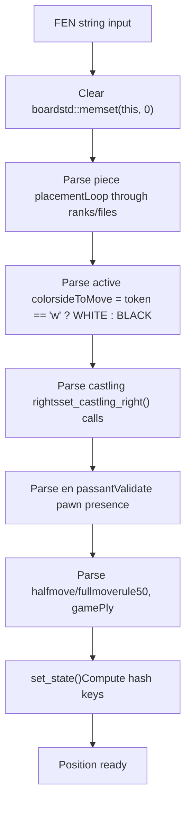
The parsing handles three FEN standards: normal FEN, Shredder-FEN (uses file letters for rooks), and X-FEN (extended FEN for Chess960).

**Sources:** [src/position.cpp163-295](https://github.com/official-stockfish/Stockfish/blob/c27c1747/src/position.cpp#L163-L295) [src/position.cpp300-314](https://github.com/official-stockfish/Stockfish/blob/c27c1747/src/position.cpp#L300-L314) [src/position.cpp337-382](https://github.com/official-stockfish/Stockfish/blob/c27c1747/src/position.cpp#L337-L382)

## Move Execution: do\_move()

The `do_move()` method [src/position.cpp691-975](https://github.com/official-stockfish/Stockfish/blob/c27c1747/src/position.cpp#L691-L975) executes a move and updates position state. It returns `DirtyBoardData` for NNUE incremental updates.

**do\_move() Execution Flow Diagram**

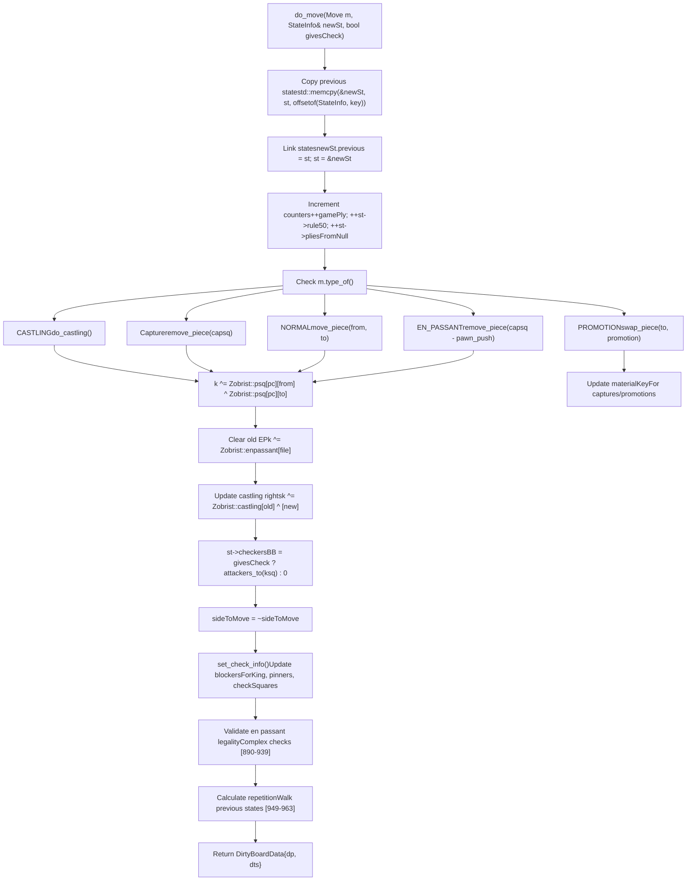
### Move Type Handling

The `do_move()` function handles four move types via `m.type_of()`:

| Move Type | Handling | Code Reference |
| --- | --- | --- |
| `NORMAL` | `move_piece(from, to)` or `swap_piece(to, pc)` if capture | [src/position.cpp814-823](https://github.com/official-stockfish/Stockfish/blob/c27c1747/src/position.cpp#L814-L823) |
| `PROMOTION` | `swap_piece(to, promotion)`, update material keys | [src/position.cpp832-857](https://github.com/official-stockfish/Stockfish/blob/c27c1747/src/position.cpp#L832-L857) |
| `EN_PASSANT` | Capture square is `to - pawn_push(us)`, not `to` | [src/position.cpp757-770](https://github.com/official-stockfish/Stockfish/blob/c27c1747/src/position.cpp#L757-L770) |
| `CASTLING` | Call `do_castling<true>()`, handle overlapping squares in Chess960 | [src/position.cpp737-748](https://github.com/official-stockfish/Stockfish/blob/c27c1747/src/position.cpp#L737-L748) |

**Sources:** [src/position.cpp691-975](https://github.com/official-stockfish/Stockfish/blob/c27c1747/src/position.cpp#L691-L975)

## Move Retraction: undo\_move()

The `undo_move()` method [src/position.cpp980-1038](https://github.com/official-stockfish/Stockfish/blob/c27c1747/src/position.cpp#L980-L1038) reverses a move by restoring piece positions and resetting the state pointer to the previous state.

**undo\_move() Process Diagram**

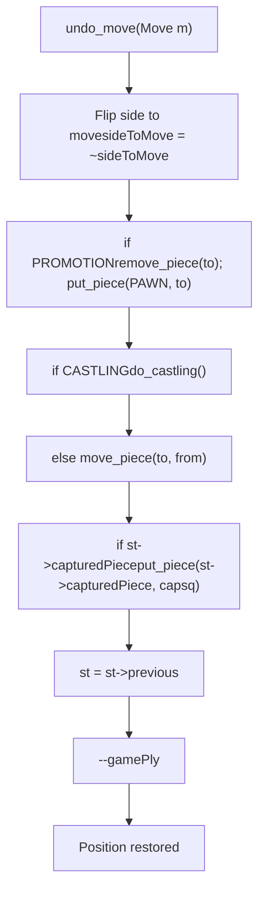
The undo operation is O(1) because all previous state is preserved in the `StateInfo` chain. No recomputation of hash keys, checkers, or blockers is needed.

**Sources:** [src/position.cpp980-1038](https://github.com/official-stockfish/Stockfish/blob/c27c1747/src/position.cpp#L980-L1038)

## Null Move Operations

Null moves are used in null move pruning during search. They flip the side to move without executing any board changes.

**do\_null\_move() Implementation**

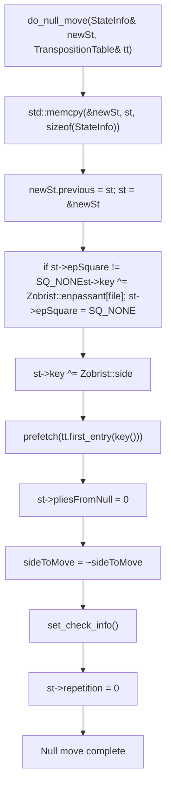
The `undo_null_move()` [src/position.cpp1207-1213](https://github.com/official-stockfish/Stockfish/blob/c27c1747/src/position.cpp#L1207-L1213) simply resets `st = st->previous` and `sideToMove = ~sideToMove`.

**Sources:** [src/position.cpp1175-1203](https://github.com/official-stockfish/Stockfish/blob/c27c1747/src/position.cpp#L1175-L1203) [src/position.cpp1207-1213](https://github.com/official-stockfish/Stockfish/blob/c27c1747/src/position.cpp#L1207-L1213)

## Zobrist Hashing System

Stockfish uses Zobrist hashing to generate unique position identifiers (hash keys) for transposition table lookups. The hash is computed incrementally as moves are made.

### Zobrist Key Tables

The `Zobrist` namespace [src/position.cpp45-52](https://github.com/official-stockfish/Stockfish/blob/c27c1747/src/position.cpp#L45-L52) contains pseudo-random keys initialized by `Position::init()` [src/position.cpp114-157](https://github.com/official-stockfish/Stockfish/blob/c27c1747/src/position.cpp#L114-L157):

**Zobrist Key Components**

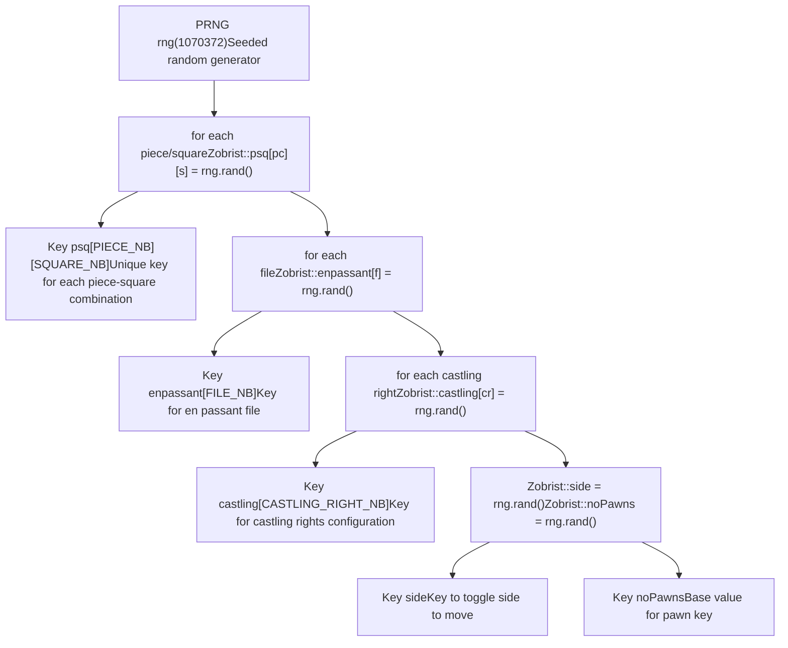
**Sources:** [src/position.cpp45-52](https://github.com/official-stockfish/Stockfish/blob/c27c1747/src/position.cpp#L45-L52) [src/position.cpp114-132](https://github.com/official-stockfish/Stockfish/blob/c27c1747/src/position.cpp#L114-L132)

### Hash Key Types in StateInfo

The `StateInfo` structure maintains multiple specialized hash keys:

| Hash Key | Purpose | Updated When |
| --- | --- | --- |
| `key` | Full position hash (Zobrist) | Every move, XORing piece moves, side, castling, EP |
| `materialKey` | Material configuration | Captures and promotions |
| `pawnKey` | Pawn structure | Pawn moves and captures |
| `minorPieceKey` | Knights and bishops | Minor piece moves/captures |
| `nonPawnKey[COLOR_NB]` | Non-pawn pieces by color | Non-pawn moves/captures |

### Incremental Hash Updates

During `do_move()`, the hash key is updated incrementally using XOR operations [src/position.cpp796-877](https://github.com/official-stockfish/Stockfish/blob/c27c1747/src/position.cpp#L796-L877) XOR is used because it's reversible: `A ^ B ^ B = A`.

**Hash Update Process in do\_move()**

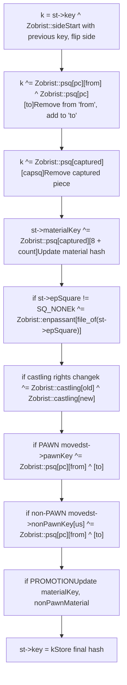
The `adjust_key50()` method [src/position.h296-298](https://github.com/official-stockfish/Stockfish/blob/c27c1747/src/position.h#L296-L298) modifies the key based on the 50-move rule counter to differentiate positions with different rule50 values:

```
Key adjust_key50(Key k) const {
    return st->rule50 < 14 ? k : k ^ make_key((st->rule50 - 14) / 8);
}
```
This ensures that positions with different 50-move counters have different hash keys, preventing premature draw claims.

**Sources:** [src/position.cpp699](https://github.com/official-stockfish/Stockfish/blob/c27c1747/src/position.cpp#L699-L699) [src/position.cpp796](https://github.com/official-stockfish/Stockfish/blob/c27c1747/src/position.cpp#L796-L796) [src/position.cpp771](https://github.com/official-stockfish/Stockfish/blob/c27c1747/src/position.cpp#L771-L771) [src/position.cpp799-811](https://github.com/official-stockfish/Stockfish/blob/c27c1747/src/position.cpp#L799-L811) [src/position.cpp849-871](https://github.com/official-stockfish/Stockfish/blob/c27c1747/src/position.cpp#L849-L871) [src/position.h296-298](https://github.com/official-stockfish/Stockfish/blob/c27c1747/src/position.h#L296-L298)

## Repetition Detection with Cuckoo Algorithm

Stockfish uses Marcel van Kervinck's cuckoo algorithm [src/position.cpp100-111](https://github.com/official-stockfish/Stockfish/blob/c27c1747/src/position.cpp#L100-L111) to efficiently detect 3-fold repetition draws. The algorithm pre-computes all possible reversible moves and stores them in cuckoo hash tables.

### Cuckoo Hash Tables

The cuckoo tables are initialized in `Position::init()` [src/position.cpp134-156](https://github.com/official-stockfish/Stockfish/blob/c27c1747/src/position.cpp#L134-L156) by iterating over all piece-square pairs and storing reversible (non-pawn) moves:

**Cuckoo Table Structure**

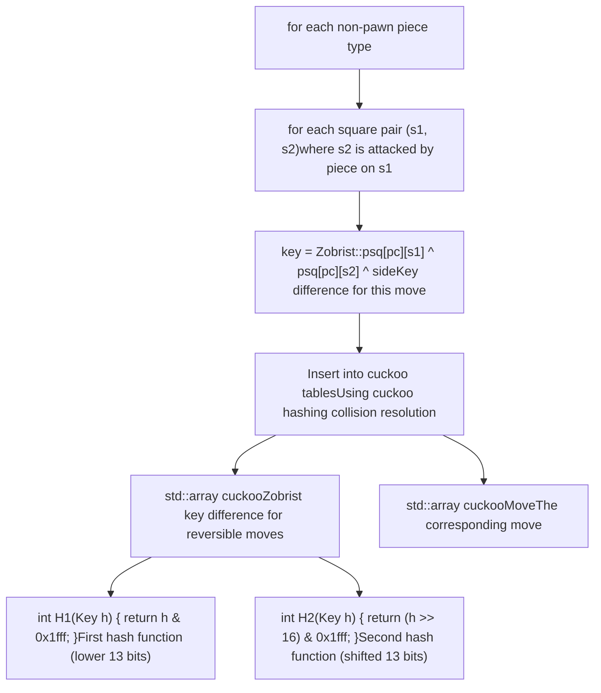
The initialization creates 3668 entries [src/position.cpp156](https://github.com/official-stockfish/Stockfish/blob/c27c1747/src/position.cpp#L156-L156) Cuckoo hashing handles collisions by moving entries to alternative locations using the two hash functions.

**Sources:** [src/position.cpp106-111](https://github.com/official-stockfish/Stockfish/blob/c27c1747/src/position.cpp#L106-L111) [src/position.cpp134-156](https://github.com/official-stockfish/Stockfish/blob/c27c1747/src/position.cpp#L134-L156)

### Repetition Detection Methods

Stockfish provides three methods for checking repetitions:

| Method | Purpose | Code Reference |
| --- | --- | --- |
| `is_repetition(int ply)` | Returns true if position repeats before ply | [src/position.cpp1335](https://github.com/official-stockfish/Stockfish/blob/c27c1747/src/position.cpp#L1335-L1335) |
| `has_repeated()` | Returns true if any repetition since last irreversible move | [src/position.cpp1339-1351](https://github.com/official-stockfish/Stockfish/blob/c27c1747/src/position.cpp#L1339-L1351) |
| `upcoming_repetition(int ply)` | Detects if a reversible move leads to repetition | [src/position.cpp1356-1398](https://github.com/official-stockfish/Stockfish/blob/c27c1747/src/position.cpp#L1356-L1398) |

### upcoming\_repetition() Algorithm

The `upcoming_repetition()` method uses the cuckoo tables to detect if any legal move would cause a repetition:

**upcoming\_repetition() Process Diagram**

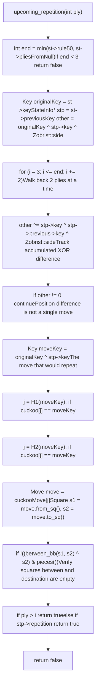
The algorithm works by:

1.  XORing consecutive state keys to track cumulative position changes
2.  When `other` becomes zero, only a single reversible move differs
3.  Computing the move key and looking it up in cuckoo tables
4.  Verifying the move path is clear
5.  Checking if repetition occurs before or after root based on ply

**Sources:** [src/position.cpp1356-1398](https://github.com/official-stockfish/Stockfish/blob/c27c1747/src/position.cpp#L1356-L1398)

### Repetition Tracking in do\_move()

During `do_move()`, repetitions are detected by walking backwards through the state chain [src/position.cpp949-963](https://github.com/official-stockfish/Stockfish/blob/c27c1747/src/position.cpp#L949-L963):

```
st->repetition = 0;
int end = std::min(st->rule50, st->pliesFromNull);
if (end >= 4) {
    StateInfo* stp = st->previous->previous;
    for (int i = 4; i <= end; i += 2) {
        stp = stp->previous->previous;
        if (stp->key == st->key) {
            st->repetition = stp->repetition ? -i : i;
            break;
        }
    }
}
```
The `repetition` field stores:

-   Positive value: ply distance to first occurrence
-   Negative value: ply distance to second occurrence (3-fold)
-   Zero: no repetition

**Sources:** [src/position.cpp949-963](https://github.com/official-stockfish/Stockfish/blob/c27c1747/src/position.cpp#L949-L963) [src/position.cpp1335](https://github.com/official-stockfish/Stockfish/blob/c27c1747/src/position.cpp#L1335-L1335)

## Position Validation and Debugging

The position management system includes comprehensive validation for debugging and integrity checking:

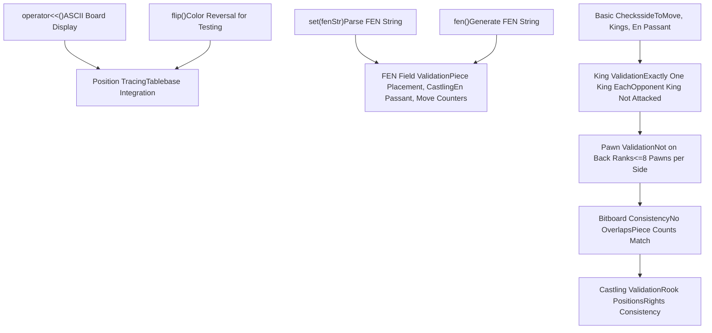
**Sources:** [src/position.cpp1315-1362](https://github.com/official-stockfish/Stockfish/blob/c27c1747/src/position.cpp#L1315-L1362) [src/position.cpp162-294](https://github.com/official-stockfish/Stockfish/blob/c27c1747/src/position.cpp#L162-L294) [src/position.cpp407-451](https://github.com/official-stockfish/Stockfish/blob/c27c1747/src/position.cpp#L407-L451) [src/position.cpp63-96](https://github.com/official-stockfish/Stockfish/blob/c27c1747/src/position.cpp#L63-L96)
