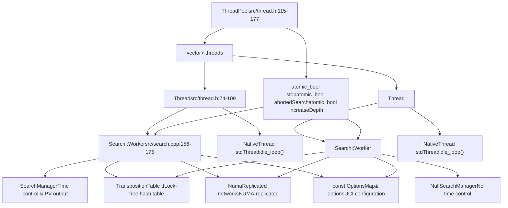
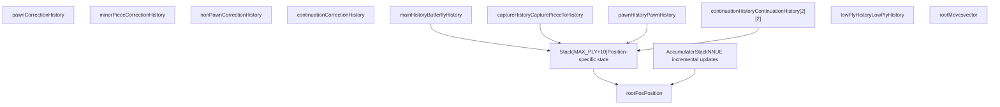
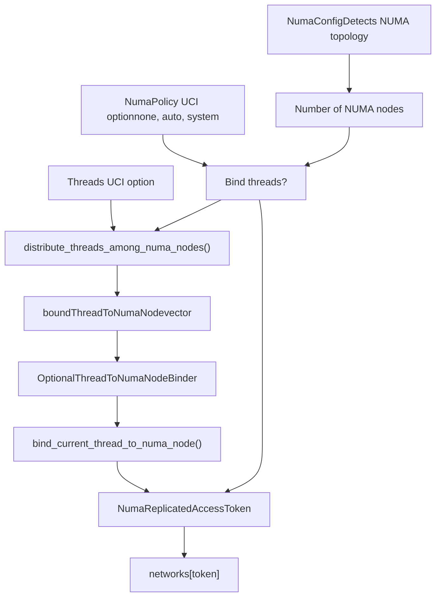
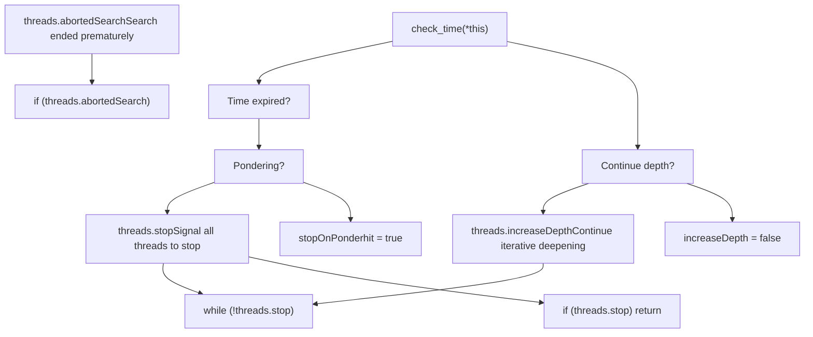
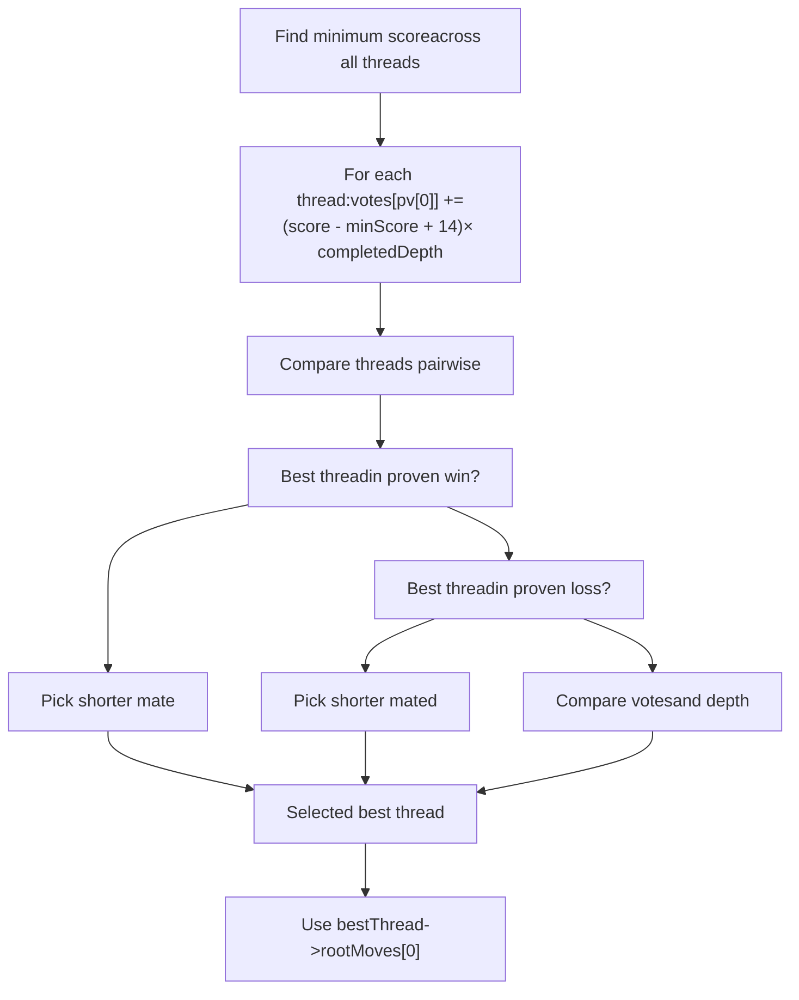

# Thread Management and Parallel Search

Relevant source files

-   [src/search.cpp](https://github.com/official-stockfish/Stockfish/blob/c27c1747/src/search.cpp)
-   [src/thread.h](https://github.com/official-stockfish/Stockfish/blob/c27c1747/src/thread.h)

## Purpose and Scope

This document describes Stockfish's multi-threaded parallel search architecture. It covers the `ThreadPool` class, `Thread` instances, and `Search::Worker` objects that enable Stockfish to coordinate parallel search across multiple CPU cores. The page details the lazy SMP (Shared Memory Parallel) search strategy, NUMA-aware thread binding, and thread synchronization mechanisms.

For information about the search algorithm executed by each worker, see page 4.1. For move ordering that affects search efficiency, see page 4.3.

## Threading Architecture Overview

Stockfish uses a thread pool architecture where each `Thread` owns a `Search::Worker` instance that performs independent search. The system is designed around minimal shared state to maximize parallelism and scale efficiently to many CPU cores.

### Core Components

**Diagram: Threading Architecture with Code Entities**

**Sources:** [src/thread.h74-109](https://github.com/official-stockfish/Stockfish/blob/c27c1747/src/thread.h#L74-L109) [src/thread.h115-177](https://github.com/official-stockfish/Stockfish/blob/c27c1747/src/thread.h#L115-L177) [src/search.cpp156-175](https://github.com/official-stockfish/Stockfish/blob/c27c1747/src/search.cpp#L156-L175)

### Thread Class Structure

The `Thread` class encapsulates a native thread and coordinates its execution through a job-based system defined in [src/thread.h74-109](https://github.com/official-stockfish/Stockfish/blob/c27c1747/src/thread.h#L74-L109):

| Member | Type | Purpose |
| --- | --- | --- |
| `worker` | `LargePagePtr<Search::Worker>` | Search worker instance with local state |
| `stdThread` | `NativeThread` | Platform-specific native thread handle |
| `mutex` | `std::mutex` | Protects thread state transitions |
| `cv` | `std::condition_variable` | Signals work availability and completion |
| `idx` | `size_t` | Thread index (0 for main thread) |
| `idxInNuma` | `size_t` | Thread index within its NUMA node |
| `totalNuma` | `size_t` | Total threads on same NUMA node |
| `searching` | `bool` | Indicates thread is executing work |
| `exit` | `bool` | Signals thread should terminate |
| `jobFunc` | `std::function<void()>` | Current job to execute |
| `numaAccessToken` | `NumaReplicatedAccessToken` | NUMA node binding token |

**Sources:** [src/thread.h74-109](https://github.com/official-stockfish/Stockfish/blob/c27c1747/src/thread.h#L74-L109)

### ThreadPool Class Structure

The `ThreadPool` class manages all threads and coordinates search execution, defined in [src/thread.h115-177](https://github.com/official-stockfish/Stockfish/blob/c27c1747/src/thread.h#L115-L177):

| Member | Type | Purpose |
| --- | --- | --- |
| `threads` | `vector<unique_ptr<Thread>>` | All worker threads |
| `setupStates` | `StateListPtr` | Shared position state history |
| `boundThreadToNumaNode` | `vector<NumaIndex>` | Thread-to-NUMA-node mapping |
| `stop` | `atomic_bool` | Global stop signal for all threads |
| `abortedSearch` | `atomic_bool` | Search was stopped prematurely |
| `increaseDepth` | `atomic_bool` | Signal to continue iterative deepening |

**Sources:** [src/thread.h115-177](https://github.com/official-stockfish/Stockfish/blob/c27c1747/src/thread.h#L115-L177)

## Thread Lifecycle

### Thread Creation and Initialization

Threads are created through `ThreadPool::set()` in [src/thread.cpp140-202](https://github.com/official-stockfish/Stockfish/blob/c27c1747/src/thread.cpp#L140-L202) which destroys existing threads and creates new ones based on the `Threads` UCI option:

**Diagram: Thread Initialization Sequence**

> **[Mermaid sequence]**
> *(图表结构无法解析)*

**Sources:** [src/thread.cpp140-202](https://github.com/official-stockfish/Stockfish/blob/c27c1747/src/thread.cpp#L140-L202) [src/thread.cpp42-62](https://github.com/official-stockfish/Stockfish/blob/c27c1747/src/thread.cpp#L42-L62)

Key initialization steps:

1.  **Thread Construction** in [src/thread.cpp42-62](https://github.com/official-stockfish/Stockfish/blob/c27c1747/src/thread.cpp#L42-L62):

    -   Native thread starts with `idle_loop()`
    -   Thread waits for first job via condition variable
    -   Custom job allocates `Search::Worker` with NUMA binding
2.  **Worker Initialization** in [src/search.cpp156-175](https://github.com/official-stockfish/Stockfish/blob/c27c1747/src/search.cpp#L156-L175):

    -   Unpacks `SharedState` into member variables
    -   Stores NUMA access token for network replication
    -   Calls `clear()` to initialize history tables
3.  **History Table Initialization** in [src/search.cpp586-610](https://github.com/official-stockfish/Stockfish/blob/c27c1747/src/search.cpp#L586-L610):

    -   `mainHistory.fill(mainHistoryDefault)` where `mainHistoryDefault = 68` - main history heuristic
    -   `captureHistory.fill(-689)` - capture move scores
    -   Shared histories cleared by range: `pawnHistory.fill(-1238)`
    -   `continuationHistory` - move pair continuation patterns
    -   `continuationCorrectionHistory` - evaluation correction patterns

### The idle\_loop() Mechanism

Each thread spends most of its time in `idle_loop()` defined in [src/thread.cpp111-130](https://github.com/official-stockfish/Stockfish/blob/c27c1747/src/thread.cpp#L111-L130) waiting for work:

**Diagram: Thread Idle Loop State Machine**

> **[Mermaid stateDiagram]**
> *(图表结构无法解析)*

**Sources:** [src/thread.cpp111-130](https://github.com/official-stockfish/Stockfish/blob/c27c1747/src/thread.cpp#L111-L130)

The implementation in [src/thread.cpp111-130](https://github.com/official-stockfish/Stockfish/blob/c27c1747/src/thread.cpp#L111-L130):

1.  Thread sets `searching = false` and notifies waiters
2.  Thread blocks on `cv.wait()` until `searching` becomes true
3.  When signaled, checks `exit` flag for termination
4.  Extracts and executes `jobFunc`
5.  Returns to waiting state

### Search Execution Flow

When search begins, the main thread orchestrates helper thread startup through `ThreadPool::start_thinking()` in [src/thread.cpp241-300](https://github.com/official-stockfish/Stockfish/blob/c27c1747/src/thread.cpp#L241-L300):

**Diagram: Search Execution Coordination**

> **[Mermaid sequence]**
> *(图表结构无法解析)*

**Sources:** [src/thread.cpp241-300](https://github.com/official-stockfish/Stockfish/blob/c27c1747/src/thread.cpp#L241-L300) [src/search.cpp183-254](https://github.com/official-stockfish/Stockfish/blob/c27c1747/src/search.cpp#L183-L254)

## Lazy SMP Parallel Search

Stockfish implements lazy SMP (Shared Memory Parallel search), where threads search independently with minimal coordination. This differs from traditional parallel search algorithms that split the search tree explicitly. Each worker explores the same search tree but with slight variations that naturally lead to different paths.

### Key Characteristics

**Diagram: Shared vs Thread-Local Resources**

```mermaid
flowchart TD
    TT["TranspositionTableLock-free concurrent accesstt.probe(), ttWriter.write()"]
    Flags["Atomic Flagsthreads.stopthreads.increaseDepththreads.abortedSearch"]
    Networks["NNUE NetworksNUMA-replicatednetworks[numaAccessToken]"]
    Options["UCI OptionsHash, Threads, etc."]
    W0["Search::Worker"]
    W0_nodes["atomic<uint64_t> nodes"]
    W0_hist["History TablesmainHistorycaptureHistorycontinuationHistory"]
    W0_stack["Stack[MAX_PLY+10]"]
    W0_rootMoves["RootMoves"]
    WN["Search::Worker"]
    WN_nodes["atomic<uint64_t> nodes"]
    WN_hist["History TablesmainHistorycaptureHistorycontinuationHistory"]
    WN_stack["Stack[MAX_PLY+10]"]
    WN_rootMoves["RootMoves"]

    W0 --> TT
    W0 --> Flags
    W0 --> Networks
    W0 --> Options
    W0 --> W0_hist
    W0 --> W0_stack
    W0 --> W0_rootMoves
    WN --> TT
    WN --> Flags
    WN --> Networks
    WN --> Options
    WN --> WN_hist
    WN --> WN_stack
    WN --> WN_rootMoves
```

**Sources:** [src/search.cpp156-175](https://github.com/official-stockfish/Stockfish/blob/c27c1747/src/search.cpp#L156-L175) [src/thread.cpp241-300](https://github.com/official-stockfish/Stockfish/blob/c27c1747/src/thread.cpp#L241-L300)

### Independent Search Execution

Each worker executes its own `iterative_deepening()` loop in [src/search.cpp259-544](https://github.com/official-stockfish/Stockfish/blob/c27c1747/src/search.cpp#L259-L544):

| Aspect | Implementation | Benefit |
| --- | --- | --- |
| **Aspiration window** | Different deltas based on `threadIdx` in [src/search.cpp355](https://github.com/official-stockfish/Stockfish/blob/c27c1747/src/search.cpp#L355-L355): `delta = 5 + threadIdx % 8 + ...` | Explores different move orders |
| **Optimism values** | Per-thread calculation in [src/search.cpp361-362](https://github.com/official-stockfish/Stockfish/blob/c27c1747/src/search.cpp#L361-L362): `optimism[us] = 142 * avg / (std::abs(avg) + 91)` | Different evaluation adjustments |
| **Root move order** | Stable sort after each iteration preserves different orderings | Natural search diversity |
| **History tables** | Completely independent per thread | Zero lock contention |
| **Search stack** | Local `Stack[MAX_PLY + 10]` array | Thread-safe by design |

### Transposition Table Coordination

The transposition table is the primary coordination mechanism between threads, enabling them to share discovered information:

**Diagram: Transposition Table Interaction**

> **[Mermaid sequence]**
> *(图表结构无法解析)*

**Sources:** [src/search.cpp701-742](https://github.com/official-stockfish/Stockfish/blob/c27c1747/src/search.cpp#L701-L742)

TT access patterns in [src/search.cpp704](https://github.com/official-stockfish/Stockfish/blob/c27c1747/src/search.cpp#L704-L704):

-   `tt.probe(posKey)` returns `[ttHit, ttData, ttWriter]` tuple
-   Lock-free concurrent read access
-   `ttWriter.write()` for atomic single-entry updates
-   Generation-based aging in `tt.new_search()` called at [src/search.cpp196](https://github.com/official-stockfish/Stockfish/blob/c27c1747/src/search.cpp#L196-L196)
-   Each thread both reads and writes, creating implicit coordination

### Thread-Local Resources

Each `Search::Worker` maintains private data structures to avoid contention and enable lock-free parallel execution:

**Diagram: Worker Thread-Local State**

**Sources:** [src/search.cpp156-175](https://github.com/official-stockfish/Stockfish/blob/c27c1747/src/search.cpp#L156-L175) [src/search.h74-226](https://github.com/official-stockfish/Stockfish/blob/c27c1747/src/search.h#L74-L226)

## NUMA Optimization

Stockfish supports NUMA (Non-Uniform Memory Access) systems by binding threads to specific NUMA nodes and replicating network weights. This optimization is critical for systems with multiple CPU sockets where memory access latency varies by location.

### Thread-to-NUMA-Node Binding

**Diagram: NUMA Thread Distribution and Binding**

**Sources:** [src/thread.cpp140-202](https://github.com/official-stockfish/Stockfish/blob/c27c1747/src/thread.cpp#L140-L202) [src/thread.h47-67](https://github.com/official-stockfish/Stockfish/blob/c27c1747/src/thread.h#L47-L67)

### NUMA Policy Decision

The binding decision in [src/thread.cpp163-173](https://github.com/official-stockfish/Stockfish/blob/c27c1747/src/thread.cpp#L163-L173) follows this logic:

| NumaPolicy | Behavior |
| --- | --- |
| `"none"` | Never bind threads |
| `"auto"` | Bind only if `numaConfig.suggests_binding_threads(requested)` returns true |
| `"system"` | Always bind threads |

The `"auto"` policy binds threads only when:

-   Multiple NUMA nodes are detected
-   Thread count would benefit from distribution
-   Avoids binding when single instance runs few threads

### NUMA-Replicated Network Access

**Diagram: NUMA-Replicated Network Loading**

> **[Mermaid sequence]**
> *(图表结构无法解析)*

**Sources:** [src/search.cpp177-181](https://github.com/official-stockfish/Stockfish/blob/c27c1747/src/search.cpp#L177-L181) [src/thread.cpp52-59](https://github.com/official-stockfish/Stockfish/blob/c27c1747/src/thread.cpp#L52-L59)

Network replication in [src/search.cpp177-181](https://github.com/official-stockfish/Stockfish/blob/c27c1747/src/search.cpp#L177-L181) ensures:

-   Each NUMA node has its own copy of network weights
-   Memory accesses are local to the node
-   Avoids cross-node memory traffic during evaluation
-   Networks lazily initialized on first access via `ensure_network_replicated()`

## Thread Synchronization

### Atomic Flags for Coordination

The `ThreadPool` uses atomic boolean flags defined in [src/thread.h156](https://github.com/official-stockfish/Stockfish/blob/c27c1747/src/thread.h#L156-L156) for lock-free coordination:

**Diagram: Thread Coordination via Atomic Flags**

**Sources:** [src/search.cpp322](https://github.com/official-stockfish/Stockfish/blob/c27c1747/src/search.cpp#L322-L322) [src/search.cpp676](https://github.com/official-stockfish/Stockfish/blob/c27c1747/src/search.cpp#L676-L676) [src/search.cpp1302](https://github.com/official-stockfish/Stockfish/blob/c27c1747/src/search.cpp#L1302-L1302) [src/thread.h156](https://github.com/official-stockfish/Stockfish/blob/c27c1747/src/thread.h#L156-L156)

### Stop Signal Propagation

Stop signal flow through the system:

1.  **Main thread sets stop** in [src/search.cpp471](https://github.com/official-stockfish/Stockfish/blob/c27c1747/src/search.cpp#L471-L471) [src/search.cpp524](https://github.com/official-stockfish/Stockfish/blob/c27c1747/src/search.cpp#L524-L524):

    -   Time limit exceeded
    -   Mate found matching mate limit
    -   Skill level time-to-pick triggered
2.  **All threads check stop** in [src/search.cpp322](https://github.com/official-stockfish/Stockfish/blob/c27c1747/src/search.cpp#L322-L322) [src/search.cpp676](https://github.com/official-stockfish/Stockfish/blob/c27c1747/src/search.cpp#L676-L676) [src/search.cpp1302](https://github.com/official-stockfish/Stockfish/blob/c27c1747/src/search.cpp#L1302-L1302):

    -   In iterative deepening loop: `while (++rootDepth < MAX_PLY && !threads.stop ...)`
    -   At start of each search node: `if (threads.stop.load(std::memory_order_relaxed))`
    -   Before TT writes and move updates
3.  **Main thread waits for helpers** in [src/search.cpp223](https://github.com/official-stockfish/Stockfish/blob/c27c1747/src/search.cpp#L223-L223):

    -   `threads.wait_for_search_finished()` blocks until all idle
    -   Uses condition variables per thread

### Condition Variable Synchronization

Each thread uses a condition variable defined in [src/thread.h104](https://github.com/official-stockfish/Stockfish/blob/c27c1747/src/thread.h#L104-L104) for state transitions:

**Diagram: Thread State Transitions via Condition Variables**

> **[Mermaid stateDiagram]**
> *(图表结构无法解析)*

**Sources:** [src/thread.cpp89-104](https://github.com/official-stockfish/Stockfish/blob/c27c1747/src/thread.cpp#L89-L104) [src/thread.cpp111-130](https://github.com/official-stockfish/Stockfish/blob/c27c1747/src/thread.cpp#L111-L130)

Key synchronization points:

| Function | Lock Held | CV Action | Purpose |
| --- | --- | --- | --- |
| `wait_for_search_finished()` | Yes | `cv.wait()` until `!searching` | Wait for thread to become idle |
| `run_custom_job()` | Yes | `cv.notify_one()` after setting job | Wake thread to execute job |
| `idle_loop()` | Yes | `cv.notify_one()` when done | Signal job completion |
| `idle_loop()` | Yes | `cv.wait()` until `searching` | Wait for next job |

## Best Thread Selection

After search completes, the main thread selects the best result from all workers using a voting mechanism in [src/thread.cpp302-366](https://github.com/official-stockfish/Stockfish/blob/c27c1747/src/thread.cpp#L302-L366) This ensures the strongest move is selected when threads find different best moves.

### Voting Algorithm

**Diagram: Best Thread Selection Process**

**Sources:** [src/thread.cpp302-366](https://github.com/official-stockfish/Stockfish/blob/c27c1747/src/thread.cpp#L302-L366)

### Selection Logic

The algorithm in [src/thread.cpp302-366](https://github.com/official-stockfish/Stockfish/blob/c27c1747/src/thread.cpp#L302-L366) handles three cases:

1.  **Proven Win** in [src/thread.cpp346-351](https://github.com/official-stockfish/Stockfish/blob/c27c1747/src/thread.cpp#L346-L351):
    -   If current best is in proven win, prefer shorter mate
    -   Compare scores: higher is shorter mate
2.  **Proven Loss** in [src/thread.cpp352-357](https://github.com/official-stockfish/Stockfish/blob/c27c1747/src/thread.cpp#L352-L357):
    -   If current best is in proven loss, prefer longer resistance
    -   Compare scores: higher (closer to 0) is longer resistance
3.  **Normal Position** in [src/thread.cpp358-362](https://github.com/official-stockfish/Stockfish/blob/c27c1747/src/thread.cpp#L358-L362):
    -   Compare vote counts for each move
    -   Voting value: `(score - minScore + 14) × completedDepth`
    -   Ensures PV has at least 3 moves (not truncated)
    -   Higher votes or better voting value wins

### Handling Aborted Search

When a thread aborts search prematurely (checked in [src/search.cpp445-453](https://github.com/official-stockfish/Stockfish/blob/c27c1747/src/search.cpp#L445-L453)):

**Diagram: Handling Aborted Search Results**

> **[Mermaid sequence]**
> *(图表结构无法解析)*

**Sources:** [src/search.cpp445-459](https://github.com/official-stockfish/Stockfish/blob/c27c1747/src/search.cpp#L445-L459)

This ensures:

-   Threads stopped mid-search don't report false mate scores
-   Previous iteration's proven result is used instead
-   Main thread gets reliable best move even with early stop

### Thread Voting Example

Consider 4 threads after search:

| Thread | Move | Score | Depth | Vote Calculation | Vote |
| --- | --- | --- | --- | --- | --- |
| 0 | e2e4 | 25 | 20 | (25-(-10)+14) × 20 = 780 | 780 |
| 1 | d2d4 | \-10 | 18 | (-10-(-10)+14) × 18 = 252 | 252 |
| 2 | e2e4 | 15 | 22 | (15-(-10)+14) × 22 = 638 | 638 |
| 3 | e2e4 | 20 | 19 | (20-(-10)+14) × 19 = 646 | 646 |

Total votes: `e2e4 = 780 + 638 + 646 = 2064`, `d2d4 = 252`

Thread 0 wins as best thread (highest individual voting value with e2e4).

**Sources:** [src/thread.cpp315-320](https://github.com/official-stockfish/Stockfish/blob/c27c1747/src/thread.cpp#L315-L320)
