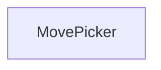
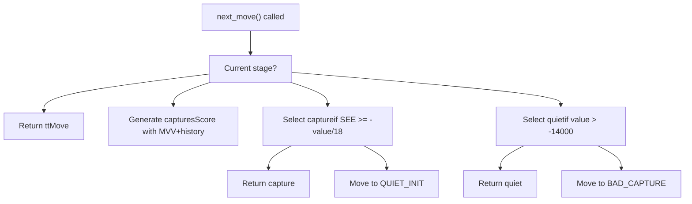
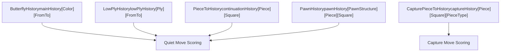
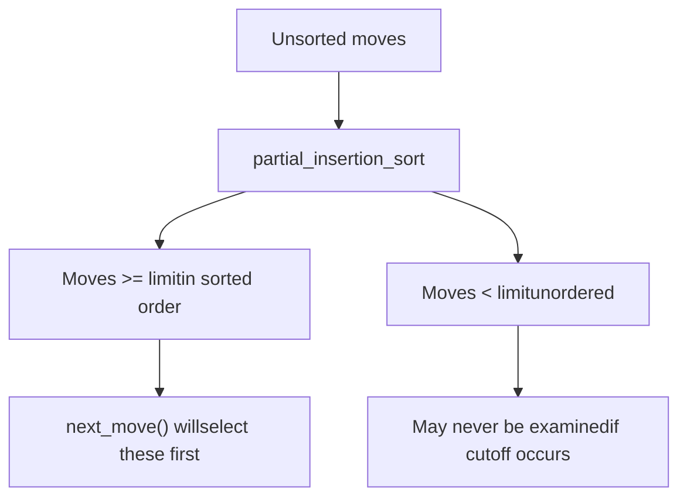

# Move Ordering and Move Picker

Relevant source files

-   [src/movepick.cpp](https://github.com/official-stockfish/Stockfish/blob/c27c1747/src/movepick.cpp)
-   [src/movepick.h](https://github.com/official-stockfish/Stockfish/blob/c27c1747/src/movepick.h)

## Purpose and Scope

This page documents Stockfish's move ordering system and the `MovePicker` class, which implements a sophisticated staged move generation and ordering strategy. Move ordering is critical to alpha-beta search efficiency: examining strong moves first leads to more beta cutoffs and smaller search trees. This page covers the `MovePicker` state machine, move ordering stages, history heuristics, and Static Exchange Evaluation (SEE).

For information about the main search algorithm that uses MovePicker, see [Search Algorithm and Workers](/official-stockfish/Stockfish/4.1-search-algorithm-and-iterative-deepening). For transposition table integration, see [Transposition Table](#4.4).

## Overview

The `MovePicker` class generates and orders moves one at a time, rather than generating all moves upfront. This lazy evaluation allows the search to benefit from early cutoffs without the overhead of scoring moves that will never be examined. MovePicker implements a multi-stage pipeline that prioritizes moves based on various heuristics.

**Key Design Principles:**

-   **Staged generation**: Moves are generated in stages (TT move, good captures, quiets, bad captures)
-   **Lazy scoring**: Moves are scored only when their stage is reached
-   **History-based ordering**: Multiple history tables guide move ordering
-   **SEE filtering**: Static Exchange Evaluation separates winning from losing captures

Sources: [src/movepick.h30-35](https://github.com/official-stockfish/Stockfish/blob/c27c1747/src/movepick.h#L30-L35) [src/movepick.cpp30-76](https://github.com/official-stockfish/Stockfish/blob/c27c1747/src/movepick.cpp#L30-L76)

## MovePicker Class Structure

The `MovePicker` class maintains state for iterating through moves in priority order:


Sources: [src/movepick.h36-76](https://github.com/official-stockfish/Stockfish/blob/c27c1747/src/movepick.h#L36-L76)

### Constructor Variants

MovePicker provides two constructors for different search contexts:

| Constructor | Context | Parameters |
| --- | --- | --- |
| Main/Quiescence | Normal search and qsearch | `Position`, `ttMove`, `depth`, history tables, `ply` |
| ProbCut | Tactical probcut search | `Position`, `ttMove`, `threshold`, `captureHistory` |

The constructor determines the initial stage based on whether the position is in check and whether a TT move exists:

```
stage = pos.checkers() ? EVASION_TT : (depth > 0 ? MAIN_TT : QSEARCH_TT)
stage += !(ttMove && pos.pseudo_legal(ttMove))
```
Sources: [src/movepick.cpp83-119](https://github.com/official-stockfish/Stockfish/blob/c27c1747/src/movepick.cpp#L83-L119)

## Move Ordering Stages

MovePicker implements a state machine with distinct stages that emit moves in priority order. The `next_move()` method advances through these stages:

> **[Mermaid stateDiagram]**
> *(图表结构无法解析)*

Sources: [src/movepick.cpp33-57](https://github.com/official-stockfish/Stockfish/blob/c27c1747/src/movepick.cpp#L33-L57) [src/movepick.cpp213-314](https://github.com/official-stockfish/Stockfish/blob/c27c1747/src/movepick.cpp#L213-L314)

### Stage Descriptions

| Stage | Purpose | Moves Returned |
| --- | --- | --- |
| `MAIN_TT` | Return transposition table move first | TT move (if legal) |
| `CAPTURE_INIT` | Generate and score all captures | None (initialization) |
| `GOOD_CAPTURE` | Return captures that win material | Captures with `SEE >= -value/18` |
| `QUIET_INIT` | Generate and score quiet moves | None (initialization) |
| `GOOD_QUIET` | Return promising quiet moves | Quiets with `value > -14000` |
| `BAD_CAPTURE` | Return losing captures | Captures with `SEE < -value/18` |
| `BAD_QUIET` | Return unpromising quiet moves | Quiets with `value <= -14000` |

Sources: [src/movepick.cpp220-291](https://github.com/official-stockfish/Stockfish/blob/c27c1747/src/movepick.cpp#L220-L291)

### Stage Transitions

The `next_move()` method uses a switch statement with fallthrough to manage stage transitions efficiently:


Sources: [src/movepick.cpp213-314](https://github.com/official-stockfish/Stockfish/blob/c27c1747/src/movepick.cpp#L213-L314)

## History Tables

Stockfish uses multiple specialized history tables to guide move ordering. Each table captures different patterns from previous searches:

### History Table Types


Sources: [src/movepick.h63-67](https://github.com/official-stockfish/Stockfish/blob/c27c1747/src/movepick.h#L63-L67) [src/search.cpp559-577](https://github.com/official-stockfish/Stockfish/blob/c27c1747/src/search.cpp#L559-L577)

### History Table Details

| Table | Type | Index | Purpose | Updated When |
| --- | --- | --- | --- | --- |
| `mainHistory` | `ButterflyHistory` | `[Color][from_to()]` | General move performance | Quiet move causes cutoff |
| `lowPlyHistory` | `LowPlyHistory` | `[ply][from_to()]` | Opening book-like patterns | Early plies (ply < 4) |
| `captureHistory` | `CapturePieceToHistory` | `[piece][to][captured_type]` | Capture move ordering | Capture causes cutoff |
| `continuationHistory` | `PieceToHistory**` | `[piece][to]` (6 levels) | Move pair sequences | Quiet move causes cutoff |
| `pawnHistory` | `PawnHistory` | `[pawn_structure][piece][to]` | Pawn-structure-dependent | Quiet move causes cutoff |

Sources: [src/movepick.cpp86-97](https://github.com/official-stockfish/Stockfish/blob/c27c1747/src/movepick.cpp#L86-L97) [src/search.cpp967-973](https://github.com/official-stockfish/Stockfish/blob/c27c1747/src/search.cpp#L967-L973)

### History Updates

History tables are updated after a move causes a beta cutoff. The update uses a gravity-based formula that increases scores for good moves and decreases scores for moves tried before the cutoff:

```
history[move] << bonus
```
Where `<<` is the gravity update operator defined in the history tables. The bonus is typically depth-dependent: `min(130 * depth - 71, 1043)` for quiet moves.

Sources: [src/search.cpp698-703](https://github.com/official-stockfish/Stockfish/blob/c27c1747/src/search.cpp#L698-L703) [src/search.cpp131-143](https://github.com/official-stockfish/Stockfish/blob/c27c1747/src/search.cpp#L131-L143)

## Static Exchange Evaluation (SEE)

SEE estimates the material outcome of a capture sequence on a square. It's used to separate "good" captures (winning or neutral material) from "bad" captures (losing material).

### SEE in Move Ordering

MovePicker uses SEE in two ways:

1.  **Good/Bad Capture Split**: During `GOOD_CAPTURE` stage, captures are tested with `pos.see_ge(*cur, -cur->value / 18)`. Captures passing this test are returned immediately; failing captures are deferred to `BAD_CAPTURE` stage.

2.  **Pruning**: In search, SEE is used to prune bad captures: `!pos.see_ge(move, -27 * lmrDepth * lmrDepth)`


Sources: [src/movepick.cpp241-247](https://github.com/official-stockfish/Stockfish/blob/c27c1747/src/movepick.cpp#L241-L247) [src/search.cpp1091-1092](https://github.com/official-stockfish/Stockfish/blob/c27c1747/src/search.cpp#L1091-L1092)

### SEE Threshold Adjustment

The threshold `-cur->value / 18` means that captures with high history scores can afford to lose more material and still be considered "good". This reflects the idea that historically successful captures may have compensation beyond raw material.

Sources: [src/movepick.cpp242](https://github.com/official-stockfish/Stockfish/blob/c27c1747/src/movepick.cpp#L242-L242)

## Move Scoring

Moves are scored differently based on their type. Higher scores mean higher priority in the ordering.

### Capture Scoring

Captures are scored using Most Valuable Victim (MVV) with history adjustment:

```
score = captureHistory[piece][to][captured_type]
      + 7 * PieceValue[captured_piece]
      + 1024 * (gives_check ? 1 : 0)
```
This formula prioritizes:

-   Capturing valuable pieces (MVV)
-   Captures with good history
-   Checking captures

Sources: [src/movepick.cpp154-156](https://github.com/official-stockfish/Stockfish/blob/c27c1747/src/movepick.cpp#L154-L156)

### Quiet Move Scoring

Quiet moves use a complex scoring formula combining multiple history tables:

```
score = 2 * mainHistory[us][from_to]
      + 2 * pawnHistory[pawn_structure][piece][to]
      + continuationHistory[0][piece][to]
      + continuationHistory[1][piece][to]
      + continuationHistory[2][piece][to]
      + continuationHistory[3][piece][to]
      + continuationHistory[5][piece][to]
      + (gives_check && see_ge(move, -75) ? 16384 : 0)
      + threat_bonus
      + (ply < 4 ? 8 * lowPlyHistory[ply][from_to] / (1 + ply) : 0)
```
**Threat Bonus**: Moves that escape from or counter threats by lesser pieces receive bonuses:

-   Moving a piece away from a threat: `+bonus[piece_type] * 100`
-   Moving to a square threatened by a lesser piece: `-95`

Sources: [src/movepick.cpp158-181](https://github.com/official-stockfish/Stockfish/blob/c27c1747/src/movepick.cpp#L158-L181)

### Evasion Scoring

When in check, captures use simple MVV with a large bonus:

```
score = PieceValue[captured] + (1 << 28)
```
Quiet evasions use main and continuation history:

```
score = mainHistory[us][from_to] + continuationHistory[0][piece][to]
      + (ply < 4 ? lowPlyHistory[ply][from_to] : 0)
```
Sources: [src/movepick.cpp184-193](https://github.com/official-stockfish/Stockfish/blob/c27c1747/src/movepick.cpp#L184-L193)

## Partial Insertion Sort

MovePicker uses a clever optimization called partial insertion sort: instead of fully sorting all moves, it only ensures that moves above a certain threshold are sorted, leaving others unordered.


This is efficient because:

-   If an early move causes a beta cutoff, we saved time not sorting the rest
-   The threshold can be adjusted per stage (e.g., `-3560 * depth` for quiets)

Sources: [src/movepick.cpp62-73](https://github.com/official-stockfish/Stockfish/blob/c27c1747/src/movepick.cpp#L62-L73) [src/movepick.cpp259](https://github.com/official-stockfish/Stockfish/blob/c27c1747/src/movepick.cpp#L259-L259)

## Integration with Search

MovePicker is instantiated in the search function and called repeatedly to iterate through moves:

> **[Mermaid sequence]**
> *(图表结构无法解析)*

Sources: [src/search.cpp967-1094](https://github.com/official-stockfish/Stockfish/blob/c27c1747/src/search.cpp#L967-L1094)

### MovePicker Construction in Search

The main search creates MovePicker with full history table context:

```
MovePicker mp(pos, ttData.move, depth, &mainHistory, &lowPlyHistory,
              &captureHistory, contHist, &pawnHistory, ss->ply);
```
ProbCut creates a simpler MovePicker with just capture history:

```
MovePicker mp(pos, ttData.move, probCutBeta - ss->staticEval, &captureHistory);
```
Sources: [src/search.cpp972-973](https://github.com/official-stockfish/Stockfish/blob/c27c1747/src/search.cpp#L972-L973) [src/search.cpp923](https://github.com/official-stockfish/Stockfish/blob/c27c1747/src/search.cpp#L923-L923)

### Skip Quiet Moves Optimization

During futility pruning at shallow depths, the search can instruct MovePicker to skip all quiet moves:

```
if (moveCount >= (3 + depth * depth) / (2 - improving))
    mp.skip_quiet_moves();
```
This sets the `skipQuiets` flag, causing the state machine to skip `GOOD_QUIET` and `BAD_QUIET` stages entirely.

Sources: [src/search.cpp1031-1032](https://github.com/official-stockfish/Stockfish/blob/c27c1747/src/search.cpp#L1031-L1032) [src/movepick.cpp316](https://github.com/official-stockfish/Stockfish/blob/c27c1747/src/movepick.cpp#L316-L316)

## Killer Moves

While Stockfish historically used killer move heuristics, the current codebase does not implement a traditional killer move mechanism. The table of contents mentions killers, but analysis of the code shows they have been replaced by the more sophisticated continuation history tables, which capture move pair patterns (including what might have been killer moves) more generally.

The continuation history tables at different ply offsets (`(ss-1)`, `(ss-2)`, `(ss-4)`, etc.) effectively serve a similar purpose to killers by remembering successful move sequences.

Sources: [src/movepick.cpp163-167](https://github.com/official-stockfish/Stockfish/blob/c27c1747/src/movepick.cpp#L163-L167) [src/search.cpp967-969](https://github.com/official-stockfish/Stockfish/blob/c27c1747/src/search.cpp#L967-L969)

## Performance Characteristics

The staged move ordering provides several performance benefits:

| Optimization | Benefit |
| --- | --- |
| TT move first | Often causes immediate cutoff |
| Lazy generation | Avoids generating/scoring moves after cutoff |
| Partial sorting | Reduces sorting overhead |
| SEE filtering | Delays bad captures until after good quiets |
| History-guided ordering | Learns from previous searches |

**Empirical Results**: The move ordering achieves cutoffs early enough that the average branching factor is significantly reduced. The TT move alone causes a cutoff in approximately 90% of cases when it exists and is tried.

Sources: [src/movepick.cpp213-314](https://github.com/official-stockfish/Stockfish/blob/c27c1747/src/movepick.cpp#L213-L314)
