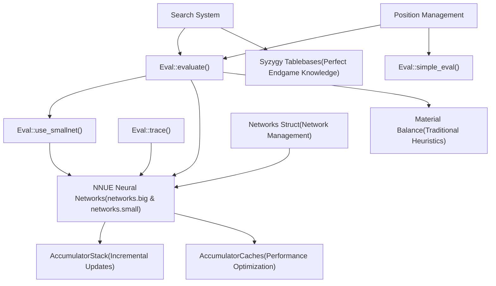
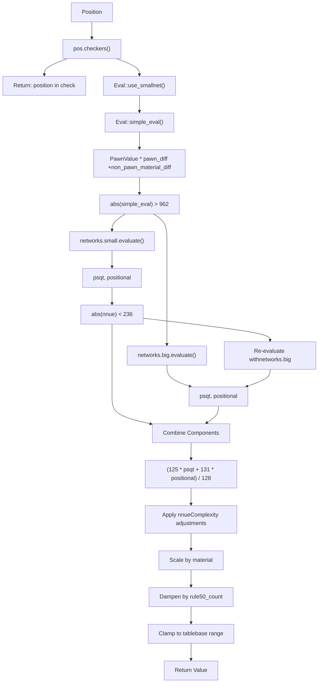
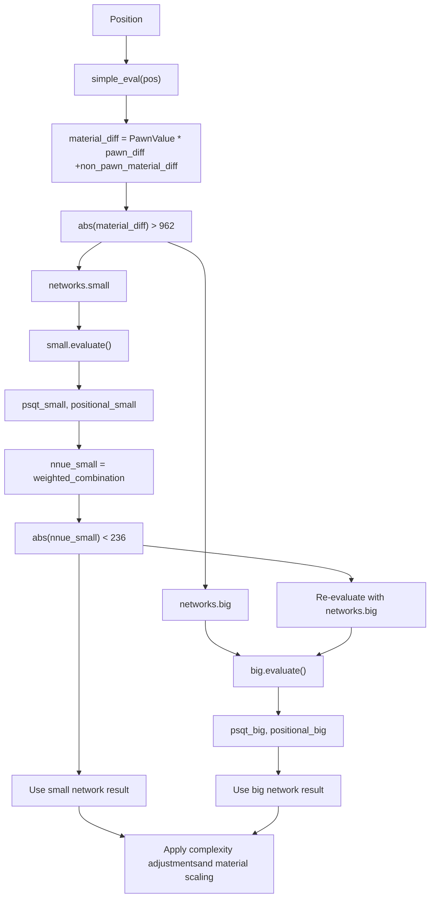
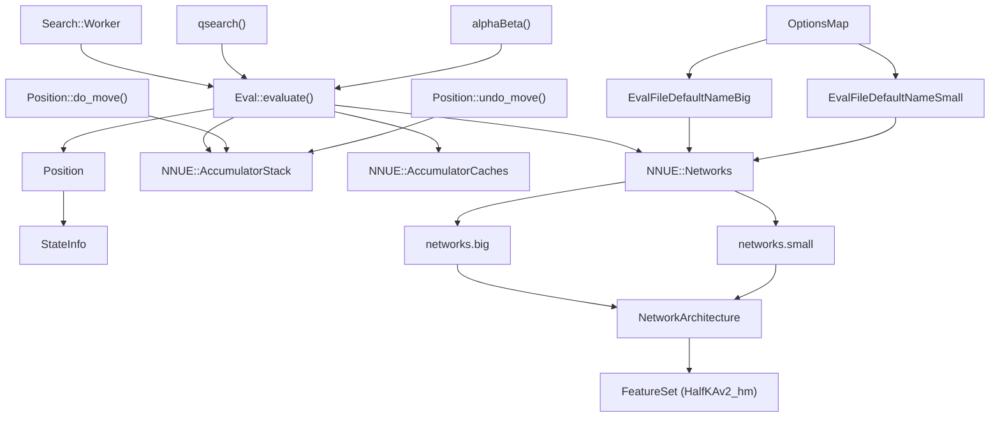

# Evaluation System

Relevant source files

-   [src/evaluate.cpp](https://github.com/official-stockfish/Stockfish/blob/c27c1747/src/evaluate.cpp)

The Evaluation System in Stockfish assigns numerical values to chess positions to assess their relative strength from the perspective of the side to move. This system serves as the core knowledge component that guides the search engine's decision-making process. The evaluation system integrates multiple sources of chess knowledge including neural networks, tablebases, and traditional heuristics.

## System Architecture

The evaluation system consists of three primary subsystems that work together to provide comprehensive position assessment:

### Evaluation System Components


**Major Subsystems:**

| Subsystem | Purpose | Documentation |
| --- | --- | --- |
| **NNUE Neural Networks** | Primary position evaluation using trained neural networks | See page [5.1](https://github.com/official-stockfish/Stockfish/blob/c27c1747/5.1) |
| **NNUE Architecture** | Network structure, layers, and feature processing | See page [5.2](https://github.com/official-stockfish/Stockfish/blob/c27c1747/5.2) |
| **Syzygy Tablebases** | Perfect play in endgames with ≤7 pieces | See page [5.3](https://github.com/official-stockfish/Stockfish/blob/c27c1747/5.3) |

Sources: [src/evaluate.h30-54](https://github.com/official-stockfish/Stockfish/blob/c27c1747/src/evaluate.h#L30-L54) [src/evaluate.cpp38-124](https://github.com/official-stockfish/Stockfish/blob/c27c1747/src/evaluate.cpp#L38-L124)

## Main Evaluation Interface

The `Eval` namespace provides the primary interface to the evaluation system through several key functions:

| Function | Purpose | Signature |
| --- | --- | --- |
| `Eval::evaluate()` | Primary evaluation function | `Value evaluate(const NNUE::Networks&, const Position&, AccumulatorStack&, AccumulatorCaches&, int optimism)` |
| `Eval::simple_eval()` | Fast material-based evaluation | `int simple_eval(const Position&)` |
| `Eval::use_smallnet()` | Network selection heuristic | `bool use_smallnet(const Position&)` |
| `Eval::trace()` | Debug evaluation breakdown | `std::string trace(Position&, const NNUE::Networks&)` |

### Evaluation Process Flow


Sources: [src/evaluate.cpp53-90](https://github.com/official-stockfish/Stockfish/blob/c27c1747/src/evaluate.cpp#L53-L90) [src/evaluate.h47-53](https://github.com/official-stockfish/Stockfish/blob/c27c1747/src/evaluate.h#L47-L53)

## Network Selection Strategy

Stockfish uses a dual-network approach to optimize the trade-off between evaluation accuracy and computational cost:

### Network Types and Usage

| Network | Size | Usage Criterion | Purpose |
| --- | --- | --- | --- |
| `networks.small` | 128 transformed features | `abs(simple_eval) > 962` | Positions with clear material imbalances |
| `networks.big` | 3072 transformed features | `abs(simple_eval) ≤ 962` | Complex positional evaluations |

### Dynamic Network Selection


The fallback mechanism ensures that when the small network produces uncertain evaluations (close to zero), the system automatically switches to the more accurate big network for a definitive assessment.

Sources: [src/evaluate.cpp43-49](https://github.com/official-stockfish/Stockfish/blob/c27c1747/src/evaluate.cpp#L43-L49) [src/evaluate.cpp61-73](https://github.com/official-stockfish/Stockfish/blob/c27c1747/src/evaluate.cpp#L61-L73)

## Integration with Other Systems

The evaluation system is tightly integrated with other core Stockfish components:

### System Interactions


### Key Integration Points

| Integration | Description | Implementation |
| --- | --- | --- |
| **Search Calls** | Search worker calls evaluation at leaf nodes | `Search::Worker` → `Eval::evaluate()` |
| **Position State** | Evaluation requires current position and game state | `Position` → feature extraction |
| **Incremental Updates** | Accumulators updated during move make/unmake | `do_move()`/`undo_move()` → `AccumulatorStack` |
| **Network Loading** | UCI options specify which network files to load | UCI → `Networks` struct initialization |
| **Tablebase Integration** | Search checks tablebases before calling evaluation | Search → Tablebases (when available) |

Sources: [src/evaluate.h39-54](https://github.com/official-stockfish/Stockfish/blob/c27c1747/src/evaluate.h#L39-L54) [src/evaluate.cpp53-90](https://github.com/official-stockfish/Stockfish/blob/c27c1747/src/evaluate.cpp#L53-L90)

## Default Network Configuration

The evaluation system uses predefined default network files that are embedded in the build process:

### Network File Specifications

```
#define EvalFileDefaultNameBig "nn-1c0000000000.nnue"
#define EvalFileDefaultNameSmall "nn-37f18f62d772.nnue"
```
These filenames follow a specific format `nn-[SHA256 first 12 digits].nnue` that is required for:

-   Build process integration (`profile-build`)
-   Automated testing (`fishtest`)
-   Network validation and versioning

### Network Architecture Constants

The NNUE architecture defines several key constants that determine network structure:

| Constant | Value | Purpose |
| --- | --- | --- |
| `TransformedFeatureDimensionsBig` | 3072 | Input feature size for large network |
| `TransformedFeatureDimensionsSmall` | 128 | Input feature size for small network |
| `PSQTBuckets` | 8 | Number of piece-square table buckets |
| `LayerStacks` | 8 | Number of layer stacks for parallel processing |

Sources: [src/evaluate.h36-37](https://github.com/official-stockfish/Stockfish/blob/c27c1747/src/evaluate.h#L36-L37) [src/nnue/nnue\_architecture.h40-50](https://github.com/official-stockfish/Stockfish/blob/c27c1747/src/nnue/nnue_architecture.h#L40-L50)

## Key Evaluation Formulas

The final evaluation calculation combines several factors through a series of formulas:

### NNUE Component Weighting

```
Value nnue = (125 * psqt + 131 * positional) / 128;
```
### Complexity Adjustments

```
int nnueComplexity = std::abs(psqt - positional);
optimism += optimism * nnueComplexity / 468;
nnue -= nnue * nnueComplexity / 18000;
```
### Material Calculation

```
int material = 535 * pos.count<PAWN>() + pos.non_pawn_material();
```
### Final Evaluation

```
int v = (nnue * (77777 + material) + optimism * (7777 + material)) / 77777;
```
### Rule50 Dampening

```
v -= v * pos.rule50_count() / 212;
```
### Range Clamping

```
v = std::clamp(v, VALUE_TB_LOSS_IN_MAX_PLY + 1, VALUE_TB_WIN_IN_MAX_PLY - 1);
```
Where:

-   `nnue` is the combined neural network output
-   `material` weights pawns at 535 and includes all non-pawn material
-   `optimism` is a search parameter that can bias evaluation toward a specific side
-   `nnueComplexity` measures the disagreement between PSQT and positional components

Sources: [src/evaluate.cpp65](https://github.com/official-stockfish/Stockfish/blob/c27c1747/src/evaluate.cpp#L65-L65) [src/evaluate.cpp76-87](https://github.com/official-stockfish/Stockfish/blob/c27c1747/src/evaluate.cpp#L76-L87)

## Implementation Details

### Network File Names

The default network files are defined as macros:

```
#define EvalFileDefaultNameBig "nn-1c0000000000.nnue"
#define EvalFileDefaultNameSmall "nn-37f18f62d772.nnue"
```
These names follow the format `nn-[SHA256 first 12 digits].nnue` for build process compatibility.

### Simple Evaluation Function

The `simple_eval()` function provides a fast material-only evaluation:

```
int simple_eval(const Position& pos) {
    Color c = pos.side_to_move();
    return PawnValue * (pos.count<PAWN>(c) - pos.count<PAWN>(~c))
         + (pos.non_pawn_material(c) - pos.non_pawn_material(~c));
}
```
### Network Selection Threshold

The `use_smallnet()` function uses a hardcoded threshold:

```
bool use_smallnet(const Position& pos) {
    return std::abs(simple_eval(pos)) > 962;
}
```
### Debug Tracing

The `Eval::trace()` function provides detailed evaluation breakdown:

-   Outputs NNUE component details via `NNUE::trace()`
-   Shows both raw NNUE evaluation and final scaled evaluation
-   Converts internal values to centipawns using `UCIEngine::to_cp()`
-   Returns formatted string suitable for debugging output

Sources: [src/evaluate.h36-37](https://github.com/official-stockfish/Stockfish/blob/c27c1747/src/evaluate.h#L36-L37) [src/evaluate.cpp43-49](https://github.com/official-stockfish/Stockfish/blob/c27c1747/src/evaluate.cpp#L43-L49) [src/evaluate.cpp96-122](https://github.com/official-stockfish/Stockfish/blob/c27c1747/src/evaluate.cpp#L96-L122)

## Integration with Search

The evaluation function is primarily called from the search system when:

1.  A quiet position is reached (no captures or checks)
2.  The search reaches its depth limit
3.  A null move is being considered

The search can pass an "optimism" parameter to the evaluation function to introduce a controlled bias, which helps with search stability and aspiration window management.

Sources: [src/evaluate.h49-53](https://github.com/official-stockfish/Stockfish/blob/c27c1747/src/evaluate.h#L49-L53)

## Performance Considerations

The use of two networks of different sizes represents a performance optimization. The smaller network requires fewer computations and is used when a position's evaluation is likely to be dominated by material considerations. The larger network is employed for positions where more detailed evaluation is necessary.

Another key performance feature is the accumulator system, which allows for incremental updates to the neural network input features as moves are made, rather than recomputing all features from scratch for each position.

Sources: [src/evaluate.cpp61-73](https://github.com/official-stockfish/Stockfish/blob/c27c1747/src/evaluate.cpp#L61-L73) [src/evaluate.h49-53](https://github.com/official-stockfish/Stockfish/blob/c27c1747/src/evaluate.h#L49-L53)
