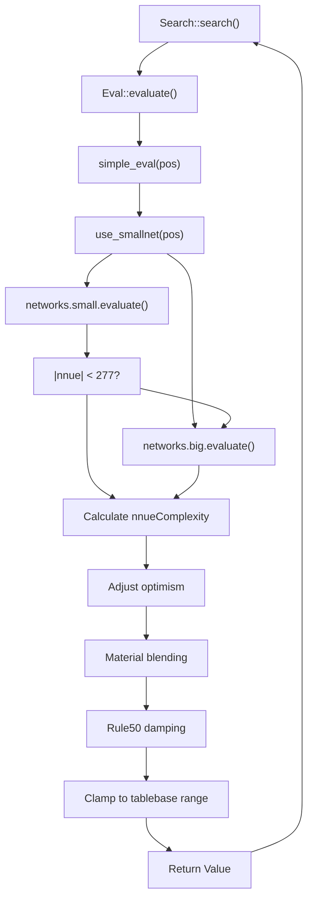
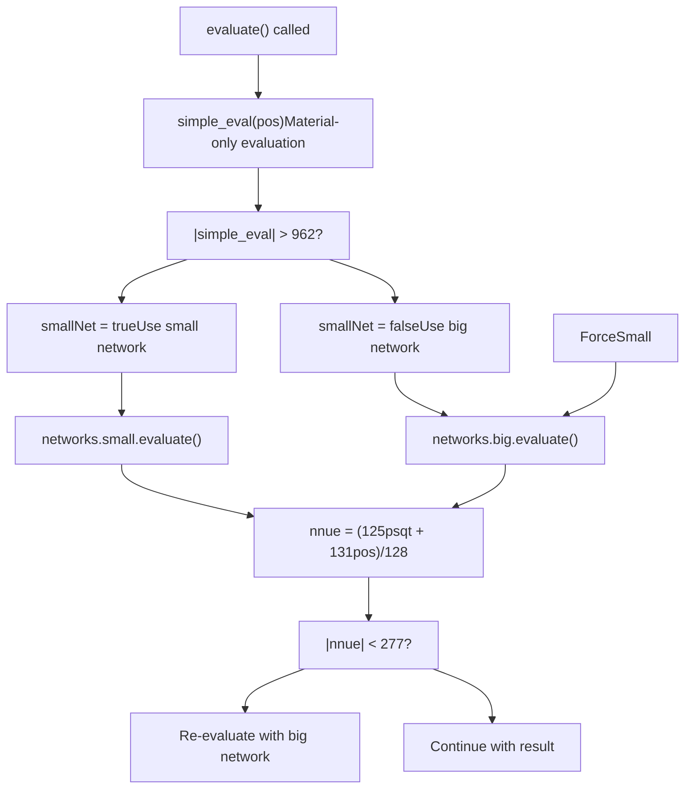
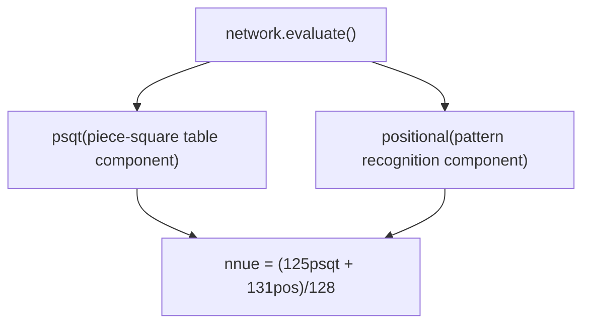
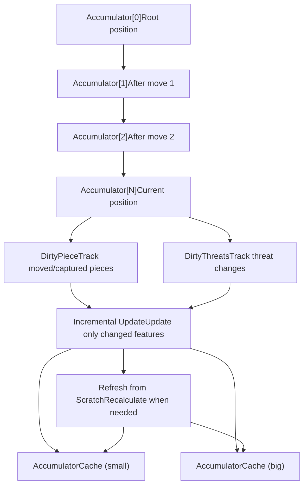
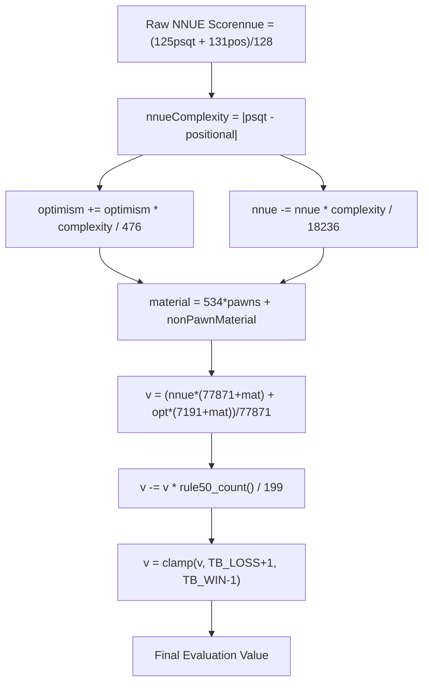
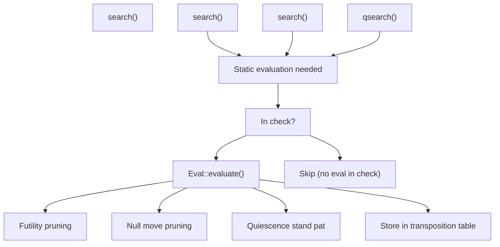

# NNUE Neural Network Evaluation

Relevant source files

-   [src/evaluate.cpp](https://github.com/official-stockfish/Stockfish/blob/c27c1747/src/evaluate.cpp)

## Purpose and Scope

This document details Stockfish's NNUE (Efficiently Updatable Neural Network) evaluation system, which replaced traditional hand-crafted evaluation starting in Stockfish 12. NNUE uses neural networks to evaluate chess positions, providing significantly stronger play than prior evaluation methods.

This page covers:

-   The two-network architecture (small and big networks)
-   Network selection logic based on position characteristics
-   The accumulator-based incremental update system
-   The score transformation pipeline that adjusts raw neural network output
-   Integration with the search system

For information about how evaluation is called during search, see [Search Algorithm and Iterative Deepening](/official-stockfish/Stockfish/4.1-search-algorithm-and-iterative-deepening). For details about the position representation that NNUE evaluates, see [Position and State Management](/official-stockfish/Stockfish/3.1-position-and-state-management).

**Sources:** [src/evaluate.cpp1-124](https://github.com/official-stockfish/Stockfish/blob/c27c1747/src/evaluate.cpp#L1-L124)

---

## Overview

NNUE (Efficiently Updatable Neural Network) is a neural network architecture specifically designed for chess evaluation. Unlike traditional deep learning approaches that are too slow for real-time move-by-move evaluation during search, NNUE achieves high speed through:

1.  **Small network size**: The networks are designed to be evaluated in microseconds
2.  **Incremental updates**: Instead of recalculating from scratch after each move, only changed features are updated
3.  **Integer arithmetic**: All computations use integer math for speed
4.  **Accumulator caching**: Feature activations are cached and incrementally maintained

The NNUE system in Stockfish uses a two-network approach:

-   **Small network**: Faster but less accurate, used for positions with material imbalance
-   **Big network**: Slower but more accurate, used for balanced positions

This hybrid approach optimizes the speed/accuracy tradeoff across different position types.

**Sources:** [src/evaluate.cpp1-124](https://github.com/official-stockfish/Stockfish/blob/c27c1747/src/evaluate.cpp#L1-L124)

---

## Evaluation Entry Point

The main evaluation function is `Eval::evaluate()`, which serves as the interface between the search system and the NNUE networks.


**Function Signature:**

```
Value Eval::evaluate(
    const Eval::NNUE::Networks&    networks,
    const Position&                pos,
    Eval::NNUE::AccumulatorStack&  accumulators,
    Eval::NNUE::AccumulatorCaches& caches,
    int                            optimism
)
```
**Parameters:**

| Parameter | Type | Purpose |
| --- | --- | --- |
| `networks` | `Eval::NNUE::Networks&` | Contains both small and big neural networks |
| `pos` | `Position&` | Current board position to evaluate |
| `accumulators` | `AccumulatorStack&` | Stack of NNUE accumulators for incremental updates |
| `caches` | `AccumulatorCaches&` | Separate caches for small and big networks |
| `optimism` | `int` | Optimism parameter for the side to move |

**Important Precondition:** The position must not be in check. This is enforced by an assertion at [src/evaluate.cpp59](https://github.com/official-stockfish/Stockfish/blob/c27c1747/src/evaluate.cpp#L59-L59)

**Sources:** [src/evaluate.cpp53-90](https://github.com/official-stockfish/Stockfish/blob/c27c1747/src/evaluate.cpp#L53-L90)

---

## Network Selection Logic

Stockfish uses a materialistic heuristic to decide which network to use, optimizing for the speed/accuracy tradeoff based on position characteristics.


### Helper Function: `simple_eval()`

The `simple_eval()` function computes a purely materialistic evaluation:

```
int Eval::simple_eval(const Position& pos) {
    Color c = pos.side_to_move();
    return PawnValue * (pos.count<PAWN>(c) - pos.count<PAWN>(~c))
         + pos.non_pawn_material(c) - pos.non_pawn_material(~c);
}
```
This function calculates the material balance from the side-to-move's perspective, counting:

-   Pawn differential multiplied by `PawnValue`
-   Non-pawn material differential (knights, bishops, rooks, queens)

### Network Selection Rules

The `use_smallnet()` function implements the selection logic:

```
bool Eval::use_smallnet(const Position& pos) {
    return std::abs(simple_eval(pos)) > 962;
}
```
**Selection Criteria:**

| Condition | Network Selected | Rationale |
| --- | --- | --- |
| |material| > 962 | Small network | Position is imbalanced; speed matters more than precision |
| |material| ≤ 962 | Big network | Position is balanced; accuracy is critical |

### Re-evaluation Logic

Even when the small network is initially selected, Stockfish may switch to the big network if the evaluation is close to equality:

```
if (smallNet && (std::abs(nnue) < 277)) {
    std::tie(psqt, positional) = networks.big.evaluate(pos, accumulators, caches.big);
    nnue = (125 * psqt + 131 * positional) / 128;
    smallNet = false;
}
```
This ensures high accuracy in critical positions near equality where small evaluation differences can significantly impact search decisions.

**Sources:** [src/evaluate.cpp40-73](https://github.com/official-stockfish/Stockfish/blob/c27c1747/src/evaluate.cpp#L40-L73)

---

## Network Architecture and Output

Both the small and big networks share the same output structure but differ in their internal layer sizes.

### Network Output Components

Each network evaluation returns two separate scores:


| Component | Description | Purpose |
| --- | --- | --- |
| **psqt** | Piece-square table component | Captures positional value based on piece locations (similar to traditional PST) |
| **positional** | Pattern recognition component | Captures complex patterns and interactions between pieces |

### Combining the Outputs

The two outputs are combined using a weighted formula:

```
Value nnue = (125 * psqt + 131 * positional) / 128;
```
This gives slightly more weight to the positional component (131/256 ≈ 51.2%) compared to the psqt component (125/256 ≈ 48.8%).

### NNUE Complexity Metric

The difference between these two components provides a measure of position complexity:

```
int nnueComplexity = std::abs(psqt - positional);
```
This metric is used in subsequent score adjustments (see Score Transformation Pipeline below).

**Sources:** [src/evaluate.cpp62-78](https://github.com/official-stockfish/Stockfish/blob/c27c1747/src/evaluate.cpp#L62-L78)

---

## Accumulator System

The accumulator system is the key innovation that makes NNUE fast enough for chess. Instead of recalculating all network inputs after every move, the system maintains cached intermediate values that can be updated incrementally.


### AccumulatorStack

The `AccumulatorStack` maintains a stack of accumulator states, one for each ply of the search tree. This allows the search to:

-   Push a new accumulator state when making a move
-   Pop the accumulator state when undoing a move
-   Reuse accumulated values across sibling nodes in the search tree

### Incremental Updates

When a move is made, instead of recalculating all features:

1.  **DirtyPiece** tracking identifies which pieces moved or were captured
2.  **DirtyThreats** tracking identifies changed threat relationships
3.  Only the features affected by these changes are updated
4.  The rest of the accumulator is copied from the parent position

This dramatically reduces the computational cost per move from O(number of pieces) to O(number of changed pieces), typically 1-3 pieces per move.

### AccumulatorCaches

Separate caches are maintained for the small and big networks:

-   `caches.small` - Cache for small network accumulators
-   `caches.big` - Cache for big network accumulators

These caches store previously computed accumulator states and can provide hits when the same position is reached through a different move order.

**Sources:** [src/evaluate.cpp56-63](https://github.com/official-stockfish/Stockfish/blob/c27c1747/src/evaluate.cpp#L56-L63) [src/evaluate.h](https://github.com/official-stockfish/Stockfish/blob/c27c1747/src/evaluate.h) (implied from includes)

---

## Score Transformation Pipeline

The raw NNUE output goes through several transformation stages before becoming the final evaluation score. This pipeline adjusts the evaluation based on position characteristics.


### Stage 1: Complexity-Based Adjustments

The NNUE complexity metric is used to adjust both the optimism parameter and the NNUE evaluation itself:

```
int nnueComplexity = std::abs(psqt - positional);
optimism += optimism * nnueComplexity / 476;
nnue -= nnue * nnueComplexity / 18236;
```
**Rationale:**

-   When `psqt` and `positional` disagree (high complexity), the position is likely tactical or unusual
-   In such positions, increase optimism to encourage deeper search
-   Reduce confidence in the raw NNUE score by damping it

### Stage 2: Material-Based Blending

The NNUE evaluation is blended with optimism based on the total material on the board:

```
int material = 534 * pos.count<PAWN>() + pos.non_pawn_material();
int v = (nnue * (77871 + material) + optimism * (7191 + material)) / 77871;
```
**Behavior:**

-   The formula gives NNUE the dominant weight, but allows optimism to influence the evaluation
-   The material term slightly adjusts the relative weights based on game phase
-   More material → slightly more weight on NNUE
-   Less material → slightly more weight on optimism

### Stage 3: Rule50 Damping

As the 50-move rule counter increases, the evaluation is linearly damped toward zero:

```
v -= v * pos.rule50_count() / 199;
```
**Rationale:**

-   Positions approaching the 50-move rule are more likely to be drawn
-   Damping prevents the engine from overvaluing positions that may be forcibly drawn
-   The factor 199 was empirically determined to give good practical results

### Stage 4: Tablebase Range Clamping

The final evaluation is clamped to avoid overlapping with tablebase mate scores:

```
v = std::clamp(v, VALUE_TB_LOSS_IN_MAX_PLY + 1, VALUE_TB_WIN_IN_MAX_PLY - 1);
```
This ensures that NNUE evaluations never claim mate sequences, which are the domain of the search and tablebase systems.

**Sources:** [src/evaluate.cpp76-88](https://github.com/official-stockfish/Stockfish/blob/c27c1747/src/evaluate.cpp#L76-L88)

---

## Integration with Search

The evaluation function is called from the search system at specific points where a position's strength needs to be determined.


### When Evaluation is Called

| Search Point | Purpose |
| --- | --- |
| **Interior nodes** | Used for pruning decisions (null move, futility, etc.) |
| **Quiescence search** | Stand-pat score to determine when to stop searching captures |
| **Leaf nodes** | Final position evaluation when depth reaches zero |
| **Root node** | Initial evaluation before starting search |

### Important Constraint

The precondition `assert(!pos.checkers())` at [src/evaluate.cpp59](https://github.com/official-stockfish/Stockfish/blob/c27c1747/src/evaluate.cpp#L59-L59) enforces that evaluation is never called on positions in check. When the king is in check:

-   The position is too tactical for static evaluation to be reliable
-   Search must continue until the king escapes check or is mated
-   The search relies purely on tree search in such positions

**Sources:** [src/evaluate.cpp59](https://github.com/official-stockfish/Stockfish/blob/c27c1747/src/evaluate.cpp#L59-L59)

---

## Evaluation Trace and Debugging

Stockfish provides a trace function for debugging and analyzing evaluation details:

```
std::string Eval::trace(Position& pos, const Eval::NNUE::Networks& networks)
```
This function:

1.  Creates temporary accumulator structures
2.  Calls `NNUE::trace()` to get detailed network information
3.  Evaluates the position with the big network
4.  Evaluates with the full transformation pipeline
5.  Returns a formatted string showing all components

### Trace Output Format

The trace shows:

-   Detailed NNUE network internals (feature activations, layer outputs)
-   Raw NNUE evaluation before adjustments
-   Final evaluation after all transformations
-   All values from white's perspective

This is primarily used for:

-   Debugging evaluation issues
-   Understanding why the engine evaluates a position a certain way
-   Testing and development of evaluation features

**Sources:** [src/evaluate.cpp96-122](https://github.com/official-stockfish/Stockfish/blob/c27c1747/src/evaluate.cpp#L96-L122)

---

## Key Classes, Functions, and Data Structures

### Primary Functions

| Function | Location | Purpose |
| --- | --- | --- |
| `Eval::evaluate()` | [src/evaluate.cpp53-90](https://github.com/official-stockfish/Stockfish/blob/c27c1747/src/evaluate.cpp#L53-L90) | Main evaluation entry point |
| `Eval::simple_eval()` | [src/evaluate.cpp43-47](https://github.com/official-stockfish/Stockfish/blob/c27c1747/src/evaluate.cpp#L43-L47) | Material-only evaluation |
| `Eval::use_smallnet()` | [src/evaluate.cpp49](https://github.com/official-stockfish/Stockfish/blob/c27c1747/src/evaluate.cpp#L49-L49) | Network selection logic |
| `Eval::trace()` | [src/evaluate.cpp96-122](https://github.com/official-stockfish/Stockfish/blob/c27c1747/src/evaluate.cpp#L96-L122) | Detailed evaluation trace for debugging |

### Key Data Structures

| Structure | Purpose |
| --- | --- |
| `Eval::NNUE::Networks` | Container for both small and big neural networks |
| `Eval::NNUE::AccumulatorStack` | Stack of accumulator states for incremental updates |
| `Eval::NNUE::AccumulatorCaches` | Caches for small and big network accumulators |
| `Position` | Board state being evaluated |

### Important Constants

| Constant | Value | Purpose |
| --- | --- | --- |
| **Network Selection Threshold** | 962 | Material imbalance threshold for network selection |
| **Re-evaluation Threshold** | 277 | NNUE value threshold for forcing big network |
| **PSQT Weight** | 125/128 | Weight for piece-square component |
| **Positional Weight** | 131/128 | Weight for positional component |
| **Complexity Optimism Factor** | 476 | Divisor for optimism adjustment |
| **Complexity Damping Factor** | 18236 | Divisor for NNUE damping |
| **Material Pawn Factor** | 534 | Pawn contribution to material calculation |
| **Rule50 Damping Divisor** | 199 | Divisor for 50-move rule damping |

### Network Files

The neural network weights are loaded from external files:

-   Small network: Specified via UCI option `EvalFileSmall`
-   Big network: Specified via UCI option `EvalFile`

These files contain the trained weights and biases for all network layers. The networks are loaded at engine initialization and can be changed via UCI options.

**Sources:** [src/evaluate.cpp1-124](https://github.com/official-stockfish/Stockfish/blob/c27c1747/src/evaluate.cpp#L1-L124)

---

## Summary

The NNUE evaluation system represents a major architectural innovation in chess engines:

1.  **Hybrid Speed/Accuracy**: Two networks provide optimal tradeoffs across position types
2.  **Incremental Efficiency**: Accumulator system makes evaluation fast enough for real-time search
3.  **Adaptive Adjustments**: Multiple transformation stages adapt the raw NNUE output to position characteristics
4.  **Clean Interface**: Simple `evaluate()` function hides complexity from the search system

The system achieves the critical balance of being:

-   **Fast enough** to evaluate millions of positions per second
-   **Accurate enough** to guide search toward strong moves
-   **Maintainable** through clean separation of network inference and score transformation

This architecture enabled Stockfish to make a significant strength leap while maintaining the high-speed tree search that is essential for chess engine performance.

**Sources:** [src/evaluate.cpp1-124](https://github.com/official-stockfish/Stockfish/blob/c27c1747/src/evaluate.cpp#L1-L124)
