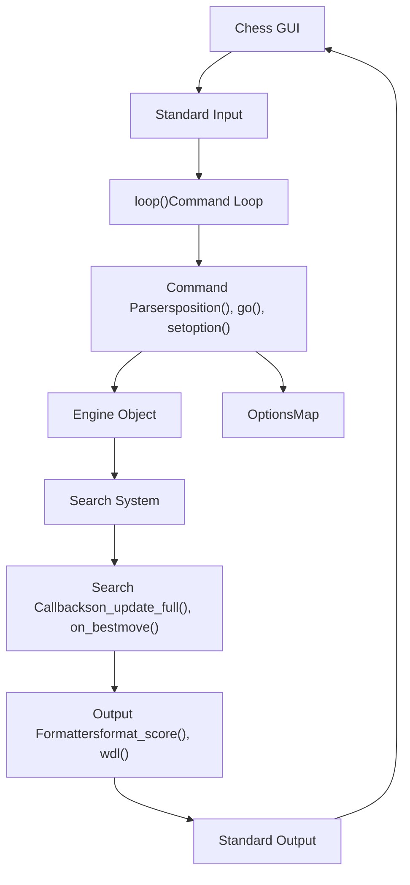
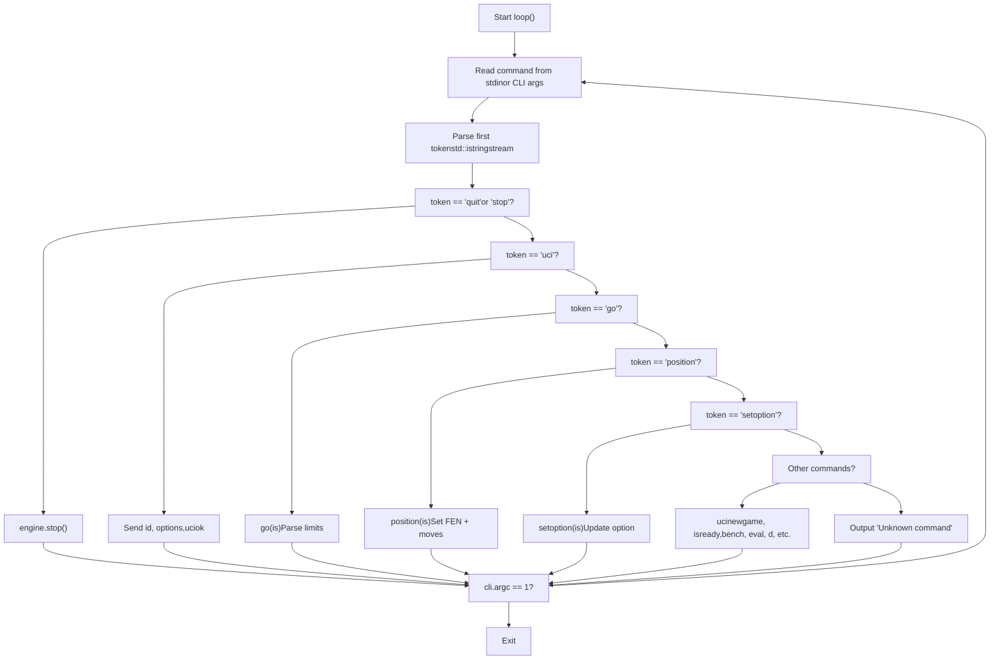
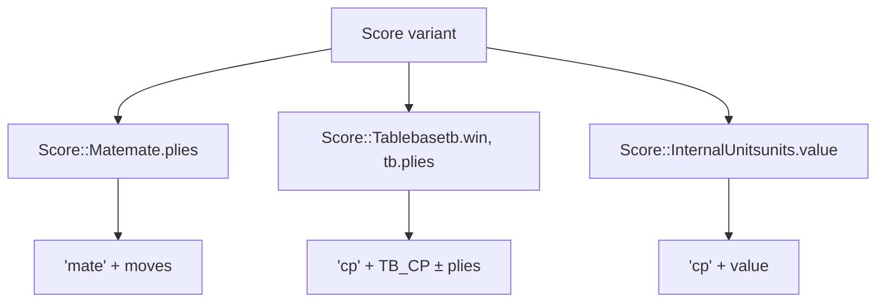
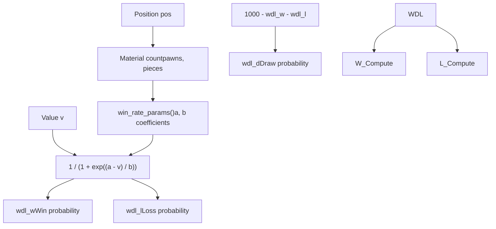
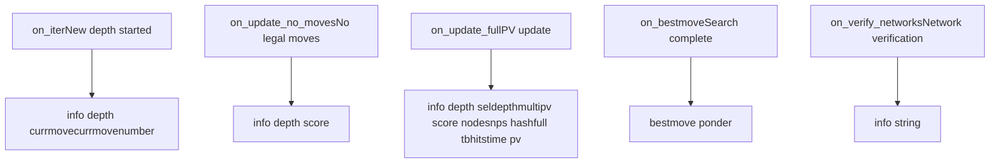

# UCI Protocol Handler

Relevant source files

-   [src/benchmark.cpp](https://github.com/official-stockfish/Stockfish/blob/c27c1747/src/benchmark.cpp)
-   [src/main.cpp](https://github.com/official-stockfish/Stockfish/blob/c27c1747/src/main.cpp)
-   [src/uci.cpp](https://github.com/official-stockfish/Stockfish/blob/c27c1747/src/uci.cpp)

## Purpose and Scope

This document covers the UCI (Universal Chess Interface) protocol implementation in Stockfish, specifically how the engine receives commands from chess GUIs, parses them, executes them, and formats responses. The UCI protocol handler serves as the primary interface between external applications (chess GUIs, APIs, command-line users) and the engine core.

For information about UCI option configuration and management, see [UCI Options and Configuration](/official-stockfish/Stockfish/6.2-uci-options-and-configuration). For details about the search engine that the UCI handler controls, see [Search System](/official-stockfish/Stockfish/4-search-system).

## Architecture Overview

The UCI protocol handler is implemented in the `UCIEngine` class, which wraps the core `Engine` object and provides UCI-compliant command parsing and output formatting. The handler manages a command loop that continuously reads from standard input, parses UCI commands, and writes formatted responses to standard output.


**Diagram: UCI Protocol Handler Architecture**

Sources: [src/uci.cpp67-86](https://github.com/official-stockfish/Stockfish/blob/c27c1747/src/uci.cpp#L67-L86) [src/uci.cpp88-179](https://github.com/official-stockfish/Stockfish/blob/c27c1747/src/uci.cpp#L88-L179)

## Main Command Loop

The UCI command loop is implemented in the `UCIEngine::loop()` method, which continuously reads commands from standard input and dispatches them to appropriate handlers. The loop supports both interactive mode (waiting for stdin) and command-line argument mode (one-shot execution).


**Diagram: UCI Command Loop Flow**

The loop continues until it receives a "quit" command or exhausts command-line arguments. Each iteration parses one command and invokes the appropriate handler.

Sources: [src/uci.cpp88-179](https://github.com/official-stockfish/Stockfish/blob/c27c1747/src/uci.cpp#L88-L179)

## Command Parsing

### Position Command

The `position()` method parses FEN strings and move sequences to set up the board position. It supports two modes:

| Mode | Syntax | Description |
| --- | --- | --- |
| startpos | `position startpos moves e2e4 e7e5` | Starts from initial position |
| fen | `position fen <FEN> moves <moves>` | Starts from specified FEN |

The parser extracts the FEN string (or uses `StartFEN` constant for startpos), then collects all subsequent move strings and passes them to `engine.set_position()`.

Sources: [src/uci.cpp474-498](https://github.com/official-stockfish/Stockfish/blob/c27c1747/src/uci.cpp#L474-L498) [src/uci.cpp46](https://github.com/official-stockfish/Stockfish/blob/c27c1747/src/uci.cpp#L46-L46)

### Go Command and Search Limits

The `go()` method parses search parameters and initiates a search. It delegates limit parsing to `parse_limits()`, which extracts various search constraints:

```mermaid
flowchart TD
    wtime["wtimeWhite clock"]
    btime["btimeBlack clock"]
    winc["wincWhite increment"]
    binc["bincBlack increment"]
    movestogo["movestogoMoves to time control"]
    depth["depthMax depth"]
    nodes["nodesMax nodes"]
    movetime["movetimeExact time"]
    mate["mateMate in N"]
    perft["perftPerft depth"]
    infinite["infiniteSearch until stop"]
    ponderMode["ponderModePondering flag"]
    searchmoves["searchmovesRestrict to moves"]
    go["go command"]
    parse_limits["parse_limits(is)"]
    engine_go["engine.go(limits)"]

    go --> parse_limits
    parse --> limits_wtime
    parse --> limits_btime
    parse --> limits_winc
    parse --> limits_binc
    parse --> limits_movestogo
    parse --> limits_depth
    parse --> limits_nodes
    parse --> limits_movetime
    parse --> limits_mate
    parse --> limits_perft
    parse --> limits_infinite
    parse --> limits_ponderMode
    parse --> limits_searchmoves
    parse --> limits_engine_go
```


**Diagram: Search Limits Parsing**

The `parse_limits()` function returns a `Search::LimitsType` structure containing all parsed constraints. Special handling exists for `perft` mode, which performs a perft calculation instead of a search.

Sources: [src/uci.cpp181-218](https://github.com/official-stockfish/Stockfish/blob/c27c1747/src/uci.cpp#L181-L218) [src/uci.cpp220-228](https://github.com/official-stockfish/Stockfish/blob/c27c1747/src/uci.cpp#L220-L228)

### Setoption Command

The `setoption()` method delegates to the engine's options system. It waits for any ongoing search to finish before applying option changes:

```
void UCIEngine::setoption(std::istringstream& is) {
    engine.wait_for_search_finished();
    engine.get_options().setoption(is);
}
```
The actual option parsing is handled by the `OptionsMap` class (see [UCI Options and Configuration](/official-stockfish/Stockfish/6.2-uci-options-and-configuration)).

Sources: [src/uci.cpp463-466](https://github.com/official-stockfish/Stockfish/blob/c27c1747/src/uci.cpp#L463-L466)

### Standard UCI Commands

The command loop handles all standard UCI protocol commands:

| Command | Handler | Description |
| --- | --- | --- |
| `uci` | Inline in loop | Sends engine identification and options |
| `isready` | Inline in loop | Responds with `readyok` |
| `ucinewgame` | `engine.search_clear()` | Clears search history and transposition table |
| `stop` | `engine.stop()` | Stops ongoing search |
| `quit` | Sets loop exit condition | Terminates the engine |
| `ponderhit` | `engine.set_ponderhit(false)` | Confirms pondering move was played |

Sources: [src/uci.cpp105-137](https://github.com/official-stockfish/Stockfish/blob/c27c1747/src/uci.cpp#L105-L137)

### Debug and Testing Commands

Stockfish extends UCI with several non-standard commands for debugging and testing:

| Command | Handler | Description |
| --- | --- | --- |
| `bench` | `bench(is)` | Runs standard benchmark suite |
| `speedtest` | `benchmark(is)` | Runs comprehensive performance test |
| `d` | `engine.visualize()` | Displays current board position |
| `eval` | `engine.trace_eval()` | Shows detailed evaluation breakdown |
| `flip` | `engine.flip()` | Flips board perspective |
| `compiler` | Outputs compiler info | Shows compilation details |
| `export_net` | `engine.save_network()` | Exports NNUE network files |

Sources: [src/uci.cpp141-176](https://github.com/official-stockfish/Stockfish/blob/c27c1747/src/uci.cpp#L141-L176)

## Score and Information Formatting

### Score Types and Formatting

The UCI protocol requires specific formatting for different types of scores. The `format_score()` method handles three score types using a variant visitor pattern:


**Diagram: Score Formatting Logic**

The formatting rules are:

-   **Mate scores**: Formatted as `mate N` where N is the number of moves to mate (plies divided by 2)
-   **Tablebase scores**: Formatted as `cp 20000±plies` for winning/losing positions
-   **Internal units**: Formatted as `cp VALUE` where VALUE is the raw engine evaluation

Sources: [src/uci.cpp536-552](https://github.com/official-stockfish/Stockfish/blob/c27c1747/src/uci.cpp#L536-L552)

### Centipawn Conversion

The `to_cp()` method converts internal engine values to centipawns using the WDL model. This provides more accurate centipawn values that correlate with actual winning chances:

```
int UCIEngine::to_cp(Value v, const Position& pos) {
    auto [a, b] = win_rate_params(pos);
    return std::round(100 * int(v) / a);
}
```
The conversion uses material-dependent parameters `a` and `b` derived from the win rate model (see WDL Statistics section below).

Sources: [src/uci.cpp556-565](https://github.com/official-stockfish/Stockfish/blob/c27c1747/src/uci.cpp#L556-L565)

### WDL (Win/Draw/Loss) Statistics

The `wdl()` method calculates win/draw/loss probabilities based on the evaluation score using a fitted model:


**Diagram: WDL Calculation Flow**

The model uses polynomial functions fitted to Long Time Control (LTC) fishtest statistics. The material count determines the `a` and `b` parameters, which are then used in a sigmoid function to calculate win probability.

The WDL output format is three integers (in per mille): `W D L`, e.g., `480 350 170` means 48% win, 35% draw, 17% loss.

Sources: [src/uci.cpp500-534](https://github.com/official-stockfish/Stockfish/blob/c27c1747/src/uci.cpp#L500-L534) [src/uci.cpp567-576](https://github.com/official-stockfish/Stockfish/blob/c27c1747/src/uci.cpp#L567-L576)

### Move Notation

The `move()` and `square()` methods convert internal move representation to UCI notation:

| Internal | UCI Notation | Notes |
| --- | --- | --- |
| Move(e2, e4, NORMAL) | `e2e4` | Standard move |
| Move(e1, h1, CASTLING) | `e1g1` | Kingside castling (or `e1h1` in Chess960) |
| Move(e7, e8, PROMOTION, QUEEN) | `e7e8q` | Promotion with piece type |
| Move::none() | `(none)` | Invalid/no move |
| Move::null() | `0000` | Null move |

The Chess960 flag determines whether castling moves use king-to-rook notation (`e1h1`) or king-to-destination notation (`e1g1`).

Sources: [src/uci.cpp578-601](https://github.com/official-stockfish/Stockfish/blob/c27c1747/src/uci.cpp#L578-L601)

### Move Parsing

The `to_move()` method converts UCI move strings back to internal `Move` objects by generating all legal moves and matching against the string:

```
Move UCIEngine::to_move(const Position& pos, std::string str) {
    str = to_lower(str);
    for (const auto& m : MoveList<LEGAL>(pos))
        if (str == move(m, pos.is_chess960()))
            return m;
    return Move::none();
}
```
Sources: [src/uci.cpp610-618](https://github.com/official-stockfish/Stockfish/blob/c27c1747/src/uci.cpp#L610-L618)

## Engine Communication and Callbacks

### Search Update Listeners

The `UCIEngine` class registers callback functions with the engine to receive search progress updates. These callbacks are initialized in `init_search_update_listeners()`:


**Diagram: Search Callback Flow**

Sources: [src/uci.cpp79-86](https://github.com/official-stockfish/Stockfish/blob/c27c1747/src/uci.cpp#L79-L86)

### Info Output Format

The `on_update_full()` method produces the most comprehensive search information output:

```
void UCIEngine::on_update_full(const Engine::InfoFull& info, bool showWDL) {
    std::stringstream ss;

    ss << "info";
    ss << " depth " << info.depth
       << " seldepth " << info.selDepth
       << " multipv " << info.multiPV
       << " score " << format_score(info.score);

    if (!info.bound.empty())
        ss << " " << info.bound;

    if (showWDL)
        ss << " wdl " << info.wdl;

    ss << " nodes " << info.nodes
       << " nps " << info.nps
       << " hashfull " << info.hashfull
       << " tbhits " << info.tbHits
       << " time " << info.timeMs
       << " pv " << info.pv;

    sync_cout << ss.str() << sync_endl;
}
```
The `Engine::InfoFull` structure contains all search statistics:

| Field | Type | Description |
| --- | --- | --- |
| depth | int | Current search depth |
| selDepth | int | Selective search depth (maximum depth reached) |
| multiPV | int | Multi-PV line number |
| score | Score | Evaluation score (mate/tablebase/centipawn) |
| bound | string | Score bound type ("lowerbound" or "upperbound") |
| wdl | string | Win/draw/loss probabilities |
| nodes | uint64\_t | Nodes searched |
| nps | uint64\_t | Nodes per second |
| hashfull | int | Transposition table usage (per mille) |
| tbHits | uint64\_t | Tablebase probe hits |
| timeMs | TimePoint | Time elapsed in milliseconds |
| pv | string | Principal variation (best line) |

Sources: [src/uci.cpp624-647](https://github.com/official-stockfish/Stockfish/blob/c27c1747/src/uci.cpp#L624-L647)

### Iteration Updates

The `on_iter()` method outputs information about the current move being searched at the root:

```
void UCIEngine::on_iter(const Engine::InfoIter& info) {
    std::stringstream ss;
    ss << "info";
    ss << " depth " << info.depth
       << " currmove " << info.currmove
       << " currmovenumber " << info.currmovenumber;
    sync_cout << ss.str() << sync_endl;
}
```
This provides feedback during long searches, showing which move is currently being analyzed.

Sources: [src/uci.cpp649-658](https://github.com/official-stockfish/Stockfish/blob/c27c1747/src/uci.cpp#L649-L658)

### Bestmove Output

The `on_bestmove()` callback outputs the final search result:

```
void UCIEngine::on_bestmove(std::string_view bestmove, std::string_view ponder) {
    sync_cout << "bestmove " << bestmove;
    if (!ponder.empty())
        std::cout << " ponder " << ponder;
    std::cout << sync_endl;
}
```
The output includes:

-   **bestmove**: The best move found (in UCI notation)
-   **ponder** (optional): The expected opponent response for pondering

Sources: [src/uci.cpp660-665](https://github.com/official-stockfish/Stockfish/blob/c27c1747/src/uci.cpp#L660-L665)

### Info String Messages

The `print_info_string()` method outputs informational messages to the GUI:

```
void UCIEngine::print_info_string(std::string_view str) {
    sync_cout_start();
    for (auto& line : split(str, "\n"))
    {
        if (!is_whitespace(line))
            std::cout << "info string " << line << '\n';
    }
    sync_cout_end();
}
```
This is used for non-search information such as:

-   NUMA configuration details
-   Thread allocation information
-   Network verification results
-   Build and compiler information

Sources: [src/uci.cpp55-65](https://github.com/official-stockfish/Stockfish/blob/c27c1747/src/uci.cpp#L55-L65)

## Benchmarking Support

### Standard Bench Command

The `bench()` method runs a standardized benchmark suite over a set of test positions:

> **[Mermaid sequence]**
> *(图表结构无法解析)*

**Diagram: Bench Command Sequence**

The benchmark uses default positions from `Benchmark::Defaults` or loads custom positions from a file. It measures total nodes searched and nodes per second.

Sources: [src/uci.cpp230-297](https://github.com/official-stockfish/Stockfish/blob/c27c1747/src/uci.cpp#L230-L297) [src/benchmark.cpp390-442](https://github.com/official-stockfish/Stockfish/blob/c27c1747/src/benchmark.cpp#L390-L442)

### Speedtest Benchmark

The `benchmark()` method (invoked with `speedtest` command) runs a comprehensive performance benchmark:

-   Uses pre-defined game positions from real games
-   Scales time per position based on ply number (simulating realistic time controls)
-   Measures hash table utilization
-   Reports detailed statistics including thread binding and NUMA configuration

Key differences from standard bench:

-   More realistic time distribution
-   Hash utilization metrics
-   Warmup positions
-   Configurable total duration

Sources: [src/uci.cpp299-461](https://github.com/official-stockfish/Stockfish/blob/c27c1747/src/uci.cpp#L299-L461) [src/benchmark.cpp444-514](https://github.com/official-stockfish/Stockfish/blob/c27c1747/src/benchmark.cpp#L444-L514)

## Thread Safety and I/O

All UCI output uses thread-safe I/O primitives:

| Primitive | Usage | Description |
| --- | --- | --- |
| `sync_cout_start()` | Begin output block | Acquires I/O lock |
| `sync_cout_end()` | End output block | Releases I/O lock |
| `sync_cout` | Stream manipulator | Acquires lock for single statement |
| `sync_endl` | Stream manipulator | Flushes and releases lock |

This ensures that output from multiple search threads doesn't get interleaved in the UCI stream.

Sources: [src/uci.cpp56-64](https://github.com/official-stockfish/Stockfish/blob/c27c1747/src/uci.cpp#L56-L64) [src/uci.cpp117-120](https://github.com/official-stockfish/Stockfish/blob/c27c1747/src/uci.cpp#L117-L120)

## Summary

The UCI Protocol Handler in Stockfish provides a complete implementation of the Universal Chess Interface standard, with extensions for debugging and performance testing. The `UCIEngine` class orchestrates command parsing, engine control, and output formatting, serving as the bridge between external chess GUIs and the search engine core. The handler's modular design separates concerns between command parsing, score formatting, and engine communication, making it maintainable and extensible.
