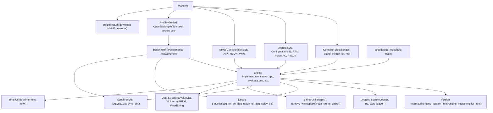
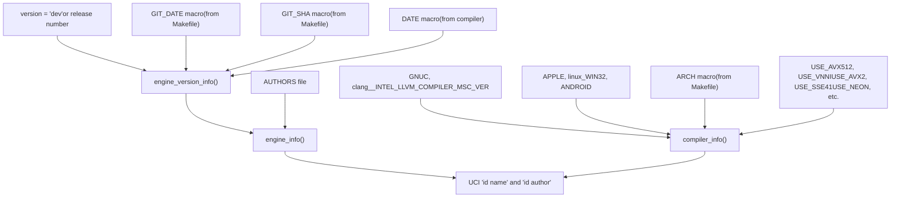

# Infrastructure and Support

Relevant source files

-   [AUTHORS](https://github.com/official-stockfish/Stockfish/blob/c27c1747/AUTHORS)
-   [src/Makefile](https://github.com/official-stockfish/Stockfish/blob/c27c1747/src/Makefile)
-   [src/misc.cpp](https://github.com/official-stockfish/Stockfish/blob/c27c1747/src/misc.cpp)
-   [src/misc.h](https://github.com/official-stockfish/Stockfish/blob/c27c1747/src/misc.h)

## Overview

This section documents the infrastructure and support systems that enable Stockfish development, compilation, testing, and deployment. These systems provide the foundation upon which the core chess engine is built.

The infrastructure consists of three main subsystems:

1.  **Build System** (see [7.1](/official-stockfish/Stockfish/7.1-build-system)) - The Makefile-based compilation infrastructure supporting multiple platforms, compilers, and architectures with profile-guided optimization
2.  **Utilities and Support Functions** (see [7.2](/official-stockfish/Stockfish/7.2-utilities-and-support-functions)) - Helper functions for logging, debugging, string manipulation, and runtime utilities
3.  **Testing and Benchmarking** (see [7.3](/official-stockfish/Stockfish/7.3-testing-and-benchmarking)) - Performance measurement and regression testing facilities

These subsystems are independent but complementary. The build system compiles the code, the utilities provide runtime support, and the testing facilities validate performance.

Sources: [src/Makefile](https://github.com/official-stockfish/Stockfish/blob/c27c1747/src/Makefile) [src/misc.cpp](https://github.com/official-stockfish/Stockfish/blob/c27c1747/src/misc.cpp) [src/misc.h](https://github.com/official-stockfish/Stockfish/blob/c27c1747/src/misc.h)

---

## Infrastructure Architecture

The following diagram shows how the infrastructure components relate to each other and to the core engine:


**Infrastructure Component Relationships**

The build system (Makefile) orchestrates compilation with architecture-specific optimizations. Profile-guided optimization uses the benchmark to generate profiling data that guides the compiler's optimization decisions. The utilities provide runtime support for logging, debugging, and data manipulation that the core engine uses throughout execution. Testing facilities measure performance and validate changes.

Sources: [src/Makefile1-1165](https://github.com/official-stockfish/Stockfish/blob/c27c1747/src/Makefile#L1-L1165) [src/misc.cpp1-528](https://github.com/official-stockfish/Stockfish/blob/c27c1747/src/misc.cpp#L1-L528) [src/misc.h1-458](https://github.com/official-stockfish/Stockfish/blob/c27c1747/src/misc.h#L1-L458)

---

## Build System Overview

The Makefile-based build system supports:

| Component | Description |
| --- | --- |
| **Compilers** | gcc, clang, MinGW, Intel ICX, Android NDK |
| **Architectures** | x86-64 (various SIMD levels), x86-32, ARM (v7/v8), PowerPC, RISC-V, LoongArch, Apple Silicon |
| **SIMD Extensions** | SSE2, SSSE3, SSE4.1, AVX2, AVX-VNNI, AVX-512, AVX-512-ICL, NEON, Altivec |
| **Build Modes** | Release (optimized), Debug, Sanitizers (address, thread, undefined) |
| **PGO Support** | Instrumented builds → profiling → optimized rebuild |

The build system automatically detects the native architecture and selects appropriate compiler flags. It supports cross-compilation for Android, Windows (via MinGW), and various embedded platforms.

**Key Makefile Targets:**

-   `make build` - Standard build without profile-guided optimization
-   `make profile-build` - Four-step PGO build (instrument → profile → optimize → cleanup)
-   `make net` - Download default NNUE network files
-   `make strip` - Strip debug symbols from executable
-   `make clean` - Remove all build artifacts

For detailed documentation of compiler flags, architecture options, and build procedures, see [7.1 Build System](/official-stockfish/Stockfish/7.1-build-system).

Sources: [src/Makefile1-165](https://github.com/official-stockfish/Stockfish/blob/c27c1747/src/Makefile#L1-L165) [src/Makefile432-887](https://github.com/official-stockfish/Stockfish/blob/c27c1747/src/Makefile#L432-L887) [src/Makefile899-1040](https://github.com/official-stockfish/Stockfish/blob/c27c1747/src/Makefile#L899-L1040)

---

## Utilities and Support Functions Overview

The `misc.cpp` and `misc.h` files provide essential runtime utilities used throughout Stockfish:

```mermaid
flowchart TD
    TimePoint["TimePoint, now()"]
    Prefetch["prefetch(addr)"]
    HashCombine["hash_combine()"]
    CommandLine["CommandLine utilities"]
    ValueList["ValueList"]
    MultiArray["MultiArray"]
    PRNG["PRNG (xorshift64star)"]
    FixedString["FixedString"]
    Split["split(s, delimiter)"]
    ReadFile["read_file_to_string(path)"]
    RemoveWS["remove_whitespace(s)"]
    IsWS["is_whitespace(s)"]
    StrToSize["str_to_size_t(s)"]
    SyncCout["SyncCout enumIO_LOCK, IO_UNLOCK"]
    SyncMacros["sync_cout, sync_endl macros"]
    Mutex["std::mutex for cout"]
    HitOn["dbg_hit_on(cond, slot)"]
    DbgPrint["dbg_print()"]
    MeanOf["dbg_mean_of(value, slot)"]
    StdevOf["dbg_stdev_of(value, slot)"]
    ExtremesOf["dbg_extremes_of(value, slot)"]
    CorrelOf["dbg_correl_of(v1, v2, slot)"]
    DbgClear["dbg_clear()"]
    Logger["Logger class"]
    Tie["Tie streambuf"]
    StartLog["start_logger(fname)"]
    VInfo["engine_version_info()"]
    GitMacros["GIT_SHA, GIT_DATE, ARCHcompile-time macros"]
    CInfo["compiler_info()"]
    EInfo["engine_info()"]

    SyncCout --> SyncMacros
    Mutex --> SyncCout
    HitOn --> DbgPrint
    MeanOf --> DbgPrint
    StdevOf --> DbgPrint
    ExtremesOf --> DbgPrint
    CorrelOf --> DbgPrint
    DbgClear --> DbgPrint
    Logger --> Tie
    StartLog --> Logger
    GitMacros --> VInfo
    GitMacros --> CInfo
    VInfo --> EInfo
```


**Utility Categories:**

1.  **Version Information** - Assembles version strings from git SHA, build date, architecture, and compiler
2.  **Logging** - Redirects stdin/stdout to file for debugging UCI protocol interactions
3.  **Debug Statistics** - Collects runtime statistics (hit rates, means, correlations) for development tuning
4.  **I/O Synchronization** - Thread-safe console output using `sync_cout` and `sync_endl` macros
5.  **String/File Utilities** - Helper functions for parsing and file I/O
6.  **Data Structures** - Generic containers and PRNG for internal use
7.  **Performance Utilities** - Memory prefetching and timing functions

These utilities are header-only or have minimal dependencies, making them usable from any part of the codebase. For detailed API documentation, see [7.2 Utilities and Support Functions](/official-stockfish/Stockfish/7.2-utilities-and-support-functions).

Sources: [src/misc.cpp40-433](https://github.com/official-stockfish/Stockfish/blob/c27c1747/src/misc.cpp#L40-L433) [src/misc.h44-446](https://github.com/official-stockfish/Stockfish/blob/c27c1747/src/misc.h#L44-L446)

---

## Version and Build Information

Stockfish reports detailed version and build configuration through three functions in `misc.cpp`:


**Version String Format:**

For development builds (version == "dev"):

```
Stockfish dev-YYYYMMDD-SHA
```
For release builds:

```
Stockfish 17
```
**Compiler Information Format:**

The `compiler_info()` function returns a detailed multi-line string:

```
Compiled by                : clang++ 15.0.7
Compilation architecture   : x86-64-avx2
Compilation settings       : 64bit AVX2 BMI2 POPCNT
Compiler __VERSION__ macro : (compiler version string)
```
This information is extracted from preprocessor macros set by the Makefile during compilation:

| Macro | Source | Purpose |
| --- | --- | --- |
| `GIT_SHA` | Git repository | 8-character commit hash |
| `GIT_DATE` | Git repository | Commit date in YYYYMMDD format |
| `ARCH` | Makefile | Target architecture (e.g., x86-64-avx2) |
| `USE_AVX2`, `USE_VNNI`, etc. | Makefile | SIMD instruction set flags |

The Makefile extracts git information at compile time:

```
GIT_SHA := $(shell git rev-parse HEAD 2>/dev/null | cut -c 1-8)
GIT_DATE := $(shell git show -s --date=format:'%Y%m%d' --format=%cd HEAD 2>/dev/null)
```
When users report bugs or performance issues, this version information helps developers identify the exact build configuration and source code version.

Sources: [src/misc.cpp127-283](https://github.com/official-stockfish/Stockfish/blob/c27c1747/src/misc.cpp#L127-L283) [src/Makefile836-851](https://github.com/official-stockfish/Stockfish/blob/c27c1747/src/Makefile#L836-L851) [AUTHORS1-276](https://github.com/official-stockfish/Stockfish/blob/c27c1747/AUTHORS#L1-L276)

---

## Testing and Benchmarking Overview

The benchmarking system provides standardized performance measurement for:

-   **Regression Testing** - Detecting performance changes between versions
-   **Profile-Guided Optimization** - Generating representative workload for PGO compilation
-   **Hardware Comparison** - Measuring nodes-per-second across different CPUs
-   **NUMA Configuration** - Validating thread binding and memory placement

The `benchmark()` function executes a suite of predefined chess positions at various depths, reporting:

-   Total nodes searched
-   Nodes per second (NPS)
-   Search time
-   Thread utilization

The benchmark is invoked during profile-guided optimization builds and can be run manually via UCI commands. For detailed documentation of benchmark positions, command options, and performance analysis, see [7.3 Testing and Benchmarking](/official-stockfish/Stockfish/7.3-testing-and-benchmarking).

Sources: [src/Makefile66-67](https://github.com/official-stockfish/Stockfish/blob/c27c1747/src/Makefile#L66-L67) [src/Makefile988-1002](https://github.com/official-stockfish/Stockfish/blob/c27c1747/src/Makefile#L988-L1002)

---

## Key Data Structures

The utilities module provides several generic data structures used throughout the codebase:

### ValueList

A fixed-capacity, stack-allocated list with O(1) append and access:

```
template<typename T, std::size_t MaxSize>
class ValueList
```
Used for move generation where the maximum number of moves per position is known (218 for legal moves). Avoids heap allocation overhead.

### MultiArray

A multi-dimensional array template supporting arbitrary dimensions:

```
template<typename T, std::size_t Size, std::size_t... Sizes>
class MultiArray
```
Used for large, fixed-size tables like history tables, which have dimensions indexed by piece, square, and move type.

### PRNG

A xorshift64star pseudo-random number generator:

```
class PRNG {
    uint64_t s;
    uint64_t rand64();
public:
    PRNG(uint64_t seed);
    template<typename T> T rand();
    template<typename T> T sparse_rand();
};
```
Used for Zobrist hashing initialization and move ordering randomization. The `sparse_rand()` variant generates values with only 1/8 of bits set, useful for magic bitboard candidate generation.

### FixedString

A fixed-capacity string with stack allocation:

```
template<std::size_t Capacity>
class FixedString
```
Used for UCI option names and other small strings where heap allocation would be wasteful.

Sources: [src/misc.h132-395](https://github.com/official-stockfish/Stockfish/blob/c27c1747/src/misc.h#L132-L395)

---

## Compiler and Platform Detection

The utilities handle platform-specific code through compile-time detection:

| Detection | Macros | Purpose |
| --- | --- | --- |
| **Compiler** | `__GNUC__`, `__clang__`, `__INTEL_LLVM_COMPILER`, `_MSC_VER` | Select compiler-specific extensions |
| **Platform** | `_WIN32`, `_WIN64`, `__linux__`, `__APPLE__`, `__ANDROID__` | Handle OS-specific APIs |
| **Threading** | `USE_PTHREADS` vs Windows threads | Select threading implementation |
| **Endianness** | Test on `Le` variable | Runtime or compile-time detection |
| **64-bit** | `IS_64BIT` | Enable 64-bit specific optimizations |
| **SIMD** | `USE_AVX512`, `USE_AVX2`, `USE_NEON`, etc. | Enable instruction set extensions |

The `prefetch()` function demonstrates platform-specific code:

```
#ifdef NO_PREFETCH
void prefetch(const void*) {}
#else
void prefetch(const void* addr) {
    #if defined(_MSC_VER)
    _mm_prefetch((char const*) addr, _MM_HINT_T0);
    #else
    __builtin_prefetch(addr);
    #endif
}
#endif
```
This allows Stockfish to use optimal implementations while maintaining portability across compilers and architectures.

Sources: [src/misc.cpp435-450](https://github.com/official-stockfish/Stockfish/blob/c27c1747/src/misc.cpp#L435-L450) [src/misc.h423-446](https://github.com/official-stockfish/Stockfish/blob/c27c1747/src/misc.h#L423-L446) [src/Makefile630-656](https://github.com/official-stockfish/Stockfish/blob/c27c1747/src/Makefile#L630-L656)

---

## Thread-Safe Console Output

Multi-threaded search requires synchronized console output to prevent garbled UCI messages. The `SyncCout` system provides this:

```
enum SyncCout { IO_LOCK, IO_UNLOCK };
std::ostream& operator<<(std::ostream& os, SyncCout sc);

#define sync_cout std::cout << IO_LOCK
#define sync_endl std::endl << IO_UNLOCK
```
Usage:

```
sync_cout << "info depth " << depth << " nodes " << nodes << sync_endl;
```
The overloaded `operator<<` for `SyncCout` locks a mutex when `IO_LOCK` is written and unlocks when `IO_UNLOCK` is written. This ensures that an entire line of output is written atomically, preventing interleaved output from multiple search threads.

Sources: [src/misc.cpp415-429](https://github.com/official-stockfish/Stockfish/blob/c27c1747/src/misc.cpp#L415-L429) [src/misc.h115-125](https://github.com/official-stockfish/Stockfish/blob/c27c1747/src/misc.h#L115-L125)

---

## Summary

The infrastructure and support systems provide:

1.  **Build System** - Cross-platform compilation with extensive architecture support and profile-guided optimization
2.  **Utilities** - Runtime support for logging, debugging, string processing, and thread-safe I/O
3.  **Testing** - Standardized performance measurement for regression detection and optimization

These systems enable Stockfish to compile and run efficiently on diverse hardware platforms while providing developers with tools for debugging, profiling, and performance analysis.

For detailed information:

-   Build system details: [7.1 Build System](/official-stockfish/Stockfish/7.1-build-system)
-   Utility API reference: [7.2 Utilities and Support Functions](/official-stockfish/Stockfish/7.2-utilities-and-support-functions)
-   Testing procedures: [7.3 Testing and Benchmarking](/official-stockfish/Stockfish/7.3-testing-and-benchmarking)
