# Utilities and Support Functions

Relevant source files

-   [src/misc.cpp](https://github.com/official-stockfish/Stockfish/blob/c27c1747/src/misc.cpp)
-   [src/misc.h](https://github.com/official-stockfish/Stockfish/blob/c27c1747/src/misc.h)

This document covers the infrastructure and utility systems that support Stockfish's core chess engine functionality. These utilities provide essential services including logging, debugging, thread-safe I/O, memory management, string processing, and platform abstraction. The utilities are primarily implemented in the `misc.h` and `misc.cpp` files and serve as foundational components used throughout the engine.

For information about the build system and compilation infrastructure, see [Build System](/official-stockfish/Stockfish/7.1-build-system). For testing and benchmarking tools, see [Testing and Benchmarking](/official-stockfish/Stockfish/7.3-testing-and-benchmarking).

## Overview of Utility Systems

The utility infrastructure in Stockfish consists of several key subsystems that provide foundational services to the chess engine:

```mermaid
flowchart TD
    Prefetch["prefetch()Cache Preloading"]
    PRNG["PRNG Classxorshift64star"]
    MathUtils["Mathematical Utilitiesmul_hi64()"]
    Logger["Logger ClassTie Streams"]
    SyncIO["Thread-Safe I/OSyncCout, sync_cout"]
    DebugStats["Debug Statisticsdbg_hit_on(), dbg_mean_of()"]
    VersionInfo["engine_version_info()engine_info()"]
    StringUtils["String Processingsplit(), remove_whitespace()"]
    FileUtils["File Operationsread_file_to_string()"]
    TimeUtils["Time ManagementTimePoint, now()"]
    ValueList["ValueListFixed-Size Container"]
    MultiArray["MultiArrayN-Dimensional Array"]
    CommandLine["CommandLineArgument Processing"]
    PlatformDetect["Platform DetectionCompiler Info"]
    PathUtils["Path UtilitiesDirectory Management"]
    Endianness["Endianness DetectionIsLittleEndian"]

    CommandLine --> PathUtils
    Logger --> SyncIO
    DebugStats --> SyncIO
    VersionInfo --> StringUtils
    FileUtils --> StringUtils
```
Sources: [src/misc.h1-338](https://github.com/official-stockfish/Stockfish/blob/c27c1747/src/misc.h#L1-L338) [src/misc.cpp1-527](https://github.com/official-stockfish/Stockfish/blob/c27c1747/src/misc.cpp#L1-L527)

## Version and Engine Information

Stockfish provides comprehensive version and compiler information through dedicated utility functions:

| Function | Purpose | Return Type |
| --- | --- | --- |
| `engine_version_info()` | Returns full version string with git information | `std::string` |
| `engine_info(bool to_uci)` | Returns engine info formatted for UCI or display | `std::string` |
| `compiler_info()` | Returns detailed compilation and platform information | `std::string` |

The version system automatically incorporates git commit information during development builds:

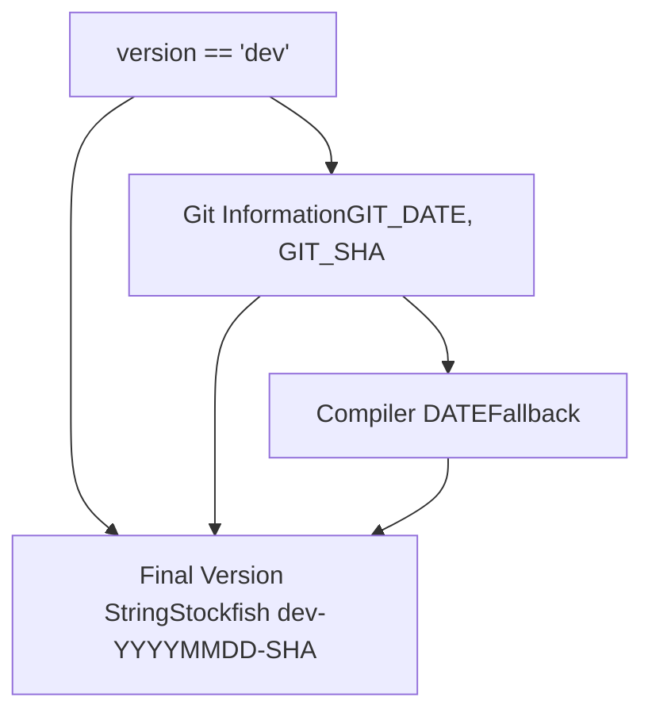
Sources: [src/misc.cpp127-162](https://github.com/official-stockfish/Stockfish/blob/c27c1747/src/misc.cpp#L127-L162) [src/misc.cpp166-283](https://github.com/official-stockfish/Stockfish/blob/c27c1747/src/misc.cpp#L166-L283)

## Logging System

The logging system provides a sophisticated mechanism for redirecting standard I/O streams to log files without modifying existing code:

### Tie Stream Architecture


The `Tie` class intercepts stream operations and duplicates them to both the original stream and the log file, with prefixes indicating input (`>>`) and output (`<<`) operations.

Sources: [src/misc.cpp51-111](https://github.com/official-stockfish/Stockfish/blob/c27c1747/src/misc.cpp#L51-L111)

## Debug Statistics System

Stockfish includes a comprehensive debugging system for collecting runtime statistics during engine development and tuning:

### Statistical Collection Functions

| Function | Purpose | Data Collected |
| --- | --- | --- |
| `dbg_hit_on(bool cond, int slot)` | Tracks conditional hit rates | Total calls, successful hits |
| `dbg_mean_of(int64_t value, int slot)` | Calculates average values | Count, sum |
| `dbg_stdev_of(int64_t value, int slot)` | Tracks standard deviation | Count, sum, sum of squares |
| `dbg_extremes_of(int64_t value, int slot)` | Records min/max values | Count, minimum, maximum |
| `dbg_correl_of(int64_t v1, int64_t v2, int slot)` | Measures correlation | Two-variable statistics |

The system supports up to 32 concurrent debugging slots (`MaxDebugSlots = 32`) for different measurements:

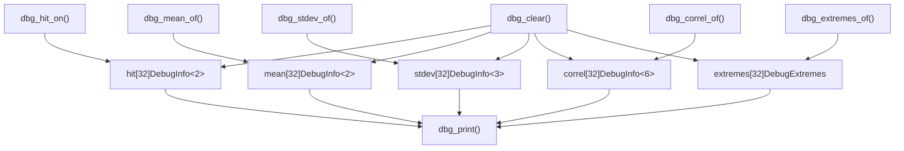
Sources: [src/misc.cpp287-411](https://github.com/official-stockfish/Stockfish/blob/c27c1747/src/misc.cpp#L287-L411)

## Thread-Safe I/O System

Stockfish implements a thread-safe console output system to prevent garbled output in multi-threaded search:

### SyncCout Implementation

The system uses the `SyncCout` enum and overloaded stream operator to provide mutex-protected console access through convenient macros.

Sources: [src/misc.cpp415-429](https://github.com/official-stockfish/Stockfish/blob/c27c1747/src/misc.cpp#L415-L429) [src/misc.h111-121](https://github.com/official-stockfish/Stockfish/blob/c27c1747/src/misc.h#L111-L121)

## Memory and Performance Utilities

### Cache Prefetching

The `prefetch()` function provides platform-specific cache preloading to improve memory access performance:

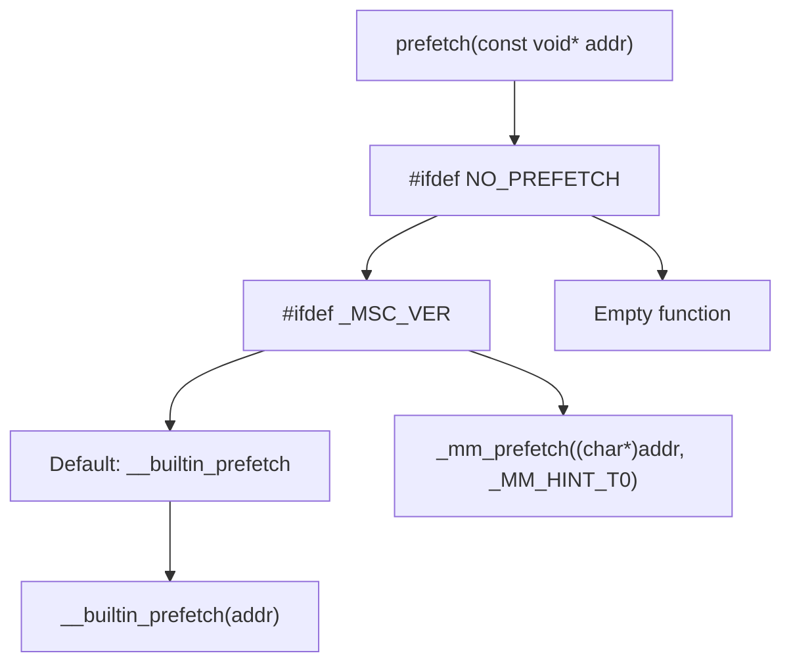
Sources: [src/misc.cpp435-450](https://github.com/official-stockfish/Stockfish/blob/c27c1747/src/misc.cpp#L435-L450)

### High-Precision Multiplication

The `mul_hi64()` function provides efficient 64-bit multiplication with 128-bit intermediate results:

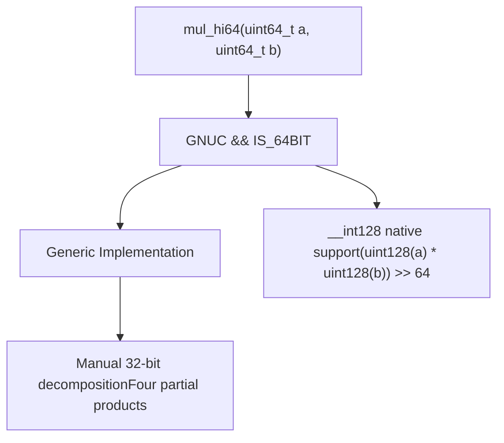
Sources: [src/misc.h279-291](https://github.com/official-stockfish/Stockfish/blob/c27c1747/src/misc.h#L279-L291)

## Data Structure Utilities

### ValueList Template

The `ValueList` template provides a fixed-size container optimized for small collections:

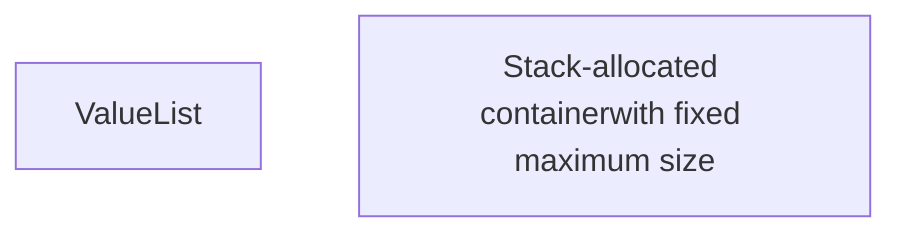
### MultiArray Template

The `MultiArray` template implements N-dimensional arrays with compile-time dimensions:

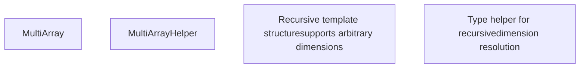
Sources: [src/misc.h128-232](https://github.com/official-stockfish/Stockfish/blob/c27c1747/src/misc.h#L128-L232)

## String and File Processing

Stockfish provides various string manipulation and file I/O utilities:

### String Processing Functions

| Function | Purpose | Implementation |
| --- | --- | --- |
| `split(string_view s, string_view delimiter)` | Splits string by delimiter | Returns `vector<string_view>` |
| `remove_whitespace(string& s)` | Removes all whitespace in-place | Uses `std::remove_if` with `std::isspace` |
| `is_whitespace(string_view s)` | Checks if string contains only whitespace | Uses `std::all_of` with `std::isspace` |
| `str_to_size_t(const string& s)` | Safe string to size\_t conversion | Bounds checking with exit on overflow |

### File Operations

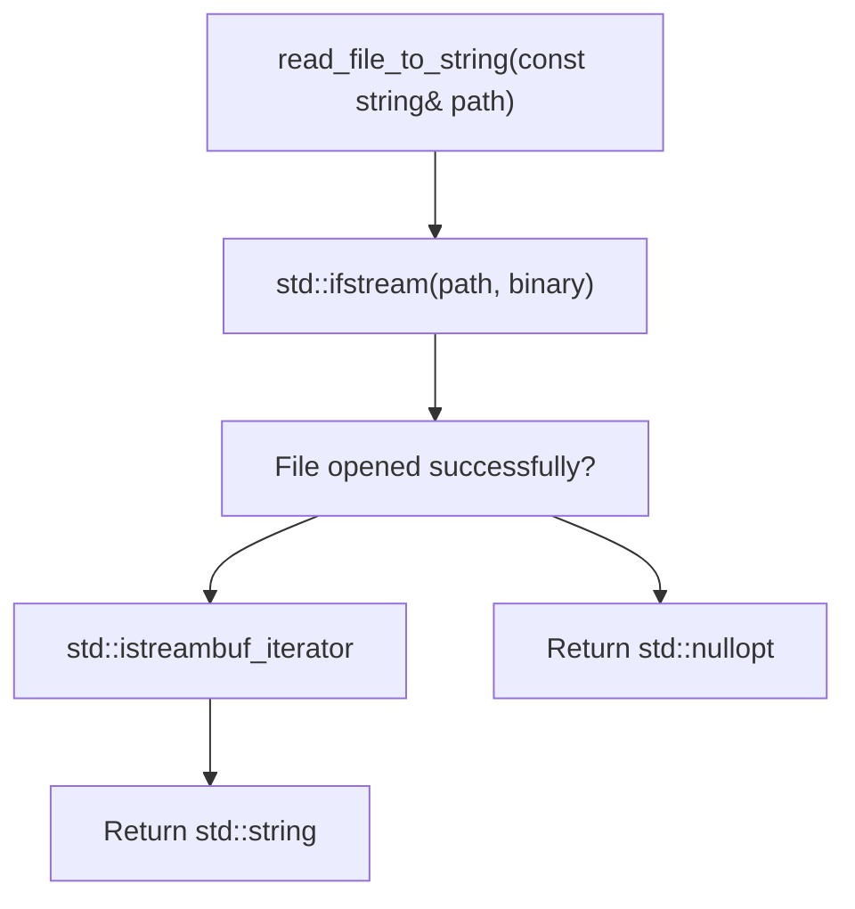
Sources: [src/misc.h86-109](https://github.com/official-stockfish/Stockfish/blob/c27c1747/src/misc.h#L86-L109) [src/misc.cpp460-480](https://github.com/official-stockfish/Stockfish/blob/c27c1747/src/misc.cpp#L460-L480)

## Platform Abstraction

### CommandLine Utilities

The `CommandLine` class provides cross-platform utilities for handling command-line arguments and directory operations:

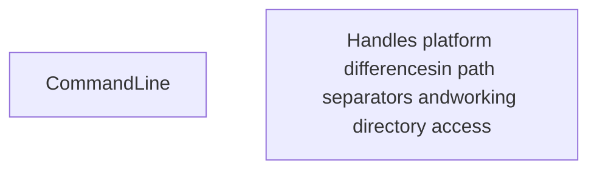
### Platform-Specific Implementations

| Feature | Windows | Unix/Linux | Implementation |
| --- | --- | --- | --- |
| Path Separator | `\\` | `/` | Conditional compilation |
| Working Directory | `_getcwd()` | `getcwd()` | `GETCWD` macro |
| Program Path | `_get_pgmptr()` | `argv[0]` | MSVC-specific handling |

Sources: [src/misc.cpp482-524](https://github.com/official-stockfish/Stockfish/blob/c27c1747/src/misc.cpp#L482-L524) [src/misc.h294-305](https://github.com/official-stockfish/Stockfish/blob/c27c1747/src/misc.h#L294-L305)

## PRNG and Mathematical Utilities

### xorshift64star Pseudo-Random Number Generator

Stockfish implements a high-quality PRNG based on Sebastiano Vigna's xorshift64star algorithm:

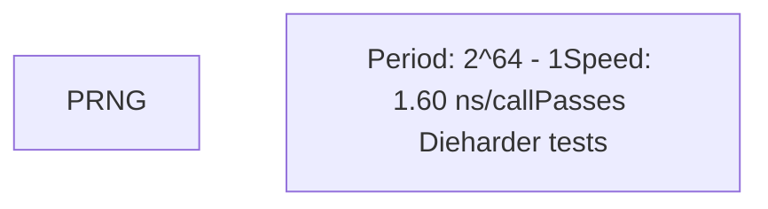
The `sparse_rand()` method produces values with only 1/8th of bits set on average, useful for generating magic numbers in bitboard operations.

Sources: [src/misc.h250-277](https://github.com/official-stockfish/Stockfish/blob/c27c1747/src/misc.h#L250-L277)

## Compiler and Build Integration

### Compiler Hint Macros

Stockfish provides compiler-specific optimization hints through the `sf_assume()` macro:

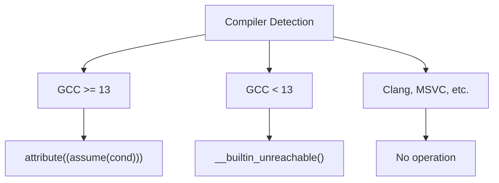
### Endianness Detection

The system provides compile-time endianness detection through a simple but effective method:

```
static inline const std::uint16_t Le = 1;
static inline const bool IsLittleEndian = *reinterpret_cast<const char*>(&Le) == 1;
```
Sources: [src/misc.h320-334](https://github.com/official-stockfish/Stockfish/blob/c27c1747/src/misc.h#L320-L334) [src/misc.h124-125](https://github.com/official-stockfish/Stockfish/blob/c27c1747/src/misc.h#L124-L125)
