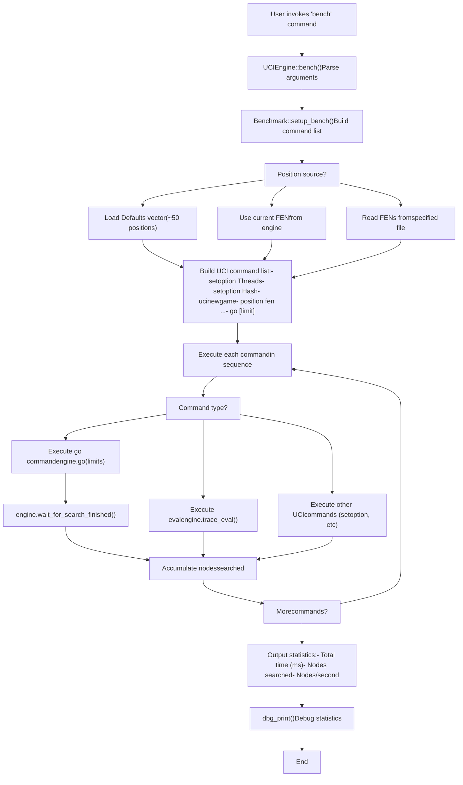
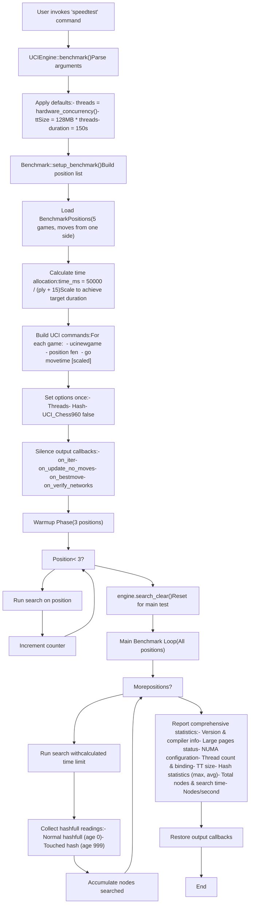
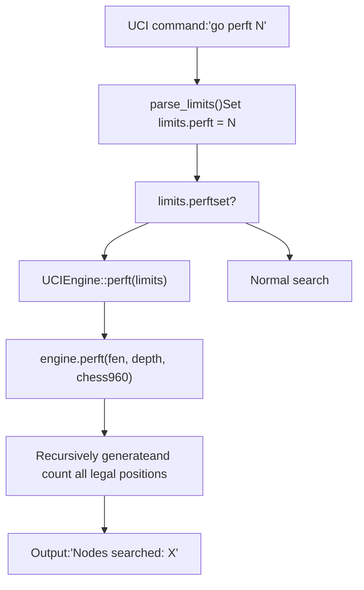
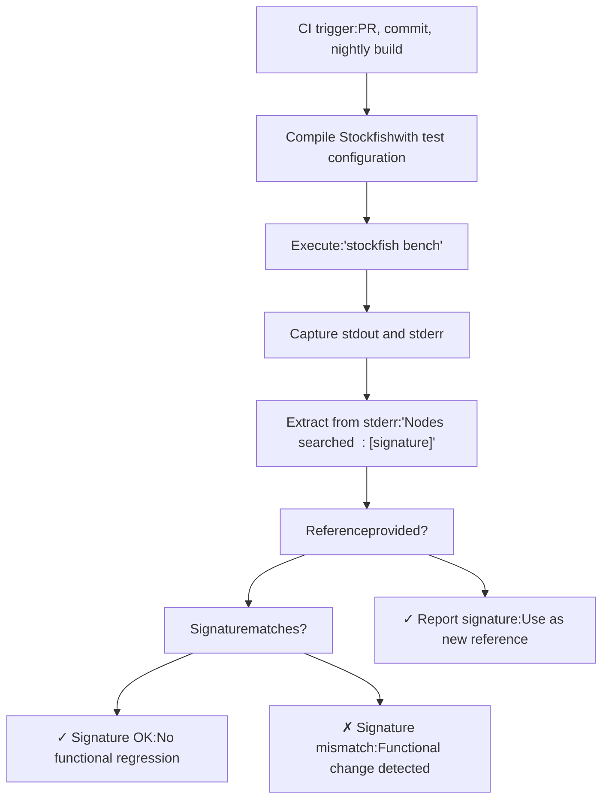
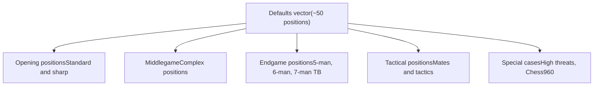
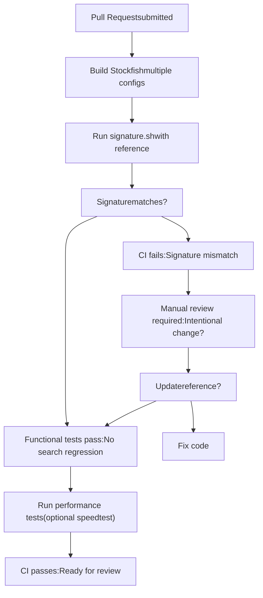

# Testing and Benchmarking

Relevant source files

-   [src/benchmark.cpp](https://github.com/official-stockfish/Stockfish/blob/c27c1747/src/benchmark.cpp)
-   [src/main.cpp](https://github.com/official-stockfish/Stockfish/blob/c27c1747/src/main.cpp)
-   [src/uci.cpp](https://github.com/official-stockfish/Stockfish/blob/c27c1747/src/uci.cpp)

## Purpose and Scope

This document describes Stockfish's testing and benchmarking infrastructure, including the `bench` and `speedtest` commands for performance measurement, the `perft` command for move generation validation, and the signature verification system used in continuous integration. For information about the build system and compilation options, see [Build System](/official-stockfish/Stockfish/7.1-build-system). For utility functions and debugging support, see [Utilities and Support Functions](/official-stockfish/Stockfish/7.2-utilities-and-support-functions).

## Overview

Stockfish provides multiple testing and benchmarking tools to measure performance, validate correctness, and detect regressions:

-   **bench**: A quick, configurable benchmark that runs search on a set of positions
-   **speedtest**: A comprehensive, standardized benchmark for consistent performance comparisons
-   **perft**: Move generation validation through node counting at specified depths
-   **signature verification**: A deterministic node count used for regression detection in CI

All benchmarking commands are invoked through the UCI interface and are implemented as extensions to the standard UCI protocol.

Sources: [src/uci.cpp143-146](https://github.com/official-stockfish/Stockfish/blob/c27c1747/src/uci.cpp#L143-L146) [src/uci.cpp230-297](https://github.com/official-stockfish/Stockfish/blob/c27c1747/src/uci.cpp#L230-L297) [src/uci.cpp299-461](https://github.com/official-stockfish/Stockfish/blob/c27c1747/src/uci.cpp#L299-L461) [src/uci.cpp468-472](https://github.com/official-stockfish/Stockfish/blob/c27c1747/src/uci.cpp#L468-L472)

## The bench Command

### Purpose and Usage

The `bench` command provides a flexible benchmarking tool that can be customized for different testing scenarios. It is the primary tool for generating the "signature" used in CI regression testing.

**Syntax**:

```
bench [ttSize] [threads] [limit] [fenFile] [limitType]
```
**Parameters** (all optional, with defaults):

-   `ttSize`: Hash table size in MB (default: 16)
-   `threads`: Number of search threads (default: 1)
-   `limit`: Search limit value (default: 13)
-   `fenFile`: Position source - "default", "current", or file path (default: "default")
-   `limitType`: Type of limit - "depth", "nodes", "movetime", "perft", or "eval" (default: "depth")

**Examples**:

```
bench                            # Search default positions to depth 13
bench 64 1 15                    # Search default positions to depth 15 with 64 MB hash
bench 64 1 100000 default nodes  # Search for 100K nodes per position
bench 64 4 5000 current movetime # Search current position with 4 threads for 5 seconds
bench 16 1 5 custom.fen perft    # Run perft 5 on positions in custom.fen
```
Sources: [src/benchmark.cpp379-390](https://github.com/official-stockfish/Stockfish/blob/c27c1747/src/benchmark.cpp#L379-L390) [src/uci.cpp230-244](https://github.com/official-stockfish/Stockfish/blob/c27c1747/src/uci.cpp#L230-L244)

### Execution Flow


Sources: [src/uci.cpp230-297](https://github.com/official-stockfish/Stockfish/blob/c27c1747/src/uci.cpp#L230-L297) [src/benchmark.cpp390-442](https://github.com/official-stockfish/Stockfish/blob/c27c1747/src/benchmark.cpp#L390-L442)

### Implementation Details

The `bench` command is implemented in `UCIEngine::bench()` and uses `Benchmark::setup_bench()` to construct a list of UCI commands:

| Component | File Location | Responsibility |
| --- | --- | --- |
| Command handler | [src/uci.cpp230-297](https://github.com/official-stockfish/Stockfish/blob/c27c1747/src/uci.cpp#L230-L297) | Parses arguments, executes commands, reports statistics |
| Setup function | [src/benchmark.cpp390-442](https://github.com/official-stockfish/Stockfish/blob/c27c1747/src/benchmark.cpp#L390-L442) | Builds UCI command list from parameters |
| Default positions | [src/benchmark.cpp30-96](https://github.com/official-stockfish/Stockfish/blob/c27c1747/src/benchmark.cpp#L30-L96) | Standard position set (~50 positions) |
| Node tracking | [src/uci.cpp232-270](https://github.com/official-stockfish/Stockfish/blob/c27c1747/src/uci.cpp#L232-L270) | Captures nodes searched via callback |

The node count is tracked by setting a custom `on_update_full` callback that captures the `nodes` field from `Engine::InfoFull` during search.

Sources: [src/uci.cpp230-297](https://github.com/official-stockfish/Stockfish/blob/c27c1747/src/uci.cpp#L230-L297) [src/benchmark.cpp390-442](https://github.com/official-stockfish/Stockfish/blob/c27c1747/src/benchmark.cpp#L390-L442)

## The speedtest Command

### Purpose and Design

The `speedtest` command (also called `benchmark` internally) provides a standardized, comprehensive benchmark designed for consistent performance comparisons. Unlike `bench`, it uses a fixed set of game positions with realistic time allocations to better simulate actual play conditions.

**Syntax**:

```
speedtest [threads] [ttSize] [duration]
```
**Parameters** (all optional, with defaults):

-   `threads`: Number of threads (default: hardware concurrency)
-   `ttSize`: Hash size in MB (default: 128 MB per thread)
-   `duration`: Total benchmark duration in seconds (default: 150)

**Key Differences from bench**:

-   Uses realistic game positions (5 complete games)
-   Time allocation varies by ply to simulate real game conditions
-   Includes warmup phase (3 positions) for cache stability
-   Collects detailed system information (NUMA, thread binding, hashfull statistics)
-   Silences most output during execution for cleaner results
-   More suitable for performance regression detection

Sources: [src/uci.cpp299-461](https://github.com/official-stockfish/Stockfish/blob/c27c1747/src/uci.cpp#L299-L461) [src/benchmark.cpp444-514](https://github.com/official-stockfish/Stockfish/blob/c27c1747/src/benchmark.cpp#L444-L514)

### Execution Flow and Statistics


Sources: [src/uci.cpp299-461](https://github.com/official-stockfish/Stockfish/blob/c27c1747/src/uci.cpp#L299-L461) [src/benchmark.cpp444-514](https://github.com/official-stockfish/Stockfish/blob/c27c1747/src/benchmark.cpp#L444-L514)

### Time Allocation Model

The `speedtest` command uses a ply-based time allocation formula to simulate realistic game conditions:

**Formula**: `time_ms = 50000 / (ply + 15)`

This formula is chosen to match typical LTC (Long Time Control) game time distributions:

-   Move 10 gets approximately 2000ms
-   Opening moves get more time
-   Late middlegame/endgame moves get less time

The total time is then scaled to achieve the desired benchmark duration:

```
scale_factor = (desired_duration_s * 1000) / total_calculated_time
final_time_ms = calculated_time_ms * scale_factor
```
Sources: [src/benchmark.cpp474-496](https://github.com/official-stockfish/Stockfish/blob/c27c1747/src/benchmark.cpp#L474-L496)

### Statistics Collected

The `speedtest` command collects comprehensive performance metrics:

| Metric | Description | Usage |
| --- | --- | --- |
| **Total nodes searched** | Cumulative nodes across all positions | Primary performance measure |
| **Total search time** | Milliseconds spent searching (excludes setup) | For nps calculation |
| **Nodes/second** | `(nodes * 1000) / time_ms` | Standard performance metric |
| **Hashfull (normal)** | Max and average TT fill (age 0) | Memory utilization |
| **Hashfull (touched)** | Max and average touched hash (age 999) | Hash replacement effectiveness |
| **Version info** | Engine version string | Reproducibility |
| **Compiler info** | Compiler and optimization flags | Build validation |
| **Thread binding** | NUMA node assignments | Hardware utilization |

Sources: [src/uci.cpp369-458](https://github.com/official-stockfish/Stockfish/blob/c27c1747/src/uci.cpp#L369-L458)

## Perft Testing

### Purpose and Implementation

The `perft` (performance test) command validates move generation correctness by counting all nodes at a specified depth. It is primarily used for debugging and ensuring the move generator produces the correct number of legal positions.

**Invocation**: `go perft [depth]`

The perft command is handled by `UCIEngine::perft()`, which calls `Engine::perft()` with the current position and specified depth.


Sources: [src/uci.cpp224-228](https://github.com/official-stockfish/Stockfish/blob/c27c1747/src/uci.cpp#L224-L228) [src/uci.cpp468-472](https://github.com/official-stockfish/Stockfish/blob/c27c1747/src/uci.cpp#L468-L472)

### Usage in Testing

Perft is commonly used in the following scenarios:

1.  **Move generation validation**: Verify that the move generator produces the expected number of positions
2.  **Debugging**: Identify specific positions where move generation differs from reference implementations
3.  **Performance profiling**: Measure raw move generation speed (though search benchmarks are more relevant for engine strength)

Example perft results for the starting position:

```
go perft 1  -> 20 nodes    (20 legal moves)
go perft 2  -> 400 nodes   (20 moves * 20 responses average)
go perft 3  -> 8902 nodes
go perft 4  -> 197281 nodes
go perft 5  -> 4865609 nodes
go perft 6  -> 119060324 nodes
```
Sources: [src/uci.cpp468-472](https://github.com/official-stockfish/Stockfish/blob/c27c1747/src/uci.cpp#L468-L472)

## Signature Verification

### Overview and Purpose

The "signature" is a deterministic node count produced by running `bench` with default parameters. It serves as a fingerprint to detect functional changes between engine versions. Any change that affects search behavior (evaluation, move ordering, pruning, etc.) will alter the signature, making it an effective regression detection tool.

**Standard signature command**: `bench` (uses defaults: 16 MB hash, 1 thread, depth 13)

Sources: [tests/signature.sh1-41](https://github.com/official-stockfish/Stockfish/blob/c27c1747/tests/signature.sh#L1-L41)

### Signature Verification Process


Sources: [tests/signature.sh1-41](https://github.com/official-stockfish/Stockfish/blob/c27c1747/tests/signature.sh#L1-L41)

### Implementation

The signature verification is implemented in `tests/signature.sh`:

**Key components**:

| Line Range | Function |
| --- | --- |
| [tests/signature.sh21-22](https://github.com/official-stockfish/Stockfish/blob/c27c1747/tests/signature.sh#L21-L22) | Execute bench and capture output |
| [tests/signature.sh22](https://github.com/official-stockfish/Stockfish/blob/c27c1747/tests/signature.sh#L22-L22) | Extract signature using awk: `awk '{print $4}'` |
| [tests/signature.sh26-37](https://github.com/official-stockfish/Stockfish/blob/c27c1747/tests/signature.sh#L26-L37) | Compare to reference if provided |
| [tests/signature.sh39-40](https://github.com/official-stockfish/Stockfish/blob/c27c1747/tests/signature.sh#L39-L40) | Output signature for use as reference |

**Usage patterns**:

```
# Generate new signature (no verification)
./signature.sh

# Verify against reference
./signature.sh 1234567890

# Typical output on match
# signature OK: 1234567890

# Typical output on mismatch
# signature mismatch: reference 1234567890 obtained: 9876543210
```
Sources: [tests/signature.sh1-41](https://github.com/official-stockfish/Stockfish/blob/c27c1747/tests/signature.sh#L1-L41)

### When Signatures Change

Signature changes are **expected** when:

-   Evaluation function is modified
-   Search heuristics are adjusted
-   Move ordering changes
-   Pruning conditions are altered
-   Any functional change that affects search decisions

Signature changes are **unexpected** when:

-   Only comments or formatting changed
-   Build system or configuration changes
-   Documentation updates
-   Non-functional refactoring

When the signature changes legitimately, the new value becomes the reference for future comparisons.

Sources: [tests/signature.sh26-37](https://github.com/official-stockfish/Stockfish/blob/c27c1747/tests/signature.sh#L26-L37)

## Benchmark Position Sets

### Default Positions (bench)

The `Defaults` vector contains approximately 50 carefully selected positions covering diverse chess scenarios:


**Position categories**:

| Category | Count (approx) | Examples | Purpose |
| --- | --- | --- | --- |
| Standard openings | ~10 | Starting position, common openings | General search testing |
| Complex middlegames | ~15 | Multi-piece tactical battles | Evaluation and pruning stress |
| Endgame positions | ~8 | 5/6/7-man tablebase positions | Tablebase integration testing |
| Tactical puzzles | ~5 | Mate in N, tactical shots | Tactical search validation |
| Special positions | ~5 | High threat count, Chess960 | Edge case coverage |
| Stalemate/mate | ~3 | Drawn/mated positions | Boundary condition testing |

Sources: [src/benchmark.cpp30-96](https://github.com/official-stockfish/Stockfish/blob/c27c1747/src/benchmark.cpp#L30-L96)

### Speedtest Positions (BenchmarkPositions)

The `BenchmarkPositions` vector contains 5 complete games, showing moves from one side only:

**Structure**:

```
Game 1: 59 positions (moves 8-64 for one side)
Game 2: 54 positions (moves 6-57 for one side)
Game 3: 48 positions (moves 8-56 for one side)
Game 4: 46 positions (moves 7-47 for one side)
Game 5: 58 positions (moves 6-64 for one side)

Total: 265 positions
```
**Selection criteria**:

-   Human-randomly picked from LTC (Long Time Control) fishtest games
-   Games with less than 60 moves (focus on opening through middlegame)
-   Moves from only one side to avoid repetition
-   Real game positions for realistic evaluation distribution

Sources: [src/benchmark.cpp100-372](https://github.com/official-stockfish/Stockfish/blob/c27c1747/src/benchmark.cpp#L100-L372) [src/benchmark.cpp444-514](https://github.com/official-stockfish/Stockfish/blob/c27c1747/src/benchmark.cpp#L444-L514)

### Position Set Comparison

| Aspect | Default (bench) | BenchmarkPositions (speedtest) |
| --- | --- | --- |
| **Count** | ~50 positions | 265 positions (5 games) |
| **Source** | Hand-picked test suite | Real game sequences |
| **Variety** | Maximum diversity | Realistic game flow |
| **Purpose** | Quick testing, signature | Performance benchmarking |
| **Time allocation** | Uniform (by depth/nodes) | Ply-based (realistic) |
| **Coverage** | All game phases equally | More opening/middlegame |

Sources: [src/benchmark.cpp30-96](https://github.com/official-stockfish/Stockfish/blob/c27c1747/src/benchmark.cpp#L30-L96) [src/benchmark.cpp100-372](https://github.com/official-stockfish/Stockfish/blob/c27c1747/src/benchmark.cpp#L100-L372)

## Integration with Development Workflow

### Continuous Integration

The signature verification system integrates with CI pipelines to detect regressions:


Sources: [tests/signature.sh1-41](https://github.com/official-stockfish/Stockfish/blob/c27c1747/tests/signature.sh#L1-L41)

### Developer Usage Patterns

**Quick functionality check**:

```
# After code changes, verify no unintended search changes
./stockfish bench
# Compare output to previous signature
```
**Performance comparison**:

```
# Before changes
./stockfish speedtest > baseline.txt

# After changes
./stockfish speedtest > modified.txt

# Compare nodes/second
diff baseline.txt modified.txt
```
**Debugging move generation**:

```
# Verify move generation correctness
echo "position startpos" | ./stockfish
# Then in UCI: go perft 6
# Compare to known correct value: 119060324
```
Sources: [src/uci.cpp143-146](https://github.com/official-stockfish/Stockfish/blob/c27c1747/src/uci.cpp#L143-L146) [src/uci.cpp230-297](https://github.com/official-stockfish/Stockfish/blob/c27c1747/src/uci.cpp#L230-L297) [src/uci.cpp299-461](https://github.com/official-stockfish/Stockfish/blob/c27c1747/src/uci.cpp#L299-L461)

## Debug Statistics

Both `bench` and `speedtest` call `dbg_print()` after completion to output debug statistics. These statistics are only generated in debug builds and provide detailed insight into search behavior:

**Debug statistics categories** (when enabled):

-   Move generation statistics
-   Pruning counters (futility, razoring, null move, etc.)
-   Extension counters
-   Hash table statistics
-   Time management decisions

The debug output helps developers understand the impact of search modifications on different aspects of the search algorithm.

Sources: [src/uci.cpp288](https://github.com/official-stockfish/Stockfish/blob/c27c1747/src/uci.cpp#L288-L288) [src/uci.cpp422](https://github.com/official-stockfish/Stockfish/blob/c27c1747/src/uci.cpp#L422-L422)
