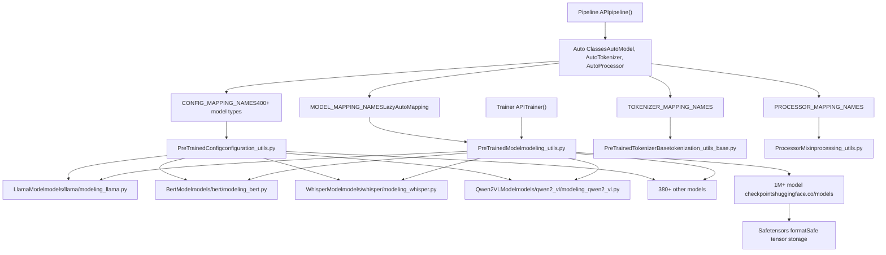
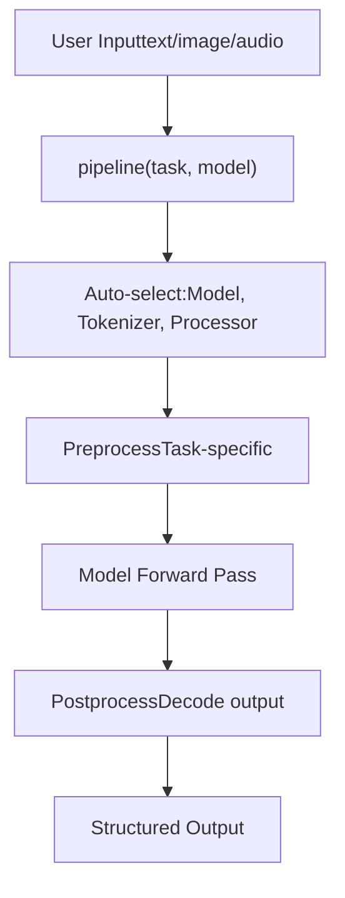
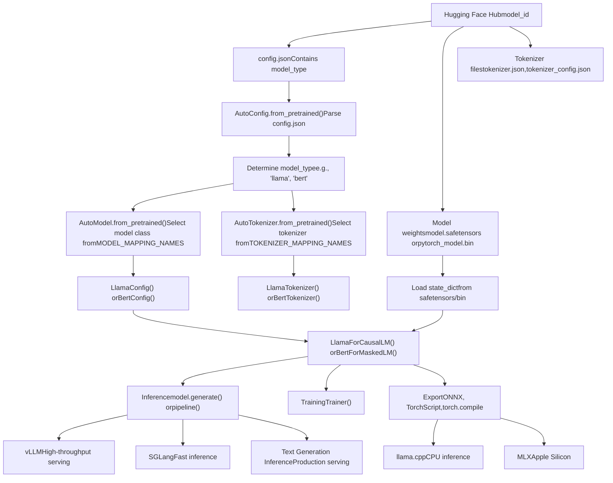
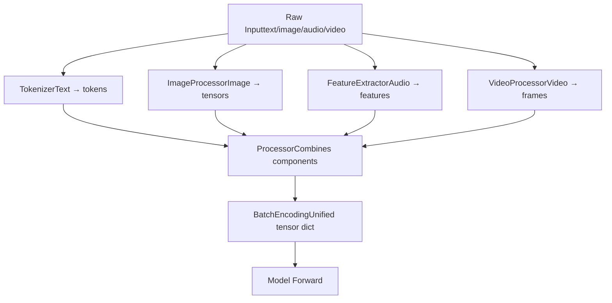
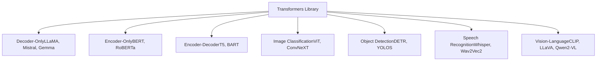

# Overview

Relevant source files

-   [MIGRATION\_GUIDE\_V5.md](https://github.com/huggingface/transformers/blob/9a9997fd/MIGRATION_GUIDE_V5.md?plain=1)
-   [README.md](https://github.com/huggingface/transformers/blob/9a9997fd/README.md?plain=1)
-   [docs/source/en/\_toctree.yml](https://github.com/huggingface/transformers/blob/9a9997fd/docs/source/en/_toctree.yml)
-   [docs/source/en/index.md](https://github.com/huggingface/transformers/blob/9a9997fd/docs/source/en/index.md?plain=1)
-   [docs/source/en/serve-cli/serving.md](https://github.com/huggingface/transformers/blob/9a9997fd/docs/source/en/serve-cli/serving.md?plain=1)
-   [docs/source/ko/\_toctree.yml](https://github.com/huggingface/transformers/blob/9a9997fd/docs/source/ko/_toctree.yml)
-   [src/transformers/\_\_init\_\_.py](https://github.com/huggingface/transformers/blob/9a9997fd/src/transformers/__init__.py)
-   [src/transformers/cli/add\_new\_model\_like.py](https://github.com/huggingface/transformers/blob/9a9997fd/src/transformers/cli/add_new_model_like.py)
-   [src/transformers/cli/chat.py](https://github.com/huggingface/transformers/blob/9a9997fd/src/transformers/cli/chat.py)
-   [src/transformers/cli/download.py](https://github.com/huggingface/transformers/blob/9a9997fd/src/transformers/cli/download.py)
-   [src/transformers/cli/serve.py](https://github.com/huggingface/transformers/blob/9a9997fd/src/transformers/cli/serve.py)
-   [src/transformers/cli/system.py](https://github.com/huggingface/transformers/blob/9a9997fd/src/transformers/cli/system.py)
-   [src/transformers/cli/transformers.py](https://github.com/huggingface/transformers/blob/9a9997fd/src/transformers/cli/transformers.py)
-   [src/transformers/data/datasets/glue.py](https://github.com/huggingface/transformers/blob/9a9997fd/src/transformers/data/datasets/glue.py)
-   [src/transformers/data/processors/glue.py](https://github.com/huggingface/transformers/blob/9a9997fd/src/transformers/data/processors/glue.py)
-   [src/transformers/models/\_\_init\_\_.py](https://github.com/huggingface/transformers/blob/9a9997fd/src/transformers/models/__init__.py)
-   [src/transformers/models/auto/configuration\_auto.py](https://github.com/huggingface/transformers/blob/9a9997fd/src/transformers/models/auto/configuration_auto.py)
-   [src/transformers/models/auto/feature\_extraction\_auto.py](https://github.com/huggingface/transformers/blob/9a9997fd/src/transformers/models/auto/feature_extraction_auto.py)
-   [src/transformers/models/auto/image\_processing\_auto.py](https://github.com/huggingface/transformers/blob/9a9997fd/src/transformers/models/auto/image_processing_auto.py)
-   [src/transformers/models/auto/modeling\_auto.py](https://github.com/huggingface/transformers/blob/9a9997fd/src/transformers/models/auto/modeling_auto.py)
-   [src/transformers/models/auto/processing\_auto.py](https://github.com/huggingface/transformers/blob/9a9997fd/src/transformers/models/auto/processing_auto.py)
-   [src/transformers/models/auto/tokenization\_auto.py](https://github.com/huggingface/transformers/blob/9a9997fd/src/transformers/models/auto/tokenization_auto.py)
-   [src/transformers/models/cohere/tokenization\_cohere.py](https://github.com/huggingface/transformers/blob/9a9997fd/src/transformers/models/cohere/tokenization_cohere.py)
-   [src/transformers/utils/dummy\_pt\_objects.py](https://github.com/huggingface/transformers/blob/9a9997fd/src/transformers/utils/dummy_pt_objects.py)
-   [src/transformers/utils/logging.py](https://github.com/huggingface/transformers/blob/9a9997fd/src/transformers/utils/logging.py)
-   [tests/cli/test\_serve.py](https://github.com/huggingface/transformers/blob/9a9997fd/tests/cli/test_serve.py)
-   [utils/check\_repo.py](https://github.com/huggingface/transformers/blob/9a9997fd/utils/check_repo.py)

**Transformers** is a model-definition framework for state-of-the-art machine learning across text, computer vision, audio, video, and multimodal domains. It provides standardized implementations of 400+ model architectures for both inference and training, serving as the central pivot between the Hugging Face Hub (1M+ model checkpoints), training frameworks (Axolotl, Unsloth, DeepSpeed, FSDP), inference engines (vLLM, SGLang, TGI), and adjacent modeling libraries (llama.cpp, mlx). [README.md67-73](https://github.com/huggingface/transformers/blob/9a9997fd/README.md?plain=1#L67-L73) [docs/source/en/index.md22-28](https://github.com/huggingface/transformers/blob/9a9997fd/docs/source/en/index.md?plain=1#L22-L28)

**Scope of this document**: This page provides a high-level overview of the Transformers library's purpose, architecture, and capabilities. For detailed information about specific systems, see: **Core Architecture** for model loading and tokenization, **Training System** for fine-tuning capabilities, **Generation System** for text generation, **Model Architectures** for specific model families, and **Advanced Features** for quantization and optimization.

## Purpose and Core Philosophy

Transformers centralizes model definitions to ensure compatibility across the machine learning ecosystem. A model implemented in Transformers works seamlessly with multiple frameworks and tools without requiring reimplementation. [README.md70-76](https://github.com/huggingface/transformers/blob/9a9997fd/README.md?plain=1#L70-L76)

**Core design principles**:

1.  **Fast and easy to use**: Every model implementation uses only three base classes: configuration (`PreTrainedConfig`), model (`PreTrainedModel`), and preprocessor (`PreTrainedTokenizerBase`, `ImageProcessingMixin`, etc.). [docs/source/en/index.md54-55](https://github.com/huggingface/transformers/blob/9a9997fd/docs/source/en/index.md?plain=1#L54-L55)
2.  **Pretrained models**: Reduce compute cost and carbon footprint by leveraging pre-existing checkpoints. [docs/source/en/index.md55-56](https://github.com/huggingface/transformers/blob/9a9997fd/docs/source/en/index.md?plain=1#L55-L56)
3.  **Ecosystem compatibility**: Single implementation works across training, inference, and deployment tools. [README.md70-73](https://github.com/huggingface/transformers/blob/9a9997fd/README.md?plain=1#L70-L73)

Sources: [docs/source/en/index.md1-66](https://github.com/huggingface/transformers/blob/9a9997fd/docs/source/en/index.md?plain=1#L1-L66) [README.md67-76](https://github.com/huggingface/transformers/blob/9a9997fd/README.md?plain=1#L67-L76) [src/transformers/\_\_init\_\_.py1-60](https://github.com/huggingface/transformers/blob/9a9997fd/src/transformers/__init__.py#L1-L60)

## Library Architecture

The library is organized into several interconnected subsystems that handle the complete model lifecycle from loading to inference to training.

### High-Level System Organization


Sources: [src/transformers/\_\_init\_\_.py63-274](https://github.com/huggingface/transformers/blob/9a9997fd/src/transformers/__init__.py#L63-L274) [src/transformers/models/auto/configuration\_auto.py34-489](https://github.com/huggingface/transformers/blob/9a9997fd/src/transformers/models/auto/configuration_auto.py#L34-L489) [src/transformers/models/auto/modeling\_auto.py41-490](https://github.com/huggingface/transformers/blob/9a9997fd/src/transformers/models/auto/modeling_auto.py#L41-L490)

## Core Capabilities

### 1\. Model Loading and Inference

The `AutoModel` system provides automatic model class selection based on the `model_type` field in `config.json`. [src/transformers/models/auto/modeling\_auto.py41-490](https://github.com/huggingface/transformers/blob/9a9997fd/src/transformers/models/auto/modeling_auto.py#L41-L490)

| Component | Purpose | Key Classes |
| --- | --- | --- |
| Auto Config | Load configuration | `AutoConfig` [src/transformers/models/auto/configuration\_auto.py14-28](https://github.com/huggingface/transformers/blob/9a9997fd/src/transformers/models/auto/configuration_auto.py#L14-L28) |
| Auto Model | Instantiate model | `AutoModel`, `AutoModelForCausalLM` [src/transformers/models/auto/modeling\_auto.py14-26](https://github.com/huggingface/transformers/blob/9a9997fd/src/transformers/models/auto/modeling_auto.py#L14-L26) |
| Auto Tokenizer | Load tokenizer | `AutoTokenizer` [src/transformers/models/auto/tokenization\_auto.py14-45](https://github.com/huggingface/transformers/blob/9a9997fd/src/transformers/models/auto/tokenization_auto.py#L14-L45) |
| Auto Processor | Load multimodal processor | `AutoProcessor`, `AutoImageProcessor` [src/transformers/models/auto/image\_processing\_auto.py14-43](https://github.com/huggingface/transformers/blob/9a9997fd/src/transformers/models/auto/image_processing_auto.py#L14-L43) |

**Example workflow**:

```
from transformers import AutoModel, AutoTokenizer # Auto classes automatically determine the correct model/tokenizer classmodel = AutoModel.from_pretrained("bert-base-uncased")  # Returns BertModeltokenizer = AutoTokenizer.from_pretrained("bert-base-uncased")  # Returns BertTokenizer
```
Sources: [src/transformers/models/auto/modeling\_auto.py1-490](https://github.com/huggingface/transformers/blob/9a9997fd/src/transformers/models/auto/modeling_auto.py#L1-L490) [src/transformers/models/auto/tokenization\_auto.py1-400](https://github.com/huggingface/transformers/blob/9a9997fd/src/transformers/models/auto/tokenization_auto.py#L1-L400) [src/transformers/models/auto/configuration\_auto.py1-489](https://github.com/huggingface/transformers/blob/9a9997fd/src/transformers/models/auto/configuration_auto.py#L1-L489)

### 2\. High-Level Inference with Pipeline

The `Pipeline` API provides task-oriented inference without requiring manual preprocessing. [docs/source/en/index.md43](https://github.com/huggingface/transformers/blob/9a9997fd/docs/source/en/index.md?plain=1#L43-L43)


**Supported tasks** include: `text-generation`, `text-classification`, `token-classification`, `question-answering`, `summarization`, `translation`, `image-classification`, `object-detection`, `image-segmentation`, `automatic-speech-recognition`, `audio-classification`, `image-to-text`, `visual-question-answering`, `zero-shot-classification`, `zero-shot-image-classification`, and more. [src/transformers/\_\_init\_\_.py138-170](https://github.com/huggingface/transformers/blob/9a9997fd/src/transformers/__init__.py#L138-L170)

Sources: [src/transformers/\_\_init\_\_.py137-169](https://github.com/huggingface/transformers/blob/9a9997fd/src/transformers/__init__.py#L137-L169) [docs/source/en/index.md43](https://github.com/huggingface/transformers/blob/9a9997fd/docs/source/en/index.md?plain=1#L43-L43)

### 3\. Training with Trainer

The `Trainer` class provides a complete training loop with support for distributed training, mixed precision, gradient accumulation, and callbacks. [docs/source/en/index.md44](https://github.com/huggingface/transformers/blob/9a9997fd/docs/source/en/index.md?plain=1#L44-L44)

```
from transformers import Trainer, TrainingArguments training_args = TrainingArguments(    output_dir="./results",    per_device_train_batch_size=8,    num_train_epochs=3,    fp16=True,  # Mixed precision) trainer = Trainer(    model=model,    args=training_args,    train_dataset=train_dataset,    eval_dataset=eval_dataset,) trainer.train()
```
Sources: [src/transformers/\_\_init\_\_.py207-208](https://github.com/huggingface/transformers/blob/9a9997fd/src/transformers/__init__.py#L207-L208) [docs/source/en/index.md44](https://github.com/huggingface/transformers/blob/9a9997fd/docs/source/en/index.md?plain=1#L44-L44)

### 4\. Text Generation

The `generate()` method (from `GenerationMixin`) supports sophisticated autoregressive decoding with configurable strategies, logits processors, and caching. [docs/source/en/index.md45](https://github.com/huggingface/transformers/blob/9a9997fd/docs/source/en/index.md?plain=1#L45-L45) [src/transformers/utils/dummy\_pt\_objects.py187-191](https://github.com/huggingface/transformers/blob/9a9997fd/src/transformers/utils/dummy_pt_objects.py#L187-L191)

Sources: [src/transformers/\_\_init\_\_.py111-119](https://github.com/huggingface/transformers/blob/9a9997fd/src/transformers/__init__.py#L111-L119) [docs/source/en/index.md45](https://github.com/huggingface/transformers/blob/9a9997fd/docs/source/en/index.md?plain=1#L45-L45)

## Model Lifecycle: Hub to Deployment

The following diagram illustrates how models flow from the Hugging Face Hub through the Transformers library to various deployment targets:


Sources: [docs/source/en/index.md22-35](https://github.com/huggingface/transformers/blob/9a9997fd/docs/source/en/index.md?plain=1#L22-L35) [README.md67-78](https://github.com/huggingface/transformers/blob/9a9997fd/README.md?plain=1#L67-L78)

## Key Abstractions and Design Patterns

### Auto Classes with Lazy Loading

The Auto classes use the `_LazyAutoMapping` pattern to defer imports until needed, improving startup time. [src/transformers/models/auto/auto\_factory.py24](https://github.com/huggingface/transformers/blob/9a9997fd/src/transformers/models/auto/auto_factory.py#L24-L24) Mapping dictionaries connect `model_type` strings to class names:

| Mapping Dictionary | Maps To | Example Entry |
| --- | --- | --- |
| `CONFIG_MAPPING_NAMES` | Configuration classes | `("llama", "LlamaConfig")` [src/transformers/models/auto/configuration\_auto.py34-489](https://github.com/huggingface/transformers/blob/9a9997fd/src/transformers/models/auto/configuration_auto.py#L34-L489) |
| `MODEL_MAPPING_NAMES` | Model classes | `("llama", "LlamaModel")` [src/transformers/models/auto/modeling\_auto.py41-490](https://github.com/huggingface/transformers/blob/9a9997fd/src/transformers/models/auto/modeling_auto.py#L41-L490) |
| `TOKENIZER_MAPPING_NAMES` | Tokenizer classes | `("llama", "LlamaTokenizer")` [src/transformers/models/auto/tokenization\_auto.py64-300](https://github.com/huggingface/transformers/blob/9a9997fd/src/transformers/models/auto/tokenization_auto.py#L64-L300) |
| `IMAGE_PROCESSOR_MAPPING_NAMES` | Image processors | `("clip", "CLIPImageProcessor")` [src/transformers/models/auto/image\_processing\_auto.py62-130](https://github.com/huggingface/transformers/blob/9a9997fd/src/transformers/models/auto/image_processing_auto.py#L62-L130) |

Sources: [src/transformers/models/auto/configuration\_auto.py34-489](https://github.com/huggingface/transformers/blob/9a9997fd/src/transformers/models/auto/configuration_auto.py#L34-L489) [src/transformers/models/auto/modeling\_auto.py41-490](https://github.com/huggingface/transformers/blob/9a9997fd/src/transformers/models/auto/modeling_auto.py#L41-L490) [src/transformers/models/auto/tokenization\_auto.py64-300](https://github.com/huggingface/transformers/blob/9a9997fd/src/transformers/models/auto/tokenization_auto.py#L64-L300)

### PreTrainedModel Base Class

All PyTorch models inherit from `PreTrainedModel`, which provides core utilities for weight management, device placement, and Hub integration. [src/transformers/utils/dummy\_pt\_objects.py187-191](https://github.com/huggingface/transformers/blob/9a9997fd/src/transformers/utils/dummy_pt_objects.py#L187-L191)

Sources: [src/transformers/\_\_init\_\_.py452](https://github.com/huggingface/transformers/blob/9a9997fd/src/transformers/__init__.py#L452-L452) [src/transformers/utils/dummy\_pt\_objects.py1-700](https://github.com/huggingface/transformers/blob/9a9997fd/src/transformers/utils/dummy_pt_objects.py#L1-L700)

### Modular Processing Pipeline

Processing components are composable, allowing multimodal inputs to be unified into a single `BatchEncoding` object. [src/transformers/tokenization\_utils\_base.py185](https://github.com/huggingface/transformers/blob/9a9997fd/src/transformers/tokenization_utils_base.py#L185-L185)


Sources: [src/transformers/\_\_init\_\_.py170-177](https://github.com/huggingface/transformers/blob/9a9997fd/src/transformers/__init__.py#L170-L177) [src/transformers/models/auto/processing\_auto.py1-200](https://github.com/huggingface/transformers/blob/9a9997fd/src/transformers/models/auto/processing_auto.py#L1-L200)

## Ecosystem Integration

Transformers serves as the compatibility layer between model definitions and the broader ML ecosystem. [README.md70-73](https://github.com/huggingface/transformers/blob/9a9997fd/README.md?plain=1#L70-L73)

### Training and Inference Frameworks

-   **Accelerate**: Distributed training abstraction (DDP, FSDP, DeepSpeed). [docs/source/en/\_toctree.yml177](https://github.com/huggingface/transformers/blob/9a9997fd/docs/source/en/_toctree.yml#L177-L177)
-   **PEFT**: Parameter-efficient fine-tuning (LoRA, QLoRA). [docs/source/en/\_toctree.yml170](https://github.com/huggingface/transformers/blob/9a9997fd/docs/source/en/_toctree.yml#L170-L170)
-   **Inference Engines**: High-throughput serving via vLLM, SGLang, and TGI. [README.md72](https://github.com/huggingface/transformers/blob/9a9997fd/README.md?plain=1#L72-L72)
-   **Quantization**: Native support for bitsandbytes, GPTQ, AWQ, and more. [docs/source/en/\_toctree.yml207-246](https://github.com/huggingface/transformers/blob/9a9997fd/docs/source/en/_toctree.yml#L207-L246)

Sources: [docs/source/en/index.md22-31](https://github.com/huggingface/transformers/blob/9a9997fd/docs/source/en/index.md?plain=1#L22-L31) [README.md70-73](https://github.com/huggingface/transformers/blob/9a9997fd/README.md?plain=1#L70-L73) [docs/source/en/\_toctree.yml258-298](https://github.com/huggingface/transformers/blob/9a9997fd/docs/source/en/_toctree.yml#L258-L298)

## Supported Modalities and Model Families

The library supports models across multiple modalities, including text (BERT, Llama), vision (ViT, DETR), audio (Whisper), and multimodal (LLaVA, Qwen2-VL). [docs/source/en/index.md22-23](https://github.com/huggingface/transformers/blob/9a9997fd/docs/source/en/index.md?plain=1#L22-L23)


Sources: [docs/source/en/\_toctree.yml450-1096](https://github.com/huggingface/transformers/blob/9a9997fd/docs/source/en/_toctree.yml#L450-L1096) [src/transformers/models/\_\_init\_\_.py1-440](https://github.com/huggingface/transformers/blob/9a9997fd/src/transformers/models/__init__.py#L1-L440)

## Installation and Quick Start

**Requirements**: Python 3.10+, PyTorch 2.4+. [README.md84](https://github.com/huggingface/transformers/blob/9a9997fd/README.md?plain=1#L84-L84)

```
# Basic installationpip install "transformers[torch]" # From source (latest development version)git clone https://github.com/huggingface/transformers.gitcd transformerspip install '.[torch]'
```
Sources: [README.md82-131](https://github.com/huggingface/transformers/blob/9a9997fd/README.md?plain=1#L82-L131) [docs/source/en/index.md39-61](https://github.com/huggingface/transformers/blob/9a9997fd/docs/source/en/index.md?plain=1#L39-L61)
